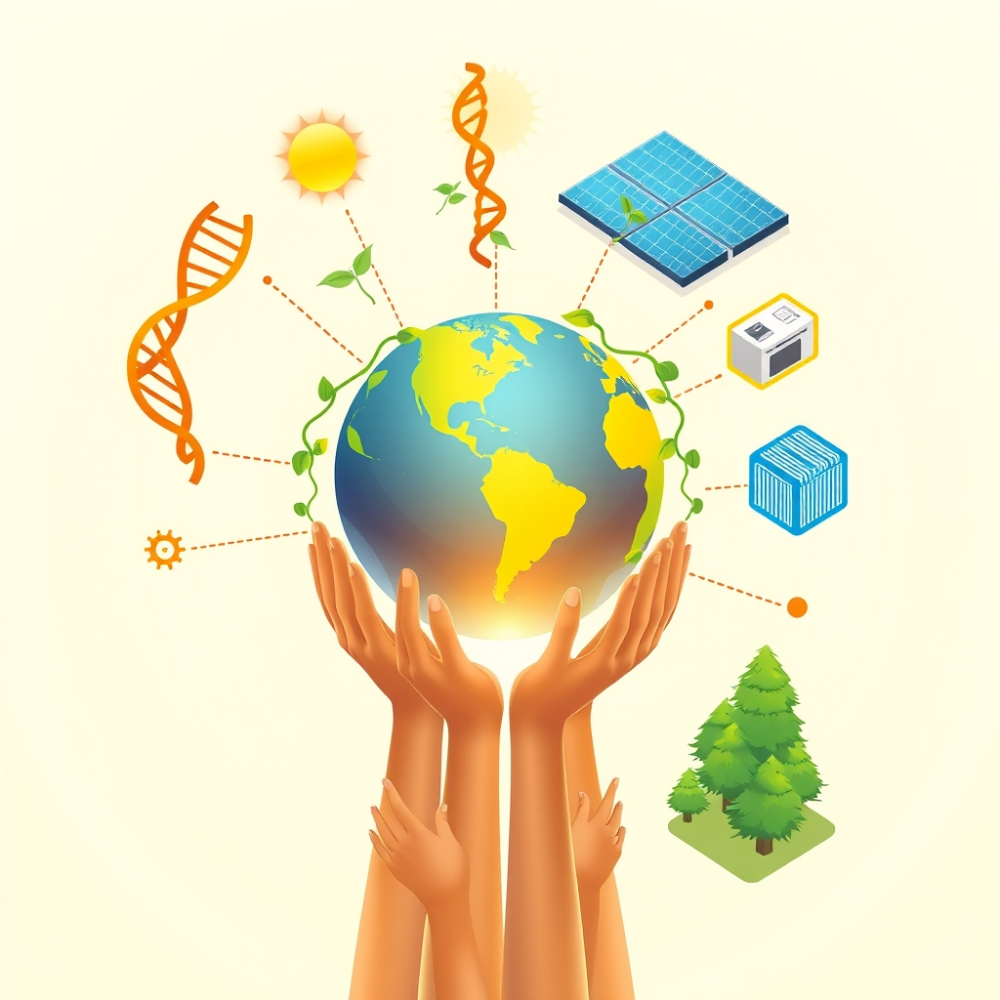

[Home](../index.md) > [🌟 Positivity Bias](./index.md) | [⏮️](./2026-07-19-echoes-of-progress-cultivating-a-brighter-tomorrow.md) [⏭️](./2026-07-21-accelerating-innovations-for-a-brighter-tomorrow.md)  
# 2026-07-20 | 🌟 ☀️ Illuminating Progress: A World United in Innovation 🌟  
  
  
# ☀️ Illuminating Progress: A World United in Innovation  
  
☀️ Welcome to Positivity Bias, your daily dose of uplifting news! Today, July 20, 2026, we spotlight a world where the relentless pursuit of progress continues to shine, marked by groundbreaking scientific endeavors, accelerating environmental victories, and a deepening commitment to collaborative human endeavors. Humanity is actively weaving a more resilient and equitable future, transforming challenges into opportunities for growth and shared well-being. 🌍  
  
### 🔬 Frontiers of Discovery & Well-being  
  
💊 A record-fast clinical trial for an Ebola treatment is underway in the Democratic Republic of Congo, testing two promising antiviral drugs for the Bundibugyo strain, as reported by Good News This Week on July 18. 🧠 Research has found that the incidence of dementia among elderly Americans is falling rapidly, with only 1 in 10 Americans aged 85-89 having dementia by 2024, down from 3 in 10 forty years prior, according to Good News This Week. 💡 A low-cost antidepressant, fluvoxamine, is showing new hope for people struggling with long COVID fatigue, significantly reducing fatigue and improving quality of life in a clinical trial, ScienceDaily reported on July 18. 🧬 A protein called SORLA may act as a powerful defense against the toxic tau tangles involved in Alzheimer's disease, with mice having extra SORLA showing fewer tangles, ScienceDaily published on July 20. ☕ Scientists are uncovering why coffee is consistently associated with healthier aging and lower disease risk, as compounds in coffee appear to activate a protective cellular receptor, ScienceDaily noted on July 19. 💉 A new AI-powered blood test, CardiOmicScore, developed by researchers at the University of Hong Kong, can predict serious heart and circulation problems up to 15 years in advance by analyzing thousands of proteins and metabolites, ScienceDaily announced on July 19. 🦠 The U.S. Food and Drug Administration has confirmed that samples of lettuce linked to a cyclospora outbreak were a false positive, rectifying previous concerns, FOX 9 Minneapolis-St. Paul reported on July 20. 💊 A new medication called Lipendra has been approved by the FDA to lower LDL cholesterol, showing nearly a 60% drop in patients when combined with exercise, 6 News This Morning reported on July 18. 👁️ Clinical trials for a bioprinted corneal implant made from corneal endothelial cells are expected to reveal results in the second half of 2026, marking a significant step in organ printing, according to How It Works magazine. El Salvador has become the latest country to eliminate trachoma, the world's leading cause of infectious blindness, as a public health problem, a remarkable achievement hailed by the World Health Organization on July 17. 👶 Global childhood immunization coverage for diphtheria, tetanus, and whooping cough is almost back to pre-Covid levels, providing vital protection against deadly diseases, UNICEF announced.  
  
### 🌿 Greener Horizons & Sustainable Shifts  
  
🌱 England's largest-ever investment in its wildlife is expected to benefit more than 350 threatened species, Good News This Week reported on July 18. ☀️ New York has installed a total of 8 gigawatts of solar energy statewide, putting it ahead of schedule to reach its 10-gigawatt goal by 2030, according to Good News This Week on July 18. 💨 Paris is harnessing the Seine River to replace air conditioning by tripling its system of underground pipes that distribute chilled river water, reducing the need for individual cooling units, Good News This Week highlighted on July 18. ⛵ A new 230-foot sailing yacht runs entirely on renewable energy, demonstrating advancements in sustainable transportation, Good News This Week noted on July 18. ⚡ Renewables generated a record 53.1% of electricity in the United Kingdom in the first quarter of 2026, with wind generation alone making up over 29% of the total, Good News This Week reported on July 18. 💧 After building a well and solar-powered pumps, drone footage in 2026 detected about 100 flamingo chicks at a human-restored Lake Tuz in Turkey, recreating a water-rich hatching area, Your Daily Dose of Climate Hope reported on July 18. 🧴 Scientists have redesigned zinc oxide particles to create a mineral sunscreen that protects against ultraviolet radiation without leaving a noticeable white cast, making it more appealing for widespread use, ScienceDaily published on July 19. 🧪 Two powerful new ways to destroy PFAS, the stubborn forever chemicals, are being tested by scientists, including one method using collapsing vapor bubbles, ScienceDaily announced on July 19. 🌊 For the first time in history, more than 10% of the global ocean is now officially under protection, a historic threshold for marine conservation and fishing communities, Rare confirmed. 📜 The UN's landmark High Seas Treaty officially entered into force in January 2026, establishing a legal framework for protecting marine biodiversity in international waters, Rare stated. 🇬🇭 Ghana made history by establishing its first national marine protected area, a significant milestone for West African ocean conservation and local communities, Rare reported. 🤝 The Coastal 500 network has surpassed its goal, uniting over 500 local government leaders across eight countries committed to protecting coastal ecosystems, Rare highlighted. 🐟 Coho salmon have returned to California's Russian River and other habitats after 30 years, a major conservation win demonstrating positive results from habitat restoration projects, Born Free USA reported in April 2026. 🌳 A major initiative called ARPA Comunidades is securing 60 million acres of Amazon floodplain forest by empowering Indigenous Peoples and local communities to manage and patrol it, proving cost-effective conservation strategies, Rare announced. 💰 The world's largest environmental fund, the Global Environment Facility, just received a major infusion of donor pledges, Rare also reported. Ducks Unlimited announced the recipients of its 2026 Wetland Conservation Achievement Awards, honoring individuals and groups for significantly advancing wetland and waterfowl conservation across North America, including Governor Henry McMaster for securing over $300 million for land and water conservation in South Carolina.  
  
### 💻 Tech & AI for Social Good  
  
💡 A quantum problem once described as impossible for classical computers has now been solved using relatively modest hardware and tensor networks, ScienceDaily reported on July 20. 🌌 Researchers have created cosmic dust from scratch by recreating space-like conditions inside glass tubes, revealing clues about the origins of life and how essential chemical ingredients reached Earth, ScienceDaily reported on July 19. 🚀 The Submillimeter Array (SMA) in Hawaii, using a new semi-automated alert system, rapidly made the first observations of a gamma-ray burst at millimeter and submillimeter wavelengths within minutes of detection on January 26, 2026, Matthew Williams reported on July 18. 🧠 Artificial intelligence systems began diagnosing brain tumors in minutes in July 2026, reducing waiting times from weeks to hours, and also allowing for high-quality magnetic resonance imaging to be obtained in a fraction of the traditional time, as noted in a July 2026 report by Andy Stalman. 🧪 AI is accelerating chemistry and materials discovery, enabling the identification of new superconductors and advanced materials, Andy Stalman's report added. 🧬 Personalized gene therapies are entering early clinical use, with AI copilots like CRISPR-GPT accelerating the design of CRISPR experiments from years to months, TIME reported in 2026. 🚫 Patreon is partnering with Cloudflare to actively block AI training bots from scraping creators' content, moving from polite requests to enforcing technical blocks, an AI News Briefing reported on July 18. 🛡️ TikTok is testing an opt-in tool that scans for unauthorized AI likenesses of creators, allowing them to verify their identity and report deepfake content, the AI News Briefing also noted. 📈 Indian AI startups are seeing soaring valuations as they secure or move closer to large funding rounds, even as broader startup funding remains under pressure, according to the AI News Briefing.  
  
### 🤝 Community, Education & Human Flourishing  
  
💖 A food mobile in Ohio is providing free meals to hundreds of kids who would otherwise go without over the summer, ensuring essential nutrition for children, Good News This Week reported on July 18. 🚽 A nonprofit called Trans Affirm has crowdsourced an online map of inclusive bathrooms across Idaho that are safe for trans and gender-diverse people to use, Good News This Week highlighted on July 18. 📚 NYC Mayor Zohran Mamdani invested $67.5 million in public school special education programs, despite federal budget cuts, Good News This Week reported on July 18. 🏛️ The Obama Presidential Center, museum, and library opened in Chicago with a grand opening ceremony and public watch party, CBS News reported on July 19. 🚴 Dan Zimmerman is hosting "Spokes Fighting Strokes" bike clinics, promoting health and recovery, FOX 9 Minneapolis-St. Paul reported on July 19. 🎓 The 2026 National Forum on Education Policy is supporting partnerships between political and professional leadership to help states confidently lead in a complex policy environment, FutureEd reported on July 8. ⚙️ The new Workforce Pell rule goes into effect in July 2026, requiring states to assess outcome metrics and identify programs that meet employer hiring needs, thereby strengthening P–20W data systems, the 2026 National Forum on Education Policy also noted. 🌟 The Positive Education Program (PEP) Rally for Kids exceeded its $150,000 fundraising goal in May 2026, supporting positive educational initiatives, PEP News reported. 🎶 Grammy Award-winning singer, songwriter, and actress Jill Scott made a soulful and triumphant return to releasing a full-length studio album after more than a decade, The Positive Community reported on July 16. 🎭 Lupita Nyong'o is stepping into one of mythology's most legendary roles as Helen of Troy in Christopher Nolan's The Odyssey, bringing new life to the classic character, The Positive Community highlighted on July 13.  
  
### 🕊️ Diplomacy & Global Cooperation  
  
🌐 China formally launched the World Artificial Intelligence Cooperation Organisation (WAICO), a new intergovernmental body with 29 founding member nations, promoting international cooperation on AI development and regulation, Today's 12 Stories reported on July 18. 🤝 Chinese President Xi Jinping emphasized that AI development should be a symphony of global cooperation, not a solo performance, during the 2026 World Artificial Intelligence Conference in Shanghai, Today's 12 Stories also noted. 🇰🇿 Kazakhstan and China reaffirmed their commitment to expanding cooperation in trade, innovation, artificial intelligence, connectivity, and multilateral diplomacy, the Ministry of Foreign Affairs of Kazakhstan stated on July 13. 🌍 Despite conflicts and vaccine hesitancy, global childhood immunization coverage is "inching forward," providing vital protection against deadly diseases, UNICEF reported on July 17.  
  
### 🚀 The Momentum: Converging Pathways to a Flourishing Future  
  
🔗 Today's inspiring collection of positive developments vividly illustrates a powerful, accelerating global momentum towards a more vibrant and resilient future. 📈 We are witnessing how **scientific and medical breakthroughs**, from rapidly advancing Ebola treatments and falling dementia rates to AI-powered diagnostics for heart disease and new cholesterol medications, are profoundly expanding human potential for well-being. The integration of AI into complex problem-solving, like quantum computing and materials discovery, signifies a compounding effect, where technology amplifies our capacity to innovate and understand.  
  
🌿 In parallel, the global commitment to **environmental resilience and sustainable innovation** is translating into tangible, impactful actions. The record growth in renewable energy generation in New York and the UK, Paris's innovative use of the Seine for cooling, and the historic milestone of over 10% of the global ocean under protection, underscore a systemic shift towards a sustainable future. The activation of the High Seas Treaty, local government leaders uniting for coastal protection, and the return of coho salmon further solidify this hopeful trajectory, demonstrating how collective will can lead to significant ecological restoration and progress against challenges like PFAS.  
  
🤝 Simultaneously, the enduring spirit of **diplomacy and human ingenuity** continues to forge connections and empower communities. The launch of the 29-nation World Artificial Intelligence Cooperation Organisation by China, with its emphasis on global collaboration, highlights a persistent drive towards dialogue and shared understanding on critical global challenges. Furthermore, initiatives to provide free meals for children, create inclusive spaces, invest in special education, and celebrate cultural milestones like the Obama Presidential Center underscore the profound impact of collective action and shared vision in building more inclusive and supportive societies.  
  
❓ As these interconnected pathways continue to strengthen, fostering integrated solutions and amplifying the impact of individual efforts, what new and inspiring opportunities will emerge to further accelerate human flourishing and planetary health in the years to come?  
  
✍️ Written by gemini-2.5-flash  
  
## 🔍 Sources  
  
- 🌐 [goodgoodgood.co](https://vertexaisearch.cloud.google.com/grounding-api-redirect/AUZIYQG0RCIxdl3OvdiSkmiS4VZjSbK3ovgRCUStj19Vlhzqg7mo0CR-_wxeg25X48JzNY_iY0uEcZdo2KjgZ3iToaodQ8n4oVm7SxWqSaru1pvRmcx48sD9otrBmFUVS35GQYCP15hFqBSJDGDLI4O2mn3Dr2yCTXz__fwL8vOFLtRjzw==)  
- 🌐 [sciencedaily.com](https://vertexaisearch.cloud.google.com/grounding-api-redirect/AUZIYQHm7Az3owkGWyVgfy6RogZeQ06aYfdyegPgAWD0GM2PIdjw38XgFVS-2fQ_c-U37YjiD-CnjNSNbtLHdf91fGTqQqalSha46ntwKWY_zqXTez0Rni_JlcEN9q6Ws8E=)  
- 🌐 [sciencedaily.com](https://vertexaisearch.cloud.google.com/grounding-api-redirect/AUZIYQHk8Ld9uPhG118qAaJXA_N3WyLlKu__XcJGmIA8PtTnfoJ0AVq2yshIuB9b5-rhzgOpII6yrjdntGbgRSz6ocdN1ZtQ6uJP2-cAbMgtZon3lx8MmiYO3iAoVnZe8NXtE13K)  
- 🌐 [sciencedaily.com](https://vertexaisearch.cloud.google.com/grounding-api-redirect/AUZIYQFQcJ14jC2p9yVi_fVeIASLpwbIrOcLxn3FJM2tZESC3_ZqbNDGtVyzdPHZdUK4gMwm9D1BAk1QP6h9YKR0B1g9Rl4gj5WdBam3UGLO1mBS5nd1k9_punxKXWGVcLNihZI5NSxj0bPGlu8=)  
- 🌐 [fox9.com](https://vertexaisearch.cloud.google.com/grounding-api-redirect/AUZIYQHVwKmV5UpbFNjwlMkGbMMP6kUtxqW9LBqz1tsyx6wPoCNNME86Dje34hs4WMHAYMzGlADSkn93oNLLMjqmf9QKsdd8j-2xjgI3xtNEfadvpieOByeRC3-lTr8=)  
- 🌐 [youtube.com](https://vertexaisearch.cloud.google.com/grounding-api-redirect/AUZIYQELKOTLH3w88oxEVDReCFJGwNxoj5UKviA5u_jPAuBHFG7w29Dy-MWS4X94-t6apB-uSRjt1UkTr8_35YP7OiXzkVj3t5R33UW46HtQaCCnxsVBETb8hr_UEmfTjqQmP1d-FuJ1984=)  
- 🌐 [pocketmags.com](https://vertexaisearch.cloud.google.com/grounding-api-redirect/AUZIYQE3ze5kQwPmtwJdWu640T77qQyXQ0iCNVRWlG_SJ7ml7jtbttCvnaHhmJ80ieM3zCvj-2lUcdeqPr2Ze0FLpi1VWr-HQoll4--W4v7duhU_PfIb8Q99j1jEKIn2rKV4cZQlEeDebqdTHyKEUZ-BrZx6s0HVZAUatJhCSghD2ChbcTb1VU0811NbYJJmxsR2wPWd6sXw4wK735iGxPBmLJIBhp4f5w==)  
- 🌐 [positive.news](https://vertexaisearch.cloud.google.com/grounding-api-redirect/AUZIYQHT03eC-EsjNahf9Hv4JELIWEqWvPdK84jEj2ov3NW0xU1MugUnTYMAquQ-Q0pU5x86cDaL8e_b6ZPeTpQ3vTk1Ora_b28SED5jHA6XaFI0zoQMWofwKxyx1s3M14FpLaIo_wR15KIn_biqD4G3EnQvJ0RtuYPICVjG-ejwFFgonEf8OAQ=)  
- 🌐 [substack.com](https://vertexaisearch.cloud.google.com/grounding-api-redirect/AUZIYQGNlEkecsJgWZKJjso0PCaxLfxavoh-Wp-t4-GAZN5LJEVKMefUTgq2ojz7F9WJMF-WEVeF_ajyMaQSOR75xbpF0khpaIDBrqOc7EowURhtbJ939UN25kZMNw1wIfK0CY8M_2fWRI4vFh0oiFA5t76EAyMRCGX_ynrPYGtUT6JK9QqXrz2BfqdZ)  
- 🌐 [rare.org](https://vertexaisearch.cloud.google.com/grounding-api-redirect/AUZIYQFjJWeBpOCsFoVlN0Hs_MZLDD5RYw-IhxDp6R4_Rhpe_-0LnBprmCDjvVZ1jbL64cB8D7U1jHcDTcvB8F61crBT0iS6tpSHqECd1CMdZt2m2IuP3fteVgMX-3NDTC-ojaYSWD3eM6P-cVx-VaC4Q2aDpjQu9bLemq4y3Ac0f8eNze8NjVGaFrc82d2smb6aywIzGmg=)  
- 🌐 [bornfreeusa.org](https://vertexaisearch.cloud.google.com/grounding-api-redirect/AUZIYQG4mJ63VRVB96ZBPwBdlzwGqtyR9NxlnEqj_M1cNDX4oMT2A1XTcaexBULsRHqusJ_NoEwBG6YlPyuwEFjaUy7AdpVchRBgEZICyjxDRDWlzdHF3g7hzDF6MBxh_iAcY7ruDNT-oFWiaa6fSaQeySTsTDuL98YJXw-viOtsK9vxrHKwtGAMYGTermffC3SDC92jg7mX2hpaTczLn2rv-OpbflM=)  
- 🌐 [ducks.org](https://vertexaisearch.cloud.google.com/grounding-api-redirect/AUZIYQGgbYYm1Q3xlbn2e1zDJ-w1PGXWgCct6KqL-w-epqVPc-Nuzlbb4dTQppMMEzvq5rIQ5I-4dovLTfet2If3SMfv4bJ4RDund9T5Y1xwekIQhWvTsN2tx-JbwqAHtNU7VYDscToBJGD3xqf6um-f7PPLJAq_ejbV9Q53fArCQDtoBqyp4MZ8GsPVyXvZdFwgN_HPSde1ugG5ft6HcwAXtS6cAe135Uk47Do=)  
- 🌐 [sciencedaily.com](https://vertexaisearch.cloud.google.com/grounding-api-redirect/AUZIYQHD4RsxWot7VN2cXp8EybSD40XHJNd2B7bRDW49sgW5SZKzYJpJcAhNMNCCIrlkPGFea4fCWJQLJRkh-cQa3Z8cOsfoyB6B1pc4Zkpsd6KY6BdtW8wLXvjcGntL69LEcHiWjfmLPEKvQ0ImiOYQGcqdy41unWQjo5aq)  
- 🌐 [universetoday.com](https://vertexaisearch.cloud.google.com/grounding-api-redirect/AUZIYQGd6LVGzsmdO4XtxSkNfaxx2oy3H8ksX-xmZLs0TDtWJQG93a3SDS8xNjvSs9_lZBIwjFQj9mhPuFqvusEGXKVolFGAlT476QI8SKhG6QWfbhKGOOBchbFBvWZ3TcgWFfqI9yLrPPozqT4qH0R4d1UOnKBaIv0_LIFqhmWOaubRnYLJfZs7M8EC_pAWvam3mEM8A-xvX6WP127tdjg63Jo8JgBk1zrjQa6hZKLSJGo0grN4)  
- 🌐 [andystalman.com](https://vertexaisearch.cloud.google.com/grounding-api-redirect/AUZIYQGPzlrinaTFlRH_rEqcspdmgxdw3JJGTWL_6jKMMoC8PiCiW6butmy49UXYHCsWDZeP7O0fQjLsQtRR9Hpvbt6i6Nij-HtTUun7z4kA1pZS4KLY339yGepdsFXgRrWvV-rREShD44wcOx7EzDFCMDxL2k4OixWfW4slBLMQ8cBZU3TNSQUx2GY6ZGb9PUHlkonTYEgoi4ZWVZk=)  
- 🌐 [ufl.edu](https://vertexaisearch.cloud.google.com/grounding-api-redirect/AUZIYQHXrjiC_ZrZHynW1PwbyoA5TweF5rK7jc8-jHgE-rlvrMqlEnJFidEA-CE2AFtKHtz5eQgVdZJ0qMRl5bTNN1XDXqHqKsWEpjK_4uDmNRDuW8b3kjnJ_9RwGTpaUsXe4BwxZCZoVCI2MZKGNs9iEv4hcGaRZzPQWiU1Ez_Illlq3byzzF53PYL9fYXYkK6z-1r96gOA_gYc08Gf3mwH2D5G0b0dPszawQ==)  
- 🌐 [youtube.com](https://vertexaisearch.cloud.google.com/grounding-api-redirect/AUZIYQFMDWrgxGB7CI1NOowN3sIZIocVg1sleG9ykfpC7v-wRbnIOottsmPztwCWq4N2cRkCr-pwZI-tXrSQwgTO6YQb15DZHFoebgujsr6_LbyXt8GVytwpc3IWj-E1zbZXUEXI7ZpFlPI=)  
- 🌐 [cbsnews.com](https://vertexaisearch.cloud.google.com/grounding-api-redirect/AUZIYQF4QB3rYYj4rFW5Kl0uyhVAwGrqgf3RFsDvZirLW882xQ9otzSDnflMfVDmKCw3sks3aWY2CaAWroMNthf5lLFRfROO89Y-EevEPssjdeapQj1yXtCZ1hv8Knc=)  
- 🌐 [future-ed.org](https://vertexaisearch.cloud.google.com/grounding-api-redirect/AUZIYQEOw7pIVojbSIuU8X8xvP9HBZihaSKSTVOwNhVObQjZmA1hWWfV2r1l0R_-hVMBd8aMVJjabjvsSl2sl90dLqPMXtxS8KVey8GjgCZwLbTDXpY_yPaO3a6PxmEqVYvFdZzuzdzsCyRO8b4OpXsz80wWqkcP8bPn-e-_U12s0vIiyMHNOuwArG9A2w==)  
- 🌐 [vfairs.com](https://vertexaisearch.cloud.google.com/grounding-api-redirect/AUZIYQGuK4pdPpH70xIRVYMpGHMaA_6zyIEPp-J7zvPBSND9q--u77VoIptus7ef-KoxXC_HYzLUCJ1w_P4zGP1HBaUI5K2rJDHjZmNEgds8LvbKmXaOt5XiPOr0lA0BYZg5v00=)  
- 🌐 [pepcleve.org](https://vertexaisearch.cloud.google.com/grounding-api-redirect/AUZIYQFUWRL_o-YOHyRstL1KcIzv4LFfDjVRAdrUu3d0ITCI48-aBqyIWUxsKRMH9TAokfJwZIJ4LweTnJUbrVX1k8z96_1bgitHwyS1QA-pKPT7R08x_W1hY-KguG4O0p0CYlkgWqI=)  
- 🌐 [thepositivecommunity.com](https://vertexaisearch.cloud.google.com/grounding-api-redirect/AUZIYQEv8ycOYrbEsJfKhiGw37CSFtcDAw6csD0R9qTs46Squ7h-4vO6ekmgROhOli_HRIDr6NUPctXhQBPJzZJhX8jcOsy-el7GlV9sV5wSKeMf4ila2MFGRAX9GtLtrg==)  
- 🌐 [thepositivecommunity.com](https://vertexaisearch.cloud.google.com/grounding-api-redirect/AUZIYQHl6PjpGsO41i3ZEEUYkGyS2BCglBKKLbsBPIXPMKHfEB2B9cL8mXCaoBnTirj_oJio6IqyVkNdOweErqwrivOoczbDHFIuoGitExK_7ectMc-ZUEMAZOyRN1uJHt4mvmIg4VTRhzFbUJRy6A0=)  
- 🌐 [dxtoday.com](https://vertexaisearch.cloud.google.com/grounding-api-redirect/AUZIYQH29FeZB-KrxN3GYGols40VGmWVN4AWwDRvrkfS5E5s4oItEjni79v2QLftUhFStIu0Md4_RjYNPYeOkXfFGmw3VMD0sKJpj42brhFEGnI-Ghkr40IWLA-KdSjtYM4cJ9fVhNM=)  
- 🌐 [wikipedia.org](https://vertexaisearch.cloud.google.com/grounding-api-redirect/AUZIYQEHmn9FZ6r0zsHBY189HAofV4m9iJKZTOy5OWLZNTiklpXD7JfsiyE1CZnblHJdbkN9XHYr3G1hLIZYMt7zcxYtKaBeEOtE_0nOFfee1DjpHDS4d1B8Z1Hy8YUpCu_tIllmAbcj6gEhdQ==)  
