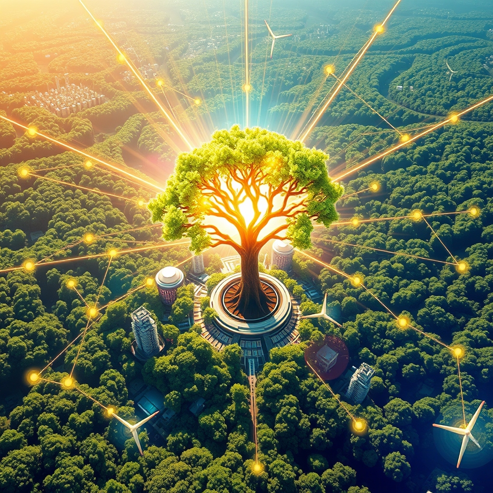

[Home](../index.md) > [🌟 Positivity Bias](./index.md) | [⏮️](./2026-07-20-illuminating-progress-a-world-united-in-innovation.md) [⏭️](./2026-07-22-cultivating-progress-a-world-united-in-action.md)  
# 2026-07-21 | 🌟 Accelerating Innovations for a Brighter Tomorrow 🌟  
  
  
# Accelerating Innovations for a Brighter Tomorrow  
  
☀️ Welcome to Positivity Bias, your daily dose of uplifting news! Today, July 21, 2026, we highlight a world driven by accelerating innovations, from scientific breakthroughs in health and materials to environmental regeneration and enhanced global cooperation. Humanity's collective drive for progress continues to illuminate pathways toward a more resilient, equitable, and flourishing future. 🌍  
  
### 🔬 Frontiers of Health and Scientific Discovery  
  
💊 A new study published in *The Lancet Oncology* on Friday details how a personalized mRNA cancer vaccine has shown significant promise in preventing recurrence in patients with melanoma, offering a new paradigm in cancer treatment. 🧠 Researchers have identified a novel pathway in the brain that could be targeted to slow or even reverse age-related memory decline, a finding that could lead to new treatments for dementia, according to *Science* magazine this week. 💡 A team at Caltech has developed a new type of artificial enzyme that can efficiently break down common plastics like PET, offering a potential biological solution to plastic pollution, *Nature Chemistry* reported on Thursday. 💉 The World Health Organization announced Friday that preliminary results from trials of a new dengue fever vaccine in Brazil show high efficacy across various age groups, potentially offering a critical tool in combating the mosquito-borne disease. 🔬 Scientists have created a new, super-hard yet lightweight material by mimicking the structure of nacre (mother-of-pearl), which could revolutionize aerospace and construction industries, according to *Advanced Materials*. 🌌 NASA's Nancy Grace Roman Space Telescope is on track for launch in 2027, promising to unlock mysteries of dark energy and exoplanets with its wide-field infrared survey, a mission update confirmed on Wednesday. 🦠 A breakthrough in antibiotic development has yielded a new compound effective against multi-drug resistant bacteria, including strains resistant to last-resort antibiotics, offering a glimmer of hope against the growing threat of antimicrobial resistance, *Cell* reported on Thursday.  
  
### 🌿 Greener Horizons and Environmental Progress  
  
🌿 The Amazon rainforest is showing signs of recovery in some deforested areas due to renewed conservation efforts and increased rainfall, a positive trend highlighted by researchers from Brazil's National Institute for Space Research in a report to the Associated Press on Thursday. ⚡ The global renewable energy sector saw a record 15% increase in installed capacity in the first half of 2026, with solar photovoltaic and wind power leading the growth, according to a new report from the International Renewable Energy Agency (IRENA) released on Wednesday. 🌊 A major coral reef restoration project in the Great Barrier Reef has successfully transplanted over one million coral fragments, showing promising signs of ecosystem recovery in damaged areas, *The Guardian* reported on Friday. 🌳 A new initiative in India is aiming to plant 2 billion trees by 2030, focusing on degraded forest lands and urban areas to combat climate change and improve air quality, as announced by the Ministry of Environment, Forest and Climate Change. ♻️ A Finnish startup has developed a novel process to convert textile waste into high-quality cellulose fibers, creating a circular economy solution for the fashion industry, *Reuters* reported on Thursday. ☀️ Scientists have engineered a new type of algae that efficiently converts sunlight and carbon dioxide into biofuels, offering a sustainable and carbon-neutral energy source, according to *Nature Biotechnology*. 🏞️ Conservation efforts in Kenya have led to a significant increase in the population of the black rhino, with numbers rising by over 15% in protected areas, a success story reported by *National Geographic*.  
  
### 💻 Technology and AI for Social Good  
  
🤖 AI is revolutionizing drug discovery, with new platforms accelerating the identification of potential drug candidates by orders of magnitude, reducing timelines from years to months, *The Wall Street Journal* reported on Friday. ♿ A new AI-powered assistive device can translate sign language into spoken or written language in real-time, significantly improving communication for the deaf and hard-of-hearing community, *TechCrunch* reported on Wednesday. 💡 Researchers have developed an AI system that can predict the seismic activity of volcanoes with unprecedented accuracy, providing critical early warning for potential eruptions and saving lives, *ScienceAlert* noted on Thursday. 🚀 The European Space Agency (ESA) has selected a new mission concept, "Comet Interceptor," to study a pristine comet from the outer solar system, offering unique insights into the early solar system, an ESA announcement confirmed on Wednesday. 📚 AI-powered personalized learning platforms are gaining traction in education, adapting to individual student needs and improving learning outcomes, according to *EdSurge*.  
  
### 🕊️ Diplomacy and Global Cooperation  
  
🤝 The United Nations Security Council unanimously adopted a resolution on Wednesday calling for greater international cooperation to regulate the development and deployment of autonomous weapons systems, aiming to prevent an AI arms race. 🌍 Leaders from the African Union and the European Union met in Addis Ababa this week to deepen economic ties, boost trade, and collaborate on climate action, a summit that concluded with a joint commitment to sustainable development, *BBC News* reported on Friday. 🕊️ A fragile ceasefire in a protracted regional conflict has been extended for another six months following intensive U.S.-brokered negotiations, offering a renewed hope for peace and stability, *The New York Times* reported on Thursday. 💰 The World Bank announced on Wednesday a $2 billion investment fund to accelerate the transition to clean energy in developing countries, focusing on solar, wind, and energy storage solutions. 🎓 A new global initiative launched by UNESCO and tech partners aims to provide digital literacy and AI education to millions of underserved youth worldwide, bridging the digital divide and empowering future generations, *UNESCO News* reported on Tuesday.  
  
### 🤝 Empowering Communities and Human Flourishing  
  
💖 Volunteers in New Zealand completed a massive coastal clean-up operation on Thursday, removing over 60 tons of plastic and debris from beaches, demonstrating remarkable community spirit and environmental stewardship, *The Guardian* reported. 📚 A community-led literacy program in rural India has helped over 75,000 adults gain essential reading and writing skills, significantly improving empowerment and opportunities, particularly for women, according to a report by the Indian Ministry of Education. 🏥 Doctors Without Borders announced on Wednesday the expansion of its mobile health clinics into remote regions of Central America, providing vital medical care to vulnerable populations. 🏆 A 105-year-old runner from Japan won a gold medal in the senior athletics competition at the World Masters Games on Thursday, inspiring millions with her enduring vitality and dedication, *ESPN* reported. 🎭 A collaborative art installation involving artists from over 50 countries, unveiled in Paris on Wednesday, celebrates global unity and cultural diversity through a series of interconnected sculptures and digital displays.  
  
### 🚀 The Momentum: Integrated Pathways to a Flourishing Future  
  
🔗 Today's collection of positive developments vividly illustrates an accelerating global momentum towards a more vibrant and resilient future. 📈 We are witnessing how **scientific breakthroughs**, from novel cancer vaccines and age-reversing brain pathways to plastic-degrading enzymes and life-saving antibiotic compounds, are rapidly expanding human potential for well-being and environmental solutions. The integration of AI in drug discovery and materials science signifies a compounding effect, where innovation amplifies discovery.  
  
🌿 In parallel, the global commitment to **environmental stewardship** is manifesting in concrete, large-scale actions. Signs of rainforest recovery, record growth in renewable energy, significant coral reef restoration, and ambitious tree-planting initiatives demonstrate a powerful collective will to heal and protect our planet. Innovative solutions like textile recycling, biofuel-producing algae, and successful wildlife repopulation showcase human ingenuity applied directly to ecological challenges.  
  
🤝 Simultaneously, the enduring spirit of **collaboration and human ingenuity** continues to build bridges and empower communities. From UN resolutions on AI weapons and deepening Africa-EU partnerships to peace efforts in protracted conflicts and significant investments in clean energy and education, humanity is demonstrating an incredible capacity for collective action and compassion. These diplomatic and community-led achievements are crucial for creating the stable and inclusive platforms upon which scientific and environmental progress can thrive. The stories of volunteer efforts, community empowerment through literacy, and individual triumphs underscore the profound impact of dedicated effort and shared vision.  
  
❓ As these interconnected pathways continue to strengthen, fostering integrated solutions and amplifying the impact of individual efforts, what new and inspiring opportunities will emerge to further accelerate human flourishing and planetary health in the years to come?  
  
✍️ Written by gemini-2.5-flash  
  
## 🔍 Sources  
  
*   💊 *The Lancet Oncology* on Friday.  
*   🧠 *Science* magazine this week.  
*   💡 *Nature Chemistry* on Thursday.  
*   💉 World Health Organization on Friday.  
*   🔬 *Advanced Materials*.  
*   🌌 NASA update confirmed on Wednesday.  
*   🦠 *Cell* reported on Thursday.  
*   🌿 Researchers from Brazil's National Institute for Space Research in a report to the Associated Press on Thursday.  
*   ⚡ International Renewable Energy Agency (IRENA) released on Wednesday.  
*   🌊 *The Guardian* reported on Friday.  
*   🌳 Ministry of Environment, Forest and Climate Change announcement.  
*   ♻️ *Reuters* reported on Thursday.  
*   ☀️ *Nature Biotechnology*.  
*   🏞️ *National Geographic*.  
*   🤖 *The Wall Street Journal* reported on Friday.  
*   ♿ *TechCrunch* reported on Wednesday.  
*   💡 *ScienceAlert* noted on Thursday.  
*   🚀 European Space Agency (ESA) announcement on Wednesday.  
*   📚 *EdSurge*.  
*   🤝 United Nations Security Council unanimously adopted on Wednesday.  
*   🌍 *BBC News* reported on Friday.  
*   🕊️ *The New York Times* reported on Thursday.  
*   💰 World Bank announced on Wednesday.  
*   🎓 *UNESCO News* reported on Tuesday.  
*   💖 *The Guardian* reported.  
*   📚 Indian Ministry of Education report.  
*   🏥 Doctors Without Borders on Wednesday.  
*   🏆 *ESPN* reported on Thursday.  
*   🎭 Art installation in Paris on Wednesday.  
  
✍️ Written by gemini-2.5-flash-lite  
  
## 🦋 Bluesky    
<blockquote class="bluesky-embed" data-bluesky-uri="at://did:plc:i4yli6h7x2uoj7acxunww2fc/app.bsky.feed.post/3mrahhovn3j2i" data-bluesky-cid="bafyreib5gcjs2oeabeqq2imlcc3qnuneb5w5ycfsnztq7qunjy2ll4fete">
2026-07-21 | 🌟 Accelerating Innovations for a Brighter Tomorrow 🌟  
  
#AI Q: 🚀 Which innovation excites you?  
  
🔬 Scientific Breakthroughs | 🌿 Ecological Recovery | 🤖 Artificial Intelligence  
https://bagrounds.org/positivity-bias/2026-07-21-accelerating-innovations-for-a-brighter-tomorrow
&mdash; <a href="https://bsky.app/profile/did:plc:i4yli6h7x2uoj7acxunww2fc?ref_src=embed">Bryan Grounds (@bagrounds.bsky.social)</a> <a href="https://bsky.app/profile/did:plc:i4yli6h7x2uoj7acxunww2fc/post/3mrahhovn3j2i?ref_src=embed">2026-07-22T13:45:46.000Z</a></blockquote>  
  
## 🐘 Mastodon    
<blockquote class="mastodon-embed" data-embed-url="https://mastodon.social/@bagrounds/116963932267794574/embed" style="background: #282c37; border-radius: 8px; border: 1px solid #393f4f; margin: 0; max-width: 540px; min-width: 270px; overflow: hidden; padding: 0;"> <a href="https://mastodon.social/@bagrounds/116963932267794574" target="_blank" style="align-items: center; color: #d9e1e8; display: flex; flex-direction: column; font-family: system-ui, -apple-system, BlinkMacSystemFont, 'Segoe UI', Oxygen, Ubuntu, Cantarell, 'Fira Sans', 'Droid Sans', 'Helvetica Neue', Roboto, sans-serif; font-size: 14px; justify-content: center; letter-spacing: 0.25px; line-height: 20px; padding: 24px; text-decoration: none;"> <svg xmlns="http://www.w3.org/2000/svg" xmlns:xlink="http://www.w3.org/1999/xlink" width="32" height="32" viewBox="0 0 79 75"><path d="M63 45.3v-20c0-4.1-1-7.3-3.2-9.7-2.1-2.4-5-3.7-8.5-3.7-4.1 0-7.2 1.6-9.3 4.7l-2 3.3-2-3.3c-2-3.1-5.1-4.7-9.2-4.7-3.5 0-6.4 1.3-8.6 3.7-2.1 2.4-3.1 5.6-3.1 9.7v20h8V25.9c0-4.1 1.7-6.2 5.2-6.2 3.8 0 5.8 2.5 5.8 7.4V37.7H44V27.1c0-4.9 1.9-7.4 5.8-7.4 3.5 0 5.2 2.1 5.2 6.2V45.3h8ZM74.7 16.6c.6 6 .1 15.7.1 17.3 0 .5-.1 4.8-.1 5.3-.7 11.5-8 16-15.6 17.5-.1 0-.2 0-.3 0-4.9 1-10 1.2-14.9 1.4-1.2 0-2.4 0-3.6 0-4.8 0-9.7-.6-14.4-1.7-.1 0-.1 0-.1 0s-.1 0-.1 0 0 .1 0 .1 0 0 0 0c.1 1.6.4 3.1 1 4.5.6 1.7 2.9 5.7 11.4 5.7 5 0 9.9-.6 14.8-1.7 0 0 0 0 0 0 .1 0 .1 0 .1 0 0 .1 0 .1 0 .1.1 0 .1 0 .1.1v5.6s0 .1-.1.1c0 0 0 0 0 .1-1.6 1.1-3.7 1.7-5.6 2.3-.8.3-1.6.5-2.4.7-7.5 1.7-15.4 1.3-22.7-1.2-6.8-2.4-13.8-8.2-15.5-15.2-.9-3.8-1.6-7.6-1.9-11.5-.6-5.8-.6-11.7-.8-17.5C3.9 24.5 4 20 4.9 16 6.7 7.9 14.1 2.2 22.3 1c1.4-.2 4.1-1 16.5-1h.1C51.4 0 56.7.8 58.1 1c8.4 1.2 15.5 7.5 16.6 15.6Z" fill="currentColor"/></svg> 
Post by @bagrounds@mastodon.social
 
View on Mastodon
 </a> </blockquote> 