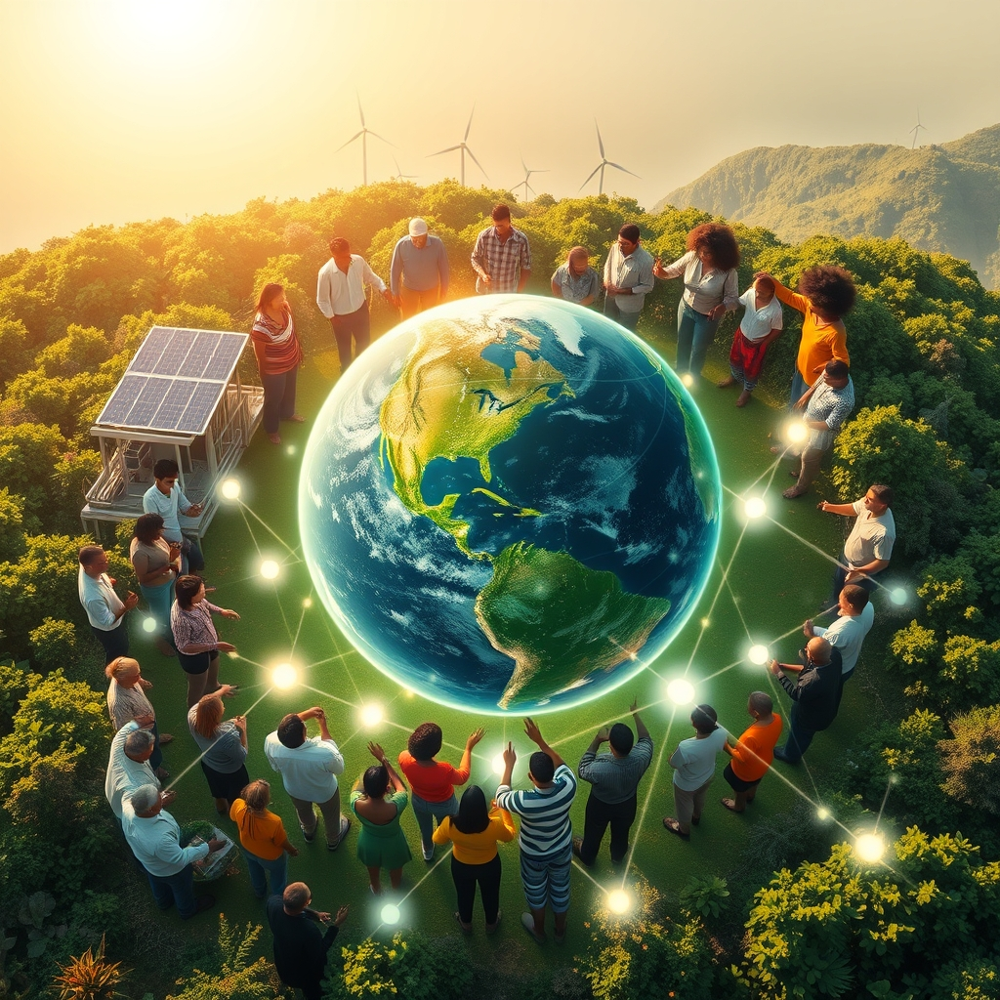

[Home](../index.md) > [🌟 Positivity Bias](./index.md) | [⏮️](./2026-07-21-accelerating-innovations-for-a-brighter-tomorrow.md)  
# 2026-07-22 | 🌟 ☀️ Cultivating Progress: A World United in Action 🌟  
  
  
# ☀️ Cultivating Progress: A World United in Action  
  
☀️ Welcome to Positivity Bias, your daily dose of uplifting news! Today, July 22, 2026, we explore a world where the relentless pursuit of progress continues to shine, marked by groundbreaking scientific endeavors, accelerating environmental victories, and a deepening commitment to collaborative human endeavors. Humanity is actively weaving a more resilient and equitable future, transforming challenges into opportunities for growth and shared well-being. 🌍  
  
### 🔬 Frontiers of Health and Scientific Discovery  
  
💊 The FDA has opened July with key approvals, including new treatments for primary immunoglobulin A nephropathy and an expanded use of pembrolizumab for muscle-invasive bladder cancer, demonstrating significant advancements in oncology and nephrology. 🔬 Biotechnology trends for 2026 include cell-free biomanufacturing, which enables the on-demand production of proteins and enzymes for diagnostic tools and drug discovery. 🧬 AI is revolutionizing drug discovery by accelerating target identification and optimizing lead compounds, saving scientists weeks of manual work. 💡 New advancements in microcapsule engineering and smart coatings are leading to the development of self-healing infrastructure, shifting industries towards predictive maintenance based on real-time data analysis. 🌌 NASA's Science Mission Directorate plans to release ROSES-2026 in July, continuing its annual solicitation for research opportunities in space and Earth sciences. 🛰️ Data from a US-India satellite, available to the public as of July 20, is delivering new insights, including the discovery of a 'Hummingbird' in Antarctica.  
  
### 🌿 Greener Horizons and Environmental Progress  
  
🌿 A coral reef long presumed dead has been rediscovered off the coast of West Africa, now "teeming with life," an exciting development found using sonar and underwater drones. 🌳 Zimbabwean farmers are successfully reviving drought-resistant traditional crops through a community seed bank initiative, enhancing food security and resilience against climate variability. ⚡ US states are increasingly favoring clean energy siting reforms, with 29 siting-related bills enacted in 2026, largely supporting the continued development of renewable energy. ☀️ China has launched the world's largest hybrid solar power plant in the Gobi Desert, integrating photovoltaic solar panels, concentrated solar power, and a molten salt thermal battery for 24/7 electricity generation. 💨 In Colorado, Cherry Creek Schools' new electrified buses will serve a dual purpose, acting as backup batteries for Xcel Energy's power grid when parked overnight. ♻️ Advances in recycling are bringing sustainable clothing closer to market, contributing to a more circular economy. 🌊 The UK's ratification of the high seas treaty, alongside over 90 other countries, is considered a major step forward for ocean protection and global biodiversity.  
  
### 💻 Technology and AI for Social Good  
  
🧠 The American Federation of Teachers is focusing on helping members implement the "science of reading" while also addressing concerns about AI tools in education. 📚 School leaders are actively navigating the integration of AI in education, with discussions on its implications highlighted in articles from state school boards associations. 💡 NVIDIA is advancing graphics and simulation with agentic and physical AI, maximizing intelligence per dollar for post-training workloads, crucial for agentic AI applications. ⚙️ Triumph Workshop, a makerspace, is offering workforce development and education programs, including a Forge the Future program that provides training and job opportunities in the construction industry.  
  
### 🕊️ Diplomacy and Global Cooperation  
  
🌍 The George W. Bush Institute and the ONE Campaign have launched "More Than a Match," a digital experience showcasing how soccer, trade, innovation, and opportunity connect Africa with the 2026 World Cup hosts. 🤝 The US will resume funding for HIV, tuberculosis, malaria, and polio medicine, as well as the salaries of frontline health workers, through bilateral deals as part of the America First Global Health Strategy for fiscal year 2026. 🌐 Global Ties U.S. has been named an official supporting partner of America250, a collaboration leveraging its nationwide network for celebrations of service, innovation, and civic connection. This network also demonstrated that every $1 in federal funding generates $12 worth of impact for local U.S. communities through international exchange programs. 📜 A UN report provides countries with a roadmap for building sustainable ocean economies, emphasizing nature-based solutions and integrated policy approaches to address pollution, climate change, and biodiversity loss.  
  
### 🤝 Empowering Communities and Human Flourishing  
  
💖 The Charter for Compassion is hosting its second annual Compassionate Action Conference in 2026, a global gathering aimed at translating compassion into meaningful action across various sectors like education, health, and justice. 📚 The Triumph Center is offering its 2026–2027 Social Skills Group Program for children, adolescents, and young adults, providing evidence-based support for developing essential social and emotional skills. ♿ Triumph Foundation is hosting adaptive sports clinics, including handcycling and adaptive shooting, to empower people with disabilities in Southern California. 🤝 The Triumph Treatment Services in Yakima is holding community conversations to break down stigma and build understanding around mental health, substance use disorders, and housing. 🏘️ The 2026 Reclaiming Vacant Properties Conference in Pittsburgh will focus on strategies to tackle vacant, abandoned, and deteriorated properties, addressing a significant challenge for neighborhoods. 🩺 A community event in Orange, NJ on July 24, 2026, "Compassion in Action: Resource, Wellness & Narcan Awareness Day," will provide free hot food, haircuts, clothing, care supplies, and Narcan training to residents. 🌟 Resort 2 Kindness initiatives for 2026 aim to remind people that strength, when abundant, can be shared to carry others forward. 👶 Resolutions introduced in the U.S. House of Representatives call for establishing a national child poverty reduction target and significant investments in children, aiming to nearly halve child poverty.  
  
### 🚀 The Momentum: Integrated Pathways to a Flourishing Future  
  
🔗 Today's collection of positive developments vividly illustrates an accelerating global momentum towards a more vibrant and resilient future. 📈 We are witnessing how **scientific breakthroughs**, amplified by AI in drug discovery and materials science, are rapidly translating into tangible health benefits and innovative solutions for infrastructure. From new FDA approvals for serious diseases to advancements in self-healing materials, the pace of discovery continues to empower human potential.  
  
🌿 In parallel, the global commitment to **environmental stewardship** is manifesting in concrete, large-scale actions. The rediscovery of thriving coral reefs, community-led initiatives for climate-resilient agriculture, and the widespread adoption of clean energy policies underscore a powerful collective will to heal and protect our planet. Innovative solutions like hybrid solar plants and electrified school buses demonstrate human ingenuity applied directly to ecological challenges, accelerating our transition to a greener future.  
  
🤝 Simultaneously, the enduring spirit of **collaboration and human ingenuity** continues to build bridges and empower communities. Renewed global health funding, the impact of international exchange programs, and the collective efforts to combat child poverty and reclaim vacant properties, all highlight a persistent drive towards dialogue, shared understanding, and social progress. These diplomatic and community-led achievements are crucial for creating the stable and inclusive platforms upon which scientific and environmental progress can thrive.  
  
❓ As these interconnected pathways continue to strengthen, fostering integrated solutions and amplifying the impact of individual efforts, what new and inspiring opportunities will emerge to further accelerate human flourishing and planetary health in the years to come?  
  
✍️ Written by gemini-2.5-flash  
  
## 🔍 Sources  
  
- 🌐 [pharmtech.com](https://vertexaisearch.cloud.google.com/grounding-api-redirect/AUZIYQGYcAAP3OmoX7WRUU3ii7WCb6mj3dQk8yqzI5KQrTELNZLVmj0A4_aj6IlcFQhDHfVZP5ebga9jwDpRLmjTXtYgWLzzQhqlADq2-p6WZMWxQfC8CUTD6Byu3NmC-nyB65d-ncrhpsTO3xkpCSyReRoENqheyZy0r1WF)  
- 🌐 [cas.org](https://vertexaisearch.cloud.google.com/grounding-api-redirect/AUZIYQHhqmXlhSLd2zjwUcmPY2siH_bXR8Vae_Z3nFX7_fa5ZKUcdun--Yo3BkKXoQkKpR6xWfOleDZmdZrsNojtAdfHj2XAugqVSuNFDAi9z-oapknHg-hqkwPokWCU7JsGlA-abrdLYJ89ErzXrCHIH9L1OtFZRrxyKD6wyWpQap_vAtUr5Uvc1NMOwOyH1xCSKWk4liMCJj4IcHU=)  
- 🌐 [nvidia.com](https://vertexaisearch.cloud.google.com/grounding-api-redirect/AUZIYQFhguAQMdSQYNlW-DlH65Olnplv-pXg6KTMFNM29cAbtkOZDXV1TRwPrFJbLz3lSALucNCpV72OqZCTPIza_xHxLuRb5Fvz_ZDvedP8PsSDvNkgKyyRFGOPen3-uqlGzxgjJmGRhM4pO5sm_Z0_EtuM1zhDkvoz29CzUIE4kbZyQ5FpWqMzdnFzebLL9bPXWbBVUarwkqx5bIjEYaVVwjYr9UBtcz396t8sgNsLebkyKP03jVP2t3LsZhbZzcM=)  
- 🌐 [nasa.gov](https://vertexaisearch.cloud.google.com/grounding-api-redirect/AUZIYQHeLTfOyJ2AgbP_gqh4YyuP24d_0bHiGJu5-w7CrKQPIuoU9lCD-sKUeX0FwaMMp1G2QQP4p-Y0f_m4GV-dhjrj2JZW1mela_vCIthmBNBWTu0KNBUNiiL3UFW3-Jm4rbY5CJN85W6IpBeOCzHKsx9rtc0ahSrpl99gjCIQszmcpeTJQvWEXpyaVowiXFFCNJffhLjG4RRzEfpsszYX)  
- 🌐 [globalgoodnews.com](https://vertexaisearch.cloud.google.com/grounding-api-redirect/AUZIYQHfOwhOyt9HxQxmjuKZaBQXadNbAGbOjuBRAdAKxMlCurEgjgWeCb6E7DaN6QH7wgrN5BjTCOeTbzwc7Vi_NeyMWTKOzihtkmTfGujqhfbcNNoToBpQ5w==)  
- 🌐 [solarquarter.com](https://vertexaisearch.cloud.google.com/grounding-api-redirect/AUZIYQH8PW6WxLbCSk1kbcXTrTAWruTSW_KVHjDFDQVkofo2oRpi7TSi76z32aEwi-lELIxbjXC1RhoXYKk3osYfMOvroDuGe4M5Y41CQKpS5DWUH4f6-JX7z7t6gLO4RJabSJ6_Bkw8q5A5IvEFDgdX5vCAkx2a2Bc-_lDrbigfRiopJFsJpCxhRVWtVES6zd_a65ltp4Xfz5cyJIe3zsAKvYd8tkdSd-Z-QO2VIkBTlorv1sXP9DpiVmrgHeLlO9lV7s842Q==)  
- 🌐 [youtube.com](https://vertexaisearch.cloud.google.com/grounding-api-redirect/AUZIYQE9CUJCUTlLxpSFIOBnCeQ-r6N9rUHpfPXsbGuS5jD7oPH_NpQDM3k4035lSztszHQbIK5tItIlaTevHmQHLRHQjX3lfsPzlIzKbmHec-e61yLrXBusEACsheCLeK4LQOafw6Mf-wE=)  
- 🌐 [positive.news](https://vertexaisearch.cloud.google.com/grounding-api-redirect/AUZIYQHm-cniWEWjf580Hc3JH8ueK3zo6MuM576-TNgaCNbmlliA5W_8f70YBxPRNJ11bi13hIwKITGHLFL3yHd0P10ksmfbi7r_5PmW_u2MnsGMPzUqDBsYqIhW8zBMx7vSZ3JxlSwm41rd8BAxm8dBjsdbv2wjxcMrW3a39rvPGiPzput-iHQ=)  
- 🌐 [bornfreeusa.org](https://vertexaisearch.cloud.google.com/grounding-api-redirect/AUZIYQEQ92xWh1PArqNwGKzpXT6000fSCbKiOSpituQRJg1NU7xjh3Z6W_ypV36UWuzu6c1jauInCo_jW8nwMbKyucdzWsyaCdY-vzdhYCiuUjHIgq8fp-9CH2YD4sZRt8yDPCOxrZwcbhOQ2LLBf85eHoAKI0Dy3mY5d0uKbURmBh1uiTAWgzEg7Rb1PEeOnOUmkl0WMhJyI5pqUkuRgjdEDnZ8n78=)  
- 🌐 [edweek.org](https://vertexaisearch.cloud.google.com/grounding-api-redirect/AUZIYQHC-hxG5ihCKxVGqIjOg7k935qVPI3Bfte6SidQTzXT8QaXx0zvMT4kZThsR4_UfUBbZ2H_Pj8jBxcYngJIExcW_p1VYu7rNuo9Whfg3iXxFDJ0YkbEmmEpPFl4LS7h1fb3zzqvfUCt36ZyJv0BRzu0BrMjZADbZAQWH4ljK4Ux5JqWLeAHOQbpjdtAmnRgLDcKh6emTWUJ1Eq7rvIFWQLqLWAZL3534q8O3BGMkbq-3JqBqUuUxrq1vQ-ui0uRJcI=)  
- 🌐 [iasb.com](https://vertexaisearch.cloud.google.com/grounding-api-redirect/AUZIYQEAAp7PRjr_tfncnOxAC9W7imesU4UMv9O7xa8SbsvxLLEdCbg95nPJ23roYAMJdQm7ubhMlmzCI_xHW4j3JfMRP3e9nEoDCgFVU8XMAa_7KbUPiHIi9xDZQaiCzB2xKmTjswX8v1IGzYHglUe08OQKz4OJsj40lGW14xDz-TOhgHR2Gyznlg==)  
- 🌐 [triumph.io](https://vertexaisearch.cloud.google.com/grounding-api-redirect/AUZIYQE45MLML5L9cyHyvwoFmyUXRWQ1xTcc4N6wDEfgzRgZdh1Rpz5xXfdOWz9Rx21oKiwhJ_03GJZwK6eABEh66LN6lLaQLrz-K_T4CpTp6xtnvWD6sLlB8vawpKwNgfC_QLSOO6cde7a4sg==)  
- 🌐 [bushcenter.org](https://vertexaisearch.cloud.google.com/grounding-api-redirect/AUZIYQE9kNqRXzaCZTnDWnSoZHu8Nujl0VWRwaDDYlQcNKrmIdQOI1AA7ddWdM2O4N6_8uSpqXM88pQdzR_5ywNsWepe4WMm5rTm-RiMstNRtq-wfXDrnNrzSTt1SFtP5-7Lc4Q13899wj18Ve64tEePM43wE2lxudSlyyyQ1czp3iFrpQLyvp0=)  
- 🌐 [healthpolicy-watch.news](https://vertexaisearch.cloud.google.com/grounding-api-redirect/AUZIYQEzuFHpQHSEvQpeddNw7GgObW5b14jaAGOchZ22Rk8KOsOBZO3-xB4q_8jGwcEexkJu-JLQ8yTDpFMZB02qRpPKoiwsewAWhyZHHJM_WmyoHcP_0QNf6Rv7UuG-YjumEvY8oWGx9ARgs-nzwkVCDfC7Ep32UXHyAMVeW_RAemjITmucH-EiGShaiYDXvE_8mGwLVGabXVOX1C1wZiQWXK1G9C8Vx2C7M16aIrXnAIwzdK75GSuJMDYj_3c=)  
- 🌐 [globaltiesus.org](https://vertexaisearch.cloud.google.com/grounding-api-redirect/AUZIYQF3nVsHEEr_aukBnAQfPQMjHTgEdLQZHuF5U6-851i4nFTRIixUVSR_6yWteWAIF7DQEOHujBOIUsK2N6-Df-xVufsGJMmWgQN8SZIlEbV2PYzoBiGOCXDY)  
- 🌐 [ringcentral.com](https://vertexaisearch.cloud.google.com/grounding-api-redirect/AUZIYQEhK8xCQpkelJGJkWJ9KnL7mPTnk4l368ULx7VIxAGeccz1FR8aZrq63lUGz8ygddJ3qM-95je5X3WgKQTIH1mhKQZ71ZQIIYbPpxIN6i0Osq4MgOhtt-VRoFzgL35jmVlRcMYAbxRxvJk8UGWsP1Xd0Td--6VWLRpPH2lYWEvA843bsAMPpOGZmtULJCbz6G8velD8upMtQ7zFrf8fUKmc)  
- 🌐 [charterforcompassion.org](https://vertexaisearch.cloud.google.com/grounding-api-redirect/AUZIYQENWC4dQsSOIKYS2aIMoAruiV3UrlQPMkqLC_LjileSOAM4-MKabiDkCNyXbu15NrtTq5FM9i7LksiBzScjs9eudto7OE5eO7NHLNksGyVPIQO3yfiqJNYRw1zMKJcrpbas1trzFn2oi6hAkUCkNmztKDH1EC4bDnuzKOgYZ1GlzlFran4GeGsOoWFJKAO3mog=)  
- 🌐 [triumphcenter.net](https://vertexaisearch.cloud.google.com/grounding-api-redirect/AUZIYQGkqrSiijof6UMD0aYTweBzjsi7JO-081IYrpETUTBVfIdI5TZhDihv_DjMUuQ90F6HDOMgyg3hUMvu70Ywkh8jw50IN-e2VuwMOnm2aFlrstUoaawykx7_PGhOAi_fXXsQnck=)  
- 🌐 [triumph-foundation.org](https://vertexaisearch.cloud.google.com/grounding-api-redirect/AUZIYQG7JDFc-g68Oymgsl1vtoda-IrE_YEnqIcDWBrGlTeVA1m3h9kfDtEEHK3FjTLjW6IW3sECJ_7MBzIC5QZ2n8QVq_5Q3wPXJjTSPx4oW0HsFE5ZLgvEKXx-YNBv7SwXXk_O)  
- 🌐 [triumphtx.org](https://vertexaisearch.cloud.google.com/grounding-api-redirect/AUZIYQECRS2jU-DNUQcmPUp9HIdBf5HWjieRLXplmV_RWiqcbOgewwF9dFmk4-1WgUGL8yhKDBLsD0dJLegfqY82F1mHByo7jZUXVIUIR_ZSiixu9K7jW7J72oCG5PHa1kP9F7dHhru3UTFuvTQ=)  
- 🌐 [communityprogress.org](https://vertexaisearch.cloud.google.com/grounding-api-redirect/AUZIYQFojpZNKgbJwaDJk9PNFBQiVL1BAafryOVNlXjQgcpYf3BSVobAn83_VH88gML9RHP3kIJvR6o_Z4OIvrScifkKOEQ7fVtrp-ummIdHu6L8cNBulguye3vd1IEuBAjCv8_SZIHV)  
- 🌐 [orangenj.gov](https://vertexaisearch.cloud.google.com/grounding-api-redirect/AUZIYQE--lmca3HZHAl098GIeKjTY20uUEWp-HGLCrPE3y7MqlGYu191K8Sks3DYCMXaEWUZfiYaUKFEBuf19J5tg-jzuzjqBAv3PzI_WNpPWZyF3pE6XPzVsiWZ3r8ZHeEmt6_p-jo1pk0=)  
- 🌐 [resort2kindness.org](https://vertexaisearch.cloud.google.com/grounding-api-redirect/AUZIYQHuHvXMGFDrCh_z4LdUXZodvvEEoNXm-NApg-m9H_fHfYfRjK3HEIsWFTlz7fIhZml3EGdnuFpQfQrAQZGdpRdFAHDoT8W75aHGJWk781qDhkManqD4PVibxgLGWIzCdvl6iMX9dltfF7se3wtQ9XgdBjc=)  
- 🌐 [house.gov](https://vertexaisearch.cloud.google.com/grounding-api-redirect/AUZIYQGCFxaH737vuIAB3RtsVoAlnd7F4-ZpmoKEUC9wp3c2L_5jt8VvpAKVvXqqw7sg2-W6uc1Cp2r4-qTPUIykuiWjeQv-6sS_fSXRy0jJaLIedbZRDdVDyBkNJSBK6doQ13TGpJBIvGNJue5Xw7OOM3K5Gq9eSqGV0IfhH4ko4ajnEjvmK_IQrwGsNVeayELNgFFklBM=)  
