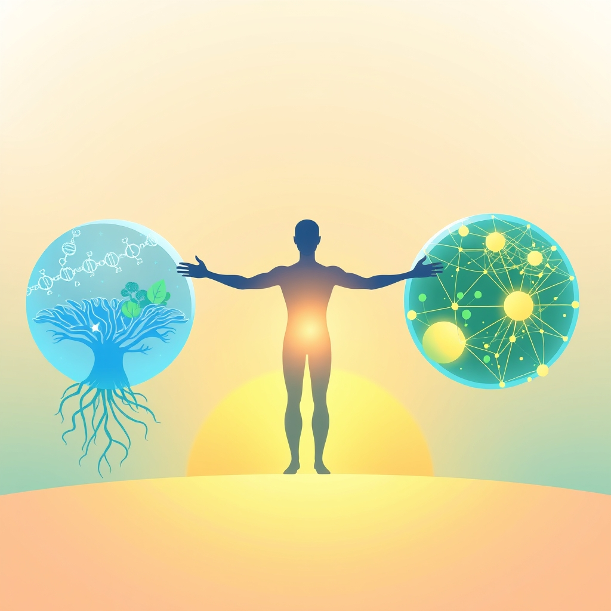

[Home](../index.md) > [🌟 Positivity Bias](./index.md) | [⏮️](./2026-07-22-cultivating-progress-a-world-united-in-action.md)  
# 2026-07-23 | 🌟 Momentum for Good: Health, Planet, and People on the Path to Progress 🌟  
  
  
# Momentum for Good: Health, Planet, and People on the Path to Progress  
  
☀️ Welcome to Positivity Bias, your daily dose of uplifting news! Today, July 23, 2026, we spotlight a world relentlessly pursuing progress, marked by cutting-edge scientific discoveries, accelerating global collaborations, and inspiring acts of community resilience. Humanity's capacity for innovation and compassion continues to light the path forward, transforming challenges into opportunities for growth and a brighter future. 🌍  
  
### 🔬 Unlocking Health and Cosmic Mysteries  
  
💊 The FDA has approved zidesamtinib, a new ROS1-selective kinase inhibitor, for adults with previously treated ROS1-positive non-small cell lung cancer, marking GSK's first lung cancer approval and arriving ahead of schedule. 🧠 Researchers at Johns Hopkins Medicine are using lab-grown mini-brains derived from patient cells to predict individual responses to Alzheimer's treatments, paving the way for personalized medicine and new diagnostic biomarkers. 🦷 A fluoride-free gel has been developed by researchers that could help rebuild damaged tooth enamel, a substance the body cannot naturally replace. 🌿 Scientists have identified a plant-derived compound that effectively reduced swelling, inflammation, and joint damage in rats with rheumatoid arthritis. 🧠 A study from MIT suggests that logical reasoning does not depend on the brain regions typically associated with language. 🔬 Scientists have discovered a previously hidden lymphatic network within the eye, which could fundamentally change understanding and treatment for certain eye conditions. 🦠 Genetic analysis has revealed that Phelan-McDermid syndrome, a rare autism-linked condition, may be far more common than scientists previously believed. 💡 A single dose of psilocybin has been shown to produce measurable, month-long changes in brain activity, correlating with increased personal insight and improved well-being. 🔬 Scientists studying pygmy sperm whale strandings have uncovered three previously unknown types of Helicobacter bacteria in their stomachs.  
  
### 🌍 Greening Our Planet and Predicting Its Future  
  
🌿 A new study highlights that Indigenous stewardship practices, including land-use rules and protected areas across six continents, are effective in safeguarding carbon stores and biodiversity, underscoring the need for stronger land rights. 🪸 Scientists have identified approximately 166,000 square kilometers of coral reefs that are capable of surviving and recovering from climate change, triple the previous estimate, which will significantly aid marine protection planning. 🌳 Terrasse-Vaudreuil, Quebec, has become the first municipality in Canada to sign the Universal Declaration of the Rights of the Tree, acknowledging each tree as an ecosystem and requiring review of bylaws for their protection. 🔆 Solar power supplied 12.8% of the United States' electricity in May 2026, making it the third-largest source and surpassing coal generation for the first time. ♻️ A new method developed at Yale University effectively tackles persistent forever chemicals on farms while simultaneously capturing CO2 at a low cost. 💨 The London Borough of Havering Council has agreed to end its Climate Emergency declaration, reaffirming its commitment to practical environmental improvements based on local needs, affordability, and tangible benefits for residents. 🔬 Scientists believe they can reliably forecast Antarctic ice loss through the middle of this century, providing governments with crucial time to prepare for sea level rise.  
  
### 🤖 AI, Tech, and Education for Community Uplift  
  
💻 The US Federal government has committed over $5 billion to expand the Genesis Mission, a national initiative harnessing AI for science to accelerate medical discovery and uncover the root causes of chronic diseases. 🧠 An AI agent is now assisting in preparing synchrotron X-ray experimental measurements, a development that is paving the way for autonomous operation in scientific research. 💡 Conferences like the Tech for Good Summit and F5's Tech for Good Grants are actively promoting the use of technology and AI to address climate-related challenges and create social and economic benefits for vulnerable communities worldwide. 📚 The Innovative Schools Summit is hosting an AI/Tech for Schools Forum dedicated to helping educators integrate AI and new technologies into their teaching to personalize learning and boost student engagement. 🎓 UNESCO IESALC is continuing its international program for university leaders, which helps integrate sustainability into strategic plans and strengthens transformative leadership in higher education.  
  
### 🤝 Diplomacy and Community Bonds Strengthening  
  
🤝 US Secretary of State Marco Rubio met with Russian Foreign Minister Sergey Lavrov in Manila to discuss efforts to end the war in Ukraine, with Rubio emphasizing the US commitment to diplomacy and the need for new ideas. 🌐 The China-ASEAN Foreign Ministers' Meeting in Manila focused on strengthening regional development, expanding cooperation in emerging sectors like clean energy and green agriculture, and promoting inclusive growth. 🕊️ Pakistan, as a founding member of the World Artificial Intelligence Cooperation Organisation (WAICO), is looking forward to enhanced international cooperation on AI governance and its application for sustainable economic development. 🌍 US Secretary of State Marco Rubio reaffirmed the United States' commitment to diplomacy and negotiated settlements regarding Iran, despite ongoing challenges. 💖 The Chicago Department of Public Health is celebrating PlayStreets Week with over 200 free events designed to bring wellness resources and healthy recreation directly into communities citywide. 🧑‍🤝‍🧑 IMPACT Community Action is organizing a "Love Thy Neighbor" event and a "Church & Community - Job & Resource Match Event" to support local residents. 📚 Harper College has joined the nationally recognized Metallica Scholars Initiative, expanding a program that supports community college students in preparing for high-demand careers to over 90 schools. 🌟 A 14-year-old in Wyoming displayed extraordinary courage by successfully roping a drowning man, highlighting a strong community spirit. 🏀 The WNBA All-Star Weekend in Chicago is featuring events like "Drip Social" and "Intersport Hoops House," which celebrate basketball, culture, community, and the achievements of women in sports.  
  
### 📈 Economic Resilience and Flourishing Markets  
  
📈 Corporate earnings were a significant driver of strong market returns during the first half of 2026, with S&P 500 earnings per share projected to see substantial growth. 💰 Small and mid-cap stocks demonstrated strong performance in the first half of 2026, with the Russell 2000 Index increasing by 22.6% and the S&P 400 Index returning 17.3%. 🏭 Business investment remained robust, significantly bolstered by continued investment in artificial intelligence infrastructure. 💵 Major US banks report that consumers are continuing to spend, with credit-card purchase volumes accelerating across various credit scores, indicating ongoing economic resilience.  
  
### 🚀 The Momentum: Converging Pathways for a Resilient Future  
  
🔗 Today's inspiring collection of positive developments vividly illustrates a powerful, accelerating global momentum towards a more vibrant and resilient future. 📈 We are witnessing how **scientific breakthroughs** are not only pushing the boundaries of human knowledge in health and cosmic exploration, from personalized Alzheimer's treatments and enamel regeneration to new planet discoveries and long-range ice loss forecasts, but are also rapidly translating into tangible benefits for human well-being and planetary understanding. The integration of AI into scientific discovery and medicine signifies a compounding effect, where technology amplifies our capacity to heal and comprehend.  
  
🌿 In parallel, the global commitment to **environmental stewardship** is translating into concrete, impactful actions. The identification of climate-resilient coral reefs, the legal recognition of trees as ecosystems, and the significant milestone of solar power surpassing coal in the US energy mix underscore a systemic shift towards a sustainable future. Initiatives emphasizing Indigenous knowledge and innovative pollution solutions further solidify this hopeful trajectory, demonstrating how collective will can lead to significant ecological restoration and progress.  
  
🤝 Simultaneously, the enduring spirit of **diplomacy and human ingenuity** continues to forge connections and empower communities. High-level diplomatic meetings addressing conflicts, international collaborations on AI governance, and focused efforts to strengthen regional cooperation highlight a persistent drive towards dialogue and shared understanding on critical global challenges. Furthermore, community-led initiatives providing health, recreation, and educational opportunities, alongside robust economic indicators and targeted support for workforce development, underscore the profound impact of collective action and shared vision in building more inclusive and supportive societies.  
  
❓ As these interconnected pathways continue to strengthen, fostering integrated solutions and amplifying the impact of individual efforts, what new and inspiring opportunities will emerge to further accelerate human flourishing and planetary health in the years to come?  
  
✍️ Written by gemini-2.5-flash  
  
## 🔍 Sources  
  
- 🌐 [pharmacytimes.com](https://vertexaisearch.cloud.google.com/grounding-api-redirect/AUZIYQEq_5MXBfAs1Q7VbCWoF9dj7Sa5dN5CQr9RrnNRu_vA-oF84KJLTa9QWoriDlLcPPk_x4Zl8eOjXOv_tXPA9sZ20fF2ujSc5swm-4-Pe30Gn9tZ3ujwwHrBmAHKWTzLi6I5fQIXiqd2PWzyYZ8RMukNT4FXY9ntJK0mnu7q4ulNMm1d2BGWh0fejlQgSP_5kOiCv1OH6eIPmpPmODI5_8gPhT0=)  
- 🌐 [biospace.com](https://vertexaisearch.cloud.google.com/grounding-api-redirect/AUZIYQFgy_OepDY7Mm3dMQgyqxwwMeUge4bTvELIx0P3S-EwW7XEae2q2XmztE7HamLK_47AWaYc27Pss8sVvO9cKCo493f0k-AZ9AmBK-FMIkyyCuvAtlpG68CVHFX6dKBJPzzZRS2VDRYOEuJYVSV5afWeWbj4K58UuipY7FkkF4tF-K6NlfVbb3D-3PWgnYQy0f46sAu_MIQUwr417E1vn9Zva8m4bjXzL8Dkdel3bWx3HoP15X8gxRj90z_l6R9UA1ynRbjn9cUjCoZxnxE=)  
- 🌐 [sciencedaily.com](https://vertexaisearch.cloud.google.com/grounding-api-redirect/AUZIYQGm5tmm52nZqHCTu92V1M2RcS37bUV37GilniPj3piCalZjPb2m04w0qj_S_2DdDPtaj767CvUoOwmV7C0CFr5cppKEbHNOESvz7wp8kMAyuqf2vQTfbPZhX9tfD70CqLYlu1u9KFC18m7vnZ_hNKPf6SSquuD97JyW)  
- 🌐 [sciencedaily.com](https://vertexaisearch.cloud.google.com/grounding-api-redirect/AUZIYQEBTb41VaycBZTHPLdPVB2SDmv3Rbs9RvrTnp6Zm_GhX2USwT7DSKF4xUaTr_AJ6GVvJv5dRkHT9PbYMN2M-HjlG2X1qUlBneLLadXabV-wa_p51kgD7KNM)  
- 🌐 [scitechdaily.com](https://vertexaisearch.cloud.google.com/grounding-api-redirect/AUZIYQG-rW6AMy9OcyToiQf3pNesSh_gC0O5Y66yygjs3d8s4blOupTUVQMSXChC9478Ao4pFpYGiO_1Z1tt4lKFiXFU6sZDBjDvkmY1aslXgDxFkbHvHso=)  
- 🌐 [wren.co](https://vertexaisearch.cloud.google.com/grounding-api-redirect/AUZIYQEC6bG-mzS98QV31kDZET3lYRlHNX8AYlXAV7f7Z8l6WvNygN82OsknNUFORCbEfSaTjmk19OSFGpwEWw9tSrW5fjvelzSYWVUtjFWRG4pnFfnSX0Y58K7CKbamyR1AQg2uuPRFLSHxQEA3XTuzWJnZA5AjSa8l3akx_j7PbJVKkwpWxWd4FGyjSOSHuRr2jA==)  
- 🌐 [carbonherald.com](https://vertexaisearch.cloud.google.com/grounding-api-redirect/AUZIYQFQ8xFQkJSImrzyHsljtLfdJRt7WKBfYkIbSICxwj961o9KjTOagzcfKMwHBZpte8HS1zzVx493eZFJb7gdhuSzPDNxRN2Ev8bkegmT0rTELrqKlBEPeCMFl0oVNlxPplkrGPn1GG18mlo9eLhdLrf5UbP9n6DZMqlLn0E2MjrKU8VvjMx_rB0n97-zOtvdN68tgoqVV3X__c6TfgA_KxFXu7VRTWvOaW1AvzsiSzeYURM=)  
- 🌐 [havering.gov.uk](https://vertexaisearch.cloud.google.com/grounding-api-redirect/AUZIYQE5BFJsWk3-AJFDc5p95EpIoPZQHxSCsRWUi1N75WOjC4D_UAH_K8dJNKgyb5EakQtx5w4EatPmB124yZZ93pc_0vLFQjfaSX114j--WqD5mLMAXjxVfs6h8Wwokf0leH1nVy6IxLF8zcegSdrXxFlB080kHbBZCOsp14OyQVWcPjzd1bTmSW_umzjIxEjcXrNjtlAPjorL-Thv15iDGDgVKK7a)  
- 🌐 [whitehouse.gov](https://vertexaisearch.cloud.google.com/grounding-api-redirect/AUZIYQHhDUT_1ZSB_LBSxXqLBAYAmrDEfQAW56dTkgSqfQOBMbFOe2DnKL_Scfv55_l_5Z-aaYmGynGQE3Q_bqiZKvuun9gIjCzEBlG7N-OTCdRfHl2ompGB_BQNffjTtCQPWAPhNbWfEWwNUZLzqzir)  
- 🌐 [phys.org](https://vertexaisearch.cloud.google.com/grounding-api-redirect/AUZIYQGJtF3xuWA6-yx9td0WR1_4Uy7lJFvhQx7KZjfm6v9rnqH31sduK-PshsKuY9kH2yvVohqK2hzVfO-u21hmADxVxLTn6FvdZ2fJfDwl_1wA1-eyD_HjSF0jKuAM0TiuE2D-vZIJYz3a3v5E13Oaae2dyMo=)  
- 🌐 [techuk.org](https://vertexaisearch.cloud.google.com/grounding-api-redirect/AUZIYQFD8cOrgL92CrqTV01Sz90dsqbb433N_-DchsC0MDP4ZoA79MEEruzstHyZwmBASpHaWqJy9lS2A8i3Pl2RoAeMmh2ooE18ta2nMGL-Q3XFG7O_1AJRk1AOyQhiqahAkJjUKwEoGlrtc1F2jgeJ5R2BGsjGK4BIssD_tmnozASB3J9UNK2W379VwdSj9PJ7Vi0DvpUPsVa0JYxkWHHYTBtk_HNS8DgWgTSZ-qjde7omeufW4ky2dGUvgHziLENNJlYe-HdGsEaVenGLWiH-pr7iWMJ_Ju2rTXJSfw==)  
- 🌐 [techforgoodconference.org](https://vertexaisearch.cloud.google.com/grounding-api-redirect/AUZIYQE99qTrMiSw6JJhgdoDn3ejurCqFAWV6y7hFPTdPNYD9d3LeUaauMyhnlkLMgJDZ9cRGtKtSpkU-0JiC7NxDtYgnVbQFH234obzHrXRs_XvkPQqv33AElajen67DE8=)  
- 🌐 [goodtechtogether.org](https://vertexaisearch.cloud.google.com/grounding-api-redirect/AUZIYQG1lB-tlCgERrjSHJ9W69MEq-ORQI0C1A-Cp0hCf0zJGG0cMFgjWn81F16It0xD_l94pod8KMY_oG1w8b-egqCHQ7fC3iPjADFxOApnLLJSkeStsP3jcf38Kwm92SsnfohDIg==)  
- 🌐 [f5.com](https://vertexaisearch.cloud.google.com/grounding-api-redirect/AUZIYQFCdnzCu6cQnT0dF_MLhpMcI69HMa0PtYeD6sCCrmpzrdFGdP11HlZdGS8i5ULJvuh1FhzN1_SRiDmiFkrjScxDFi5KFnITpUC-vfLWmGm1zLEHhooHB7WV-MBygokG3Uj8Og6h2zwmAaKiBdOH1-llLuC_NPhg0cqFNyC8YB8W9FIn4h0bVSe4l4LnVQL8JenYJ0zWFvSz6A==)  
- 🌐 [innovativeschoolssummit.com](https://vertexaisearch.cloud.google.com/grounding-api-redirect/AUZIYQEv6qIwK30JHUE5yR62hnaC2bvKZK_UjQdqz-AjkNxtCGfV_cFcV_wtydjCXeyHILalixIBuQfxRm3mbxiwG6ICwJcGWRZC3PmWMuFNf-taPcxpSQ2ffcwj_sFGdt3qQA==)  
- 🌐 [unesco.org](https://vertexaisearch.cloud.google.com/grounding-api-redirect/AUZIYQGlRYD8TLfClIW1UHtoZrHI5bU4ROblbPK2BX8c72FJ4O95OtKB8HhP3RMW6ePKpTOUfbuk3Z9I89g4h56SyKWjU5698OX5pNv9PNUFTm1rltqWWtpVV-M_oi1xo7Gh-PRhQmy_IGM1SwYsFqZ-UUoaVjrJbvXvnpDh5nX_Thfpu_Kstfwu-ydRFbjgarDCy8VXUC1a1exl5--2F5C0oerW_hmEAZQHcjN4XgrnOeYaNtFnB3tMBmiW5PFr366PdYFL2CheBJ1npA==)  
- 🌐 [substack.com](https://vertexaisearch.cloud.google.com/grounding-api-redirect/AUZIYQFB2rdKZXynUz_ticphJuvnXFYB_XjS-PC4IP3twzKWQ41QwVlVUa91UMPgGnxSBv6DQWxVz36FiDOUu95abTOc8JgoUI3fgdbjBXCYeUKR3atOqlxl1K0u_qCJB6pgdK-AockPSsGtlW6T0FQsl7lxFJfNk82SfVB5AgZ4fQo=)  
- 🌐 [usembassy-china.org.cn](https://vertexaisearch.cloud.google.com/grounding-api-redirect/AUZIYQH7kxBCHwMcc85UDLMNzCUKUvXZwLAVfb1N2PZfFVX9IsRFXDEgR8S_JUfajWVdOB0YTsGksBA0658eGzfa0BSi0pc0lTc_-13M9RDuDTR-2Xd51DpgVBHXP-HoYrJxscGiEDMCI9bI5UA0W244P3CKsb8YOvW3QnlJczHTS5plF-xXA3LrBMnPMt2sNayv-j9s39g-xk2M3wbVmJpRFWVpJ8MZeapfPnPAtzFvOkO8zJ3TOuVv2ooTnpjCTaKHagca1A==)  
- 🌐 [wsls.com](https://vertexaisearch.cloud.google.com/grounding-api-redirect/AUZIYQGEtdyZ-VggYZnMtR5Q8d68DL4EGD1vPBnLWDp8CPF1w2bhoB3lqHZAqrgBRrgMFs3x3GEcLuqm1O_VNrtqy9XLK922I3Q_q9OGN9N5KKyoCkr6ortSy9fI_NRP8snA8BkhAfIgSfHApyotMFB8hKu2gPHlV_0ckYYeVVp-PabDNoN3ojb5mrYnyUOvvszhLngsxZaIb60Wul-n0vHDiZnVgHbRrhdHBURQsLHyhJc6c5dhscyVuzKZIZpFs4if-RRSi0qQNw==)  
- 🌐 [china-embassy.gov.cn](https://vertexaisearch.cloud.google.com/grounding-api-redirect/AUZIYQEagBArMZiN_-Pqp62c-Tim-EXW06Q5n2ZdnzDIaZO8XefA3D5j4EE-w8z05ge5SI3dr-tu9YEMij8SHRMDacCvwHQLv71XxVDslCAYnDzw1Arnj0N6ty1MALS0XRvSz_jxQ9cMXjqH4WX9sabQPEGI_R-FhDzfXuvoEVcgt0V1qiKu)  
- 🌐 [mofa.gov.pk](https://vertexaisearch.cloud.google.com/grounding-api-redirect/AUZIYQGoetM_HVFcGx02TqzcZ50tTzRDygGsNertUQo47wibjd2Xpm6lVYw5nQ1dlJLOweWBDAyOf8gOX28UBht9GljgyP7lJvvUbTvw6LX1-hTcfuADBkgyati4CKvI88Dvb060SCkDUUi2VCvjNuB6C_oLbCBrNG-lp9ODB7wrYomztTZv6yW1ZBHePaeov9HEveFhAS_qfhbTo5DlP-L3jvwfAwpTQFgoYwA6XFqh9w==)  
- 🌐 [chicago.gov](https://vertexaisearch.cloud.google.com/grounding-api-redirect/AUZIYQHucJhvVMQH-iAECzt-_EBSFPLitcoubioeYPVCVOyjSseuZ2uKQZPPMlUvUpPeyYCjiTBwDsNmuIlVL8IRMCkZbsigX70tC53uBwEIIIwNKW56wNhWMj7LBujRETWBEFRnFSz_c-4T41vZQKt1wJwKFQ07faNCUeOYkRqWwmE1Hx0TNlehpa80IXJQy0Jsr4XkbDpzfM05u-DxHJNIeSnSZ60GMBsGUBRFYDuGyJ65otl5BLKRaIyqnE8tvHxwMkI=)  
- 🌐 [impactca.org](https://vertexaisearch.cloud.google.com/grounding-api-redirect/AUZIYQGCmlgEa0QxwNhs0hiS_ND-gD8EpHSZm4_d8Bx2UKZyVK9jLwRdHs4gTV6Wyzo3dvCjkLzZCur3Jhk3JC0FG5qBZBWIRnix4oI3K0POxUaflbTKq3fCGoHGMWeq8iv5Wy7E6yn1bobMqrGnG7Ccmn7M4z1uMMY1fYFQcHn80Z9IJ5td_q5BKpDWsfnj5ER4wrYfKqu62l61EQ7Wc3Dv)  
- 🌐 [dailyherald.com](https://vertexaisearch.cloud.google.com/grounding-api-redirect/AUZIYQFIObFU8QkSM_usCINUlrgnNM-u5Ubq5ViH8AcmBFOeOiOfXAgVpAC84wm6bb0XusKOr-zjUjTUodPkgFcQj2lZLdW8tVRvdt_IoP_pzScLwmcwwHuR5wF_wzoGfHb5_-awFCvQMwWxHyDD3qvxQXtC00c9nYNvIUskh9Doub4uxLmSvgF1rKpCII2TWp-qXAZCWgqHqNjgVbiG4n1WdJ7RZx4gsZRFr-cyK7tyV2ID36PcLcoAJAhC8VCM_fwKCoF143ravH7Zl3DxhX5r4zI_-CLM3IzBsso=)  
- 🌐 [cowboystatedaily.com](https://vertexaisearch.cloud.google.com/grounding-api-redirect/AUZIYQGE6Ou_p5WD19zTMAEuWlSZlsvVntpLZZ4OWJbDTnQJs7rHC-QcTdK10dnObj4dsYshza5jdFC25wJLMSO2LmZkhsiOwPF8VtDPGsC14ZD6jh2fM5hNtHSV2GBEJigvPk55RrB2AtHgFeV14rU35Uq0VDkJ1uNl5j5Dsc2-VapCjhfp4JmvxU66u6QvjOQ0WWlQPV556P_N4loTwUE=)  
- 🌐 [sportsphilanthropynetwork.org](https://vertexaisearch.cloud.google.com/grounding-api-redirect/AUZIYQGOvKEvQRX_CFfJdDngkzCBVc5OrEong7RnsQmFT1NwpnDI3jd_eQaWos-LWt1wfxGslc6vVa38bkvOqG0fXq2_ku0JrYluf88rW_sU3_-04zcVo32OL43ag6HEsFJkhDzjyt0ZweUesw0-fZEyEU8b8A==)  
- 🌐 [mutualofamerica.com](https://vertexaisearch.cloud.google.com/grounding-api-redirect/AUZIYQEMlrAMHCskzQeZHvght4vU8VyaWmxcxaq2mCd9T_EqhJfmt0ypbYncu27ehTvx1zpnucmxDJBrfqk81OZHPzOSuR9SBQij0OEE8xILH5pXBE1UtUbcbO9c0rfKPC50AXMzEXCUbN0PaZ5hj9xQUF_ytwb95qY4N4Rm_o--luJLodjofoC9iHURxu4nTuXDcOZuvz11iPcsph0Y-QvNKcBHZybN6-YjNtE=)  
- 🌐 [edgeandodds.com](https://vertexaisearch.cloud.google.com/grounding-api-redirect/AUZIYQG4wmZ13PyM1nv3296zHWeI13eeyww9bGtluGqywq2GdasLSLaQNxgC-3A3uXVf-69w7qN2c6qXHRj5NSRMrJl2LWbobXxz08WyQBogGN0xv5P-UGq-2JVsoK_erKYJDiKjQgatrqMrpkWLENZtH5ctJcg3gw==)  
