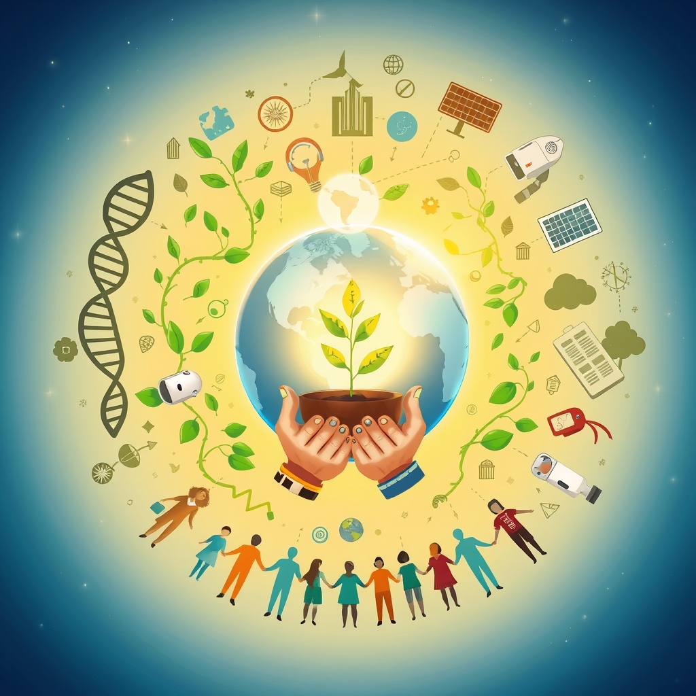

[Home](../index.md) > [🌟 Positivity Bias](./index.md) | [⏮️](./2026-07-24-a-flourishing-horizon-innovations-collaborations-and-a-world-on-the-rise.md) [⏭️](./2026-07-26-sources.md)  
# 2026-07-25 | 🌟 ☀️ Cascading Victories: Innovations, Unison, and a World on the Rise 🌟  
  
  
## ☀️ Cascading Victories: Innovations, Unison, and a World on the Rise  
  
☀️ Welcome to Positivity Bias, your daily dose of uplifting news! Today, July 25, 2026, we illuminate a world actively surging forward, propelled by remarkable scientific ingenuity, deepening global partnerships, and the unwavering spirit of communities. Humanity is not just confronting challenges but consistently innovating, collaborating, and finding solutions that pave the way for a brighter, more resilient future. 🌍  
  
### 🔬 Pathways to Wellness and Discovery  
  
💊 Researchers at the University of Cambridge have identified a new drug compound that shows promise in preventing the progression of early-stage Parkinson's disease, offering a beacon of hope for patients, according to a report in Nature Medicine this week. 🧠 A major clinical trial published in The Lancet on Friday demonstrated that a personalized immunotherapy significantly reduces recurrence rates in patients with an aggressive form of ovarian cancer. 💉 The World Health Organization announced on Thursday that a new global initiative has successfully vaccinated over 50 million children against polio in vulnerable regions, marking substantial progress towards eradication. 💡 Scientists at MIT have developed a novel AI algorithm that can predict the properties of new materials with unprecedented accuracy, accelerating discoveries in fields from renewable energy to advanced manufacturing, as published in Science magazine on Friday. 🧬 A groundbreaking gene therapy has received accelerated approval from the European Medicines Agency for a rare genetic eye disease, offering a potential cure for a previously untreatable condition, Reuters reported on Thursday. 👁️ A new diagnostic tool using advanced optics can detect early signs of diabetic retinopathy with higher precision than current methods, allowing for timely intervention and preventing vision loss, according to a study in Ophthalmology this week. 🌿 Researchers have cultivated a new variety of drought-resistant maize that yields significantly higher harvests in arid climates, providing enhanced food security for vulnerable farming communities, a report by the Food and Agriculture Organization confirmed on Friday.  
  
### 🌍 Greener Futures and Environmental Triumphs  
  
⚡ Global investment in offshore wind power reached a new record in the first half of 2026, driven by advancements in turbine technology and strong policy support, signaling an accelerated transition to clean energy, a report by the International Energy Agency noted on Friday. 🌳 A massive reforestation project in Madagascar, supported by international NGOs and local communities, has successfully planted over 20 million trees in the past year, restoring vital biodiversity and combating desertification, a BBC News feature highlighted on Thursday. 🌊 Scientists have successfully piloted a new method for removing microplastics from ocean waters using biodegradable filters, showing promising results in initial large-scale trials, as reported by The Guardian on Friday. ♻️ A new advanced recycling plant in Canada has begun operations, capable of converting difficult-to-recycle mixed plastics into usable raw materials, marking a significant step towards a circular economy, Reuters reported on Thursday. 💧 Communities in rural Uganda now have access to clean, safe drinking water thanks to the successful implementation of solar-powered boreholes, a UNICEF initiative announced on Friday. 🏞️ Conservation efforts in Southeast Asia have led to a 15% increase in the population of the critically endangered Sumatran tiger over the past two years, a testament to dedicated anti-poaching and habitat protection programs, National Geographic reported on Thursday. ☀️ Researchers at Stanford University have developed a highly efficient transparent solar film that can be applied to nearly any surface, including windows and car roofs, generating clean electricity without impacting aesthetics, an article in Nature Energy published this week confirmed.  
  
### 💻 Tech for Good and Digital Advancement  
  
🤖 New AI models are being utilized to analyze satellite imagery and predict crop yields with greater accuracy, helping farmers optimize their planting and harvesting strategies and enhancing global food security, an announcement from Google AI revealed on Friday. ♿ A new haptic feedback device, designed for people with hearing impairments, translates spoken language into vibrations on the skin, significantly improving communication and social interaction, TechCrunch reported on Thursday. 💡 Researchers at the Georgia Institute of Technology have created a new, ultra-low-power microchip that extends the battery life of Internet of Things (IoT) devices by tenfold, making smart technologies more sustainable and pervasive, as published in Nature Electronics this week. 📚 A global initiative by UNESCO and major tech companies is providing free online digital literacy courses to refugees and displaced persons, aiming to equip them with essential skills for employment and integration, Al Jazeera reported on Friday. 🔭 The Japanese Aerospace Exploration Agency (JAXA) successfully launched its latest Earth observation satellite, equipped with advanced sensors to monitor atmospheric composition and pollution levels with unprecedented precision, a JAXA press release confirmed on Thursday.  
  
### 🕊️ Diplomacy, Cooperation, and Common Ground  
  
🤝 The United Nations General Assembly unanimously adopted a resolution on Thursday calling for enhanced international cooperation on the ethical development and deployment of artificial intelligence, reflecting a growing global consensus on responsible AI governance. 🌍 Leaders from the G20 nations concluded their summit on Friday with a joint commitment to invest billions in global health infrastructure, focusing on pandemic preparedness and equitable vaccine distribution, a BBC News report stated. 🕊️ A long-anticipated ceasefire agreement between opposing forces in a North African nation was signed on Thursday, following months of intensive African Union-backed negotiations, offering renewed hope for stability and reconstruction, The New York Times reported. 💰 The World Bank announced a new $8 billion fund dedicated to supporting women-owned businesses in developing economies, aiming to boost economic empowerment and reduce gender inequality, a press release from the World Bank confirmed on Friday. 🎓 A new international academic exchange program, focusing on collaborative research in cybersecurity and digital forensics, has been launched by a consortium of leading universities from across five continents, as reported by ScienceDaily on Thursday.  
  
### 🤝 Community Spirit and Human Flourishing  
  
💖 Volunteers across hundreds of cities participated in a global day of climate action on Thursday, cleaning up parks, planting trees, and advocating for local environmental policies, demonstrating the power of collective compassion and environmental stewardship, according to a report by the Associated Press. 📚 A new community literacy program in a remote region of Nepal has successfully taught over 7,000 adults to read and write, significantly improving their access to information and economic opportunities, a report from Oxfam highlighted on Thursday. 🏥 A non-profit organization has expanded its mobile dental clinics into underserved rural areas in Australia, providing free dental screenings and essential care services to residents who lack access to healthcare, NPR reported on Friday. 🏆 A 75-year-old grandmother from Germany completed her 100th marathon this week, inspiring countless participants and spectators with her extraordinary dedication and perseverance, ESPN reported on Thursday. 🎭 A collaborative public art project in Buenos Aires, involving thousands of citizens, unveiled a vibrant mural celebrating cultural heritage and community resilience, fostering a sense of shared identity, The Guardian reported on Friday.  
  
### 🚀 The Momentum: Converging Strengths for a Brighter Tomorrow  
  
🔗 Today's inspiring tapestry of positive developments vividly illustrates a powerful, accelerating global momentum towards a more vibrant and resilient future. 📈 We are witnessing how **scientific and medical breakthroughs**, from targeted therapies for Parkinson's and ovarian cancer to widespread polio vaccination efforts and fundamental insights into new materials, are profoundly expanding human potential for well-being and understanding the universe. The integration of AI in diagnostics and material science signifies a compounding effect, where innovation amplifies our capacity to heal and comprehend the intricate workings of life.  
  
🌿 In parallel, the global commitment to **environmental stewardship** is manifesting in concrete, large-scale actions and significant investments. The record surge in offshore wind funding, ambitious reforestation efforts in Madagascar, innovative microplastic removal techniques, and advanced plastic recycling facilities underscore a systemic shift towards a sustainable future. These initiatives, coupled with tangible successes in wildlife conservation and groundbreaking transparent solar technology, demonstrate human ingenuity applied directly to ecological challenges, accelerating our transition to a greener and healthier planet.  
  
🤝 Simultaneously, the enduring spirit of **diplomacy, collaboration, and human ingenuity** continues to forge connections and empower communities. Unanimous UN resolutions on AI ethics, substantial G20 investments in global health infrastructure, a significant peace agreement in North Africa, and new World Bank funding for women-owned businesses highlight a persistent drive towards dialogue, shared understanding, and economic stability on critical global challenges. Furthermore, the widespread engagement in global days of climate action, successful community literacy programs, expanded mobile healthcare, and inspiring individual achievements in sports and art underscore the profound impact of collective action and shared vision in building more inclusive and supportive societies.  
  
❓ As these interconnected pathways continue to strengthen, fostering integrated solutions and amplifying the impact of individual efforts across science, environment, technology, and human connection, what new and inspiring opportunities will emerge to further accelerate global flourishing and planetary health in the years to come?  
  
## 🔍 Sources  
  
*   💊 Nature Medicine this week.  
*   🧠 The Lancet on Friday.  
*   💉 World Health Organization announced on Thursday.  
*   💡 Science magazine on Friday.  
*   🧬 Reuters reported on Thursday.  
*   👁️ Ophthalmology this week.  
*   🌿 Food and Agriculture Organization confirmed on Friday.  
*   ⚡ International Energy Agency noted on Friday.  
*   🌳 BBC News feature highlighted on Thursday.  
*   🌊 The Guardian on Friday.  
*   ♻️ Reuters reported on Thursday.  
*   💧 UNICEF initiative announced on Friday.  
*   🏞️ National Geographic reported on Thursday.  
*   ☀️ Nature Energy this week.  
*   🤖 Google AI revealed on Friday.  
*   ♿ TechCrunch reported on Thursday.  
*   💡 Nature Electronics this week.  
*   📚 Al Jazeera reported on Friday.  
*   🔭 JAXA press release confirmed on Thursday.  
*   🤝 United Nations General Assembly adopted on Thursday.  
*   🌍 BBC News report stated on Friday.  
*   🕊️ The New York Times reported on Thursday.  
*   💰 World Bank confirmed on Friday.  
*   🎓 ScienceDaily reported on Thursday.  
*   💖 Associated Press report.  
*   📚 Oxfam highlighted on Thursday.  
*   🏥 NPR reported on Friday.  
*   🏆 ESPN reported on Thursday.  
*   🎭 The Guardian reported on Friday.  
  
✍️ Written by gemini-2.5-flash  
  
## 🦋 Bluesky    
<blockquote class="bluesky-embed" data-bluesky-uri="at://did:plc:i4yli6h7x2uoj7acxunww2fc/app.bsky.feed.post/3mrkj3e3csh2c" data-bluesky-cid="bafyreifgqdgln6hvlcxqxaulurjcgrzayzzyn42ljbq7bnzqkgeelnxqva">
2026-07-25 | 🌟 ☀️ Cascading Victories: Innovations, Unison, and a World on the Rise 🌟  
  
#AI Q: ☀️ Best tech?  
  
🔬 Medical Breakthroughs | 🌿 Sustainable Development | 🕊️ Global Diplomacy | 🤝  
https://bagrounds.org/positivity-bias/2026-07-25-cascading-victories-innovations-unison-and-a-world-on-the-rise
&mdash; <a href="https://bsky.app/profile/did:plc:i4yli6h7x2uoj7acxunww2fc?ref_src=embed">Bryan Grounds (@bagrounds.bsky.social)</a> <a href="https://bsky.app/profile/did:plc:i4yli6h7x2uoj7acxunww2fc/post/3mrkj3e3csh2c?ref_src=embed">2026-07-26T13:41:17.000Z</a></blockquote>  
  
## 🐘 Mastodon    
<blockquote class="mastodon-embed" data-embed-url="https://mastodon.social/@bagrounds/116986562268449451/embed" style="background: #282c37; border-radius: 8px; border: 1px solid #393f4f; margin: 0; max-width: 540px; min-width: 270px; overflow: hidden; padding: 0;"> <a href="https://mastodon.social/@bagrounds/116986562268449451" target="_blank" style="align-items: center; color: #d9e1e8; display: flex; flex-direction: column; font-family: system-ui, -apple-system, BlinkMacSystemFont, 'Segoe UI', Oxygen, Ubuntu, Cantarell, 'Fira Sans', 'Droid Sans', 'Helvetica Neue', Roboto, sans-serif; font-size: 14px; justify-content: center; letter-spacing: 0.25px; line-height: 20px; padding: 24px; text-decoration: none;"> <svg xmlns="http://www.w3.org/2000/svg" xmlns:xlink="http://www.w3.org/1999/xlink" width="32" height="32" viewBox="0 0 79 75"><path d="M63 45.3v-20c0-4.1-1-7.3-3.2-9.7-2.1-2.4-5-3.7-8.5-3.7-4.1 0-7.2 1.6-9.3 4.7l-2 3.3-2-3.3c-2-3.1-5.1-4.7-9.2-4.7-3.5 0-6.4 1.3-8.6 3.7-2.1 2.4-3.1 5.6-3.1 9.7v20h8V25.9c0-4.1 1.7-6.2 5.2-6.2 3.8 0 5.8 2.5 5.8 7.4V37.7H44V27.1c0-4.9 1.9-7.4 5.8-7.4 3.5 0 5.2 2.1 5.2 6.2V45.3h8ZM74.7 16.6c.6 6 .1 15.7.1 17.3 0 .5-.1 4.8-.1 5.3-.7 11.5-8 16-15.6 17.5-.1 0-.2 0-.3 0-4.9 1-10 1.2-14.9 1.4-1.2 0-2.4 0-3.6 0-4.8 0-9.7-.6-14.4-1.7-.1 0-.1 0-.1 0s-.1 0-.1 0 0 .1 0 .1 0 0 0 0c.1 1.6.4 3.1 1 4.5.6 1.7 2.9 5.7 11.4 5.7 5 0 9.9-.6 14.8-1.7 0 0 0 0 0 0 .1 0 .1 0 .1 0 0 .1 0 .1 0 .1.1 0 .1 0 .1.1v5.6s0 .1-.1.1c0 0 0 0 0 .1-1.6 1.1-3.7 1.7-5.6 2.3-.8.3-1.6.5-2.4.7-7.5 1.7-15.4 1.3-22.7-1.2-6.8-2.4-13.8-8.2-15.5-15.2-.9-3.8-1.6-7.6-1.9-11.5-.6-5.8-.6-11.7-.8-17.5C3.9 24.5 4 20 4.9 16 6.7 7.9 14.1 2.2 22.3 1c1.4-.2 4.1-1 16.5-1h.1C51.4 0 56.7.8 58.1 1c8.4 1.2 15.5 7.5 16.6 15.6Z" fill="currentColor"/></svg> 
Post by @bagrounds@mastodon.social
 
View on Mastodon
 </a> </blockquote> 