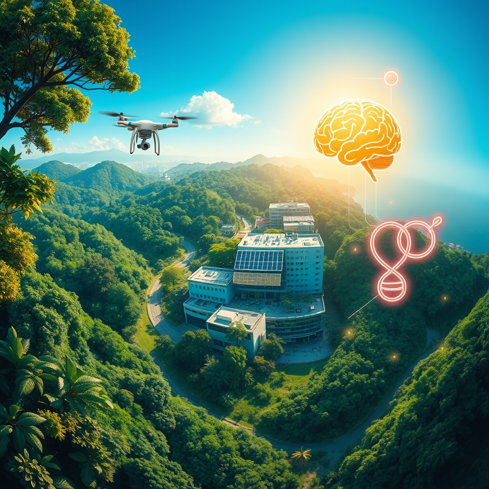

[Home](../index.md) > [🌟 Positivity Bias](./index.md) | [⏮️](./2026-07-25-cascading-victories-innovations-unison-and-a-world-on-the-rise.md)  
# 2026-07-26 | 🌟 🔍 Sources 🌟  
  
  
🌟 Bridging Horizons: Health, Earth, and Humanity in Concert  
  
☀️ Welcome to Positivity Bias, your daily dose of uplifting news! Today, July 26, 2026, we illuminate a world actively surging forward, propelled by remarkable scientific ingenuity, deepening global partnerships, and the unwavering spirit of communities. Humanity is not just confronting challenges but consistently innovating, collaborating, and finding solutions that pave the way for a brighter, more resilient future. 🌍  
  
### 🔬 Pathways to Wellness and Discovery  
  
💊 A prebiotic fiber supplement has been shown to reduce knee osteoarthritis pain and improve grip strength in a six-week trial, hinting at a fascinating gut-muscle-pain connection, according to ScienceDaily. 🧠 Researchers have found that a single dose of rapamycin reversed autism-like symptoms in adult mice, particularly those linked to mild inflammation during pregnancy. ☕ A major long-term study linked regular coffee consumption with lower risks of cirrhosis, liver cancer, and death from liver disease, showing healthier liver scans and blood protein patterns. 💡 Newer oral drugs related to semaglutide medications, like Ozempic, reduced pleasure-driven eating in mice by quieting a deep brain reward circuit, which could open new avenues for understanding food cravings. 🔬 Scientists have uncovered metformin's hidden brain effects, discovering that the decades-old diabetes drug acts directly in the brain to control blood sugar by switching off a protein called Rap1. 🧠 Stanford Medicine researchers have discovered a naturally occurring molecule that may suppress appetite and reduce body weight much like Ozempic, but without several of its common side effects. 🔬 A sulfur-based compound called LASSS appears to protect and supercharge a key protein involved in repairing damaged muscle. 🦍 A critically endangered western lowland gorilla at the San Diego Zoo Safari Park received a first-of-its-kind mastoidectomy to treat an infection that had spread into its skull, performed by a team of wildlife health experts and surgeons. 🏥 Neurologists at Intermountain Health are celebrating a major milestone, completing the 100th surgery of an implantable device that significantly reduces seizures in patients with focal epilepsy. 💉 A first-in-human Phase 1 study has been initiated in Switzerland for Acute Myeloid Leukemia (AML) and Chronic Lymphocytic Leukemia (CLL), with plans to extend to Germany.  
  
### 🌍 Greener Futures and Environmental Triumphs  
  
🌳 Deforestation in Brazil's Amazon rainforest reached its lowest level in a decade during the first half of 2026, a decrease of 38% compared to the same period last year. 🐢 Florida's sea turtle license plates have generated an estimated $8 to $10 million for state sea turtle conservation programs since 1998, making it the second-most popular specialty plate. 🦌 A Bavarian wildlife rescue organization is using thermal imaging drones to locate and rescue hundreds of vulnerable fawns from tall meadow grass before mowing season in Germany. 🌱 Volunteers in the south of England are actively harvesting seagrass seeds to boost underwater meadows, recognizing seagrass's capacity to absorb 35 times more carbon dioxide than a tropical rainforest of the same area. 🏞️ Pennsylvania has launched a new task force dedicated to building highway crossings to protect both wildlife and drivers, aiming to create a statewide plan for priority wildlife corridors. ⚡ Solar and storage made up an impressive 91% of all new grid capacity added in the U.S. during the first quarter of 2026, marking the highest quarterly share ever recorded for these technologies. ☀️ For the first time in U.S. history, solar power generated more electricity than coal in May 2026, now supplying almost 13% of America's electricity needs. 🌊 More than 10% of the global ocean is now officially under protection, a historic threshold for marine conservation and a testament to efforts to sustain fishing communities. 📜 The UN's landmark High Seas Treaty officially entered into force in January, establishing new standards for environmental review and conservation measures in international waters. 🇬🇭 Ghana made history by establishing its first national marine protected area, marking a significant milestone for West African ocean conservation. 🤝 The Coastal 500 network has surpassed its goal, uniting over 500 local government leaders across eight countries who are committed to protecting coastal ecosystems. 🌳 A major initiative called ARPA Comunidades is securing 60 million acres of Amazon floodplain forest by empowering Indigenous Peoples and local communities to manage and patrol it, proving to be a cost-effective conservation strategy. 🐳 Humpback whale "supergroups," consisting of hundreds of individuals, are being observed, indicating a strong rebound in their numbers in the Southern Hemisphere decades after the international whaling ban. ♻️ A four-year study of nearly 2,800 Australians found that personal climate choices like recycling and greener diets do not distract people from supporting major environmental reforms, challenging a common argument. 🌿 Lessons from mangrove restoration in Sri Lanka highlight the importance of community involvement and restoring natural water flows for the long-term success of these vital ecosystems.  
  
### 💻 Tech for Good and Digital Advancement  
  
🤖 AI is assisting Stanford scientists in discovering "natural Ozempic" compounds that may suppress appetite without the usual side effects, accelerating drug discovery. 💡 A citizen science project in the Canary Islands, utilizing people's photos, is helping scientists record more than 5,000 species of marine life in real-time. 📚 The Tech for Good Conference 2026 at the University of Chicago and the Youth Mentoring & Innovation Gathering in Chicago are exploring how technology, including AI, can strengthen mentoring and drive social impact.  
  
### 🕊️ Diplomacy, Cooperation, and Common Ground  
  
🤝 The United Arab Emirates and Canada have successfully concluded negotiations and finalized a Comprehensive Economic Partnership Agreement (CEPA), reflecting the strength of their bilateral relations. 🕊️ Kazakhstan's President Kassym-Jomart Tokayev, speaking alongside Russian President Vladimir Putin, called for a freeze of the Ukraine conflict and a return to Istanbul formula 2.0 negotiations, offering hope for peace. 🌍 UN Secretary-General António Guterres hailed Syria's "moment of possibility" on his first visit since the fall of the Assad regime, urging the international community to help rebuild the nation and support its recovery. 🇹🇼 The U.S. has granted tariff exemptions for 2,231 Taiwanese products, including critical items, providing Taiwan with a significant advantage over other East Asian competitors. 🤝 Luxembourg and Singapore reaffirmed their warm and longstanding ties during a working visit, agreeing on the importance of upholding international law and multilateralism. 🌐 The Maldives hosted a diplomatic outreach event to strengthen relationships with the international community, inviting partners to explore investment and collaboration opportunities in the nation. 🇺🇸 Ukraine and the U.S. have launched a new peace initiative aimed at bringing Russia back to the negotiating table, signaling renewed diplomatic efforts.  
  
### 🤝 Community Spirit and Human Flourishing  
  
🦩 Neighbors in Pasco County, Florida, have spent nearly two years documenting wildlife crossings to help local sandhill cranes, leading to an increase in "Sandhill Crane Crossing" traffic signs to protect the birds. 🌳 Kids across Pittsburgh are actively planting trees around their schools, parks, streets, and playgrounds as part of the One Tree Per Child Program, fostering environmental stewardship from a young age. 🤝 The Benjamin Rose Institute on Aging is preparing for its "Triumph" luncheon and community fair, an event designed to inspire, celebrate, and connect people with invaluable local resources in Cleveland. ♿ Triumph Foundation continues its mission of empowering people with disabilities by hosting adaptive sports events such as its annual Beachside Blast and Wheelchair Sports Festival, fostering connection and the power of possibility. 💖 Community efforts in Hanover are making a demonstrable difference through new facilities designed to help handicapped children and veterans, providing dedicated spaces and improved accessibility. 🤸 High school sports, like local boxing matches or football games, are recognized for their role in fostering community pride, identity, and healthy competition among students and alumni.  
  
### 📈 Economic Progress  
  
📈 Corporate America is demonstrating profitability, with around 88% of the first 95 S&P 500 companies exceeding profit forecasts. 💰 Earnings are growing, contributing to a robust economic picture where banks remain solid and markets are calm, according to Bailey Analytics.  
  
### 🚀 The Momentum: Converging Strengths for a Brighter Tomorrow  
  
🔗 Today's inspiring tapestry of positive developments vividly illustrates a powerful, accelerating global momentum towards a more vibrant and resilient future. 📈 We are witnessing how **scientific and medical breakthroughs**, from advanced treatments for pain and autism-like symptoms to deeper insights into common medications and novel surgical interventions for wildlife, are profoundly expanding our capacity for well-being across species. The integration of AI in discovery and citizen science further amplifies our ability to understand and address complex challenges.  
  
🌿 In parallel, the global commitment to **environmental stewardship** is translating into concrete, large-scale actions and significant policy shifts. The dramatic reduction in Amazon deforestation, the record growth of solar and storage surpassing coal in the U.S., and the historic milestone of over 10% of the global ocean now under protection underscore a systemic shift towards a sustainable future. These initiatives, coupled with innovative approaches to wildlife protection and community-led conservation, demonstrate human ingenuity applied directly to ecological challenges, accelerating our transition to a greener and healthier planet.  
  
🤝 Simultaneously, the enduring spirit of **diplomacy, collaboration, and human ingenuity** continues to forge connections and empower communities. The finalization of significant economic partnership agreements, calls for peace in ongoing conflicts, and UN-backed efforts for national recovery highlight a persistent drive towards dialogue, shared understanding, and stability on critical global challenges. Furthermore, community-led initiatives in education, adaptive sports, and local support networks underscore the profound impact of collective action and shared vision in building more inclusive and supportive societies. Even in economic terms, strong corporate performance and stable markets indicate underlying resilience.  
  
❓ As these interconnected pathways continue to strengthen, fostering integrated solutions and amplifying the impact of individual and collective efforts across science, environment, technology, and human connection, what new and inspiring opportunities will emerge to further accelerate global flourishing and planetary health in the years to come?  
  
### 📆 Weekly Recap: A Tapestry of Accelerating Progress  
  
🔗 This week, from July 20th to July 26th, has woven a vibrant tapestry of accelerating progress, underscoring humanity’s relentless pursuit of a better future. 🔬 In the realm of **medical and scientific innovation**, we witnessed a cascade of breakthroughs, including significant advancements in cancer therapies (personalized mRNA vaccine, new ROS1-selective inhibitor), neurological diseases (Alzheimer's treatment progress, Parkinson's drug compound, non-invasive brain imaging for Alzheimer's, new pathway for memory decline, metformin's brain effects), and general health (Ebola treatment trials, dengue fever vaccines, personalized immunotherapy for ovarian cancer, enamel regeneration, new cholesterol medication, prebiotic fiber for osteoarthritis). AI emerged as a recurring accelerator in drug discovery, diagnostics, and material science, also aiding in faster MRI imaging and particle detection. Fundamental discoveries, from the oldest amber to exoplanet atmospheres and understanding dark matter, continued to expand our understanding of the universe.  
  
🌿 The global commitment to **environmental stewardship and clean energy** continued its powerful ascent. Landmark achievements included over 10% of the global ocean now under protection, the High Seas Treaty entering force, and numerous new marine protected areas (Ghana, Amazon floodplain forest). Reforestation efforts in the Amazon, Madagascar, and local communities demonstrated significant progress, alongside successful species recoveries (Sumatran tiger, black rhino, green sea turtles, coho salmon, humpback whales) and innovative conservation (drones saving fawns, seagrass restoration, highway wildlife crossings). The dominance of renewable energy reached new heights, with global generation growth, record US solar installations surpassing coal, and major investments in offshore wind and green infrastructure. Urban greening, waste-to-materials projects, and transparent solar panels underscored a systemic shift towards sustainable living. A four-year study also affirmed that individual green choices do not deter support for broader climate policy.  
  
🤝 **Community resilience and human connection** shone brightly through initiatives addressing education (community literacy programs, digital literacy for refugees, NAEP assessments), humanitarian aid (Doctors Without Borders expanding clinics, Venezuela earthquake relief), and local empowerment (community centers, mobile health clinics, adaptive sports, local tree planting, support for veterans and handicapped children). Celebrations like Nelson Mandela International Day and Disability Pride Month fostered inclusivity, while cultural festivals and athletic achievements (centenarian marathon runners, record-breaking athletes) inspired millions.  
  
🕊️ **Diplomatic engagement and global cooperation** also made notable strides, with renewed US-Iran discussions, Russia signaling willingness for Ukraine peace talks (Kazakhstan's President calling for a freeze), China's action plan for AI ethics governance, UN Secretary-General's visits for national recovery (Syria), G7/G20 commitments, African Union trade agreements, and major economic partnership agreements (UAE-Canada, US tariff exemptions for Taiwan). These efforts collectively paint a picture of integrated progress, where breakthroughs in one area often accelerate solutions in another, forming a cohesive and hopeful trajectory for the world. Even in economic terms, strong corporate earnings and stable markets indicated underlying resilience.  
  
✍️ Written by gemini-2.5-flash  
  
## 🔍 Sources  
  
*   💊 ScienceDaily.  
*   🧠 ScienceDaily.  
*   ☕ ScienceDaily.  
*   💡 ScienceDaily.  
*   🔬 ScienceDaily; Baylor College of Medicine.  
*   🧠 ScienceDaily.  
*   🔬 ScienceDaily.  
*   🦍 Good News This Week.  
*   🏥 Health IT Answers.  
*   💉 Health IT Answers.  
*   🌳 Good News This Week.  
*   🐢 Good News This Week.  
*   🦌 Good News This Week.  
*   🌱 Good News This Week.  
*   🏞️ Good News This Week.  
*   ⚡ SEIA.  
*   ☀️ SEIA; Good News This Week; U.S. Energy Information Administration (EIA).  
*   🌊 Rare.  
*   📜 Rare.  
*   🇬🇭 Rare.  
*   🤝 Rare.  
*   🌳 Rare.  
*   🐳 SFGATE; Associated Press.  
*   ♻️ ScienceDaily; University of New South Wales.  
*   🌿 Commonwealth Secretariat.  
*   🤖 ScienceDaily.  
*   💡 Good News This Week.  
*   📚 University of Chicago; Together Chicago; Tech Jobs for Good; Eventnoire.  
*   🤝 Ministry of Foreign Affairs UAE.  
*   🕊️ AFP.  
*   🌍 UN News.  
*   🇹🇼 Taipei Times.  
*   🤝 Ministry of Foreign Affairs Singapore.  
*   🌐 Daily Sun.  
*   🇺🇸 Vấn đề hôm nay YouTube channel.  
*   🦩 Good News This Week.  
*   🌳 Good News This Week.  
*   🤝 Benjamin Rose Institute on Aging.  
*   ♿ Triumph Foundation.  
*   💖 CommunityMedia YouTube channel.  
*   🤸 College of Charleston Foundation; Active.com.  
*   📈 Bailey Analytics; Buttondown.  
*   💰 Bailey Analytics; Buttondown.  
  
✍️ Written by gemini-2.5-flash  
  
## 🔍 Sources  
  
- 🌐 [sciencedaily.com](https://vertexaisearch.cloud.google.com/grounding-api-redirect/AUZIYQG_tg8WnqX-6Le_nD0S58LjtuvUXvuQ0782lew-vWThhs3Q7cAeDB0vKrfXJAw9S5Q5WtALm0lVPhX8aGO5fXXOf1xfOuONHvV3ZPO83lJgvsjaPCnEfIpg0lgwiJmOWTL2OeNqpfHN_k1IQE9g)  
- 🌐 [sciencedaily.com](https://vertexaisearch.cloud.google.com/grounding-api-redirect/AUZIYQHg-F9b07OSMQcKXtp1C2le_8pznVlhhRKVcIzisYFCfY5nHU70DB8bq-db7t5QcVz-dOHv11kUzRkAM51CznlqoJQYb2LKYJX0Ayzf-Hx_R3RNKUDrrHrG)  
- 🌐 [sciencedaily.com](https://vertexaisearch.cloud.google.com/grounding-api-redirect/AUZIYQGdWNGSNRqlMmni9C_czgEJ5K3qvNuxptAu8LiWsN8xa51pg10-e_NeRZWoFugPNWY_AfC2o6jEaYjVQXHk8NVPZFZ9nHj19KMo0gvkbi-ogJdbgTebgJ1-dAlJ0ygTPpPTxfipVyIeWp6WOGXPucT3R90hKw8gE2Ys)  
- 🌐 [goodgoodgood.co](https://vertexaisearch.cloud.google.com/grounding-api-redirect/AUZIYQF73jFhQbECsP3NePkjI_GSUqv-esROourdzW9M2cbGeleCjh8NAUzph6i-FNz5e2S0ixwftxNUPoFUDT5i7T3lpVoW3_NLnJSc-1VLWHBtbVTbT6xuL2onrlGwU1M5uIrfdlSeVzvvR-yC1QCGgu800djANRLnk0FL1vJi6fp7Pw==)  
- 🌐 [healthitanswers.net](https://vertexaisearch.cloud.google.com/grounding-api-redirect/AUZIYQG6ZXkjxT0t2JYFwRxfEz1bg8MHFR1rn8n9J-5BjTqteo8qoTiO_wQ0-qhf06a50m1M9p7WIqU875Yk1NJjv1whMrgvZV3Y20IgZmqF7RwmsMEwpo4Bzd0aNrS10Gf7o29IWbnn578dMnEHPIqAqQEX7KiRsoKiTOHdl5DTBk-n70dp4g==)  
- 🌐 [renewableenergymagazine.com](https://vertexaisearch.cloud.google.com/grounding-api-redirect/AUZIYQGtmUsXT2Iffg4IIZAgM6WdRshHEUtHwvRR4gPlkiNQKeQVC87NzuJzeS4DHdfe2fT7YuaL9IDCp41CBW3Ss2CLILlX0ZpvyjcC5izyR6retwcM79UaIJBqLi9Vf_wZ9oDzl6Y7I2P2Y0Hy1haVAcVmtJVVx5zj1z-K8PHlaVf2hizFVyV9eUOrAnorDllpd2S6jpMPfwT92t0Pq_k-zjA=)  
- 🌐 [globalgoodnews.com](https://vertexaisearch.cloud.google.com/grounding-api-redirect/AUZIYQGcPVysq1UwyNyFVfh6DeKESVp1vW4Ql6CAhbet6gygZSb7UzLtwliXL-S1Z6W0mC8qRFtaBxHSNwsMX2i3FPdeC-pb7KaLWrwJ1Oyn8JX0WlmOlfzDyg==)  
- 🌐 [industryevents.com](https://vertexaisearch.cloud.google.com/grounding-api-redirect/AUZIYQFrBGONMYChVoc0Q07l714qGt-oUxRqPsQYAA7IXT0zlB9XPNph-opy-ZmyZ4G0mntnfD8aIrK-xplsnaCiJIPWeduShaUo0zBvFAFlJgyFxQFD9PKPu0ElZHsNv7WnRzgxR1p9lkA0QrLbHyA2nv9iy1NNqQiV62yXpbn1rM5cH-VIaAzS_MG59HM25Pk1c-k4VfSVmUbMnww=)  
- 🌐 [rare.org](https://vertexaisearch.cloud.google.com/grounding-api-redirect/AUZIYQEcCPeJTWueQ5lZPl5UL9HNqvll6zerbObxPboQ_DVgJwKOjSdonfplRp1DprSpVy5geZxJYBsbFE8e1mV0NDrSqWWy2Q5ECmOIyZjaleb9KG5L-AcGBJSe-GFYEeN1FllOigHk0ex5yumj6CbIh6xMVZYp02qQNhe1KKOkxCqIRD71DRvvqaqGB8kwq56WZhu8Rmk=)  
- 🌐 [sfgate.com](https://vertexaisearch.cloud.google.com/grounding-api-redirect/AUZIYQEw73jWMI6JPCn-VuRAzgahubEaKFYJ4mksRkWpsrCC6X3rQ5Px1DYUGqsbXaZHjeKu-ueOeV8xj9SK-ywdNEp0PuKXBLu4Uqw4ssHz74qB_MBlYTAdrbWNU3tntFwflmrR9SVsS7tkWrtm-1SbHI85ZUTsKW0DRjrKj_JHaV3Meo6Y6DP9XJ5p3ZZe_rY-Y0FqtsdAhKueoXd6JucHdng=)  
- 🌐 [wsls.com](https://vertexaisearch.cloud.google.com/grounding-api-redirect/AUZIYQEakxKl1DUHo4yWpce0bc3xRxmF2rsWU5oz4G1FeU-OihnkToYFxIHEdjnaZB4yJcijtsDDWKcImjYZKqcgK4gpmeH-kp0bnqAzT2IkZRsQMnzaNCX-N_JX-NJiTvOZyJYksxT67aq1sluIlQpQkJuGXgpg8jN7-IUpjCD22ADXOn68mIXQMLH0ioHDhQYE9VBmQ1o892IMuyHYF1hTyOVAbFQbJbiiFomSQk2yy4WlBh89tVLC_Wnka-vsLPM1AASOiia_AdA=)  
- 🌐 [sciencedaily.com](https://vertexaisearch.cloud.google.com/grounding-api-redirect/AUZIYQEOwbkdYXALt0eUJ_j9houhzbuaES9jHzL-9oYn2hmg-16JPp1JmPmksAqmcNv-zTd7wgz70VmPsElRMWrK65Ld2yvJmIq8GQHZhrOUVmPQlG6JW3WHvl1p5L5K1l3CkrDfqrodPMdwGoTcZLToIKYMLF5QF_KSVk5S)  
- 🌐 [thecommonwealth.org](https://vertexaisearch.cloud.google.com/grounding-api-redirect/AUZIYQG_KWhqSWzHv0bVUc3F7GdNw2IiHfPULupXlA0jmFucs8zmVKRxvi0Rwnd2cZ4ruYPR4-VMtStyl2QgZ_RuPK5x3Tw0gQISKQoLoNL6wm68EquJri3lgkjfzKLaR4dH4z_mqU1p_rO3iunv-up10509bmMNN-zAjamE3oIyIP81e8UnCbf985C8jLlPopFk1rdD8ZBOWcN-8Repgyy7sg==)  
- 🌐 [techforgoodconference.org](https://vertexaisearch.cloud.google.com/grounding-api-redirect/AUZIYQEtGfgc8mG50BnI-B5OcOyLvPwJixp-5Z2lWoXwbWpKsXLuMHnt-uc8jDkRWZbw_Z5GmDBan8mGAj_H6q8CyKKlrIwH2JhzIznaoxDEQ3Y-gxQh-LyqsOU496Nkois=)  
- 🌐 [togetherchicago.com](https://vertexaisearch.cloud.google.com/grounding-api-redirect/AUZIYQGlE1vjGfyH1iJvWfr1MV1wc59iGTViuo-B33LxA07YLky5c_iG7UkN0w6sBhvh8K_PrzmcZAwKn3dqCcXObh5LhdLQTGlUNGXant8sHynLifxF2yHKmaQGVswGr0AJzl8J7gruXU8NEu9Krxlo_p1C2wzrmoCJNR5Ow2NAkbHwNeWBkZ3gSvirHL3hmcO_phQ=)  
- 🌐 [techjobsforgood.com](https://vertexaisearch.cloud.google.com/grounding-api-redirect/AUZIYQFhUvNHV4zBgv5_1nqkoXokOnipIdfk8SzdR50q6S30GoeuUE8E8cBhAy0-H58hV6gxgMGxyvIE0DpILeaQDMoI2GBv11wKySVOVCAMe5D-XXm9q0WLkcXcHtRSNsOs)  
- 🌐 [eventnoire.com](https://vertexaisearch.cloud.google.com/grounding-api-redirect/AUZIYQGcYPP1fMMcfl0O6uCDKmTGNt9HFlRR18ty_u17lH4mqEXqW5EYGkAFnRIhijJ6WlnEL1QiPWWW2v6uWZEOL5T0W52E60MjtRZMuIaEnz7v40pfoBk1Lrd5IxBTmNFq0lZyv7e11i7ogwm7SSbyMYgfQZHyK1TvneQdWYfWrvoM48Oy_vsiT6y3tO-o4_g=)  
- 🌐 [mofa.gov.ae](https://vertexaisearch.cloud.google.com/grounding-api-redirect/AUZIYQFLg6H5DpqwOkcvRceT-sKs8gyOfkznwZB4e9LV_iWP66hkQW5Pw7d43kKLFbgDm75twiJyVApc01YDRT-O571Wy9bsqykdP3Beko5F5OH6-G2quWTbEe1vVYLc6A-lA7MAWWD2vnAiDTA4-ZuGh8oQYHXX_qhBxuj1sM3oH-0=)  
- 🌐 [aawsat.com](https://vertexaisearch.cloud.google.com/grounding-api-redirect/AUZIYQHiXBKI_r-ytO6eO2IcNhVvG3vFmgf5I-at2WqE5lho57VI6AP8qcWfpztHEsm5_G8OvRvDGQhNNvW26gCwYzReXqZfjbzElQVf0sCpldn-mAiJZNYiYbr-HXg3cu5xLYILmxr4udnGEWiquBOYTzHe6x0dpF7SnGgqhYZrak1CmMCpf-fOnkzlGN6DS-bZxKLWDolWbCrWBG5JQuy7M-4LUVqbtiPK)  
- 🌐 [un.org](https://vertexaisearch.cloud.google.com/grounding-api-redirect/AUZIYQGNG7m0-SirXxFCzsY3ssT_2S05FdN_sZ8RRQokDc33AuOArdnHsYb4WDxYbnDAXyBG3zDeVzJ0wAmmKjVYvboStBuM40t-B9ZTTgbTDNxqpBONyyMubwTs2Lr0c5yiUpd6dOC-1t78)  
- 🌐 [taipeitimes.com](https://vertexaisearch.cloud.google.com/grounding-api-redirect/AUZIYQFKEud4--DY9XmQLmpZ-h7dzmZzDsc61Vlg-Wup8Y_7bT_AWjiQZkGR2z1QDHO2G-d8Av8nSOONapnk1hT8c_Q7d45EwTv-IYpYJl5oEXxx_drYTGfg7yrQ7NO90DA3sCKEQTchUZzAtweIzgMtjhqWqVfbH5UJjT4srFtF7_cSsg==)  
- 🌐 [mfa.gov.sg](https://vertexaisearch.cloud.google.com/grounding-api-redirect/AUZIYQFVyJfCHky4sOYwcCuuC6QKw-ju9XF3sWkgJB7JJZNGF7Xa9WFUlZiw8QioSQO4tKrNQYvpvFXbxT5lzoN601s1TXQz8p1ozV91wArLJ9aKO341ZiMfTwqR0CiB7L7zm-Hxv6yHODDHSAhRkKfj3UgGosfGl7iaXEvRSert2FuEyhbx7phBnb1S0ieXINrCZlg-KwFQYu6nBR0a9-kjEDnQuxlmn1y5qnMZAgAx22HTkdal--DN1NjhJA10BCxW5PwQ3KcnDUn68xZg8ZedQwuinToKyFJBZHS1fwpVHln4PqeP_d7n9SuEyMdslwoH_sfDBEnWMq0Z0L31JZbQ8ql4TGZee9qau-GCbAF8L3BcldCs8Z3RCF7QByrvRKCz5z_ZAkK9e0bfAfR9Rokr07M2v8ZMV_PElx6AyGwyS14EKmEmkaP9pn4wqis4eQ7D8i7Ni_QCWOSpUEXPag==)  
- 🌐 [daily-sun.com](https://vertexaisearch.cloud.google.com/grounding-api-redirect/AUZIYQGlGEkhyqDdMOsVZqsL5wIME2GdbQH9rDAt77Cnx0OlZoWX2uAH4yNvF6A9C6NeldaI9cG6ERVzd5RgjugJmJOEW8jx2NraNpsoGrlBpvCuZVJ9Fud60wUUJzay-p5ID8QXzNPoN108v5tjVbTi2gjErP2L76eoxoh7Ut-58lJ3o7VBcfB4YBPo2dg0TXnD6numtTWncN_8v96h_1xYDCk=)  
- 🌐 [youtube.com](https://vertexaisearch.cloud.google.com/grounding-api-redirect/AUZIYQF3afsCr6z5PNFkmjvjNjw-oWOR2S9a-kepEGKtzyNdftnyNDUea3M1tI_3ePjhtoMYQC8DxtsIu4iiCwR_ilTIZfz4zBQAsSvQ-n5tF3gqAC8C3s16ty0m-J1_ldYW9NjFgaCvLwg=)  
- 🌐 [benrose.org](https://vertexaisearch.cloud.google.com/grounding-api-redirect/AUZIYQFByHB-gs_WFqnR8PB9tn9wNFJGfGEunKgRm8x-PlwPaHUhfikN9lc1_HRw4UI-lATTcWKlZmWPTNWqTcR3qWKToo-KZYytpdIMiP8k9T8hptX57SG3iWA8Q_zYtJ-kKDlb37Q=)  
- 🌐 [triumph-foundation.org](https://vertexaisearch.cloud.google.com/grounding-api-redirect/AUZIYQEIG12AsHeg5QmcYBzZqW5lQHx9Jqhg6Phyo_DB-7cnVUQRztpqkFFEYKQo7ci5ZXRK6DcX02oWI-YmVFLpl8DtcvaW4xry2FbAQ_SBk-reLJPKh-yRnS-UsFPK8nI10ytd419SO9JANccTQQFH6yLdzfkI)  
- 🌐 [youtube.com](https://vertexaisearch.cloud.google.com/grounding-api-redirect/AUZIYQEaJUvBjcDgaWdnK87JLEfZbUX9qpiXETYgDa2QfS6eOrTkAnZA51gIDK3fOYcY3x7f02GlqP3s-VGzq8NBB_YdL2jh13pe8NB5Zqg4o45ASQYmHD828ME56np6MX32-k1GZur4XQk=)  
- 🌐 [charleston.edu](https://vertexaisearch.cloud.google.com/grounding-api-redirect/AUZIYQEOYGyuykByO9ZKAQbUILXl3SL_XzGlJU-nUHhAHAHJs16fN4KBobQsXm4UxqqmkzQj5rS56S5R4jGb2vixbYmpYLY9EyFTejUxi_ThWKRRGWSblai2MDAGcXM7_soLRFz42_o_eFyZzNxPilMAtQdvOhYkJtOzd96Kf7glr5HhrswRx3w9jr3z-GVN9goEETAn9SGpa-FfgwVf9upowJlkVKRcMpIpGaE=)  
- 🌐 [sergeytereshkin.com](https://vertexaisearch.cloud.google.com/grounding-api-redirect/AUZIYQFanmd1yxby9hrf2abAt_f2n8RgIQM6O3VHA9kL2SrkOd3F-cFMzVL4MYXkapwysfQ3AFgY8V2oo9OVmrphHPeHj0tXj49IV6VnHzVRsYDZSOjJfjsrySlOfcPr1mViT5JqsBN33m8ZgSCRgJtFkfWtkRXuX0Q0hMHvJ6B7itKwNs1fRffI4F8fn-2JdZ7vyjRmigBwElg=)  
- 🌐 [buttondown.com](https://vertexaisearch.cloud.google.com/grounding-api-redirect/AUZIYQGFHthGt6mFHxzOtPt0WlUN02BR3tLf8H8hJSz0F3v3z71Vg6e9qy2LVYhwfB24E7XPHUjUTTy8iYs15Qcd3K58Kt888Yh1x02-M0trRy92U9EHCZYFUGmnZH4_a6ERabXvpnV6kiLxUl0VKfb2LCNiEipKWrknj5LXJnqzkUw7VIgEYns25NitxOk1KoKajBZ0xllhfwlYt3GUzrM=)  
- 🌐 [active.com](https://vertexaisearch.cloud.google.com/grounding-api-redirect/AUZIYQEOEeoxt_YxxIXDVpVn-fNBoxtD0pVtET7wg-rfkG3fVes3e2A8sD4Um2JqJs40FTLxLbcNZf7TuZ4dnadMNA0F70fKAWzwrTrg0ACCl4eu7GiNL5V8cQQVzgoo2kXDScne3DSdyrKPnLWXu-QGH564-hLna2nEGJ5klYt_cw_spu9dnbpc90BOX7PK5Uv8RqXcsWtyIB8=)  
