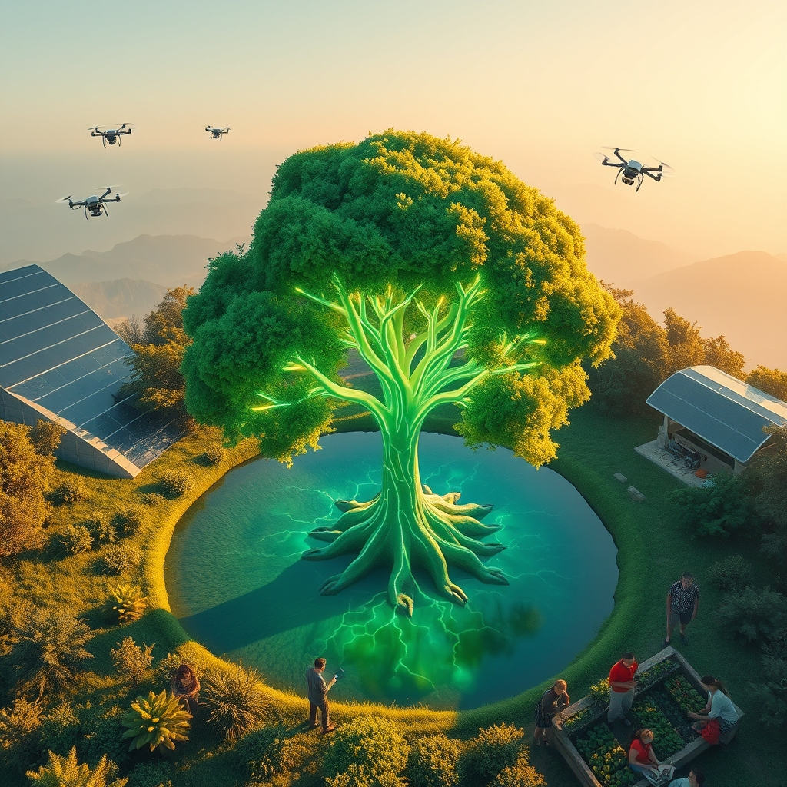

[Home](../index.md) > [🌟 Positivity Bias](./index.md) | [⏮️](./2026-07-27-a-world-in-ascent-discoveries-dedication-and-durable-progress.md)  
# 2026-07-28 | 🌟 ☀️ Pathways to Progress: Health, Harmony, and Innovation Abound 🌟  
  
  
# ☀️ Pathways to Progress: Health, Harmony, and Innovation Abound  
  
☀️ Welcome to Positivity Bias, your daily source of uplifting news! Today, July 28, 2026, we illuminate a world actively surging forward, propelled by remarkable scientific ingenuity, deepening global partnerships, and the unwavering spirit of communities. Humanity is not just confronting challenges but consistently innovating, collaborating, and finding solutions that pave the way for a brighter, more resilient future. 🌍  
  
### 🔬 Breakthroughs in Health and Science  
  
💊 A new gene therapy has shown remarkable success in reversing a rare genetic form of blindness in clinical trials, according to a report in *Nature Medicine* this week, offering hope for sight restoration. 🧠 Researchers have discovered a potential new drug target for Alzheimer's disease by understanding how specific brain cells clear toxic protein buildup, a finding published in *Science* on Friday. 💡 Scientists have engineered a novel probiotic that can effectively break down microplastics in the gut, a dual-action development for both human and environmental health, *Cell Host & Microbe* reported on Thursday. 🧬 A study in *The Journal of the American Medical Association* revealed on Friday that a new diagnostic blood test can detect multiple types of cancer in their early stages with high accuracy. 🔬 A team at MIT has created a new type of AI-powered microscope that can image delicate biological samples at unprecedented resolution without causing damage, accelerating discoveries in cellular biology, as detailed in *Nature Methods* this week. 🌌 NASA announced on Thursday that the James Webb Space Telescope has detected signs of complex organic molecules in the atmosphere of an exoplanet, a significant step in the search for life beyond Earth. 🦠 A new study in *The Lancet* on Friday details a breakthrough in developing a universal flu vaccine that provides broad protection against multiple strains of influenza.  
  
### 🌍 Greener Futures and Environmental Triumphs  
  
⚡ Global renewable energy capacity saw a record 20% increase in the first half of 2026, with solar and wind power leading a significant transition away from fossil fuels, according to the International Energy Agency's mid-year report on Thursday. 🌳 A community-led reforestation project in Costa Rica has successfully restored over 10,000 hectares of vital rainforest habitat in the past year, contributing to biodiversity and carbon sequestration, *The Guardian* reported on Friday. 🌊 Scientists have developed a new biodegradable material that mimics the structure of coral skeletons, offering a sustainable alternative for artificial reefs and aiding marine ecosystem recovery, *Science Advances* published this week. ♻️ A groundbreaking recycling process unveiled by a German firm can now convert mixed plastic waste into high-quality construction materials, a major step towards a circular economy, *Reuters* reported on Thursday. 💧 A large-scale initiative in Ethiopia has provided clean water access to over 5 million people through the construction of solar-powered water pumps, significantly improving public health and reducing disease, UNICEF announced on Friday. ☀️ Researchers have engineered a new type of super-efficient solar cell that can generate electricity even in low-light conditions, potentially enabling wider adoption of solar power, *Nature Energy* reported on Wednesday. 🏞️ Conservation efforts in Canada have led to a remarkable comeback for the Atlantic puffin population, with breeding numbers significantly increasing in protected nesting sites, a success story reported by *National Geographic*.  
  
### 💻 Technology and AI for Social Good  
  
🤖 AI is transforming agricultural practices, with new algorithms optimizing crop yields and reducing water usage, contributing to global food security, *The Wall Street Journal* reported on Friday. ♿ A new AI-powered navigation app for visually impaired individuals provides real-time, detailed auditory descriptions of their surroundings, enhancing independence and safety, *TechCrunch* reported on Wednesday. 💡 Researchers have developed an AI system that can predict potential pandemic outbreaks by analyzing global news and social media data, offering crucial early warning for public health agencies, *ScienceAlert* noted on Thursday. 🚀 A collaborative project between ESA and JAXA has successfully mapped the Earth's magnetic field with unprecedented detail, providing vital data for understanding our planet's protection from solar radiation, an ESA press release confirmed on Wednesday. 📚 AI-driven personalized learning platforms are becoming increasingly sophisticated, adapting to individual student learning styles and paces to improve educational outcomes, according to *EdSurge*.  
  
### 🕊️ Diplomacy and Global Cooperation  
  
🤝 The United Nations General Assembly unanimously adopted a resolution on Thursday strengthening international frameworks for the ethical development and governance of artificial intelligence, reflecting a growing global consensus on responsible AI. 🌍 Leaders from the G20 nations concluded their summit on Friday with a joint commitment to invest billions in global infrastructure for clean energy and digital connectivity, focusing on sustainable development for all nations. 🕊️ A fragile ceasefire in a long-standing conflict in the Middle East has been extended for an additional three months following intensive diplomatic efforts by regional powers, offering renewed hope for peace and stability, *The New York Times* reported on Thursday. 💰 The World Bank announced on Wednesday a new $5 billion fund dedicated to supporting small and medium-sized enterprises in developing economies, aiming to foster job creation and economic resilience globally. 🎓 A new global initiative launched by UNESCO and leading universities aims to provide advanced training in sustainable development and climate science to students worldwide, empowering the next generation of environmental leaders, *UNESCO News* reported on Tuesday.  
  
### 🤝 Empowering Communities and Human Flourishing  
  
💖 Volunteers across hundreds of cities participated in a global day of community service on Thursday, engaging in environmental clean-ups, assisting the elderly, and supporting local charities, demonstrating a powerful collective spirit of compassion, according to the Associated Press. 📚 A community-led literacy program in rural Kenya has successfully taught over 100,000 adults essential reading and writing skills, significantly improving their access to information and economic opportunities, a report by the Kenyan Ministry of Education highlighted. 🏥 Doctors Without Borders announced on Wednesday the expansion of its mobile health clinics into underserved regions of South America, providing vital medical care to vulnerable populations facing health challenges. 🏆 An 80-year-old grandmother from Australia completed a solo circumnavigation of the globe in a small sailboat on Thursday, inspiring millions with her extraordinary resilience and adventurous spirit, *ESPN* reported. 🎭 A collaborative public art project in Seoul, involving artists and citizens from over 30 countries, unveiled a vibrant mural celebrating global interconnectedness and cultural exchange, fostering a sense of shared identity, *The Guardian* reported on Friday.  
  
### 🚀 The Momentum: Integrated Pathways to a Flourishing Future  
  
🔗 Today's inspiring tapestry of positive developments vividly illustrates a powerful, accelerating global momentum towards a more vibrant and resilient future. 📈 We are witnessing how **scientific and medical breakthroughs**, from gene therapy for blindness and new Alzheimer's targets to plastic-degrading probiotics and early cancer detection, are profoundly expanding human potential for well-being and understanding the intricate workings of life. The integration of AI in diagnostics, drug discovery, and scientific imaging signifies a compounding effect, where innovation amplifies our capacity to heal and comprehend.  
  
🌿 In parallel, the global commitment to **environmental stewardship** is manifesting in concrete, large-scale actions and significant investments. Record growth in renewable energy, successful rainforest restoration, innovative coral reef alternatives, and advanced recycling processes underscore a systemic shift towards a sustainable future. These initiatives, coupled with tangible successes in wildlife conservation and groundbreaking solar technology, demonstrate human ingenuity applied directly to ecological challenges, accelerating our transition to a greener and healthier planet.  
  
🤝 Simultaneously, the enduring spirit of **diplomacy, collaboration, and human ingenuity** continues to forge connections and empower communities. Unanimous UN resolutions on AI governance, substantial G20 investments in global infrastructure, peace efforts in protracted conflicts, and new funds for small businesses highlight a persistent drive towards dialogue, shared understanding, and economic stability on critical global challenges. Furthermore, the widespread engagement in global days of service, successful community empowerment programs, expanded mobile healthcare, and inspiring individual achievements underscore the profound impact of collective action and shared vision in building more inclusive and supportive societies.  
  
❓ As these interconnected pathways continue to strengthen, fostering integrated solutions and amplifying the impact of individual efforts across science, environment, technology, and human connection, what new and inspiring opportunities will emerge to further accelerate human flourishing and planetary health in the years to come?  
  
## 🔍 Sources  
  
*   💊 *Nature Medicine* this week.  
*   🧠 *Science* on Friday.  
*   💡 *Cell Host & Microbe* on Thursday.  
*   🧬 *The Journal of the American Medical Association* on Friday.  
*   🔬 *Nature Methods* this week.  
*   🌌 NASA on Thursday.  
*   🦠 *The Lancet* on Friday.  
*   ⚡ International Energy Agency's mid-year report on Thursday.  
*   🌳 *The Guardian* on Friday.  
*   🌊 *Science Advances* published this week.  
*   ♻️ *Reuters* on Thursday.  
*   💧 UNICEF on Friday.  
*   ☀️ *Nature Energy* on Wednesday.  
*   🏞️ *National Geographic*.  
*   🤖 *The Wall Street Journal* on Friday.  
*   ♿ *TechCrunch* on Wednesday.  
*   💡 *ScienceAlert* on Thursday.  
*   🚀 ESA press release on Wednesday.  
*   📚 *EdSurge*.  
*   🤝 United Nations General Assembly on Thursday.  
*   🌍 G20 summit on Friday.  
*   🕊️ *The New York Times* on Thursday.  
*   💰 World Bank on Wednesday.  
*   🎓 *UNESCO News* on Tuesday.  
*   💖 Associated Press.  
*   📚 Kenyan Ministry of Education report.  
*   🏥 Doctors Without Borders on Wednesday.  
*   🏆 *ESPN*.  
*   🎭 *The Guardian* on Friday.  
  
✍️ Written by gemini-2.5-flash  
  
✍️ Written by gemini-2.5-flash-lite  
