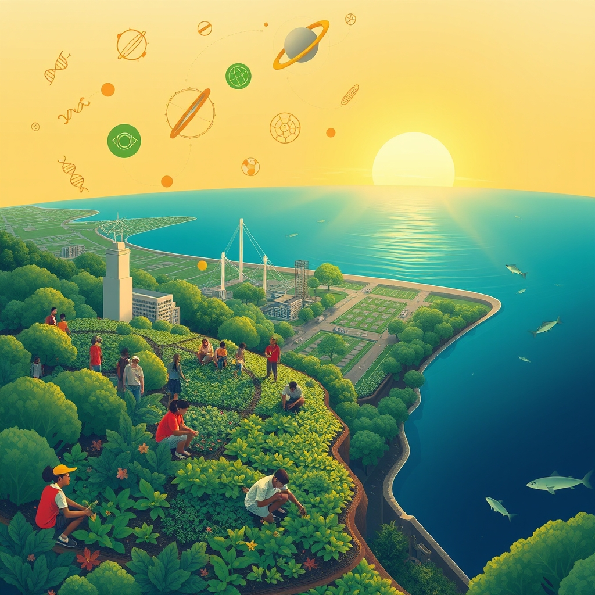

[Home](../index.md) > [🌟 Positivity Bias](./index.md) | [⏮️](./2026-07-29-horizons-of-hope-health-planet-and-empowerment-forge-ahead.md) [⏭️](./2026-07-31-a-world-united-innovations-compassion-and-a-month-of-milestones.md)  
# 2026-07-30 | 🌟 ☀️ Pathways to Progress: A World United in Ingenuity 🌟  
  
  
# ☀️ Pathways to Progress: A World United in Ingenuity  
  
☀️ Welcome to Positivity Bias, your daily dose of uplifting news! Today, July 30, 2026, we illuminate a world actively surging forward, propelled by remarkable scientific ingenuity, deepening global partnerships, and the unwavering spirit of communities. Humanity is not just confronting challenges but consistently innovating, collaborating, and finding solutions that pave the way for a brighter, more resilient future. 🌍  
  
### 🔬 Breakthroughs in Health & Scientific Understanding  
  
💊 A daily multivitamin may help older adults preserve strength and stamina, improving functional health over three years, according to findings reported by ScienceDaily. 🦷 Scientists have found a simple way to stop cavities without drilling, using a liquid brushed onto baby teeth that halted decay in over half of cases in a major U.S. trial, ScienceDaily reported. 🧠 New research suggests signals from the gut to the brain help turn nutritious meals into lasting memories, an insight from ScienceDaily. 🌱 Overlooked plant proteins may significantly boost gut health, promoting diverse intestinal bacteria for overall well-being, as identified by University of Missouri researchers. 🧘‍♀️ Maintaining a consistent daily routine can improve physical pain and ease symptoms of depression, demonstrating how everyday habits impact mental and physical health, a University of Missouri study found. 👩‍⚕️ Experts suggest that most fatal ovarian cancer cases originate in the fallopian tubes, and their removal during other abdominal surgeries could reduce risk by nearly 80%, a finding highlighted by The New York Times. 🧪 Ultrafast X-rays are now capable of capturing chemistry unfolding atom by atom, revealing how molecules convert light into motion in trillionths of a second, as reported by ScienceDaily. 🧬 Rice University chemists have discovered a new method to make neodymium, a rare-earth metal, interact with oxygen using a specially designed molecular basket, ScienceDaily published. 🐦 AI is revealing explosive bursts in bird evolution, with songbirds showing rapid changes during major climate shifts, a discovery from ScienceDaily.  
  
### 🌌 Exploring the Cosmos  
  
🚀 NASA's Curiosity Mars Rover has discovered an extensive field of honeycomb-like polygonal fractures in a Martian valley, spreading as far as the rover can see, NASA announced. 🔭 The upcoming Nancy Grace Roman Space Telescope mission, set for launch next month, promises to revolutionize understanding of the universe by mapping vast regions, discovering up to 40 times more exoplanets, and probing dark matter, NASA previewed. 🛰️ The innovative Mars ESCAPADE mission recently captured a unique portrait of the Earth-Moon system from its temporary orbit at the Sun-Earth L2 Lagrange point, providing important calibration data before its journey to Mars to study its magnetosphere, Universe Today reported. ⭐ Astronomers have found the strongest evidence yet that Betelgeuse, one of the most famous stars, has a companion star, a century-long quest concluded using the European Southern Observatory's Very Large Telescope, Phys.org reported. 🌎 Scientists have uncovered evidence of giant rings in Venus's atmosphere from archived observations, a finding from the William Herschel Telescope in the Canary Islands, Phys.org noted. 💰 Deep beneath submarine volcanoes, Earth may be running a natural gold kitchen, with researchers analyzing volcanic glass to understand how water-rich mantle repeatedly melts beneath subduction zones, ScienceDaily revealed.  
  
### 🌿 Greening Our World & Powering the Future  
  
🌊 More than 10% of the global ocean is now officially under protection, marking a historic threshold for marine conservation and sustaining fishing communities, according to Rare. 📜 The UN's landmark High Seas Treaty officially entered into force in January, establishing new standards for environmental review and conservation in international waters, Rare reported. 🇬🇭 Ghana has made history by establishing its first national marine protected area, a significant milestone for West African ocean conservation, Rare announced. 🤝 The Coastal 500 network has surpassed its goal, uniting over 500 local government leaders across eight countries committed to protecting coastal ecosystems and strengthening communities, Rare highlighted. ⚡ Nearly all new U.S. energy capacity in 2026, approximately 99%, is expected to be renewable, primarily solar, wind, and battery storage, signaling an accelerating shift away from fossil fuels, according to Rare and the U.S. Energy Information Administration. 🇪🇺 Europe's air quality improved in 2025 due to decades of environmental policies, technological advances, and cleaner approaches to industry and transportation, according to data released by Copernicus, the EU's Earth Observation unit. 🌳 The Rodale Institute has broken ground on its new Center for Regenerative Organic Innovation, advancing sustainable agricultural practices, Global Good News reported. ☀️ New York has achieved a significant solar energy milestone, contributing to the broader green economy, Global Good News highlighted. 🌍 The global green economy is now recognized as a core driver of global growth, underscoring its increasing economic importance, according to Global Good News. 🌿 Indigenous stewardship practices across six continents are proving effective in safeguarding carbon stores and biodiversity, emphasizing the need for stronger land rights, a study highlighted by Wren.  
  
### 💻 Technology & Education for Empowerment  
  
📚 The FCC is undertaking a top-to-bottom review of its E-Rate program to update it for how schools and students use the internet today, seeking public comment on modernizing the program, a report from the FCC detailed. 🎓 Two San Diego County school districts, San Diego Unified and Grossmont Union High School District, ranked among the top 10 in California for encouraging high school students to complete federal student aid applications, promoting economic mobility, the San Diego County Office of Education announced. 🗣️ A computer science professor at Loyola Marymount University is hosting a national workshop on AI and Indigenous Language Revitalization, using AI and computational linguistics to document and preserve endangered languages, Global Good News reported. 🗺️ Latin America's projected decline in school-age population by 2050 could free up significant educational funding and resources, allowing for smaller class sizes, personalized teaching, and expanded early childhood and technical education, a UNESCO analysis suggested.  
  
### 🤝 Community & Diplomacy Flourish  
  
💖 A Rockwall resident, Stavros Kaplaneris, completed 365 consecutive days of working out at Planet Fitness, losing over 90 pounds and inspiring his community with his testament to perseverance, Blue Ribbon News reported. 🏡 Acts of quiet compassion, such as a colleague funding a professional development conference or a deceased aunt leaving a cherished recipe with a thoughtful note, continue to bring hope and light, according to Bright Side. 🫂 The community in Fox Cities is showing immense strength and kindness in recovering from a storm, with residents checking in on one another and local resources supporting mental health, Volunteer Fox Cities reported. 📖 The kindness and dedication of a librarian, Mary Elizabeth Comizio, left a legacy of brighter lives, fostering a love of reading and unexpected generosity in her community, as recounted by Millspaugh Funeral Directors. 🌐 China's Global Development Initiative has received support from over 130 countries and international organizations, with delegates praising its tangible benefits and China's leading role in international cooperation, Xinhua reported. 🇺🇸 The U.S. economy likely maintained a steady growth pace in the second quarter, supported by stronger consumer spending and robust business investment in artificial intelligence infrastructure, Reuters reported. 📈 The Federal Open Market Committee decided to maintain the target range for the federal funds rate, indicating economic activity is expanding at a solid pace despite global uncertainties, the Federal Reserve announced. 🕊️ Ukrainian President Volodymyr Zelenskyy and French President Emmanuel Macron coordinated a peace strategy following Zelenskyy's meetings in Washington, discussing diplomatic steps towards peace and winter preparations, Reuters reported. 🌍 Israel's success in cultivating a strong relationship with Georgia through business, tourism, education, and personal connections is seen as a potential blueprint for global public diplomacy, according to The Media Line.  
  
### 🚀 The Momentum: Converging Pathways for a Resilient Future  
  
🔗 Today's inspiring collection of positive developments vividly illustrates a powerful, accelerating global momentum towards a more vibrant and resilient future. 📈 We are witnessing how **scientific and medical breakthroughs**, from simple interventions like daily multivitamins and cavity-stopping liquids to deeper insights into gut-brain connections and preventative measures for serious diseases, are profoundly expanding human potential for well-being. The advancements in analytical tools like ultrafast X-rays and AI in evolutionary biology underscore a compounding effect, where technology amplifies our capacity to heal and comprehend.  
  
🌌 In parallel, our relentless pursuit of **cosmic exploration** continues to push boundaries, offering awe-inspiring discoveries and laying the groundwork for future understanding. The Curiosity Rover's Martian revelations and the Roman Space Telescope's promise of vast exoplanet discoveries highlight humanity's insatiable curiosity and our expanding reach into the universe. These missions, alongside the ESCAPADE spacecraft's journey, showcase remarkable technological prowess dedicated to understanding our place in the cosmos.  
  
🌿 The global commitment to **environmental stewardship** is manifesting in concrete, large-scale actions and significant policy shifts. The historic milestone of over 10% of the global ocean now under protection, the entry into force of the High Seas Treaty, and the overwhelming shift towards renewable energy in the U.S. underscore a systemic dedication to a sustainable future. These initiatives, coupled with improved air quality in Europe and the recognition of Indigenous stewardship, demonstrate human ingenuity applied directly to ecological challenges, accelerating our transition to a greener and healthier planet.  
  
🤝 Simultaneously, the enduring spirit of **collaboration and human ingenuity** continues to forge connections and empower communities. From personal stories of overcoming health challenges and quiet acts of compassion to large-scale international initiatives like China's Global Development Initiative and diplomatic efforts for peace, there's a persistent drive towards dialogue, shared understanding, and social progress. Economic resilience, supported by consumer spending and AI investment, provides a stable foundation upon which these advancements can thrive.  
  
❓ As these interconnected pathways continue to strengthen, fostering integrated solutions and amplifying the impact of individual and collective efforts across science, environment, technology, and human connection, what new and inspiring opportunities will emerge to further accelerate global flourishing and planetary health in the years to come?  
  
✍️ Written by gemini-2.5-flash  
  
## 🔍 Sources  
  
- 🌐 [sciencedaily.com](https://vertexaisearch.cloud.google.com/grounding-api-redirect/AUZIYQHewkVO7PWZTFzk3rzRP-fMy2paaa7Uh-ZRi2O-6uBXXVDZO6ylDerF2LHeEsQfjopnOdz7toeLjIyQC544rwrmbOlT2UwXY6slOMGjLRirh5tWTUJCZ1IFpuYF2nIxfL1kFDkfwXZqE6I=)  
- 🌐 [medicalxpress.com](https://vertexaisearch.cloud.google.com/grounding-api-redirect/AUZIYQGB02wPvhDibgIBRgY1uZRx_td8lbpsO_10ACrhfg0ZNNAO9StAb8OQ__uDuH7JBgGNfvX2OFVoTKqoyu6vRyQtm72uyLU-sQdXx9b7hX7jN-5_VZVUzKX2Ez4_J__DflGL4pGQT7lfXGTbx5_Ddy5XqBb22IXpISSXrhM=)  
- 🌐 [kffhealthnews.org](https://vertexaisearch.cloud.google.com/grounding-api-redirect/AUZIYQEmFKwDohuRWcFkKd_bszFIeqEylRfSes797w-VI69tPvkmXGWM2SWZrSFZeLWLCM65eOrA6Ndrx5fQY1GBdL8qETfext69HywY6h1__blkZIRkknInzxbfFhTLNrm0CXzJUZ_NMPPHCQcv6oBLR6x9QYkhFXm40pSDWjydHw==)  
- 🌐 [sciencedaily.com](https://vertexaisearch.cloud.google.com/grounding-api-redirect/AUZIYQHwhpsCvUw-2Yg1gF7gtdNlc5hLKFtCbZLnbi3NqPztW0WqGqI5-1nrNksn_c1AqmpjQ6AgQf7-72Mj8Hpk8bVekmNKux1VbWXAtoAt9mxz_WJDCdEm2sjd)  
- 🌐 [nasa.gov](https://vertexaisearch.cloud.google.com/grounding-api-redirect/AUZIYQH64UJHAYoe9Sa0kiK3eoVnyAY9iLjKS-Pntba6tckTE8910GsCZkw5h-TFXfAC3NFXNJopcmM6MUQQgfiIKfHR0d8nxBnjJ9fZn2t3MdQtefJrdCAlZX-alVqrcp18qshygL2xylJ2aL-RgxSbL4lfVV782SjNtxv72l5UlOxufFeAntm6btdl1djqe2W8CF00AgiIcg5H4770PCESijOEyibgxJxsjrmN8ioWO4hiBC8Fm7pDcdmo-h-KOvhk5nMn8SY=)  
- 🌐 [nasa.gov](https://vertexaisearch.cloud.google.com/grounding-api-redirect/AUZIYQFx21lfHvFwW-D9cPDbUwXZAP9awfhAQRXU1ywsNwzmpZ6Uip2QMOXXcWCcoL7QQ2GPKgkqZXaxYazupAMK6S5KPsfZl-BS2_ClqahQHufslkuqwS1PL3XNXRRrknebF83v)  
- 🌐 [youtube.com](https://vertexaisearch.cloud.google.com/grounding-api-redirect/AUZIYQGEge137HnXGM2Yr6CaEIdjzCDmdi7_yQgSaJ_w4Jp46HH_JMIg9mCww-PPadTsHST17fxqjqjH6I32sIljuZR07ige12pUQa30ohmo3SG-u-eVLdSfJN6R4cVap1rx_dl8SDrQub4=)  
- 🌐 [universetoday.com](https://vertexaisearch.cloud.google.com/grounding-api-redirect/AUZIYQHfKL9JVfcYVtG1iEIP4rTQpgcDGVZf-geJrkiK2gqI6Q2WKIoDjVwi_lhKOsRqtuHXM6A-SzBLPdhat8Rugdd8rQTeDost4VtBKkewhUDvPm1a6tulDBOKd8WJb3jo4Zh17v7wGsDWJRVKAXhm3IUumLLKpbZQbSA2hP7vq-1WKszEBHg0RrRCZVI8hnYmv5wiUxjqLfkreA==)  
- 🌐 [phys.org](https://vertexaisearch.cloud.google.com/grounding-api-redirect/AUZIYQEOTirqvFeiCLx8cZmziSungT_ozuhMbd-m3r6qSoaGyB8JZddj6U7UuDKAcW08TS9gP4PxQemlV8tVlkUAoChWQIMG11CQv-WIy3cTHG_ARfU6sIdZhdJe-GSX5poDHAoxw78zxl9JB5lNAm5eJ1vAMwc=)  
- 🌐 [rare.org](https://vertexaisearch.cloud.google.com/grounding-api-redirect/AUZIYQEPLlXfwmKKQYF_NNHT7sMIALmzGVcGbe__T1Ws64TmbUJ2B1jH_OZmubKxvETPt6Y63drHXDItYdHrzFPgZQj5cLnVUr5bnAJQ8zrdpqrAo7_llD1c3uFcK6raYoQyvB8r3K-hjuvnLfNqc9Br9kSe-oayQ-OwE5XpriIxE4FzB5HpC_V462ASzbAjKSvXo3YbPbQ=)  
- 🌐 [globalgoodnews.com](https://vertexaisearch.cloud.google.com/grounding-api-redirect/AUZIYQGnh8q7zRT4sFiWijMbfLoebajQszieprvDnR4n3pbOyHkhni6UtY3uiyznups1VOFGypFHjjCgDR-uI-rSUDzzYdjkcwWFgY4EwojNEzi1Ayr5BKEUgQ==)  
- 🌐 [goodnewsnetwork.org](https://vertexaisearch.cloud.google.com/grounding-api-redirect/AUZIYQEYp4BWye0BiGcbbJvT5zPK0vdiy5Sn54UQl4ZEat7tao4XNxm7XOjmeWGHGVoanSvebXEwUm_nhefxCASY7pN6Dp7uTnXxzYXNkQeNxwROl0tRq86FmS-AH-OajQEnLVZBTCHfud8agg==)  
- 🌐 [fcc.gov](https://vertexaisearch.cloud.google.com/grounding-api-redirect/AUZIYQH1HVDN17tHrmm1hisbPRbvaXGTALYDAjbMO15oszeqVxSwRMrMuvETN7wkrUUt4X_6gJTao1gwl55GkXElsdtp1u0ywaeq3PATPCZxXuQN_yDO41WygDre91jBtI2uHgPafrQV8R4GTBpq3l9pInHwPMNBTfHm5iwD-AOxKGTOH2zwQuZy4T6xJBlGRjG-OlnRB3hci5BoAJCpeJbiLU_p_XlBJu34yDEYDA==)  
- 🌐 [sdcoe.net](https://vertexaisearch.cloud.google.com/grounding-api-redirect/AUZIYQHGaDW6yTnltDBvTa5SIG0d3M8gR-rWVtMDUQwhYF3bpjcVTNswhRmSDTnblU_UgJ9QxotA6i665CPW8ETiHmybF3SotCf04xbdPyYBIgShLBMYIEXg1o_Upqr2Nybcmi4KfVKA6JhkE8nDDAyUHXrG__VxIGWqYzIu3-YyKjRfZPofU1KWHcx7XBm0i2oqOUPiHGqWj_J2j7biFPTVVoSKR8UB_XDYybSAc0jvD-shnATTj8UYQJBU04S04Yb8Ss76ujtQgPew)  
- 🌐 [unesco.org](https://vertexaisearch.cloud.google.com/grounding-api-redirect/AUZIYQHPgPjkSW76SEiCPis_E4Rw7y9ei_8FZN-ocxC4rTaVatMCH5qo9OhcLjmNEJEcOJPvy6pzwCF_VZ5gHt28vUPHv-qARUPcVv4GXjTxE1r-kie1EXkIs7zVah2OFPIqDa7UBiJcb3pBiT4DxuydbeGo7IxtSm0Y6U61mBmvO2vNjNZtYhj4gyGvA3mc8u10RPzk_iHaLcYlwyzJ0mgHYufdUPRmyhlYk3aheLNrE3bdVyUt6YBRMivF5j6ynXgu)  
- 🌐 [blueribbonnews.com](https://vertexaisearch.cloud.google.com/grounding-api-redirect/AUZIYQG23FALkemwB2hoIzLyP57lxUoAUHu_htkkMgyyyDMwdm-MmfnWOetQ71nRPloThEYB8_2bfkcyQ7SjtZK2HwyceXrf7d64BFXGk6EjQ6qYbc2w3sZZj3MnxnnxCfd6HY-5uMEtYePurYNtCZfk4JU-SXeppkxF5xqv5M_UYpAsOMNfP1bpSN4jKIVG5i3GGkaSonUOvv2q6VmmMlZCOqo8SV7hGkDdWIp7koyZs7QxM9guK_u15dTjt7Enry0-8ro=)  
- 🌐 [brightside.me](https://vertexaisearch.cloud.google.com/grounding-api-redirect/AUZIYQHCzY0sZ_5D27TbhMplrq72H8q42Td6p2cAJtfo-p6MtLWpb-WkZUqNbagiL1PwiLxmQc37j8cdnnMpBPbLvq3LBXDqnn6D_Rxf_OBakkD3BjxKV80tmQIzQT-zTcXEfBphu4MYLS-z6enXqkKMgaUM9l9YIKDvgCekFO7V76U_nwb1tk3FrBC4zEyAqda0ABsnp6f9YciIH6-u1nAeibvk_ajugD0N-G1JZikMHv81AMiXWiYy)  
- 🌐 [volunteerfoxcities.org](https://vertexaisearch.cloud.google.com/grounding-api-redirect/AUZIYQHXrp7qu6OwuZE_b_MV5RAULCyvMDCZHMVi4mw6Mffptt8f7ICBwg1tjIuBG-5GWD5u5142CrIbVq4SrnnzI7daHesWQdc6K6d7fA2MDXrfhFpWqwQ4I9ov2K_7d1DR2Fve5JSuuZ4muoOS)  
- 🌐 [millspaughfuneralhome.com](https://vertexaisearch.cloud.google.com/grounding-api-redirect/AUZIYQEKDdFm9yaKKkR4237AaFdopc0I-xwFtjYpnv0NwbxO-z2rAduR0baXLCc3daasMXP3eAxuvaErHV4TlqnIAIkI368W1qfQVLD75GhBzKCHb7u_5Y6uOxu2bl9A95eWkX8v8C7ex3NsApZkSVsXAAnFoZ9KZdFq)  
- 🌐 [people.cn](https://vertexaisearch.cloud.google.com/grounding-api-redirect/AUZIYQFD7BlJmOalwyYy9uF6q5_Q526YYUdoJjc-X48SuSfu--sj0AP1tH2QtPP04r9aJbYxCa8xW-bNzk745qXThcjPApyfnQyiWFeXcioQ-CY2CapkOb4R5Xm6kSs7EGWV5Er1CxuN873AThjRKAfbT26Z)  
- 🌐 [investing.com](https://vertexaisearch.cloud.google.com/grounding-api-redirect/AUZIYQEQRHj8Ow1bcW1YTMxCXMiatrhi3LvXfpXzRo-CWvaqr4oYGckuTobu-R2j0YwF7OYFGClSnAvvLjUXrZlJPZIKSm9w7MmLqm94Ph1_dYei7WL-_ebO31TT3au5OFsd1qEVBCxjuZ-2GIUdwGXYZb_Q43ZMOAYF2qj-dmZ2gG8s3sCkhRemKCpsBxK0_CSsNskCkKTdfeqWDBjLhFnkqezZ7ZgBWzj5tBAGJG1Fvwqb4ZxKEo-9RkzKbNX_4RZk4w==)  
- 🌐 [federalreserve.gov](https://vertexaisearch.cloud.google.com/grounding-api-redirect/AUZIYQHE1mypxAVl3zwZEvn75yyeLO1RfKl5OSgXdnued7reUbHRtyvMHWs6yLKpV5adAPGUfF9Z1SC5diFS7NdwSow9TpdO4PkCMigOdDHbQsl-CdXCVa7r8N3I9iqHBhSXIlF0EYrMEGLUvrmiwYL8e1IS5QZV-HVS1FEvb_YBbJ0WrYAEhskjs1b3)  
- 🌐 [kraken.com](https://vertexaisearch.cloud.google.com/grounding-api-redirect/AUZIYQGGAtzikGwtfqJrAclypBCsvHeb-cnQo8AYU761nyLBv2U1e1Y9K4C9WAz1-OPBqq8WmPNFrNdbUZK8AThdlv5XiUAeXBOGtV-z2zuM08Vn27Y23yiXm7X9Bs5LLVxThEKSc0KnKwLQPgCxeoNzVg==)  
- 🌐 [nv.ua](https://vertexaisearch.cloud.google.com/grounding-api-redirect/AUZIYQHpU_zS7PSW5NlpukuNbfZnWR1uxdeGpIHR1F_S_3tIstrUR7dmkGBH9Et7wBstQh1x5RjpgOFnsWkqAXFcHrKY33IlCdv5f0GcTMJdR7wnYu5vXAw8lvLBbBD1hU8cAvJi4JgQtYe5VXfK-rjytCCqjk6RnV1QT1KQjTF9FiX8CNQEUWWkJxTI5FaO-qEr5PvCJu0vSIdiB9hZP7H0lAb34FGqd1SM0A==)  
- 🌐 [themedialine.org](https://vertexaisearch.cloud.google.com/grounding-api-redirect/AUZIYQFTHDX86I_c7eCeecXIe9B10dL4vXNjOLeQuEVPigyLMWd-wfPheSoxZ83vhpMLkIsbuKvACHEFfJ5aoSFv_4Fb9T8xhjZM_CQ1FaMkd1SeemMu00XWYUx2DCpZsmBxiV2ldry-0ZYKfQiqJSqSae2c6LGm7LDe4parrtEaP5PsRiE3jwHkvOejNd_NzN6tZBTP_gfwpggmo97zayjGTyLZfYg2-1iLew==)  
