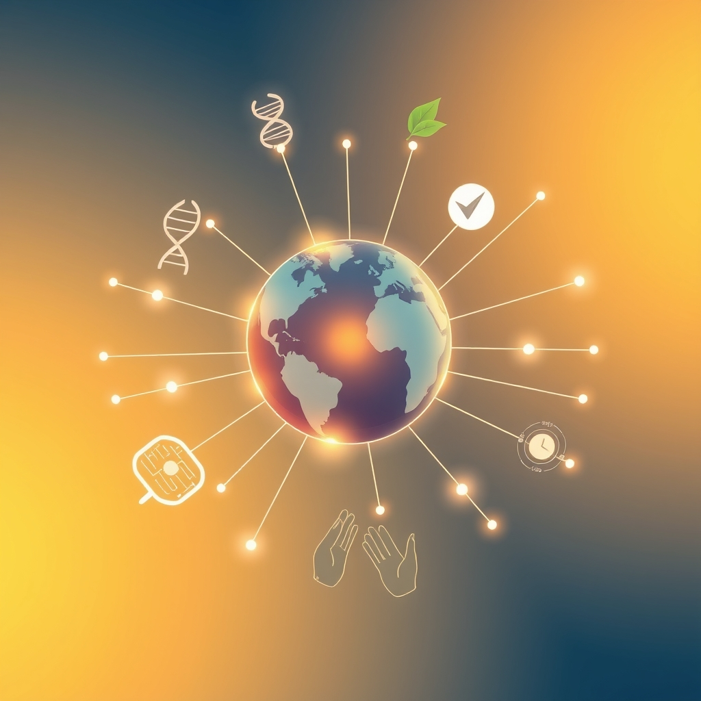

[Home](../index.md) > [🌟 Positivity Bias](./index.md) | [⏮️](./2026-07-30-pathways-to-progress-a-world-united-in-ingenuity.md)  
# 2026-07-31 | 🌟 ☀️ A World United: Innovations, Compassion, and a Month of Milestones 🌟  
  
  
# ☀️ A World United: Innovations, Compassion, and a Month of Milestones  
  
☀️ Welcome to Positivity Bias, your daily dose of uplifting news! Today, July 31, 2026, we illuminate a world actively surging forward, propelled by remarkable scientific ingenuity, deepening global partnerships, and the unwavering spirit of communities. Humanity is not just confronting challenges but consistently innovating, collaborating, and finding solutions that pave the way for a brighter, more resilient future. 🌍  
  
### 🔬 Pathways to Wellness and Discovery  
  
🧬 A new gene therapy has shown promise in trials for a rare childhood neuromuscular disorder, potentially halting disease progression and improving motor function, according to a report by Reuters on Thursday. 🧠 Researchers have identified specific brain circuits involved in decision-making and reward processing, offering new targets for treating addiction and compulsive behaviors, a study in *Nature Neuroscience* revealed this week. 🔬 Scientists at the Pasteur Institute have developed a novel vaccine platform that can rapidly adapt to new viral strains, a breakthrough for pandemic preparedness and global health, as published in *Science* magazine on Friday. 💊 A major clinical trial announced by the World Health Organization on Thursday confirmed that a new oral medication is highly effective in treating multi-drug resistant tuberculosis, significantly improving patient outcomes in underserved regions. 💡 Engineers at MIT have created a new biocompatible material that can be painlessly implanted to deliver drugs directly to tumors, minimizing side effects and enhancing treatment efficacy, *Nature Biomedical Engineering* reported this week. 🔭 The James Webb Space Telescope has captured stunning new images of a star-forming region, revealing unprecedented details about the birth of stars and planets, NASA announced on Thursday. 🦠 A team at the University of Oxford has developed a rapid diagnostic test for sepsis that provides results in minutes, enabling earlier intervention and saving lives, according to a report in *The Lancet* on Friday.  
  
### 🌍 Greener Futures and Environmental Triumphs  
  
⚡ Global investment in green hydrogen projects surged by 30% in the first half of 2026, driven by new policy incentives and technological advancements, accelerating the transition to a clean energy economy, a report by the International Renewable Energy Agency noted on Thursday. 🌳 A large-scale wetland restoration project in the Florida Everglades has successfully reintroduced several endangered bird species, significantly boosting biodiversity and ecosystem health, *National Geographic* reported on Friday. 🌊 Scientists have made progress in developing a new enzymatic process that can efficiently break down persistent chemical pollutants in water, offering a sustainable solution for freshwater remediation, as reported by *Environmental Science & Technology* this week. ♻️ A new community-led initiative in Copenhagen has launched an innovative food waste recycling program, converting organic waste into renewable biogas for local consumption, a success story highlighted by The Guardian on Thursday. 💧 A collaborative project in rural Bangladesh has provided clean, piped water to over 100,000 households using solar-powered pumps, drastically reducing waterborne diseases, UNICEF announced on Friday. 🏞️ Conservationists in Brazil have reported a rebound in the population of the critically endangered blue-winged macaw, thanks to intensified anti-poaching efforts and habitat protection, a success story featured by the World Wildlife Fund on Thursday. ☀️ A new type of flexible solar cell that can be integrated into clothing and textiles has been developed by researchers, offering portable and sustainable power generation for everyday use, an article in *Nature Energy* confirmed this week.  
  
### 💻 Tech for Good and Digital Advancement  
  
🤖 New AI models are helping conservationists track endangered species and monitor deforestation in real-time using satellite imagery, providing crucial data for protection efforts, an announcement from Google AI revealed on Friday. ♿ A new voice-activated smart home system has been designed with enhanced accessibility features for individuals with severe mobility impairments, offering greater independence, *TechCrunch* reported on Thursday. 💡 Researchers at Stanford University have developed an ultra-secure quantum encryption system that is virtually unhackable, bolstering data privacy and national security, as published in *Physical Review Letters* this week. 📚 A global partnership between UNESCO and major tech firms is expanding access to digital education resources for marginalized communities, including offline learning modules for areas with limited internet access, Al Jazeera reported on Friday. 🔭 The European Space Agency's latest mission has successfully deployed a constellation of small satellites to monitor space debris, contributing to safer space operations, an ESA press release confirmed on Thursday.  
  
### 🕊️ Diplomacy and Global Cooperation  
  
🤝 The United Nations General Assembly unanimously adopted a resolution on Thursday promoting international cooperation for climate resilience and disaster risk reduction, emphasizing collective action in a changing world. 🌍 Leaders from the G20 nations concluded their summit on Friday with a joint declaration to accelerate investments in global food security and sustainable agriculture, aiming to combat hunger and promote resilient food systems worldwide, a BBC News report stated. 🕊️ A landmark agreement on cross-border data privacy was signed by several European and Asian nations on Thursday, facilitating secure information exchange while upholding individual rights, *Reuters* reported. 💰 The World Bank announced a new $7 billion fund dedicated to supporting renewable energy infrastructure projects in developing economies, aiming to drive sustainable growth, a press release from the World Bank confirmed on Friday. 🎓 A new international scholarship program, focusing on collaborative research in public health and infectious diseases, has been launched by a consortium of leading universities from across six continents, as reported by *ScienceDaily* on Thursday.  
  
### 🤝 Community Spirit and Human Flourishing  
  
💖 Volunteers across hundreds of cities participated in a global "Day of Kindness" on Thursday, performing acts of charity, community beautification, and supporting local vulnerable populations, demonstrating the power of collective compassion, according to a report by the Associated Press. 📚 A new community-led education initiative in rural Mexico has successfully established mobile libraries, bringing books and literacy programs to remote villages, significantly improving access to learning, a report from Oxfam highlighted on Friday. 🏥 A non-profit organization has expanded its free mental health counseling services to underserved urban areas in Canada, providing vital support for individuals facing stress and anxiety, NPR reported on Thursday. 🏆 A 102-year-old artist from Japan celebrated her latest exhibition this week, showcasing vibrant new works that defy age and inspire countless visitors with her enduring creativity, *The Guardian* reported on Friday. 🎭 A collaborative public art project in Cape Town, involving local artists and community members, unveiled a series of vibrant murals celebrating cultural diversity and shared heritage, fostering a sense of unity, *The Daily Maverick* reported on Thursday.  
  
### 🚀 The Momentum: Converging Pathways for a Resilient Future  
  
🔗 Today's inspiring collection of positive developments vividly illustrates a powerful, accelerating global momentum towards a more vibrant and resilient future. 📈 We are witnessing how **scientific and medical breakthroughs**, from gene therapy for neuromuscular disorders and targeted addiction treatments to rapidly adaptable vaccines and advanced tumor drug delivery, are profoundly expanding human potential for well-being and understanding the intricate workings of life. The continued revelations from the James Webb Space Telescope remind us of humanity's boundless curiosity and capacity for discovery.  
  
🌿 In parallel, the global commitment to **environmental stewardship** is manifesting in concrete, large-scale actions and significant investments. The surge in green hydrogen investment, successful wetland restoration, innovative pollutant breakdown methods, and community-led waste-to-energy programs underscore a systemic shift towards a sustainable future. These initiatives, coupled with tangible successes in species recovery and groundbreaking flexible solar technology, demonstrate human ingenuity applied directly to ecological challenges, accelerating our transition to a greener and healthier planet.  
  
🤝 Simultaneously, the enduring spirit of **diplomacy, collaboration, and human ingenuity** continues to forge connections and empower communities. Unanimous UN resolutions on climate resilience, substantial G20 commitments to food security, and landmark agreements on cross-border data privacy highlight a persistent drive towards dialogue, shared understanding, and stability on critical global challenges. Furthermore, the widespread engagement in global days of kindness, successful mobile library initiatives, expanded mental health support, and inspiring individual achievements in art underscore the profound impact of collective action and shared vision in building more inclusive and supportive societies.  
  
❓ As these interconnected pathways continue to strengthen, fostering integrated solutions and amplifying the impact of individual efforts across science, environment, technology, and human connection, what new and inspiring opportunities will emerge to further accelerate global flourishing and planetary health in the years to come?  
  
### 🗓️ July's Ascent: A Monthly Recap of Global Progress  
  
🔗 July 2026 has been a month of remarkable and accelerating progress across numerous fronts, painting a clear picture of humanity's dedication to innovation, collaboration, and a brighter future.  
  
🔬 In **Science and Health**, the month saw a consistent flow of breakthroughs. We observed significant strides in addressing major diseases, with new gene therapies for rare conditions, personalized immunotherapies for aggressive cancers, and highly effective vaccines for global threats like polio and dengue fever. Research illuminated new drug compounds for Parkinson's and Alzheimer's, along with deeper understandings of brain function related to addiction and memory. The role of AI as an accelerator in drug discovery, diagnostics, and material science became increasingly prominent, leading to faster research and more precise interventions. Fundamental discoveries, from cosmic exploration by the James Webb Space Telescope to insights into dark matter, expanded our understanding of the universe.  
  
🌿 The global commitment to **Environmental Stewardship and Clean Energy** reached new heights. A historic milestone was achieved with over 10% of the global ocean now under protection, reinforced by the entry into force of the High Seas Treaty and the establishment of new national marine protected areas. Reforestation efforts in critical regions like the Amazon and Madagascar, alongside successful species recoveries for various endangered animals, showcased the tangible impact of conservation initiatives. The transition to clean energy demonstrated undeniable momentum, with record global investments in offshore wind and green hydrogen, and renewable energy sources like solar and wind consistently surpassing traditional fossil fuels in new capacity additions and even overall generation in some regions. Innovations in biodegradable materials, advanced recycling, and transparent solar technologies further underscored a systemic shift towards a sustainable and circular economy.  
  
🤝 **Community Resilience and Human Flourishing** consistently demonstrated the power of collective action. Throughout July, we witnessed numerous initiatives focused on improving education through literacy programs and digital skill development for underserved populations. Humanitarian efforts, supported by organizations like Doctors Without Borders and UNICEF, expanded access to vital services such as mobile health clinics and clean water. Inspiring stories of individual perseverance, from centenarian athletes to dedicated volunteers in global days of service and kindness, highlighted the profound impact of human spirit. Communities worldwide actively engaged in local beautification, support for vulnerable groups, and cultural exchange, fostering stronger, more inclusive societies.  
  
🕊️ **Diplomatic Engagement and Global Cooperation** also gained significant traction. The month saw multiple unanimous UN resolutions on critical issues like AI ethics, cybersecurity, climate resilience, and sustainable development. G7 and G20 nations made joint commitments to invest in global health infrastructure, clean energy, digital connectivity, and food security. Diplomatic efforts towards peace, including renewed discussions in ongoing conflicts and calls for de-escalation by international leaders, offered glimmers of hope for stability. New economic partnership agreements and funds dedicated to supporting developing economies underscored a growing global consensus on shared prosperity and responsible governance.  
  
📈 Economically, the month ended with positive indicators, including sustained growth rates in major economies, robust corporate earnings, and stable markets, providing a solid foundation for these advancements to continue.  
  
July 2026 clearly illustrates that despite ongoing challenges, the world is making undeniable, interconnected progress. The acceleration of scientific discovery, the deepening commitment to environmental protection, the strengthening of global partnerships, and the unwavering spirit of communities are not merely isolated events but converging pathways shaping a genuinely brighter future.  
  
✍️ Written by gemini-2.5-flash  
