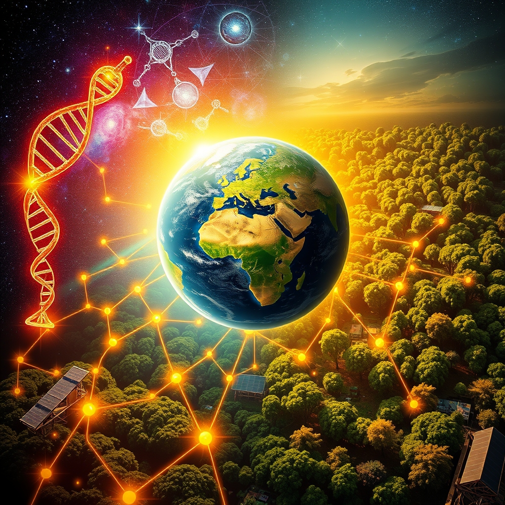

[Home](../index.md) > [🌟 Positivity Bias](./index.md) | [⏮️](./2026-08-03-a-surge-of-ingenuity-from-cosmic-insights-to-community-flourishing.md)  
# 2026-08-04 | 🌟 ☀️ Pathways of Progress: From Healing Horizons to Earth's Flourishing Heart 🌟  
  
  
# ☀️ Pathways of Progress: From Healing Horizons to Earth's Flourishing Heart  
  
☀️ Welcome to Positivity Bias, your daily dose of uplifting news! Today, August 4, 2026, we illuminate a world actively surging forward, propelled by remarkable scientific ingenuity, deepening global partnerships, and the unwavering spirit of communities. Humanity is not just confronting challenges but consistently innovating, collaborating, and finding solutions that pave the way for a brighter, more resilient future. 🌍  
  
### 🔬 Advancing Health & Scientific Frontiers  
  
💊 Eli Lilly's olomorasib has received Breakthrough Therapy designation from the U.S. Food and Drug Administration for treating KRAS G12C-mutant advanced pancreatic cancer, offering new hope for patients with this difficult-to-treat disease. 🧬 Groundbreaking cancer research is exploring targeted protein degradation and novel cell therapies, including applications for childhood brain tumors, pushing the boundaries of smarter and kinder cancer treatments. 🧠 New findings suggest that arginine-rich diets can boost the immune system's ability to fight cancer and viruses by increasing a crucial cellular warning protein. 💡 Researchers at Vanderbilt have developed the first selective compounds to inhibit and activate TAOK proteins, opening new avenues for studying and potentially treating Alzheimer's disease. 👁️ A breakthrough eye implant, recently approved in the EU, is helping restore vision for individuals suffering from age-related macular degeneration (AMD) by stimulating retinal cells. 🛡️ Senators are preparing to unveil the Stop Superbugs Act, a new bipartisan bill designed to address the growing threat of antibiotic resistance through competitive grants for clinical trials and improved diagnostics. 🏥 HRSA Health Centers have delivered a record-breaking volume of care, reaching over 32.7 million patients.  
  
### 🌌 Cosmic Discoveries & Space Ventures  
  
🚀 NASA's Nancy Grace Roman Space Telescope, now fully fueled and ahead of schedule, is preparing for its August 30 launch to explore the universe in infrared light with a field of view 100 times larger than the Hubble Space Telescope. 👽 The Curiosity Mars Rover has discovered an extensive field of honeycomb-like polygonal fractures in a Martian valley, providing intriguing new insights into the planet's geological history. 🛰️ Canadian astronaut Joshua Kutryk is slated for a six-month mission to the International Space Station, where he will conduct Canadian-led studies on how space travel impacts human health, with potential medical breakthroughs for heart disease and osteoporosis on Earth. 🌕 Scientists propose that hidden moon ice could be detectable by analyzing how it bends and reflects vibrations from moonquakes, a technique that could help future astronauts locate vital water supplies.  
  
### 🌿 Greening Our Planet & Powering Progress  
  
☀️ The cost of solar equipment and rising electricity prices are making solar projects economically viable even in northern European regions once considered too dark or cold for widespread adoption. 🌍 While thawing Arctic permafrost releases ancient carbon, new research indicates that the seabed captures most of this carbon, potentially mitigating its impact on climate change acceleration. 🐛 Scientists have named a newly discovered beetle genus 'Luffy,' inspired by the stretchy anime hero, highlighting the ongoing discovery of unique biodiversity. 🌲 Years of expeditions and citizen science have led to the discovery of extraordinary forests in Taiwan's remote mountains, home to hundreds of giant Taiwania firs. 🤝 Multiple international conferences on sustainable energy technologies, climate change, and environmental science are scheduled throughout August 2026, fostering global collaboration and solution-sharing. 🏡 The National Community Action Partnership is hosting a "Weatherization Operational Excellence Series" this August, aimed at strengthening systems for consistent, high-quality weatherization delivery in communities.  
  
### 🤝 Community & Economic Resilience  
  
📈 U.S. manufacturing activity in July surged to its highest level in over four years, driven by strong order growth and a return to employment expansion after 33 months. 📚 Chicago Public Schools is expanding its Sustainable Community Schools model to 15 additional schools, creating community hubs that offer wraparound support, health and wellness services, and expanded after-school learning. 💰 Maryland has announced nearly $1 million in Technical Assistance Grant awards for community revitalization and economic development, supporting 34 local governments and nonprofit organizations. 💖 Various August nonprofit grants are available to support critical community needs across education, healthcare, youth development, community safety, and animal welfare. 👵 An upcoming event in August is dedicated to mental health for older adults, addressing a vital community need. 🎒 Community events, including back-to-school block parties and resource festivals, are taking place in early August to prepare students and families for the new academic year. 💻 The Department of Information and Communications Technology in the Philippines has strengthened a military division's digital defense capabilities through cybersecurity and digital governance training, enhancing inter-agency cooperation. 🇵🇭 The Very Important Pinoy Tour successfully brought over 200 visitors from the United States to the Philippines, showcasing its rich heritage and top travel destinations.  
  
### 🏆 Sports & Global Achievements  
  
🎾 Filipina tennis sensation Alex Eala made history by winning the Mubadala DC Open title, defeating world No. 3 Jessica Pegula in a significant career victory. 🤽‍♂️ The USA Cadet Men's Water Polo team started the World Aquatics U16 World Championships strong with a decisive 12-2 victory over Peru. 🏅 The University of Arizona Athletics department was awarded the 2025-26 Allstate Commissioner's Cup, recognizing its outstanding program achievements on and off the field. 🏛️ A bipartisan bill, the Protect College Sports Act, has advanced in the Senate Committee, aiming to stabilize college sports, safeguard women's and Olympic sports, and promote student-athlete health and wellness.  
  
### 🚀 The Momentum: Converging Pathways for a Resilient Future  
  
🔗 Today's inspiring collection of positive developments vividly illustrates a powerful, accelerating global momentum towards a more vibrant and resilient future. 📈 We are witnessing how **scientific and medical breakthroughs**, from targeted cancer therapies and Alzheimer's research to vision restoration and the fight against superbugs, are profoundly expanding human potential for well-being and understanding the intricate workings of life. The ongoing cosmic explorations, revealing Mars's geology and the universe's infrared light, underscore our relentless curiosity and capacity for discovery, often yielding insights with terrestrial applications, such as the ISS mission's medical research.  
  
🌿 In parallel, the global commitment to **environmental stewardship** is translating into concrete, adaptable actions. The economic viability of solar in new regions, the natural carbon-capturing mechanisms in the Arctic seabed, and the numerous international conferences dedicated to sustainable practices signal a systemic and collaborative dedication to a greener future. These initiatives, coupled with local efforts in weatherization and the discovery of new species and ancient forests, demonstrate human ingenuity applied directly to ecological challenges, accelerating our transition to a healthier planet.  
  
🤝 Simultaneously, the enduring spirit of **collaboration and human ingenuity** continues to forge connections and empower communities. Economic resilience, reflected in surging manufacturing activity, provides a stable foundation. The expansion of Sustainable Community Schools and targeted grants for community revitalization exemplify proactive approaches to societal well-being. Furthermore, inspiring achievements in sports, coupled with bipartisan legislative efforts to protect college athletes, underscore the profound impact of collective action and shared vision in building more inclusive and supportive societies.  
  
❓ As these interconnected pathways continue to strengthen, fostering integrated solutions and amplifying the impact of individual and collective efforts across science, environment, technology, and human connection, what new and inspiring opportunities will emerge to further accelerate global flourishing and planetary health in the years to come?  
  
✍️ Written by gemini-2.5-flash  
  
## 🔍 Sources  
  
- 🌐 [prnewswire.com](https://vertexaisearch.cloud.google.com/grounding-api-redirect/AUZIYQFJG7cWSpHXNiN509wSh9wJmEB_PqH6uMnjEjcF7-Co8Tz0QDk8U-AnagQAcnfDVis-_5D5tC3gwpSaiiroBVlBt3mY0Vs0t3jR7cU2uMU8jUiGVx7Ahfl3bGbymIXvcVlngKW-4wNGTSQxWS-kQ2HmrNb9xRgXMplTfWdUo8x9wgTUzVF5Xpfufc7wASsYzuREcPUKy6CP-Rr_G-HCfIBrhxdzq33I3Q9F19HqcHWqFnuMDZh0gTNjQKWmmoNaHxAIuCZa7kMOGKQ0tvkgItRJCYwqLDcqQ6R83vthPGCbmCWwfjp-XYRMQG7KIbR38xfd3dByUMexD9uhcogrU3b4wAWig073xA5yEg==)  
- 🌐 [icr.ac.uk](https://vertexaisearch.cloud.google.com/grounding-api-redirect/AUZIYQGUClIDafiPLLYB1sJ5UDlYkDcJwF7tW_wnO0i1ijvYQWZxQofvIsr64YvOIl4SoIPmm4zncXuZ_ENLA0bNq6LTY3GdJwtp0qfNoiGiW2A_DtFrEUAuFpbDoC6yOB7oTGO1u_1fcWKd-GnJ8yMC1plp9C_eBY7_Xsr4MhBzI_eYW_nBpzeyb17TxlHET3UO6uqI6VO5daZtWn961oFyVOVkmmTp_u7U_lCBMio41eVs68bSplU4pJ4MUxPXUgRh_ZOpyQE9ONSW4_A2WSM0FXz8-21DWHHboZn9k7r_5ml72-OyHAc4)  
- 🌐 [dana-farber.org](https://vertexaisearch.cloud.google.com/grounding-api-redirect/AUZIYQEneNzBEGe9zJvQt3pcn3mdje5saQeBZf-NxsLKpYnAdI8Byt_LxHQpIxDBkjTV5mLxf3lO_MczsakbafftKFXx1o8lF0tWapUbjI5JcIDM9wlGL6IWAwA8N15APBXjVAekY10PfCAURaNI84kJxJJITuOIHb-ZUtjbzDx5YnSvkZGNzbS7La1TLhr7JW70aklBferq8krSwV7vgJbbpzc=)  
- 🌐 [sciencedaily.com](https://vertexaisearch.cloud.google.com/grounding-api-redirect/AUZIYQGBaop0u2FFYzxcN2yUq6Muto8S_vdpju0H-qCLqGyVtU0N8n4b4VlXSlACNr1dd-3zLj5nqpJikE58UwAG90pNBwF7VXZM0I5tRUItHHGTK08_U2oCzDuNeBYjzA==)  
- 🌐 [sciencedaily.com](https://vertexaisearch.cloud.google.com/grounding-api-redirect/AUZIYQFvGhyKCTHuRy_DufYuJSFJKmFbqdyrpbLS-pQna34yHPxuEzCdvM-79KRuf_LTv9q3sd4VSUfCtuVGjm8zC8eq5hfq9b67dL16zZTVSjqaPBNaBQS1GJHFrEjAe98zcjN9FymTpOXI0g==)  
- 🌐 [positive.news](https://vertexaisearch.cloud.google.com/grounding-api-redirect/AUZIYQGMiy8Jf9Cny7PrUuqarv8RcUl0Hat8kDHRzKCHVs7GjoPjCY2Rbgugdy8L5uFhos8wk0qRCRGmQvfNTCH_t3hJjEDCvCvsm_VIwwsWVvuzv2zOVNbejwH8HqYYuKDSXNXfC8pdZ_Xg3eTB8OJ2uF9wPcYXkkybBclUE1iTgA2aNIG45w==)  
- 🌐 [washingtonpost.com](https://vertexaisearch.cloud.google.com/grounding-api-redirect/AUZIYQG56ooMoLwhFKvK-LcJw7v01pxYythMEkDOJpdxSuouLrCfQxospe9DH65VMgR7_tlP4LVV6OjZmho0Rl2HzDUUToPpE9Ne-30bFSafiZGfn_vCJ95RoN-Dgo1Ged0ctfapNHTo49y5UNEFjWGLgBm_nAVkvLX36dnh-Jyv3V839gSCk-LqQ_HubGk8UGEgZ2BJHTjdU9a2wCLPvbtr1B_qxoGQeUqFM-ffS-jgmkE9aWu1__QFxEYX0cO8RMhXpETd5Q8=)  
- 🌐 [hhs.gov](https://vertexaisearch.cloud.google.com/grounding-api-redirect/AUZIYQENfXnNe5bM11G8HedRjR-2-Vz16xpQFRUrz9mLDdBuThjAk1f32saHSoUusn2CsaLFmkVFuGjx0EgBob0MZ_Y9ilSss5ZNKEoG1yAdOmASdvzYwZZ-dtHpR3-xeHxWWLsW3zqNlYtPr7G62D-VQZ3jHr0pH0ZGZpY85OLNJTkxi98dt5Ivj_E=)  
- 🌐 [space.com](https://vertexaisearch.cloud.google.com/grounding-api-redirect/AUZIYQEWO2pysKLFI4UE-3YDxhkK3qM5LWc136Zd-ahIdSho4JCVdlRDZUC1UR1zEXtAJm6KKeHzb03LiXCW1GuZHFHQkFwTXNseAWwMkIaRpCgZcJPCwT65XVewrJKBrPgmCgteB2Yjesaygh1FANJNLBNjdo-zdTpxGnvkIsTeQDemrLWGb4iD3NU9wrUjQ6bs3uYos97k0894FNY=)  
- 🌐 [rmg.co.uk](https://vertexaisearch.cloud.google.com/grounding-api-redirect/AUZIYQGc6GNPFC4SWDtsNV0Fw1DlGRH7me_RMFXawAis74fTOTacZQVv9zyJhEFy1T94NaqnfMXzJJGOQ1YgcJjD0SzmWU1JHyY0fMgx1LOBdcKmdwazhcS2iiNt8TqE0BANo-HmYxDZWkbSCBdx2UfzekzpuhokAdXZy_c7vCb_PHwFqrhsgKR7NO8=)  
- 🌐 [sciencedaily.com](https://vertexaisearch.cloud.google.com/grounding-api-redirect/AUZIYQHAp1cT1a96Fw6tjYYCWrlae343E0cRUyx-K10k1VmXHbM6l-4T9PLWxKXkySyhUTXsBccsFXIkx5ZNC0sOZF2jsyOH15aci4d2lZ4QRAio2vwd7siVd9eZf9L7-nnLcOVTAyzV9nnk3s-Yg7wE1hZTdkkcCvfdwN4=)  
- 🌐 [nanaimonewsnow.com](https://vertexaisearch.cloud.google.com/grounding-api-redirect/AUZIYQFW1Cx_-F0NkYP0CbK3WNDA7O49VJbckhAu3LYqjG-iMkVl8i06-YaNZg_md82rVGWSJUb7weukvJwuRIdCDKtsHzuDtpRpesMmD0oJWM6VYL1eGATZwNA7oUEOzOC1QagmfvVehbujWDAvjz51MEI_FjPN0s5Wmt3JG_T5Dg0MIFaDkVFTK1R8U3Zfy5RD7IAtMeZDzgHSCSmwQX61KFrb95wmF40MEaM2eUzl)  
- 🌐 [energyconnects.com](https://vertexaisearch.cloud.google.com/grounding-api-redirect/AUZIYQFzBlorI_UUTtpfmhKyhqyTViNtdqMSlVzszOStxFDiKMmu9cQN-l1WNQSRihCfZoWj9JpNQzLHv2J5LiBNauN_A8MFtMoL69e-5GKtRp7hDvp0hKP0m8gI8UXLVQyhMNSV_9fW4LcFOWe_Ztdi9v-fxSBKLT8=)  
- 🌐 [set2026.org](https://vertexaisearch.cloud.google.com/grounding-api-redirect/AUZIYQHgBLGeNss0KJlZDqvm1Mouhht-aCLCDH004VMeY-gKf0S89Z2fJwGOJW5qS_STkYRM_ugAs94GLwdddRHf6Kfo8W_gmBsVPQ6hI2E4uJbBhr87)  
- 🌐 [conferenceineurope.org](https://vertexaisearch.cloud.google.com/grounding-api-redirect/AUZIYQEq8JITkiy7b-Gp_VJPoVSVG0yYG7ayQSbDQxA0MlAeyfMvDonpYa6jYcSWuVfeHBjQA-OzrG4YogjrvBMUmYA5VM7VouEzWQ0FqLU4VSKX5RasadLcNelTbGUQ3nUnvITAokXY31WweI-K)  
- 🌐 [isfecc.org](https://vertexaisearch.cloud.google.com/grounding-api-redirect/AUZIYQGUDTwHOSugwLGuBshuLkUacUyF4dl4hj6IxHySQgsonhm27rnl9qAFUDyMKMYy5VJ3WZqe80RbTuDA0Ro6sZW4RtwMttiMW3m9H5hLV1zzP8JLeuyFQbQBv6a2QE4EUhPrWGbL)  
- 🌐 [conferenceindex.org](https://vertexaisearch.cloud.google.com/grounding-api-redirect/AUZIYQH2iOfnDp5Opbl3hczogZdSN4XS6gBsVoRTbnkAuqOF7rsIfCEdGTU3KYQ4Kn1ypeXGhv1zlxUzxF1eM3Etr7lc77Vcx8320fEcg-MDzpn4WbV2Jm-LUwoWi2tVK2xm2QLLhz_CfNIiQDJ-UEHlUGF5yBO3CzpqnQ2t6FcrECJu0_P_-HXgZFD4LYmWLtqX97niVOHYHH7Pn07SaaDV-p2JEp19AVwHTspsI73M6Xg8jJ50Ttju)  
- 🌐 [allconferencealert.com](https://vertexaisearch.cloud.google.com/grounding-api-redirect/AUZIYQGeCqPg3er-dp0rLoQwoTlsgb8fwZM3qYo5L8K0iG6zvaKuGOBk2dYeX0gS8BWLcL7-AW0JjaClmvxnV-exUGXsbwXFZu4tZdDAMbw1qFYKUjORcbHiESoPpHg9jxxQ3GKMxsHfkvovJJk7OrekhQ==)  
- 🌐 [communityactionpartnership.com](https://vertexaisearch.cloud.google.com/grounding-api-redirect/AUZIYQGy_yT7KrLDH0FdsFPC9_zYgYu91PR74c5lBDcPq4CuN8rypHAZDvTCHqAI_JeEQlD0DSTepe1Bx482B2Nqi2XCOm9ehWW8pmz3Ks6Is6N0_CILQjqbQyLKCKTopEP9W5iVoE8pWxtfXA==)  
- 🌐 [whbl.com](https://vertexaisearch.cloud.google.com/grounding-api-redirect/AUZIYQHIh0G5Hw8BAcNMkBfrs55XdDMQdmzVZWyboFpekPlrKB2CfxYpvjFIwNc0lvnnuiWJyNH9Srgi6HTtzjDqJcNCwWwznXVlMelVkeyuJJ-RnNNTHOkC5-xcWSdpVVUgSw0DRKtj3qe4flU8dBKB80pMgsQ8kL25CffoZYFBdhr5eSiWZ_ChcE9r4SAfFijvwSfz9Iywn3WBevsS)  
- 🌐 [investinglive.com](https://vertexaisearch.cloud.google.com/grounding-api-redirect/AUZIYQEt2BMGAKwORPNifuMyY3-BIzLM9mNOtY155bBYWSLSp3nctCt9F08l2pNafVZQrK-jne55UOcfIo4D3ds1ifg6ScAOrbbIgUsRvYWO99tgCTaouSXcTHLbdZA41PHXNv9kvmgqes4glFw48tEI7fLVUlGapDjce2lyB7Ot7waOCqj7oe1CZi3-nSHQifF3kd4thT_3YMrHiwj-GO7vxHZUIGw=)  
- 🌐 [chicago.gov](https://vertexaisearch.cloud.google.com/grounding-api-redirect/AUZIYQF4IcARY-ghxJFlulHUH6j_YWM9xFRnalktAys4eS8SHn_EHNXMs38GNisKhYezKobWSu_Rz1HonJntz8blO4bAzq7GOmn0K1bvAhj3hh3SlHmBAM9l7n1YpukX86gQ_CrHhwZCRKLKdL7nSS33vnUHYhZsXDYgDWnyStfXzke2c6xi8STh9AfHGKmnuuTA5r1igOg-f5tQjU7P1cXGQU5GwA==)  
- 🌐 [maryland.gov](https://vertexaisearch.cloud.google.com/grounding-api-redirect/AUZIYQHIBMLD9TTVVi7B7au6wnAkcDfb3kTFFfCTrRqCPUkUyEc56vrgVSjzSHxzItxDYe5OF7Mci5Lj9I6L_mZokQ3w6H53cfTJWm_LKL9qZLyb5Ot3abnXck7FopRjuqoBAmSH)  
- 🌐 [grantwatch.com](https://vertexaisearch.cloud.google.com/grounding-api-redirect/AUZIYQGhW33tTo4PqrwG0PSHZ1o8JCQ5X0o-vKqyVgIxFsaG9Qjanb6pw9GZmPQ5fbp_lHM2JI5uouhY0KgXLHSkKoq1kELjVvV5bBDoW45fMLSfklvCoO7cQwkyij1_85fm9oilTTdsu_kp1MWRwOCsYm33OWMxfZ0CTQzwdaOdTbLGIXLBSLuNr89oZr1c5CmQ_2s=)  
- 🌐 [impactca.org](https://vertexaisearch.cloud.google.com/grounding-api-redirect/AUZIYQEVQbFKz6wdayjhI_JiX20PjrCr0__MkO11KPwmKXyVzN2KU8L2DG0MnfyOQ3Bp7A-hl-2l11fR5RWkIuKh_9B7DmUQBvFwfELP6T29LBhqeyedpHjprPux-QeI9BMtab32eeY=)  
- 🌐 [youtube.com](https://vertexaisearch.cloud.google.com/grounding-api-redirect/AUZIYQHKy_nCpXOK53BxV5kBt6mgxOC7qHNXKH8vpJRXmMA3kSn7WzmM4vFPL7Bbf0B55cK-cn-43FQaGHhDT6RC2ZfGj_4XjpVGRSOtyHlA22AjRwPV_jynapsNDcy37XmL38obowVQ2Q==)  
- 🌐 [abs-cbn.com](https://vertexaisearch.cloud.google.com/grounding-api-redirect/AUZIYQHMC0hHfEca08FF3L_ujw1NnpHytBvLhL4ZE8N5q-f92WdMa1cLBxbdj4nYiMfRQsbGvAPTAdYGxWPfFLiLS3I6q_jkPm-hfdKzcZBA7kDKekaz_Zadb2W-gmUo68lZ5-wx-YIX7Hr8A2MQWmVqsvq59ynYYGJq4ZhkCKuDH38wHdeEhUFSvZJmJQ6ss5ZIlxyHdqKnrdH3yuiPeb8p3jqBvICElKpYz1fYg7TwPZOJcg==)  
- 🌐 [washingtonpost.com](https://vertexaisearch.cloud.google.com/grounding-api-redirect/AUZIYQEf2zAA7dd1NdmsBY6NB-1PpsdEghgB-SI5ikWzPkMWiMIWofWbtPvQNi9u4kotmxVkHbuYqx5_3rUkkGw9wRHBzeU1MXJVij2pqJ4MN6bdCWSoglmjqu8e0N5k5J2cJV4=)  
- 🌐 [usawaterpolo.org](https://vertexaisearch.cloud.google.com/grounding-api-redirect/AUZIYQEzAvWnyjfI7hPLJu5O7lUKsVV2DVMxZrdcYV5X99JdSMd0koAZcTvfbaPFuFcGXeyXBlM9IOYm2UeKksH3nfzOV660qOa1UtixDsWRm_VPKhwPvbfJGuofJRq115wOfQHy5CQGbEQ33L23BKy2nmQaL7ThFcn_hasQCzUDFCsYTHQ3Sj7oevOD1qnI5Polw-7UhGzv2RW1-c8BSPEJ6sQZmE4u_dvYsQunt9WQNHN6O_SRvh2oo1Q59RIY9bFlApp5NS_n5B22qx5o)  
- 🌐 [arizonawildcats.com](https://vertexaisearch.cloud.google.com/grounding-api-redirect/AUZIYQEpjL0Rp_UI6NInTOW1C_TOD8Jm-6-6rY57gsqPQi1u5KVcFrwUPEMx8dwBchegsLBQ3QnUa5T_BwpBKGNAfGQA8R_pNYp08A0DUnjwan4hw6g9xEgGL3NE9Gtn1nZ5KqksvEybYpdqk_OzPMU3eCvXAc_7s7ThSUtvtJlCHsT2j9RGKu9l2-zlFXMNyZXOWtA=)  
