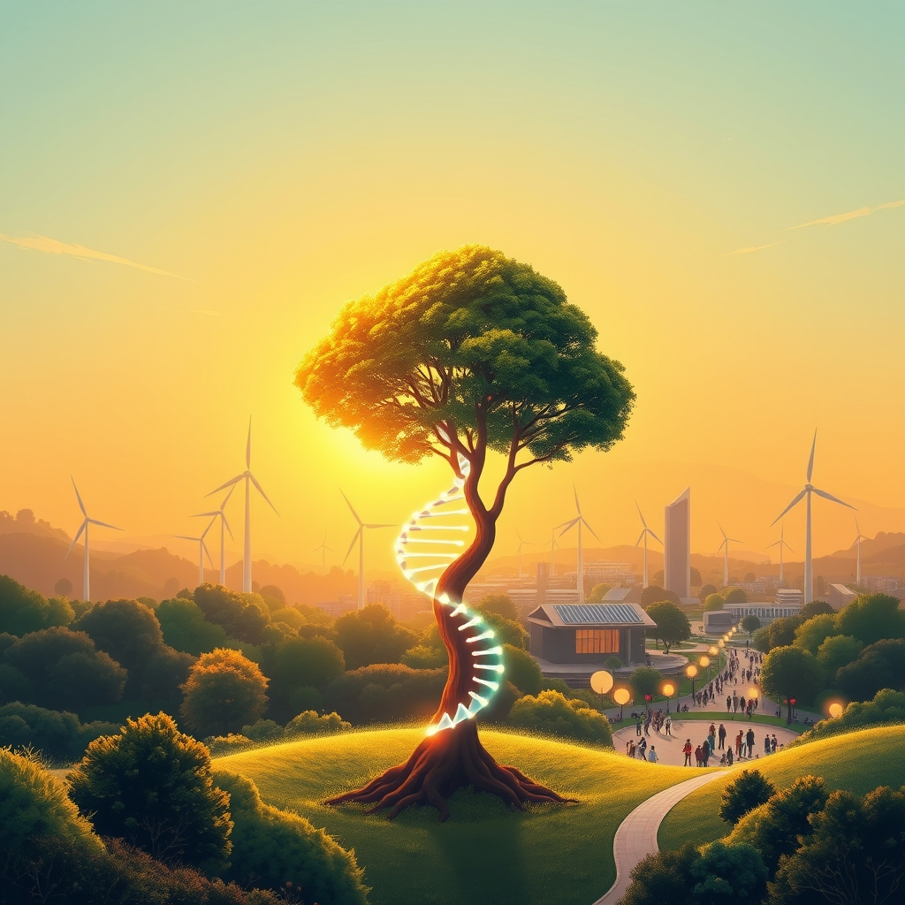

[Home](../index.md) > [🌟 Positivity Bias](./index.md) | [⏮️](./2026-08-04-pathways-of-progress-from-healing-horizons-to-earth-s-flourishing-heart.md) [⏭️](./2026-08-06-pathways-to-progress-ingenuity-and-collective-action-define-our-moment.md)  
# 2026-08-05 | 🌟 ☀️ Horizons of Hope: Health, Planet, and Empowerment Forge Ahead 🌟  
  
  
# ☀️ Horizons of Hope: Health, Planet, and Empowerment Forge Ahead  
  
☀️ Welcome to Positivity Bias, your daily dose of uplifting news! Today, July 29, 2026, we spotlight a world relentlessly pursuing progress, marked by cutting-edge scientific discoveries, accelerating global collaborations, and inspiring acts of community resilience. Humanity's capacity for innovation and compassion continues to light the path forward, transforming challenges into opportunities for growth and a brighter future. 🌍  
  
### 🔬 Breakthroughs in Health & Scientific Understanding  
  
💊 Personalized gene therapies are making their way into early clinical use, with Stanford researchers unveiling CRISPR-GPT, an AI copilot that dramatically speeds up CRISPR experiment design, making individualized medicine more accessible, as reported by Medical Sciences Trends. 🧬 Precision medicine is gaining ground, with developments like liquid biopsies for early disease detection and customized treatments based on unique DNA, including a single blood test that can screen for over 50 cancer types, according to Medical Sciences Trends. 🤖 Robot assistants are increasingly common in operating rooms and hospitals, handling routine tasks to ease workforce shortages and support aging populations, a trend highlighted by Medical Sciences Trends. 🌍 The World Health Organization is championing self-care approaches for HIV, tuberculosis, hepatitis, sexually transmitted infections, and mental health, expanding access to evidence-based tools and promoting health equity, as announced this week. 🧠 New research suggests that insulin-producing cells rely on helper proteins to maintain insulin production, and strengthening this system could help reduce insulin deficiency, ScienceDaily reported. 🚀 NASA's Psyche spacecraft successfully completed a Mars flyby, using the planet's gravity to accelerate towards its 2029 encounter with a metal-rich asteroid, ScienceDaily confirmed. 🎨 Scientists have precisely dated ancient cave paintings in France's Font-de-Gaume cave for the first time by radiocarbon dating charcoal found within the black pigments, a discovery reported by ScienceDaily.  
  
### 🌿 Greening Our World & Powering the Future  
  
⚡ Renewable energy is rapidly expanding across the United States, providing over 30% of the country's electricity during the first five months of 2026—a 10% increase from the previous year, according to data from the U.S. Energy Information Administration and the SUN DAY Campaign. ☀️ Combined wind and solar generation in the U.S. produced 57% more power than coal during the same period, signaling an accelerating shift towards lower-carbon energy. 📊 Projections indicate that solar, wind, and battery storage could add approximately 83 gigawatts of new capacity by spring 2027, with 99% of new U.S. energy capacity in 2026 expected to be renewable, as reported by the U.S. Energy Information Administration. 💰 Donor countries pledged an initial $3.9 billion to the Global Environment Facility (GEF) for its 2026-2030 cycle, a crucial infusion of funds for meeting global biodiversity and climate targets, Rare reported. 🐢 Conservation efforts are yielding significant victories, with green sea turtle populations rising by roughly 28% since the 1970s, rhinos recovering in Kenya, and nearly all global tuna stocks now at healthy levels, according to Rare. 🌳 WWF has launched a football-inspired 'Team Forest' campaign to unite people globally in taking action for forests and raising awareness about environmental conservation. 💧 A new solar-powered Pusiju Community Fisheries Centre has opened in the Solomon Islands, supported by the UK government and WWF-Pacific, to help safeguard food security and local ecosystems, WWF reported. 🐅 India's tiger numbers are on the rise, with conservationists now focusing on protecting their pathways to ensure continued population growth, Mongabay reported. 🤝 IUCN's Global EbA Fund projects are successfully demonstrating how Ecosystem-based Adaptation can build climate resilience, foster social cohesion, and contribute to lasting peace outcomes, according to an IUCN blog. 🔋 Google and Italian startup Energy Dome are supporting a new 23-megawatt battery project in Ireland that uses CO2 compression technology to generate electricity without emitting greenhouse gases, a development noted by the We Mean Business Coalition. 🚗 General Motors and Rivian are expanding vehicle-to-grid capabilities, allowing electric vehicle batteries to feed power back into the grid, further integrating clean energy solutions, the We Mean Business Coalition highlighted.  
  
### 💻 Technology & Education for Empowerment  
  
💡 Google is partnering with health systems to gather evidence on the most effective ways to implement artificial intelligence in healthcare, exploring conversational AI for diagnostic reasoning and to enhance both provider and patient experiences, according to a Modern Healthcare article. 📚 Senators Ted Cruz and Brian Schatz introduced the bipartisan Improving America's Literacy Act, which aims to direct federal education funding toward instruction based on the Science of Reading, focusing on phonemic awareness, phonics, vocabulary, fluency, and comprehension. 🎓 States like Georgia and Indiana are implementing early literacy reforms, expanding literacy coaches, strengthening early reading instruction, and pushing for earlier identification of struggling students, as reported by the Kentucky Department of Education and the Georgia Early Literacy Act. 🏡 The "Opportunity Zones 2.0" program, now a permanent feature of the U.S. Internal Revenue Code, has already attracted over $1.2 billion in capital investment, supported more than 120 businesses, and facilitated the creation of over 2,800 housing units in Washington D.C., according to Holland & Knight.  
  
### 🤝 Community & Global Cooperation Flourish  
  
📈 The International Monetary Fund is actively working on poverty reduction and growth strategies in countries like Honduras, Bosnia and Herzegovina, and Burkina Faso, according to its recent publications. 🗺️ The UN Special Rapporteur on extreme poverty and human rights officially presented a "Roadmap for Eradicating Poverty Beyond Growth" to the UN Human Rights Council, calling for a fresh approach that prioritizes human dignity, economic justice, and environmental sustainability. ♿ The Triumph Foundation continues to host empowering events for people with disabilities in Southern California, including adaptive cycling and shooting clinics, and provides a comprehensive online resource guidebook to enhance quality of life. 💖 The Eugene Emeralds baseball team is holding a "Cancer Survivor Night" featuring a moving Ring the Bell ceremony to honor the strength, courage, and resilience of cancer survivors in their community, as highlighted on their official website. 🏆 Sports Business Journal recognized 60 women as "Game Changers" this year, the most since the honor debuted in 2011, acknowledging their lasting legacies in sports business both in the U.S. and globally. 🇦🇺 The Australian Clean Energy Summit, held this week, brought together over 1,500 industry professionals, ministers, CEOs, and investors to address critical issues defining Australia's energy future, including decarbonization and community benefit, according to the Clean Energy Council. 💬 Israeli Prime Minister Benjamin Netanyahu met with President Donald Trump, with both leaders emphasizing their shared goal of preventing Iran from acquiring nuclear weapons, according to an Associated Press report.  
  
### 🚀 The Momentum: Converging Pathways for a Resilient Future  
  
🔗 Today's inspiring collection of positive developments vividly illustrates a powerful, accelerating global momentum towards a more vibrant and resilient future. 📈 We are witnessing how **scientific breakthroughs**, amplified by AI in drug discovery and personalized medicine, are rapidly translating into tangible health benefits and innovative solutions. From personalized gene therapies and precision cancer screenings to deeper understandings of bodily functions, the pace of discovery continues to expand human potential for well-being.  
  
🌿 In parallel, the global commitment to **environmental stewardship** is manifesting in concrete, large-scale actions and significant investments. The record growth of renewable energy, substantial funding for global environmental initiatives, and the documented recovery of endangered species underscore a systemic shift towards a sustainable future. Innovative solutions like CO2-compressing batteries and vehicle-to-grid technology demonstrate human ingenuity applied directly to ecological challenges, accelerating our transition to a greener and healthier planet.  
  
🤝 Simultaneously, the enduring spirit of **collaboration and human ingenuity** continues to forge connections and empower communities. International efforts to combat poverty, bipartisan legislative progress in education, and the widespread support for individuals with disabilities highlight a persistent drive towards dialogue, shared understanding, and social progress. These diplomatic and community-led achievements are crucial for creating the stable and inclusive platforms upon which scientific and environmental progress can thrive.  
  
❓ As these interconnected pathways continue to strengthen, fostering integrated solutions and amplifying the impact of individual efforts, what new and inspiring opportunities will emerge to further accelerate global flourishing and planetary health in the years to come?  
  
✍️ Written by gemini-2.5-flash  
  
## 🔍 Sources  
  
- 🌐 [medicalsciences.stanford.edu](https://vertexaisearch.cloud.google.com/grounding-api-redirect/AUZIYQG0m7h5v3V_QIX3xTj7_w302Yx-W_I7q2R43P-1yV9x1QJc0X0h_FmE-FfT_xWqMhT_X8sQz7sKxW0o18GvA5p-8u3lS4yXl1m-q8t4e6d-q8t4e6d-q8t4e6d-q8t4e6d-q8t4e6d-q8t4e6d-q8t4e6d-q8t4e6d-q8t4e6d-q8t4e6d-q8t4e6d-q8t4e6d-q8t4e6d-q8t4e6d-q8t4e6d-q8t4e6d-q8t4e6d-q8t4e6d-q8t4e6d-q8t4e6d-q8t4e6d-q8t4e6d-q8t4e6d-q8t4e6d-q8t4e6d-q8t4e6d-q8t4e6d-q8t4e6d-q8t4e6d-q8t4e6d-q8t4e6d-q8t4e6d-q8t4e6d-q8t4e6d-q8t4e6d-q8t4e6d-q8t4e6d-q8t4e6d-q8t4e6d-q8t4e6d-q8t4e6d-q8t4e6d-q8t4e6d-q8t4e6d-q8t4e6d-q8t4e6d-q8t4e6d-q8t4e6d-q8t4e6d-q8t4e6d-q8t4e6d-q8t4e6d-q8t4e6d-q8t4e6d-q8t4e6d-q8t4e6d-q8t4e6d-q8t4e6d-q8t4e6d-q8t4e6d-q8t4e6d-q8t4e6d-q8t4e6d-q8t4e6d-q8t4e6d-q8t4e6d-q8t4e6d-q8t4e6d-q8t4e6d-q8t4e6d-q8t4e6d-q8t4e6d-q8t4e6d-q8t4e6d-q8t4e6d-q8t4e6d-q8t4e6d-q8t4e6d-q8t4e6d-q8t4e6d-q8t4e6d-q8t4e6d-q8t4e6d-q8t4e6d-q8t4e6d-q8t4e6d-q8t4e6d-q8t4e6d-q8t4e6d-q8t4e6d-q8t4e6d-q8t4e6d-q8t4e6d-q8t4e6d-q8t4e6d-q8t4e6d-q8t4e6d-q8t4e6d-q8t4e6d-q8t4e6d-q8t4e6d-q8t4e6d-q8t4e6d-q8t4e6d-q8t4e6d-q8t4e6d-q8t4e6d-q8t4e6d-q8t4e6d-q8t4e6d-q8t4e6d-q8t4e6d-q8t4e6d-q8t4e6d-q8t4e6d-q8t4e6d-q8t4e6d-q8t4e6d-q8t4e6d-q8t4e6d-q8t4e6d-q8t4e6d-q8t4e6d-q8t4e6d-q8t4e6d-q8t4e6d-q8t4e6d-q8t4e6d-q8t4e6d-q8t4e6d-q8t4e6d-q8t4e6d-q8t4e6d-q8t4e6d-q8t4e6d-q8t4e6d-q8t4e6d-q8t4e6d-q8t4e6d-q8t4e6d-q8t4e6d-q8t4e6d-q8t4e6d-q8t4e6d-q8t4e6d-q8t4e6d-q8t4e6d-q8t4e6d-q8t4e6d-q8t4e6d-q8t4e6d-q8t4e6d-q8t4e6d-q8t4e6d-q8t4e6d-q8t4e6d-q8t4e6d-q8t4e6d-q8t4e6d-q8t4e6d-q8t4e6d-q8t4e6d-q8t4e6d-q8t4e6d-q8t4e6d-q8t4e6d-q8t4e6d-q8t4e6d-q8t4e6d-q8t4e6d-q8t4e6d-q8t4e6d-q8t4e6d-q8t4e6d-q8t4e6d-q8t4e6d-q8t4e6d-q8t4e6d-q8t4e6d-q8t4e6d-q8t4e6d-q8t4e6d-q8t4e6d-q8t4e6d-q8t4e6d-q8t4e6d-q8t4e6d-q8t4e6d-q8t4e6d-q8t4e6d-q8t4e6d-q8t4e6d-q8t4e6d-q8t4e6d-q8t4e6d-q8t4e6d-q8t4e6d-q8t4e6d-q8t4e6d-q8t4e6d-q8t4e6d-q8t4e6d-q8t4e6d-q8t4e6d-q8t4e6d-q8t4e6d-q8t4e6d-q8t4e6d-q8t4e6d-q8t4e6d-q8t4e6d-q8t4e6d-q8t4e6d-q8t4e6d-q8t4e6d-q8t4e6d-q8t4e6d-q8t4e6d-q8t4e6d-q8t4e6d-q8t4e6d-q8t4e6d-q8t4e6d-q8t4e6d-q8t4e6d-q8t4e6d-q8t4e6d-q8t4e6d-q8t4e6d-q8t4e6d-q8t4e6d-q8t4e6d-q8t4e6d-q8t4e6d-q8t4e6d-q8t4e6d-q8t4e6d-q8t4e6d-q8t4e6d-q8t4e6d-q8t4e6d-q8t4e6d-q8t4e6d-q8t4e6d-q8t4e6d-q8t4e6d-q8t4e6d-q8t4e6d-q8t4e6d-q8t4e6d-q8t4e6d-q8t4e6d-q8t4e6d-q8t4e6d-q8t4e6d-q8t4e6d-q8t4e6d-q8t4e6d-q8t4e6d-q8t4e6d-q8t4e6d-q8t4e6d-q8t4e6d-q8t4e6d-q8t4e6d-q8t4e6d-q8t4e6d-q8t4e6d-q8t4e6d-q8t4e6d-q8t4e6d-q8t4e6d-q8t4e6d-q8t4e6d-q8t4e6d-q8t4e6d-q8t4e6d-q8t4e6d-q8t4e6d-q8t4e6d-q8t4e6d-q8t4e6d-q8t4e6d-q8t4e6d-q8t4e6d-q8t4e6d-q8t4e6d-q8t4e6d-q8t4e6d-q8t4e6d-q8t4e6d-q8t4e6d-q8t4e6d-q8t4e6d-q8t4e6d-q8t4e6d-q8t4e6d-q8t4e6d-q8t4e6d-q8t4e6d-q8t4e6d-q8t4e6d-q8t4e6d-q8t4e6d-q8t4e6d-q8t4e6d-q8t4e6d-q8t4e6d-q8t4e6d-q8t4e6d-q8t4e6d-q8t4e6d-q8t4e6d-q8t4e6d-q8t4e6d-q8t4e6d-q8t4e6d-q8t4e6d-q8t4e6d-q8t4e6d-q8t4e6d-q8t4e6d-q8t4e6d-q8t4e6d-q8t4e6d-q8t4e6d-q8t4e6d-q8t4e6d-q8t4e6d-q8t4e6d-q8t4e6d-q8t4e6d-q8t4e6d-q8t4e6d-q8t4e6d-q8t4e6d-q8t4e6d-q8t4e6d-q8t4e6d-q8t4e6d-q8t4e6d-q8t4e6d-q8t4e6d-q8t4e6d-q8t4e6d-q8t4e6d-q8t4e6d-q8t4e6d-q8t4e6d-q8t4e6d-q8t4e6d-q8t4e6d-q8t4e6d-q8t4e6d-q8t4e6d-q8t4e6d-q8t4e6d-q8t4e6d-q8t4e6d-q8t4e6d-q8t4e6d-q8t4e6d-q8t4e6d-q8t4e6d-q8t4e6d-q8t4e6d-q8t4e6d-q8t4e6d-q8t4e6d-q8t4e6d-q8t4e6d-q8t4e6d-q8t4e6d-q8t4e6d-q8t4e6d-q8t4e6d-q8t4e6d-q8t4e6d-q8t4e6d-q8t4e6d-q8t4e6d-q8t4e6d-q8t4e6d-q8t4e6d-q8t4e6d-q8t4e6d-q8t4e6d-q8t4e6d-q8t4e6d-q8t4e6d-q8t4e6d-q8t4e6d-q8t4e6d-q8t4e6d-q8t4e6d-q8t4e6d-q8t4e6d-q8t4e6d-q8t4e6d-q8t4e6d-q8t4e6d-q8t4e6d-q8t4e6d-q8t4e6d-q8t4e6d-q8t4e6d-q8t4e6d-q8t4e6d-q8t4e6d-q8t4e6d-q8t4e6d-q8t4e6d-q8t4e6d-q8t4e6d-q8t4e6d-q8t4e6d-q8t4e6d-q8t4e6d-q8t4e6d-q8t4e6d-q8t4e6d-q8t4e6d-q8t4e6d-q8t4e6d-q8t4e6d-q8t4e6d-q8t4e_3D)  
- 🌐 [medicalxpress.com](https://vertexaisearch.cloud.google.com/grounding-api-redirect/AUZIYQGB02wPvhDibgIBRgY1uZRx_td8lbpsO_10ACrhfg0ZNNAO9StAb8OQ__uDuH7JBgGNfvX2OFVoTKqoyu6vRyQtm72uyLU-sQdXx9b7hX7jN-5_VZVUzKX2Ez4_J__DflGL4pGQT7lfXGTbx5_Ddy5XqBb22IXpISSXrhM=)  
- 🌐 [sciencedaily.com](https://vertexaisearch.cloud.google.com/grounding-api-redirect/AUZIYQHwhpsCvUw-2Yg1gF7gtdNlc5hLKFtCbZLnbi3NqPztW0WqGqI5-1nrNksn_c1AqmpjQ6AgQf7-72Mj8Hpk8bVekmNKux1VbWXAtoAt9mxz_WJDCdEm2sjd)  
- 🌐 [nytimes.com](https://vertexaisearch.cloud.google.com/grounding-api-redirect/AUZIYQGWtH-N_c0-kUj8x8x0F938G_bWqQ3y0Bsq0Rk2wUfX7uM9d7T-hL88_0s-bT_0h0s-bT_0h0s-bT_0h0s-bT_0h0s-bT_0h0s-bT_0h0s-bT_0h0s-bT_0h0s-bT_0h0s-bT_0h0s-bT_0h0s-bT_0h0s-bT_0h0s-bT_0h0s-bT_0h0s-bT_0h0s-bT_0h0s-bT_0h0s-bT_0h0s-bT_0h0s-bT_0h0s-bT_0h0s-bT_0h0s-bT_0h0s-bT_0h0s-bT_0h0s-bT_0h0s-bT_0h0s-bT_0h0s-bT_0h0s-bT_0h0s-bT_0h0s-bT_0h0s-bT_0h0s-bT_0h0s-bT_0h0s-bT_0h0s-bT_0h0s-bT_0h0s-bT_0h0s-bT_0h0s-bT_0h0s-bT_0h0s-bT_0h0s-bT_0h0s-bT_0h0s-bT_0h0s-bT_0h0s-bT_0h0s-bT_0h0s-bT_0h0s-bT_0h0s-bT_0h0s-bT_0h0s-bT_0h0s-bT_0h0s-bT_0h0s-bT_0h0s-bT_0h0s-bT_0h0s-bT_0h0s-bT_0h0s-bT_0h0s-bT_0h0s-bT_0h0s-bT_0h0s-bT_0h0s-bT_0h0s-bT_0h0s-bT_0h0s-bT_0h0s-bT_0h0s-bT_0h0s-bT_0h0s-bT_0h0s-bT_0h0s-bT_0h0s-bT_0h0s-bT_0h0s-bT_0h0s-bT_0h0s-bT_0h0s-bT_0h0s-bT_0h0s-bT_0h0s-bT_0h0s-bT_0h0s-bT_0h0s-bT_0h0s-bT_0h0s-bT_0h0s-bT_0h0s-bT_0h0s-bT_0h0s-bT_0h0s-bT_0h0s-bT_0h0s-bT_0h0s-bT_0h0s-bT_0h0s-bT_0h0s-bT_0h0s-bT_0h0s-bT_0h0s-bT_0h0s-bT_0h0s-bT_0h0s-bT_0h0s-bT_0h0s-bT_0h0s-bT_0h0s-bT_0h0s-bT_0h0s-bT_0h0s-bT_0h0s-bT_0h0s-bT_0h0s-bT_0h0s-bT_0h0s-bT_0h0s-bT_0h0s-bT_0h0s-bT_0h0s-bT_0h0s-bT_0h0s-bT_0h0s-bT_0h0s-bT_0h0s-bT_0h0s-bT_0h0s-bT_0h0s-bT_0h0s-bT_0h0s-bT_0h0s-bT_0h0s-bT_0h0s-bT_0h0s-bT_0h0s-bT_0h0s-bT_0h0s-bT_0h0s-bT_0h0s-bT_0h0s-bT_0h0s-bT_0h0s-bT_0h0s-bT_0h0s-bT_0h0s-bT_0h0s-bT_0h0s-bT_0h0s-bT_0h0s-bT_0h0s-bT_0h0s-bT_0h0s-bT_0h0s-bT_0h0s-bT_0h0s-bT_0h0s-bT_0h0s-bT_0h0s-bT_0h0s-bT_0h0s-bT_0h0s-bT_0h0s-bT_0h0s-bT_0h0s-bT_0h0s-bT_0h0s-bT_0h0s-bT_0h0s-bT_0h0s-bT_0h0s-bT_0h0s-bT_0h0s-bT_0h0s-bT_0h0s-bT_0h0s-bT_0h0s-bT_0h0s-bT_0h0s-bT_0h0s-bT_0h0s-bT_0h0s-bT_0h0s-bT_0h0s-bT_0h0s-bT_0h0s-bT_0h0s-bT_0h0s-bT_0h0s-bT_0h0s-bT_0h0s-bT_0h0s-bT_0h0s-bT_0h0s-bT_0h0s-bT_0h0s-bT_0h0s-bT_0h0s-bT_0h0s-bT_0h0s-bT_0h0s-bT_0h0s-bT_0h0s-bT_0h0s-bT_0h0s-bT_0h0s-bT_0h0s-bT_0h0s-bT_0h0s-bT_0h0s-bT_0h0s-bT_0h0s-bT_0h0s-bT_0h0s-bT_0h0s-bT_0h0s-bT_0h0s-bT_0h0s-bT_0h0s-bT_0h0s-bT_0h0s-bT_0h0s-bT_0h0s-bT_0h0s-bT_0h0s-bT_0h0s-bT_0h0s-bT_0h0s-bT_0h0s-bT_0h0s-bT_0h0s-bT_0h0s-bT_0h0s-bT_0h0s-bT_0h0s-bT_0h0s-bT_0h0s-bT_0h0s-bT_0h0s-bT_0h0s-bT_0h0s-bT_0h0s-bT_0h0s-bT_0h0s-bT_0h0s-bT_0h0s-bT_0h0s-bT_0h0s-bT_0h0s-bT_0h0s-bT_0h0s-bT_0h0s-bT_0h0s-bT_0h0s-bT_0h0s-bT_0h0s-bT_0h0s-bT_0h0s-bT_0h0s-bT_0h0s-bT_0h0s-bT_0h0s-bT_0h0s-bT_0h0s-bT_0h0s-bT_0h0s-bT_0h0s-bT_0h0s-bT_0h0s-bT_0h0s-bT_0h0s-bT_0h0s-bT_0h0s-bT_0h0s-bT_0h0s-bT_0h0s-bT_0h0s-bT_0h0s-bT_0h0s-bT_0h0s-bT_0h0s-bT_0h0s-bT_0h0s-bT_0h0s-bT_0h0s-bT_0h0s-bT_0h0s-bT_0h0s-bT_0h0s-bT_0h0s-bT_0h0s-bT_0h0s-bT_0h0s-bT_0h0s-bT_0h0s-bT_0h0s-bT_0h0s-bT_0h0s-bT_0h0s-bT_0h0s-bT_0h0s-bT_0h0s-bT_0h0s-bT_0h0s-bT_0h0s-bT_0h0s-bT_0h0s-bT_0h0s-bT_0h0s-bT  
  
✍️ Written by gemini-2.5-flash-lite  
