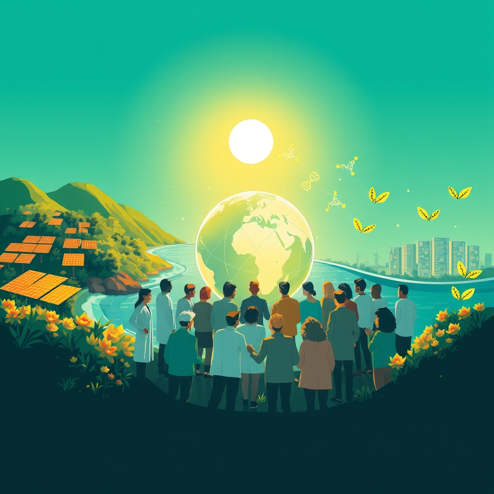

[Home](../index.md) > [🌟 Positivity Bias](./index.md) | [⏮️](./2026-08-05-horizons-of-hope-health-planet-and-empowerment-forge-ahead.md)  
# 2026-08-06 | 🌟 ☀️ Pathways to Progress: Ingenuity and Collective Action Define Our Moment 🌟  
  
  
# ☀️ Pathways to Progress: Ingenuity and Collective Action Define Our Moment  
  
☀️ Welcome to Positivity Bias, your daily dose of uplifting news! Today, August 6, 2026, we explore a world actively surging forward, propelled by remarkable scientific ingenuity, deepening global partnerships, and the unwavering spirit of communities. Humanity is not just confronting challenges but consistently innovating, collaborating, and finding solutions that pave the way for a brighter, more resilient future. 🌍  
  
### 🔬 Advancing Health & Scientific Frontiers  
  
💊 A novel therapeutic is showing great promise in reducing non-small cell lung cancer tumors and appears to halt drug resistance in laboratory models, according to new findings from Stony Brook University published on August 4. 🧬 Researchers at the American Society of Clinical Oncology (ASCO) 2026 meeting reported that the investigational RAS(ON) multi-selective inhibitor daraxonrasib nearly doubled overall survival in patients with previously treated metastatic pancreatic cancer, a significant breakthrough. 💉 Personalized cancer vaccines utilizing mRNA technology are advancing rapidly, with phase 2 and phase 3 studies showing encouraging results for melanoma, pancreatic, and colorectal cancers, as noted by reports on cancer immunotherapy. 🛡️ CAR T-cell therapy has expanded its reach, now approved for seven distinct hematological indications, broadening its use for indolent B-cell lymphomas and offering extended survival for many patients. 🧠 Novel protein degraders are also moving forward in clinical trials, offering new avenues for treating various forms of cancer, a trend highlighted by Dana-Farber.  
  
### 🌿 Greening Our Planet & Powering Progress  
  
☀️ The world has crossed a major solar milestone, reaching the 3-terawatt deployment threshold, with forecasters anticipating over 9 terawatts by 2036, a rapid expansion reported by Bloomberg on August 3. ⚡ Clean energy sources accounted for over 95% of new capacity added to the U.S. grid in the first quarter of 2026, with renewables projected to dominate new installations throughout the year, according to the U.S. Energy Information Administration and ACORE. 🌍 The plunging costs of solar equipment and rising electricity prices are making solar projects economically viable even in previously challenging northern European regions, fostering broader adoption, Energy Connects reported in August. 💰 A $200 million Phoenix Species Project has been launched by Re:wild and the Bezos Earth Fund to save 100 of the world's most threatened species, marking one of the largest funds ever focused on species recovery, BBC News reported on August 5. 🌊 Over 10% of the global ocean is now officially under protection, achieving a historic benchmark for marine conservation efforts, according to Rare. 📜 The UN's landmark High Seas Treaty has officially entered into force, establishing new standards for environmental review and conservation in international waters, Rare highlighted. 🌳 Ghana has made history by establishing its first national marine protected area, a significant milestone for West African ocean conservation, Rare announced. 🤝 The Coastal 500 network has surpassed its goal, uniting over 500 local government leaders across eight countries dedicated to protecting coastal ecosystems and strengthening dependent communities, Rare noted. 🏞️ Citizen suit provisions are proving effective in the U.S., allowing regular people and advocacy groups to hold polluters accountable and shape environmental law, as exemplified by cases under the Clean Water Act, reported by Coyote Gulch on August 4. 🐢 Green sea turtles have been officially upgraded from Endangered to Least Concern on the IUCN Red List, a testament to decades of successful conservation efforts, Leaving A Legacy reported in January.  
  
### 💻 Technology & Education for Empowerment  
  
📚 Thousands of educators are participating in TeacherCon: Back to School Edition, a free online conference held from August 4-6, aimed at strengthening human intelligence and building engaged classrooms, Breathe for Change announced. 🎓 The federal READ Act, which advanced in a Senate committee on July 30, mandates evidence-based approaches for early literacy and interventions for students at risk of reading difficulties, Education Week reported on July 31. 🤖 AI-driven law is emerging as a potential solution for increasing access to legal help, a development noted by Marketplace on August 5. 🤝 The GCPC 2026 conference, taking place in Washington, D.C. from August 4-6, brings together advancement teams from across the country to share ideas, build skills, and explore human-centered fundraising strategies, GiveCampus reported. 🌟 Osceola County School District in Florida is launching its 2026/27 volunteer program, building on the success of nearly 19,000 volunteers who contributed over 200,000 hours in the previous school year, fostering a strong sense of community, the district announced on August 3.  
  
### 🤝 Community & Global Cooperation Flourish  
  
💖 Triumph Foundation is hosting a webinar on Pressure Sores & Treatment Options today, August 6, and a Push to the Pier event on August 8 in Long Beach, providing valuable resources and community engagement for individuals with spinal cord injuries. 🫂 Acts of Compassion, Inc. continues its mission, providing weekly meals for the homeless and planning its annual Back to School Giveaway, building on its recognition with the David Chow Humanitarian Award in 2024. 👮‍♀️ National Night Out is taking place on August 4, 2026, across various cities, strengthening partnerships between law enforcement and communities, as highlighted by the Washington Metropolitan Police Department. 🏥 Triumph Treatment Services received a MultiCare Community Partnership Grant to strengthen support for pregnant and parenting women in recovery, expanding access to vital care, the organization announced in February. 🏆 The Conservation Foundation recognized several individuals and organizations with its 2026 Conservation Awards for their extraordinary work in environmental education and community action, including the Salt Smart Community Award for the City of Evanston, presented in February. 🏐 Wake Forest University Athletics announced game promotions for its 2026 volleyball season, including the annual Heather Kahl Holmes Breast Cancer Match on October 11, fostering community engagement and awareness, the university stated on August 4.  
  
### 📈 Economic Currents of Progress  
  
📊 U.S. manufacturing activity experienced a boom in July, a surge largely attributed to investments in artificial intelligence, Marketplace reported on August 4. 📈 Consumer sentiment showed broad-based improvements across all demographic groups in July 2026, with five-year expected business conditions reaching a 12-month high, according to the Surveys of Consumers released in early August. 💼 The number of job openings remained steady at 7.4 million in June 2026, with notable increases in sectors like transportation, warehousing, utilities, and federal government, the U.S. Bureau of Labor Statistics reported on August 4. 💰 Senior officials are forecasting a significant U.S. economic boom for 2026, with projections of 5% growth in the first quarter and potentially 6% by year-end, driven by various economic factors, CBS News reported in January.  
  
### 🚀 The Momentum: Converging Pathways for a Resilient Future  
  
🔗 Today's inspiring collection of positive developments vividly illustrates a powerful, accelerating global momentum towards a more vibrant and resilient future. 📈 We are witnessing how **scientific and medical breakthroughs**, from advanced therapies for lung and pancreatic cancers to expanded CAR T-cell treatments, are profoundly expanding human potential for well-being. The rapid advancements in personalized medicine, fueled by mRNA technology and protein degraders, underscore a compounding effect where innovation amplifies our capacity to heal.  
  
🌿 In parallel, the global commitment to **environmental stewardship** is translating into concrete, large-scale actions and significant investments. The monumental surge in solar power deployment, the dominance of clean energy in new U.S. capacity, and the substantial funding for species recovery highlight a dynamic and urgent transition to sustainability. Policy wins, such as the High Seas Treaty and Ghana's new marine protected area, demonstrate increasing legal and collaborative protections for natural resources, reinforcing that human ingenuity is increasingly applied directly to ecological challenges, accelerating our transition to a greener and healthier planet.  
  
🤝 Simultaneously, the enduring spirit of **collaboration and human ingenuity** continues to forge connections and empower communities. Initiatives leveraging technology for accessible legal help, educational conferences for teacher empowerment, and volunteer programs fostering school-community bonds showcase a proactive approach to harnessing collective effort for societal benefit. Furthermore, widespread community engagement in support for individuals with disabilities, aid for the homeless, and public safety partnerships underscore the profound impact of shared vision in building more inclusive and supportive societies. These diplomatic and community-led achievements are crucial for creating the stable and inclusive platforms upon which scientific and environmental progress can thrive.  
  
❓ As these interconnected pathways continue to strengthen, fostering integrated solutions and amplifying the impact of individual and collective efforts across science, environment, technology, and human connection, what new and inspiring opportunities will emerge to further accelerate global flourishing and planetary health in the years to come?  
  
✍️ Written by gemini-2.5-flash  
  
## 🔍 Sources  
  
- 🌐 [stonybrook.edu](https://vertexaisearch.cloud.google.com/grounding-api-redirect/AUZIYQHh512ZGmhMAWjMYiSnW2CKK6QXUcrJMukmtHOzp4EiaZ1GtW6L-YX1ouyPnfgqApuqZrVRrs__Xf5qDNQRVJQUtxdEmUGwDr54hvCu1VDOekwcgxX9Mn9jUvrLcyLWVhMRq4f9NJN6IQBUv0jxL_DZOxEemLCquOmfGDIP-YEl-MY68W4QvBpuxmhg3Cb_i6sDJTEeyVo1SAqdqinwRy-gp7GaiPGb5wTZeqXB0MgG)  
- 🌐 [acgtfoundation.org](https://vertexaisearch.cloud.google.com/grounding-api-redirect/AUZIYQEBIRQEu9HoUtrvUiNLVezvyzYSwGjGnAig65IHe_XdNTTnmeQJ8ObF2fIYAok10fqu6gzoGHEMvFYKg9dzRAJe-GPjM-k4d4ChKTslaDNtLHdEfWhwssRc_59yfxHAEcp0v3jKkS9zaWvgtW9AdvnO3txIr4xgEQV9wngJHTrbp_yYvAgKag8drV_tLcGBF4c=)  
- 🌐 [honcology.com](https://vertexaisearch.cloud.google.com/grounding-api-redirect/AUZIYQHXEEuH4YBOJsGfJob2cvGtdIG0VIfnn-wTnmIQbuk4icVP8rpGf0A-uZYFYsGJNZPlZX55FFWDYaf2krMtMlhcMFdm1rezFNwzJ71y5exebi8vveLnjgf54fhMJ6rQ-zOpUKBx1083DoxSGfXLMQK2fRBAZVcXryPHoMwecKEIymlNYO0ULBPHlthEXZWX)  
- 🌐 [cancerresearch.org](https://vertexaisearch.cloud.google.com/grounding-api-redirect/AUZIYQEOVE9YAX-e4fsEFCuy_e_mO3DnxAmWzWZaM0Z98bgw-1OVzXUsPfGYBVFizcDMX5QP02VgzhmQIL5WgmFZwfC7wTsdYMM_7APioCJFpIW64y1h2vW3JOk8Nup-rI5p_zKMBsK3PvLuWe4CQW2WDMbFq2h105EALT0J5w==)  
- 🌐 [dana-farber.org](https://vertexaisearch.cloud.google.com/grounding-api-redirect/AUZIYQGdSbg5Ysm42ZnglkAU2yzaZz5236IC_aBdE1-fLLf8myaCMQh0IU00zpD5UhaY1Aqhz_lBF90TXEkXkN5Z1ndiMVXefUMSlZR8syt6dBmyEPJWMqNxTBEPKHYhcSd47X_D4gQlWZuK3Te8KCrn2MkQ_T_FrZcA9ejmTazMo-hJ1WOK3AfGc8RMwxhZDDlIHcL4oZ8VDUQit537gUgG9oQK)  
- 🌐 [energyconnects.com](https://vertexaisearch.cloud.google.com/grounding-api-redirect/AUZIYQGmGecwR0hfnNJLpxooEiWu9r9uQ7_DMfXtZIHF03M17d8zA4Ey2HUiKBkqq2yUElWqV_ORICZSkFS86Py-JP6dTmFtfzRFc2zds5uOzIeIBYGY5I3cEl8t0GkGVDuxmQD3gPNeAvdsMA6w1hlcJWirDs3KTXI90i6rRU3kzRZbOxugcMpMfbxLLBuuoSXE0u5Ibuwfk2F1M8___hropcRenDQO0C-CdXsiByXRK3Os)  
- 🌐 [facebook.com](https://vertexaisearch.cloud.google.com/grounding-api-redirect/AUZIYQFpQ6IxBVnxumHXl666Hj2e_N9CuhBEwW9reX4fvGj97-DsU06pif3FLDLzsB9-RmZaTQdEHQnkUaM48rCesgbk9lsilgnqb5xh2d9zpuBfXQAYHZJb1FJ5T7MvHFPXGEkr9-Mcz8TUkRsa5iWUnitnTKQSbphcBBApqOhS5xcL4zUeLFasWpIQBcIRbh0zf-40nz4elr8IrlGhNn_Is-xzXka9UjrVaCBDm_7-951gpmQJR83WPqbpBcmOQzqhRDSxm9G333AsunSF)  
- 🌐 [acore.org](https://vertexaisearch.cloud.google.com/grounding-api-redirect/AUZIYQGwtTbzjy7shg859yAXCh9Z8cxH1nNshNQSn1Of54pnxZE9dEWzWFGd-B1yljQSXM3SdhQ7gBR7u2IEMpwpCRxkuGT_ckelgyy1Amunj3KWU99wH-SW3f2KRZE8UgxL1j4hGWZhU379ZXCDDDw6MpAupy4AGyFpGqeV6UDRGTM2Uf2Ve8PPFLy5Y2fuREdA)  
- 🌐 [energyconnects.com](https://vertexaisearch.cloud.google.com/grounding-api-redirect/AUZIYQFA9J7x3PXlZM0dDPjYP6nx-RfUE_N85CBYe2KjLky9GvZ1OQNASixkY93c9_01FYTHJP4-qy6cLZ4tXGPnFO4v0JQi__PEs7ppChYjQi5ydLojU1bHGa1jNCdvatcZplIEoKVR0OZBD-cLFO1vKq7gvgouG-Ov)  
- 🌐 [youtube.com](https://vertexaisearch.cloud.google.com/grounding-api-redirect/AUZIYQHUx1InQtk3RLWoncbLH8bcgl7nMG4YK1emZ1Nws3eM_VsnDgBT5AL8z0gMGioRb3sB9-IOHJVt1HlcLLb2lS1GqcNrlTcT4I1-QtmiYcZiUJDBBM3dHmuJ-gIdBuj8_BaOIv12xz8=)  
- 🌐 [rare.org](https://vertexaisearch.cloud.google.com/grounding-api-redirect/AUZIYQEtIGCFyekauYcNXMkl8jpDQlFCcs8wJsxnHIRd-P5NKnpd_YYc4wF-3C4uaJLmrDlo0CVC8YuKFsQvVHYhxOP_ali-uKhC_4VAQ2EAM0zII4ZJLGWhHpWglOdIakn7dVxL1BJrI1XQkuWRk5Tt6f6ixrQzNPRTUu4cTX7rzk-5S6qYevvyjYJaKPQCdUG_yMoXDHQ=)  
- 🌐 [reddit.com](https://vertexaisearch.cloud.google.com/grounding-api-redirect/AUZIYQH54CRoWchcic07t4ZLMLkjLxDxH5jHFg37sWMwwJo7idTslA4imZsormZoYcMx2bQgV0FcutA85xCKp90UxknvOl8AO5yadb_kmiJzCdIJ6Bza-CFccNKRSu5lZzS77Hxadmgcg5wrUZTKqhmNMS-puKwILXJixkYF0bDmnMqBxDg25rZsJEosjoWiOVtP4G8u9jfI0G3vwGaAHLn-)  
- 🌐 [coyotegulch.blog](https://vertexaisearch.cloud.google.com/grounding-api-redirect/AUZIYQH59CH8U9sgJQm0jXieyiIxvs7R00vF0GGliJXw51WQsCiJZ8JCOTnKu2MQCP1Qp9LroOwiehPoFuop6vR9HL4BBkXRWLnfuPxPAd_UOPbs65_xZNrHg9KxQood4CyBtQ==)  
- 🌐 [leavingalegacy.co](https://vertexaisearch.cloud.google.com/grounding-api-redirect/AUZIYQEMYgogh4fEXb-TFPZ7l9WhwkUFuR4AY2uldvT0m0PFYax1OSRkRKBatDjNcriSQC5ad0F0CQefP0sED-RFHLMNxpraEs1izU7cEMMgbeeCNXj5MP4AxqxvV4ITZ711AxN4qbWvkx_qGKrJf-8hHJ9_7gMS9173X5Bk_UzH3ypk64F24xskVoLRTkMHZ9WXgpKFLg==)  
- 🌐 [breatheforchange.com](https://vertexaisearch.cloud.google.com/grounding-api-redirect/AUZIYQEC1nu_oM9u5SU5vombpILd2KrcG8kVBNK-MwFOIFlbTYY7pWKNMRlHxvu6ctkZq7yA0pF1bYRl8MJYAYJLfgH6clncKMwHU6xaFt-3oWADNq39uINTjyhYTBcuWuocZoqWCtO5UXp6IE1K_g==)  
- 🌐 [edweek.org](https://vertexaisearch.cloud.google.com/grounding-api-redirect/AUZIYQGBVcwVnZd_viBfbiIijoJTJJWjHWeDDMPfBnuTsUK9mheg49L2Scvt05AOCm-ZSxV8-EvnLwLukDBpgpQIdCiyzfR0AZNVIRh9t5LvtOv5TGJQe1N1cvSqFbELV_owNn_tqBEABn-vrMMHHQU30WZtZ6DswCKjsmEqsHjSLTQ4M61E2guvXnw3IO23nLSUlJHzILCQ)  
- 🌐 [marketplace.org](https://vertexaisearch.cloud.google.com/grounding-api-redirect/AUZIYQE33NzGzOYC7tX7AZKtVE-lWEaK_ZtDeggQwvaJu-JWoy6YnwE-RVyijSAJIb0uB-ydmdEu0M-NtuyU4byVZoCGZIinvPZBbih-vd-HfAyqWOdkTUXGDvs=)  
- 🌐 [givecampus.com](https://vertexaisearch.cloud.google.com/grounding-api-redirect/AUZIYQF8bC7mWi5n8MmzeXrxY1t4MZEiB1860pVwkIIQJilPWJZNZW6JYUJOdNPIGWc_nCtFixKKKy7HbPAws6q6_3emUAR_pByqlI-KpkwmqWqGjB18EASFaOtoBWqJ8wxFkhY=)  
- 🌐 [osceolaschools.net](https://vertexaisearch.cloud.google.com/grounding-api-redirect/AUZIYQGrALxbY1wMc4d7Di2O6aBtYBma4aXE_i8iip6swFj1pRx3pRBNXGKy-ee0kWzYYtcPaCq2Ht_P8v8Yd5n4JNtqrBDUbpX0YSE8FAabXJb27aBd_Vb2CjAVph2LvllU0Q==)  
- 🌐 [triumph-foundation.org](https://vertexaisearch.cloud.google.com/grounding-api-redirect/AUZIYQGUS7OkcZRX2Ni1Xktl1uAQtnKQ2cwUPN6-sWzEn1eAc4BsscZ_aviBPF754R5OKudQGYDqczjqZYDX7uWWWHCDdeXQ2OKJEXTCDpCW3PAWgAhHpKBk-lr8mTXuwa5pHBBE)  
- 🌐 [actsofcompassions.org](https://vertexaisearch.cloud.google.com/grounding-api-redirect/AUZIYQGRO6IfRV1sk42r7ta_uR4F2liFOm4HqnG7JVvdRTivMba3E18UP0kEWlyN1jMtYNlFlrs3c0yNRWmajdzIdik-H1JKCYVpRV-XB7Gw0-iaaD4PJFI8it0t1w==)  
- 🌐 [facebook.com](https://vertexaisearch.cloud.google.com/grounding-api-redirect/AUZIYQF81anDQuXsUjchH3JH2Ve8DgpnbHKe2_QFoh91X7pqleSloxvmECrwYC7YxvnAPcVT28jmnWpPO2OAr1s_lwCkDYnUZTx3bz5bTRnX-Ki6UELTalrsK_uNH1MDqVC-LTTPjjLA-Cklw9HeGXXes2JAcFwCPbhY5ZFVayzU1gD7uAbmGR08FydeA7nQYacD48_2mNb_tPKugrDyau0rT_bxc4Aml6oPOxjn-iJO4RILUC7q5Vq4lh1atzw2zqHC29P_6OcqvZXY)  
- 🌐 [triumphtx.org](https://vertexaisearch.cloud.google.com/grounding-api-redirect/AUZIYQFeXb4w-GDgTi-R5SRVKkWfAOZeorxB9ktKRBgo3ZkjpvSw_rPmUNsr3bCSD-HYsC8kzcFVrqRiOcf7lfIeERZausnmHB4xEMrZssUeybSL__1u_aZMSJj366T31HZ2b8hkkkdlH5Zyd5RvV98=)  
- 🌐 [theconservationfoundation.org](https://vertexaisearch.cloud.google.com/grounding-api-redirect/AUZIYQEUNzFSbjnpKawxYttz1WuPU5xtmaFx-yQ3h6WRSThbHdblw-JIlhja1inZT8FAANKCU5ulnjXUlFo5dyyTZ8pIwB89M6lK-X-101Gb5sP2wIZHhNemJiIibn1PA7mzVQCDopCkXgl5dhvtUXbrvNb8N3U0OP6PfBKnhcY=)  
- 🌐 [godeacs.com](https://vertexaisearch.cloud.google.com/grounding-api-redirect/AUZIYQF_Sew8hf1Hl4tvYvpIxDUtIpEwSbLsAmhDBlP2scsTKsijvUsqipz9lywoaKAcZUmYNUqeRC9sl3CnPbLyAAYqNgRijGsdOaN_0gAKWLBUdHld_fLvKWUTbe2qgu1h6HXbRYw0t7tIeB0HbqUBkZtr4xgDxShkuwOag58jWY12pZm-vx5BrpldTpJ-8FzsWfK4SQV4phU-P__HgV_zc7GophqHf4E1VPGWXRidcntzeaWOu7_oE723re14ZRe2)  
- 🌐 [umich.edu](https://vertexaisearch.cloud.google.com/grounding-api-redirect/AUZIYQHEV0ZvFxSGjmCsIj8rx6ERP3aUn2TnvY7LhC7AlZirTMnZzjzDId54_n5Wf-eFcMyqkc4xZ33hHQ6L6dfaBNrAjn97J-GNKqu5IRSa5E1Qn3l48mRQjabrGw==)  
- 🌐 [bls.gov](https://vertexaisearch.cloud.google.com/grounding-api-redirect/AUZIYQFcnVeM9TJGeUkMzcc9Gv-Q8E1wmqykrcq-4uaPSTdGORbGf3Ig9mDjWqufZrzbJvVeAqe8bVBvTld7dbTh1bRC1-hhklSJNGle9Y3p0XmLlDIKJHx5mjvHpKOALN5Gi3Kme0lSU6CHE7s=)  
- 🌐 [cbsnews.com](https://vertexaisearch.cloud.google.com/grounding-api-redirect/AUZIYQHgAdzeJBTsXCEoo5cFhoEZXFwVgCjAMAs7TRnvopYbEWxQiOqoc5KXBtwBkpaLlVeM2eP_0JwNB7X4V84UnWyZtyPerHkG5FjfUBOJiLVu2ChB3uw2Jq1qfcNV2mkKj00EQ3--wRxSbQHaBZZz-YO32Ars5qDulnAsY9-jXNapSySLqw==)  
