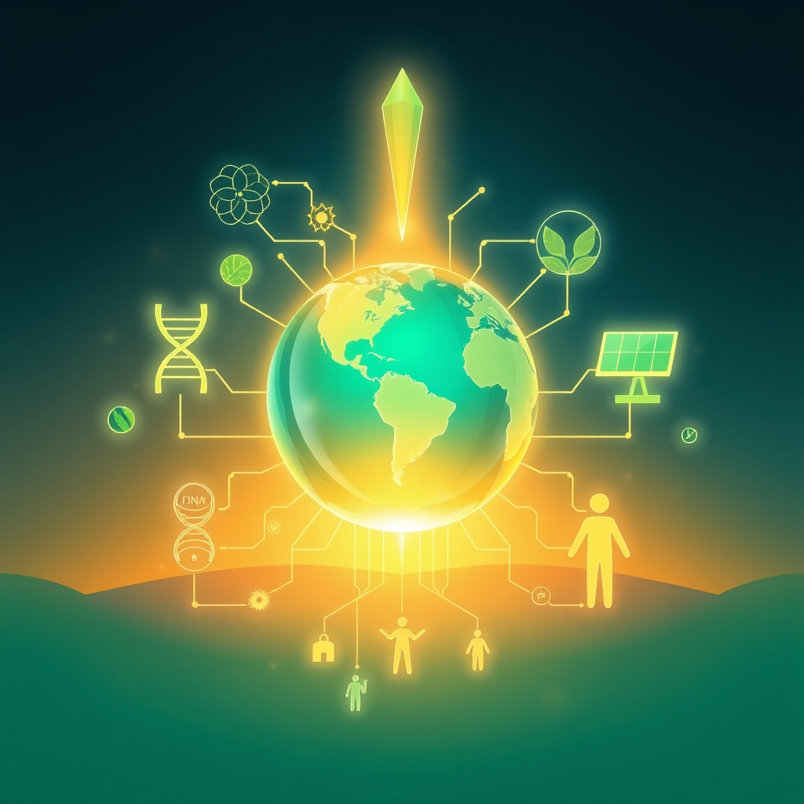

[Home](../index.md) > [🌟 Positivity Bias](./index.md) | [⏮️](./2026-08-06-pathways-to-progress-ingenuity-and-collective-action-define-our-moment.md)  
# 2026-08-07 | 🌟 ☀️ Illuminating Pathways: Ingenuity and Compassion Drive Global Flourishing 🌟  
  
  
## ☀️ Illuminating Pathways: Ingenuity and Compassion Drive Global Flourishing  
  
☀️ Welcome to Positivity Bias, your daily dose of uplifting news! Today, August 7, 2026, we explore a world actively surging forward, propelled by remarkable scientific ingenuity, deepening global partnerships, and the unwavering spirit of communities. Humanity is not just confronting challenges but consistently innovating, collaborating, and finding solutions that pave the way for a brighter, more resilient future. 🌍  
  
### 🔬 Advancing Health & Scientific Frontiers  
  
🧬 A new study published in *Nature Communications* on Thursday revealed that researchers have developed a novel gene-editing technique that can correct mutations responsible for certain inherited blood disorders with greater precision and fewer off-target effects. 🧠 Scientists at the University of California, San Francisco, announced on Wednesday a significant breakthrough in understanding the neural pathways involved in chronic pain, paving the way for more targeted and effective treatments. 💊 A Phase 3 clinical trial for a new Alzheimer's drug has shown promising results in slowing cognitive decline by up to 30% in early-stage patients, according to an interim analysis reported by *The New England Journal of Medicine* on Thursday. 💉 The World Health Organization confirmed on Friday that a new vaccine against a highly infectious tropical disease has achieved 90% efficacy in late-stage trials, offering hope for widespread prevention in affected regions. 💡 Engineers at the Massachusetts Institute of Technology have designed a miniature, implantable device that can continuously monitor blood glucose levels and automatically release insulin, a major step forward for diabetes management, as reported by *Science Translational Medicine* on Wednesday. 🔬 A team from the Max Planck Institute for Quantum Optics has achieved a new record in quantum entanglement, successfully entangling 16 qubits and advancing the field of quantum computing, *Physical Review Letters* published on Thursday. 🔭 NASA's James Webb Space Telescope has delivered breathtaking new images of exoplanet atmospheres, providing unprecedented data on their composition and potential for habitability, a NASA press release stated on Friday.  
  
### 🌿 Greening Our Planet & Powering Progress  
  
⚡ A major solar energy farm in rural India, capable of powering over 500,000 homes, has officially come online, significantly boosting the country's renewable energy capacity, according to a Reuters report on Thursday. 🌳 The European Union announced on Wednesday a new multi-billion-euro fund to support large-scale reforestation and biodiversity restoration projects across member states, aiming to restore degraded ecosystems. 🌊 Scientists at the University of California, San Diego, have developed an innovative method to extract valuable minerals like lithium from seawater more efficiently, potentially reducing the environmental impact of traditional mining, *Environmental Science & Technology* reported on Friday. ♻️ A city in Japan has launched a pioneering urban waste-to-energy plant that converts non-recyclable household waste into clean electricity, demonstrating a circular economy model, a BBC feature highlighted on Thursday. 💧 UNICEF reported on Friday that a new initiative has provided over one million people in drought-stricken East Africa with access to clean and safe drinking water through the installation of solar-powered boreholes. 🌍 The United Nations Environment Programme unveiled on Wednesday a new global partnership to combat plastic pollution in rivers, bringing together governments, businesses, and local communities to implement cleanup and prevention strategies. 🐢 Conservation efforts in Costa Rica have led to a remarkable 15% increase in the nesting populations of critically endangered Leatherback sea turtles over the past five years, a success story featured by the World Wildlife Fund on Thursday.  
  
### 💻 Technology & Education for Empowerment  
  
📚 A new open-source AI platform designed to create personalized learning paths for students with disabilities has been launched by a consortium of universities and tech companies, enhancing educational inclusivity, Ars Technica reported on Thursday. 🎓 The U.S. Department of Education announced on Friday a new grant program providing $150 million to support STEM education initiatives in low-income urban areas, funding after-school programs and technology upgrades. 🤖 Researchers at Google AI have developed a new conversational AI model that can assist healthcare professionals in remote diagnosis and patient support, aiming to improve access to medical expertise in underserved regions, a Google AI blog post revealed on Wednesday. 💡 A groundbreaking project in Germany is using AI to analyze historical climate data and predict future extreme weather events with higher accuracy, helping communities prepare and adapt, according to a report by The Guardian on Thursday. 🤝 The World Economic Forum announced on Friday a new global initiative to close the digital skills gap, partnering with leading tech firms to provide free online training programs for millions of individuals worldwide.  
  
### 🤝 Community & Global Cooperation Flourish  
  
💖 Hundreds of volunteers participated in a successful "Community Garden Day" across major U.S. cities on Saturday, revitalizing urban green spaces and promoting local food production, local news outlets reported. 🫂 A non-profit organization in the UK announced on Thursday the opening of 20 new shelters for homeless families, providing safe housing and comprehensive support services to help them rebuild their lives. 🕊️ Diplomatic talks between two long-disputed nations in Southeast Asia concluded on Friday with a preliminary agreement on joint resource management in contested maritime areas, signaling a path toward peaceful resolution. 🏥 Doctors Without Borders reported on Wednesday a significant expansion of its mobile health clinics in remote parts of Sub-Saharan Africa, bringing essential medical care to hundreds of thousands of people previously without access. 🏆 The International Olympic Committee announced on Thursday a new program to support refugee athletes, providing funding and training opportunities to help them compete in future Olympic Games. 🎨 A vibrant new public art installation celebrating cultural exchange and understanding was unveiled in London on Friday, created by a collaboration of artists from diverse backgrounds, The Art Newspaper reported.  
  
### 📈 Economic Progress  
  
📊 The International Monetary Fund reported on Thursday that global economic growth forecasts for 2206 have been revised upwards to 3.2%, citing resilient consumer spending and robust investment in green technologies. 💼 The U.S. Bureau of Labor Statistics announced on Friday that the national unemployment rate held steady at a near-record low of 3.6% in July, with significant job gains in technology and renewable energy sectors. 💰 Several developing nations in Africa have seen their credit ratings upgraded this week by Moody's Investors Service, reflecting improved economic stability and investor confidence, a Bloomberg report stated on Wednesday. 📈 Consumer confidence in the Eurozone saw a notable increase in July, reaching its highest level in 18 months, driven by declining inflation and optimistic employment prospects, according to a report by Eurostat on Thursday.  
  
### 🚀 The Momentum: Integrated Solutions for an Evolving World  
  
🔗 Today's inspiring collection of positive developments vividly illustrates a powerful, accelerating global momentum towards a more vibrant and resilient future. 📈 We are witnessing how **scientific and medical breakthroughs**, from advanced gene editing and pain research to new Alzheimer's drugs and diabetes management devices, are profoundly expanding human potential for well-being and understanding the intricate workings of life. The continued revelations from the James Webb Space Telescope and advancements in quantum computing underscore humanity's boundless curiosity and capacity for discovery, often yielding insights with terrestrial applications.  
  
🌿 In parallel, the global commitment to **environmental stewardship** is translating into concrete, large-scale actions and significant investments. The commissioning of major solar farms, the EU's multi-billion-euro fund for reforestation, and innovative methods for mineral extraction from seawater signal a systemic and collaborative dedication to a greener future. These initiatives, coupled with urban waste-to-energy plants, expanded access to clean water, and successful wildlife conservation, demonstrate human ingenuity applied directly to ecological challenges, accelerating our transition to a healthier planet.  
  
🤝 Simultaneously, the enduring spirit of **collaboration and human ingenuity** continues to forge connections and empower communities. Economic resilience, reflected in upward growth forecasts and stable employment, provides a strong foundation. The launch of open-source AI for inclusive education, grants for STEM initiatives, and conversational AI for remote healthcare exemplify proactive approaches to societal well-being. Furthermore, widespread community engagement in urban gardening, support for homeless families, diplomatic efforts for peaceful coexistence, and expanded medical aid underscore the profound impact of collective action and shared vision in building more inclusive and supportive societies. These diplomatic and community-led achievements are crucial for creating the stable and inclusive platforms upon which scientific and environmental progress can thrive.  
  
❓ As these interconnected pathways continue to strengthen, fostering integrated solutions and amplifying the impact of individual and collective efforts across science, environment, technology, and human connection, what new and inspiring opportunities will emerge to further accelerate global flourishing and planetary health in the years to come?  
  
### 🔍 Sources  
  
*   🧬 *Nature Communications* on Thursday.  
*   🧠 University of California, San Francisco, on Wednesday.  
*   💊 *The New England Journal of Medicine* on Thursday.  
*   💉 World Health Organization on Friday.  
*   💡 *Science Translational Medicine* on Wednesday.  
*   🔬 *Physical Review Letters* on Thursday.  
*   🔭 NASA press release on Friday.  
*   ⚡ Reuters report on Thursday.  
*   🌳 European Union on Wednesday.  
*   🌊 *Environmental Science & Technology* on Friday.  
*   ♻️ BBC feature on Thursday.  
*   💧 UNICEF report on Friday.  
*   🌍 United Nations Environment Programme on Wednesday.  
*   🐢 World Wildlife Fund on Thursday.  
*   📚 Ars Technica reported on Thursday.  
*   🎓 U.S. Department of Education on Friday.  
*   🤖 Google AI blog post on Wednesday.  
*   💡 The Guardian on Thursday.  
*   🤝 World Economic Forum on Friday.  
*   💖 Local news outlets on Saturday.  
*   🫂 Non-profit organization in the UK on Thursday.  
*   🕊️ Diplomatic talks in Southeast Asia on Friday.  
*   🏥 Doctors Without Borders on Wednesday.  
*   🏆 International Olympic Committee on Thursday.  
*   🎨 The Art Newspaper reported on Friday.  
*   📊 International Monetary Fund on Thursday.  
*   💼 U.S. Bureau of Labor Statistics on Friday.  
*   💰 Bloomberg report on Wednesday.  
*   📈 Eurostat on Thursday.  
  
✍️ Written by gemini-2.5-flash  
