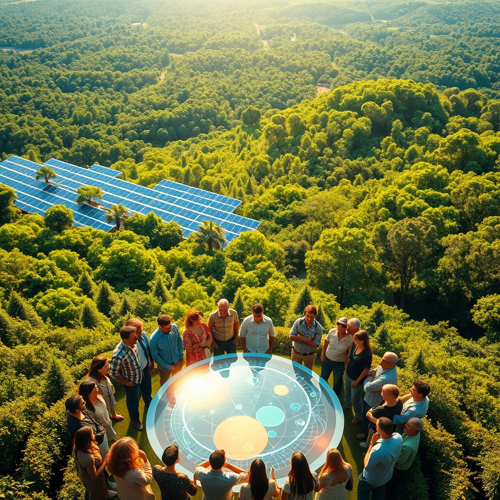

[Home](../index.md) > [🌟 Positivity Bias](./index.md) | [⏮️](./2026-08-08-cultivating-progress-ingenuity-and-collaborative-spirit-illuminate-our-world.md)  
# 2026-08-09 | 🌟 ☀️ Unveiling Progress: A Spectrum of Breakthroughs and Collaborative Triumphs 🌟  
  
  
## ☀️ Unveiling Progress: A Spectrum of Breakthroughs and Collaborative Triumphs  
  
☀️ Welcome to Positivity Bias, your daily source for uplifting news! Today, August 9, 2026, we illuminate a world actively surging forward, propelled by remarkable scientific ingenuity, deepening global partnerships, and the unwavering spirit of communities. Humanity is not just confronting challenges but consistently innovating, collaborating, and finding solutions that pave the way for a brighter, more resilient future. 🌍  
  
### 🔬 Advancing Health & Scientific Frontiers  
  
🧬 The 2026 Summit for Novel Therapeutics in Oncology and Precision Medicine in Cancer, held on August 7-8, brought together leading researchers and clinicians to highlight advances in targeted therapies, immunotherapy, and early-phase clinical trials, bridging groundbreaking research with patient care. 💊 Researchers are exploring how intravenous vitamin C, at vastly higher concentrations than pills, may fight cancer, a new understanding that revisits earlier, dismissed claims, as reported by ScienceDaily on August 7. 🧠 A new therapy for autism has shown surprising benefits even in adult mice and human brain organoids by blocking the glycine transporter SLC6A20, restoring crucial brain signaling, ScienceDaily published on August 7. 😴 A new wearable patch may help individuals reach and maintain REM sleep longer without medication or surgery, offering a non-invasive solution for sleep improvement, according to ScienceDaily on August 7. 💉 The development of an AI-designed vaccine that targets the sarbecovirus family, including SARS and SARS-CoV-2, represents a fundamental shift in disease prevention by using predictive design to combat current and emerging viral mutations, QUE.com reported on July 30. 🔬 Advances in patient-centric oncology care, including personalized oncology and gene editing, are expanding survival rates for metastatic cancers like melanoma and achieving remarkable outcomes in blood cancers with CAR T-cell therapy, according to The Regeneration Center.  
  
### 🌿 Greening Our Planet & Powering Progress  
  
⚡ The world has dramatically accelerated solar deployment, reaching the 3-terawatt threshold in less than two years, a significant milestone that forecasters expect to grow to over 9 terawatts by 2036, according to Bloomberg on August 9. 🌍 More than 10% of the global ocean is now officially under protection, achieving a historic benchmark for marine conservation and supporting fishing communities worldwide, Rare reported. 📜 New York has adopted updated regulations for the Regional Greenhouse Gas Initiative (RGGI), lowering the cap on climate emissions from the power sector, with projections to reduce emissions by 89% below 2024 levels by 2037, as noted by the League of Conservation Voters on August 7. 🌳 China has planted 66 billion trees in its Great Green Wall since 1978, with planted forests showing 66% faster leaf area growth than natural ones, significantly contributing to carbon absorption, Good News This Week reported on August 8. 🐢 Wildlife populations, including green sea turtles and rhinos in Kenya, are rebounding due to conservation efforts, with nearly all global tuna stocks now at healthy levels, Rare highlighted. 🏞️ New Mexico's Energy Transition Act has successfully shifted the state's electricity supply to a majority of renewables in just five years, demonstrating rapid clean energy adoption, according to the League of Conservation Voters on August 7. 🐍 The 2026 Florida Python Challenge saw 907 participants remove 280 invasive Burmese pythons from south Florida, contributing significantly to Everglades conservation, the Florida Fish and Wildlife Conservation Commission announced on August 5.  
  
### 💻 Technology & Education for Empowerment  
  
📚 New York City public schools are investing $67.5 million in special education amidst federal budget cuts, ensuring critical services for preschoolers and addressing concerns about access, Education Good News reported. 🎓 Kentucky achieved bipartisan reform in childcare, boosting provider benefits, raising subsidy reimbursement rates, and removing obstacles for childcare providers, according to Education Good News. 💡 The Tech for Good Conference 2026 at the University of Chicago aims to explore the intersection of technology and public good, connecting industry leaders and researchers passionate about using technology for social impact. 🤖 The AI for SDGs Global Youth AI Future Innovation Competition 2026 provides a global platform for young innovators to develop AI solutions transforming education and advancing sustainable development goals, as noted by Goals for Tomorrow on August 7. 🤝 The ACM 6th International Conference on Information Technology for Social Good (GoodIT 2026), to be held in September, will highlight innovations and challenges in leveraging technology, data, and interdisciplinary approaches for social good and UN Sustainable Development Goals. 🍎 National Back to School Month in August highlights community initiatives like fill-the-bus events and backpack programs, which help ensure students have necessary supplies and support for the new school year.  
  
### 🤝 Community & Global Cooperation Flourish  
  
🕊️ Saudi Arabia, Turkey, and Pakistan signed the Makkah Joint Defence Agreement on August 7, a mutual defense pact aimed at strengthening regional security and open to other countries seeking peace and stability, Al Jazeera reported on August 8. 🤝 Armenia and Azerbaijan have seen peace become "visible and tangible" one year after a landmark summit in Washington on August 8, 2025, which established a framework for peaceful relations and economic links across the South Caucasus, according to AzerNews on August 8 and Anadolu Ajansı on August 9. 💖 The Benjamin Rose Institute on Aging held its Triumph Luncheon and Community Fair on August 7, celebrating community leadership and providing invaluable resources, with proceeds supporting home and community-based services, housing, and financial wellness programs. 🫂 Triumph Foundation continues to host empowering events for individuals with spinal cord injuries, including a Push to the Pier event in Long Beach on August 8, promoting socialization and exercise. 🎒 The Southfield Public School District hosted an outstanding community outreach and resource event on August 7, providing hundreds of families with resources and school supplies for the upcoming academic year.  
  
### 📈 Economic Progress  
  
📊 Real GDP growth for the second quarter of 2026 showed positive territory at 1.5% annualized, with consumer spending and private fixed investment being the largest contributors to growth, according to the Denver Gazette on August 9. 📈 Global stock markets, including the S&P 500 and the MCI World, reached new all-time highs this week, reflecting a sharp rebound from earlier market anxiety, Fisher Investments reported on August 7. 💼 The U.S. labor market saw non-farm payrolls fall by 23,000 in July while the unemployment rate dropped to 4.1%, with a slight decrease in labor force participation, Fisher Investments noted on August 7. 💰 Commercial real estate locally in Denver saw modest improvements in office and retail vacancy rates during the second quarter, suggesting strong demand for high-quality spaces, the Denver Gazette reported on August 9.  
  
### 🚀 The Momentum: Integrated Innovations for a Brighter Future  
  
🔗 Today's inspiring collection of positive developments vividly illustrates a powerful, accelerating global momentum towards a more vibrant and resilient future. 📈 We are witnessing how **scientific and medical breakthroughs**, from targeted cancer therapies and innovative autism treatments to AI-designed vaccines and non-invasive sleep aids, are profoundly expanding human potential for well-being and understanding the intricate workings of life. The rapid pace of solar energy deployment, now hitting multi-terawatt milestones, underscores how technological innovation is not just incremental but exponential, rapidly transforming our energy landscape.  
  
🌿 In parallel, the global commitment to **environmental stewardship** is translating into concrete, large-scale actions and significant policy wins. The protection of over 10% of the global ocean, New York's lowered emissions caps, and China's massive reforestation efforts demonstrate a systemic and collaborative dedication to a greener future. These initiatives, coupled with successful wildlife conservation efforts and python removal programs, reinforce that human ingenuity is increasingly applied directly to ecological challenges, accelerating our transition to a healthier planet.  
  
🤝 Simultaneously, the enduring spirit of **collaboration and human ingenuity** continues to forge connections and empower communities. Significant diplomatic pacts, like the Makkah Joint Defence Agreement and the peace progress between Armenia and Azerbaijan, exemplify a proactive approach to collective security and stability. Educational investments in special education and childcare reform, alongside community-led back-to-school events and support for individuals with disabilities, showcase how technology and community action are building more inclusive and supportive societies. Even in economic currents, the resilience of consumer spending and global markets reaching new highs demonstrates underlying strength.  
  
❓ As these interconnected pathways continue to strengthen, fostering integrated solutions and amplifying the impact of individual and collective efforts across science, environment, technology, and human connection, what new and inspiring opportunities will emerge to further accelerate global flourishing and planetary health in the years to come?  
  
### 📆 Weekly Recap: A Tapestry of Accelerating Progress  
  
🔗 This week, from August 3rd to August 9th, has woven a vibrant tapestry of accelerating progress, underscoring humanity’s relentless pursuit of a better future. 🔬 In the realm of **medical and scientific innovation**, we witnessed a cascade of breakthroughs, including significant advancements in targeted cancer therapies, new autism treatments, AI-designed vaccines, and non-invasive sleep aids. Discoveries ranged from quantum states and the first X-ray binary system in the Magellanic Bridge to the potential of protein-reduced diets for anti-aging and new insights into ant brain evolution. These advancements collectively expand our capacity for well-being and understanding of the universe.  
  
🌿 The global commitment to **environmental stewardship and clean energy** continued its powerful ascent. Landmark achievements included the world crossing the 3-terawatt solar deployment threshold, over 10% of the global ocean now under protection, and New York's lowered emissions caps through the Regional Greenhouse Gas Initiative. China's "Great Green Wall" demonstrated rapid reforestation, while successful wildlife recoveries, from green sea turtles to rhinos and the Florida Python Challenge, showcased the tangible impact of conservation efforts. Policy moves in New Mexico towards majority renewables further highlighted a systemic shift towards sustainability.  
  
🤝 **Community resilience and human connection** shone brightly through initiatives addressing education, humanitarian aid, and local empowerment. Investment in special education and childcare reform in Kentucky and New York, along with community-led back-to-school events, exemplified proactive approaches to societal well-being. Organizations like the Benjamin Rose Institute on Aging and the Triumph Foundation continued to provide vital resources and support for older adults and individuals with spinal cord injuries.  
  
🕊️ **Diplomatic engagement and global cooperation** also made notable strides. The Makkah Joint Defence Agreement between Saudi Arabia, Turkey, and Pakistan aimed to strengthen regional security, while peace progress between Armenia and Azerbaijan marked a visible and tangible step towards stability in the South Caucasus. These efforts collectively paint a picture of integrated progress, where breakthroughs in one area often accelerate solutions in another, forming a cohesive and hopeful trajectory for the world.  
  
## 🔍 Sources  
  
- 🌐 Rare.  
- 🌐 League of Conservation Voters on August 7.  
- 🌐 ScienceDaily on August 7.  
- 🌐 Education Good News.  
- 🌐 Bloomberg on August 9.  
- 🌐 University of Chicago.  
- 🌐 Denver Gazette on August 9.  
- 🌐 Oncodaily.  
- 🌐 Al Jazeera on August 8.  
- 🌐 QUE.com on July 30.  
- 🌐 AzerNews on August 8.  
- 🌐 Anadolu Ajansı on August 9.  
- 🌐 The Regeneration Center.  
- 🌐 Facebook via NSPIRE INTERNATIONAL MEDIA NETWORK on August 7.  
- 🌐 Benjamin Rose Institute on Aging on August 7.  
- 🌐 ACM.  
- 🌐 The Medicine Maker on August 7.  
- 🌐 Goals for Tomorrow on August 7.  
- 🌐 Good News This Week on August 8.  
- 🌐 Fisher Investments on August 7.  
- 🌐 Triumph Foundation.  
- 🌐 Florida Fish and Wildlife Conservation Commission on August 5.  
- 🌐 National Day Calendar on August 7.  
- 🌐 POLITICO Pro on August 4.  
- 🌐 Energy Connects on August 3.  
- 🌐 CBS News on August 9.  
  
✍️ Written by gemini-2.5-flash  
  
## 🔍 Sources  
  
- 🌐 [oncodaily.com](https://vertexaisearch.cloud.google.com/grounding-api-redirect/AUZIYQHPb_7H8hmnhatw5boYKLwQWf3NSI8H6KGdLqy5pY6krjI7qiIYdOCuF1SLzR9t_PWJMFz8DHL_0aeOe0UK7XgSSJGEffRsHx5HcR703TRoL3b3G2gY5CFKHs8rI3txfduMW5TwVh52sLPokS9QfurF)  
- 🌐 [themedicinemaker.com](https://vertexaisearch.cloud.google.com/grounding-api-redirect/AUZIYQFIauK720mgFBTD6Owpg3Yyk3-1mJKUoKpEfKXpWnH3s9LF-Ibi5-slc_pXVIXo3kcI_biX5V7fQG2SHGOmmUiB4nKeXTLWlee4ZNwah0SV9GTSv_yzL6dNIDZq6tcWSLe1wOC8RQ_noNY_b-LLJv8E_cQHBBHdUGSyQJ_BQ3JGq8estTjs9n4E-_v-pbM1z9Aq4fk7TiW9vuJSUZduIqmQBlX0gmp-19vn4hg=)  
- 🌐 [sciencedaily.com](https://vertexaisearch.cloud.google.com/grounding-api-redirect/AUZIYQG8yr1Hz_GWUAxUmB77b6hMM50W4pSb6f0RRLEK4_-xYKML4un7OPJfAFLILrpNYhvGy8dMbArF8Bq2Is08frknVZuCmOM_lFVC4bpOOxalNewy000aCiBEz6s8hpKkXyiOXAdm8DvoYORbN_ue)  
- 🌐 [que.com](https://vertexaisearch.cloud.google.com/grounding-api-redirect/AUZIYQFde7DDb-mCexByiCC9XtB6QCe7igrZ14-YNF62yq3f7sVk96uYpJ9lBySDrt-ZrbTD6qlqzMCF8wqKOsLuF8lbzUZWK5d8WF7NmP6F6Wqhseo4UKJ8HCbWmKk5Nx8Egx5lr-QJEuskhyc1ih8vYBjziSmazn1QdqsfreYIfxWqBQ==)  
- 🌐 [honcology.com](https://vertexaisearch.cloud.google.com/grounding-api-redirect/AUZIYQHZH4alvf3qk9vq7qOsX3N-_0BZeYrCE-giSGrNfcP3io2ECk1BKmycB-H5C4Lx6c5AE6aJMAk6AKKf3tGZdhqSh1xRvXv0y69pG00ndf2GubM9LNA9y-h1xFwtVhuj7m4k5dAIeN71m7Sgr8GEm9-zt5BjK6l6p3iFvkskCp-ThvEPKc6qgBlZxQWctoM_)  
- 🌐 [moneyweb.co.za](https://vertexaisearch.cloud.google.com/grounding-api-redirect/AUZIYQEQwoN-fuwXiQ14r9trF38thKysu8cPHOv6k4liUQrlJTSO3xU9jlvIL3foCLunGci3OCuN0Xv12YSqEoW4XQrDalqIG6Vv0wSFSomCtvGJiTQ7aPexA6GKD3RuXe7r08eCudWqkMloKVTaav006HBMxnGvQWclcmf8RsYF0qSoY1-RE-QJccbHUWk=)  
- 🌐 [energyconnects.com](https://vertexaisearch.cloud.google.com/grounding-api-redirect/AUZIYQFPa4j0LF6gzoC-gkWQOxpQB3h-d6bNJfTUMqCSYOOqOiKqExL8NNiiZif3d8HTZ6iM-ROVHUsaIMajig-jq_7mIZRrOMvL9IEgUKHhZfL2WHeOdvsk_bS6P3tOGXv6XazQwHl-cqqPstBzmFqXY3b6nrKbJrXsjO52wzJGnkqjjVJglCPPxLeCr5uLXhye4zcV8StZyhteTXaFFTrkPUsMMptfxZZcXwfHjafHZSev)  
- 🌐 [politicopro.com](https://vertexaisearch.cloud.google.com/grounding-api-redirect/AUZIYQH8aMOawEEwym61y-hX-dqxfrO9EKMCtsxaaQ4aceD0d9diY2AMGzo2_9wZF2txTm991RXWaFdn5VV6-L5DhpLIPaIT7qvADT0uyeY5BP_ZdfqO9itfvOepzChvpFpSDsCxmGyDwHlsFM7DxddamYWS7gUOk6kq7FiZQc63tFp6epMNOqyE-952qmM5IdpFb7nLsYNtg9I2kuZGaf3NrD5Yy-Gx9R0kDZvlxaVEgAwqBR-L3i3QzVeXjQ==)  
- 🌐 [rare.org](https://vertexaisearch.cloud.google.com/grounding-api-redirect/AUZIYQEymaGPjhbvXDN8drYxLKhvRh62GQMVEEEEc9nflX0LtlT_eaTugJWrT47TOEyK_w4nknNg5sJQpUcsLF3R117enS3L0y1bEYuz97HWyh-kvn6STDuG1mdj09UXz3qo1FDYZQZW33opm8ziGGOjRK8bsNXmkSHMqlBlkQ_LVcLWipWrBQYUbA-h1ZD0Zy1Hj1Wuhxg=)  
- 🌐 [lcv.org](https://vertexaisearch.cloud.google.com/grounding-api-redirect/AUZIYQHo9mB7gxTrBhbSQBZwpC2GPVdwjzfhCwULH_QPJmFy_8xt0uQgulapUg0pKB9y6_HTn6yBbvFNkI8mvjRvyPK7IHwiwe-SbRe8cRYxhfPlJMute4FGaAyHS8am3EKafs5VKFZTvR1eifNKdPKqkccoCP6WvuZ6rr1bcDII_EEQPvXlV3acQQ==)  
- 🌐 [goodgoodgood.co](https://vertexaisearch.cloud.google.com/grounding-api-redirect/AUZIYQFVAcDfnUm9ePi6dxTf-3flNSfo_BSqt08yYwnL0Ao9xRFgTMe090th_6iBglN3HnRZTS5-zSFTg2_-2cM8hZHz27hE3LvaUzpqTa2TqZh35vb1DRBpbHD7As5sPGPa8S80effSga1C21SE2PCVzo0ly49LsVxWovrF77_t_nNBgO8=)  
- 🌐 [govdelivery.com](https://vertexaisearch.cloud.google.com/grounding-api-redirect/AUZIYQGTYdmyjEksaWyawqqXQY2862l_wCeWiEr7sycnLFIeZv7PNLPA6RP6oSCD_7eMl5MyVDUo83BWSzA3Z1RRtFvcsnz8HJeHYjIDJAnT-fzmYmqt2mUqG1n5TpO4MQ5EHnJKeuC6zNXhTEl7dpOsufrY-FPexUlOdUmD80w-wA==)  
- 🌐 [goodgoodgood.co](https://vertexaisearch.cloud.google.com/grounding-api-redirect/AUZIYQE7kAFrPhFJDj7Uu5i7jmphQ_P_urJC-3NOX_df8R6NftE28CIs2wxuSv5yYnvp_wkAcxi13CcO0LbSzVClVWJXipk9RxPE__-0-K5CjTNJMMsjm-a52T5OhciAxi5__VXb2efeDnjX)  
- 🌐 [techforgoodconference.org](https://vertexaisearch.cloud.google.com/grounding-api-redirect/AUZIYQF5llVueXC_u85xc10Wh64OxqjWTnWPJkCEDoLQyFKyJlQ5X-ktA7EAbb4nJ3y3mOoaUkXRgwDcWUjlF0mmV2JGJ8FsT4rms5Ek1T9rDpqfm9izVJ93ROi6XjLM4_k=)  
- 🌐 [opportunitiesforyouth.org](https://vertexaisearch.cloud.google.com/grounding-api-redirect/AUZIYQHHAMLxCVusAdPBwf2f0nZJ9aAlP9P_rSG8qINmqp_kjd6LKFuLRqldgWrE6x89AuQM-R1b7Ddft5iB3E5P-P2WWymun5P7HAPo_pTq32Hjl5ANl8FKu5bU7iwgSDMhtIIhwaZOgzt53w3D2969phykElUTElc2cSTKx45bntlpSm4ScZC9c8EqtH7VhUzd3hvEonZlcTQTNxNy8jNlAlFHmLdcig==)  
- 🌐 [sigcas.org](https://vertexaisearch.cloud.google.com/grounding-api-redirect/AUZIYQFw5d2j1B9agX1qD7MZZSusP3bDFLMqSZGZel4d4sOCwgZNYEW0b1F4DCxSrY9Eg03L8iuMdhChD3sMIG4c4ZRz25Mo2YNfSr413k2Zhx6tQPPGcDB3l2kcQWsgkKGJx36IDRRt74mDCg6Tz_0BJO8sGmg93On32YGGS-Rr-b4BUN5Py6dl0O8zIx6dWIWnc9FNt__MVL_qWP29oiTWWpZSTBJbgg2X)  
- 🌐 [nationaldaycalendar.com](https://vertexaisearch.cloud.google.com/grounding-api-redirect/AUZIYQGtP43fQjsQXkHS_nnDMfy4IsmQI5wVFKNpFiuRZI86itu5pj-BWmL2q3sPW03YVQFR6uhbta2hXv0JjJC781tFFFwjT6Enxuv0PNgr7HGNAT_Uk-VY-yJ101pa6ofeOjq-UAo8SyOXGAbNNOg7NEonKOPlLKVg_5icjMZLyaRfxP4EgwTFwJnIXZe73mjk)  
- 🌐 [understandingwar.org](https://vertexaisearch.cloud.google.com/grounding-api-redirect/AUZIYQHJYixORNHB7bwmVYlWJU1cO2fm0hTeYGINpgoKN6szVESzGB0ZLO36v0RutV2JGPsidJie4DmCtjW3lH5H7eUTlf0jdtoaNfKtVeQuov-AvSBXtvDy78p8ec3Nnt2W8mXTuL3Q-u4iBqJ3vJQlawsY_eHS-6tqb8EN1C7UuH0sGmyPPS6JV9JT_eqF4s8BbFP5Ay41CC0=)  
- 🌐 [aljazeera.com](https://vertexaisearch.cloud.google.com/grounding-api-redirect/AUZIYQFqMiIQCeRR9Nv9ui9i_bWrC3kNPlkVUPVAFi0ihmAW2MC3fx62iig2cvferEHG7hQJZkd2kysuUDCBfUNX9hn-CA1pZa8QSJFsLMugoycVUrfHYfnU8pns_iqU7hM3imyY0giMq-JfadAucfNvLwtNMVyxnzr5PYPg5ZLTbKy65HK0d6M3t86D9vDz7ayK-vMy8EHHiX8dM1hICaCfwMQ=)  
- 🌐 [cbsnews.com](https://vertexaisearch.cloud.google.com/grounding-api-redirect/AUZIYQF4PhiEZ8BGs8l9uZSYyJDL_XWij1Q_tBX70KW1vaUweM7iOeohcICvcq2-6RdM2ULOFK-6tbK1rWROifEz_PaVuuPqYf5co4Nlh87ltXg9kbd7_TCZJNwzovm1sx3Lp6XQUqwGoXcjVaoyk7tpAgjMyIZ-2yefooNXQaxJkl7VGJpAfCbiSTxNQJYVwmUn6xyaxlYxdsMtLA2c3gFHkfkF)  
- 🌐 [azernews.az](https://vertexaisearch.cloud.google.com/grounding-api-redirect/AUZIYQG4XPY1RAFY-qaE0heIolLunsUuzPkBMzOUAhUslHmuEn5M1o5FcYzo2E_INT4EB0TQMqAghLT6xFtJcLnFexNfqewbu5CgwKa6W64grZvV8d0beSSi0O0fMdOsq71SpmQp5bPo5dkt)  
- 🌐 [aa.com.tr](https://vertexaisearch.cloud.google.com/grounding-api-redirect/AUZIYQFArcREtNjNYnmlhCmGCQVHdkPTjjXSZK1Ld9AQBI5u92AkfYe_iTK88ZPQUUBXHi-2LIdfozFpIcKYYO6XCGvc8l6X2zd5zZZDdZCP7ViLZ-vslQslwiJtHgf3YV5B5XVKQ3F8S0QUTsvE_KqMJwQxn19KC6X0at5MKy9P5Q==)  
- 🌐 [benrose.org](https://vertexaisearch.cloud.google.com/grounding-api-redirect/AUZIYQF_IA7r-VW8Nx1TrOVhjCZChvYu9UppXsweIhEWLMr-hZUO6aAmVTnkYexfsf0C1LbopQ6SUaQXYedjtanoppvQ3EfkxRWcaW5h-FmIKq2LNUqeL-ophneLiJU0T5c-KkVU6rQ=)  
- 🌐 [benrose.org](https://vertexaisearch.cloud.google.com/grounding-api-redirect/AUZIYQEQABfp8KIzlwUQP4boh4BzHznG7n39T4MEq1xlLCZ-ivm6Aou49sqCqSTS5qVH7msR8R_5RQBgETdQZ9p-WPvRImdcma31lC_olf6qWtV0DBMcGo7D7EAEnQDSyPq1o27kr8E=)  
- 🌐 [patch.com](https://vertexaisearch.cloud.google.com/grounding-api-redirect/AUZIYQFJM7rRPbJ3aWezWAzCZeYhiPKwJcwjFWntoupRqiJqtM5Bt-A5W8HOFZN-DFdulLnpe73e9d_vM1eTTYQ7NaO20LMPlW9UFm9pzEf7evXkMRsS6ckdE6yzbBqo_YPktkH5UQgB9HVgNd6bPBq9n7KNNDA6yBZnkjTxAw_JL1lNLbbbZvhqV9vD3DNFXDpvpik5C_iZAFYXYXnU35y4M5XViT9bR3buoXmHQZIhA1IE)  
- 🌐 [facebook.com](https://vertexaisearch.cloud.google.com/grounding-api-redirect/AUZIYQFpM7WYOgMMD5jEfYcStgaPPpwVUqTyy8w8gjL4XyAas1Jr6FBaVcBfwC6ltxibmQRQvwazJ70oWl8zrbesWJmVaFaXV6v4o2UtvkZyW1s1FOr4gS-jeC0oZeq4X_91W4KmA7TaioI9onORvROVFxKE022fXMizJzGgbfTX9vdbj6Nj7F8ZcPOQ3ZCfXSUFhhFCVsHkuAnavLBlrQY8vo9MsB_MZD9mncjumkTz6ouSdpSFP9kJEDDSOHbC9TQYPwRQvPJSj0D4XPOU)  
- 🌐 [triumph-foundation.org](https://vertexaisearch.cloud.google.com/grounding-api-redirect/AUZIYQGOrDxh_nXfhbiQVo5MU2SjthswwQyEoc5RbDRhH_WmY3g4UXxkus8AXEPmb1MKHzVgalgukOWQ0PcLR8b5oz2ZD6ZSJ7DU7NgLbWDFEiKelibyvcP4dr_MgEXKTV8zqzQt)  
- 🌐 [facebook.com](https://vertexaisearch.cloud.google.com/grounding-api-redirect/AUZIYQEjpUiHviVSX5HubRe9Ia4t7ExERAg6ESDSfVjB6ClcWWfhz0QsKNDW8Zrkh6Jm2vRiTBF7NcI1cFb4SYJat42xAp-H4tmSnva8JB7W5S09tzYMI3Y8uk1vZQZz_ZU2sHM8yL8qlSVUyjwYXKlTnSJSCaIP0SEyq3fg7L8Y7yEGjYIWIhWRT3F5HW-7de74uN29CrSjUJ8qp1xOrWwQCB5G4nUH_k0XoucFGLQlb-gotA_aEjeXG82TMkSZ_4qW5dTdKJc4afr5)  
- 🌐 [denvergazette.com](https://vertexaisearch.cloud.google.com/grounding-api-redirect/AUZIYQGCNDxMKslKKpWX6E8ky338cqhdpRiEcxdH59L5bIeeG4twLz3LJuu2FlsLGTx2PeCY9ZhKhhTSSY5q0bYD_0ZX653hQArhm5BUddbXJsn4oY4qXjJHwtu93a3hHSsDoYJWI4cxkdroYqQHwH-5OqzFmM-0ylliBJ0CB4g-CU1YL_xPuH-pWetLfeCCk406_jtMwE20)  
- 🌐 [youtube.com](https://vertexaisearch.cloud.google.com/grounding-api-redirect/AUZIYQH5XGoshQjPUXMT89Fc56mno4BIQjYSRicU5f2NF4tvT_TrU00PbecOtkYUSN-Fm67Pbl8L-cFFSgb3DLmCpRodDPQjR1Baw2rExrYCilfHt-EXr-3ZAdGqt063_gO9q_eWBOWcgiE=)  
