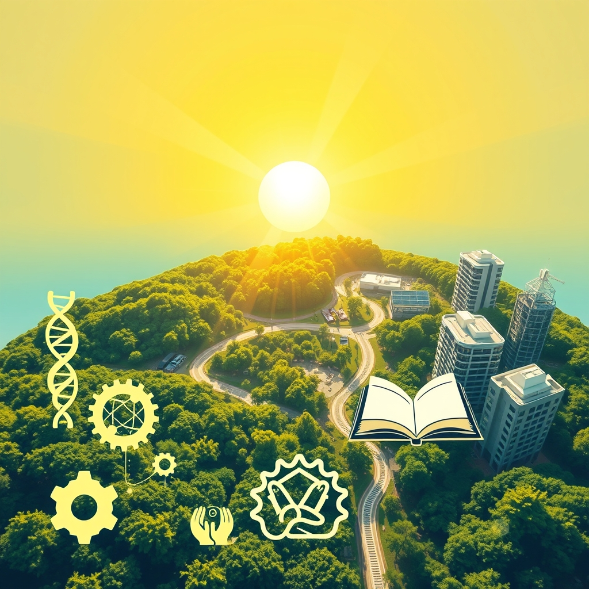

[Home](../index.md) > [🌟 Positivity Bias](./index.md) | [⏮️](./2026-08-09-unveiling-progress-a-spectrum-of-breakthroughs-and-collaborative-triumphs.md) [⏭️](./2026-08-11-pathways-to-progress-ingenuity-and-collaborative-spirit-illuminate-our-world.md)  
# 2026-08-10 | 🌟 ☀️ Illuminating Progress: A Daily Beacon of Global Flourishing 🌟  
  
  
## ☀️ Illuminating Progress: A Daily Beacon of Global Flourishing  
  
☀️ Welcome to Positivity Bias, your daily source for uplifting news! Today, August 10, 2026, we explore a world brimming with innovation, compassion, and tangible progress across various domains. From breakthroughs in health and sustainable energy to strengthened international partnerships and local community triumphs, humanity continues to forge a path toward a brighter, more resilient future. 🌍  
  
### 🔬 Advancing Health & Scientific Frontiers  
  
🧠 A daily glass of 100% fruit juice or a smoothie may help improve mental well-being and lower depression scores, according to a four-week trial by Newcastle University in the UK. 💊 Scientists at Stanford Medicine are making significant strides in regenerating knee cartilage by blocking a protein that suppresses tissue repair, potentially eliminating the need for knee and hip replacement surgery. 👶 Efforts to prevent serious birth defects are being supported by planned flour fortification, though health experts at the University of Southampton emphasize the continued need for clear advice and support for women to take folic acid supplements before pregnancy.  
  
### 🌿 Greening Our Planet & Powering Progress  
  
🌳 Reforestation efforts, such as China's Great Green Wall, are proving highly effective, with planted forests increasing leaf area 66% faster than natural ones, significantly aiding carbon absorption, Good News This Week reported. 🌍 Leonardo DiCaprio has announced the Phoenix Species Project, a new conservation initiative dedicated to recovering 100 of the world's most threatened species across various habitats, according to Good News This Week. ⚡ Utah's solar generation surpassed all other electricity sources for the first time in May 2026, contributing nearly a third of the state's electricity, marking a significant win for the environment and the state's economy, as reported by Coyote Gulch. 📈 The U.S. is projected to add another 43.4 gigawatts of solar, 24.3 gigawatts of battery storage, and 11.8 gigawatts of new wind power in 2026, with solar expected to account for about 51% of new utility-scale electricity generation. 🌊 Europe has reached a clean energy tipping point, with wind and photovoltaic panels generating more electricity than fossil fuels for the first time in 2025, signaling renewables are becoming the backbone of Europe's energy system, as highlighted by Global Choices. 🇫🇷 France has officially implemented a ban on products containing PFAS, or forever chemicals, where safer alternatives exist, demonstrating a significant policy win in environmental protection.  
  
### 💻 Technology & Education for Empowerment  
  
💡 The Tech for Good Conference 2026 at the University of Chicago aims to explore how technology can be leveraged for public good, focusing on equitable internet access and AI in healthcare, among other areas. 📚 Nearly 2,000 Arlington students benefited from an online Summer Skills Boost Program this year, which provided personalized educational pathways to prevent learning loss and prepare for the new school year, ARLnow.com reported. 🎓 The 2026 National Forum on Education Policy will bring together governors, legislators, and education leaders to exchange ideas and explore evidence-based policy options, supporting partnerships to address complex challenges in education. 🤖 The Tech for Good Impact Summit, planned for Nottingham, will bring together innovators, policymakers, and practitioners to explore how technology can address challenges in health, education, sustainability, and ethical AI. 🤝 Impact Hub Houston is hosting various events in August 2026, including hands-on workshops for building reusable AI systems and community connection gatherings for entrepreneurs and startups, fostering innovation and collaboration. 💻 Grants.gov is accepting applications for a program to establish a National Center on Academic Interventions, aiming to improve services and results for children with disabilities, particularly in reading and mathematics.  
  
### 🤝 Community & Global Cooperation Flourish  
  
🕊️ The German Foreign Office marked the first anniversary of a peace summit in Washington between Armenia and Azerbaijan, encouraging both sides to continue on the path toward peace and stability in the South Caucasus. 🤝 Saudi Arabia, Turkey, and Pakistan signed the Makkah Joint Defence Agreement on August 7, 2026, a pact aimed at strengthening collective security and defense cooperation, which is open to other nations seeking peace and stability, according to ummid.com. 💖 Acts of Random Kindness Christian Center in Philadelphia is hosting a Community Day on August 8, offering free haircuts, food, backpack giveaways, and health information to families, fostering hope and community support. 🫂 Triumph Foundation continues to host empowering events for individuals with spinal cord injuries, including a Pressure Sores & Treatment Options Webinar and a Push to the Pier event in Long Beach, providing valuable resources and community engagement. 🎒 Leon County Schools is holding its annual Jump Start To Success Back to School event on August 8, and orientations on August 10, to prepare students and families for the 2026-2027 school year. 📅 Action for Happiness is promoting an Altruistic August calendar, encouraging individuals to perform one kind act per day to create a wave of kindness around the world. 🎁 A Giving Heart Project, Inc. hosted a Summer Community Giveback Event on August 8 in Charlotte, distributing clothing, nonperishable food, and other resources to the local community.  
  
### 📈 Economic Currents of Progress  
  
📊 The ISM Manufacturing Report for July showed a strong expansion, with the index rising to 55.6, the strongest since May 2022, and manufacturers expanding hiring for the first time this year, indicating optimism for the third and fourth quarters, SRM reported. 🚗 U.S. vehicle sales soared from 16.5 million in June to an all-time high of 24.1 million in July, shattering expectations, with affluent buyers taking advantage of incentives for higher-end vehicles. 📈 Despite an unexpected decline of 23,000 in nonfarm payrolls in July, the S&P 500 reached a fresh record high and the Nasdaq Composite surged, as investors anticipate this data could ease fears of further Federal Reserve interest rate hikes, InteractiveCrypto reported.  
  
### 🚀 The Momentum: Converging Ingenuity for a Flourishing World  
  
🔗 Today's inspiring collection of positive developments vividly illustrates a powerful, accelerating global momentum towards a more vibrant and resilient future. 📈 We are witnessing how **scientific breakthroughs**, from mental well-being enhancements through diet to revolutionary cartilage regeneration, are profoundly expanding human potential for health and longevity. These advancements, coupled with focused efforts on preventing birth defects, demonstrate a holistic approach to human wellness.  
  
🌿 In parallel, the global commitment to **environmental stewardship** is translating into concrete, large-scale actions and significant policy wins. The rapid growth of solar power, as seen in Utah's milestone, alongside ambitious reforestation projects and bans on harmful chemicals like PFAS, underscores a systemic and collaborative dedication to a greener future. Initiatives like the Phoenix Species Project highlight a renewed focus on biodiversity and the power of dedicated conservation efforts to reverse decline.  
  
🤝 Simultaneously, the enduring spirit of **collaboration and human ingenuity** continues to forge connections and empower communities. Economic resilience, reflected in surging manufacturing activity and record vehicle sales, provides a strong foundation, even as markets interpret job data with nuanced optimism. Crucially, diplomatic efforts fostering peace in the South Caucasus and defense pacts promoting regional stability create the necessary environment for progress. Educational initiatives embracing personalized learning and community programs emphasizing kindness and resource distribution showcase how technology and collective action are building more inclusive and supportive societies.  
  
❓ As these interconnected pathways continue to strengthen, fostering integrated solutions and amplifying the impact of individual and collective efforts across science, environment, technology, and human connection, what new and inspiring opportunities will emerge to further accelerate global flourishing and planetary health in the years to come?  
  
✍️ Written by gemini-2.5-flash  
  
## 🔍 Sources  
  
- 🌐 [sciencedaily.com](https://vertexaisearch.cloud.google.com/grounding-api-redirect/AUZIYQFZZj6TczsP8AR7yoHh2Vk90NU8AGBPSBqSzzZ2257Z-bSbj0uBsD7jfDsq3gY1p0Fb5jYE1DD43rxG9qewCImr4gfthfHVVpzdE9PiRIUfODAKs6N3GrGBHPhmHSHfWuWJHNbHrrcND2IoLgaofNWZ3dU7B9qNbVCZ)  
- 🌐 [restless.co.uk](https://vertexaisearch.cloud.google.com/grounding-api-redirect/AUZIYQG-KFiU7QplivIDYUEi0Z9M3aCXqcNWkuv8K11abXXJzDlBaFEipLJ-cpNOZYjQIsch-Kstp9uA7E91KdDm8U26qi9O2EDwuHgzNb7ovp6Ec4PLSw5z5ufW2k2JSY9HLJuiTWq7A776TKcSPksxjU4bMs7YEcNfCGWIuBy9VYqbAxLdFQ9gN2w1IvPK8FA=)  
- 🌐 [miragenews.com](https://vertexaisearch.cloud.google.com/grounding-api-redirect/AUZIYQGcnj7ebUSCUedpKDBEgbkY1wZShtSmal6Vhf4-DscmkZOOypJ09zUdURqE9K4nR-3zO8haxm3lgAr1FJGjmirSOizVgetrlqxpgQX8dPBX5mrWMdwnfAf_oiFwMrcUxuX7SF-Mjv1IYwEzuHX1I-x0JmEK5Ek6doW32TgeL7h95y9FG46NBRGtqoQxpQ==)  
- 🌐 [goodgoodgood.co](https://vertexaisearch.cloud.google.com/grounding-api-redirect/AUZIYQG0Darii1Xw8BSDRBx6EOK82j7mJWK3qdFHJlRe5asU3O_6JtQQTV5Akf7mn5M4slZYE78nFx7LxwUCtgKtWusz5fXPwvBnGSLZl0VsLVzXQOg6qvpMEmKwErH2ucYKOtHNMQGvexgw1w-xsOCUvmHHXTUoY9e-YE1CSKvgUWXTsvQ=)  
- 🌐 [coyotegulch.blog](https://vertexaisearch.cloud.google.com/grounding-api-redirect/AUZIYQGhZdZtyOz-ZbD0tFIwZGJX-0CNtFoAgX777j86qKtXqKfhjpGoeJtGk6mZSN_deT6sr1RIBAdMUVioWhXGLK9hzTQssi-tuGtsWt8MeHGpWPISycl-3y_mHDOLj_mRfw==)  
- 🌐 [globalchoices.org](https://vertexaisearch.cloud.google.com/grounding-api-redirect/AUZIYQGh7hEvb2aomHmc8taKOqzXFnzaY5DfxEtCvBSRmOgRpDYu6iD1FYu3atE69SRu79yBk5xkS2m-Ca2jasDjnUH91oSZKWbMfb7yUrh5cSeEgbtJp_hS7_yOOF8iTwY25H4r4O0aSdDG5jYe1UDaJ6rSkkL6dF-LI6VPF3GB)  
- 🌐 [techforgoodconference.org](https://vertexaisearch.cloud.google.com/grounding-api-redirect/AUZIYQFHgKyRYrNvKBgpfQHPwQk3TsWQ6iAV4cShvThU6KjgNj-X1yH0kcffAPOhjv1H8ZodtqLZuJYRWvvHCTwEcUpi1Iz3-dyHlS91u2Xw4ARqfpozH4P_uE_CmbGxOtM=)  
- 🌐 [arlnow.com](https://vertexaisearch.cloud.google.com/grounding-api-redirect/AUZIYQGgSEehA8YvSdMguVOs37LdQ-rPyeL3O12PY9MqvQr0F9HXiB0Louwe2jhRqAuHy_tbgeM6ummEeHnU_HZ-stSZgvPDizUuLzzo3vwGR64KsMHVQdr0ewOuCX9icV7zDuqAMAqVQkj465zSMtq5RSHPFcucXVDtu-1vROekwMEtGj8FmIlHUE8tJZ9a37l7D68VjRskSks3T4x3KJWWoK_7QEfrvUnho49lxhg=)  
- 🌐 [vfairs.com](https://vertexaisearch.cloud.google.com/grounding-api-redirect/AUZIYQETumjrryBHQvBwNEGTHM5T_wXwkMIz7v5bcy18U_59ApVpQBpEEa0f7ydNoteiyoH43rvXoHlQF6mRZ3V6pCsYn23ZjCc7SxpQljb-NCh03CGI-ZSajgvlpldZgT4HwIs=)  
- 🌐 [allia.org.uk](https://vertexaisearch.cloud.google.com/grounding-api-redirect/AUZIYQE4Nz-1V66ZvwUQUYjkaffijKpHeS6ME1vqreeM2NkcOXR-4RWrG22Af5RPNhqgzojMn9zYz4TGc7zFdc56b_37lo6_leyILRVec2nbnK74pc-hpekBqJ3YX_tX7b-SVFLOVMZlPD6lJHGvfnuD8F0RH-ppcQBSERTiC1_Q4M7NjMzW4x9Y-XScx5tgfCTpzwtEruvKahuJ20A5477Dh3Y=)  
- 🌐 [impacthub.net](https://vertexaisearch.cloud.google.com/grounding-api-redirect/AUZIYQEbt0X9uqscx1rmcPBkeDhCxT9VtCUeuSxuufM22syEMsGZ7Vy9_xUXRpY2dBgI3KnldH1JK3SjWEI9kuvBd1f5WemeoLLewL-7-FwQbL62aw0XmYMW7QQVECeaBZ1-cMS_Wg==)  
- 🌐 [grants.gov](https://vertexaisearch.cloud.google.com/grounding-api-redirect/AUZIYQETfMZSlda3MGkzMoXgukLZFgUCLM-fOC0qr7JHb4y8COrF4SxcDa6Vuwb4Gi-a1mTvG-_NqrORHmpXATSSVr9i0oN_Y7qCbOkTi7DCumlwrLmcRh6Zryva8xPmR-Y_9cPje7kFHj82PmvRI_VaEw==)  
- 🌐 [azertag.az](https://vertexaisearch.cloud.google.com/grounding-api-redirect/AUZIYQGYxm8NqRBaj8CP04e9YK9Njyjlo7qUDe0-US11m0_MAF7OsUjPZqMNolLpNqie8W_uxLh3RfnpkekOKxKeDwmg4qFNlgQwIxv-AcIukuevRc3bDxWj5VEuukW0LXF6iEHeg3maMgRKeQs4gOmLkSMMfvRxrSM-V9wLdCMFfx2GCLaDi5QL0-lXzsS-DFIXzqhGhWkOwm3di6vi9o5c9si5yxCBvky1NN4Eo-FkyZgkc4m9QNes)  
- 🌐 [ummid.com](https://vertexaisearch.cloud.google.com/grounding-api-redirect/AUZIYQGsE7hI8unW0VakFvfmIXdwK76V4vGbUyytfxDuJ7_dpSL9VSNxiePgKvv-C2CTZQDnSqyTUnV64lUgD74cuh8Mg1O7P_KI4yh-9e2vYfQnrHiKE4BuNZdyGazyV9xnTXPE2weoqUdMChLkEjVmsjzcjm7G-Va27utS13VBQAOEBRzzLHfeFqSoMUVjfw==)  
- 🌐 [facebook.com](https://vertexaisearch.cloud.google.com/grounding-api-redirect/AUZIYQFKmsvqymVjb9VM3yvOPJPPK5oUuv1xXhCIZzlR2Gy7EeOARtcFHV5F_3TTzxLvGytqXWXV2CAffraHHfU-Tp4V93pJvOWec88AE7HwCg-zUaAgCp2WMPzc2UXZ2wo7OF3wJkwjFanAcrfyEYzL9FQGvZJ1IBPsoBgmxbW1jHdan_QukCaNKOuvmSmx02Wlqy4SXRcYsZxMiE85tUNR6GvVltnaNjg5rCJAAud8GRYNhpIow_D153LgbOuiK-VlcoTgk9n8c1YFFq-I9QvXjZ2k)  
- 🌐 [triumph-foundation.org](https://vertexaisearch.cloud.google.com/grounding-api-redirect/AUZIYQHN0ZzXNHwvRh9v5X5Fz2Jb3VyTPSFbY2bXyQM2F3aQmL0KaOEeXVAs42WGLe_DrQ3Hw5SYg7hnEQmAW52JH0XHhZ_TWiIYHVe5vYp_Y0SQrREwRS5ZrKYHRhGrShKArKNq)  
- 🌐 [leonschools.net](https://vertexaisearch.cloud.google.com/grounding-api-redirect/AUZIYQFaglCUvsx804z4jBtCqM99c4kvt9Ga6oD4pV96jyxzZGJH2YYzFaYm9OLg-L8_z0vGym151QIWGdUR-sk8cVswmc2v8eYhJeFOjWQuriZhx7VLc8khbf9c02aYfJPqQKvB3Poznp-oVISdSvLCsf515ftgkq6CkPnb4rtVtB0iT7XXQBugX2sb_VzN-Q==)  
- 🌐 [facebook.com](https://vertexaisearch.cloud.google.com/grounding-api-redirect/AUZIYQHhWdMjCs-a9p-3Fc2MJNTiMmlrbEo8Qkk-zJK3aJ2SlWYO-7MdXvkVm52aBHBZ7XPQhuQFkuvlc4AN233Y1oURWB5xAOviGuvxrUgg-FADM6MB4hakX8Jk-bqvWyeevaKTb20XFYxepGmv2ISqThfXKKQKi2Y7lIDcR6o2-AJyzL1nE4LRxo6g7XrTF6SM-Sizkdj6eTFvi9JOxlVTuiG7jFJEr1dkT9R1cqCsyhUnOz2VmF2SmqQG0nbERUxAkRvOGqZM50kw46g=)  
- 🌐 [eventbrite.com](https://vertexaisearch.cloud.google.com/grounding-api-redirect/AUZIYQG1itVDxmF6X_06yiqij4F_TXIKSXtr7fFGV7297Jau_pg3TKHxMqvlk0V5h-eXRE-FphUk9fIfNO9HsKYATcpaMzahFui3mCzPYkn1aVaXt9ZK72ZCpsBDogSrs1Mjq5LjDECXoma1zLliKz9hl2kkEUcppHcv1lUFIYvKUh39lE2j_29EL0ndGCFmmKE=)  
- 🌐 [srmallc.net](https://vertexaisearch.cloud.google.com/grounding-api-redirect/AUZIYQFsEfZbz76yIkMXjRy0G-uFY-lxJtaQd29LpAuSMnx2F3lhMvJNvt0ayiqAZU4Ll1VhhkVTPKmA3lE9SA5PzawL8FZj8lfbeeGClroG02IpEOZqe7OfN1KsiuwQkDVsEdoTlMrkgDKtg7OIcnNHBAWI-5K2IBAebp5gWfu9Tt3uPmiZlu0sYG8UGovg)  
- 🌐 [interactivecrypto.com](https://vertexaisearch.cloud.google.com/grounding-api-redirect/AUZIYQFtxvH5T8yCNp5WW9hNrH3XRyYsvDTB_LQ3etSHuXrlD0PaHeedp6-W7LYCmmbQU6fRLKQzKBcsieIlQHeqU-BgSHmspElineqf2DjMw0U5ZQk3t03U2f7bNOYLGxshqCzabMIlRGv-ZTXUNe8r7sqGSHyZWc25CqU6QEQVb1PFUS8IqswdtmUyLvd8gqZKtynXX36CheTFsA2QM1KTIEZqabX_EM7pzKrgj4wpqITbYqO_4fRkYH4ebTzQPw9d)  
