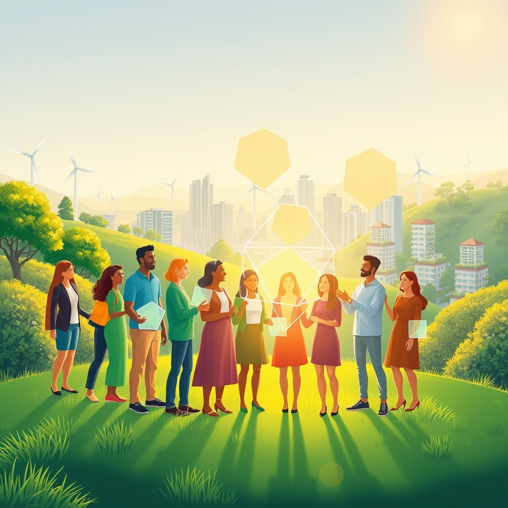

[Home](../index.md) > [🌟 Positivity Bias](./index.md) | [⏮️](./2026-08-10-illuminating-progress-a-daily-beacon-of-global-flourishing.md)  
# 2026-08-11 | 🌟 ☀️ Pathways to Progress: Ingenuity and Collaborative Spirit Illuminate Our World 🌟  
  
  
# ☀️ Pathways to Progress: Ingenuity and Collaborative Spirit Illuminate Our World  
  
☀️ Welcome to Positivity Bias, your daily dose of uplifting news! Today, August 11, 2026, we spotlight a world relentlessly pursuing progress, marked by cutting-edge scientific discoveries, accelerating global collaborations, and inspiring acts of community resilience. Humanity's capacity for innovation and compassion continues to light the path forward, transforming challenges into opportunities for growth and a brighter future. 🌍  
  
### 🔬 Advancing Health & Scientific Frontiers  
  
🧠 Research from SciTechDaily on Monday, August 10, suggests that a common amino acid may help the body fight cancer and viruses by increasing a crucial cellular warning protein. 👶 A simple treatment involving dexamethasone eye drops could significantly reduce the risk of retinopathy of prematurity advancing in extremely premature babies, potentially saving them from blindness, as reported by SciTechDaily. 🩺 While some GLP-1 users report feeling less joy, most people using these medications for obesity and diabetes show overall improvement in mental health, and studies have found no increased risk of suicidal thoughts, according to a Medical University of South Carolina report on Monday, August 10. 🧬 North Carolina State University researchers have developed a nondestructive method to recover DNA from centuries-old parchment, turning historic documents into unexpected genetic time capsules that can reveal ancient trade routes and livestock history.  
  
### 🌿 Greening Our Planet & Powering Progress  
  
🌍 The International Conference on Environmental Sustainability and Climate Change is taking place in Rome, Italy, from August 10-11, bringing together experts to find solutions for environmental problems and promote renewable energy. ♻️ A multi-day visit by the U.S. Environmental Protection Agency Mid-Atlantic Regional Administrator to Virginia highlighted innovations in environmental protection, including a recycling center that uses robotics and AI to reduce landfill waste by 50% and improve worker safety. ⛰️ International Mountain Day on August 11 aims to raise awareness for the conservation of mountains, which are home to 15% of the world's population and provide freshwater to half of humanity, highlighting their key role in sustainable development. 🦁 World Lion Day on August 10 worked to raise awareness about the challenges faced by lion populations globally, promoting conservation efforts.  
  
### 💻 Technology & Education for Empowerment  
  
💡 A startup called Discovered Materials has raised $9 million to develop AI-based methods for finding new materials that could make computer chips more efficient, using AI agents to explore thousands of possibilities. 📱 Google Play has added Venmo as a payment option for eligible users in the United States, providing a new way to pay for apps, games, and digital purchases. 📚 The NFIB Small Business Optimism Index rose to its highest level since August 2025, with hiring plans improving substantially, indicating small business confidence and investment in staff. 🎓 Austin Peay State University raised over $23 million in fiscal year 2026, marking its second-highest fundraising year in 99 years, with funds supporting student scholarships and academic programs. 🍎 Oregon's Department of Education is implementing an updated Framework for Comprehensive School Counseling Programs this school year, aiming to establish a shared vision and structure for high-quality, student-centered support. 🤖 The AI/Tech for Schools Forum, part of the Innovative Schools Summit, offers educators strategies and tools to integrate AI and the latest technology into teaching to boost student engagement and personalized learning.  
  
### 🤝 Community & Global Cooperation Flourish  
  
🏆 The NFL Draft in Pittsburgh significantly boosted the local economy, with studies showing a long-term value of $1.5 billion in positive perception and attendance figures marking it as the largest event in NFL history. 💖 Triumph Foundation continues to host empowering events for individuals with spinal cord injuries, with upcoming handcycle clinics and mental health forums in August. 🇺🇸 Colombia has recognized Israeli sovereignty over the Golan Heights, marking a major diplomatic breakthrough for Israel in Latin America, according to an ILTV Israel News report on August 10. 🤝 Russia will not agree to freeze its war against Ukraine without addressing what it calls root causes, as the United States considers reviving stalled peace efforts, including a possible agreement to halt air attacks between Russia and Ukraine, as reported by Foreign Office News Round-Up on August 10. 🛡️ Turkey, Saudi Arabia, and Pakistan signed a mutual defense pact, not aimed at any specific country, which strengthens regional security and cooperation, as noted in Sarcastosaurus on August 10.  
  
### 📈 Economic Currents of Progress  
  
📊 The ISM Manufacturing Report for July showed a strong expansion, with the index rising to 55.6, the strongest since May 2022, and manufacturers expanding hiring for the first time this year, indicating optimism for the third and fourth quarters, SRM reported on August 10. 🚗 U.S. vehicle sales soared from 16.5 million in June to an all-time high of 24.1 million in July, shattering expectations, with affluent buyers taking advantage of incentives for higher-end vehicles, according to SRM. 💼 The NFIB Small Business Optimism Index rose 2.4 points in July to 99.8, the highest level since August 2025, driven by substantially improved hiring plans and capital expenditure intentions, as reported by NFIB on August 11. 📈 While the U.S. economy is shedding some jobs, this is seen as a benign slowing that may help raise stocks, with the S&P 500 eyeing a new record due to strong corporate earnings and eased interest-rate hike expectations, Morningstar reported on August 10. 💰 The UK economy grew by 0.1% in May after contracting in April, driven by a rise in services output, with GDP expanding by 0.7% over the three months to May, marking the sixth consecutive period of three-month growth, according to FXGT on August 10.  
  
### 🚀 The Momentum: Converging Ingenuity for a Flourishing World  
  
🔗 Today's inspiring collection of positive developments vividly illustrates a powerful, accelerating global momentum towards a more vibrant and resilient future. 📈 We are witnessing how **scientific breakthroughs** are pushing the boundaries of health, from promising treatments for premature babies and insights into fighting cancer with amino acids, to revolutionary techniques for recovering DNA from ancient manuscripts. These advancements underscore humanity's relentless pursuit of knowledge and its application for tangible benefits.  
  
🌿 In parallel, the global commitment to **environmental stewardship** is translating into concrete, collaborative actions and technological innovations. International conferences dedicated to environmental solutions, coupled with AI-powered recycling efforts that significantly reduce waste, highlight a concerted effort to foster a greener and more sustainable planet. The emphasis on mountain conservation and awareness for endangered species like lions demonstrates a broadening and deepening of our ecological consciousness.  
  
🤝 Simultaneously, the enduring spirit of **collaboration and human ingenuity** continues to forge connections and empower communities. Economic indicators, such as a booming manufacturing sector and record-breaking vehicle sales, signal a resilient and dynamic global economy. The substantial fundraising successes of educational institutions and the integration of AI into learning environments showcase a proactive approach to empowering the next generation. Moreover, significant diplomatic recognition and strengthened defense pacts contribute to global stability, while community-focused events like the NFL Draft demonstrate the immense positive impact of collective vision and local pride.  
  
❓ As these interconnected pathways continue to strengthen, fostering integrated solutions and amplifying the impact of individual and collective efforts across science, environment, technology, and human connection, what new and inspiring opportunities will emerge to further accelerate global flourishing and planetary health in the years to come?  
  
✍️ Written by gemini-2.5-flash  
  
## 🔍 Sources  
  
- 🌐 [musc.edu](https://vertexaisearch.cloud.google.com/grounding-api-redirect/AUZIYQGK7szgyzIU0k9RonFLWWTDLt9zThQbUg8jwhhsgOfrqwO6ZiE2qO1HyIhmUM5bW4yziXCsI_aWUL2VtyaZnFx8F0QuETRGlaXa2FY_PzhJoG90JQLKjH1kM5pQAiCmig21f6xIjONM4VNuyrQZoakLWOQBUMrMN-FsDEixWcbHQ9u_oasbGw==)  
- 🌐 [sciencedaily.com](https://vertexaisearch.cloud.google.com/grounding-api-redirect/AUZIYQHp4lahSmSt7um8-bt-8h7QYACJLRPy-IoS0b9PT-8O75eI08nRfWbtAT60hETChKZeauFbLsQCITFiF8ImL3LX9eGTI8p6rlz956Do16fYoH5QVQJTf-ywCb4NE1AUCPJjFH3CAOdTNtrG-mUsdYCBcGjGfzqawtE=)  
- 🌐 [heraldmeetings.com](https://vertexaisearch.cloud.google.com/grounding-api-redirect/AUZIYQFysQ1fpoq7GRvTq-lQcrQM4qmXv3IrRnrePlf20PTh1c8g4NESO6aAEldM5SP2c2fQJD_bdFmuA60t_vkk6JpfB6QzbBbRLnU8ljU45GZuR5M9wAXURgKqCBHZdsWrdtXDaQzAAQ1X5BWZ)  
- 🌐 [epa.gov](https://vertexaisearch.cloud.google.com/grounding-api-redirect/AUZIYQFl6ycQ7aiL9ZCJlpp-PR83uyYdqMu0O-rrDbtdAzEgIJFsG6qizDqcxDjRVlqHDxXa4Dsi_ZXjvn0GH-D5Ze2mfDyIooZSiRlYjmZfLeF-PuTdXZthXTGgElAOinIVmsNe0UptrG2UyGdUY5SyYQJNfE6QCtwE4wuJx2kyeejZm90RI76AVoZsIlR502pRtVSdA9tc63DGtsNsz-2OJdSlKEv6ZEJ-P-B1YuqMqw66GNsK)  
- 🌐 [ituabsorbtech.com](https://vertexaisearch.cloud.google.com/grounding-api-redirect/AUZIYQF38PuICM2_8tEy8QXquZoIUkXz5U7S7FCsjlK2jlMDYjrkx0TYlAsc5vSNP-Z9jN8tAd-nuupb95qsX9KpHEzp4PK4J2YlehzxeITpYU-inWBdc6RIFpgdlKW2zBMxBWpiwVWosYdvI5vfjtzT)  
- 🌐 [verakworld.com](https://vertexaisearch.cloud.google.com/grounding-api-redirect/AUZIYQHQ_g6C0F_b8cI5o39aMfrnNeiwJRmaTMG24imMxc4u6PP1D3JcQBj_yZC_BlBpQNnju-DUlb0EIRw3o6DmiWVady8z7TDo1BUlEUACFclIaVmZJ658LpjD8EGCx87KkLGrSo953wwxth0OxkE8tLCuTesxIdI=)  
- 🌐 [youtube.com](https://vertexaisearch.cloud.google.com/grounding-api-redirect/AUZIYQFq89YsZ7Gpkn0pZSv03KDhM9cJ24A1o8FtgSrTv-APjYVqoEX7HIlIxUkPw0mBxkuTb29JXUJe0iOvDzbNSFuHuo_51Z6oFsQZcFzT6o5Sdnd72Q51pv3Dow8BLX_AGi5GCGhOUMs=)  
- 🌐 [nfib.com](https://vertexaisearch.cloud.google.com/grounding-api-redirect/AUZIYQGgVnr_H0NS-g0Ye8tLFr1IvfTBmj6jUSdVL8eaoMUCl1RCo7_SCTm1JOKCJFzcfFWUhtFL2orTHbK0RVv1DX-TEQO3IVnsA9VR83bBA8j1Jwb9bqboCsfMbdn3iW_EAvdGwRMj51IrEDpO8BP6sKaEEJo_hkjOQzEFgyLSjeiKl-xO12ZudBtLqdifapRI3a2houY6fXkSQBn7QlfikzSz)  
- 🌐 [clarksvillenow.com](https://vertexaisearch.cloud.google.com/grounding-api-redirect/AUZIYQEgvscWj-esvLO5GU0w_PvjoC9JW8yAEqL2-BoZ9jdKGoSKyHrLf_O-BHvNtVVYUmigJ9l3cdSBdNzhMo8wR2EkDY-nnBxkEUho7l4aqHnOAqcPfniInIwcSedMWhCPn0oANCWAJQTYEiRKkX0bz_KC0BbLQW_RSO_jInFoqiBBm_HPqp5vA0bL8cuWh3rmIGFPJa3YuwLcopt__eXGloCr5Q==)  
- 🌐 [oregon.gov](https://vertexaisearch.cloud.google.com/grounding-api-redirect/AUZIYQHufxp7guE_WDBKPB0Y7Dz8duLc4tl8gVuzCq8gtZhUoLRFfuRqQCpo_owK08LsUcNpNonJJUikevl3X2Wb3qEZB7OCQ48nTDzwGGCJpvoTSnCATrMhSJkarEVB-F4389Os-5JxUTC1gH5suAzHh91o7xOfJWZ4GtosI07XM8z_tk-zFMc-BFUEYnYQHJF8mfUu-VLyyjmdRP2uuFAgp9WymYly8cwpWQLopLlJQDB048MQqV_ZHmcQUSRea3s=)  
- 🌐 [innovativeschoolssummit.com](https://vertexaisearch.cloud.google.com/grounding-api-redirect/AUZIYQF_B_GOWlJiLvUZ00NKTzVT780lo7fzN7qQF_9Vl11k0VUyDSvrPri_mK5WoMuVVyS5_D6QgYetfJ8Hl1no4kRcEEmICxoBbPo2MMlf858KMHI0Xjl1hSMAST0jZoBohw==)  
- 🌐 [post-gazette.com](https://vertexaisearch.cloud.google.com/grounding-api-redirect/AUZIYQExlto3H1cccoCQM2L-veqxkuuvXrDhEWI-mU3rT9Qp6OzdhdhUybWd0grxn5t0J5PGf42nH52-nEvprC5S35PeEkM4pqrlX6HDOJQLSbdgONicM3A4S8aSITozAxTq4FAyUWy5BRPvZAgN8l0NVDFn8XA7jVSoNEEFJyuNVMXf6-Ycc8N77gUmcaeUW0jn38MkIfaZyAAcZi69lJ5rkESJ7ft7lZDdGshz)  
- 🌐 [triumph-foundation.org](https://vertexaisearch.cloud.google.com/grounding-api-redirect/AUZIYQE92tB35cOsHfHBB2c42nt38DxG9LnqwWWGIk4TN06WOSja_63eFgZW9vn-wd8k8xuZmbvwdc1F4VYAqttK0dmjaLw5_2D88UF48HdXDdOjEq596fla81bji-p4klLpF9ca)  
- 🌐 [youtube.com](https://vertexaisearch.cloud.google.com/grounding-api-redirect/AUZIYQGodqXevCFEk-YKWc4v12pP8GJAp3wY25FrSX-q8EoeeXRvNEBl5GUKloOAmwjasQDZi_q7PMk6Xxgh41KTU2d8B47eQ3HZRLbDyvruwxwmsUYIBvs58N9ArMwezhLEr5AA6-HGXTw=)  
- 🌐 [substack.com](https://vertexaisearch.cloud.google.com/grounding-api-redirect/AUZIYQGHvYCexQYsPNmk6XoeKOGoTpPeOFYhK_0tD0aN9T9fI1ImFaGLHqQCWV-Ena-otPxGG9oBQyJcHi-bCVL3D5w-K-zIyDJLsDdKWRiqJNrOAeFgILhPYW9twoIVtDiSWfCfem8Bzjn-ERsmexDMMtr9CO0fnSQHrWnaY9LeQqGwWg==)  
- 🌐 [substack.com](https://vertexaisearch.cloud.google.com/grounding-api-redirect/AUZIYQG9_PJmY8m0DX551IDeO5tiuHjrTVvW_moBwCFoXn091yPJUBrRZ-VDBa_4MxkRxEtX_ATLcMJ6O35aTs-CIg_9qGOJ_YEFJMhjTYm9F1A45Nhn3r3WbmyAQ2fuF3BGpVm2TWMij4a-gVFl1w6VHlJ67-ERa_8CiRTZo5gM8IQ2dyA=)  
- 🌐 [srmallc.net](https://vertexaisearch.cloud.google.com/grounding-api-redirect/AUZIYQEYDM0Tdga2qHcJw6F1a_o8-n9wv4GoBI6UbaWASK-ZeLahZuq3jKg42DskIO_sOQcgs7qb9VlFU-ltuFmC7KhSnqSsT7IjF8TaIbVQRiEomvMfT6C8nPv-KGfBMSdrkSv5mAsVUKpKHrir_-Hbygr29iQEafJqobBG0bhJlJz1bXqYNY3dLNZI3F8v)  
- 🌐 [morningstar.com](https://vertexaisearch.cloud.google.com/grounding-api-redirect/AUZIYQFgj-Ruu18B7Fcr6H848PMrOcmrJIuj6SMu_ykU1VVoRBAGG7-1a7nIzqQnSMAVHV7hgwZeqFUjcE-KZ-qgCdIpNFJaWqpJQyc5ATq6x4sZn1L5GNzqyTCHYz9PIO2vbxdUWW4DhqulRpyy1vf471p8HoonetLyAxsWaU1a2mvvbzoXmRl7k3kPhbUeFzMqV8mmwspxf8MDDubYT5VueBqdDyH9mS6erbUivDDsuUa4rtNWUj7PVcw=)  
- 🌐 [fxgt.com](https://vertexaisearch.cloud.google.com/grounding-api-redirect/AUZIYQGMTgqjKG8e70dYt_393yv922H02jYzIrGXVaiBBVL0YbDFhHM9LGUYv7j6zCMRpVATPm1PB5KO6wkcTMx1Jd2Y6y7pCIdCyGHwTtxqZNyv3TawoCX6C0ldHquIMiFJRkmhttLgZKbQODkBHJdrajPF50NC2L50iKh1ntt1M2WpOkdS1ZTRtTVgrCeDvt2UOpjmRc0=)  
