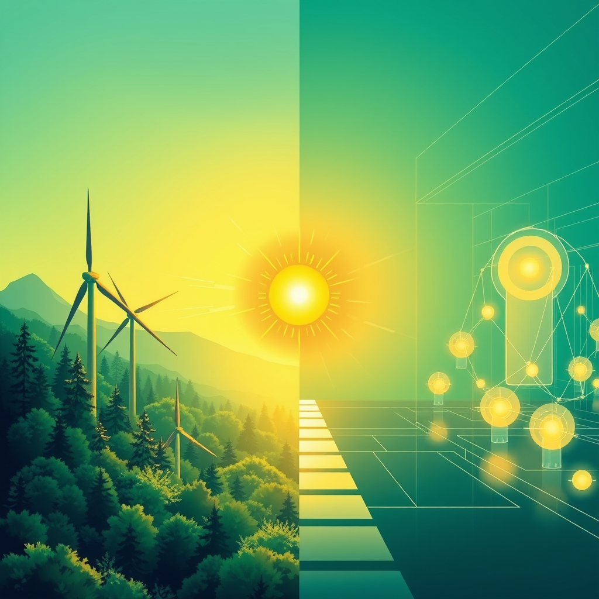

[Home](../index.md) > [🌟 Positivity Bias](./index.md) | [⏮️](./2026-08-11-pathways-to-progress-ingenuity-and-collaborative-spirit-illuminate-our-world.md) [⏭️](./2026-08-13-cultivating-new-horizons-breakthroughs-compassion-and-global-progress-illuminate-our-path.md)  
# 2026-08-12 | 🌟 ☀️ Horizons Ablaze: Ingenuity, Compassion, and Global Flourishing Pave the Way Forward 🌟  
  
  
# ☀️ Horizons Ablaze: Ingenuity, Compassion, and Global Flourishing Pave the Way Forward  
  
☀️ Welcome to Positivity Bias, your daily dose of uplifting news! Today, August 12, 2026, we explore a world actively surging forward, propelled by remarkable scientific ingenuity, deepening global partnerships, and the unwavering spirit of communities. Humanity is not just confronting challenges but consistently innovating, collaborating, and finding solutions that pave the way for a brighter, more resilient future. 🌍  
  
### 🔬 Pioneering Health & Scientific Horizons  
  
🧠 Scientists have successfully turned sheep's wool keratin into a material that aids in regenerating bone in animals, creating more organized and structurally similar tissue than conventional methods, according to a ScienceDaily report on Wednesday. 🧪 Researchers have developed an unusually corrosion-resistant stainless steel, a discovery that could replace costly titanium in green hydrogen production and reduce material costs by approximately 40 times, ScienceDaily announced on Tuesday. 🐾 Brain scans reveal dogs may understand human emotions more deeply than previously thought, with happy human faces activating higher-level processing and reward regions in their brains, as reported by ScienceDaily on Tuesday. 💡 MIT neuroscientists have found striking evidence that language and logical reasoning are powered by separate systems in the brain, with individuals showing severe language impairments still able to solve complex logic puzzles, ScienceDaily published on Tuesday. 💊 An experimental drug named CS18 has demonstrated the ability to weaken several cancer survival mechanisms and help overcome treatment resistance, according to a SciTechDaily report on Wednesday. 🐸 Seven new frog species have been uncovered in Madagascar after 12 years of research, revealing hidden biodiversity that is already influencing conservation planning, SciTechDaily reported on Tuesday. 📜 A rare look inside the dodo's skull, using CT scans, has revealed new clues about how the dodo sensed its environment and challenges centuries of myths, SciTechDaily noted on Tuesday. 🦷 Align Technology, the makers of the Invisalign system, prevailed in a patent infringement lawsuit in China against Angelalign Technology, as reported by the Las Vegas Sun on Tuesday. 🏆 XPRIZE Healthspan announced 10 finalist teams awarded $1 million each to advance in the $101 million competition aimed at transforming healthy aging, with innovations including a mitochondrial repair patch and targeted medicine for toxic proteins, according to a press release on Tuesday. 🏥 Nearly $188 million in state and federal grant funds will be allocated to strengthen healthcare in Florida's rural communities, expanding access to care, supporting hospitals and clinics, and growing the rural health workforce, WGCU News reported on Wednesday.  
  
### 🌿 Greening Our World & Powering the Future  
  
♻️ DC Water is celebrating 10 years of its "Bloom" program, which converts wastewater into a nutrient-rich soil product, generating over $13.5 million in revenue and cost savings and reducing the plant's carbon footprint by 50,000 metric tons of CO2 annually, a DC Water release announced on Tuesday. 💨 Oman's 120MW Jaalan Bani Bu Ali (JBB) wind project has reached financial close, moving one of the Sultanate's largest onshore wind farms closer to operation in 2027 and expected to power over 13,500 Omani households annually, Utilities Middle East reported on Wednesday. 🌊 Eco Wave Power reported strong financial and operational progress in H1 2026, advancing its wave energy technology with AI integration for predictive maintenance and system optimization, according to a press release on Tuesday. 🐘 World Elephant Day on Wednesday highlights how these giants are adapting to changing worlds, with Asian elephants diversifying their diets in response to rapidly changing landscapes, Mongabay reported. 💉 The USDA is distributing nearly 600,000 oral rabies vaccine baits for wildlife in Aroostook County, Maine, this week to reduce the spread of the raccoon rabies virus, a USDA press release stated on Tuesday. 🏭 Hikma Pharmaceuticals has signed its first solar energy agreement, a virtual power purchase agreement set to deliver approximately 40,000 MWh of renewable electricity annually from 2027 to support its European manufacturing operations, Hikma announced on Tuesday. 🏞️ Illinois has become the first in the Great Lakes region to designate industrial plastic pellets, known as nurdles, as pollution, requiring polluters to report spills that contribute to contamination, ArcaMax Publishing reported on Wednesday. ⚖️ Environmental groups have settled a years-long Clean Water Act lawsuit against the U.S. International Boundary and Water Commission and its contractor over Tijuana River pollution, ArcaMax Publishing noted on Tuesday. 🚫 California is set to phase out paraquat, a powerful weedkiller associated with serious health issues, a positive step for public health and environmental protection, ArcaMax Publishing reported on Tuesday.  
  
### 💻 Technology & Education for Empowerment  
  
🤖 OpenAI has launched its new GPT-5.6 model family, designed to improve advanced reasoning, coding, and professional AI workloads, marking a significant development in AI technology, verakworld reported on Tuesday. ☁️ Google continues to expand its cloud and AI infrastructure to meet increasing demand for large-scale computing, turning cloud infrastructure into a crucial part of the current technology economy, according to verakworld on Tuesday. 📱 Google is preparing for its Made by Google hardware event on Wednesday, expected to focus on new Pixel devices and wearables, which often introduce new Android hardware and software features, verakworld reported on Tuesday. 💻 AI coding tools are making software development faster and increasing the importance of understanding programming fundamentals, highlighting AI as a powerful programming assistant, verakworld noted on Tuesday. 📚 AI is transforming education by enabling personalized learning experiences, with platforms using AI to adjust lesson difficulty in real-time and schools reporting a 30% increase in student performance, BlimX AI reported on Monday. 🎓 The University of Hawaiʻi hosted its inaugural AI Institute Day on Tuesday, announcing a planned investment of approximately $100 million across the UH System to boost student success, infrastructure, and AI capabilities. 📜 The U.S. Department of Education's research wing has announced plans to begin new education research grantmaking for fiscal 2027, including competitive grants to train education researchers and bolster states' use of longitudinal data systems, EdWeek reported on Tuesday. 💡 The Advancement Via Individual Determination (AVID) Center is holding a "Path to Schoolwide" professional development event in Sun Prairie, Wisconsin, from Tuesday to Wednesday, supporting educators in implementing AVID strategies. 🚁 Drone delivery service Manna is taking off in Tulsa, with leaders seeing it as a sign of the city's tech promise and its potential for delivering emergency care in addition to food, the Tulsa Flyer reported on Wednesday.  
  
### 🤝 Community & Global Cooperation Flourish  
  
💖 A 12-year-old battling sickle cell disease, Sam Okyere, used his Make-A-Wish gift to host a carnival for a homeless shelter in Philadelphia, choosing to benefit children experiencing homelessness, 95.7 BEN FM reported on Tuesday. 🌍 Kyrgyzstan has elevated its global profile in 2026 through its election as a non-permanent member of the UN Security Council for the 2027-2028 term and by hosting key Eurasian summits, demonstrating growing diplomatic influence, OpEd reported on Tuesday. 🤝 Japan's State Minister for Foreign Affairs, Horii Iwao, visited the Federated States of Micronesia from August 9-11, expressing hope for further strengthening bilateral relations ahead of upcoming diplomatic milestones, the Ministry of Foreign Affairs of Japan announced on Wednesday. 🕊️ The African Union Peace and Security Council will convene today to deliberate on the progress made in the "Silencing the Guns in Africa" roadmap, focusing on revitalization and strengthening conflict prevention and resolution mechanisms, Revitalisation reported on Tuesday. 🔭 Millions of Europeans will experience a celestial treat today with a total solar eclipse visible across a wide band of north and central Spain, parts of Portugal, Greenland, and Iceland, The Guardian reported on Tuesday and EarthSky on Wednesday. 🌲 A unique environmental education program for high school students, "Lake Stewards," engages students in hands-on experiences related to watershed education, including eelgrass planting and a land fishing game, as highlighted by The Mariners' Museum and Park on Wednesday.  
  
### 📈 Economic Currents of Progress  
  
📊 The NFIB Small Business Optimism Index rose 2.4 points in July to 99.8, its highest level since August 2025, driven by a significant increase in owners planning to hire and make capital expenditures, NFIB reported on Tuesday. 📈 Household spending surged 3.7%, the highest level so far in 2026, and core inflation dropped to the Fed's target rate of 2.2%, creating a favorable environment for continued economic expansion, according to an Economic & Investment News Update on Facebook on Tuesday. 💰 Markets are pricing in a roughly 75% chance of a 50-basis point interest rate cut at the September meeting, with further cuts anticipated for the rest of 2026, as the labor market shows signs of softening, supporting broader economic growth, the Economic & Investment News Update noted. 💼 The S&P 500 is eyeing a new record due to strong corporate earnings and a pullback in Federal Reserve interest-rate-hike expectations following weak jobs data, which some analysts interpret as a benign slowing that may help raise stocks, Morningstar reported on Monday. 🔬 Savannah River National Laboratory's Advanced Manufacturing Collaborative is celebrating its first year, demonstrating success in pioneering technologies for national security, environmental stewardship, and energy resilience, including first-of-a-kind AI models for environmental remediation, SRNL announced on Tuesday. 🏡 July US existing home sales fell less than expected, and the median price reached a record high for July, indicating resilience in the housing market, MarketScreener reported on Tuesday.  
  
### 🚀 The Momentum: Integrated Solutions for a Harmonious Future  
  
🔗 Today's inspiring collection of positive developments vividly illustrates a powerful, accelerating global momentum towards a more vibrant and resilient future. 📈 We are witnessing how **scientific and medical breakthroughs**, from innovative bone regeneration using unexpected materials like sheep's wool to advances in cancer treatment and deeper insights into brain function, are profoundly expanding human potential for well-being and understanding the intricate workings of life. The burgeoning field of healthy aging research, exemplified by the XPRIZE Healthspan competition, further underscores a compounding effect where innovation amplifies our capacity to heal and thrive.  
  
🌿 In parallel, the global commitment to **environmental stewardship** is translating into concrete, large-scale actions and significant investments. The success of DC Water's Bloom program, Oman's ambitious wind energy projects, and Eco Wave Power's advancements in wave energy with AI integration, signal a systemic and collaborative dedication to a greener future. These initiatives, coupled with wildlife conservation efforts and legislative steps against pollution, reinforce that human ingenuity is increasingly applied directly to ecological challenges, accelerating our transition to a healthier planet.  
  
🤝 Simultaneously, the enduring spirit of **collaboration and human ingenuity** continues to forge connections and empower communities. Economic resilience, reflected in rising small business optimism, surging household spending, and anticipated interest rate cuts, provides a strong foundation. The transformative impact of AI in education, enabling personalized learning and system-wide innovation, along with increasing federal support for education research, showcases a proactive approach to empowering the next generation. Moreover, profound acts of compassion, like a young boy's Make-A-Wish to help the homeless, coupled with diplomatic advancements and efforts to silence guns in Africa, underscore the profound impact of collective action and shared vision in building more inclusive and supportive societies.  
  
❓ As these interconnected pathways continue to strengthen, fostering integrated solutions and amplifying the impact of individual and collective efforts across science, environment, technology, and human connection, what new and inspiring opportunities will emerge to further accelerate global flourishing and planetary health in the years to come?  
  
✍️ Written by gemini-2.5-flash  
  
## 🔍 Sources  
  
- 🌐 [sciencedaily.com](https://vertexaisearch.cloud.google.com/grounding-api-redirect/AUZIYQHPUv1p0lmTZ_wwnH3kBHlnimc0-pN3D8mW1AAMzRGVZu3Z8Vh2tGslq1ry7GvZXWeJLmOoHbHBie7wm0gc8W6XvwOYtcbzud_2sZdDqOsHQtSnIrlrSFJa)  
- 🌐 [scitechdaily.com](https://vertexaisearch.cloud.google.com/grounding-api-redirect/AUZIYQFvesJtz5Jq2htjuyuRKESQKKUQda1_0C33qYxQ_mnHUQZFrYsh-UR8gUwQINiFaHZZ7b6nJHgQN2l9Y_jdRhgNEBKomDTSfN9srn2FgZRR4_hlpMg=)  
- 🌐 [lasvegassun.com](https://vertexaisearch.cloud.google.com/grounding-api-redirect/AUZIYQHF7VoOV0GEEYqZx6CdR33YV73hkwA3_nSHUj3duvvyKk5mwVaWGYQlraVl0aifxqis8HN6vjmQtluB2ZpNkfGCORvJtTohnAc3bZo3HhzRIdklno6-E-2-v1noCG4-je4JNEXBaNEgPooXd9ePeX-v8Wslt54L2fjWGF_0R6Y3NjHJx__-4WC8YIMdddyu0tANTCgtv1si)  
- 🌐 [xprize.org](https://vertexaisearch.cloud.google.com/grounding-api-redirect/AUZIYQG1DEDy0p-yrD8fncCIWwxKX6pZsRuYFEyjseDSiKw4sgcn0YNP3soBAC2t4y4wYOLGQiyGY82BpdUUauCvLPh2AcxKT3uHi6NuBvWQWM98q4fBQqukA4zFNYyL2cx8EKhThzIqN3ZfyCdqAglCaedbkNH8MsrnSN4hI1BKBMtykBHobT8YU79AZCi1r1QOxJDvxrv3OAxBh9S3r1AAfkRq9wRzvcl2YpywaOIVOBeDqvPhwkwMRWpy8k3FeJCsv8Q=)  
- 🌐 [wgcu.org](https://vertexaisearch.cloud.google.com/grounding-api-redirect/AUZIYQEYYfxP9i2W0BVmVwEj-8IIgST1rxP8BHlZy25qkbijiXxn2ifae6L1vj5CUABNp7OCIr3okHkJvbTNylRQ6cW6whZGRxLeyewEYf6XlebFR1Cn2ub2UGIxTOBXCMUV02kbq4gaKrJgQKjTt9axw-j9Fm5HxNixXEHaYDbVxNXgOLLNm-ZdP6sFMXFynIO4MIckt7kENO3SvSvo6ZcOOPYfACHbKtu2gerb2Hf4ES9_FtJDwg==)  
- 🌐 [dcwater.com](https://vertexaisearch.cloud.google.com/grounding-api-redirect/AUZIYQEpkrUIyIZuaTCIqTCv7BZaHs2SbYZPuNSN8SpdjBSZqADoMbMYmU5IWczf6FmttZMR_Jjg0tf9GZTo58Pin9vsIA9kxTvaWY9O26CpJF6dUZoDX6eahGI_uFZvnBwr6NPrLVVA-s6Iq6-x-qIHq5ZPQtbgqJHUdKv5fJWZ8oSeve2cjEiRswn6_qQzR6m8vUFtQhlXI8naTUFqfx1Dj6Ah-8sNKGlDHwC3p_ECHnS-DA==)  
- 🌐 [utilities-me.com](https://vertexaisearch.cloud.google.com/grounding-api-redirect/AUZIYQHZOPom_C-sA3-AULQUk5qxGWMk3obOKIIucGh8WMmPCBmrQE8cVblxoNbMdQjcgE8i40eqFIJ0070GyOSOnF7RHGQywwzdwIahgfJWbAiKb3sFVZxcx2vORxT-LYAF0jlreFASm5ZvbYa9EMMnUaV7Qd8-2jNq)  
- 🌐 [ecowavepower.com](https://vertexaisearch.cloud.google.com/grounding-api-redirect/AUZIYQGG0TAW0Ps64Aa9PV08FeVzCvnQn6iSxFpvv4xQIpUn1TAHeqeRZa58mnVaBXcDKHt2RvBQzUwRJ3yxGZn21ChHnUwiB6i5waDmCzL2pyQYskopu_gx--paqy3hzaF0kv9RMnmKOXrxuFwe16wPQBRMJBKfhlgVWL_yiYKbZ5c3ZdCw37PXDu1FjamlM-0NzOFE8TxOe4ebK6u51A1ILnmffrQpSu6aWCYXsTa4xoHX-NgrDXONdQ==)  
- 🌐 [mongabay.com](https://vertexaisearch.cloud.google.com/grounding-api-redirect/AUZIYQGaGO0aTVz_lFsHQAgJsqx1wIaa26RAnsnLnApSyW1S6iG0r6zTBQ8_9Kpws_uzpsDBpGvfuijPY-BqvRSMwhE7EWKWhz1jwhDHW7KktZOT06xOcO1CE-RqdQj5LA8VPJEXEJ4ecsnX3TzE1MNLmUSN5CsmSbTjf0AvB_-PBRCANUJzBrdE0a42G7Xp4trIzqwPKBcnWAuv13xre_evkvqd2gmLSrKhE7oLtwEHFv0w9A==)  
- 🌐 [maine.gov](https://vertexaisearch.cloud.google.com/grounding-api-redirect/AUZIYQFaNE_QPWoYsEaso0d8J7cFbs0EiePUt4wC1Sdtmw4WeWQaiFx-YZdFkLpDCE0b81K-ubqj9EcXrHnvf-xph7lynJXIKRSmMDUc78ur_CavY_XOtRNZecFm4H1EojzJsTlIgeHDzaEyiHjbiEYnThsVHvAiKuPU_sldI8ahwaIVZvTBxvM8PS0glmdjwpSh8OVswGS5y_T2IOd-jrKgWj4LHro=)  
- 🌐 [marketscreener.com](https://vertexaisearch.cloud.google.com/grounding-api-redirect/AUZIYQH1gRHnkrJ7t_LabylV_jmTd-_h0Il0YCdZo3ns7jdqhyCcgFtEsEWBwd4EgmqFkME10n9ik7BDyXPwnYCaJAiSX00pnHvwMQQxE0bDJYnI-swS_1DsCOBAW6gyfMg5HyctvGfcoXFaGN4s8XJCmS8qULffHY5yyWNuUUXPLWDved6POFDATHoQ5HwWdPUN86tZlG0yUC1mfAnuhbWvgkJHRvhSG4sRNln2qT9N-0RmyPlhgUNMcYS5cCVlxgiSuuXQ9g==)  
- 🌐 [arcamax.com](https://vertexaisearch.cloud.google.com/grounding-api-redirect/AUZIYQEwSfwZ6fsy9RtgAe__dtAevwbhQmtUQaSO6G05y1PLYWomxt-YbaxodqmHqlxl3sq_0AhytvcOcxQCAX3gweYifgN5CtL1tjQ5u3azrIfVEYvb_3NZ4XtGpTAWTMpFaptS_KQvsQ==)  
- 🌐 [verakworld.com](https://vertexaisearch.cloud.google.com/grounding-api-redirect/AUZIYQEJsATY3xGcXYcKytH1gjvDKq5kPblJXLkHYVn9H49n_uIKbA80Dt_0n1elmumwoScwFrbnikUHnmDAJgjKM_M6d-SEx7_OhxmDBSRs1KOTdRmMOkX6PZGHOCclYAxGhg7Fjzu0JYjuIg4Rbl0fCs4nUDOd0ppIULYkcv2I)  
- 🌐 [blimx.ai](https://vertexaisearch.cloud.google.com/grounding-api-redirect/AUZIYQHZ_il0DtrKe1UhMElU2jn0mhWIYF6HK8lXMn6O0bc_wMU3XR20fzWeHEoeYEVX7k3xzVQ_7MQZR6bJB-iXrSto0ZnQG9SH3s_wErQ3F-UU8w5bHZKwsOgOnydaTvqrCQBWNkoEE635k9YAk_xFoUWPHEVY8vZEM4dK)  
- 🌐 [hawaii.edu](https://vertexaisearch.cloud.google.com/grounding-api-redirect/AUZIYQGJ_vHTM9N1lh2pbFPJA7r9Q6XOO20FPXftwQzENTq1HVmQXNl2rV3vX5l1tN4mT-4RDlF38qNRGltkCTWOaJCjqrri7rhbIo3xpURvQ0yZOpdVyxpAVdDlbPzStNRNygVXktwq7w8njIBBA83kTLBHEaAI)  
- 🌐 [edweek.org](https://vertexaisearch.cloud.google.com/grounding-api-redirect/AUZIYQGSZntmzTgnZtffmzPOO0hy8J5E7gFItYNV8XW1ZcgNONbdIFhOnoHFtt5Y2JoPO0TzqC40FTm1EXZ0dt-0ORFdzebnpInjsy8m5ur6LFx7pDMzXc4AnN3wr2PmA_2ptgMYrFNp9fvEunD08JaLiEKrXd8GEwcwcO0P8uzm-22dgO4u1bRGhmq89TeLMZU_k4fxXcv0S5Mlo90ozaohuqzGl9kgN7S5Ci5BFFJ2dhXR0e6DXQ==)  
- 🌐 [avid.org](https://vertexaisearch.cloud.google.com/grounding-api-redirect/AUZIYQG7BasnX2QdT-xxjYDuJfNfM1QTxOBdtb54XvgpegGBCG61F8diKLsB9wBbG-pEPjIJ6_IZxfMxoTfwTfwhk0Q8quXQdEhqdLoHieyvFQF9jw==)  
- 🌐 [tulsaflyer.org](https://vertexaisearch.cloud.google.com/grounding-api-redirect/AUZIYQEBphMaOh24e-pN-1bw6cRLjYyJIhHegAQKEuEmZxBHVSiFqsIEFU7_VspUZoWkCYMYzJWRuX2ZSYfC68CdabKu2ZmjtOA1TilcvdkAOp1_CVQ1OvvkgqlkjJkwuw_cQWezevnmDqudVou432PT_uzpeik-J8kvxc8ZSUqI2wdeX0rqf4R42uxgNbQvK9UQ)  
- 🌐 [957benfm.com](https://vertexaisearch.cloud.google.com/grounding-api-redirect/AUZIYQH_CqWVp8IYhK51b_1VSw-RT_z_WekfSfANtdHXI5dyO8v0Clz82K837Ut9szA33-VSon-uKY-XDirWNmpqI-8ZVeuzhnd0w99E41hsQcvHKvT_wXRWSX0wgua2J38bAOg9DsbTZMr5xkCUldlI-AQ2jtkbWsr3A2SBzqzgNK2gEXXparbajUSduGlNg0nZkaBjrwpzcJs23wjX3F2VEdkkdVHm0abW6Iw80ll8q-AI9imI0uKtlpE=)  
- 🌐 [eurasiareview.com](https://vertexaisearch.cloud.google.com/grounding-api-redirect/AUZIYQEBdD-8OCExCqhTjubM0jfaDjM4mXGwj_hrGFzOPEoNFfIA2KJbUJX3lJuav5T-6rPjeEBD1VzQoBPIAShF7dRaY5rqSDlSr-Fd0_kKYPdktWxhjAW13uq7S3Fs7leuW1SOPA5Alth0iqJpZAcaTqRzRPkzToWO2mi5_YxX8bi1_uaZutOyWEvxQYFKtwtAUwxEtYox7neYUtULvrMxW3bmHMw3OxxEmS7EO4hM)  
- 🌐 [mofa.go.jp](https://vertexaisearch.cloud.google.com/grounding-api-redirect/AUZIYQHGsbaRag0w87PTUm3QoAMjfpzF_9t_2eC2nfsVJkcZm3akT3Oku_px6OLxgEks5gGAirSSn2KaJ55KIp0iJUvX0ittX8AEg4d9eVWr-h4nhKi4aFt5f8jrIVVnBGJm9jjLlv-YoDMAzzpru1IuzuIUbxYg2NwZU8OvjQ==)  
- 🌐 [amaniafrica-et.org](https://vertexaisearch.cloud.google.com/grounding-api-redirect/AUZIYQEVW-alSNmlq7IUEYyUyWpAmLMI7BsCtFHOFASPobkvOvgiDStv3P9eAIzgrWYeuNJ9r_Rk3VWdplPRAYKRRf9wMNwaMDCja3B3b_0ung6Mf4BHVlxsRHDpASSPeO7ykgpeZ4sDtG8qLKlOOHnVt2-VN6hvatxadnKUvtm3H_4RsRo56vc60NvA2uVaQTyEFeIhKtxo_bOcXSk=)  
- 🌐 [theguardian.com](https://vertexaisearch.cloud.google.com/grounding-api-redirect/AUZIYQHzWoa_QJ3RZtok26dXsEHtHh3imv5fHFjFWnbsuAaDCQ5Hpx5cKHLmcm5ilfaeu4cwPts5KzfTMaZUUkeZSAQpTbp2EnxTx21CefJpvmLd8yCRyD6BrGz0YteLEYOnx33PjOlbR8sBvxR6YCPaUsWATdh9VoRR9qOomIg7rRVLyLdjMj5F43AgOvIf91MAGrHDDCHTHjHrgZEaXw13EeTJkMyx6O5xZg==)  
- 🌐 [earthsky.org](https://vertexaisearch.cloud.google.com/grounding-api-redirect/AUZIYQG_pjyhPA2NQTho0c2HgXN800ft48s4Ysa4nrKYN31ucE61pCqnufjGNuBlN7PZLp1LLdkcXoi8TBoEG1RWKtNbqbJ8-EvPU0kNrWdkA-R7RA==)  
- 🌐 [marinersmuseum.org](https://vertexaisearch.cloud.google.com/grounding-api-redirect/AUZIYQE8wwh7Q2NKtJcDO8Irp60hUA-b2lVCxsaJQMm7Kr5TG0nr_pTn5bVnTxOyr0t1tBkjAa1rafV5DYcaf305pj3scZe9NzckySNfXD6aMQhcOJZvkeo2Z5s-V6iLAUqjuKVYxok8MBSWcPAYib6TudP1kcP-EwfjX6vvoLv6jc43Ec3hW0FE)  
- 🌐 [nfib.com](https://vertexaisearch.cloud.google.com/grounding-api-redirect/AUZIYQGhSCn-z1N5Bwe1yQmZkw7CaJc17s0fkyN-W-x5Kgi9GeBY9V8MbR7f6PN-I0-XZ8zI7et8_hqzarkS60EkxKR8ojR1a6Ntn2gZ5Qdpu9mJilM1AC57FMopGzxSPHxxt2rmhtbiuoeZKJf-5P0jSS5e5bRoaIWog3aSYaeSp5QF0csxthNIzKjJqlqqtnJ0kvmV7sJ_FabnClCWSj1q)  
- 🌐 [facebook.com](https://vertexaisearch.cloud.google.com/grounding-api-redirect/AUZIYQGgq0Hj3ZcRYN10ZZUm9lX2LqlzsA8a-zNe9kdGYHk2jhv68X2g6zWvPhRXWMr1a7PtD9kkFpJLJqI4qGC7o99QbX-aMiAqkvNYRtZ_RdpbaEKv5_fq5AXWzKVDc9KcbvTtn4VuUtTYXZ06cdWsUfrDTypzQ362um9YaTP9FBnpZMP_53JuzdQWcqB1RAhWkRvu0fkhMzuOEZYTjDy_r7KC-Pvn4Oj_6vk9iCseSFolUL-5cb6k1X3srAo2TmuB082ziXjETnHE7QB4gII-8oo41ghZckrd)  
- 🌐 [morningstar.com](https://vertexaisearch.cloud.google.com/grounding-api-redirect/AUZIYQHt_hano2OGuiV9IaZITIeitBqMMYAtWsTnKp9gG6nf6h60zg4BcoanqOkCTb-NfKSLM9tzNHcw4bo6Qwt6aXRFTw_pQUulH-FpSOOyLK4yqFGslsB0JEQjG73EckZsmU-Rebdl9bDumlbmGqeX1wDtvYzvFjrqW14dZmMBI8peM4aBibW1vuRsfWKDZWyNAtlboEzz_mj9HQYCSBbQOLE48CY9sWjAN9qYB2qwv8-IniE__Gz9xBM=)  
- 🌐 [energy.gov](https://vertexaisearch.cloud.google.com/grounding-api-redirect/AUZIYQEHaFJ2L6HGhUUvL_lkbrwbu-8iqiPStirpkcT7SG1nBtckm19mmLEcnAINCATFn00ZHHXjwHgpkv4C61ucFYup0jH4ah7PbzbMSzDB00GmjDebXlsCeHk0AdHVPy9Lwd7LLSjea3NZErAFcJ2II3XRokhVxG5r-5HWuj28bA8X9fqfC-VLDOT66e0LwSwQ_sLbG9gLyWxdAtjLdEIwKA==)  
- 🌐 [marketscreener.com](https://vertexaisearch.cloud.google.com/grounding-api-redirect/AUZIYQGkyHhi6B9S7QlOAhDZcj11L0rJ1lfQQgOjDRuYZ4e-I51mkp31AgJ-12p6qHlGCfBxwawq3shI6vp2vmI2zVonigLOSCP7Cn42e9X9eycH8QULxQYnZKhZ1lrV_YMdRAOIGp2FlmrSPlT0QZlI3gTqD6HVyBS1fDtOfO-Etl1N03_2pXVVYz7hd4h_uRY3FYrX6A2EHOpoBqhraY1LGdVU)  
  
## 🦋 Bluesky    
<blockquote class="bluesky-embed" data-bluesky-uri="at://did:plc:i4yli6h7x2uoj7acxunww2fc/app.bsky.feed.post/3msxz4bbj432m" data-bluesky-cid="bafyreigawwqax5e4vnx6z6qbhik2rejrxapn4b3n4egdesyquhxcakyh4i">
2026-08-12 | 🌟 ☀️ Horizons Ablaze: Ingenuity, Compassion, and Global Flourishing Pave the Way Forward 🌟  
  
#AI Q: ☀️ What excites you?  
  
🧪 Laboratory Discoveries  
https://bagrounds.org/positivity-bias/2026-08-12-horizons-ablaze-ingenuity-compassion-and-global-flourishing-pave-the-way-forward
&mdash; <a href="https://bsky.app/profile/did:plc:i4yli6h7x2uoj7acxunww2fc?ref_src=embed">Bryan Grounds (@bagrounds.bsky.social)</a> <a href="https://bsky.app/profile/did:plc:i4yli6h7x2uoj7acxunww2fc/post/3msxz4bbj432m?ref_src=embed">2026-08-13T15:57:55.000Z</a></blockquote>  
  
## 🐘 Mastodon    
<blockquote class="mastodon-embed" data-embed-url="https://mastodon.social/@bagrounds/117089021020874827/embed" style="background: #282c37; border-radius: 8px; border: 1px solid #393f4f; margin: 0; max-width: 540px; min-width: 270px; overflow: hidden; padding: 0;"> <a href="https://mastodon.social/@bagrounds/117089021020874827" target="_blank" style="align-items: center; color: #d9e1e8; display: flex; flex-direction: column; font-family: system-ui, -apple-system, BlinkMacSystemFont, 'Segoe UI', Oxygen, Ubuntu, Cantarell, 'Fira Sans', 'Droid Sans', 'Helvetica Neue', Roboto, sans-serif; font-size: 14px; justify-content: center; letter-spacing: 0.25px; line-height: 20px; padding: 24px; text-decoration: none;"> <svg xmlns="http://www.w3.org/2000/svg" xmlns:xlink="http://www.w3.org/1999/xlink" width="32" height="32" viewBox="0 0 79 75"><path d="M63 45.3v-20c0-4.1-1-7.3-3.2-9.7-2.1-2.4-5-3.7-8.5-3.7-4.1 0-7.2 1.6-9.3 4.7l-2 3.3-2-3.3c-2-3.1-5.1-4.7-9.2-4.7-3.5 0-6.4 1.3-8.6 3.7-2.1 2.4-3.1 5.6-3.1 9.7v20h8V25.9c0-4.1 1.7-6.2 5.2-6.2 3.8 0 5.8 2.5 5.8 7.4V37.7H44V27.1c0-4.9 1.9-7.4 5.8-7.4 3.5 0 5.2 2.1 5.2 6.2V45.3h8ZM74.7 16.6c.6 6 .1 15.7.1 17.3 0 .5-.1 4.8-.1 5.3-.7 11.5-8 16-15.6 17.5-.1 0-.2 0-.3 0-4.9 1-10 1.2-14.9 1.4-1.2 0-2.4 0-3.6 0-4.8 0-9.7-.6-14.4-1.7-.1 0-.1 0-.1 0s-.1 0-.1 0 0 .1 0 .1 0 0 0 0c.1 1.6.4 3.1 1 4.5.6 1.7 2.9 5.7 11.4 5.7 5 0 9.9-.6 14.8-1.7 0 0 0 0 0 0 .1 0 .1 0 .1 0 0 .1 0 .1 0 .1.1 0 .1 0 .1.1v5.6s0 .1-.1.1c0 0 0 0 0 .1-1.6 1.1-3.7 1.7-5.6 2.3-.8.3-1.6.5-2.4.7-7.5 1.7-15.4 1.3-22.7-1.2-6.8-2.4-13.8-8.2-15.5-15.2-.9-3.8-1.6-7.6-1.9-11.5-.6-5.8-.6-11.7-.8-17.5C3.9 24.5 4 20 4.9 16 6.7 7.9 14.1 2.2 22.3 1c1.4-.2 4.1-1 16.5-1h.1C51.4 0 56.7.8 58.1 1c8.4 1.2 15.5 7.5 16.6 15.6Z" fill="currentColor"/></svg> 
Post by @bagrounds@mastodon.social
 
View on Mastodon
 </a> </blockquote> 