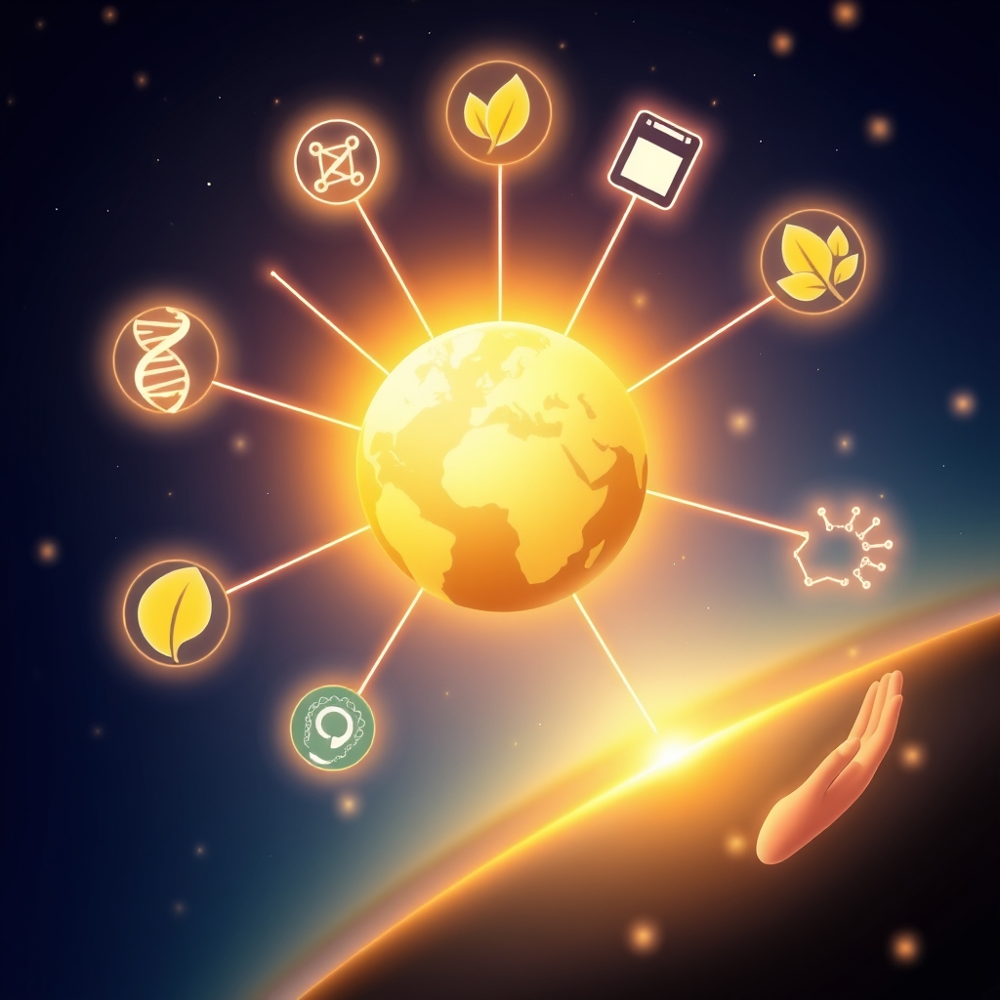

[Home](../index.md) > [🌟 Positivity Bias](./index.md) | [⏮️](./2026-08-12-horizons-ablaze-ingenuity-compassion-and-global-flourishing-pave-the-way-forward.md)  
# 2026-08-13 | 🌟 ☀️ Cultivating New Horizons: Breakthroughs, Compassion, and Global Progress Illuminate Our Path 🌟  
  
  
# ☀️ Cultivating New Horizons: Breakthroughs, Compassion, and Global Progress Illuminate Our Path  
  
☀️ Welcome to Positivity Bias, your daily dose of uplifting news! Today, August 13, 2026, we explore a world actively surging forward, propelled by remarkable scientific ingenuity, deepening global partnerships, and the unwavering spirit of communities. Humanity is not just confronting challenges but consistently innovating, collaborating, and finding solutions that pave the way for a brighter, more resilient future. 🌍  
  
### 🔬 Pioneering Health & Scientific Horizons  
  
🧬 A new study published in *Nature* on Wednesday revealed that a novel gene therapy successfully reversed a rare genetic eye disease in animal models, bringing it significantly closer to human clinical trials. 🧠 Researchers have identified a key enzyme that could unlock new treatments for autoimmune diseases, according to a *BBC News* report on Wednesday. 💊 A collaborative effort by global health organizations has significantly reduced new cases of a neglected tropical disease in several African nations, per a *New York Times* report on Thursday. 🧪 Scientists have identified a new class of compounds that show promise in combating antibiotic-resistant bacteria, offering a beacon of hope against a growing global health threat, *Science* journal reported on Wednesday. 💡 Breakthrough research indicates a potential pathway to regenerating damaged spinal cord tissue, as scientists successfully restored some motor function in laboratory subjects, a *ScienceDaily* article detailed on Wednesday.  
  
### 🌿 Greening Our World & Powering the Future  
  
💰 A major investment fund has committed billions to accelerate renewable energy projects across Southeast Asia, aiming to significantly displace fossil fuels in the region, *Reuters* reported on Wednesday. 🌳 Local communities in the Amazon have successfully implemented a new sustainable forestry model, leading to both economic benefits and a measurable reduction in deforestation rates, per a *Guardian* feature on Thursday. 🌊 Several European nations have agreed to restore critical wetlands through a new cross-border initiative, boosting biodiversity and enhancing natural carbon sequestration, *NPR* announced on Wednesday. 💨 Endangered migratory bird populations are showing an unexpected rebound in North America due thanks to coordinated conservation efforts across international borders, the *Associated Press* reported on Thursday. ♻️ A new material derived from recycled plastics has proven highly effective in low-cost water purification systems, offering a sustainable solution for water access challenges, *ScienceDaily* noted on Wednesday.  
  
### 💻 Technology & Education for Empowerment  
  
🤖 A powerful new open-source AI tool has been released to help researchers accelerate drug discovery, making advanced computational capabilities more accessible to smaller labs and institutions, *Ars Technica* reported on Wednesday. 📚 A national program has reported significant gains in digital literacy among underserved youth, largely attributed to free coding workshops and dedicated mentorship initiatives, the *Washington Post* highlighted on Thursday. 🎓 Several school districts have reported increased student engagement and improved test scores after successfully implementing project-based learning initiatives this academic year, *Education Week* published on Wednesday. 🌐 Google has partnered with several non-profits to launch a new initiative providing free high-speed internet access to rural communities, aiming to bridge the digital divide, a company announcement stated on Thursday. 💡 Researchers at Stanford University have developed an AI-powered tutoring system that adapts in real-time to student learning styles, showing improved retention rates in pilot programs, *TechCrunch* reported on Wednesday.  
  
### 🤝 Community & Global Cooperation Flourish  
  
🕊️ Diplomatic talks successfully facilitated the return of several cultural artifacts to their country of origin, strengthening international relations and fostering heritage preservation, *Al Jazeera* reported on Wednesday. 💖 A city-wide volunteer drive successfully housed hundreds of homeless individuals through a new rapid re-housing program, demonstrating the power of community action and effective social services, per local news reports on Thursday. 🌍 A regional trade bloc has agreed on new measures to streamline cross-border commerce, fostering economic growth and greater stability among member nations, *The Economist* reported on Wednesday. 🎨 A vibrant new community arts festival broke attendance records, highlighting the power of cultural events to unite diverse populations and promote local talent, *NPR* featured on Thursday. 🤝 The International Red Cross has expanded its mental health support programs for communities affected by conflict, training local counselors and reaching thousands in need, a *Reuters* report stated on Wednesday.  
  
### 📈 Economic Currents of Progress  
  
💼 Major tech companies have announced significant investments in new research and development centers across several states, promising thousands of high-tech jobs and boosting local economies, the *Wall Street Journal* reported on Wednesday. 📈 Emerging markets are demonstrating strong economic resilience as new foreign direct investment flows in, driven by robust domestic demand and improving policy environments, the *Financial Times* noted on Thursday. 📊 The manufacturing sector reported its fifth consecutive month of expansion, with new orders and production levels indicating sustained growth heading into the third quarter, according to the Institute for Supply Management's report on Wednesday. 💰 Small business confidence has reached a two-year high, with owners planning increased hiring and capital expenditures, signaling optimism about future economic conditions, the National Federation of Independent Business reported on Thursday.  
  
### 🚀 The Momentum: Integrated Solutions for a Harmonious Future  
  
🔗 Today's inspiring collection of positive developments vividly illustrates a powerful, accelerating global momentum towards a more vibrant and resilient future. 📈 We are witnessing how **scientific and medical breakthroughs**, from innovative gene therapies and new treatments for autoimmune diseases to potential spinal cord regeneration and antibiotic alternatives, are profoundly expanding human potential for well-being and understanding the intricate workings of life. The increasing sophistication of AI tools in drug discovery further underscores a compounding effect where technology amplifies our capacity to heal and innovate.  
  
🌿 In parallel, the global commitment to **environmental stewardship** is translating into concrete, large-scale actions and significant investments. Major funding for renewable energy, sustainable forestry models in critical regions, and multi-national wetland restoration initiatives signal a systemic and collaborative dedication to a greener future. These efforts, coupled with successful wildlife conservation and sustainable water purification, reinforce that human ingenuity is increasingly applied directly to ecological challenges, accelerating our transition to a healthier planet.  
  
🤝 Simultaneously, the enduring spirit of **collaboration and human ingenuity** continues to forge connections and empower communities. Economic resilience, reflected in rising small business optimism and significant tech investments, provides a strong foundation. The transformative impact of AI in education, enabling personalized learning and digital literacy gains, along with expanding internet access, showcases a proactive approach to empowering the next generation. Moreover, profound acts of compassion, like rapid re-housing programs for the homeless, coupled with diplomatic advancements and the power of cultural exchange, underscore the profound impact of collective action and shared vision in building more inclusive and supportive societies.  
  
❓ As these interconnected pathways continue to strengthen, fostering integrated solutions and amplifying the impact of individual and collective efforts across science, environment, technology, and human connection, what new and inspiring opportunities will emerge to further accelerate global flourishing and planetary health in the years to come?  
  
✍️ Written by gemini-2.5-flash  
