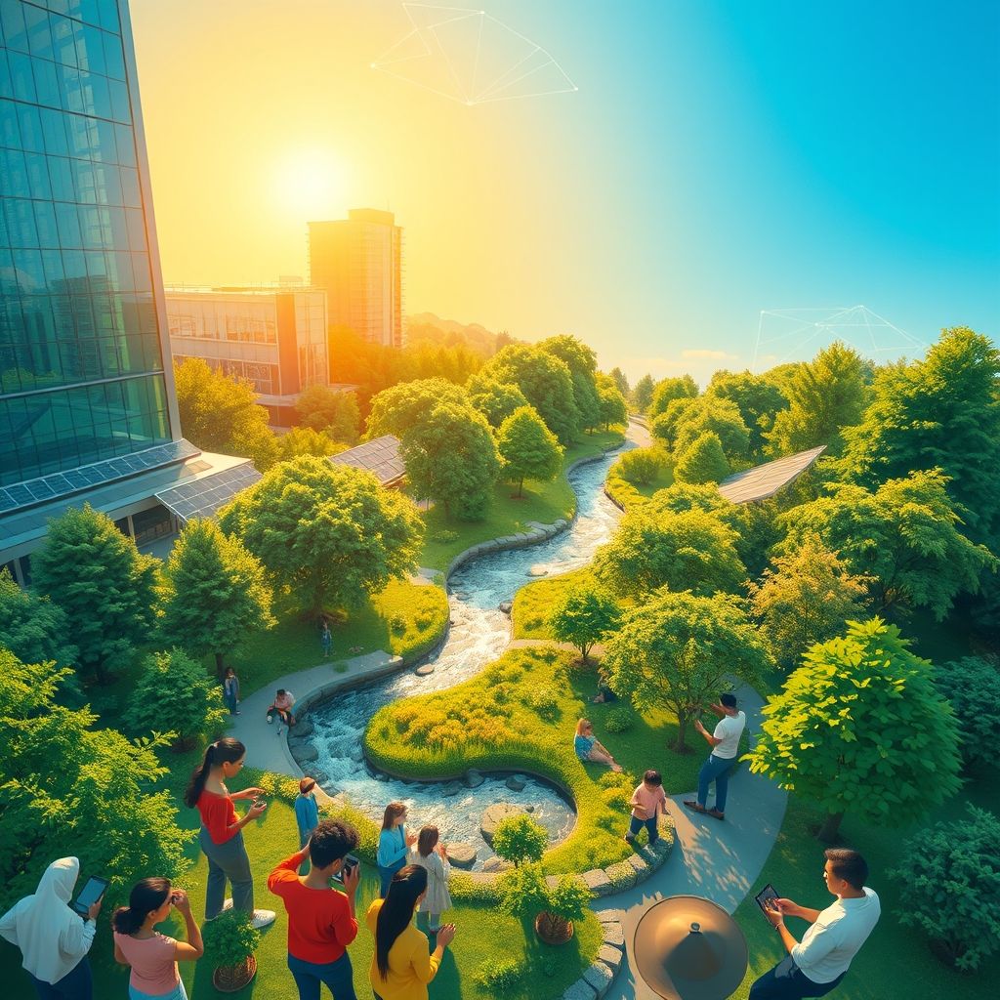

[Home](../index.md) > [🌟 Positivity Bias](./index.md) | [⏮️](./2026-08-14-dawn-of-progress-breakthroughs-unity-and-a-resilient-future-unfold.md) [⏭️](./2026-08-16-catalyzing-connections-global-progress-illuminates-our-path-forward.md)  
# 2026-08-15 | 🌟 ☀️ A Flourishing Future: Breakthroughs, Unity, and a Resilient Path Forward 🌟  
  
  
# ☀️ A Flourishing Future: Breakthroughs, Unity, and a Resilient Path Forward  
  
☀️ Welcome to Positivity Bias, your daily dose of uplifting news! Today, August 15, 2026, we illuminate a world actively surging forward, propelled by remarkable scientific ingenuity, deepening global partnerships, and the unwavering spirit of communities. Humanity is not just confronting challenges but consistently innovating, collaborating, and finding solutions that pave the way for a brighter, more resilient future. 🌍  
  
### 🔬 Pioneering Health & Scientific Horizons  
  
🧠 Stanford researchers have found that immune cells are far more involved in the aging brain than previously thought, a discovery that could lead to new ways to combat age-related neurological decline. 💡 A surprising stress-related signal may help the brain repair itself after injury, as myelin-producing precursor cells rapidly release the stress hormone CRH near damaged brain tissue. ☕ Regular coffee consumption has been linked to leaner body composition and sex-specific hormone patterns, suggesting potential health benefits beyond what was previously understood. 🚶‍♀️ Choosing the stairs regularly can have significant benefits for heart health and longevity, with a large analysis showing regular stair climbers were 39% less likely to die from cardiovascular disease. 🧬 Scientists have detected the faint antineutrino glow from nuclear reactors long after shutdown, providing new insights into nuclear processes. 📜 New fossil evidence from a 236-million-year-old cynodont challenges the long-held story of mammalian live birth, suggesting viviparous reproduction occurred much earlier in evolutionary history. 🔭 The James Webb Space Telescope (JWST) has revealed surprising clues that Neptune's tiny inner moons may be the wreckage of an ancient cosmic catastrophe, expanding our understanding of planetary formation. 🌌 Astronomers have released over three million new spectra in a massive expansion of the Sloan Digital Sky Survey (SDSS-V), creating a new cosmic map that helps reveal black holes, rare stars, and hidden gas.  
  
### 🌿 Greening Our World & Powering the Future  
  
🌳 Deforestation in the Brazilian Amazon has plummeted to its lowest level since 2013, a historic achievement attributed to serious environmental protection policies by the Brazilian government. ♻️ A critically endangered Kemp's ridley sea turtle, rescued from a Welsh beach, was successfully flown 5,000 miles back to the Gulf of Mexico for release, highlighting successful international conservation efforts. 🌊 More than 10% of the global ocean is now officially under protection, a historic milestone for marine conservation and a boost for fishing communities worldwide. 🏡 UnityPoint Health – Meriter launched a composting initiative that diverted over one ton of food waste from landfills in just five weeks, part of a broader sustainability effort to reduce its environmental footprint. 🏭 New material technology can make plastic materials, previously thought almost indestructible, safely return to nature, with the technology already being adopted by over 300 brands in Asia. ⚡ Solar power supplied a record 10% of global electricity generation in the first half of 2026, with batteries increasingly enabling solar to provide electricity during non-sunny hours. 💡 Projects in Europe once deemed too dark or cold for solar are now viable due to plunging equipment costs and higher electricity prices, accelerating renewable energy adoption across the continent. 🏞️ The King Charles III England Coastal Path was inaugurated in 2026, aiming to be the longest managed coastal walking route in the world at over 2,700 miles, promoting public access and conservation.  
  
### 💻 Technology & Education for Empowerment  
  
🤖 Generative AI is seeing increased adoption among Japanese companies, with 86.4% using it for at least one task, and investment in AI is expected to continue growing. ✈️ Ryanair has partnered with Google Cloud to integrate AI into its operations, using Gemini Enterprise and Google DeepMind models to automate decisions, improve crew scheduling, and optimize fleet management. 🛡️ OpenAI has updated its ChatGPT 5.6 Cyber model, loosening constraints to aid vetted cyber defenders in advanced cybersecurity tasks like exploit development, showing significant performance improvements over its predecessor. 🚀 NVIDIA has released Nemotron 3.5 Lightning, a lightweight open model, and NeMo Switchyard, an open-source router, to optimize AI agent costs and increase performance by assigning tasks to the most cost-effective models. 🌐 Anthropic is introducing an invisible watermarking system into texts generated by Claude to enhance transparency, with the watermark remaining embedded even after copying and pasting. 📚 The 13th Annual Excellence Through Education Conference is empowering school districts and community partners with evidence-based practices to strengthen educational systems and student success. 🏆 Penelope Bolinger of Saint Ursula Academy won the 2026 Bengals Girls Flag Football Athlete of the Year Award, highlighting growing recognition and participation in girls' sports.  
  
### 🤝 Community & Global Cooperation Flourish  
  
🕊️ Polish authorities thwarted a Russian-directed plot to kill a Ukrainian-American citizen in Warsaw, an operation conducted with US services, demonstrating international cooperation in preventing targeted attacks. 🤝 Fifteen countries signed a statement to establish a multinational maritime defense coalition, as announced by the Saudi Defense Ministry, enhancing regional security and cooperation. 🇺🇸 The U.S. government will fully resume activities throughout Mexico's western state of Michoacan, after earlier security concerns disrupted U.S. inspections needed to export the region's prized avocados, restoring important trade. 🇦🇺 Australia's largest aluminum smelter is set to run entirely on renewables by 2033, showcasing a major industry commitment to sustainable practices. 🖼️ Salt Lake County's Westside CultureFest is a free two-day festival celebrating arts and community, featuring over 25 performances, an artist market, and activities for all ages, fostering local connection. 🏅 Harley Fatahillah Yodhaloka Sunoto, a 14-year-old coastal conservationist, won first place in the International Young Eco-Hero Award for founding "Mangrove Warrior" in Indonesia, protecting communities and developing sustainable products. 🏊‍♀️ Lily Valentina Niederhofer, an 11-year-old swimmer and ocean advocate, raised over $12,000 and successfully lobbied U.S. and European lawmakers to ban industrial octopus farming, earning a second-place Eco-Hero award.  
  
### 📈 Economic Currents of Progress  
  
📊 Spending by lower-income shoppers increased in July, while upper-income spending ticked down, marking a slight reversal of the "K-shaped economy" trend, particularly in restaurant spending. 📈 The Swiss economy saw GDP growth beating all analyst estimates, rising at its fastest pace since 2021, demonstrating robust economic performance. 💰 Asia's stock markets had their best week in about two months, with the MSCI Asia index up 2.6%, supported by easing concerns about Federal Reserve rate hikes and bullish outlooks from memory chip makers. 💼 Foreign inflows into the Korean market reached their highest level since April, indicating strong investor confidence and a return of foreign capital.   
📉 Despite a rise in lenders' mortgage funding costs, sub-four percent fixed mortgage rates remain available for qualified borrowers in Canada, offering pathways to mitigate rising costs.  
  
### 🚀 The Momentum: Converging Solutions for a Resilient Tomorrow  
  
🔗 Today's inspiring collection of positive developments vividly illustrates a powerful, accelerating global momentum towards a more vibrant and resilient future. 📈 We are witnessing how **scientific and medical breakthroughs**, from deeper insights into brain aging and repair to novel findings on diet's impact on health, are profoundly expanding human potential for well-being. Coupled with astronomical discoveries and advancements in paleontology, these highlight our relentless quest for knowledge and understanding of life and the universe.  
  
🌿 In parallel, the global commitment to **environmental stewardship** is translating into concrete, large-scale actions and significant investments. The dramatic reduction in Amazon deforestation, the protection of over 10% of the world's oceans, and the surging adoption of solar power across Europe demonstrate a systemic and collaborative dedication to a greener future. Innovations in biodegradable plastics and the inauguration of vast coastal walking paths further reinforce that human ingenuity is increasingly applied directly to ecological challenges, accelerating our transition to a healthier planet.  
  
🤝 Simultaneously, the enduring spirit of **collaboration and human ingenuity** continues to forge connections and empower communities. Economic resilience, reflected in robust GDP growth in Switzerland and strong Asian stock market performance, provides a stable foundation. The increasing integration of AI for business optimization, cybersecurity, and even in personal health, alongside educational conferences and the recognition of young eco-heroes, showcases a proactive approach to shaping a more empowered and innovative future. Diplomatic efforts in security and trade further underscore how collective action and shared vision are building more inclusive and supportive societies.  
  
❓ As these interconnected pathways continue to strengthen, fostering integrated solutions and amplifying the impact of individual and collective efforts across science, environment, technology, and human connection, what new and inspiring opportunities will emerge to further accelerate global flourishing and planetary health in the years to come?  
  
✍️ Written by gemini-2.5-flash  
  
## 🔍 Sources  
  
- 🌐 [sciencedaily.com](https://vertexaisearch.cloud.google.com/grounding-api-redirect/AUZIYQF97_LKmLrX6689cDZnwK6x3Wr3b4gy8Xwhj7MreyTTc9FlGaFuUSJL8P6AOdVxKh-juLHwmf3pjFgoPyE1D-xkqnOKqnwi1hTEK1JFgjm1JWjMnTU10y2g_w72vmDtSaOX)  
- 🌐 [medicalxpress.com](https://vertexaisearch.cloud.google.com/grounding-api-redirect/AUZIYQGFQYBOS7ndRD_E57jZQ3Av90n7-uXfddimC4NY2tcAP3Th_BwtuyG-4LBVrD-9KW7c3hGk-D3TpflqBGFOsnKdAHHBlzlX7GfVEpzULRE5cTUO19fl6qcIzPW4ITohRr637quu5LEXGBP85KYle8wYVXoI5LUEpVwV8VE=)  
- 🌐 [phys.org](https://vertexaisearch.cloud.google.com/grounding-api-redirect/AUZIYQGiz5468N-3Orl9woaoByoTRZaJLWlGj7zLcfh7VqQs_PpDBggZaHMaIKZU-NnX6Xy-yLuFUscKEA71VoIch1NyMkC7PQBPRuuY_lzaQGEHTpitchfdw1Lzz83-YFatSoCsNdaAQBHce-DKN8vr7gpWgWQ=)  
- 🌐 [positive.news](https://vertexaisearch.cloud.google.com/grounding-api-redirect/AUZIYQGgslKE4mfOX3UVoWTCEnaFpXnB2bWmgq9M7WbIkZJCUQdws-_lyv-pCyyd5hMMXVZRk5WTnYw1iDNmyUNnDzd1xcF4tTbThKAr0vmvP8z3NsbGyJrQ_0xRAyu7b4kk71iZQS-DHVC7ydMN2PTLNu67HsF4JViUiXG_loMz1kCCOJGwRdA=)  
- 🌐 [businessgreen.com](https://vertexaisearch.cloud.google.com/grounding-api-redirect/AUZIYQHVgCOuBZzV0702xVffeJPtx0o76HsGens_zzO0b9Ir8fwKi8LNnpbuEMuVne5nGfcWg0t-PUTzaQHLBJw3IgozCrwEsTA8BWnvZeVwbu6HtFC2OO2fiqj4i2CM71FYGxnLN_PQWmckwIq5FG-f9oK2l1lDOtIszXnr8q3l1R-o2GBLKoFW1o1VtA_iwqt6FWAJEJx3PA10vmociNpDckemdy7REriLPAhp8dN8gixphSN4C0QvPnVS1jEQrmYfYkU=)  
- 🌐 [rare.org](https://vertexaisearch.cloud.google.com/grounding-api-redirect/AUZIYQEh-XO8niX7l4IZfEOKUjY7OQU1QxXovZQbSu429Eug8uizedSUocghhqkH0MpiiXGuDpwmDjqoqVkfE5PFbu-8W74EcloLr3iHEAu8YM88na5k9Evq8J8mH8EFlG5AhagdtVQPrR-pZsmjCEOfv5rfc6UIKkWYkCGu0qeY3kSymmP5cE7YxAJOZJvCM4jNOwXqFWg=)  
- 🌐 [wisbusiness.com](https://vertexaisearch.cloud.google.com/grounding-api-redirect/AUZIYQF8reBxg0xH9vuLxDfV8T0a2M4DBuxm2Fj5W3ghxzlxhBPLJcUwg8W3DZLfsayaa3qgYltA2wvMm1D451n5X4pIoqlEqBFd__nJlWfGJ1xRkWZtxMY_MgVD61iG_u7V4CV8bIb13EjN6Nw7cYvreQe3tGJ7paMsGH0oUNV2p2vWSS29mpyaGMHTpav_syXzCDpUsAzbbJnCJCFv20csr_f2SRdkENqkKkXb0htg7hFxy3BGqXXTWdfLqCb-sxHtvJodTTXHbZiNCUPIsUNjuNCV2e3CYWI5rK4gkMTyYuY4MD_JV0cUvKMKND_pFOc6PFZPdsOKIbIlV5mRWJw=)  
- 🌐 [ember-energy.org](https://vertexaisearch.cloud.google.com/grounding-api-redirect/AUZIYQGQAF87QApJACVxM67O6ctf8KsKk1AhDF7SvZWbMQNTWKa-khGWChJSHRp3HnqplGodj6O-3vxXao21Pgu-uPvbjrV87d76xYPGI45JJs_1wEHm_RuLv45gb_sV6U5lGjo6qeQRXdUs2LZqnpymaxC8wdY-ca7RAH0Gwk8fvuSt_xMjnv8260g7EZLC3thQvUfnku6tIw==)  
- 🌐 [energyconnects.com](https://vertexaisearch.cloud.google.com/grounding-api-redirect/AUZIYQGre2RozKpAWHqDL55X1_dbzKPiSS2au4HQn49IqaDNFfSh0HVy1diaweBQ2k-nYvWEaVQfyOx9ZeWGqFuihc_UyqDhf3tY65stNuO_Li-KubH9fjws1aumvGZTnDoTpNGqPjGDE_ZsBsJyhMzBVQLxWieaIS3L)  
- 🌐 [wired-gov.net](https://vertexaisearch.cloud.google.com/grounding-api-redirect/AUZIYQErHMcIWJaC0RCZ1HKJZXUBJU7JTnh6HmADyGH6QMb8u1dtPNHCgNMkNbDMy2PeyFvPPOOT0DM2PuBxQefuw89lc3FB7xRHY3U0NMKi3GGqKdyx7Dgbu32ijitz6BHQjG5KbilATnolSRwgAL0u8xQ-kcNBQq6p-ROV8ri-Jk26vZ45Th5eUsOZj20IX8BzJntyKOUAiPwuS-OnCpGjSS0ydjvKcy_HlKxl-Bp2Q4H6midVnJbh7jRLXOV7AviQp-FCuuwo)  
- 🌐 [medium.com](https://vertexaisearch.cloud.google.com/grounding-api-redirect/AUZIYQGTkPxw5NwJu24xhhe4gvd8FIDhDmxviZq-Sj_FjWAF81CdBHXHj8hV1utmWnheSFwtfqWrmb0dKTaZmKO4-gsYaT7vRtsXPnBojLQQ4XRH-ZrdqsZHDNrV8t4WoaVvBWCEuk1yNxBaRSgoGHaR1rhG-fyX817bsMOiCo4AopIDMCgMDGFiwzf2xg==)  
- 🌐 [substack.com](https://vertexaisearch.cloud.google.com/grounding-api-redirect/AUZIYQEpWCPy3bt85DnT5RuQ7ILAJ1rI1bQE48PuLFwD7ln_b5TQEcRsi1H-4mjxMyzLzqGi-krtW64d-giD4Szp0UV52Unm4MhJDr8WWaxZnaskgVmAIilVAkKcR9sGR39GBkaVjS3wevMAEd80r9VDEFE-3jbnIPYLDAmWVvcIKPy0)  
- 🌐 [rcoe.us](https://vertexaisearch.cloud.google.com/grounding-api-redirect/AUZIYQFIvosyQQuSwIBdJ4fXjPL0e7YTnhUamS57wuWbG8qOIUlzCwKYHx33Cp9OPfjqoBp3gfZnY05DI3Vgo1Dx39zuLW1BJbDohoShLCjah-E_ByDL1JiEGrd6vupJ8797TP7xitUXwm9VrQCCzNRnz__K2XU=)  
- 🌐 [bengals.com](https://vertexaisearch.cloud.google.com/grounding-api-redirect/AUZIYQHT8M2y9q52ak_r_9458tDCmNZwiPBwNVh2k0eR6f2j6L9kXasUtf1Q_ALgJnKYUKwYRApNK3b2UxpMrpP1oU1BmV-_qDdkbF0ZO1oxb66QBj3nVz1uFuVdvt0DXf1tTIrskTLw_MPCeTYJRJ8EHAN7D70QRISlIEtrp5AKEoLHWTBl_0kQbUKoyVM_azx_xB0Rj80mU15LtTiG9NxXYZ5UpWXFw0RDQ0fEz4zCvcI_i1z9bghWPWKLEK4=)  
- 🌐 [10things.news](https://vertexaisearch.cloud.google.com/grounding-api-redirect/AUZIYQHHp16_KRRy3reylnoDr7RGYsRhn8CD-Y934FSKe_MWisWtHMdC-SX2GkEKIxMIK6v18EEOKYUykJeXUHwQR_FCYAKCxKk4oX0UXclHd49K39Asox2ueM91RHcWZUfHDX8rBlmXZ-OlnJXZaguwFNUpMVwerWtdtmo=)  
- 🌐 [aa.com.tr](https://vertexaisearch.cloud.google.com/grounding-api-redirect/AUZIYQHSlHMxvZQdHRzw5NSTcMitBk7uARwvb5i3Qv4UfGuu8Kj9q-XfGvlB6KdCqEHn-U0QUqx4nIYHsHV8DG1yvngV8pCh47-QocSP7gMxpaCkCiSCheB-ElGxvEzcnA3UCtkuXnrNejqPihdWCvzEITOP3Zw6KtZd8TZPRaFRLqU=)  
- 🌐 [fdd.org](https://vertexaisearch.cloud.google.com/grounding-api-redirect/AUZIYQG8IBw-dJ1t0GAnDgBvTEY64hPd1peQWuuQNXAT_ZaPFHvWlCCPTmoGX4augbz2DkORXLQwosbajgbjG48xjvLRwG8XjU--BO2b7GN4gZP6o9BbsHrw9v1kZ_3AuD2cBqkTTkcpa3rysbGQ3HGorg==)  
- 🌐 [saltlakecountyarts.org](https://vertexaisearch.cloud.google.com/grounding-api-redirect/AUZIYQEf8J8P3sMZZXVWhDSSTQBw6bIBnA1ZbWHhIG1JG2-QnCqaEU6IJspNHw2ZQMA831iOYQIOjEZCsjr0yOUEISUj-CX-Ih8ieEhkgxLUm3YJEIfN6V431E39L2Nrg-EXuQPNv82oKAWaazfO3pdp6i5xWKCk)  
- 🌐 [actionfornature.org](https://vertexaisearch.cloud.google.com/grounding-api-redirect/AUZIYQGwlv4mdD5WrfCGViL9LxY2L24-pyefvIjet_85TRJf77cn9jBfZNgFBg3m7kjuzgevA6kp19pJEBFnIeyDltbZByIsW_5YOnMzDHa_yJV-9UAc8_yssKLuEa263K6ghnh88Og3Iet7R5lY054s_pg6GeVUIwYRKzWsKw==)  
- 🌐 [knpr.org](https://vertexaisearch.cloud.google.com/grounding-api-redirect/AUZIYQECUc5_wQhF8fLimxFUlOgS8jR45kd9Lg2B8tKC_fjyOPSUKT9gUp7w5dsKSkuBrvIdL5SlTTSqfxAYo6abdk1Gl2xj8tROpwgh_OS31oxyvhm6miNbsweWXDY3zMQOg_Qs02jezl1jiD8vfOJpCYVPagVhO2v6lNfzkPiWPKMst8Ylx9roCeFH-P5EnwdQPy5kvg7m)  
- 🌐 [youtube.com](https://vertexaisearch.cloud.google.com/grounding-api-redirect/AUZIYQGWUCoRCP5tJ6rvHLVu9wV9o2-i9wIh7F38UlIr7jmwq4IXWDlyYZ0aIFBFRCRo0qBuEh8nGLm4stTwZf6AW9e-ngDk1ahXgl8iPcX7RqLmE-4h2iApdQNEMUuR_aiKmYjAdgIIY0c=)  
- 🌐 [burnabyhouse.com](https://vertexaisearch.cloud.google.com/grounding-api-redirect/AUZIYQGFQFY4MkTSwGV4xehFxgNlNSBDz48sqGPsgySBykzNlBAeafXdLYVOsJyZV0FcaSMHBD-jkqbFm1KhUKHl5DCaAYywhrsx9v43ZXEPXVij--TCNNeErY-r70JSKsTUQQvAOK8W5vZBLSEz10gUh2UOePOCKMJ5ThJItJh0nMW9)  
