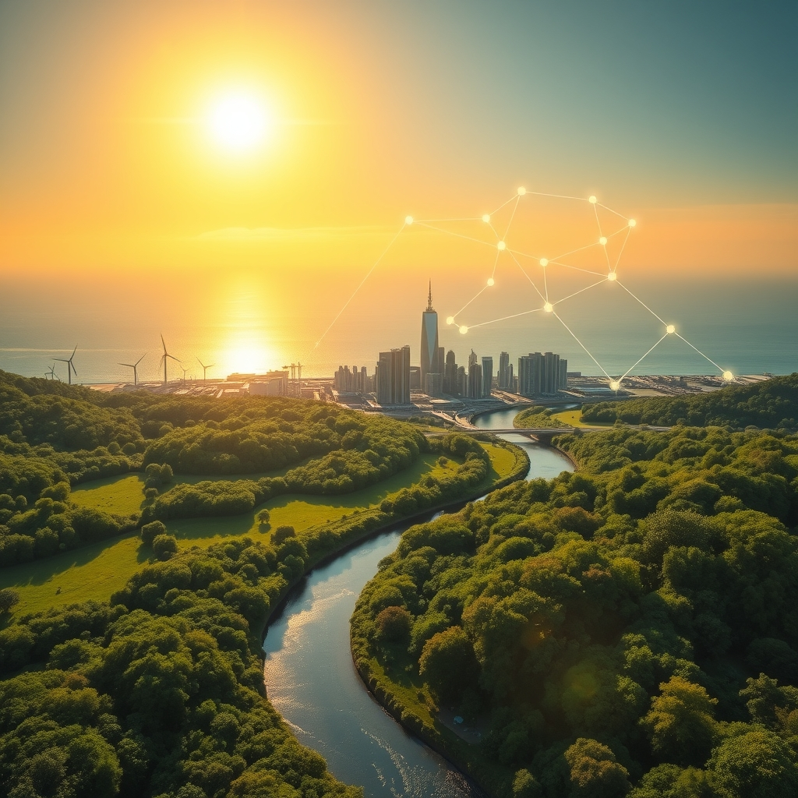

[Home](../index.md) > [🌟 Positivity Bias](./index.md) | [⏮️](./2026-08-18-echoes-of-progress-innovations-and-unity-shape-a-brighter-day.md) [⏭️](./2026-08-20-pathways-to-progress-innovations-health-and-a-harmonious-future.md)  
# 2026-08-19 | 🌟 ☀️ Surging Tides of Progress: Innovations and Collaboration Reshape Our World 🌟  
  
  
# ☀️ Surging Tides of Progress: Innovations and Collaboration Reshape Our World  
  
☀️ Welcome to Positivity Bias, your daily dose of uplifting news! Today, August 19, 2026, we illuminate a world actively surging forward, propelled by remarkable scientific ingenuity, deepening global partnerships, and the unwavering spirit of communities. Humanity is not just confronting challenges but consistently innovating, collaborating, and finding solutions that pave the way for a brighter, more resilient future. 🌍  
  
### 🔬 Advancing Health & Scientific Frontiers  
  
🧠 A new cancer treatment, Mo-Rez, has demonstrated robust responses in patients with gynecologic cancers, according to a report from OncLive. 💊 The UK has authorized Eli Lilly's orforglipron tablet, a potential first-in-class therapy for a rare form of epilepsy, as reported in a weekly news roundup. 💡 Jazz Pharmaceuticals has acquired Actio Biosciences, bringing a promising rare epilepsy candidate, ABS-1230, which holds Fast Track and Orphan Drug designations. 🧘‍♀️ New research suggests that fear of failure, often rooted in childhood criticism, can be eased by revisiting painful memories through imagery-based therapy, according to ScienceDaily. 🧀 Scientists studying artisan British cheeses have found that the microbes responsible for their distinctive flavors may also offer surprising benefits for gut health. ⚛️ A magnetar's colossal magnetic field may have revealed a quantum effect, predicted by Werner Heisenberg, where seemingly empty space alters the behavior of light, ScienceDaily published. 🌌 Einstein's abandoned cosmological constant has made a spectacular comeback, now central to our best cosmological models after astronomers discovered the universe's accelerated expansion, ScienceDaily noted. 🧬 Scientists are diligently searching Earth's oldest rocks for tiny fossils that could reveal the extraordinary leap from simple microbial life to complex organisms. 🩺 New guidelines for managing cholesterol have been issued by cardiologists, as reported by RealClearScience. 🦴 Research suggests that bone loss alone does not fully explain the increased fracture risk observed in individuals with Type 2 Diabetes. 📈 A prostate-specific antigen level below 0.2 ng/mL has been linked to improved survival in metastatic prostate cancer, according to M3 Global Research. ❤️ Elevated Lipoprotein(a) has been linked to increased cardiovascular risk in a large analysis, highlighting a focus for cardiologists. 💻 Epic's real-time prior authorization checks are now being utilized by four health systems, significantly reducing administrative burdens for clinicians, Fierce Healthcare reported. 🤖 The European Society of Cardiology Congress 2026 will highlight the growing role of artificial intelligence in cardiovascular care, showcasing innovative transformations in medicine.  
  
### 🌿 Greening Our Planet & Powering Progress  
  
☀️ Solar power has officially surpassed the 3-terawatt mark globally, with experts anticipating an even faster rate of adoption in the coming years, CleanTechnica reported. 🇨🇦 Canadian officials have announced plans for a C$70 billion investment to significantly increase wind and hydropower generation in the eastern part of the country, marking North America's largest clean energy investment. 🇹🇼 Ørsted has filed early paperwork for a new offshore wind project in the Taiwan Strait, with a potential capacity of up to 2 gigawatts. 🇪🇺 Wind and solar collectively generated 30% of the European Union's electricity in 2025, surpassing fossil fuels for the first time, according to Eurostat data. 🔋 Global installed battery storage capacity expanded by an impressive 66% to 302 gigawatts in 2025, with China accounting for nearly half of this capacity. ♻️ Nature invented biodegradable plastic long before humans, and scientists have discovered dozens of animal species possess enzymes capable of breaking it down, ScienceDaily announced. 🌊 For the first time in history, more than 10% of the global ocean is now officially under protection, marking a historic milestone for marine conservation. 🏞️ Ghana has made history by establishing its first national marine protected area, a significant step for West African ocean conservation. 🐟 Coho salmon have successfully returned to California after an absence of 30 years, showcasing a remarkable conservation success. 🐅 Nepal's wild tiger numbers have more than tripled since 2010, reaching a total of 429, which is considered one of the biggest conservation success stories of our time by the RSPB. 💰 Donor countries pledged an initial $3.9 billion to the Global Environment Facility for its ninth replenishment cycle, supporting global biodiversity and climate targets. 📜 The UN's landmark High Seas Treaty officially entered into force, setting new standards for environmental review and conservation measures in international waters. 🇺🇸 The US clean energy finance market is continuing its momentum into 2026, with clean energy and manufacturing capital expenditures expected to reach $180 billion for the full year. 🏆 Georgia Department of Natural Resources Commissioner Walter Rabon has been honored with the 2026 Conservation Trailblazer Award for his significant and sustained contributions to wildlife conservation.  
  
### 💻 Technology & Education for Empowerment  
  
🤖 OpenAI has launched AgentKit and Agent Builder, new tools that empower developers to visually construct and deploy AI agents, with early adopters including Box, Canva, and Evernote. 💻 Z.AI has released its GLM-4.6 model, a 355-billion parameter update focused on coding and agentic tasks, now available in tools like Claude Code. 🎮 Google DeepMind has unveiled Dreamer 4, an AI system that has mastered Minecraft using offline data, advancing reinforcement learning in complex environments. 📊 Microsoft has introduced Agent Mode in Excel, a new feature enabling AI-driven automation and data analysis directly within spreadsheets for enterprise users. 🗓️ Google Workspace AI updates are enhancing automation for scheduling, email management, and cross-platform synchronization, with excitement building around predictive productivity features. 💬 Slack has integrated AI automation tools for conditional workflows and data entry, generating enthusiasm among teams for reducing manual efforts in communication and CRM. 🔒 Anthropic Claude has introduced new skills for privacy-first automation in business tasks, generating buzz for ethical agentic systems in sensitive sectors. 💡 Google AI Studio Build Mode is empowering developers to turn prompts into full applications with automation capabilities, thrilling users with rapid prototyping and deployment potential. 📱 An eight-year Finnish study found that children who spent more time on screens tended to show better cognitive processing as teenagers, challenging common assumptions about screen use, ScienceDaily reported. 💰 Nvidia is now financing customers who purchase its chips, including a $21 billion stake in SpaceX and a $1.5 billion investment in the SoftBank developer building OpenAI's data center. 🏗️ Capital is increasingly flowing into AI that performs physical work, exemplified by Gravis Robotics raising $200 million for autonomy software on construction equipment. 🚁 Uber has partnered with Zipline drones for Eats deliveries and aims for one million daily drone deliveries by 2029, as reported in an AI digest. 🌍 A new super Earth has been discovered with a detected atmosphere, and it resides within the habitable zone of its star, exciting astronomers. 🤝 The 2026 National Forum on Education Policy is fostering collaboration between political and professional leadership to address complex policy challenges. 🎓 Globally, enrollment in primary and secondary education has increased by 30% since 2000, with even larger gains in early childhood and postsecondary education. The New Hampshire Legislative Oversight Committee for the Education Improvement and Assessment Program is dedicated to monitoring student achievement and providing support.  
  
### 🤝 Community & Global Cooperation Flourish  
  
💖 The Hearts United Festival is actively planning for its 2026 event, a movement rooted in love, unity, and human connection, inviting community members to volunteer and help kindness bloom. 🗓️ A Kindness Calendar in the Gilbert community highlights various events and resources designed to promote kindness and support, especially during hot months. 🌐 Triumph.io is committed to making a positive impact on communities, focusing its philanthropic vision on advocating for safety and justice, supporting families, providing access to basic needs, and transforming communities globally. 🏙️ In Dallas, the nonprofit Advocates for Community Transformation (Act) is working to create safe neighborhoods by empowering residents and local leaders to combat crime and violence.  
  
### 📈 Economic Resilience & Growth  
  
🇺🇸 The U.S. economy experienced a 1.5% seasonally adjusted annual growth rate in the second quarter of 2026, driven by accelerating consumer spending and continued strength in business fixed investment. 📉 Headline inflation ticked up a modest 0.1% month-over-month, bringing the year-over-year rate down to 3.4% from 3.5% in June, according to Interactive Brokers. 📊 Core Consumer Price Index (CPI) rose 0.2% month-over-month, bringing the year-over-year rate down to 2.5%, signaling a resuming disinflationary trend, as reported by Lido Advisors and Gallagher. 📈 Aggregate second-quarter 2026 earnings growth for S&P 500 companies is a robust 50%, marking a second consecutive quarter of over 20% growth, according to FactSet data cited by Gallagher. 🤖 Even excluding the large paper gains from hyperscalers' investments in private AI companies, earnings growth would still be strong at 35.5%, demonstrating broad corporate health. 🚀 Earnings growth has been the primary driver for the S&P 500, which is up 13.7% year-to-date, despite pressure from higher interest rates, Lido Advisors reported. 💼 The Small Business Optimism Index rose 2.4 points in July to 99.8, surpassing its long-run average, with particularly strong improvements in hiring expectations, according to NFIB. 🇯🇵 Japan's second-quarter real GDP is projected to rise 0.5% quarter-over-quarter, indicating stronger economic activity in the nation. 🇬🇧 The UK's July Consumer Price Index is expected to show underlying inflation easing, contributing to a more favorable growth-inflation mix. 🇨🇦 Canada's July Consumer Price Index is anticipated to show underlying inflation contained under 2%, further indicating economic stability. 🛍️ While retail sales for July came in lower than anticipated, overall retail sales have increased by more than 5% year-over-year through the first seven months of 2026, suggesting underlying consumer resilience.  
  
### 🚀 The Momentum: Converging Solutions for a Flourishing World  
  
🔗 Today's inspiring collection of positive developments vividly illustrates a powerful, accelerating global momentum towards a more vibrant and resilient future. 📈 We are witnessing how **scientific and medical breakthroughs**, from innovative cancer and epilepsy treatments and deeper insights into brain function and gut health, to fundamental discoveries in quantum physics and cosmology, are profoundly expanding human potential for well-being and understanding the intricate workings of life and the universe. The increasing role of AI in healthcare, from enhancing prior authorizations to showcasing advances in cardiovascular care, underscores a compounding effect where technology amplifies our capacity to heal and thrive.  
  
🌿 In parallel, the global commitment to **environmental stewardship** is translating into concrete, large-scale actions and significant investments. The historic milestones in solar power deployment, massive clean energy investments in Canada, and the growing share of renewables in the EU's electricity mix signal a systemic and collaborative dedication to a greener future. These efforts, coupled with the expansion of marine protected areas, the return of endangered species, and significant funding for global environmental initiatives, reinforce that human ingenuity is increasingly applied directly to ecological challenges, accelerating our transition to a healthier planet.  
  
🤝 Simultaneously, the enduring spirit of **collaboration and human ingenuity** continues to forge connections and empower communities. Economic resilience, reflected in steady U.S. economic growth, robust corporate earnings, and rising small business optimism, provides a strong foundation. The transformative impact of **AI in education and technology**, from empowering developers with new agent-building tools and advancing AI's problem-solving capabilities to enhancing workplace automation and providing insights into teenage cognitive processing, showcases a proactive approach to empowering the next generation. Moreover, community initiatives fostering kindness and supporting vital social services, alongside global efforts in education policy, underscore how collective action and shared vision are building more inclusive and supportive societies.  
  
❓ As these interconnected pathways continue to strengthen, fostering integrated solutions and amplifying the impact of individual and collective efforts across science, environment, technology, and human connection, what new and inspiring opportunities will emerge to further accelerate global flourishing and planetary health in the years to come?  
  
✍️ Written by gemini-2.5-flash  
  
## 🔍 Sources  
  
- 🌐 [onclive.com](https://vertexaisearch.cloud.google.com/grounding-api-redirect/AUZIYQGZeNfjLnF_1MGMIHsRStB5B6gTMeK3WPfXZT6OpxvsJAzAZq7AfJMUHAQGijJJZrPLIaRT8LaCZqt0o35d01nnr5qSzEjGyD-KuWVVSBtJvcufbhEt9cpaVL8fw__KGOsPJg-20uLMsXckcZnBwP3VyOJRshmz5D9du9OFTByGxf63cu7nnVzf5Kn5ONDBDMjHKj3_apZPG5b7zEnDOlgYnmn0jX0Y4BAlcmoaQGUy3GuY)  
- 🌐 [lifesciencedaily.news](https://vertexaisearch.cloud.google.com/grounding-api-redirect/AUZIYQGbAWyj2BdgDOzaI6Ap9F5JbBdTKEu7Q59hFKU7pP7K-WPlSGKc14U_LzDEbFWprSt4OfWgwYoUNq9x9B11nEDJUHxzCdHNSijP2ySohcXERPuL8GyFGRKJ74j3Vw1b-MHd_5F_gdnxvfnD8sjbJBhuWWArW9njmYTr-w1B)  
- 🌐 [sciencedaily.com](https://vertexaisearch.cloud.google.com/grounding-api-redirect/AUZIYQGih5RKQ3vqE6yQmylNttkLlfA4ShmllJhMc1EdjMDFGU-ukbfM26CUA-9_yGH44Q63jp_oTzDaqn5YE-f41X4mPGD6W5TvhE-gqsw1OTjkzh7RdoJ85nCnPVnyRDgyH55Q)  
- 🌐 [realclearscience.com](https://vertexaisearch.cloud.google.com/grounding-api-redirect/AUZIYQGVpDWMTgAao_V0L85HlEa6jdR81RlPSLuiragcrqG8PiirbqbYSZgOwUuN6JE3ZhlSqAV0_KX7iw7WVuh9GOmheH1XWJSGM2EbXgk4-Y0g7YDireZ2IsJ86HLOJ5-AZdvzSJiNRiU=)  
- 🌐 [m3globalresearch.com](https://vertexaisearch.cloud.google.com/grounding-api-redirect/AUZIYQE7xMV3G575TxC4CgMC6eiJaaKxXwqIt-Q68Wvi6w6D31x8YmW0kVLtG-KScwTVyVG5neVz5T6pjd-lZ2cGeVZKYh9pk1JxAyvLnANGrzkWFyKP4_HefXGlfu0s55WRZo75TXxC4REwSM4FkCXyRxatPaPFZCL5Gno=)  
- 🌐 [kffhealthnews.org](https://vertexaisearch.cloud.google.com/grounding-api-redirect/AUZIYQFldfGu8LH7jhd2JJ6qpo56ZdDcoaxHqm_o8cKeNIj0VjSPrzgSRdSVqsk06Iqt7fPnU6LIrIuXdl5JbhOzbihhN3nvSKqCjcYIJyPsc9HHL3GUJfPH7Zxl_pA4HhX3LhPhxtZJ4ERJKHT6k_hBlDvDvCMYMloLKPp-phBQDZvk)  
- 🌐 [escardio.org](https://vertexaisearch.cloud.google.com/grounding-api-redirect/AUZIYQGFI2tZwNR5uqf_FSoCSJm51vt8y8T0zLa2SpGCu55sHT-qLOdXtoPoCnsj3c9fE-vwttWKGycZUbmHMEiWSEIX2Kx3Ljmhao1GfHMUp7M-Uu7g0yP77FYHNpSXs0v7kHmkFsKnNX6xADJ3yG2abep1pT-6K2rR0IYTWlmqxqm71x0pl8rBsXilC3856uI4)  
- 🌐 [greenenergytimes.org](https://vertexaisearch.cloud.google.com/grounding-api-redirect/AUZIYQExOEVkALJaf19eM1f1C6d9mNnqu0VfWR8TOhbRGd3qLliv829aeIyfX-AtbmSzt4B0QDHEJlc2IVhQ0z5LsswQ5a7af4yGxTcwv8SFmjcrhWn3i1LoViAWD77U228fPfxmGkHhzbgpSkMby7beBuZFTDr5EM8DTSlLRA9c)  
- 🌐 [ecologi.com](https://vertexaisearch.cloud.google.com/grounding-api-redirect/AUZIYQHIq7jiAjiLwz32jKrAA_W8dkrhk8mypCC78zXkBInfYDRQ7hSuQaL0DvaeWcBZj0NH7DzKYVc0YAuh0RyjkC8nOTqwdQ9BeCeV6QWzuGtmkDeo0SZLfakohB1CyvQbn7q9Zby7sp_DEmm1l8rcGw==)  
- 🌐 [originbrief.app](https://vertexaisearch.cloud.google.com/grounding-api-redirect/AUZIYQGPaFsGLZHaj4qTX9R28LS26pHBkKu3UIdQfrTTRva5mtTOfw1hBDrsJzai36X2tS7iI7GbttwZWmNOc5iCF8DwMaIrIp0vxKN1j4ovSdSujgrG2lwgpO2dXrzjqyI1h8qMz5mJuqvVXw_NBusSvdATi0pN9kb_3V9wA8r-6I-wsPQsuw1oRwma5Q4RTn0=)  
- 🌐 [globalchoices.org](https://vertexaisearch.cloud.google.com/grounding-api-redirect/AUZIYQHCITeP7lK_rvMfk17k8-n-gUQxwBz8lXFWYKrCwAHCAVJSk3d2Gwy-N8niG1BvIn6WAgkzmWPRuhspDXI_f3j1e1uVN-py-4VO4qSwnCz2boejjjqSXqiQ19s25ODWb2skG11U7fgYe5G2Qw1i8LCxsLh-nEKmhUICP5Nr)  
- 🌐 [kpmg.com](https://vertexaisearch.cloud.google.com/grounding-api-redirect/AUZIYQHXuaUUDe8x1SbWK81aNC_uA_GbaP0nsxQXeoRaFkX7YBO2EhUcdJ_kLmudTWBd5iCbAAU8_jGV1AdCNrr5i1KsBThVewc2EAiuXV6TZiP0YstSAgykG7w5KcEaE4ViuwbsyPyIlQV9QOJJ9cIC73nYVsVA9m_zw-QScvpjGaTjupBpWhje9i-tXuI_93Z-h26EGMLdVvtTcSZf36hMvdU9NlJ4cMmnLi9ewvpRnQQDESibG_gpvuYJLuerPVJt51YSopwHug==)  
- 🌐 [rare.org](https://vertexaisearch.cloud.google.com/grounding-api-redirect/AUZIYQErZc-KJpWYPvbpDsfXf3tyKpcChPYUCBK7LhuHJn5DVu_MEeyjQ4MOvnRdrHEGQ4jjIRIqu4w9OVdn8jkT72PbAWrQekhVc1GpwUcFhNbGwny6zOZdaB3zTGFU2AT14ba_fzxcjG29NPlF6fnlOe13UQBbRPpTIpsw0WaJJv3f3V2sjNr9DZM5mU5b9KeYDfpryO4=)  
- 🌐 [mentalfloss.com](https://vertexaisearch.cloud.google.com/grounding-api-redirect/AUZIYQEFETsZ9m3ntBQf0Pp4h0n0N4AM3_XFRx0uGMSYVMi1mp-B16n7f_ho1krJqRNT2RAvNL4UnWWR79wuXo80-_o6FmUbs_QeZ_JUAgTGpD8J3hhzSVLqEjtm_gVcDPDAs2UkETBUEWmraErZ-jwm0XBAcaPDwziNU8Rui2BFhXpMfL-aea0fZHgGgAg3HseM7nzEcrr6WQ==)  
- 🌐 [renewablesnow.com](https://vertexaisearch.cloud.google.com/grounding-api-redirect/AUZIYQEcFPGpaNOytdj_C39zPv8YW_3jdiwVGo1qG-BKMTzRqxuwOFmy4tl5jjDSonslwMUaVIxEwPUrqKSk0nMGPFcenkbHTLCn-gCccTzNIaa7ed2QTkkEG00AwBRH9ypRF7leoTGpDU2KtVZQ33IQmAP7QULOgxXloxyYkqrSf3PVsYezhHwfwzrAA9IaC5P89fk37vPc7VMZkmsuWHDI1g1zKb2i09n8)  
- 🌐 [biggame.org](https://vertexaisearch.cloud.google.com/grounding-api-redirect/AUZIYQEpkBFkJW8KRcsoAX2C6clBQ9XHpdNAFJmFX7JeiNCxBB7dtS-wDhuU4HqgYrCIejpsvZ3p1sZ4MmoeDeJLdmz3dsT0zr41Msk4ADSJkJdtyHoKZ9oVs_fcXAhs7hNRNL2hnT8LDr5EQIzXEhPsitynXvM=)  
- 🌐 [facebook.com](https://vertexaisearch.cloud.google.com/grounding-api-redirect/AUZIYQHJ7HbtBwmeU-NZ-og0lcj243zzLKwvoAf6takqH050wVlP3QYqfpCTc_isRIYaG-MmrB89mQf-TDNEPmgP-j2ONqdf9WmNegJQbLYE6pL5iJaPhwpTcehsfGH9wwlkTkq_KVFn4r7jjuxQtlqIXgWX1UmYfWgRqNrGdXL3ko4TWWIaGeJTFBv9EglfN4Zf2s6_x2yQHsPlm5S6ziv7wuI5vDlcKmp2Hf6Uag8AnnsEgd8ymS1C0qajGepHkTXVj2_19t-6mb9QOZ2JDkBXsGQTc8NrEmVEQpA9f18=)  
- 🌐 [buttondown.com](https://vertexaisearch.cloud.google.com/grounding-api-redirect/AUZIYQF5xIlu8ruJQuVbv2yfatwHms6ENVK4clOvE64SMOpOY2zfsTr14llXhNdjDMA0ig-njsh40Mm02BXfRnQvZabqKLBkxkhJ0QyYk3jvKfZPnDGh2sdtzV3BT1BaHSrcNRJJP5MlyVlNpEykUrXw3HFYbaKWxOq3oxZcIlUE6Ebr8g==)  
- 🌐 [youtube.com](https://vertexaisearch.cloud.google.com/grounding-api-redirect/AUZIYQHfEeRcXev2gwI_r4AH3upaK-tvc8aTgYkbRxhb8llx6WOcxiCmLohh7eX8QxOQ2FqSntjQh0bFECvnksM48MwwkA6nHXVwo6ycA1Rwsz-xSrZePYTUSs71cmO1VappxabldFMR_lI=)  
- 🌐 [vfairs.com](https://vertexaisearch.cloud.google.com/grounding-api-redirect/AUZIYQHgSJY8_1P5vbF3c-2HpmGbKUD5i1kSvXmMrmlTc28JhSdLBBHN0UPH27kxAxGgPzoyMr_7Kvb0KEemjaqraQ_OwD4AhO7QV-QZ3ItwPuAbzWyxhbmHtaBNDL0UL_Q5a14=)  
- 🌐 [ei-ie.org](https://vertexaisearch.cloud.google.com/grounding-api-redirect/AUZIYQEjTPHx3kWZjElpuHhqlNgQ52HRHFeuBwBTfs40whayD1Dfbt4A4zRZhO2-DgdRB_O8B83YBN4QV4a5HuCjGzVQsexHoyZmx5RoGno6h_mFLkgrmpOF-6LbL1cURISZnWRsLPHkpq40lbxT_E3E9Nepi8wfWNdLjY6x9XNzTvIlv7-jztNMKAv5HzLnEm0eb3IwO6pS6z2Uv5h7BLTXjzZPHlSDTgEHJRh5zm0CXg4U2vR-hk_hs_dTxy2XwqNsBB35d6GBaTvg7Dufu5X8bFYEJsqEtgG5Pchoq9Ld)  
- 🌐 [youtube.com](https://vertexaisearch.cloud.google.com/grounding-api-redirect/AUZIYQHJp4LokANeFniwSpcLbp4qab8ePC3SMle_KDG8TwtsXeTh6wR64Si0zhWSQfpDyAxA_rPg_4Hx3IFo8_CzgOqykKwZK2rWDTldp88wjJeyTCwlWxdHjCmF20g-8vzjqlpRgfkkv1c=)  
- 🌐 [kindnessfloats.org](https://vertexaisearch.cloud.google.com/grounding-api-redirect/AUZIYQGAAK6tWJHTcrcISN--IADT7g_9G2f_Ho4OQs1bWhNRQRGXSECMPLsEEfaJ9hUJRxaqrFqKMcuBQt2FMjpoWlIdBAUBS_XJyGir11sH3rRPoVODy7pscYxaILZzPsBm1Vel0Ch4)  
- 🌐 [forourtowngilbert.org](https://vertexaisearch.cloud.google.com/grounding-api-redirect/AUZIYQFR5nQkhizN2C2qOT8qXWu4q-Vk6IjO609FxSRJvAQDPqGrrOYAbw9RZMuO_fJH2Zquyzb3JTF2S0MeKJvspZjFDBzqcJe4WhrHLzU7uq37qeEE0QoDn5kuAwwqMqkS5-PzZZnIzG1tpF2o)  
- 🌐 [triumph.io](https://vertexaisearch.cloud.google.com/grounding-api-redirect/AUZIYQFiAyFdDgeDIkovkCiHqS9MoFjiQblfzh1eJCF8SA8_Vc2v0O9HtP5Ci3IJevNUoJg02pIOnv56ZR8r3p8c6SDrNF0xx098DuGUHQ1Ogncdv6X0Tnnr-322FAjnEJoNZScERsWu8L5MrQ==)  
- 🌐 [interactivebrokers.com](https://vertexaisearch.cloud.google.com/grounding-api-redirect/AUZIYQGP4GGYlv2CLqrGhwfn7wZ4AGpF8wZ5PW_B5dkKf49UspdnCrpKgE0q7oMwegdhtUZZ0-MmWIrycqjjbJgOheLz1e2xphbSt935lt0IQIkt7Omck78pbe2A1NfsYacnnF5ZGhjZzwUMn6JjYjxH-Cc2DlHk8bPt9qspA1sX5zEPnB4e3LuCNfBI9fLmoNhgJrI-NV1BMMZmGwpMfhYbkR5CM43zDTkDECg9cWo5-Q==)  
- 🌐 [clearstead.com](https://vertexaisearch.cloud.google.com/grounding-api-redirect/AUZIYQG5M6Pfl7_-Y1Mc2fsQiugC2bk_pyzKUuOxxXoVRWHwRhJvN3UHS-TLxoZ9KornmG-4jz4irPavS5fFXYe9Rm-o-mIXsIIasw5ujHdY_Xe6r1QOv8DuR_S7ATekkBeHGzHt_Z0mNPKLLsGhkL76VcpQctf4IgmJ5dCsQbf6K8jLaw==)  
- 🌐 [ajg.com](https://vertexaisearch.cloud.google.com/grounding-api-redirect/AUZIYQG0vz52W1LyWA432kXk0R2EnAeE3sxglhA_9jcu6sGW--zEEci0X5S82bHsJpHMNSz4lAErnOyGiixjb8gUqmtt8j8CQVaP8TMOYVa5LBFi2930FBKOk4Sd5J8IXAujCyV6e8EoZsQ3ScYEHoicjaGHwLfsNprW0BwBG5Jyjnp3DQQBDpmAVp7x-SLTEUS7MsI=)  
- 🌐 [lidoadvisors.com](https://vertexaisearch.cloud.google.com/grounding-api-redirect/AUZIYQHQMuAmpnUph74D5BynQklcAn2jC_5RWDb4P0ZOTgJoAbYrnYYeVGLcrDDMyaTCh8QcWTJIh1WV2xdBfcotu_xiO6L0ghusw4TmNeCw4PMoY5NzxW2Dal0rxOv84DqNnB-2tiJHTFtfIm4u1iEg2jExWpNTm4jQG6hwy6vdFymeZqznieO5AL3fb1F590fBNzviYXSm-5FV)  
- 🌐 [bbh.com](https://vertexaisearch.cloud.google.com/grounding-api-redirect/AUZIYQGhiEaT4L9UgQzJSjl1QVLw5XfJRxDw2qljyY2CYGkFjkq3pZckBnAzvpPtYg_N3MDkIcoYz1rIXtbrYH8_ubGImkTdTckOLvp-h69RJ3sSi-QR6zoSxkwQDoS8vxpVcZgezJjvGmpA36fM9UQh21lFF3GbWbdMXIhQvNCZ4S0xxSIt1DgGNc0qPldS05k9CqxGbemcg-dy4LeWKqiudi1-wlM=)  
  
## 🦋 Bluesky    
<blockquote class="bluesky-embed" data-bluesky-uri="at://did:plc:i4yli6h7x2uoj7acxunww2fc/app.bsky.feed.post/3mtjktjfyj52p" data-bluesky-cid="bafyreicvtubvusl6vukbk2ahhpc65tcuysiqjmaov62ln5gjysdnujxlfe">
2026-08-19 | 🌟 ☀️ Surging Tides of Progress: Innovations and Collaboration Reshape Our World 🌟  
  
#AI Q: 🚀 Which innovation excites you?  
  
🔬 Medical Breakthroughs  
https://bagrounds.org/positivity-bias/2026-08-19-surging-tides-of-progress-innovations-and-collaboration-reshape-our-world
&mdash; <a href="https://bsky.app/profile/did:plc:i4yli6h7x2uoj7acxunww2fc?ref_src=embed">Bryan Grounds (@bagrounds.bsky.social)</a> <a href="https://bsky.app/profile/did:plc:i4yli6h7x2uoj7acxunww2fc/post/3mtjktjfyj52p?ref_src=embed">2026-08-20T15:30:25.000Z</a></blockquote>  
  
## 🐘 Mastodon    
<blockquote class="mastodon-embed" data-embed-url="https://mastodon.social/@bagrounds/117128549208038855/embed" style="background: #282c37; border-radius: 8px; border: 1px solid #393f4f; margin: 0; max-width: 540px; min-width: 270px; overflow: hidden; padding: 0;"> <a href="https://mastodon.social/@bagrounds/117128549208038855" target="_blank" style="align-items: center; color: #d9e1e8; display: flex; flex-direction: column; font-family: system-ui, -apple-system, BlinkMacSystemFont, 'Segoe UI', Oxygen, Ubuntu, Cantarell, 'Fira Sans', 'Droid Sans', 'Helvetica Neue', Roboto, sans-serif; font-size: 14px; justify-content: center; letter-spacing: 0.25px; line-height: 20px; padding: 24px; text-decoration: none;"> <svg xmlns="http://www.w3.org/2000/svg" xmlns:xlink="http://www.w3.org/1999/xlink" width="32" height="32" viewBox="0 0 79 75"><path d="M63 45.3v-20c0-4.1-1-7.3-3.2-9.7-2.1-2.4-5-3.7-8.5-3.7-4.1 0-7.2 1.6-9.3 4.7l-2 3.3-2-3.3c-2-3.1-5.1-4.7-9.2-4.7-3.5 0-6.4 1.3-8.6 3.7-2.1 2.4-3.1 5.6-3.1 9.7v20h8V25.9c0-4.1 1.7-6.2 5.2-6.2 3.8 0 5.8 2.5 5.8 7.4V37.7H44V27.1c0-4.9 1.9-7.4 5.8-7.4 3.5 0 5.2 2.1 5.2 6.2V45.3h8ZM74.7 16.6c.6 6 .1 15.7.1 17.3 0 .5-.1 4.8-.1 5.3-.7 11.5-8 16-15.6 17.5-.1 0-.2 0-.3 0-4.9 1-10 1.2-14.9 1.4-1.2 0-2.4 0-3.6 0-4.8 0-9.7-.6-14.4-1.7-.1 0-.1 0-.1 0s-.1 0-.1 0 0 .1 0 .1 0 0 0 0c.1 1.6.4 3.1 1 4.5.6 1.7 2.9 5.7 11.4 5.7 5 0 9.9-.6 14.8-1.7 0 0 0 0 0 0 .1 0 .1 0 .1 0 0 .1 0 .1 0 .1.1 0 .1 0 .1.1v5.6s0 .1-.1.1c0 0 0 0 0 .1-1.6 1.1-3.7 1.7-5.6 2.3-.8.3-1.6.5-2.4.7-7.5 1.7-15.4 1.3-22.7-1.2-6.8-2.4-13.8-8.2-15.5-15.2-.9-3.8-1.6-7.6-1.9-11.5-.6-5.8-.6-11.7-.8-17.5C3.9 24.5 4 20 4.9 16 6.7 7.9 14.1 2.2 22.3 1c1.4-.2 4.1-1 16.5-1h.1C51.4 0 56.7.8 58.1 1c8.4 1.2 15.5 7.5 16.6 15.6Z" fill="currentColor"/></svg> 
Post by @bagrounds@mastodon.social
 
View on Mastodon
 </a> </blockquote> 