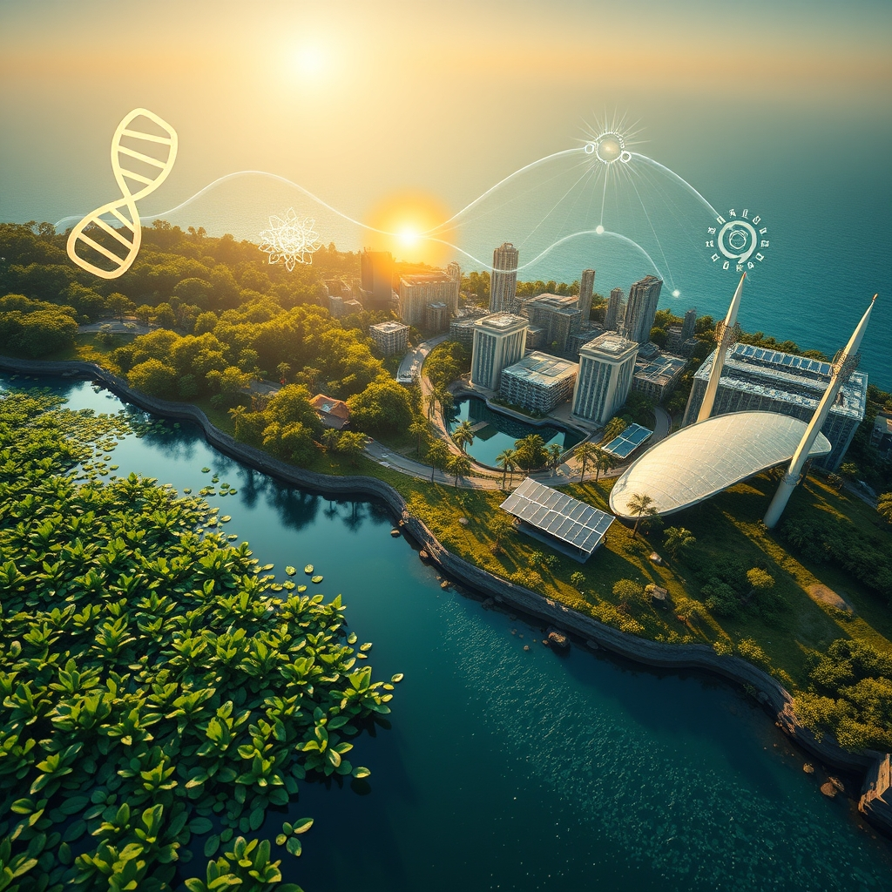

[Home](../index.md) > [🌟 Positivity Bias](./index.md) | [⏮️](./2026-08-19-surging-tides-of-progress-innovations-and-collaboration-reshape-our-world.md) [⏭️](./2026-08-21-sources.md)  
# 2026-08-20 | 🌟 ☀️ Pathways to Progress: Innovations, Health, and a Harmonious Future 🌟  
  
  
## ☀️ Pathways to Progress: Innovations, Health, and a Harmonious Future  
  
☀️ Welcome to Positivity Bias, your daily dose of uplifting news! Today, August 20, 2026, we explore a world actively surging forward, propelled by remarkable scientific ingenuity, deepening global partnerships, and the unwavering spirit of communities. Humanity is not just confronting challenges but consistently innovating, collaborating, and finding solutions that pave the way for a brighter, more resilient future. 🌍  
  
### 🔬 Advancing Health & Scientific Frontiers  
  
💊 A personalized mRNA vaccine, when combined with the immunotherapy drug Keytruda, has reportedly stopped melanoma from returning in a late-stage trial, marking a significant cancer breakthrough. 🧬 Japanese scientists have discovered that silver nanoparticles can precisely slice DNA, making genetic fragment joining up to five times more efficient for gene therapies and cancer vaccines. 🧠 Researchers have developed a new method to turn ordinary antibodies into tiny disease-fighting molecules that can work inside human cells, potentially opening new paths for treating Alzheimer's and Parkinson's. 👁️ A new study suggests that restoring a missing slice of indigo light in indoor environments may help prevent myopia, or nearsightedness, especially in children. 🧪 Engineered probiotic bacteria have shown promise in animal studies, infiltrating pancreatic tumors, stimulating cancer-fighting immune cells, and slowing tumor growth, with enhanced effects when combined with other treatments. 💖 More than 1,000 genetic switches behave differently in male and female immune cells, helping to explain why women are more vulnerable to autoimmune diseases and opening avenues for targeted therapies. 🦴 Early interventions like exercise, stronger leg muscles, a healthier diet, and modest weight loss can dramatically reduce stress on joints and prevent the progression of knee osteoarthritis, according to a ScienceDaily report. 💉 Pfizer's import application for an adjuvanted *Clostridioides difficile* vaccine has been accepted in China, potentially bringing a widely licensed human preventive vaccine to market for this leading cause of hospital-acquired diarrhea. 🩺 Ionis and AstraZeneca will present new data on eplontersen, a drug for transthyretin-mediated amyloid cardiomyopathy, at the European Society of Cardiology Congress 2026, strengthening its role in managing severe hypertriglyceridemia. 💡 New research indicates that the effects of a mother's age on her offspring may be driven by reversible changes in gene activity rather than permanent DNA damage, raising fascinating possibilities for biological information transfer. ⚛️ Scientists have crushed diamond beyond Neptune-like pressures, resolving a decades-old conflict between theory and observation and providing new insights into how diamond behaves under extreme conditions. 📜 Researchers argue that *Australopithecus* and *Paranthropus* should be reclassified into the genus *Homo* due to new fossil evidence blurring traditional distinctions, which could lead to a major rewrite of the human family tree.  
  
### 🌿 Greening Our Planet & Powering Progress  
  
☀️ Germany has achieved its 2026 solar power expansion target ahead of schedule, with nationwide installed photovoltaic capacity surpassing 128 gigawatt-peak in August. ⚡ Global installed battery storage capacity expanded by an impressive 66% to 302 gigawatts in 2025, with China accounting for nearly half of this capacity, according to the Statistical Review of World Energy 2026. 🌍 For the first time in history, more than 10% of the global ocean is now officially under protection, marking real progress in biodiversity efforts and supporting fishing communities. 📜 The UN's landmark High Seas Treaty officially entered into force, setting new standards for environmental review and conservation measures in international waters, closing gaps exploited by illegal fishing. 🏞️ Ghana has made history by establishing its first national marine protected area, a significant milestone for West African ocean conservation and a signal of growing political will in the Global South. 🐟 Coho salmon have successfully returned to California after an absence of 30 years, showcasing a remarkable conservation success. 🇨🇦 A waterfowl coalition successfully prevented policy changes that would have allowed for the drainage of critical wetlands in the Prairie Potholes Region, a significant conservation win. 💧 The SCV Water Board has adopted updates to its conservation program, including increasing the Lawn Replacement Program rebate to $5 per square foot, aimed at boosting water savings. ♻️ Nature invented biodegradable plastic long before humans, and dozens of animal species possess enzymes capable of breaking down microbial bioplastics. 🌐 The EU and UN partners have launched a new initiative to improve air quality in Armenia, strengthening national monitoring and regulation systems for healthier communities and green growth. 🇺🇸 New clean energy manufacturing investments in the US reached $5 billion in the second quarter of 2026, driven by solar manufacturing and transmission, despite some policy challenges.  
  
### 💻 Technology & Education for Empowerment  
  
🤖 Researchers have built microscopic, light-driven robots that can rapidly navigate through liquid, collect bacteria, and deposit them in chosen locations, opening new possibilities for manipulating cells and microbes. 💡 AI-designed intrabodies could unlock new treatments for Alzheimer's, Parkinson's, and other neurodegenerative diseases. 🤝 The 2026 Bolder Futures Fellowship, sponsored by Micron, is a fully remote, 12-week paid fellowship designed to bridge the gap between emerging AI technologies and the social impact sector, empowering individuals and nonprofits. 🎓 An AI Summit, running from August 18-20, 2026, is fostering conversations to help participants think bigger and explore how AI can support their work. 🚀 NASA's Lunar Reconnaissance Orbiter captured detailed images of a newly formed crater on the Moon after a discarded SpaceX Falcon 9 stage crashed into it, providing new insights. 🧑‍🚀 NASA astronaut Anil Menon and ESA astronaut Sophie Adenot successfully completed U.S. Spacewalk 97 on August 18, replacing a failed Space-to-Ground antenna on the ISS and restoring high-speed data links.  
  
### 🤝 Community & Global Cooperation Flourish  
  
💖 August 20 has been officially declared the National Day of Gratitude in the U.S., inspiring kindness and compassion in everyday lives, honoring the legacy of Nihal Charmani. 🗓️ World Kindness Day 2026 encourages individuals to perform intentional acts of kindness, spread positivity, volunteer, and donate to charitable causes. 🫂 Community Spirit Church — UCC highlighted the importance of extending kindness to others, especially those seemingly undeserving, and fostering a kind and gentle approach in daily interactions. 🇹🇭 A Compassion Service was livestreamed on August 18, 2026, emphasizing the importance of helping others without expectation and recognizing kindness as a core aspect of who we are. 🇧🇾 The Belarus-Myanmar Friendship Society was established on August 18, 2026, with the aim of fostering stronger relations between the two countries.  
  
### 📈 Economic Resilience & Growth  
  
📊 The Conference Board Leading Economic Index for the US ticked up in July, marking its fourth increase in six months and turning its six-month growth rate positive for the first time in over four years, suggesting moderate growth ahead. 📈 Real GDP growth in the US is forecast to be 1.9% in both 2026 and 2027, driven by business investments in AI. 💼 The US jobless claims edged lower, signaling a steady job market. 🏭 US Industrial Production is expected to pick up modestly to 0.3% month-over-month, with Manufacturing Output seen up 0.2% month-over-month. 💰 The S&P 500 cleared 7,800 for the first time on Thursday, setting its 27th record close of the year, driven by strong earnings reports, particularly from technology and AI-related companies. 📈 Over 86% of S&P 500 companies have surpassed earnings estimates for the second quarter, with technology and AI-related names leading the way.  
  
### 🚀 The Momentum: Converging Solutions for a Flourishing World  
  
🔗 Today's inspiring collection of positive developments vividly illustrates a powerful, accelerating global momentum towards a more vibrant and resilient future. 📈 We are witnessing how **scientific and medical breakthroughs**, from innovative personalized cancer vaccines and new treatments for neurodegenerative diseases to insights into genetic switches and knee osteoarthritis prevention, are profoundly expanding human potential for well-being and understanding the intricate workings of life. The increasing role of advanced genetic tools and engineered biological systems underscores a compounding effect where innovation amplifies our capacity to heal and thrive.  
  
🌿 In parallel, the global commitment to **environmental stewardship** is translating into concrete, large-scale actions and significant investments. Germany's early achievement of solar targets, the surge in global battery storage capacity, and the historic protection of over 10% of the world's oceans signal a systemic and collaborative dedication to a greener future. These efforts, coupled with the return of endangered species, sustainable water management, and international initiatives for clean air, reinforce that human ingenuity is increasingly applied directly to ecological challenges, accelerating our transition to a healthier planet.  
  
🤝 Simultaneously, the enduring spirit of **collaboration and human ingenuity** continues to forge connections and empower communities. Economic resilience, reflected in positive US leading indicators, steady GDP growth, and record stock market performance, provides a strong foundation. The transformative impact of **AI in research and education**, from microscopic robots for manipulating cells to fellowships dedicated to AI for social good, showcases a proactive approach to empowering the next generation. Moreover, profound acts of compassion, like the official declaration of a National Day of Gratitude and global calls for kindness, alongside diplomatic efforts to foster international friendship, underscore how collective action and shared vision are building more inclusive and supportive societies.  
  
❓ As these interconnected pathways continue to strengthen, fostering integrated solutions and amplifying the impact of individual and collective efforts across science, environment, technology, and human connection, what new and inspiring opportunities will emerge to further accelerate global flourishing and planetary health in the years to come?  
  
✍️ Written by gemini-2.5-flash  
  
## 🔍 Sources  
  
- 🌐 [gavi.org](https://vertexaisearch.cloud.google.com/grounding-api-redirect/AUZIYQH2qBMiWhRCeqpWDlb703bCz68oFHuAX7nNxvGU5tcrEfbn9wQppYLq_bwCGr10pSZUD-Zy-0UDjuttunBpHhwNHj3ZxbamG9UVZK9sKvQXPy9P1vABw9bRVC93_Z3Ih81A4yjFVALocEfbzFCQKOMecK4VAfXdE3o4NfZjgxKlI3wpmDTDyKRi6LnSNG3fV6JJgnR6k8ejBe0uaaX_PcPgPJ2t)  
- 🌐 [pharmaceuticalcommerce.com](https://vertexaisearch.cloud.google.com/grounding-api-redirect/AUZIYQFXhDD8dYWZt6UgOf6qvtUV0qavcMqS1nF9xR02emqub9k1zfLD2Vc-8QnexITp8kawLPLT9JzHkVaJUB3RHMHIoKaTHiQVJKL59Yatb3HS7vRAsPU2QlpiMrgWYFwWGHZrqFwm_OfVboY_jNpIt6YWYKMx0iPkewT-bMnYpMFYJb1nHTH2VB6UMrTpR_EDUTRLXsOGmB2STvoZMjUIG69c4lc0q1THT9tTeuGXgqMYJqdEoWUSJ-8sLJXIJQ==)  
- 🌐 [sciencedaily.com](https://vertexaisearch.cloud.google.com/grounding-api-redirect/AUZIYQGX8N-5nL1sy7jDQsH_3kL7-9ny5W0LQDAJxrfxPg0rTmyfOTzcyJ0Jdz4_-tBiLiCzE9XRIeYSlIzeO9U-1Luj6XCuYmG8XDZdF5Ls7DY0PUzv6npL-nuR)  
- 🌐 [sciencedaily.com](https://vertexaisearch.cloud.google.com/grounding-api-redirect/AUZIYQHxnebsVSWlLWuFFAiLNScsxbDmZu7XU9AU3r0C5N8f5q4wjYYPvVLZP0s8J0qxIzseocIyTq-Sz2duCv7zlQ6D0XsPkeTRy1rKr_IUACPh5qECKEEnoxR7N0Vbjep0U1eD)  
- 🌐 [cincinnatichildrens.org](https://vertexaisearch.cloud.google.com/grounding-api-redirect/AUZIYQGVfc5SKQjtFuFiMRWRabp-0BiAIV0Lxto-8YsW4-5Xt4BRLH8-WEmGQkToiq5IBbMeumt84hktioAsqpjpvUNicipocMbwLV1CP2i6zc4_ornChCbt6WxpiVJB3qKWSkYc1oUKuMh23882EsC6C9nSCyRXvo08uIWizBdo2YO0IoAxoCvJx2uJUXcZbuIm1kQUswqwVdKQUvvOqN8fhNOXv61x3vvTu2mEVHnB8Vs7gRykZrMz)  
- 🌐 [supwil.com](https://vertexaisearch.cloud.google.com/grounding-api-redirect/AUZIYQEgIDJAaEz8l8cvTT3n-3LNl47b_me3CRUgZJIc7Bh7-4WZ_vE8fYr-m7EAZJQjPkUVd-C7v0tkF_u04DqzqM7TMN85Aqd7K0VygZ0LI_mL886FdWn1UX4WBK3diZ3qZN1GWuPOaGdNvgU3wnxn)  
- 🌐 [ionis.com](https://vertexaisearch.cloud.google.com/grounding-api-redirect/AUZIYQHhQMvOjWxWuNfjw7oIX0u7GNTGyaxi5Xlmrtw2IGGTC0WLCtSe4ilhWhl6g6QETEIedBTnt5OIrFZJkmUFzFPLeoS5Cqml8nUtBGIOIYoubxqyH44O8Uw432VhqCYGLyrBP4pfQoOC_ba9HWr-0akSNN1cKuZQ-WnkJYE67BtYOcSeyDKexMmO-DF0grH0mqkE4ZWhPTT8EklwtltDmlS-b0fpMuQpalC6shRFwA==)  
- 🌐 [sciencedaily.com](https://vertexaisearch.cloud.google.com/grounding-api-redirect/AUZIYQHwLOutUowCQRQtjTr2NYsqCtle7G4ug5p0iPp9crBwSCkB38C7LsIqeM2vCuVwDyivLEEGhutIOegY5mnzWBPFqwyLkNV-kBgKoIzJNnhCPu04LK0iSaG0pkaLGd4V79EEzAvWLd59lSI=)  
- 🌐 [cleanenergywire.org](https://vertexaisearch.cloud.google.com/grounding-api-redirect/AUZIYQFpiBzsRY6HSZBKamI5myuFxaKpYGEAUdo3ZYvaiwJxsNg_PH-nSgfSjq4Kx8fesq-O80jUsiw3oaqimgIffMKDE61QtnnZ08wzDM6_ZbK8FYkiCEgvzVxm-apFbvvm8HG2PA2qg6uo1QuyVEDDHkH9ld1vhwiuIM09C-MFtY6s3V9wqxAkUAX4nUpBh4EaOsJRUjmV-h9IA2WWk3acT2gfL-xssL2XApRuUtGBAc7a3kjM5PwnaA==)  
- 🌐 [kpmg.com](https://vertexaisearch.cloud.google.com/grounding-api-redirect/AUZIYQGOa6jLk-70Qy76JoEuy183ZkbLvF9KVLbBC828aqpIfIYtbbbjNk-JXnLuQNrBVEg97owP0b66Vw33ScgrpPnNcL4p6iMm-BIR4erk5pypyDpUOpPjzbbT_xZ3Iu9tC4VPXcetui-jXrh-LWpNoEZN6Bg8a-F0nFBwb1lDGs35MYA2D2RT1hWef7VmXswiHDUvVCHMccFG3yNwi7DjM40HRyH6Y91rmJLNB_P63gmtBMUSdOj3gPiiaTMGNjWvtEmt0ath6A==)  
- 🌐 [rare.org](https://vertexaisearch.cloud.google.com/grounding-api-redirect/AUZIYQGCYbX8NikWbysEdsRslLwIVvt8dwBgLYrn6i4Kz4a_JUufLM-EFGdWTp9fZaLD9_i4CcyWOUmCtwzABJl5-1cWV5tjJWxiw91zTsVvBTn_yuraErjv4bB5YuPoHEzeHy2a2upO0-8LhikqJVM95JRFSujdwtZA1GgegebF6MtdczZigAUs2KDUKID91xDum2bJhRw=)  
- 🌐 [montanaoutdoor.com](https://vertexaisearch.cloud.google.com/grounding-api-redirect/AUZIYQGs4-h4VQjjzJORdkMx0kIp9TZ_qYsyoVwvI-mroWP1xVLzipaczEZhZ4p3PHVkcHb2mVCGOtXjqKx4vpweKDg2bebhGZRdEJOFAW3JfZQqSyuGc3CXZlR00QgkGcKruS6_0L1tbCsokRwejLp6EVsQZ2bK8kJUTCl7RKyZeFA29pSdy0ibEfrN7Bm-uxHRL2hCaFkrjpTxN9M=)  
- 🌐 [hometownstation.com](https://vertexaisearch.cloud.google.com/grounding-api-redirect/AUZIYQFvu1e6rz2KnDG-fAVRn2nzAb48wda9wstHfotbJTX16LLb_OMEEH-N2kjRbl2U7l1osArsVXokTWrVjX4Vb0xH4fOpusKfiGms6Exdxvbe_4qu2N17PZlc-PPD553OIuq5deatO_292K3J1H26_riCfOlcBD6a673GGS-eM4Ba6OWNjzumOB6fXvqKsYa34jdq-IWB7jNMkBrVju6CYtXqfgeXvSHh-SsX4peo5ENrGo7THVhlgBQ=)  
- 🌐 [sciencedaily.com](https://vertexaisearch.cloud.google.com/grounding-api-redirect/AUZIYQEE082nHgx0StVe5NSU0i5bDDsGa6B2FXJeGyT_F-Flkw1M-8xBH0rxH9LBV5wG8Lf1LsmFwi-lviEmGMeGPdmLGgTkqoF2vsPws_G57cjyEaPPvj8249SyugNlyqpDUIFbv9ALpWPuxpyOoAYn)  
- 🌐 [euneighbourseast.eu](https://vertexaisearch.cloud.google.com/grounding-api-redirect/AUZIYQFb08B0NJTnd_t3Rnfom8FuWYgtXyd8lymDdlbvNCwzdWxmggb0W9r0JI4nPjDu0KdxJdp6oz_toF7_MBqj6qIjAl58J2uiXaxI-xWrW7-3Q-FNnIVaufr59I9g2XMsbdsHVyuctYb_5QBe4LGF4FILKOdiLUeQ-ePcokEs_neMTbvDB9BoyaFx06TtV4SEf8qccjy09IgXEiFVshsZZ1D192bnNMbxlRkEQOHwWyHA0EsHMQ==)  
- 🌐 [sustainabilityonline.net](https://vertexaisearch.cloud.google.com/grounding-api-redirect/AUZIYQG5VIm7YiJpwvhoGspi7_zgA-kUfzCO9U1gycm0eIqM8bdWfbLdz8HQxHLoyxL-ExOEyY6_QyXYVcYSjXI3U50WZ3NTty8yw8kpiyuE_O3MKXCfdGqr-qRUZ29DQx9bQgdY3F7mJS_lUEl6WUwZitkiHsEnJW67dPzSpOZBQoAiZTK3znxeHaGTK0uA53v24rN3eEScV4Uq9leS5dWrwk2RdRBHYV2eCxvuMuE=)  
- 🌐 [bolderfutures.org](https://vertexaisearch.cloud.google.com/grounding-api-redirect/AUZIYQH7iuKC_in8EkjQBlGAx1yfcwjbQN03qqZzvk1YSp6TiQPpxtLDwX7LTPVnU1zWtVOrFfDVP57dr-lUmdfEBZf18rHytpWVx-t0vMzO9X8WcJJiwlyGatBl-UjhvB7XSb01V07o1fWs-wXHAVVABm8dGeCDDQ==)  
- 🌐 [opportunitiesforyouth.org](https://vertexaisearch.cloud.google.com/grounding-api-redirect/AUZIYQFvtKI4MAeyjH1YeRfyi7SlhLMjohMODjQR78y9iOIXkEWtJ3MIRQNrR_lTExGHbzNDwkJMgl42wcnpvZcNAD-E2P-g7PVIo5zkffcLyGLiebaznkbGT1iqVNGQWGe-byAvU7EXAQIrCkRGXlzD1RMkls5ivXBCrgbAdilUgxhG3jfdwQBuR7bxTfwLBlknyQrO2_5L5YiIXsaj7zhNv-EsL1C7FRCtI5pBt9F4_yidFjx3SpeDE2C3T0MXvH0=)  
- 🌐 [facebook.com](https://vertexaisearch.cloud.google.com/grounding-api-redirect/AUZIYQGifxrFFXyGobjfol9ROo9_xYzCt5PJlvqzRasVwX-unD3X2iFQcgMObMWhCz2i6WoDr9NEcYtCqVG4fsb1bk8uuN1Xsvh5zLfZc75brlW6QZ8ZR2GtJAVWTpo8pIHnPx5x-5kRZWi5pWdhpdhrT-BVrLtlAkamme_BrSWaP1tL7dStqrEZ6MFfUkNFfSp_Jj4VcQf02t1mQ3uYuiiJYddxWsk32xbTUDQ8zxZ3awcmxpG-gJMhsxdPDU3oM1Nh4WEKMRc7ni7V)  
- 🌐 [facebook.com](https://vertexaisearch.cloud.google.com/grounding-api-redirect/AUZIYQGZQ0_Og1ZD6ClTzuMvGRgrFGMDCNBA_DwW5IuTK_axZNM56SwD-fwTEzd9pG72Mnqb5eY3ahF0J_2lhYSS4l3MuI2ZtPSDfavvUS0LvvnoXfvcUpX18xHeomGZa6cqsal0J6tTQ3ASnciMnKByqvmngPxtWhwhxSUauPl7b0VgQfiRlVTPiJYREu07qFQotSngMMs7DUS28sj5shREHJAoovoGAAfXB2Ah4NmYPnzsXgQ69jA5uJJmnJLp4HNgsZuPYmMRQjC3)  
- 🌐 [openpr.com](https://vertexaisearch.cloud.google.com/grounding-api-redirect/AUZIYQFx4lt4CWqHsEyTHptXs4NoIS7Zbal0DRMfbBZey0nnqp1HI4_qm0nST23SgWWKEv1pdaazrUXXdcS4QBH1V7B-Jnc3vT6gLI0UzNU_NZB3kiJbjyE2WwLrA07VI_ErtCrEjK2UGbRQ8IjqAcm5aQMXiQpWhsbj5SDi5m5puu_U1Syn5Obzh-NYj-gRxEkN7LcAYqfzUAk=)  
- 🌐 [awarenessdays.com](https://vertexaisearch.cloud.google.com/grounding-api-redirect/AUZIYQHvT2_uNMiBithpuup4NdhvDeWSt9PbMxQt7FWsInODJ44_sUIXhppJp4tUmuncIGUFRTt1CvrRcBJgl2cHRAH_pztzZkGbiDbMoD-gGh8Sw_CCYRSqI39rmBsOgB9jPyde2cBuDMudfVNnJK4tQSQ0XZACS3_Kt9hAHrdgbMZ6iSYyxEo=)  
- 🌐 [facebook.com](https://vertexaisearch.cloud.google.com/grounding-api-redirect/AUZIYQHgyVEA5vt1UB0k6sWaZNyIeC-CUcJv0414ZTJs2YJ3qrNVQo745rSoMrL6ZqyDF9aRHNHLs5edMo0jxAPPwr0w5GeIxYpfeszN0sXTC8FowxYpaxjaMZVFb09TFUuOZm5N-Jew2OEhxzyo6SCuvSz1JEB7NaEugWy07hZlac9sbsmyQVlDspMKP_xry65RWRE346eF8eUYTmkx-6I=)  
- 🌐 [youtube.com](https://vertexaisearch.cloud.google.com/grounding-api-redirect/AUZIYQFefp2s2O9TDaUYprI6rOTXFFNbaAlTXK0FJQbXaSgH562E9R2-dupxV6Zk6IBV0CK8g1DxstT0MR73HHawI3EVsiKDyuAcZbCGgGM3EQLtFZ8C9odUNCj1hZMe3sLJ4uPtV6Aesg0=)  
- 🌐 [belsat.eu](https://vertexaisearch.cloud.google.com/grounding-api-redirect/AUZIYQG81iHiha6-ESFZbk86UM9MMkXjx72LpilxPCEz66Q3ICFnb-bqwFQAq9in4uRIKYWmFWUFB8yAbjZ68CDXfg0703f9QjS-7mwAwba_z7BY02O9uXEBu8aDtPzzVMRWXK7VM7XujKOyeSfbi-hEF2NLHcavrzdllecCW1Zcnsogfq5STsW-uu52cSMZZIZe0dX2XEuh7YSZXYoZbURGbPs=)  
- 🌐 [staffingindustry.com](https://vertexaisearch.cloud.google.com/grounding-api-redirect/AUZIYQGDaRR1Nv2S36hROY96SEXa_TgWMoB6VwkYDy6iBowTcGUkU6zWpi4FhLxDjXBjMLmq8MqfwpEMiCdwmqEYDb8y3SpfBK8s0oCufnq3CyEDgBLv44dGohTTumPhBPAJxV670zJvZ-deCRvMJk9409xk1M6NR-0N9ZFzcMzXFVYc-ol2SWhjagCVOmF3rvkxKpiDWnn7U7q13njIBuUeH057h5rEzWVJNecY8XjzpqkzuNXzIC4B5ay45OPufXFc)  
- 🌐 [conference-board.org](https://vertexaisearch.cloud.google.com/grounding-api-redirect/AUZIYQE8o9FgbSJZlYHe-05x-dqBHI-NrhE5Gqtn-qQaiWrrnl5x9aBQ-E55rO7TsKMBJdeSmf8KjzveIZGyo_i1XOEE6OasjZF39Yn6OHQ02ZXXvHIMR0ROuwVy2FR9aiOf76DbUHkHQnlqQgV2nessAQoRMNeceFyiKjGF)  
- 🌐 [welchforbes.com](https://vertexaisearch.cloud.google.com/grounding-api-redirect/AUZIYQFRFnoHdGvEyLpnG_MmD12EskSE5VX9pfu7qn_PWuJxfHPA6oQXDoGpAHHBEvep2shQ7Qt4wg0p-6CTgAqRgw2e3qmVfVrj9uVqk6lFcSA9nFPOFlM-Ln3qfoo9TV_i3ORc6RN2tcY3DwdeXPFFlaeJq9mJMoVLQjMayh2GFQ==)  
- 🌐 [admisi.com](https://vertexaisearch.cloud.google.com/grounding-api-redirect/AUZIYQEbIDURvCtQQGYOnEJbss6nvh7wvHPqw7-_pC4hSgUU54sQwLwZSLRUW5YBeVxtpVX4QOmbhyGA5Bpmab3eHSUy0NkJqtMu51Pz1Ch9BUYCPjWEdRSlGHcUZM7tFc0dOgZgLBCnK44f1JrZFE6OP1D0BkpAEpR1dj6TFGzg0IVFVSmm)  
- 🌐 [nicholaswealth.com](https://vertexaisearch.cloud.google.com/grounding-api-redirect/AUZIYQHbFx9bBQYmepP9Hn0mde3RqfKk5hKXhLfcUp1Uic4jfLjOy1qSjFCgQFKY27iG_C5Rnv4J-HIMKQXVR5XlkedlC59eGGjS-QbNdYXPBLBXS9QT8rGq_QcUCRPH9c6W_QaQrdYM3_GXJOyUl6beFWczQv-ibdJLxdWfWWEpc82A4EyrRbI7weo=)  
  
## 🦋 Bluesky    
<blockquote class="bluesky-embed" data-bluesky-uri="at://did:plc:i4yli6h7x2uoj7acxunww2fc/app.bsky.feed.post/3mtn5yenc5o2i" data-bluesky-cid="bafyreibjoy6k6qrmyxxl2luomn4pn74tkwi7l6d6ghlyf3brmyeuxvfabi">
2026-08-20 | 🌟 ☀️ Pathways to Progress: Innovations, Health, and a Harmonious Future 🌟  
  
#AI Q: 🌟 What innovation inspires?  
  
🔬 Medical Breakthroughs | 🌊 Environmental Stewardship  
https://bagrounds.org/positivity-bias/2026-08-20-pathways-to-progress-innovations-health-and-a-harmonious-future
&mdash; <a href="https://bsky.app/profile/did:plc:i4yli6h7x2uoj7acxunww2fc?ref_src=embed">Bryan Grounds (@bagrounds.bsky.social)</a> <a href="https://bsky.app/profile/did:plc:i4yli6h7x2uoj7acxunww2fc/post/3mtn5yenc5o2i?ref_src=embed">2026-08-22T01:51:08.000Z</a></blockquote>  
  
## 🐘 Mastodon    
<blockquote class="mastodon-embed" data-embed-url="https://mastodon.social/@bagrounds/117136652307905433/embed" style="background: #282c37; border-radius: 8px; border: 1px solid #393f4f; margin: 0; max-width: 540px; min-width: 270px; overflow: hidden; padding: 0;"> <a href="https://mastodon.social/@bagrounds/117136652307905433" target="_blank" style="align-items: center; color: #d9e1e8; display: flex; flex-direction: column; font-family: system-ui, -apple-system, BlinkMacSystemFont, 'Segoe UI', Oxygen, Ubuntu, Cantarell, 'Fira Sans', 'Droid Sans', 'Helvetica Neue', Roboto, sans-serif; font-size: 14px; justify-content: center; letter-spacing: 0.25px; line-height: 20px; padding: 24px; text-decoration: none;"> <svg xmlns="http://www.w3.org/2000/svg" xmlns:xlink="http://www.w3.org/1999/xlink" width="32" height="32" viewBox="0 0 79 75"><path d="M63 45.3v-20c0-4.1-1-7.3-3.2-9.7-2.1-2.4-5-3.7-8.5-3.7-4.1 0-7.2 1.6-9.3 4.7l-2 3.3-2-3.3c-2-3.1-5.1-4.7-9.2-4.7-3.5 0-6.4 1.3-8.6 3.7-2.1 2.4-3.1 5.6-3.1 9.7v20h8V25.9c0-4.1 1.7-6.2 5.2-6.2 3.8 0 5.8 2.5 5.8 7.4V37.7H44V27.1c0-4.9 1.9-7.4 5.8-7.4 3.5 0 5.2 2.1 5.2 6.2V45.3h8ZM74.7 16.6c.6 6 .1 15.7.1 17.3 0 .5-.1 4.8-.1 5.3-.7 11.5-8 16-15.6 17.5-.1 0-.2 0-.3 0-4.9 1-10 1.2-14.9 1.4-1.2 0-2.4 0-3.6 0-4.8 0-9.7-.6-14.4-1.7-.1 0-.1 0-.1 0s-.1 0-.1 0 0 .1 0 .1 0 0 0 0c.1 1.6.4 3.1 1 4.5.6 1.7 2.9 5.7 11.4 5.7 5 0 9.9-.6 14.8-1.7 0 0 0 0 0 0 .1 0 .1 0 .1 0 0 .1 0 .1 0 .1.1 0 .1 0 .1.1v5.6s0 .1-.1.1c0 0 0 0 0 .1-1.6 1.1-3.7 1.7-5.6 2.3-.8.3-1.6.5-2.4.7-7.5 1.7-15.4 1.3-22.7-1.2-6.8-2.4-13.8-8.2-15.5-15.2-.9-3.8-1.6-7.6-1.9-11.5-.6-5.8-.6-11.7-.8-17.5C3.9 24.5 4 20 4.9 16 6.7 7.9 14.1 2.2 22.3 1c1.4-.2 4.1-1 16.5-1h.1C51.4 0 56.7.8 58.1 1c8.4 1.2 15.5 7.5 16.6 15.6Z" fill="currentColor"/></svg> 
Post by @bagrounds@mastodon.social
 
View on Mastodon
 </a> </blockquote> 