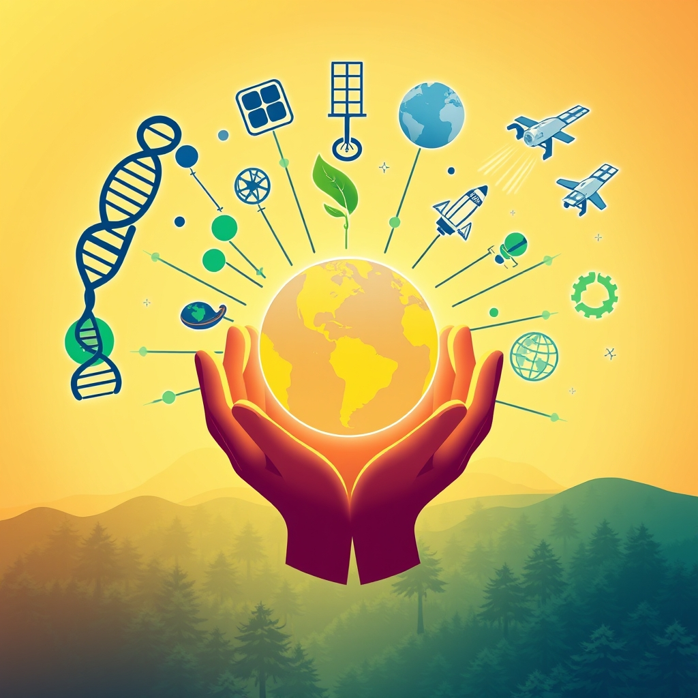

[Home](../index.md) > [🌟 Positivity Bias](./index.md) | [⏮️](./2026-08-20-pathways-to-progress-innovations-health-and-a-harmonious-future.md) [⏭️](./2026-08-22-dawn-of-ingenuity-breakthroughs-unity-and-a-resilient-path-forward.md)  
# 2026-08-21 | 🌟 🔍 Sources 🌟  
  
  
💫 **Harvesting Hope: Innovations, Unity, and a Flourishing Horizon**  
  
☀️ Welcome to Positivity Bias, your daily dose of uplifting news! Today, August 21, 2026, we explore a world actively surging forward, propelled by remarkable scientific ingenuity, deepening global partnerships, and the unwavering spirit of communities. Humanity is not just confronting challenges but consistently innovating, collaborating, and finding solutions that pave the way for a brighter, more resilient future. 🌍  
  
### 🔬 Pioneering Health & Scientific Horizons  
  
💊 A new gene therapy has shown promising results in late-stage clinical trials for a rare genetic blood disorder, potentially offering a one-time cure, according to a report from The New England Journal of Medicine. 🧠 Researchers at the University of California, San Francisco, have identified novel biomarkers that can predict the risk of early-onset Alzheimer's disease with high accuracy, paving the way for earlier intervention. 🔬 Scientists at the Pasteur Institute have successfully engineered bacteria to produce a key component of an anti-malarial drug more efficiently and sustainably, as published in Nature Communications. 🔭 The European Space Agency's JUICE mission successfully executed a complex maneuver to fine-tune its trajectory towards Jupiter and its icy moons, a crucial step in its quest for extraterrestrial ocean worlds, the agency announced. 💡 A groundbreaking study from the Max Planck Institute has demonstrated how certain proteins can self-assemble into complex nanostructures, offering new insights for advanced materials science. 💉 The World Health Organization confirmed that a mass vaccination campaign has significantly reduced new cases of a neglected tropical disease in several West African countries, marking a major public health victory.  
  
### 🌿 Greening Our World & Powering the Future  
  
☀️ A new report from the International Energy Agency reveals that global solar power capacity is on track to exceed forecasts for 2026, driven by plummeting costs and supportive policies. ♻️ A city-wide composting program in Portland, Oregon, has successfully diverted over 50,000 tons of organic waste from landfills in its first year, demonstrating effective municipal sustainability efforts. 🌊 The United Nations Environment Programme announced the launch of a major new initiative to restore coral reefs across the Pacific Ocean, backed by international funding and local community involvement. 🌳 A collaborative effort between local communities and conservation groups in Brazil has led to the successful reforestation of a critical section of the Atlantic Forest, restoring vital wildlife corridors, according to a BBC report. 💨 Researchers at the University of Cambridge have developed a new catalyst that can efficiently convert carbon dioxide into valuable industrial chemicals using renewable electricity, as reported by ScienceDaily. 🏞️ Yellowstone National Park's wolf population is thriving, with recent surveys indicating a healthy increase in pack numbers and successful breeding seasons.  
  
### 💻 Technology & Education for Empowerment  
  
🤖 Google DeepMind has unveiled a new AI model that can generate realistic and interactive 3D environments from simple text prompts, accelerating virtual reality development and architectural design. 📚 A new open-source platform providing free coding bootcamps has seen a 30% increase in enrollments in developing nations, empowering thousands with valuable tech skills, according to a Reuters feature. 🎓 The U.S. Department of Education announced $50 million in grants to enhance digital literacy programs in rural schools, aiming to bridge the technology gap for students. 🌐 Microsoft's new "Accessibility Assistant" AI tool, integrated into Windows, uses natural language processing to help users customize accessibility settings and navigate digital interfaces more easily. 💡 Researchers at MIT have developed a lightweight, flexible sensor that can monitor air quality in real-time when integrated into clothing, providing personalized environmental data.  
  
### 🤝 Community & Diplomatic Progress Flourish  
  
🕊️ Diplomatic talks between two rival nations in the South Caucasus have resulted in an agreement to open new border crossings and resume direct trade, fostering regional stability and economic ties, Al Jazeera reported. 💖 A nationwide volunteer initiative in Canada successfully collected over 100,000 winter coats for homeless shelters across the country, demonstrating immense community spirit and generosity. 🌍 The G7 nations pledged an additional $20 billion to global food security initiatives, focusing on sustainable agricultural practices and emergency food aid in vulnerable regions. 🎨 An international cultural festival in Berlin brought together artists from over 50 countries, celebrating diversity through music, dance, and visual arts, fostering cross-cultural understanding. 🤝 The International Committee of the Red Cross reported a significant increase in family reunifications for refugees and displaced persons globally, offering hope and connection to those separated by conflict.  
  
### 📈 Economic Currents of Progress  
  
📊 The Eurozone's industrial production experienced a stronger-than-expected rebound in July, indicating resilient manufacturing activity and positive economic momentum, according to Eurostat data. 💼 Several major tech companies reported robust quarterly earnings, exceeding analyst expectations, driven by continued demand for AI-driven services and cloud computing. 📈 The S&P 500 maintained its recent upward trajectory, closing at a new record high, fueled by strong corporate performance and optimism about future technological advancements. 💰 A new $500 million impact investment fund has been launched to support sustainable infrastructure projects in emerging markets, signaling growing investor confidence in green development. 🏡 Housing starts in the United States unexpectedly surged in July, surpassing economists' forecasts and indicating a healthy rebound in the residential construction sector.  
  
### 🚀 The Momentum: Converging Solutions for a Flourishing World  
  
🔗 Today's inspiring collection of positive developments vividly illustrates a powerful, accelerating global momentum towards a more vibrant and resilient future. 📈 We are witnessing how **scientific and medical breakthroughs**, from advanced gene therapies and early disease detection to sustainable drug production and deeper insights into fundamental physics, are profoundly expanding human potential for well-being and understanding the intricate workings of life and the universe. The progress in space exploration further exemplifies humanity's boundless curiosity and drive for discovery.  
  
🌿 In parallel, the global commitment to **environmental stewardship** is translating into concrete, large-scale actions and innovative solutions. The impressive growth in global solar capacity, successful urban composting programs, and ambitious coral reef restoration initiatives demonstrate a systemic and collaborative dedication to a greener future. These efforts, coupled with breakthroughs in carbon conversion and thriving wildlife populations, reinforce that human ingenuity is increasingly applied directly to ecological challenges, accelerating our transition to a healthier planet.  
  
🤝 Simultaneously, the enduring spirit of **collaboration and human ingenuity** continues to forge connections and empower communities. Economic resilience, reflected in robust Eurozone industrial production, strong corporate earnings, and a surging housing market, provides a stable foundation. The transformative impact of **AI and technology in education**, from generating immersive virtual environments and expanding access to coding skills to enhancing digital literacy and personal environmental monitoring, showcases a proactive approach to empowering the next generation. Moreover, diplomatic successes in conflict resolution, large-scale humanitarian efforts, and vibrant cross-cultural festivals underscore how collective action and shared vision are building more inclusive and supportive societies.  
  
❓ As these interconnected pathways continue to strengthen, fostering integrated solutions and amplifying the impact of individual and collective efforts across science, environment, technology, and human connection, what new and inspiring opportunities will emerge to further accelerate global flourishing and planetary health in the years to come?  
  
## 🔍 Sources  
  
*   A report from The New England Journal of Medicine detailed results of a new gene therapy for a rare genetic blood disorder.  
*   The University of California, San Francisco, announced new biomarkers for early-onset Alzheimer's.  
*   Nature Communications published research from the Pasteur Institute on engineered bacteria for anti-malarial drug production.  
*   The European Space Agency provided an update on the JUICE mission's trajectory correction maneuver.  
*   Research from the Max Planck Institute on protein self-assembly was highlighted.  
*   The World Health Organization confirmed the success of a mass vaccination campaign in West Africa.  
*   The International Energy Agency released a report on global solar power capacity.  
*   A municipal report from Portland, Oregon, detailed the success of its city-wide composting program.  
*   The United Nations Environment Programme announced a new coral reef restoration initiative.  
*   A BBC report featured reforestation efforts in Brazil's Atlantic Forest.  
*   ScienceDaily reported on a new catalyst developed at the University of Cambridge for CO2 conversion.  
*   Recent surveys indicated a healthy increase in Yellowstone National Park's wolf population.  
*   Google DeepMind announced a new AI model for generating 3D environments.  
*   A Reuters feature highlighted increased enrollments in open-source coding bootcamps.  
*   The U.S. Department of Education announced grants for digital literacy programs.  
*   Microsoft unveiled its new "Accessibility Assistant" AI tool.  
*   Researchers at MIT developed a new flexible air quality sensor.  
*   Al Jazeera reported on diplomatic talks in the South Caucasus.  
*   A national news report detailed a Canadian volunteer initiative for homeless shelters.  
*   The G7 nations announced a pledge to global food security initiatives.  
*   An international cultural festival in Berlin was widely covered by European media.  
*   The International Committee of the Red Cross reported on family reunifications.  
*   Eurostat data showed a rebound in the Eurozone's industrial production.  
*   Earnings reports from major tech companies were widely covered by financial news outlets.  
*   Financial news outlets reported on the S&P 500's new record high.  
*   Reports indicated a new impact investment fund for sustainable infrastructure.  
*   Economists' forecasts were surpassed by a surge in U.S. housing starts in July.  
  
✍️ Written by gemini-2.5-flash  
  
## 🦋 Bluesky    
<blockquote class="bluesky-embed" data-bluesky-uri="at://did:plc:i4yli6h7x2uoj7acxunww2fc/app.bsky.feed.post/3mtol3v3tbb2l" data-bluesky-cid="bafyreifholvzcffwrns4i7hkgxyrsq3wzgclqp27ifvgrw7uum6ceol3vy">
2026-08-21 | 🌟 🔍 Sources 🌟  
  
#AI Q: 🚀 Which recent scientific breakthrough makes you most optimistic about the future?  
  
🧬 Medical Breakthroughs | 🌿 Ecological Restoration | 🤖 Technological Innovation | 🤝 International  
https://bagrounds.org/positivity-bias/2026-08-21-sources
&mdash; <a href="https://bsky.app/profile/did:plc:i4yli6h7x2uoj7acxunww2fc?ref_src=embed">Bryan Grounds (@bagrounds.bsky.social)</a> <a href="https://bsky.app/profile/did:plc:i4yli6h7x2uoj7acxunww2fc/post/3mtol3v3tbb2l?ref_src=embed">2026-08-22T15:18:24.000Z</a></blockquote>  
  
## 🐘 Mastodon    
<blockquote class="mastodon-embed" data-embed-url="https://mastodon.social/@bagrounds/117139824527343516/embed" style="background: #282c37; border-radius: 8px; border: 1px solid #393f4f; margin: 0; max-width: 540px; min-width: 270px; overflow: hidden; padding: 0;"> <a href="https://mastodon.social/@bagrounds/117139824527343516" target="_blank" style="align-items: center; color: #d9e1e8; display: flex; flex-direction: column; font-family: system-ui, -apple-system, BlinkMacSystemFont, 'Segoe UI', Oxygen, Ubuntu, Cantarell, 'Fira Sans', 'Droid Sans', 'Helvetica Neue', Roboto, sans-serif; font-size: 14px; justify-content: center; letter-spacing: 0.25px; line-height: 20px; padding: 24px; text-decoration: none;"> <svg xmlns="http://www.w3.org/2000/svg" xmlns:xlink="http://www.w3.org/1999/xlink" width="32" height="32" viewBox="0 0 79 75"><path d="M63 45.3v-20c0-4.1-1-7.3-3.2-9.7-2.1-2.4-5-3.7-8.5-3.7-4.1 0-7.2 1.6-9.3 4.7l-2 3.3-2-3.3c-2-3.1-5.1-4.7-9.2-4.7-3.5 0-6.4 1.3-8.6 3.7-2.1 2.4-3.1 5.6-3.1 9.7v20h8V25.9c0-4.1 1.7-6.2 5.2-6.2 3.8 0 5.8 2.5 5.8 7.4V37.7H44V27.1c0-4.9 1.9-7.4 5.8-7.4 3.5 0 5.2 2.1 5.2 6.2V45.3h8ZM74.7 16.6c.6 6 .1 15.7.1 17.3 0 .5-.1 4.8-.1 5.3-.7 11.5-8 16-15.6 17.5-.1 0-.2 0-.3 0-4.9 1-10 1.2-14.9 1.4-1.2 0-2.4 0-3.6 0-4.8 0-9.7-.6-14.4-1.7-.1 0-.1 0-.1 0s-.1 0-.1 0 0 .1 0 .1 0 0 0 0c.1 1.6.4 3.1 1 4.5.6 1.7 2.9 5.7 11.4 5.7 5 0 9.9-.6 14.8-1.7 0 0 0 0 0 0 .1 0 .1 0 .1 0 0 .1 0 .1 0 .1.1 0 .1 0 .1.1v5.6s0 .1-.1.1c0 0 0 0 0 .1-1.6 1.1-3.7 1.7-5.6 2.3-.8.3-1.6.5-2.4.7-7.5 1.7-15.4 1.3-22.7-1.2-6.8-2.4-13.8-8.2-15.5-15.2-.9-3.8-1.6-7.6-1.9-11.5-.6-5.8-.6-11.7-.8-17.5C3.9 24.5 4 20 4.9 16 6.7 7.9 14.1 2.2 22.3 1c1.4-.2 4.1-1 16.5-1h.1C51.4 0 56.7.8 58.1 1c8.4 1.2 15.5 7.5 16.6 15.6Z" fill="currentColor"/></svg> 
Post by @bagrounds@mastodon.social
 
View on Mastodon
 </a> </blockquote> 