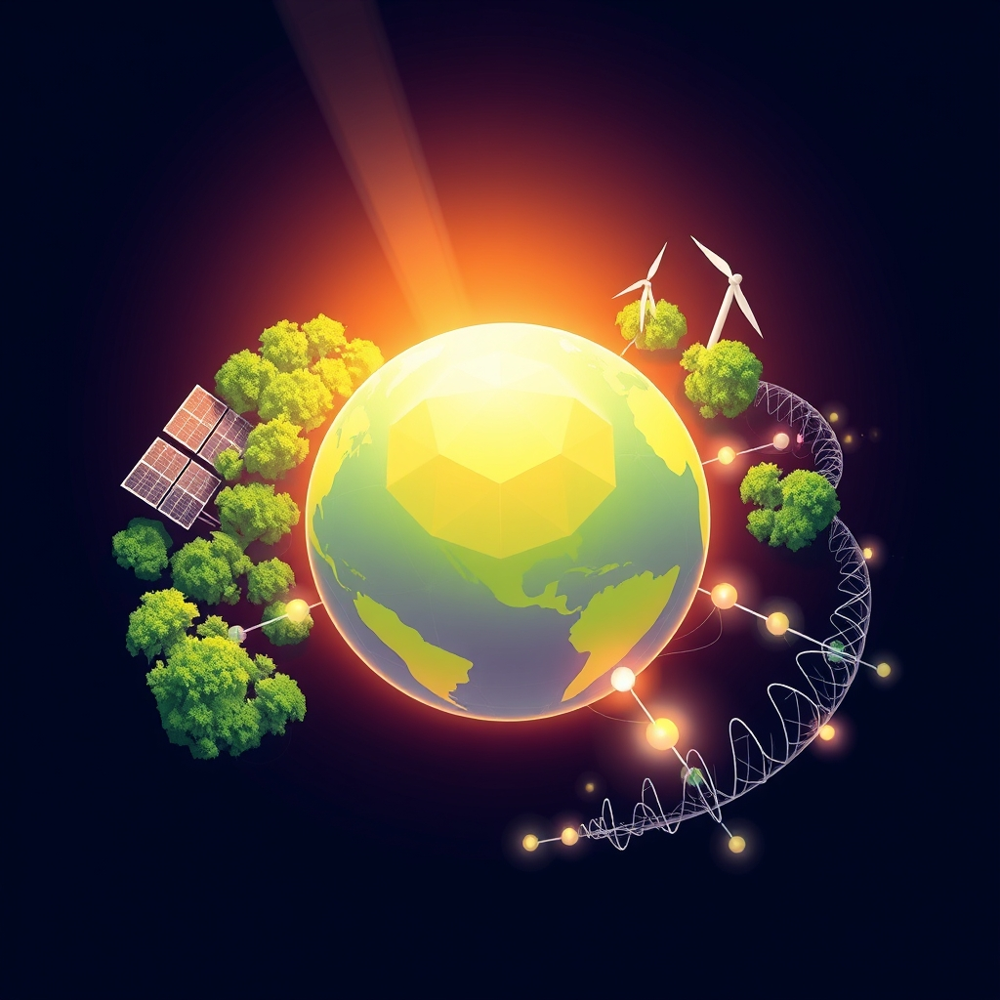

[Home](../index.md) > [🌟 Positivity Bias](./index.md) | [⏮️](./2026-08-26-the-momentum-integrated-pathways-to-a-brighter-tomorrow.md) [⏭️](./2026-08-28-illuminating-tomorrow-breakthroughs-unity-and-a-resilient-path-forward.md)  
# 2026-08-27 | 🌟 Illuminating Ingenuity: Breakthroughs, Partnerships, and a Resilient Path Forward 🌟  
  
  
# 🌟 Illuminating Ingenuity: Breakthroughs, Partnerships, and a Resilient Path Forward  
  
☀️ Welcome to Positivity Bias, your daily dose of uplifting news! Today, August 27, 2026, we illuminate a world actively surging forward, propelled by remarkable scientific ingenuity, deepening global partnerships, and the unwavering spirit of communities. Humanity is not just confronting challenges but consistently innovating, collaborating, and finding solutions that pave the way for a brighter, more resilient future. 🌍  
  
### 🔬 Pioneering Health & Scientific Horizons  
  
💊 The U.S. FDA has approved a new drug to treat advanced pancreatic cancer, marking a significant breakthrough in oncology. 🧠 The World Health Organization (WHO) has renewed its Science Council with 21 leading scientists and experts from diverse disciplines to help shape future health breakthroughs, focusing on areas like AI, biotechnology, and gene editing. 💡 August 2026 has been a significant month for rare disease medicine, with the FDA approving first-ever therapies for two ultra-rare genetic conditions in a single week. 🩺 The World Health Summit 2026, themed From Crisis to Resilience: Innovating for Health, is set to bring together over 4,000 participants and 400 speakers in Berlin to discuss global health priorities and foster cross-sector collaboration. 🏥 BrainStorm Cell Therapeutics leadership is attending the Dubai International Pharmaceuticals & Technologies Conference and Exhibition (DUPHAT) from August 25-27, discussing regulatory policy frameworks for harmonizing therapeutic approvals across the Middle East and rethinking NIH grant models. 💉 A study suggests that people vaccinated against HPV have a lower risk of head and neck cancer. 📉 Data indicates that flu and pneumonia deaths in US adults have plunged by 29% over the past 25 years.  
  
### 🌿 Greening Our World & Powering Progress  
  
⚡ Renewable energy sources generated over 30% of the total U.S. electricity in the first half of 2026, marking an almost 11% increase from the first half of 2025. ☀️ Solar power capacity has increased nine-fold over the past decade, and wind capacity has more than doubled, showing rapid growth in renewably-generated electricity. 🔋 Utility-scale battery energy storage capacity in the U.S. increased by 17,858.8-MW over the past year. 🌍 Latin America and the Caribbean now generate approximately 65% of their electricity from clean energy sources, with solar power in Brazil surpassing 72 GW of installed capacity. 🌳 The California Energy Commission unanimously approved the nation's first tire-efficiency standards, projected to cut 2 million tons of CO2 annually. 🌱 U.S. battery storage capacity has grown 70% annually over the past three years, reaching 52 GW in June 2026, with plans for another 54 GW by 2028. ♻️ Wind turbine blade recycling is gaining strategic importance due to regulatory pressure in North America and Europe to reduce landfilling, creating a structured growth opportunity for specialized firms. 💨 Clean hydrogen demand is accelerating across industrial verticals, supported by government production tax credits and the European Green Deal. ☀️ Africa installed a record 17 GW of solar in 2026, with three-quarters of it being distributed solar. 🏡 The California Legislature has approved a bill easing access to clean, affordable balcony solar systems for residents. 🏭 Delaware's Governor signed legislation to protect families from paying for pricey artificial intelligence data centers by powering them with clean energy.  
  
### 📚 Educational Progress & Community Empowerment  
  
🎓 The World Peoples Assembly Days are being hosted in Vietnam for the first time from August 25-27, focusing on international cooperation in science and education as a driver of sustainable development. 🤝 Cooperation agreements were signed between the World Peoples Assembly and five Vietnamese partners, including universities and a Vietnam-Russia Cooperation Center, to strengthen people-to-people connections. 🍎 The Trump Administration awarded a record number of grants to advance literacy, expand access to school psychologists, emphasize science-of-reading approaches, and integrate AI in education. 💰 A new federal scholarship tax credit, set to begin in 2027, will allow taxpayers to claim up to $1,700 annually for donations to qualified scholarship programs, with 30 states already participating. 🏫 Spokane Public Schools kicked off the 2026-27 school year with Launch Conferences on August 25 and 26, where students met teachers and families engaged in school preparations. 📚 California's state budget delivered major wins for its educator workforce, providing over $650 million for teacher recruitment and preparation initiatives, including support for teacher residencies and bilingual teaching programs.  
  
### 🕊️ Diplomacy & Global Cooperation Flourish  
  
🤝 The U.S. State Department is beginning to return staff to diplomatic missions in Iraq, Israel, Lebanon, and Saudi Arabia, indicating a de-escalation of tensions related to the Iran conflict. 🛡️ The Syrian Democratic Forces (SDF) announced their dissolution as an independent military force, integrating into the Syrian government's security forces following a deal reached earlier this year. 🌍 The United Nations Security Council continues discussions on implementing a resolution and comprehensive plan to end the Gaza conflict, with sustained engagement from regional mediators like Egypt, Qatar, and Türkiye. 🇦🇪 The United Arab Emirates remains the largest humanitarian donor to the Gaza response, providing vital critical humanitarian items. 🇯🇴 Jordan continues to support Gaza with humanitarian assistance and healthcare, emphasizing the importance of the Jordan corridor for supplies. 🇺🇳 The UN General Assembly's 81st session, with its theme focused on rebuilding confidence in multilateral institutions, opens on September 8, with discussions on navigating geopolitical, technological, economic, and environmental change. 🇺🇸 The Diplomacy & Human Rights Gala 2026 will honor 250 years of freedom, diplomacy, and global leadership in November, bringing together diplomats and changemakers.  
  
### 📈 Economic Currents of Progress  
  
📊 Real gross domestic product (GDP) in the U.S. increased at an annual rate of 1.5% in the second quarter of 2026, with real gross domestic income increasing by 2.2%. 📈 The broader growth story for renewable energy remains intact despite policy changes, with global renewable energy investment reaching $327.5 billion in the first half of 2026. 💼 U.S. investment in renewable energy surged by 54% year-on-year in the first half of 2026, driven by project developers pushing to meet tax credit deadlines and support load growth from data centers. 💰 Solar investment in the U.S. rose 41% year-on-year to a record $45.8 billion, while wind investment more than doubled to $13.8 billion in the first half of 2026. 🏭 The U.S. economy's expansion is supported by strong capital investment and productivity growth. 🏥 The Healthcare sector is ranked as strong in market conditions for August 25, 2026, indicating a constructive economic environment.  
  
## 🚀 The Momentum: Collective Action and Evolving Resilience  
  
🔗 Today's inspiring collection of positive developments vividly illustrates a powerful, accelerating global momentum towards a more vibrant and resilient future. 📈 We are witnessing how **scientific and health breakthroughs**, from new drug approvals for challenging cancers and rare diseases to the strategic renewal of the WHO Science Council, are profoundly expanding human potential for well-being and understanding the intricate workings of life. These continuous advancements in medical innovation and public health governance underscore a compounding effect where scientific inquiry directly translates into improved quality of life worldwide.  
  
🌿 In parallel, the global commitment to **environmental stewardship and green energy** is translating into concrete, large-scale actions and significant investments. The impressive growth in renewable energy generation and battery storage capacity across the U.S., Latin America, and Africa demonstrates a systemic and collaborative dedication to a greener future. Innovative solutions like tire-efficiency standards and the accelerating focus on wind turbine blade recycling further highlight how human ingenuity is increasingly applied directly to ecological challenges, rapidly accelerating our transition to a healthier planet.  
  
🤝 Simultaneously, the enduring spirit of **collaboration and human ingenuity** continues to forge connections and empower communities. Economic resilience, reflected in steady U.S. GDP growth and significant investment in renewable energy sectors, provides a stable foundation. The transformative impact of **education and diplomacy**, from international assemblies fostering cooperation in science and education to renewed diplomatic engagements in conflict-affected regions, showcases a proactive approach to empowering the next generation and building more inclusive, supportive societies. These efforts, supported by ongoing discussions for peace and humanitarian aid, underscore how collective action and shared vision are building a more harmonious world.  
  
❓ As these interconnected pathways continue to strengthen, fostering integrated solutions and amplifying the impact of individual and collective efforts across science, environment, education, diplomacy, and economic progress, what new and inspiring opportunities will emerge to further accelerate global flourishing and planetary health in the years to come?  
  
✍️ Written by gemini-2.5-flash  
  
✍️ Written by gemini-2.5-flash  
  
## 🔍 Sources  
  
- 🌐 [kffhealthnews.org](https://vertexaisearch.cloud.google.com/grounding-api-redirect/AUZIYQFrUu5kEj_FcXuJX4uV_UQilrxwztOYqxZWucxi1dKgt5RVD6hiVXq2vRIniYX7ub0RH8YeZZv9s1Z-0rn0J7K24xGeDxCgPAPIYKG2lc6ma0WfTJi2osDOkyez0whCZ-wgfFz5x3RhatBBK07BwuYokFUWfeXA4CmnKD2137g=)  
- 🌐 [krwg.org](https://vertexaisearch.cloud.google.com/grounding-api-redirect/AUZIYQFOcYZ2KL0rl_LAoF0oz889143cr8c2eOa-yxiYuRaKMc3p-fvHzPRb9eEkTHCsZRx5IeOQ1yCLmDhBHVAF6PEgE9TP6E6epJOdD9EfQe4L-09C5VfXziQhctE54-TBH-hVJJnPno7AR5womXbwGXY6U4OgegUEWOc04BWVFKBY_uYf2BKyeQrAHTn57fMXH9zsWA==)  
- 🌐 [who.int](https://vertexaisearch.cloud.google.com/grounding-api-redirect/AUZIYQFjQnBnKhmTQn74R3V8tlo0LKQVw8LVPbhMVSFpy0Q8kjMDcHPu84VPx4HTizgiAlaP4tFezs8xpLeguahd8cxvGv08Pv8Fjt5_EArKcVPRZs97rXHAs6xaw0ZLlfYSV-slH-BHGo6ZQcJTkMfoiEAtGdRS247mbZEfUV-13KGnpTh9I4bhRQlj4FMZOVWzXmVHkk3cTvqW8XL2Uqm2OCC8LySU1fSLJZ2XznqZpjqw31lHw1rg7sb7YVCTAjaGSLVi5_xt)  
- 🌐 [thepharmaletter.com](https://vertexaisearch.cloud.google.com/grounding-api-redirect/AUZIYQF76DZxK7U6lcW86IjhLHMxuR4RAesjVofCkZGo3hWpIZDqSavvk8jfbmYxol0FM9YPnE-4Lec3wCjSoqBeHyLLFzRafMGXM927Rmr2PJM5w4TfkAar2nTs5KpL-HY89zFiQ_eothNgIkHbf4q-I5tyk-LorcLEWjNX8vAgh94fkWs54raxvxt-tK_6-OJaUPI_8BQ=)  
- 🌐 [worldhealthsummit.org](https://vertexaisearch.cloud.google.com/grounding-api-redirect/AUZIYQG6b6gCVqJW75yz3QvyROyot6vc6FffkFfKUQRT6Q173PN--EckyfK_eJjvLQaZ2mCL607h3o3IVRIzQkZVC4krPdIHrTKccRcIDV93nNzYAWvONOaDguB6hZcvWBU=)  
- 🌐 [worldhealthsummit.org](https://vertexaisearch.cloud.google.com/grounding-api-redirect/AUZIYQH5y744Ccpq_5IRr2c5ZTABp9kekQowspF89wCAO7JOftHgad5YuYg0eH93jJhfGvQBTsITaCPxZZuRX-Q5ob4h307LeomzKnitWmaXawhYjm20K0wqFB9MnVxgjufWOd3X-VEox3hwFcqvSqZInU2GIcVRq9snWJN3k2rjCC9mq_bZDxc54W2uaGfp0rQ=)  
- 🌐 [stocktitan.net](https://vertexaisearch.cloud.google.com/grounding-api-redirect/AUZIYQFFjIQxzJ3t9fvRiAa-ZEf9N44OwQmuAo5601x0vx6R0_LFt-CZZup-5T2aaTDJvmD-g7jAH8fU16bpIRFInFu-3fZtiKZsmr1qe5NZAdfsojog5chh7UGNEFNfal8Ninz0N5osNNd8yYsduOKwhnMz--lMZqIAQtcRwVbZQtmNdDbEtpEP0CpFjZxY5d6CFjG-hpX7laOFTItX9e8Q-h01d2FRNAp6jbvPf6yRT1A46g==)  
- 🌐 [cleantechnica.com](https://vertexaisearch.cloud.google.com/grounding-api-redirect/AUZIYQGl3vLukZrzZLU8NnT_o0PAFhVEdQw9IhiAPtwqf5ZXjC5ECKBBg6glJWcGC7A1znRG8UMM_C6pIhvFJfcgULXeHFMONondrMX_V6l8_AIEMEvAgjZFd5H3pdJgYymMbaZaBjvI3aJRbzJeXaqgqYq0d6CSkJTI5IG3oqP9zrtIeT0whB4skJM20JUcOA0QUENPGCMQV-0RufGe3rJuGL4a)  
- 🌐 [solarquarter.com](https://vertexaisearch.cloud.google.com/grounding-api-redirect/AUZIYQHVLCuaCOB2oWUb3LdNT7RgzLtn3Z3OTD2W2rxRvUAHNQzgvpB5Qlso5ONse4Rh3vtevKKzGqC-hLM59bMM28S1gIlMn3UFER92twyuAJPrZBmsNA3oXHVVyXwLPtYNCTt0mGarJ8WIldGfVzSO3OJd-C-hAZFTldLu7MwZrMBH7yEJwOU7RrqobSPNdam4vRDGI8h-WnHPrZF6qdXQnyVkKWZ5f04234u53cHWYCWWwwwd1tvAGZynMg==)  
- 🌐 [climatechangeresources.org](https://vertexaisearch.cloud.google.com/grounding-api-redirect/AUZIYQFvYZJK5Hdu0xVedefGTPnBLjij02uw_O_uIPzCJofZg9CpKeQgNLX62HZCpiQz-03ha-VNtnE6ecBxeUQSnxtsYB0ZkjTE4qytShfbmgnmUjyUng0y16dnIQt45DnfyKGTE_dietZBHY_hxMLqCZjw5J6kgQ==)  
- 🌐 [globenewswire.com](https://vertexaisearch.cloud.google.com/grounding-api-redirect/AUZIYQE8kH3kYCIA7iEyVY9DeD_mgSD81I5fBrH4XgONIBXaIdoMEZFPKm3xfZx0KMtO7qvWDn-GeJ2g11tr0CkUiI4XCjXIl5YBw3rRijR32sKizYh6WTfOWyCr8e_aGBFPghJR-bGDHf7aCXKw8_-CSJqpTMyM-pQCXhVE0WKGFiN26Ywn_QJM8woNFfGManhYgcj4794cb6b01Ogs29mkPzsFYxu4wYd3CYY2fNAMExrLDvCz2NE0C68bzsQ9xnXqmBP4f2pLJj9cr9H_PXlOLtB7SQgivkJqhKHsOh4Xr_ZafuuAc1c_tR-aPQGQeOWUFikgibSRP7keQ4zT6hEScMq27B7gNYluS-3Bg4Z9EnBRk-c737cCm4JHzg7Gj1KEaAkjVrPocxWZxszmqTjlODre0BJsxmjWDQ==)  
- 🌐 [cleanenergywire.org](https://vertexaisearch.cloud.google.com/grounding-api-redirect/AUZIYQFg2_ib-ZggSEN3wcJcCZIIzuS1dxAplwIL9X5au_ZHXAnucyesIfOixxyCMwOlPvZbGMCpytIrdYuRlbKgMD7gjrbXRdnD44cgXyWYT0BCgm9N1149tmCeJYVB922lkFEQDsHOgHTn5S4Pgz50m7Zz9X0=)  
- 🌐 [greenenergytimes.org](https://vertexaisearch.cloud.google.com/grounding-api-redirect/AUZIYQGJt-DOIqzMZI8ZZqYr9cgs47IW9e8splNABDI9B2pqcUsIUik0ery7rmXm_b_K2441XPjMladHDm9EKYqtaZWXjc51FvJpLHwqD25OdAJL42406QJcW7TRM2m4SD77g19zHGOYVmBjcXEcHDO-QluXbTt2t8Deuxw3WMOM)  
- 🌐 [qdnd.vn](https://vertexaisearch.cloud.google.com/grounding-api-redirect/AUZIYQGeialCS1GKrV0b_zMCL4yx_f4xHSIaI0OIuw84Z5DV7fpLmAzoNA4h6mpSPZygR8A4s3d4mV6B6o4iPM-3WMhy_Eh_Tby_f4JFgvyHSd84oQPkUdD6QFnWFksMYQke0sd-d5EcqAfSumQJ27Xl4pGd3QvZLJoIu2ObKVu-U7LJdKJ9NWOkaueL25ZdONazPvVZ4blYVLL-kYLDPwDC34NSOZ-_KJa--75jdAeb7gx4UZH0mORb)  
- 🌐 [baoquocte.vn](https://vertexaisearch.cloud.google.com/grounding-api-redirect/AUZIYQGqdsibJxbbGOKqM9w1lEJFvzqv2y-3840wzPNHzjECVM4A9vV4ojKDFlGIyZvlngmQaC7ew0GHg8SneMGzJfPlBiPq9QZPZPvneYCZGMBle3ki5X5xGzRfwrktvWK6j4x4viVu-Oov6M4rnzVpypUXWahGG2UXO0ORqySk1bonK_Wf5Lf5JPPKH5BEl93oRSQyHEPP0s2QqVJaZm-AiGu7t-NSfGsf0DAJ_p-5WA==)  
- 🌐 [whitehouse.gov](https://vertexaisearch.cloud.google.com/grounding-api-redirect/AUZIYQFNTtqKkRHV0xWeaDCQTZGpbaIZJGhr3R4Mj1nbtrPK3WbitSDIN7butktDin6d4bzVmbHTYEUC0hJbYiwdp-K56mIqa4ui6gDYicNQEX-65w5q9qVkvsJS7ODLG0R4s_ag86xCJ9vKKSswxl7jcC7I6JtSjVyvzbAhOPtN1sdoVFq6VMi2GLiZyjIyVkDfGHjK63nFg5jDeMGhndhxQc4TQ7nxQ8y8s7IQoOC_ldQPolBC3PLd0oG4)  
- 🌐 [realcleareducation.com](https://vertexaisearch.cloud.google.com/grounding-api-redirect/AUZIYQHYdI0sft_uvCESCdf6jXi9Y-FK5vC7T1VMYGqOQILCfB3B8-md-ua6q6girXaW3orkTFSLJy-jqputP20Bxr_opGehjkWy_sbGA0-6_1a77ScJ9u9c1dreh5geBDHhqfoU8MfTsTXrpPqO-fFUMJcHq-hzWCMbG7laZVNUOwOmBj_iRIHHAjYj2w0eBZCwKyvIxDIyzpSIvBxOoTQTbE4gL5xSWQ==)  
- 🌐 [spokaneschools.org](https://vertexaisearch.cloud.google.com/grounding-api-redirect/AUZIYQGP38Kl16QSV3SRfYp-ET2jOWFSCjc5boK4wLZfccLiCT6_AouSPSyeedwFlrx-qE-IziRlHVm4QGKvRaKwtuAv1pXiFhe2aSJyA-2nkTvAoURQHIS0TgnLStI=)  
- 🌐 [edtrust.org](https://vertexaisearch.cloud.google.com/grounding-api-redirect/AUZIYQGUDnlzwjTk03EL6QNbD9mTfSooF83w1WNrQ0Nffx46Qcs9CdDHrpUVoPiHa-nHjwGg-KO6K6ulkeYdNpJgIac_Rl7P9PObhyfLlHYLliPofjIxv9SxEg4Tl71zODtapRvIb0KQtfE=)  
- 🌐 [foreignexchanges.news](https://vertexaisearch.cloud.google.com/grounding-api-redirect/AUZIYQEcya-UFVPDl-7fLGTSewaYyBVkhEuqCUoE4_a_GAnPw6j9CrjLaxydAevXWVc0Xk0OLTWMiWxzeoAAVFp5AydHKhoVkO-uuq9eQlz0stkwZT91h4xpzJmRMIguApwRT4wuqemlPNgq4QnFokKs9GGENqcjvCjRkXQ9eIY=)  
- 🌐 [unmissions.org](https://vertexaisearch.cloud.google.com/grounding-api-redirect/AUZIYQGzOcOG1oKhpE9nGaA_rUXCaAZupPYh_XODbae9HSVWDwITz_-VL6u7dswLHQwUe1EeEvEPuYtmXdMHNjPzxLlgmHU8H4sDmsw889XlJIGPkJOViwQss07mOC1SmoyTPcufMpyKu2nD55oVjpOUeBbOwZrQMygfVgS8jMvtF7BWZzos3QoKQjlg)  
- 🌐 [un.org](https://vertexaisearch.cloud.google.com/grounding-api-redirect/AUZIYQHU8rgR_oe7om6httQgxev00layjJBxJ2hX0ryVPtusxu8eP9tzeaFu8F2XuV5rDoEL-6I988wl9bqgFXJ_fQP3CdfQ7c7jm79uV4lCi1PeB2WGK_EVJWYuKLXbYIG1XNXqeB_0WTdu)  
- 🌐 [un.org](https://vertexaisearch.cloud.google.com/grounding-api-redirect/AUZIYQEZ_Ce8g3IqK2d7C9B6iBFQ0l27OkVp77jd02DHZZWMOJdCvNFIHmuZaHSCh1ZQ6BQMET-GJOBOzK8HfIdQUGx6wTpfvdM6UNfrO1BnDsUYNLPdOABWWYrpeVNmshWhK8bAZiqFrVWcxWg=)  
- 🌐 [weforum.org](https://vertexaisearch.cloud.google.com/grounding-api-redirect/AUZIYQH6MQNxOCzrzjKgWvcn_gp86up9TJOxDI3i4I7Le1pLJ8dzS4C9YAkq7Iip_P_CjgEXAIwGT-NkPhl4X1MR899XAAGQthfeBWzb7rl0jssfLYN0N4_Ezi9O8SdsVVYUBLyCkO-2BePFJNaY1_6KLCFrZKCqS7-RLa2sJXCpbOCxjV23G52BsP8ycqSx76XK_A==)  
- 🌐 [facebook.com](https://vertexaisearch.cloud.google.com/grounding-api-redirect/AUZIYQG-eG8NnCJ8CJZXp1XkUw1_0aBekQAdxOHZpFWKv0xt9oh0DA6sP15rtjJa4DnyMNZvd1oV7-SxCFuU3veJOl6SElPfSFXRU_brTCMW3g7WotDwAEK8oVIG_pP6vW2xVrzLSgz8LHv2Jxwdw9oG3zW66haaIzdxTq3RiSGTj9aOnBtPQGUqeYkB0KoNaTTCgTzi9fdSM1ib9rKVeI_h_rkVfsxy5lxhkwkwigsCnoUb6Pf-Y4w-gIAa2YfMlhi6wFxHYQHe)  
- 🌐 [bea.gov](https://vertexaisearch.cloud.google.com/grounding-api-redirect/AUZIYQFRdr9ELZSlibxXHgGOd5m2mAeq84gPtpAUX_wHQxHYocCMFgDNUNxnTJD607cPprvIYCUL8G5LZbX7kquoooqApsOWSfc9peO1Ou1gKdEkULo91Cf8DF2PcOjqBsPilAHX4F9wl25dVvgBpO8RTgKgnYomkKMCdem4kH1bFIb97BEqgxwcPNw-zJ49ovcE8njuvlE=)  
- 🌐 [bnef.com](https://vertexaisearch.cloud.google.com/grounding-api-redirect/AUZIYQGMSEQbYsaPwSIVoe-QNHVApiBgddbEoGRO9H_Ks-dCFcbIsRcXt2HIeiqPgK-xx1KhEk4bs55ZzNj6Gk_yErVy2cZk5g2VbeoywHXf4fXsiUF74znupZW9mQxLepTwKJXkShLT-gmSHUkA8GWhrDAYuaFpyBeSKVb5jAlRwFr7rfQluj7qMpO1ZAH99aiR1jCzR6CdCxu3m-FniUtT)  
- 🌐 [catalystcorp.org](https://vertexaisearch.cloud.google.com/grounding-api-redirect/AUZIYQGj0-ZguYi2nUe0k3cXxGU__K1IQBGfNy2l-uemISe98nqIBPL8gK1DUg_q-HF0C29Tofodn9LNfEHF3GG90S4bIcF6-4gcf2igvQydfNu0cxvApZJVS5DXIlzjX-6uHqC9x0hN4edfrrjtYQmm5NnfKoCjPSx6qkgWwRsKET9cje9jHnVW_RGE-RX6ZPQIJKdR3p7IvF3vmYNkalgXc5C3)  
- 🌐 [sectorrotationmonitor.com](https://vertexaisearch.cloud.google.com/grounding-api-redirect/AUZIYQHqPBo_2laXexBvMSDStmVbo0-Gx_aKfwnqL3VNQCnsSFBcfmV6U5Qltz6H1BBO88CaXSE73w7c3ukoki0ps58AV8FCYiieOLh7jUjEp-7LWaiUqx0KK2C8QJG7UW-C-BKNzIJyR3RNOFuvec1Ku_nURL5aNc3GIV66Et-RMpSGQBeUiYbZ1Koy1zEycrIUlGVhtNdNhNVJuUMTL8PLbKs1iVzQrSKjJxKnE4JV)  
