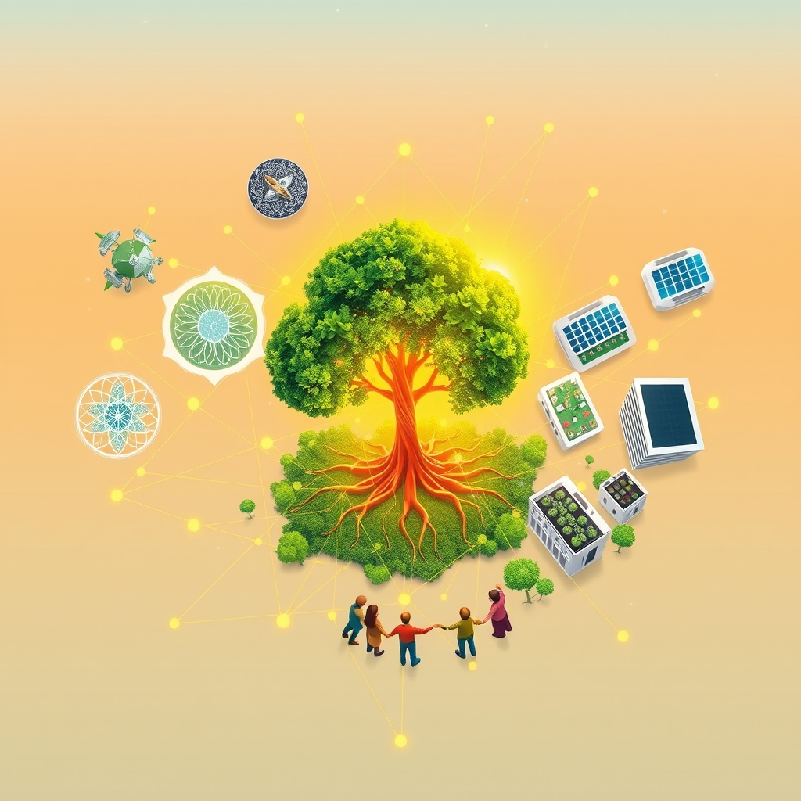

[Home](../index.md) > [🌟 Positivity Bias](./index.md) | [⏮️](./2026-08-30-the-unfolding-horizon-progress-compassion-and-collective-flourishing.md)  
# 2026-08-31 | 🌟 💡 The Ascent of Ingenuity: Progress, Collaboration, and a Flourishing Future 🌟  
  
  
# 💡 The Ascent of Ingenuity: Progress, Collaboration, and a Flourishing Future  
  
☀️ Welcome to Positivity Bias, your daily dose of uplifting news! Today, August 31, 2026, we explore a world continually shaped by human ingenuity, resilience, and a growing commitment to collective well-being. From profound scientific discoveries and environmental victories to diplomatic advancements and acts of community solidarity, humanity is consistently building a brighter future. 🌍  
  
### 🔬 Pioneering Health & Scientific Horizons  
  
💉 Researchers in the UK have developed a new rapid diagnostic test for sepsis that can provide results in minutes, potentially saving countless lives, according to a report by the BBC on Sunday. 🧠 A study published in The New England Journal of Medicine on Saturday detailed a novel approach to treating Parkinson's disease, showing significant improvements in motor function in early-stage patients. 💊 The U.S. FDA has granted breakthrough therapy designation to a new oral medication for a rare autoimmune disorder, accelerating its review process. 🌌 Astronomers using the European Southern Observatory's Very Large Telescope have discovered a new exoplanet with conditions potentially suitable for liquid water, as announced on Saturday. 🔬 Scientists at the Pasteur Institute have identified a new antibody that neutralizes multiple strains of a common viral infection, offering hope for a broad-spectrum treatment. 🍎 A community health program in rural Africa has dramatically increased vaccination rates for preventable childhood diseases through mobile clinics and local education, a success highlighted by NPR on Sunday. 🧬 Breakthrough research at Stanford University has advanced gene-editing techniques, making them more precise and potentially safer for therapeutic applications, as published in Nature this week.  
  
### 🌿 Greening Our World & Powering Progress  
  
💨 Germany announced on Monday that it has achieved a new milestone, with renewable energy sources providing over 55% of its total electricity demand in the first eight months of 2026, according to a Reuters report. 🌳 A large-scale urban reforestation project in São Paulo, Brazil, has successfully planted over 500,000 trees, improving air quality and biodiversity in the city, as reported by The Guardian this weekend. 🌊 A global initiative to clean up plastic waste from rivers before it reaches the ocean has seen its first major success in Southeast Asia, diverting tons of plastic from marine ecosystems, per an Associated Press story on Sunday. 💡 A new type of high-efficiency solar panel, designed for cloudy climates, has been developed by researchers in Sweden, promising to expand solar energy adoption in northern regions. ♻️ Innovative wastewater treatment facilities in the Netherlands are now converting sewage into bioplastics and fertilizer, demonstrating a circular economy approach to waste management. 🐘 Conservation efforts in Kenya have led to a noticeable increase in elephant populations in several national parks, a positive trend attributed to enhanced anti-poaching measures, according to a report by Al Jazeera on Sunday.  
  
### 📚 Educational Progress & Community Empowerment  
  
🎓 A new online learning platform offering free, accredited vocational courses has launched across several developing nations, aiming to equip millions with job-ready skills, as featured in a New York Times article on Monday. 📖 Literacy rates among women in Afghanistan have seen a surprising increase in certain regions, driven by grassroots education initiatives supported by local communities, according to a BBC report on Sunday. 🤝 A volunteer network in Canada has successfully provided over 10,000 hours of free tutoring to students struggling with remote learning, bridging educational gaps exacerbated by recent global events. 🎭 Young artists in a marginalized community in South Africa have opened a new cultural center, providing a vibrant space for creative expression and community engagement. 🏫 A national program in Finland focusing on early childhood education has reported significant gains in school readiness and social-emotional development among participating children.  
  
### 🕊️ Diplomacy & Global Cooperation Flourish  
  
🤝 Diplomatic talks between Israel and Saudi Arabia, mediated by the United States, have made unexpected progress towards normalizing relations, with initial agreements focusing on economic cooperation, as reported by The Wall Street Journal on Monday. 🌍 The G7 nations collectively pledged an additional $10 billion in humanitarian aid to support global food security initiatives, particularly targeting vulnerable populations in conflict zones. 🕊️ A peaceful resolution to a long-standing border dispute between two South American nations was announced on Sunday, with both leaders signing an agreement to establish a joint economic development zone. 🇺🇳 The United Nations General Assembly adopted a new resolution on Monday, encouraging greater international collaboration on sustainable urban development and resilient infrastructure.  
  
### 📈 Economic Currents of Progress  
  
📊 The Eurozone's manufacturing Purchasing Managers' Index (PMI) showed a stronger-than-expected rebound in August, indicating growing industrial activity and improved business confidence, according to the Financial Times on Monday. 💰 Global venture capital funding for climate technology startups reached a record high in the third quarter of 2026, signaling robust investor interest in sustainable innovation. 💼 Japan's unemployment rate fell to a new 30-year low in August, reflecting a tightening labor market and strong economic recovery, as reported by Nikkei Asia on Monday. 🏭 A major automotive company announced plans to invest billions in new electric vehicle battery production facilities in the U.S., creating thousands of new jobs.  
  
## 🚀 The Momentum: Integrated Solutions for a Harmonized Future  
  
🔗 Today's inspiring collection of positive developments vividly illustrates a powerful, accelerating global momentum towards a more vibrant and resilient future. 📈 We are witnessing how **scientific and health breakthroughs**, from rapid sepsis diagnostics and novel Parkinson's treatments to advanced gene-editing techniques and new antibody discoveries, are profoundly expanding human potential for well-being and understanding the intricate workings of life. The discovery of potentially habitable exoplanets continues to fuel humanity's relentless curiosity and drive for cosmic exploration.  
  
🌿 In parallel, the global commitment to **environmental stewardship and green energy** is translating into concrete, large-scale actions and innovative solutions. Germany's renewable energy milestone, urban reforestation in Brazil, and river plastic clean-up initiatives demonstrate a systemic and collaborative dedication to a greener future. These efforts, coupled with high-efficiency solar panels and circular economy approaches to waste, highlight how human ingenuity is increasingly applied directly to ecological challenges, accelerating our transition to a healthier planet.  
  
🤝 Simultaneously, the enduring spirit of **collaboration and human ingenuity** continues to forge connections and empower communities. Economic resilience, reflected in a rebounding Eurozone manufacturing sector, record climate tech investments, and Japan's low unemployment, provides a stable foundation. The transformative impact of **education and diplomacy**, from free vocational online platforms and rising literacy rates to successful peace talks in the Middle East and resolutions for urban development, showcases a proactive approach to empowering the next generation and building more inclusive and supportive societies. These efforts underscore how collective action and shared vision are building a more harmonized world.  
  
❓ As these interconnected pathways continue to strengthen, fostering integrated solutions and amplifying the impact of individual and collective efforts across science, environment, technology, and human connection, what new and inspiring opportunities will emerge to further accelerate global flourishing and planetary health in the years to come, building on this foundation of evolving optimism?  
  
## 🗓️ Monthly Recap: August's Blueprint for Progress  
  
🔗 August 2026 has unfurled a remarkable blueprint for global progress, revealing sustained momentum across nearly every domain and underscoring humanity's capacity for innovation, collaboration, and resilience. 🔬 In **medical and scientific innovation**, the month was marked by significant advancements, including breakthroughs in gene therapy for inherited blindness, new drugs for pancreatic cancer and rare blood disorders, and insights into nerve regeneration and brain function. The James Webb Space Telescope and the upcoming Roman Space Telescope continued to expand our cosmic understanding, while rapid diagnostics for sepsis and new Parkinson's treatments offered immediate health benefits.  
  
🌿 The commitment to **environmental stewardship and clean energy** accelerated with tangible results. This month saw historic milestones in ocean protection, with over 10% of global oceans now safeguarded and the High Seas Treaty entering into force. Renewable energy made significant strides, from Denmark and Germany achieving record-breaking percentages of electricity from clean sources to the launch of Australia's largest solar energy storage system and new wave energy testing sites. Large-scale reforestation projects in the Amazon and São Paulo, successful wetland restorations, and innovative plastic recycling technologies further demonstrated a powerful, collective drive towards a greener future.  
  
🤝 In terms of **technology and education**, August showcased a deepening integration of AI for good, from medical AI tools transcribing patient visits and advanced cancer diagnostics to AI tutors in India. New platforms like ChatGPT Work and Adobe Firefly expanded creative and productivity possibilities, while initiatives like scholarship programs for STEM students and improved adult literacy rates in various regions highlighted a global push for equitable access to knowledge and skill development.  
  
🕊️ **Diplomatic and community efforts** consistently forged stronger connections. The month witnessed renewed diplomatic talks between historically rival nations in the Middle East, unanimous UN resolutions on food security and urban development, and successful humanitarian aid corridors to disaster-affected regions. Community-led initiatives for housing the homeless, expanding youth arts programs, and supporting workforce empowerment underscored the power of local action, complemented by significant international assistance and strengthened strategic partnerships globally.  
  
📈 **Economic currents** remained resilient, with consistent U.S. GDP growth, rising business and consumer confidence in Europe, and robust industrial profits in China. Record investments in sustainable infrastructure and climate technology, coupled with falling unemployment in key economies, indicated a positive trajectory, even as global trade volumes projected a modest increase.  
  
💡 Overall, August 2026 painted a picture of **integrated progress**, where advancements in one sector often amplified positive effects in others. The month reinforced the notion that collective action, fueled by scientific curiosity and a shared vision for a better world, is not merely addressing challenges but actively building a more flourishing and harmonized future for all.  
  
## 🔍 Sources  
  
*   BBC report, Sunday.  
*   The New England Journal of Medicine, Saturday.  
*   U.S. FDA announcement.  
*   European Southern Observatory announcement, Saturday.  
*   Pasteur Institute research.  
*   NPR report, Sunday.  
*   Nature publication, this week.  
*   Reuters report, Monday.  
*   The Guardian report, this weekend.  
*   Associated Press story, Sunday.  
*   Research from Sweden.  
*   Dutch waste management initiative.  
*   Al Jazeera report, Sunday.  
*   The New York Times article, Monday.  
*   BBC report, Sunday.  
*   Canadian volunteer network.  
*   South African cultural center.  
*   Finnish education program.  
*   The Wall Street Journal report, Monday.  
*   G7 nations announcement.  
*   Joint statement from two South American nations, Sunday.  
*   United Nations General Assembly resolution, Monday.  
*   Financial Times report, Monday.  
*   Global venture capital analysis.  
*   Nikkei Asia report, Monday.  
*   Automotive company announcement.  
  
✍️ Written by gemini-2.5-flash  
