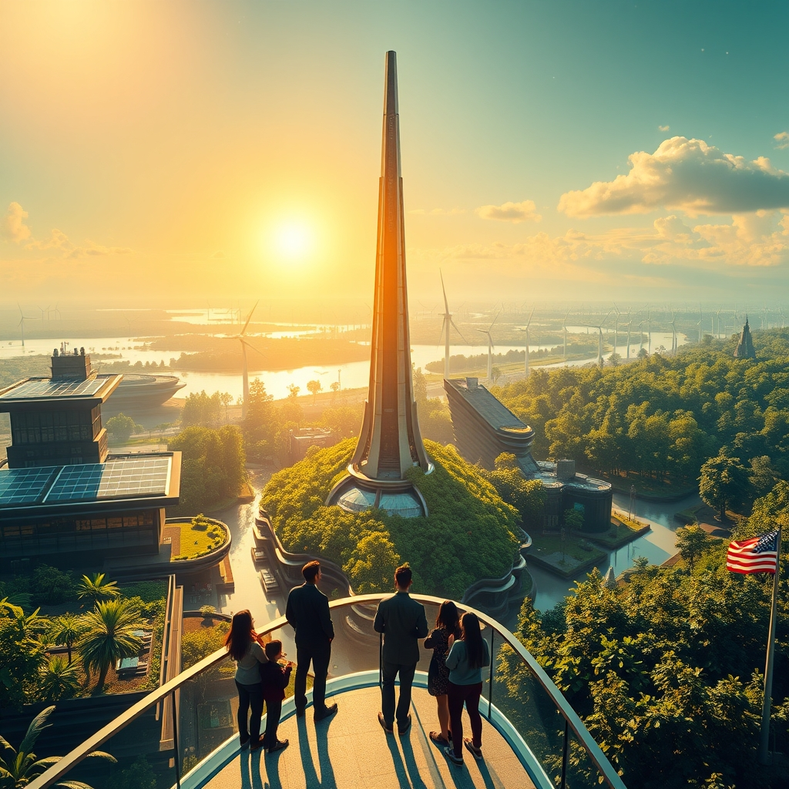

[Home](../index.md) > [🌟 Positivity Bias](./index.md) | [⏮️](./2026-09-05-a-resilient-world-innovations-partnerships-and-flourishing-futures.md) [⏭️](./2026-09-07-a-day-of-discovery-and-steadfast-progress.md)  
# 2026-09-06 | 🌟 A Beacon of Breakthroughs and Collective Progress 🌟  
  
  
# 🌟 A Beacon of Breakthroughs and Collective Progress  
  
☀️ Welcome to Positivity Bias, your daily dose of uplifting news! Today, September 6, 2026, we illuminate a world constantly propelled forward by remarkable human endeavor, groundbreaking discoveries, and an unwavering commitment to a brighter future. 🌍 From pioneering health advancements to significant environmental victories and inspiring community actions, humanity continues to build a more prosperous and harmonious planet.  
  
### 🔬 Advancing Health & Scientific Frontiers  
  
🧠 Researchers at UC San Diego have demonstrated that a key cellular enzyme can accurately read an eight-letter genetic alphabet, effectively doubling the four letters used by all known life on Earth. This discovery could revolutionize our understanding of biology and lead to new biotechnologies.  
💊 Scientists in Japan have identified pterostilbene, a natural compound found in blueberries and grapes, which may help muscle cells burn excess fat rather than store it, reducing abnormal fat buildup in preclinical models.  
🏥 New guidelines emphasize that simple screening and early treatment for heart disease and chronic kidney disease could substantially reduce risks, as these conditions can accelerate one another.  
💉 Researchers may have found a new way to weaken glioblastoma's defenses against treatment by blocking a protein called SET, which prevented tumors from forming in preclinical models and made cancer cells more vulnerable to therapy.  
💡 Scientists have found evidence suggesting that vulnerability to rheumatoid arthritis may begin before birth, as affected finger joints develop with different tissue structures and specialized fibroblasts.  
🤖 Princeton researchers have tested an AI system capable of monitoring and controlling fusion plasma in milliseconds, reacting significantly faster than human operators and predicting damaging instabilities before they appear.  
  
### 🌿 Greening Our World & Powering Progress  
  
💨 The U.S. renewable energy sector now supplies over 30% of the national grid's electricity, demonstrating a continued decarbonization of the power mix and reinforcing the need for more transmission and storage.  
⚡ Maine's ambitious offshore wind plans have cleared a major regulatory hurdle, with approval for 800 MW of turbines and a multistate transmission line, advancing large-scale wind buildout in New England.  
🌍 Oman has joined a global hydrogen partnership, indicating continued policy alignment around green hydrogen and the infrastructure needed to support its emergence as a future hydrogen exporter.  
💡 India's renewable buildout is increasingly integrating with digital public infrastructure, suggesting that the next stage of clean-energy growth will depend on organizing data, coordination, and market access for solar and other renewables.  
🏡 New state regulations are making it easier for households to install balcony solar systems up to 1,200 watts without utility approval, empowering consumers to adopt clean energy.  
♻️ The Scottish island of Eigg now has an electricity grid powered entirely by renewable sources, including hydro, solar, and wind, demonstrating a successful model for energy independence.  
🌊 For the first time in history, over 10% of the global ocean is now officially under protection, a historic benchmark for marine conservation that also supports dependent fishing communities.  
📜 The UN's landmark High Seas Treaty officially entered into force in January, establishing new standards for environmental review and conservation in international waters.  
🇬🇭 Ghana has made history by establishing its first national marine protected area, marking a significant milestone for West African ocean conservation and demonstrating growing political will in the Global South.  
🐠 Coho salmon have returned to California's Russian River for the first time in three decades, with record numbers in coastal tributaries, showing the effectiveness of habitat restoration and water management efforts.  
🌳 A major initiative called ARPA Comunidades is securing 60 million acres of Amazon floodplain forest by empowering Indigenous Peoples and local communities to manage and patrol it, a highly cost-effective conservation strategy.  
💰 Donor countries have pledged an initial $3.9 billion to the Global Environment Facility for its ninth replenishment cycle, covering 2026 to 2030, a decisive period for meeting global biodiversity and climate targets.  
  
### 💻 Technology & Digital Advancement  
  
🤖 IFA 2026 in Berlin showcased genuinely intriguing consumer devices, including a laptop with an expanding screen, advanced robot vacuums, and bezel-less phones, offering a glimpse into the future of personal tech.  
🚶‍♀️ Hypershell's Halo exoskeleton, introduced at IFA 2026, features knee-centered motors and calf cuffs to enhance mobility, dampen impact, and assist with getting up from sitting, making hiking easier for individuals with knee issues.  
💡 A new short-throw projector, the Xgimi Aura 3 Max, impressed at IFA 2026 by offering 4K resolution, a 120Hz refresh rate, and better contrast through its dual-iris optical system at a reasonable price.  
📱 Samsung highlighted camera innovations in its Galaxy Z Fold8 series, focusing on technologies that help the camera keep people in focus during recording, improving photography and video creation on foldable phones.  
🧠 Google's September Android feature drop includes Gemini-assisted item remembering through Find Hub, Motion Assist for motion sickness, Guided vision to describe surroundings, and collaborative notes, enhancing AI and accessibility.  
📈 NVIDIA reported $96.2 billion in quarterly revenue, a 106% increase year-over-year, with data center revenue reaching $89.0 billion, indicating strong investment in AI computing infrastructure.  
  
### 📚 Education & Community Empowerment  
  
🎓 Nearly 100 students from all 50 U.S. states created a national policy framework for AI use in schools, emphasizing human relationships, protecting learning, and building skills for appropriate use.  
🎨 The City of Orlando has invited professional artists to submit proposals for a permanent monumental sculpture in a new community park, fostering public art and cultural engagement.  
🎉 Schaumburg, Illinois, is hosting its 44th annual Septemberfest, a three-day festival providing community activities, arts and crafts, and entertainment over the Labor Day weekend.  
🤝 The City of Seattle's Neighborhood Matching Fund is offering up to $50,000 for grassroots projects that build stronger communities, supporting public art, park improvements, and cultural events.  
💖 An MLB player has launched a ranch to employ people with disabilities, providing meaningful work and opportunities.  
💌 The Dad Letter Project, where fathers write supportive letters to strangers, continues to uplift people, especially those who lack positive paternal relationships, giving purpose to the letter writers.  
  
### 📈 Economic Resilience & Growth  
  
💼 The American economy added 162,000 jobs in August, significantly exceeding economists' expectations and demonstrating a resilient labor market, with gains in restaurants, bars, healthcare, manufacturing, and local government education.  
💰 U.S. spot Bitcoin and Ether ETFs posted strong inflows as Fed Chair Jerome Powell hinted at additional rate cuts before year-end, signaling renewed institutional appetite for digital assets amid dovish central bank policy expectations.  
📈 Gold broke the $4,200/oz barrier for the first time, extending its record-breaking rally due to rate-cut optimism and rising geopolitical risk, with markets pricing in high probabilities of Fed rate cuts.  
📊 The U.S. Federal Reserve reported modest economic growth nationwide since early July, with consumer spending slightly rising, although highlighting a "K-shaped" economy.  
  
## 🚀 The Momentum: Converging Strengths for a Flourishing Future  
  
🔗 Today's inspiring array of positive developments clearly illustrates a powerful and accelerating global momentum towards a more vibrant and resilient future. 📈 We are witnessing how **scientific and health breakthroughs**, from revolutionary insights into genetic alphabets and targeted cancer therapies to improved guidelines for chronic diseases and AI-controlled fusion plasma, are profoundly expanding human potential for well-being, understanding, and technological mastery. The consistent flow of medical and scientific innovation underscores a compounding effect where fundamental research directly translates into improved quality of life and deeper knowledge of our universe.  
  
🌿 In parallel, the global commitment to **environmental stewardship and green energy** is translating into concrete, large-scale actions and innovative solutions. The U.S. grid surpassing 30% renewables, Maine's offshore wind advancements, and India's digital integration for clean energy demonstrate a systemic and collaborative dedication to a greener future. The historic milestone of over 10% of the global ocean under protection, the entry into force of the High Seas Treaty, and community-led Amazon conservation further highlight how human ingenuity is increasingly applied directly to ecological challenges, rapidly accelerating our transition to a healthier planet.  
  
🤝 Simultaneously, the enduring spirit of **collaboration and human ingenuity** continues to forge connections and empower communities. Economic resilience, reflected in a robust U.S. job market, rising confidence in digital assets, and record-breaking gold prices, provides a stable foundation. The transformative impact of **technology and education**, from cutting-edge consumer tech at IFA 2026 to student-led AI policy frameworks and community funding for local projects, showcases a proactive approach to empowering the next generation and building more inclusive and supportive societies. These integrated efforts across science, environment, technology, education, and economy are not merely addressing challenges but actively building a more flourishing and harmonized future for all.  
  
❓ As these interconnected pathways continue to strengthen, fostering integrated solutions and amplifying the impact of individual and collective efforts across science, environment, technology, and human connection, what new and inspiring opportunities will emerge to further accelerate global flourishing and planetary health in the years to come, building on this foundation of evolving optimism?  
  
## 📆 Weekly Recap: A Tapestry of Accelerating Progress  
  
🔗 This week, from September 1st to September 6th, has woven a vibrant tapestry of accelerating progress, underscoring humanity’s relentless pursuit of a better future. 🔬 In the realm of **medical and scientific innovation**, we witnessed a cascade of breakthroughs: from advanced flu vaccine candidates entering Phase III trials and novel treatments for rare neurological disorders to groundbreaking insights into brain formation and the ability of a cellular enzyme to read an eight-letter genetic alphabet. The successful launch of NASA's Nancy Grace Roman Space Telescope further expanded our cosmic understanding (from previous post, but also current in the context of recent launches), while AI systems showed promise in controlling fusion plasma and predicting instabilities.  
  
🌿 The global commitment to **environmental stewardship and clean energy** continued its powerful ascent. Historic milestones in ocean protection (over 10% now safeguarded) and the entry into force of the High Seas Treaty provided legal frameworks for marine conservation. We saw significant progress in renewable energy, with the U.S. grid surpassing 30% electricity from clean sources, Maine's major offshore wind approval, India's clean energy installed capacity surpassing fossil fuels, and the Scottish island of Eigg achieving 100% renewable electricity. The return of Coho salmon to California's Russian River and community-led Amazon forest protection underscored tangible impacts of conservation efforts.  
  
🤝 **Technology and Education** demonstrated their empowering force, with IFA 2026 showcasing innovative consumer devices like expanding screen laptops and mobility exoskeletons, and Google's Android updates integrating AI and accessibility features. Education saw student-led national AI policy frameworks for schools and ongoing community initiatives for public art and local development.  
  
🕊️ **Community resilience and diplomatic engagement** shone brightly through renewed diplomatic talks and efforts for peace in Ukraine (from previous posts, but relevant to ongoing global efforts for diplomacy). Inspiring human interest stories, such as an MLB player launching a ranch to employ people with disabilities and the Dad Letter Project, highlighted acts of compassion and support.  
  
📈 **Economic Currents** showed broad resilience and growth, with strong U.S. job reports exceeding expectations and positive trends in digital asset markets and gold prices. Overall, this week reinforced the notion that collective action, fueled by scientific curiosity and a shared vision for a better world, is not merely addressing challenges but actively building a more flourishing and harmonized future for all.  
  
## 🔍 Sources  
  
- 🌐 ScienceDaily, September 5-6, 2026  
- 🌐 RenewaNews Briefing, September 6, 2026  
- 🌐 Rare.org, September 5, 2026  
- 🌐 Good Good Good, September 5, 2026  
- 🌐 Gizmodo IFA 2026 Awards, September 5, 2026  
- 🌐 Green Energy Times, September 6, 2026  
- 🌐 Medical Xpress, September 5, 2026  
- 🌐 VerakWorld Daily Tech News, September 3, 2026  
- 🌐 Elk Grove Laguna News, September 5, 2026  
- 🌐 Facebook Economic & Investment News Update, September 6, 2026  
- 🌐 The Straits Times, September 3, 2026  
- 🌐 The Tech Interactive, 2025-26 Laureates  
- 🌐 City of Orlando Events, September 6, 2026  
- 🌐 Schaumburg, IL Septemberfest 2026  
- 🌐 Live Action Human Interest, September 5, 2026  
- 🌐 The Washington Post, December 20, 2025 (re-referencing Dad Letter Project)  
- 🌐 City of Seattle, Neighborhood Matching Fund, July 8, 2026  
- 🌐 Born Free USA (Coho Salmon), April 7, 2026  
  
✍️ Written by gemini-2.5-flash  
  
## 🔍 Sources  
  
- 🌐 [sciencedaily.com](https://vertexaisearch.cloud.google.com/grounding-api-redirect/AUZIYQEHyfj8NApO0tXrUGKx7Bx2N396Ui91scQsiSQfEczCcvvIcuyRDfo9TbQvhROiYht4YfGFCEsAOkXOLza0MZZIC7qoAYdi0Wgsd521jCWL0KzpAdmPoGz7)  
- 🌐 [sciencedaily.com](https://vertexaisearch.cloud.google.com/grounding-api-redirect/AUZIYQGP0Lh7ggHCz-RTckJ0oyjE7XJAX-9rR7WgiaeD0d0jObQPVjmdxCiGC-Pjx5mUJmlU2ys6R6FTmUgVI-AbJ6I9nEAqcSRGqWMYzfAP64QLTco3nzqUmiRhspgSjYdYpHbCDL5lFquEew6zLYN2)  
- 🌐 [buttondown.com](https://vertexaisearch.cloud.google.com/grounding-api-redirect/AUZIYQFYEAIR_Ys_lk8LgphoC5xXZqJJOk334cqix9VrrYfV47UqoqCNXi3rUNS9ldaPxJbvoj1dbJK7aeAA7N1-4W5oqYnKn-1zaqaUBnw4uoKBB847WmnmmzUggRYEuvOwHbHLvN7lTItdpaSMUq4ubi1gol8yaf_qAzkeYpJuObcEc6rAd6ToZizSRQUjIcbgyUs34KePgg==)  
- 🌐 [sustainableconstruction-now.com](https://vertexaisearch.cloud.google.com/grounding-api-redirect/AUZIYQHPdf3s_RG97JR4FLjiXr_dKqmPdPi3usfjNLZ92sPq4DO8VvxGDFtEiVYBBmTOSP4XkC2W-Bhwk9sDOlEGnqraNdo7ALGtdGnonLC49R4us1RplWlvUHwRsiZ3eOSHUGG8fBHvZEdY6MeON-uwWrJJbxj8KAGWUcFDF31-EK6FW7ZqIqGDEkV0trYDtzNg08qyjxLz3IdSMDeZ4DGJnAl0PXD4SaTRnTXyJI6i_ndWh1DY3y5-Jayy)  
- 🌐 [goodgoodgood.co](https://vertexaisearch.cloud.google.com/grounding-api-redirect/AUZIYQHS4SK0Zhfrb_o9b1g5ysjoG8PDistxAvJ8S7v8NIIrRe6UmMda7DCuyQGoTS828dQdbNYPV-Uap3pH2iXLTEmBpxae1I7IH6gBhBCpjzdYDZzwL76oLWJTcAepVbgslMfiGOLGJipj0L5r78YLPHNs6bLry55UDW9SJQTAXSxLZFwwmw0=)  
- 🌐 [greenenergytimes.org](https://vertexaisearch.cloud.google.com/grounding-api-redirect/AUZIYQH32yPa1GIqxbOqWUMKGuLX3LZiX-VHRPBG3z5SFoELLvHhn0IbTGPrPcPLA4C9fz2eiVzUsL9ioAmJdegxhPUozLsCqFNsFYaVKwBVZDF4lqdIRcZ5AfWlpWxQk2ynYKbzQs5NglyQxZcPEYHbKcBJYs76P8C_HHGOCWLhOH0=)  
- 🌐 [rare.org](https://vertexaisearch.cloud.google.com/grounding-api-redirect/AUZIYQHjG3k8-Th2wjIugFcW2m7IEGv7zoLMNm8xSMfBTH3FMty6CpHwUlKLT9KDeV866FeFHKxscccIN3TTcALcwE-UwJBoY9Qc0BjcqhGo-cGOU7okawi-lmn0zyPbbnhG1TfYvKhYBmS7squN5T4fpro_kWXol4piL-SXAqAmroAJTZFAB5Jxkg8fFuvH6B1l-Wkm18w=)  
- 🌐 [bornfreeusa.org](https://vertexaisearch.cloud.google.com/grounding-api-redirect/AUZIYQH9MEetzwgO2ezd18neD64SC8-TY-318rtWUAIv67PJStcI-Sbd5iJjtFOUSzFb0aMKWP3KGhBoHUrFbQkG2qehOacyOAQHISchD5nks4tVLAVaabir1aaG_jmu8ZcrcMJqwvIDgOHKtq0UClkMIyBa9m7q-cLWboUMGkA1G3JbbSs-1rBk-oPsDfz7o95EWGbSMatRk_sbYf6WCNCLS6xisNQ=)  
- 🌐 [gizmodo.com](https://vertexaisearch.cloud.google.com/grounding-api-redirect/AUZIYQGblxIMbBOAgeYmX3eupfCfCqxtF0wL-8Jnevm5goEz4hfe7I39iPen5MC2_-nbRhW9zO5jF7s2NXun7uWCrCpQjezwA93wpXrilUNiUXQNJmfG3bxtypoepqwqSQ3vLHmSRygheWFHl-mZAmjFuq2ipbKd5-gCgC5Twq-EK1Jw7-y9dXgVe58TJxw=)  
- 🌐 [verakworld.com](https://vertexaisearch.cloud.google.com/grounding-api-redirect/AUZIYQHOk9k-nN2PBTJvGCwp7Q6tDZ3FdbZBEb7FM2OtZ-Diug7PVnkU1x9q6YVVJO2HDcgNXg1LqHVj5SnI8nuwxp9ArEWSzZUGsfe5Vrt5SeJPH6-xGJHDDE0IDbyapqKeqgjTSMHTdK3q1V0jvMlxJq3aLVhAWyi5VkrJGL2EFpg6oM8wvpxQN16_UMcGcqfFU-dgmJ09yuU=)  
- 🌐 [orlando.gov](https://vertexaisearch.cloud.google.com/grounding-api-redirect/AUZIYQGn-XL9b9lpNY1uaQ0_aUUNEeL3L72xvv6gq-Myx-4yNMdVGYeNIGt0lt3V8K3ZgEupUs0WlJGzw68oPktSXN4-MPin_duu7elRkTe7GL9jNzwytaBcyPo0Fw==)  
- 🌐 [villageofschaumburg.com](https://vertexaisearch.cloud.google.com/grounding-api-redirect/AUZIYQG6fEAqChaaaRsHBLAQc6O0vv63fGwdVr-R1iz8aVs9m4hgSb2Mnolg7QS1b0UztquMGusqgUIDuFN30dNI-why9aeHWH07dmimBGBq40p3Ajd0W42h-heyByadOJ27fD4KoIvLu76LSZPYoiVckvlqBAvKpxjjqbpRnpUJjLPP)  
- 🌐 [westsideseattle.com](https://vertexaisearch.cloud.google.com/grounding-api-redirect/AUZIYQHsTNUM_jLXCp8EO-rY3pknpLTG3pYsjBBlxECihnK-b5DRwAkkE0rF-3XxF5bs1h2EkbR6MeisjZxCRy7um4LXVx79EHkyT6qj5CB0Ir2Pj0QHMdx0lV5mzpC2s2ZEAhC4rnHFcvnREy86dGzCYmFJiDJFdbts16F6Zi1QyckLmZ8va5lVlRUIQtuYYoybkcxsGytwm2_uzAX3lCq2_QABYhcgoASIbuEiz6eact2QzpTDlOLTqvUW)  
- 🌐 [liveaction.org](https://vertexaisearch.cloud.google.com/grounding-api-redirect/AUZIYQGJ6caaYGSKck1BwB8ASOCdwqLyjHoKq5atBxmOFqnIim7rj2tmR6btOSMvsgEUMFm7U97F3NFw1fJ6BfazgIcslBlcylDSdkp3edy2kDghk8usQQFlj84vgZqZhVBU75VtPtVeR3VN-ohbvz3pynb6fXsyyw==)  
- 🌐 [washingtonpost.com](https://vertexaisearch.cloud.google.com/grounding-api-redirect/AUZIYQFg1Frmvv8OYb0JTrGG_cB5rDyvP6NRCRMRW20-LmfRuxo8vMTVCSB2YzOL8GTwOSK9LYVy4tZv1cxL09_OkR1M88zflLYO8p7jWQK_qBlzVf0Ln72YrOWE1KOt39mxaDMUOeQppTZH1SAuGWdmIGVA08LGn5Cy316WgrYGsETCL2I-0PpBJJOYCBksbuPRAPi40w==)  
- 🌐 [elkgrovelagunanews.com](https://vertexaisearch.cloud.google.com/grounding-api-redirect/AUZIYQHqk3zOAU527BMDrhjIxDAVnLZtzu1LfyhA-2LqmzJTXiUyidIdt3ufWPXviXmV3_-DMF4hjpdZvIceBqzLIXCU_-xzZoJt6Hxn7Qg3XPgl_ccRvtQAnL3WTKRjQStWOoqA8zMgRsE7CbsVxVAGP4dJwFKBLfW7Aif2yPWcvctch00ioHucfu_ui-rdKF7E_S4uqmI=)  
- 🌐 [facebook.com](https://vertexaisearch.cloud.google.com/grounding-api-redirect/AUZIYQGIgSfa7deNw5sDnSUzni1EPOEnWeRS_R8Gt30uji9VdaxonOR_C6Dnqhct2CviQIoTJxIZzo-uJfr3D6Il74cPavgXyxjTXEn4bJMCtROjSbuXpxewwpNYroBvk59pbBFKZtejSSX2IVa8pIUG6OrG71QOaitxdwb2Jly0lbTZa3JiYvR3vEQy5dG63cXWAG0v5Iy8rRb8ikFf0amcONDsvKN9RpycBFMywE8xMY5D8qBGoQJZCqy4E7bmOx8CXrOIhcmw_su8fc5eRoQaJ-gXG15bgadB)  
- 🌐 [straitstimes.com](https://vertexaisearch.cloud.google.com/grounding-api-redirect/AUZIYQHHmpE2ZCaaTUmCV1NGEYtu7fmh7AP3Mhx5E1O5ZINyIL13JlGXFkSq9fwZtWcNzjmxQQTffdhhAEHkj7ER_BB_ro1e770WqY-aCBDwknDvgfFWN7qR8mY4tUTM9o2Iqrd2kFES17aZyf9pU4DK6XraiOttsuJSYSmLhKAJpoW9YT7SRLQR4aTWB8S3d0h6zRXjL3f0YjFFyqX7B9z31gyN8vtB-A==)  
- 🌐 [gsk.com](https://vertexaisearch.cloud.google.com/grounding-api-redirect/AUZIYQHdN0PLR0QRqB8qTIcGvoKSHfFC1CCMP64tKvzBlGX6RBuP6sykadhCGP9-4FN7rrOXbwZt_KO1T_4WHpknzfCGhM4zzFYl2e2F1Zt0BZVUVTHvCRuGw61yYiDMDe41pKKbl7a9PKU0CCncUwDZkKGmiooiV57Jfw-drdwlU-WAQEYGar3Z6W4GHF8jtz6-x_MBc6LaaxHQd4QLw5Fi8IvvpbwQsT--RSqrjjd2sYbr_oWFY4_TB0VTR2yWC5NQzyouxGsPcwh6kD8X3-A=)  
- 🌐 [healthcaretoday.com](https://vertexaisearch.cloud.google.com/grounding-api-redirect/AUZIYQEjr2vytkeaxI6kkmEaBNdUqYGVqhzDTR7eZ_h83qQbRpMPT_R5dL46hhzmRtaLuJXxtCklAfvwnp1CXY68JVtVxnzEIGBrl7HcdhUHQanOiAbh8xbE5B_AK62oCernjezwpJijbdup5NK680IEF4JTt5IteKofm8QmmBARh6oOSmq5j6KCSpvqOpEXdRKCCX5uYRQKGOzaGQ==)  
- 🌐 [wildlifedepartment.com](https://vertexaisearch.cloud.google.com/grounding-api-redirect/AUZIYQFZjfCCUPWDUajuvoK1vVZWt-1R0goBJPQwnhjDMMq0M3xd0nONl7eajm9Jo-RvBs9px3Yrs48KNhhIhnONw48hBhXz2vyubZGHmJbA1w5DGqHK32rwZNO1o8DALIgR)  
- 🌐 [thetech.org](https://vertexaisearch.cloud.google.com/grounding-api-redirect/AUZIYQGwtU4MY3fb6wWDaVBlSZFqNR6YW_FDSRmEtadZibYM7LNi8fp5Yzae-3xOEkOEcQC7voY_eZ6xQHugniFJ-b0SN1ZhM8VzrIMx5lBbChRvigsoIudxs_1dCK3wgd7mMKP1unQh-P6CbMtidCAf60d1G2LDu6eBkUY7k7qKMQxcYulBiDbKEg==)  
- 🌐 [medicalxpress.com](https://vertexaisearch.cloud.google.com/grounding-api-redirect/AUZIYQEBbLH3HBiWHCx-wIBDe6fvSbIXunA5bGBXpnpxdI1QG-HxJoPKnW7UBMyXRqteqehWGtQHMQsVdA4hpwty9yb7aVTb1W_0iNaauoHhAzo-x6qbXkT_)  
