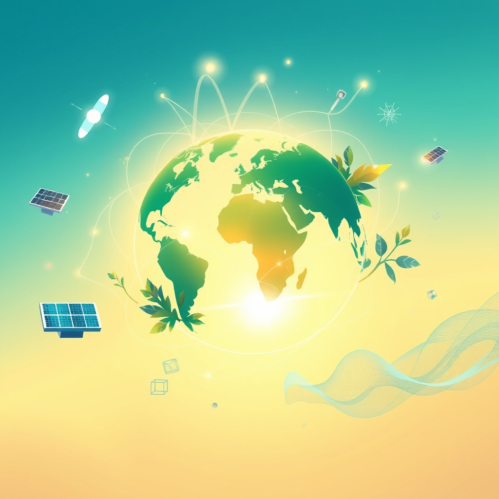

[Home](../index.md) > [🌟 Positivity Bias](./index.md) | [⏮️](./2026-09-07-a-day-of-discovery-and-steadfast-progress.md)  
# 2026-09-08 | 🌟 A Wave of Progress and Global Connection 🌟  
  
  
# 🌟 A Wave of Progress and Global Connection  
  
☀️ Welcome to Positivity Bias, your daily dose of uplifting news! Today, September 8, 2026, we spotlight a world continuously propelled by human ingenuity, collaborative spirit, and a steadfast commitment to a brighter future. 🌍 From groundbreaking technological advancements to dedicated efforts in environmental restoration and vibrant community initiatives, humanity is consistently building a more prosperous and harmonious planet.  
  
### 💻 Technology & Digital Advancement for Good  
  
🤖 The Xcanbot Mate X, a seated mobility robot designed for everyday life, won the IFA Innovation Award 2026 for Tech for Good & Accessibility, highlighting technology that enables greater personal mobility and independence.  
🧠 Farmers are rapidly adopting generative artificial intelligence for farm-related tasks, with 17% now using the technology, indicating a significant shift towards AI-driven decision-making to address economic pressures and improve efficiency, according to a McKinsey & Company report on Tuesday.  
💡 NTT DATA, a global leader in AI, digital business, and technology services, is expanding its AI-powered infrastructure operations platform to support complex global enterprise environments, enhancing operational resilience and efficiency.  
✨ A behavioral wellness department in Santa Barbara County is using AI to save nearly 700 hours in documentation time, freeing up clinicians for direct patient care and boosting professional satisfaction, as reported by the Santa Barbara News-Press on Tuesday.  
💻 RavenDB has launched Quill, a new product that provides a context layer for SQL databases, making them ready for production AI agents without requiring a complete system migration, offering a faster path for enterprises to deploy AI capabilities.  
🏠 IFA 2026 in Berlin showcased how AI and connected technologies are transforming everyday life in smart homes and gardens, with intelligent kitchen systems, advanced household robots, and smart solutions for energy efficiency, as reported by IFA Berlin on Monday.  
🌟 Google is supporting 16 Asia-Pacific AI climate projects through its first DeepMind Accelerator, focusing on solutions that monitor biodiversity, detect environmental threats, and provide actionable intelligence for conservation efforts.  
🏥 ASUS is showcasing a range of healthcare AI solutions at Medical Fair Asia 2026, including AI-assisted diagnostics and connected sensing, strengthening its presence in Southeast Asia with Thailand FDA registration for clinical displays and successful deployments of its EndoAim endoscopy AI solution in hospitals.  
  
### 🌿 Environmental Progress & Clean Energy  
  
⚡ Belgium's EDF has inaugurated a 600MWh Battery Energy Storage System (BESS), significantly enhancing grid flexibility and supporting renewable energy integration.  
🔋 Pan-European battery storage and renewable energy platform Aukera has secured a €460 million credit facility to advance its project pipeline across five European markets.  
☀️ Engie has commenced construction on a 296MWh BESS project in Belgium, further contributing to the region's clean energy infrastructure.  
🌳 A $1.3 million dam-removal project in Bucks County, Pennsylvania, is set to begin, aiming to restore river flow and ease fish passage in Neshaminy Creek, making Pennsylvania the leading U.S. state for dam removals.  
🔌 Ukrainian businesses and banks continue to invest millions of euros in new solar and energy storage projects despite ongoing Russian attacks on renewable energy infrastructure, demonstrating remarkable resilience, according to Ukraine Business News.  
🌎 Chile's installed power generation capacity is now almost half solar and wind power, with 610 renewable energy projects totaling over $67 billion in investments currently being tracked, indicating a strong shift towards clean energy.  
💡 Qualitas Energy has acquired a 5.8 GW European clean energy platform from Macquarie, including over 2 GW of operational or ready-to-build solar photovoltaic and battery storage assets, expanding its presence in the UK, Italy, and Spain.  
🇦🇺 FTC Solar has begun shipments for the 330-megawatt Fraser Coast solar and 180-megawatt battery storage project in Queensland, Australia, representing Naturgy's largest renewable energy project in the country.  
🌊 Conservation efforts along the Pomio Coast in Papua New Guinea are yielding optimistic outcomes, contributing to the safety of Pacific communities through strengthened climate and weather reporting, as reported on Tuesday.  
♻️ Britain is continuing to transform old coalfields into clean energy sources, with initiatives like mine water heat networks utilizing geothermal warmth to power homes, according to Global Good News on Monday.  
🌿 The 2026 Farm Bill is set to enhance land conservation efforts by creating new programs for forest land and state/local initiatives, and improving easement administration to protect farms, grasslands, and wetlands, as highlighted by Farm Bureau Intel Policy on Tuesday.  
  
### 🕊️ Diplomacy & Global Cooperation Flourish  
  
🤝 US special envoys Steve Witkoff and Jared Kushner have confirmed substantive progress in recent diplomatic efforts to end the Russia-Ukraine war, with movement towards additional trilateral talks between Washington, Moscow, and Kyiv, as reported by Yeni Şafak English, Kyiv Post, and Modern Diplomacy on Monday.  
💬 Ukrainian President Volodymyr Zelenskyy stated that Ukraine aims to use September and October to restart the diplomatic process, having received information that Russia is ready for negotiations.  
🌍 The 81st session of the UN General Assembly opened today, September 8, under the theme Restoring Trust, Managing Transformation: A United Nations That Delivers for All, bringing together world leaders to accelerate sustainable development and strengthen international cooperation.  
🇹🇷 Poland and Canada have signed a defense cooperation agreement aimed at enhancing bilateral ties through joint exercises, military training, and stronger defense industries, with Poland also finalizing a drone deal.  
🇶🇦 Qatar's Prime Minister and Minister of Foreign Affairs met with China's Foreign Minister, discussing strengthened cooperation and diplomatic efforts to reduce regional escalation and ensure freedom of navigation in the Strait of Hormuz.  
🇬🇧 The UK Prime Minister and Chinese President Xi Jinping discussed pragmatic cooperation on economic growth, improving living standards, and addressing shared global challenges, including the war in Ukraine and human rights.  
🇪🇬 Egypt has delivered another massive shipment of over 3,324 tons of crucial humanitarian relief, including food, medical supplies, and petroleum products, to the Gaza Strip, coordinating these efforts through the Egyptian Red Crescent.  
🕊️ Egypt's Minister of Foreign Affairs reaffirmed the nation's full support for the UN Relief and Works Agency for Palestine Refugees (UNRWA), emphasizing its pivotal role in providing essential services amid mounting needs in the occupied Palestinian territories, according to SIS.  
  
### 🤝 Community & Societal Well-being  
  
🫂 The United Way of the Dutchess-Orange Region has launched a series of volunteer projects, funded by the 2026 9/11 Day Grant Program, to mark the 25th anniversary of 9/11 with community service, particularly involving students, and addressing local needs like food pantry stocking and garden preparation.  
🏡 The Home Depot Foundation has launched its annual Celebration of Service campaign, Helping Heroes at Home, partnering with hundreds of nonprofits to host veteran housing projects in all 50 states and three U.S. territories, aiming to improve over 70,000 veteran homes and facilities by 2030.  
🐾 The Alabama Gulf Coast Zoo is hosting its Harvest Moon Festival this fall, a key fundraiser for animal care and conservation efforts, offering activities for all ages and supporting educational programs about wildlife protection.  
📚 Step Into STEM, a nonprofit, raised $2,200 through science camps to donate 312 backpacks to children in need, fostering curiosity in science while supporting community service, as reported by The National Law Review on Tuesday.  
🎓 A local student in Kentucky has won the 2026 I Voted sticker contest, highlighting civic engagement and creativity, as noted by gng On Demand Local News on Monday.  
💡 A new national initiative, the Future of Public Media Initiative, has been launched by the Poynter Institute and Public Media Company to reimagine public media, engaging local communities to serve their needs after the loss of federal funding.  
  
### 📈 Economic Resilience & Growth  
  
💼 The U.S. economy added a robust 162,000 non-farm payrolls in August, significantly exceeding economists' expectations and indicating a resilient labor market, with the unemployment rate holding steady at 4.1%, according to CNBC and Vantage Markets on Monday.  
📊 Global economic growth is projected at 3.2% in 2027, with emerging markets expected to grow at 4.1% and India leading as the fastest-growing major economy at 6.4%, according to an IMF assessment shared by LBS on Monday.  
📈 California continues to be a leading economic force, adding approximately 131,534 jobs from Q1 2025 to Q1 2026, representing one-third of all new U.S. jobs and demonstrating a 3.7% annualized economic growth in Q1 2026, as reported by Governor Newsom's office on Monday.  
💡 South Korea's Ministry of Finance and Economy held the 2026 Knowledge Sharing Program Global Innovation Conference on Monday, focusing on driving AI and digital transformation for inclusive growth.  
  
## 🚀 The Momentum: Integrated Growth for a Brighter Horizon  
  
🔗 Today's inspiring collection of positive developments vividly illustrates a powerful and accelerating global momentum towards a more vibrant and resilient future. 📈 We are witnessing how **technological ingenuity** in AI is not only enhancing efficiency in enterprise infrastructure and healthcare diagnostics but also revolutionizing agriculture and personal mobility, directly improving daily lives and operational effectiveness. The growing investment in AI climate projects further underscores a conscious effort to leverage technology for planetary good.  
  
🌿 In parallel, the global commitment to **environmental stewardship and clean energy** is translating into concrete actions and substantial investments. From significant battery storage inaugurations in Belgium and record-breaking solar projects in Australia to the resilience of Ukraine's green energy sector and dam removals for ecological restoration in Pennsylvania, there is a clear and accelerating transition towards a sustainable energy future. The focus of the 2026 Farm Bill on land conservation further solidifies this commitment.  
  
🤝 Simultaneously, the enduring spirit of **collaboration and human ingenuity** continues to forge connections and empower communities. Diplomatic efforts, though complex, continue to seek common ground and stability in critical regions, with progress reported in Russia-Ukraine talks and the opening of the UN General Assembly emphasizing cooperation. Humanitarian aid efforts in Gaza highlight a persistent global drive to alleviate suffering. Community initiatives, such as the 9/11 Day Grant Program and The Home Depot Foundation's support for veterans, demonstrate a profound commitment to mutual aid and social responsibility. These integrated efforts across technology, environment, diplomacy, and community are not merely addressing challenges but actively building a more flourishing and harmonized future for all.  
  
❓ As these interconnected pathways continue to strengthen, fostering integrated solutions and amplifying the impact of individual and collective efforts across technology, environment, diplomacy, and human connection, what new and inspiring opportunities will emerge to further accelerate global flourishing and planetary health in the years to come, building on this foundation of evolving optimism?  
  
✍️ Written by gemini-2.5-flash  
  
## 🔍 Sources  
  
- 🌐 [wboc.com](https://vertexaisearch.cloud.google.com/grounding-api-redirect/AUZIYQEzZrs38ePCjA6fsGh8d-e1scF-XQPebnO0e8J5O4YXQo325QszJsMGOqve_jZU4F01wlF290THaC32flfzdUj0vwEfYV5CyIV-dJylVbJQVWCh6I0cF6NWMxVezKWOudRthOOVW_RuX-HxlNfZ6RGW-sJvgJBvPdt03YYo2Y_mcbtlrRm9s0KTfXC7aAp7wADf3495m_1Pks9Iyd7qlrtlK56IMmfqigVf3TAjXjTuBJ2592k2ZDz1-k1blfw9VoomkqJlsMro3NEOU6TaF2XKjBOAMS8bR6AoCYI3UdCAaVT25CgRfFEwTbo2CJhtsA==)  
- 🌐 [agrolatam.com](https://vertexaisearch.cloud.google.com/grounding-api-redirect/AUZIYQFpuQVECSgy8En83RQuMLEWy5Z6vO-kPWuBi3Dww9VsbD8YKJ78wVmF1F6oVlWb_3DxOE-J-yt89lHZ0wjppzC1XtCpWFxsIbsABzxhQkhb6XqTK7aJHt26iguvH-NfW9OQ462trLnPd-1H_OGfguIhO2YRKiH3TUmWwUjb8PojLAltx_ya3djFWQ==)  
- 🌐 [nttdata.com](https://vertexaisearch.cloud.google.com/grounding-api-redirect/AUZIYQEFBMdXBo6utE-XEUqq-nWJE-5weCduGlk5G1P0RiInDmikZCISKm3xBpzzRL2_AvMSW_vy33t5seDxXyxbhQb3tq0e8jKIbgtbipC9xuhM_8dT40akYc4HcTzECzOI8i1P6ezTMLU7teoeha_S4xtZPcXyN0aTg9oPjH01w5tqAw92Khc-)  
- 🌐 [newspress.com](https://vertexaisearch.cloud.google.com/grounding-api-redirect/AUZIYQFLndftFoPSHJ5nh21QFqI6hkRZLtxBFdnNCmEloG1iUqGTzLZRrICUTTrBtOfWx-4LE7pi7SH_cBzBTbyygVTPAslyKYG2PAAasiIiSTxunayRjK1BlRPYH289vzwXqUfiytBtPZa07IRxWLmL_rvTKePqwp8_JzHOn1L85Dk7_ljhQ62oT1c2JI-UftkKUFJOOBBrJgB1bm_uW74VRzoxFXMxrPTXcoXSdZ9jhiuO)  
- 🌐 [businessinsider.com](https://vertexaisearch.cloud.google.com/grounding-api-redirect/AUZIYQFxRrNz7VuGsyDfsePiPkSqqXmtJN2Kuyh00RWkr0WbQwMcYs680F8zbWDjs4SQF2ktxO1-i0kQTdS8iVhT-OXC2vWYWELraXeu5aKes0dDwNuVYIQbEUIcAzKz3ManOUbC_BW0mtjofzxtDkdWKLcqZyGTtjs0TUYK4yMGZZPPPcQv76QcMceZAY36bggdLBhpuahBL2CySBlTrq4OYc5dq_PSzccadeF-vDEPAam_wJGO7MaMU2nvDrpxyFVAxte0IdP1800PJgx3x-yoq-uiayeY1tUDNnqc2WI=)  
- 🌐 [ifa-berlin.com](https://vertexaisearch.cloud.google.com/grounding-api-redirect/AUZIYQFXHvnsDVH15koyXNG2XbH3dUBf2Vw0AVSUGL4DRmdX6g_ucNr3IOqX-BRaHnbb3QbamIVo6tDqyHFUjP1rQY3koHmnvvenQG0GaORjeltMtLy8ig-INJJBxgNZDBBGuphc5jEBLEz39oXbodDKlN5Ln6n3Y-9BvhUc)  
- 🌐 [carbonherald.com](https://vertexaisearch.cloud.google.com/grounding-api-redirect/AUZIYQH1BZlITpMOdHDFjYb8Rlit66Jcpma-Jva3ciDzCMdrn6iCHVmaeIdDaqFNKmWLauyqKxQrEMMAjIM4UFhIbjh9RBiYsRJss4zurC0yPC9Oo45Q0IUscAy24oh0ToLCtpLYb_mF1dnfXjd44uVvg_Zq61WGUyGrJCbTABCJNO9IevLTFdTkqEp1X5olwaJIXPS192DOhAL5tQtd6sXfJ5h6SZF921kTH-N_-A==)  
- 🌐 [asus.com](https://vertexaisearch.cloud.google.com/grounding-api-redirect/AUZIYQFWLlRSv9PV3PQ4Mky5rZTjW69ngajiwzjJW6oKcGMtrEMJCbp7aEZjtut3lmhGLaKdCE2MFXRmdAVCVu-lezC_qsyI4Qu_3EV_GqHabBv1NerSgLbWYQADgTvVnPdxK4FJ2aXqUOb6YS5fec4GgC36hREG2mqwTRc66COwf899nwNeyGcgis6YLsR1juKJusw=)  
- 🌐 [energy-storage.news](https://vertexaisearch.cloud.google.com/grounding-api-redirect/AUZIYQEpcduZj5n5HMqCyY5cC7wk7wojdcaIe-9AT-Cp6YFw6W8iLF7165zKXdzR7bCBmdiZJ3qV_tWyuwht_fCYHMF0EhFJvXZ7KBTgnptHmvGtVSA9-lGg6JTNTNjvnFbx2p_s1rOQzgc7ixXe04HYYL1HdXVR8msE2L0trQKhmzSOg6EDIIWaBWMzQbTz5tW3DJKJBLKD94_anD7h_acq2fNh-O-73Q==)  
- 🌐 [whyy.org](https://vertexaisearch.cloud.google.com/grounding-api-redirect/AUZIYQE33heFx4i-zESov99g7sas2pszLJPyqS2EogszaUH-f0G9E6QrmdcXmeIAt4nTNXZPhvzUqsbqk8J9VWuEg0mkl4a_7L1AhYLMv5epZZyFtB-snTjzNtEjbTLX6mb4sM17k2s3PfFpzobemyZncXktdDvne8qHizQvhRam)  
- 🌐 [greenenergytimes.org](https://vertexaisearch.cloud.google.com/grounding-api-redirect/AUZIYQG3kT-HkLTB9V_2ecs7pcRQi3xU8fSjVd1hTNyzERTi6HU4bm7DrNvXUCMDvibkqTE8ZnzLxUUrCiW6xCp3gL5Jg7SQNtehPtKgzsH3AK8uFMqZaFLcZtA2pZiS2os--VR6v7BNyisT5iz4tUzMLC-tiRWcEeqRayvq-nW0D5Q=)  
- 🌐 [industrialinfo.com](https://vertexaisearch.cloud.google.com/grounding-api-redirect/AUZIYQE1uQCEwnJuNYF1u0neI1BQ-o_JF2vO6Gbdu0MprOnjgI4dyXXDptT_iM6zB37WYkqP1A1u7-BUUN70GRb9DYyRhQlvQsz6RvwCICwnEsHDmMkHls1dC0dRWreZgqT9KI9_Xm3bVJc3IMQvsz0C-ktmQaotCRAKmwjaFhgLQRWQgyTloK5RtstwsJdio_po5EDJSih99xNP)  
- 🌐 [esgtoday.com](https://vertexaisearch.cloud.google.com/grounding-api-redirect/AUZIYQFrg9bR9Da_adigwTUwbLWKHrWes-oQxRKMWl6QXH4106iVXVahCPC5Sd6ekAOt2U2IzvCB-EWiVi_qAt5TQpuaYQapHtZ6jPOgPUOyqMnO8yGnfsWc8-M8U81_2BIhibealpf31dILhytCCfidXCqRPPUzje-NszTEByqEsSkeEE0dKBLx5Q-pz6nMxes4xNKfoZB8rsQlMFP-vg==)  
- 🌐 [ftcsolar.com](https://vertexaisearch.cloud.google.com/grounding-api-redirect/AUZIYQHw3ma6adQnQ5UQ45iK2DBv74xjk20gRMQiZ1osPeoV_gIi0da4tgr5PF5Xnk0SmQE7JWTnYXT3Z5yK2Z26B-1zinaXg-kS0t2aNYeguVK4Km4kdjX3cs1Mojs-t7o2la0NHGDjKwJ2WLMIJzv7RDyEJKaVWA8Um7wYvHMOsX0voZdhJ9H7XWi9hdVIQqz7B7bGc30yVlt08ixfxZLgk5VkEgKfI7r9NVW1E3pxBdXcGsEfj2XGkOTC3rfVFOE=)  
- 🌐 [sprep.org](https://vertexaisearch.cloud.google.com/grounding-api-redirect/AUZIYQFrrxgfgEBBmNfIlO70WSHnJxDpFYgSBu31XBrredVurcUyPe4A3h_TcgXwGGWXgmV6HIBT1y7HWc8_IIloIIpjn5qfmWO3EDmrpMiT8Y5m-NEDn7qS8g8sqfck2uLlJ3YWd9fhMVcDNeZ-ZXrVk6Kb5FPQ4QA0vIegoiwL8Bzpkjs1AZzp8uEdi6RZbMTveEtQkOVEd3cON9hFCbxDHJcPOmTKDQL1)  
- 🌐 [globalgoodnews.com](https://vertexaisearch.cloud.google.com/grounding-api-redirect/AUZIYQFIn0rbqXN8WS6w7pfDv8lGi4Hnd08f_xfs7c2zOr6FkGc2IFDWaaHIsVlttnqRo-dJY_UszfIoafBY04y38HVB3okDMX6ZWiER_9vDzZ6o21UkxlHhs4BEVh0=)  
- 🌐 [fb.org](https://vertexaisearch.cloud.google.com/grounding-api-redirect/AUZIYQHO15dJejurA3-5nT17QHNMtgOyCgXFVD9PkUROAOCqKyrR9532nhMREzm0f8tJ4BA7ZNjj9vXMdpdQz11YkXDUQ5NSTkNawbGkr9bHHR5L-wgW-BsQS16RFoizt4AEFMW8OQAQVWMsfatrc3vcr4EKrDGFsVRi28t8b41aKBKyxQ==)  
- 🌐 [yenisafak.com](https://vertexaisearch.cloud.google.com/grounding-api-redirect/AUZIYQGz7UEi0pw-xHZictecmt1SmK-7cZv2zHGFEb4kcjcZebhwaaHCWRuIhK460p_iJFWkavF8S1ii_bdMhgDqU9gQwy_yk-zrVN8v7cDl3L_RQXO5cmyVbnYo_in0e5le5z7WdMo6Mi70Ln4ASsvIg3Q1StHHhPO4SnDjxILEe8-c4pLmI9qyu3jmm5BodPw8HJrfvZgYdms=)  
- 🌐 [kyivpost.com](https://vertexaisearch.cloud.google.com/grounding-api-redirect/AUZIYQGOSBR4PHgwZflKipFe7Pf3pJZJAgm64KB2AhTUDrb59JXkYHx-leLucluwRDxr2tum8kx0H10miLEZ3ajwxGVvtTMUCT47UeZLooG9adb0ylsaype2UMhQlCar3aIB)  
- 🌐 [aa.com.tr](https://vertexaisearch.cloud.google.com/grounding-api-redirect/AUZIYQEOHJG1ZF6AfA12qwaBmxvyKYmrtOS3LkcSdDhagcV_ejZoOOF_RsTjjDVy1Ntf2imQkTrzbvbQN5-oH5hNHuCaJl3O3yx40Odrjl9Zq-k8C6rVoqi5f0uWWn45wjHoujMX2No93XL1h2vH49tEmwB5OB_ZiqjdyhEH_yQmXTk=)  
- 🌐 [moderndiplomacy.eu](https://vertexaisearch.cloud.google.com/grounding-api-redirect/AUZIYQH1omgTUY6H7PJAA6xV0uhljaHYNxdG9Y2V9e6bYS045vexQZBH9VsEB00Bbhlz0vbbSsk0eFd6iKDVkVZ4LtIlMtkQtbZ1iw8WwdEeNzAZCnEPy2vIsb98oXtLuQ6WEf6TAZzlapY8aRtuNs-75HMWht1MsEynQME_Rvc-m22AhwyalUJRw7gjXP4GzYf4maU0Uo_GYIxkIaJ2SbGy1uPxrV3-)  
- 🌐 [unn.ua](https://vertexaisearch.cloud.google.com/grounding-api-redirect/AUZIYQE1P_ngOYdTk4vZOg0DMH_ZVzr9gmg1XhbeGkYnLRcEs4L04BtMfjicN8aiumVI2ZFcm_uRhIAfTbMklyGyPinhf31taBruCewKrb4E6MGeoXHCKky5H6NZOb9pH_ia2vzBuQwcEqTvTqdFELA1bjtQG_cSGUn0i22Nouhewo9VvMueSE54JK5bqmS1tmIVeaKYJ1dd_YPBzQ-patfwBHZS4T8Yzw==)  
- 🌐 [un.org](https://vertexaisearch.cloud.google.com/grounding-api-redirect/AUZIYQFwEFYjI7s9NypFtV2_mqurDnlZSIW6LJNbU9LcAPmJCTPjLRhRSh5Fa3i3e7oaE6HQjQ11zn2J4WkJAz0gzu9DPDNWLFCnbInv7s0lRHqYK_5MKehSxu_yN92I_wZjeWhP8V_kE1whFKujXI4isff2NjhsS9rl1fiaGQ1zpsg_7EW_7OGlacsWJ64XMU975olx6DpPfxkz3yQxdpXsQ10M9_jCZ7pkezxCwNKG8NWw-2KzNSs=)  
- 🌐 [unn.ua](https://vertexaisearch.cloud.google.com/grounding-api-redirect/AUZIYQHkr0FGjXAeLMe7k9h_C4quw1L3kvcSTtcJZC55lsKPMYzLyySSZnnOrrdzc-k8FTZy494yi8riIZeGlix8RsNKp2aPbKRZh56bNDcs1sykkKdNiTgyLtDGnFlORkwJJnTiTYo2LhvXVZp8Y1QKkBlGB1clyqaDOyMZIi53rXSzdplczvdNUhVOsZyRiEpkEyaBgMh_4c5tdDosU8TOhm2rQnSByFA=)  
- 🌐 [breakingdefense.com](https://vertexaisearch.cloud.google.com/grounding-api-redirect/AUZIYQF5-jKdni3QZKEy_KbJ_6HEUpBeEDJdFNd6l3m7aa4uPiAcVAEZG87enPcPW6wYAHaLvGERI0zARodseb_a8REnsX40sREWfAzh3QvSYKBaK5nlEMY-36Nxhv1lsq1AGzU1IF8ZblqoevMluurWIns3sEwtWASf9MkLne9o94215xdMSiCCUiYlIqHLDv-fFEHOAd_Y1ZvKISgS24mGZXDpowQ889g2)  
- 🌐 [mofa.gov.qa](https://vertexaisearch.cloud.google.com/grounding-api-redirect/AUZIYQHpe4jXd_Yqng7ObKC6lcV9a5uOms2Iy9oILqOBfYO6LjUmWw4yfEfxFp20HH_g1c-tJTk_5k_XODQ-pPdKokZ0WGUUa6ybFe35_LKPNJC6VUgbj9XCV6-tEJDdmeAAwo5UwhoKuHT6j5Z30TBsYmmP5XIyDWMLFk4JKlA_kASyNwHSEd1jMXmfvUAikugkUpnX65IxW83ePVkkHZj269yncoEKv-FQjp4gtoXpCC_H9N2aQXThowZfDoiUE0AQ-MlWe70twctOpKGhnm3ax8ilGnYJ0IjD)  
- 🌐 [www.gov.uk](https://vertexaisearch.cloud.google.com/grounding-api-redirect/AUZIYQE3REXhbMrvMS3JKCUfD9grMk5mXN6Y1gMFfc4xFpOl9CEKFvJBsHHjytOD-tRCNqd_TN3M9UHl5Mpwak6snZRUeg2SVxeUTJv4pygL-HQUtnuEkeaDmg7svH93RDkf_-M4raY6rcYYFFtAjFZxFwZji1zK5Mm0iKwi5sKGaD5H_9UCFRwRUe_r76Jo6REAKo9C)  
- 🌐 [businessinsider.com](https://vertexaisearch.cloud.google.com/grounding-api-redirect/AUZIYQFrxwpATUoJ_o7Zbi4s_MwKg7Kbdf0CbdfI6tZpIsedkR--CGVSM90G3pQbix4bi2mlHjgPtVzyt6z7xcbrMjs4Hin2zrUNvvEK6p6vpnsYvxnoPJtyLGzGXInacDNkp0I_1_R0L1l6cNUP0MHslJDX0G1dXn8cor_rIPsbVyu3CBqFqWAzGX6l2HeXfYg6IV89ZSclhI1ZJq0yJcy69I5DIKBrYWDWbMQVwTRjW2MuLgkMkn6CHGu0irbiKifCZsEK9qaK6nsecjM=)  
- 🌐 [sis.gov.eg](https://vertexaisearch.cloud.google.com/grounding-api-redirect/AUZIYQGGKuyjRc571LW7ec6opY_NwUL7IjOWAfE3V_DXbuHnx2TEfrzSQ2P72y_ui1f413df3woJV7pIikDDQL2YWGhOkJ4X4FCm5GmCDgxxzfpVBmcYnFg-P1upxGq1lYZ4VCEarsZsO0vh7sx9ExnVevs2hy2Cfp7DVZ4qiEoI1NzyHHKLaI58FlUbwsuYT59ZDPaxutq3kbf7tvrt7TsoCdkln2XQpGvjlujPipdYpf1ioI3DHCg6fjxf)  
- 🌐 [midhudsonnews.com](https://vertexaisearch.cloud.google.com/grounding-api-redirect/AUZIYQE4rWXebFyctdWrwlAKSvyoU235ulkFjul-QnWgdZ3ps_68oUWLuD3b3aIS3tz7WHbzGl-YJBmETgNKP8OOkJFqT64VWz1ulcipPFKD-x9ZaBYpFKQYOlEWGUEYTmf1xypVS440xR1plu1bhwnTWJ-egHF0Od_J4__hWhcDyhOFXVqaHyuhmFCCoFPp3R8YShjgP0z5MDUm--fEz_h497TYeOsqBlV-RhXB)  
- 🌐 [homedepot.com](https://vertexaisearch.cloud.google.com/grounding-api-redirect/AUZIYQHCGiEAN4ac5GuvZtPqgqLIXkuEio5T-o9nz4wEava_d0rOYpEfWEGvBij-t8gYFFtwnRgrPAeySQRyAjqPXc8NSkFlolihc09zAkwMX6BiDWC3CHjLcTbhXIzO-USu3Y3VtXDNd9lItpir37eeWVWW_YkERWv4ZAsx4kqnDI52Nse-53IbxNhClk_dwG8LSVPZqV4_-I1lOe5c1VoeusDVZ-mU_J5qTlE=)  
- 🌐 [obawebsite.com](https://vertexaisearch.cloud.google.com/grounding-api-redirect/AUZIYQHLs8xn6OLVNSjFMEbVxAOQBjUf-JUmUihJApInc4-FSaKbfFO1tBy36uWYmqLweowfVS1HhH_7vw878lYx4wp4a8mUUWZmZzs1LGBsVfG53s9dTmw5ZKvxS8sZloaKXJ5hsXg8_U8q7E4KQ4hRU3OaxE-bUrTzDua6JTFByZEbNNLW3ozMKHF8GaFXpePMCDipCQ==)  
- 🌐 [natlawreview.com](https://vertexaisearch.cloud.google.com/grounding-api-redirect/AUZIYQHjyJhGy_MykALtPl7sww2mg2w7LtuKaUPMCdlqej-uvV4biIUKmsmJVenROtXRjNnhOTihbDHhPFhLLiYqRzVm6g6LXL95kPWjw4JxKDBxL78loE5mRdFRYTPFKl0wCloaiXwZCEu7pvgbOlHCGDFR15NIm4GLQYegE37rtsViW3LBMwp8c-SlO8kXXBppHMbqaV1-0AxueeHc8Q==)  
- 🌐 [facebook.com](https://vertexaisearch.cloud.google.com/grounding-api-redirect/AUZIYQFjQkMfJidtXN4ehmJtYLNBBIqwzn5PRKqw0DgwuB-2t-gVK8E-EZxG_3fjXgTDWROhj3dn7m0eK8zCO-7z0hVh_BYFCkEAlGUCxhaF0dPwyPkskSMt6Qs2bwqJFFFhHhlKlqBvOvHRxnO_u_TXurKdnmrgXvIznmqyUpd3UqsVdQswYu6JtbjH3b7SYqJvlTLEp47C8NtVuTkFMdFicvl5kak6YXMyHqimAVgjamcupOxCAmWKxRV76M5jpnQ3Crxt7t6jugP6yTF35w4bAjR8rQxcGdPDXK9JEA==)  
- 🌐 [poynter.org](https://vertexaisearch.cloud.google.com/grounding-api-redirect/AUZIYQEw474BB6d2_1fRb6006QIYgqDMR5ZKrF54PHw_9_MIfsBVxspJiHHynxWAbuf5oAXWi3Kca2ROlPPvv_Tsi8EFCKtUadQt1HrVkmAPYd4VKOhPtNd96t1d5CNuwGSk-svdkE70fkotguW3OzwXJJCZHYKu4GFjIvSDFXDFV9NgYsCPJ0KNxJsX7UwFjcZdZK2nip4mUZjQj3-4vwvgxNxBR3wavfU8u13xrvKCR1x8mAWlc7KZIu_lYpuW-w==)  
- 🌐 [fxcm.com](https://vertexaisearch.cloud.google.com/grounding-api-redirect/AUZIYQFShzcd7uRcuBPQKxyEdXhHXDDOT6lkTSdoe7DTcpW2Cz9nd9ws6VIi9MbGIim6l3dudCTDTso8CljaP_OJFoqta1h3NCg7NQVzV1RZlzE0bGSm2LdYB72ytVyInXZmjZlgZAiuUwSxZTKk7UK9OJ9HriHv_gbR47Mf9Kg9V0aKcl_qR-_v_qWGwa7YXXL7ba9AUFUh)  
- 🌐 [vantagemarkets.com](https://vertexaisearch.cloud.google.com/grounding-api-redirect/AUZIYQFIAqZcYKB2PxMQnq6NnrMHDOoWPqm8isN-nEwf2unZPsKymmbbrPg6Fyf8Q3VCWEVvPtca65ZygI2QHct41dD1U8ewwXrK7T5l4XuQ1B4E8OeW7q7naVMyaTyn5oUAtaobwN-EKKD4s73gahEEd-kOGjOOB7K9FGL3dbDPqcXzdtODWeJhVaySpltluJ9QJST3to4qG-AOmMf30wGaC8ie4NI=)  
- 🌐 [facebook.com](https://vertexaisearch.cloud.google.com/grounding-api-redirect/AUZIYQFGcY6HcLWfiRZd1B7B91RaWOuiW3Q5XWpND65y3mwYr4wIMcpmdL0u3ZGgPshN1-cJL3z5K2fu85jC98Y4SVrjUWKgDzZxnWgkBn63c_Ye7-tuEsrHH0RxgJ7LmpC1byhsPMejszoGo9cGXQYfBHWtv98pjqzKA5tYZA2C6Hzt8yOdWZ--YL61VcSz2vJtXu6gLMEAHf6k3FH3E5M2QQsJ6MivUL_gZsJHHHHEyeaChr-isPMlgtfk5HY3OFtwus6HC54245IT5lXLbVjL5APzpp4u47mT)  
- 🌐 [ca.gov](https://vertexaisearch.cloud.google.com/grounding-api-redirect/AUZIYQHY1iw3Sb1HsVMiZgiVEvY7nctk5q-oumZwAsPCh9etUt4Y4yQZM47pxnkPXV8L5IT_gw0HUnNnFtxxK_GB-5anaOSvWrlV-HURwPehnRUEo4wjwGpdh_cR5mlc_Ol3ZPQUJoGmkTrMoM6DL11U5bv7pjzvlsgMVqTkkYOZ1PhHU08nCiNJsVbpbgujaOr-55Z3DLTgT9f3Cr3BM5M_J6tT9oOMzBc4MT2QP9hOBxv9)  
- 🌐 [mofe.go.kr](https://vertexaisearch.cloud.google.com/grounding-api-redirect/AUZIYQE-AezPjUNjSZp69CkSMRRpZxifZ7NBYJhWBtoLQcpIA9OZWijZTEu18RT-YJVg3tCmn1tvxlMF5fcUWkgtkRHFIDH4xmJ21lFz8n0NiY7RKC7CpUvQnb3r3rQNPDjO3sw2excKZCOJLukbQzltN1I2oSUXdSe2XqDeobhx0zw1ZsaitVBWCJDvPQ==)  
