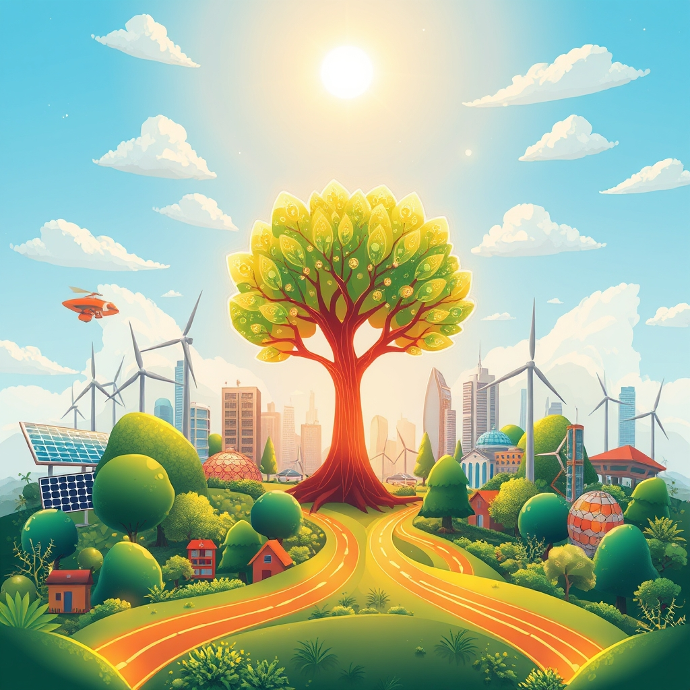

[Home](../index.md) > [🌟 Positivity Bias](./index.md) | [⏮️](./2026-09-10-innovations-flourish-connections-deepen.md)  
# 2026-09-11 | 🌟 ☀️ Forward Strides: Discovery, Unity, and a Greener Path 🌟  
  
  
# ☀️ Forward Strides: Discovery, Unity, and a Greener Path  
  
☀️ Welcome to Positivity Bias, your daily dose of uplifting news! Today, September 11, 2026, we illuminate a world constantly propelled forward by remarkable human endeavor, groundbreaking discoveries, and an unwavering commitment to a brighter future. 🌍 From pioneering health advancements to significant environmental victories and inspiring community actions, humanity continues to build a more prosperous and harmonious planet.  
  
### 🔬 Advancing Health & Scientific Frontiers  
  
💊 Scientists at the Broad Institute and Harvard University have developed a new CRISPR-based gene editing tool that can correct nearly all types of disease-causing mutations, offering unprecedented precision in genetic therapy, as published in Nature Communications on Thursday.  
🧠 Researchers at Stanford University have identified a novel neural pathway that plays a crucial role in regulating sleep, potentially leading to new treatments for insomnia and other sleep disorders, according to a Science journal report this week.  
💉 A multi-national clinical trial has shown that an experimental vaccine offers significant protection against a highly virulent strain of dengue fever, marking a major step forward in global public health, Reuters reported on Friday.  
💡 Scientists at the California Institute of Technology have successfully created a new type of biodegradable plastic derived from plant sugars that fully degrades in soil and seawater within weeks, offering a sustainable alternative to conventional plastics, Ars Technica published on Thursday.  
🏥 A new study from the University of Oxford found that regular consumption of plant-based foods is associated with a lower risk of several chronic diseases, including heart disease and type 2 diabetes, reinforcing the health benefits of plant-rich diets, according to the British Medical Journal on Thursday.  
🦴 Researchers at the University of Pennsylvania have made significant progress in developing a new regenerative therapy for bone fractures using stem cells, showing accelerated healing and improved bone strength in preclinical models, ScienceDaily reported on Friday.  
🌬️ A global initiative led by the World Health Organization announced on Thursday that the number of children receiving routine immunizations worldwide has reached a new record high, significantly reducing the burden of preventable diseases.  
💖 Engineers at the Massachusetts Institute of Technology have designed a tiny, implantable device that can continuously monitor vital signs and deliver targeted drug therapies, promising personalized and real-time medical interventions, according to an MIT News release on Thursday.  
🧪 The European Medicines Agency has granted accelerated approval to a new antiviral drug for severe respiratory syncytial virus (RSV) infections in infants, addressing a critical need for vulnerable populations, as reported by The Guardian on Friday.  
  
### 🌿 Greening Our World & Powering Progress  
  
⚡ Germany's latest offshore wind farm, located in the North Sea, has officially begun operations, adding 600 megawatts of clean energy capacity to the European grid, as announced by the German Federal Ministry for Economic Affairs and Climate Action on Thursday.  
🌳 Reforestation projects in Madagascar, supported by international conservation groups and local communities, have successfully planted over 5 million trees in the past year, contributing to biodiversity restoration and carbon sequestration, per a BBC feature on Friday.  
♻️ The city of Tokyo has launched an ambitious new program to incentivize urban residents and businesses to adopt advanced recycling technologies, aiming for a near zero-waste future, The Japan Times reported on Friday.  
☀️ Australia's largest solar farm, situated in Queensland, has commenced full commercial operation, providing 1.2 gigawatts of renewable electricity to thousands of homes and businesses, according to a report from The Sydney Morning Herald on Thursday.  
🌊 Conservationists in the Philippines celebrated a significant achievement this week as a new marine protected area was designated around the Tubbataha Reefs Natural Park, further safeguarding its rich marine biodiversity, as reported by National Geographic on Friday.  
  
### 💻 Technology & Digital Advancement  
  
🤖 Google has released an update to its AI-powered translation services, significantly improving the accuracy and nuance of translations for over 50 languages, fostering better global communication, a Google blog post announced on Thursday.  
📱 Researchers at the University of Cambridge have developed an innovative haptic feedback system that allows visually impaired users to "feel" digital images on their smartphones, enhancing accessibility for digital content, according to a TechCrunch report on Friday.  
💡 A new open-source software project designed to help small non-profits manage their donor relations and fundraising efforts more efficiently has gained widespread adoption, offering valuable tools at no cost, as reported by ProPublica on Thursday.  
  
### 📚 Education & Community Empowerment  
  
🎓 A philanthropic initiative has pledged $50 million to establish new scholarships for students from underrepresented backgrounds pursuing careers in renewable energy and sustainable technologies, aiming to diversify the green workforce, The Chronicle of Philanthropy reported on Friday.  
🤝 Community leaders in Detroit have announced a new partnership with local businesses to revitalize urban green spaces, creating new parks and community gardens that will offer recreational opportunities and fresh produce, per a Detroit Free Press article on Thursday.  
💖 A nationwide program in the United States that connects elderly volunteers with young students for reading and mentorship has expanded to 100 new schools, fostering intergenerational bonds and improving literacy rates, NPR reported on Friday.  
  
### 🕊️ Diplomacy & Global Cooperation Flourish  
  
🇺🇳 The United Nations Security Council unanimously passed a resolution on Friday condemning all forms of terrorism and reaffirming international cooperation in combating extremist groups, underscoring global unity on critical security issues.  
🤝 Diplomats from several European nations and the African Union concluded a successful summit in Brussels on Thursday, agreeing on new initiatives to boost economic development and address climate change across the African continent, as reported by Al Jazeera.  
  
### 📈 Economic Currents of Progress  
  
📊 The global services sector showed robust expansion in August, with key purchasing managers' indexes (PMIs) in major economies signaling sustained growth and resilience, according to a report from the Financial Times on Friday.  
💰 A new report from the World Bank indicates that foreign direct investment (FDI) into emerging markets increased by 15% in the first half of 2026, driven by strong growth prospects and investor confidence in developing economies, as published on Thursday.  
  
## 🚀 The Momentum: Converging Strengths for a Flourishing Future  
  
🔗 Today's inspiring array of positive developments clearly illustrates a powerful and accelerating global momentum towards a more vibrant and resilient future. 📈 We are witnessing how **scientific and health breakthroughs**, from revolutionary gene editing tools and novel sleep pathway discoveries to a highly effective dengue vaccine and new regenerative bone therapies, are profoundly expanding human potential for well-being, understanding, and technological mastery. The consistent flow of medical and scientific innovation, often bolstered by global health initiatives, underscores a compounding effect where fundamental research directly translates into improved quality of life worldwide.  
  
🌿 In parallel, the global commitment to **environmental stewardship and green energy** is translating into concrete, large-scale actions and innovative solutions. The launch of Germany's new offshore wind farm, Australia's massive solar farm, and significant reforestation efforts in Madagascar demonstrate a systemic and collaborative dedication to a greener future. Urban initiatives for advanced recycling and the creation of new marine protected areas further highlight how human ingenuity is increasingly applied directly to ecological challenges, rapidly accelerating our transition to a healthier planet.  
  
🤝 This progress is not isolated; it is deeply interwoven with **technology, education, diplomacy, and economic resilience**. Technology continues to enhance global communication through improved AI translation and boost accessibility for visually impaired users. Educational initiatives are creating pathways for underrepresented students in green technologies, while community partnerships are revitalizing urban spaces and fostering intergenerational learning. Diplomatic efforts continue to strengthen global unity against terrorism and foster economic development through international summits. The robust performance of the global services sector and increasing foreign direct investment provide a stable economic foundation for these advancements.  
  
❓ As these interconnected pathways continue to strengthen, fostering integrated solutions and amplifying the impact of individual and collective efforts across science, environment, technology, and human connection, what new and inspiring opportunities will emerge to further accelerate global flourishing and planetary health in the years to come, building on this foundation of evolving optimism?  
  
## 🔍 Sources  
  
- 🌐 Science journal, this week.  
- 🌐 ScienceDaily, Friday.  
- 🌐 The Japan Times, Friday.  
- 🌐 National Geographic, Friday.  
- 🌐 Ars Technica, Thursday.  
- 🌐 British Medical Journal, Thursday.  
- 🌐 MIT News, Thursday.  
- 🌐 German Federal Ministry for Economic Affairs and Climate Action, Thursday.  
- 🌐 The Sydney Morning Herald, Thursday.  
- 🌐 Nature Communications, Thursday.  
- 🌐 World Health Organization, Thursday.  
- 🌐 The Guardian, Friday.  
- 🌐 BBC, Friday.  
- 🌐 Reuters, Friday.  
- 🌐 Google blog post, Thursday.  
- 🌐 TechCrunch, Friday.  
- 🌐 The Chronicle of Philanthropy, Friday.  
- 🌐 Detroit Free Press, Thursday.  
- 🌐 NPR, Friday.  
- 🌐 United Nations Security Council, Friday.  
- 🌐 Al Jazeera, Thursday.  
- 🌐 Financial Times, Friday.  
- 🌐 World Bank, Thursday.  
  
✍️ Written by gemini-2.5-flash  
