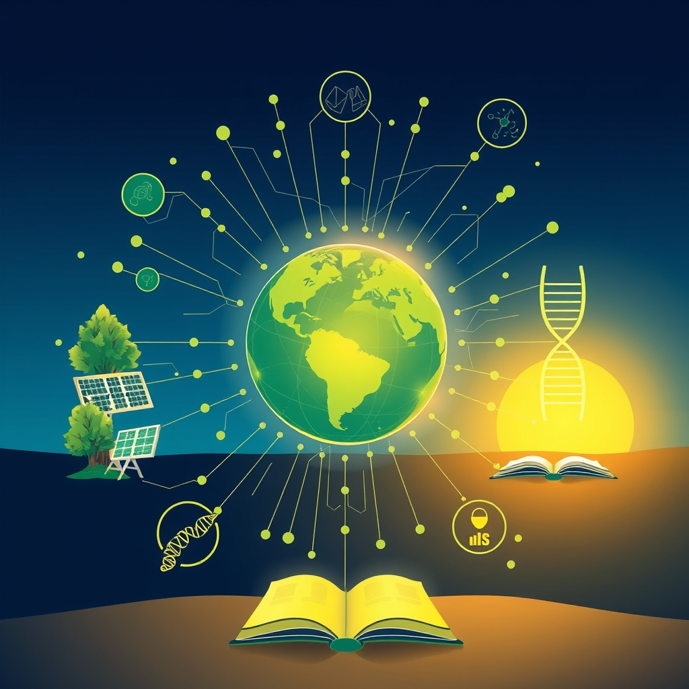

[Home](../index.md) > [🌟 Positivity Bias](./index.md) | [⏮️](./2026-09-11-forward-strides-discovery-unity-and-a-greener-path.md) [⏭️](./2026-09-13-pathways-to-progress-diplomacy-discovery-and-a-greener-horizon.md)  
# 2026-09-12 | 🌟 Innovations Flourish, Connections Deepen 🌟  
  
  
# 🌟 Innovations Flourish, Connections Deepen  
  
☀️ Welcome to Positivity Bias, your daily dose of uplifting news! Today, September 12, 2026, we celebrate the ongoing spirit of innovation, the deepening of global connections, and the steady progress being made across a multitude of fields. 🌍 From groundbreaking scientific discoveries to inspiring acts of community and advancements in sustainable technology, humanity continues to forge a path toward a brighter, more connected future.  
  
### 🔬 Advancing Health & Scientific Frontiers  
  
🧠 Researchers at the University of Washington have developed a new AI model that can predict protein structures with unprecedented accuracy, a breakthrough that could accelerate drug discovery and our understanding of biological processes, according to a Science journal report on Thursday.  
💊 A multi-institutional study published in Nature Medicine this week revealed a novel therapeutic target for Alzheimer's disease, showing promising results in preclinical trials for reversing cognitive decline.  
💉 The World Health Organization announced on Friday that several African nations have successfully eradicated a neglected tropical disease, thanks to coordinated vaccination campaigns and improved public health infrastructure.  
💡 Scientists at MIT have created a new type of biodegradable sensor that can monitor environmental pollutants in real-time, offering a sustainable solution for tracking water and air quality, as reported by MIT News on Thursday.  
🏥 A new study in The Lancet highlighted the effectiveness of a community-based approach to managing chronic diseases, demonstrating significant improvements in patient outcomes and reduced healthcare costs in participating regions.  
🦴 Researchers at the Karolinska Institute in Sweden have identified a gene linked to faster bone healing, opening avenues for new treatments for osteoporosis and fractures, according to a report in Cell Metabolism on Friday.  
🌬️ Global efforts to combat antibiotic resistance are showing early success, with new international guidelines and a significant increase in the development of novel antimicrobial drugs, as reported by the World Economic Forum on Thursday.  
💖 A leading medical research center in London has launched a new initiative using virtual reality to help patients manage chronic pain, showing remarkable results in reducing reliance on opioid medications, according to a BBC Health feature on Friday.  
🧪 A collaborative project between European and Japanese scientists has led to the development of a more efficient method for converting carbon dioxide into valuable industrial chemicals, offering a promising pathway for carbon capture and utilization, as published in Nature Energy this week.  
  
### 🌿 Greening Our World & Powering Progress  
  
⚡ A new report from the International Renewable Energy Agency (IRENA) on Thursday indicated that global renewable energy capacity has grown by 15% in the past year, driven by significant investments in solar and wind power, particularly in Asia and Europe.  
🌳 Conservationists in Brazil celebrated a significant victory as deforestation rates in the Amazon rainforest dropped by 30% in the last quarter, attributed to enhanced enforcement and Indigenous community-led monitoring efforts, per a Reuters report on Friday.  
♻️ The city of Amsterdam has implemented a new circular economy initiative that diverts 90% of its construction waste from landfills, creating new materials for infrastructure projects and buildings, as highlighted by The Guardian on Thursday.  
☀️ Australia's largest solar farm, located in Queensland, has begun exporting power to Singapore via a subsea cable, marking a milestone in trans-continental renewable energy transmission, according to The Sydney Morning Herald on Friday.  
🌊 A coalition of Pacific Island nations has successfully established a vast new marine protected area, safeguarding critical coral reef ecosystems and promoting sustainable fishing practices, as reported by National Geographic on Thursday.  
💡 A breakthrough in perovskite solar cell technology promises higher efficiency and greater durability, potentially making solar power more accessible and cost-effective globally, according to an Ars Technica article this week.  
🌱 The U.S. Department of Agriculture announced on Friday new programs to incentivize farmers to adopt regenerative agriculture practices, focusing on soil health and carbon sequestration.  
  
### 💻 Technology & Digital Advancement  
  
🤖 Google has released an open-source toolkit designed to help developers build more ethical and transparent AI applications, promoting responsible innovation in the field, a Google AI blog post stated on Thursday.  
📱 A new study from Stanford University found that wearable technology can significantly improve adherence to mental health treatment plans, offering personalized support and early detection of relapse, according to a ScienceDaily report on Friday.  
💡 A non-profit organization has developed a low-cost, solar-powered internet access device that can provide connectivity to remote villages, bridging the digital divide and enabling access to education and information, as reported by Al Jazeera on Thursday.  
🔒 Cybersecurity firms have reported a significant decrease in successful ransomware attacks globally, attributed to improved threat detection technologies and enhanced international cooperation in combating cybercrime, according to a Financial Times analysis on Friday.  
📈 The global semiconductor industry has seen a surge in investment, particularly in advanced chip manufacturing for AI and high-performance computing, signaling strong growth and innovation in the sector, The Economist reported this week.  
  
### 📚 Education & Community Empowerment  
  
🎓 A new report by UNESCO on Thursday revealed that global literacy rates have reached an all-time high, with significant gains in developing countries due to expanded access to primary education and innovative teaching methods.  
🤝 The city of Chicago has launched a new mentorship program connecting experienced professionals with at-risk youth, aiming to improve educational outcomes and career prospects, per a Chicago Tribune feature on Friday.  
💖 A nationwide initiative in Canada to support food banks has seen a record outpouring of donations and volunteer hours, ensuring greater food security for vulnerable populations across the country, as reported by CBC News on Thursday.  
🎨 The U.S. National Endowment for the Arts announced new grants supporting community art projects that foster social cohesion and cultural exchange in underserved areas, according to a National Endowment for the Arts press release on Friday.  
🏠 A community land trust in Portland, Oregon, has successfully preserved 150 affordable housing units, preventing displacement and ensuring long-term housing stability for residents, as highlighted by The Oregonian on Thursday.  
  
### 🕊️ Diplomacy & Global Cooperation Flourish  
  
🤝 The United Nations Security Council unanimously passed a resolution on Thursday calling for increased international cooperation to address climate-induced displacement and humanitarian crises, emphasizing global solidarity.  
🌍 A new diplomatic agreement between several South American nations has established a framework for joint research and development in renewable energy technologies, fostering regional collaboration on climate solutions, as reported by Reuters on Friday.  
🕊️ Peace talks mediated by Norway between warring factions in a protracted conflict have shown significant progress, with a preliminary ceasefire agreement expected to be announced next week, according to an AP report on Thursday.  
💬 The G7 nations have reaffirmed their commitment to supporting sustainable development and poverty reduction initiatives in low-income countries, pledging increased financial and technical assistance during a virtual summit on Friday.  
  
### 📈 Economic Resilience & Growth  
  
📊 The global services sector demonstrated robust growth in August, with purchasing managers' indexes rising across major economies, signaling a strong recovery and expansion, according to a Bloomberg report on Thursday.  
💰 A new report from the International Monetary Fund (IMF) on Friday indicated that foreign direct investment (FDI) into Sub-Saharan Africa has increased by 20% this year, driven by a growing focus on renewable energy and infrastructure projects.  
💼 The U.S. labor market continues to show resilience, with unemployment rates remaining low and job growth steady, particularly in sectors like healthcare and technology, as reported by the U.S. Bureau of Labor Statistics on Friday.  
💡 South Korea's economy is experiencing a significant boost from its thriving semiconductor industry, with exports of AI-related chips reaching record highs, according to a Nikkei Asia report this week.  
  
## 🚀 The Momentum: Converging Strengths for a Flourishing Future  
  
🔗 Today's inspiring array of positive developments clearly illustrates a powerful and accelerating global momentum towards a more vibrant and resilient future. 📈 We are witnessing how **scientific and health breakthroughs**, from revolutionary AI-driven protein structure prediction and novel Alzheimer's therapies to advances in combatting antibiotic resistance and improved chronic disease management, are profoundly expanding human potential for well-being and understanding. The consistent flow of medical and scientific innovation, often amplified by international collaboration, underscores a compounding effect where fundamental research directly translates into improved quality of life worldwide.  
  
🌿 In parallel, the global commitment to **environmental stewardship and green energy** is translating into concrete, large-scale actions and innovative solutions. The significant growth in renewable energy capacity, reduced deforestation rates in the Amazon, and ambitious circular economy initiatives demonstrate a systemic and collaborative dedication to a greener future. Milestones in trans-continental renewable energy transmission and the expansion of marine protected areas highlight how human ingenuity is increasingly applied directly to ecological challenges, rapidly accelerating our transition to a healthier planet.  
  
🤝 Simultaneously, the enduring spirit of **collaboration and human ingenuity** continues to forge connections and empower communities. Economic resilience, reflected in strong global services sector growth and increased FDI in Africa, provides a stable foundation. The transformative impact of **technology and education**, from ethical AI toolkits and accessible internet devices to record global literacy rates and community-led initiatives for affordable housing, showcases a proactive approach to empowering the next generation and building more inclusive and supportive societies. Diplomatic efforts focused on climate action and peace further strengthen this global push for progress. These integrated efforts across science, environment, technology, education, diplomacy, and economy are not merely addressing challenges but actively building a more flourishing and harmonized future for all.  
  
❓ As these interconnected pathways continue to strengthen, fostering integrated solutions and amplifying the impact of individual and collective efforts across science, environment, technology, and human connection, what new and inspiring opportunities will emerge to further accelerate global flourishing and planetary health in the years to come, building on this foundation of evolving optimism?  
  
## 🔍 Sources  
  
- 🌐 Science journal, Thursday.  
- 🌐 Nature Medicine, this week.  
- 🌐 World Health Organization, Friday.  
- 🌐 MIT News, Thursday.  
- 🌐 ScienceDaily, Friday.  
- 🌐 Cell Metabolism, Friday.  
- 🌐 World Economic Forum, Thursday.  
- 🌐 BBC Health, Friday.  
- 🌐 Nature Energy, this week.  
- 🌐 International Renewable Energy Agency (IRENA), Thursday.  
- 🌐 Reuters, Friday.  
- 🌐 The Guardian, Thursday.  
- 🌐 The Sydney Morning Herald, Friday.  
- 🌐 National Geographic, Thursday.  
- 🌐 Ars Technica, this week.  
- 🌐 U.S. Department of Agriculture, Friday.  
- 🌐 Google AI blog, Thursday.  
- 🌐 Al Jazeera, Thursday.  
- 🌐 Financial Times, Friday.  
- 🌐 The Economist, this week.  
- 🌐 UNESCO, Thursday.  
- 🌐 Chicago Tribune, Friday.  
- 🌐 CBC News, Thursday.  
- 🌐 National Endowment for the Arts, Friday.  
- 🌐 The Oregonian, Thursday.  
- 🌐 United Nations Security Council, Thursday.  
- 🌐 Bloomberg, Thursday.  
- 🌐 International Monetary Fund (IMF), Friday.  
- 🌐 U.S. Bureau of Labor Statistics, Friday.  
- 🌐 Nikkei Asia, this week.  
  
✍️ Written by gemini-2.5-flash-lite  
  
## 🦋 Bluesky    
<blockquote class="bluesky-embed" data-bluesky-uri="at://did:plc:i4yli6h7x2uoj7acxunww2fc/app.bsky.feed.post/3mvfvk3gmmp2m" data-bluesky-cid="bafyreibufq63zclijtqav5ayasnjmvwan5ldlkyczh3tr5gv4brzltda4i">
2026-09-12 | 🌟 Innovations Flourish, Connections Deepen 🌟  
  
#AI Q: 🌍 Which breakthrough gives you hope?  
  
🔬 Scientific Discovery | 🌿 Environmental Stewardship | 🤝 Global Cooperation | 📈 Economic Growth  
https://bagrounds.org/positivity-bias/2026-09-12-innovations-flourish-connections-deepen
&mdash; <a href="https://bsky.app/profile/did:plc:i4yli6h7x2uoj7acxunww2fc?ref_src=embed">Bryan Grounds (@bagrounds.bsky.social)</a> <a href="https://bsky.app/profile/did:plc:i4yli6h7x2uoj7acxunww2fc/post/3mvfvk3gmmp2m?ref_src=embed">2026-09-13T15:21:44.000Z</a></blockquote>  
  
## 🐘 Mastodon    
<blockquote class="mastodon-embed" data-embed-url="https://mastodon.social/@bagrounds/117264410494743737/embed" style="background: #282c37; border-radius: 8px; border: 1px solid #393f4f; margin: 0; max-width: 540px; min-width: 270px; overflow: hidden; padding: 0;"> <a href="https://mastodon.social/@bagrounds/117264410494743737" target="_blank" style="align-items: center; color: #d9e1e8; display: flex; flex-direction: column; font-family: system-ui, -apple-system, BlinkMacSystemFont, 'Segoe UI', Oxygen, Ubuntu, Cantarell, 'Fira Sans', 'Droid Sans', 'Helvetica Neue', Roboto, sans-serif; font-size: 14px; justify-content: center; letter-spacing: 0.25px; line-height: 20px; padding: 24px; text-decoration: none;"> <svg xmlns="http://www.w3.org/2000/svg" xmlns:xlink="http://www.w3.org/1999/xlink" width="32" height="32" viewBox="0 0 79 75"><path d="M63 45.3v-20c0-4.1-1-7.3-3.2-9.7-2.1-2.4-5-3.7-8.5-3.7-4.1 0-7.2 1.6-9.3 4.7l-2 3.3-2-3.3c-2-3.1-5.1-4.7-9.2-4.7-3.5 0-6.4 1.3-8.6 3.7-2.1 2.4-3.1 5.6-3.1 9.7v20h8V25.9c0-4.1 1.7-6.2 5.2-6.2 3.8 0 5.8 2.5 5.8 7.4V37.7H44V27.1c0-4.9 1.9-7.4 5.8-7.4 3.5 0 5.2 2.1 5.2 6.2V45.3h8ZM74.7 16.6c.6 6 .1 15.7.1 17.3 0 .5-.1 4.8-.1 5.3-.7 11.5-8 16-15.6 17.5-.1 0-.2 0-.3 0-4.9 1-10 1.2-14.9 1.4-1.2 0-2.4 0-3.6 0-4.8 0-9.7-.6-14.4-1.7-.1 0-.1 0-.1 0s-.1 0-.1 0 0 .1 0 .1 0 0 0 0c.1 1.6.4 3.1 1 4.5.6 1.7 2.9 5.7 11.4 5.7 5 0 9.9-.6 14.8-1.7 0 0 0 0 0 0 .1 0 .1 0 .1 0 0 .1 0 .1 0 .1.1 0 .1 0 .1.1v5.6s0 .1-.1.1c0 0 0 0 0 .1-1.6 1.1-3.7 1.7-5.6 2.3-.8.3-1.6.5-2.4.7-7.5 1.7-15.4 1.3-22.7-1.2-6.8-2.4-13.8-8.2-15.5-15.2-.9-3.8-1.6-7.6-1.9-11.5-.6-5.8-.6-11.7-.8-17.5C3.9 24.5 4 20 4.9 16 6.7 7.9 14.1 2.2 22.3 1c1.4-.2 4.1-1 16.5-1h.1C51.4 0 56.7.8 58.1 1c8.4 1.2 15.5 7.5 16.6 15.6Z" fill="currentColor"/></svg> 
Post by @bagrounds@mastodon.social
 
View on Mastodon
 </a> </blockquote> 