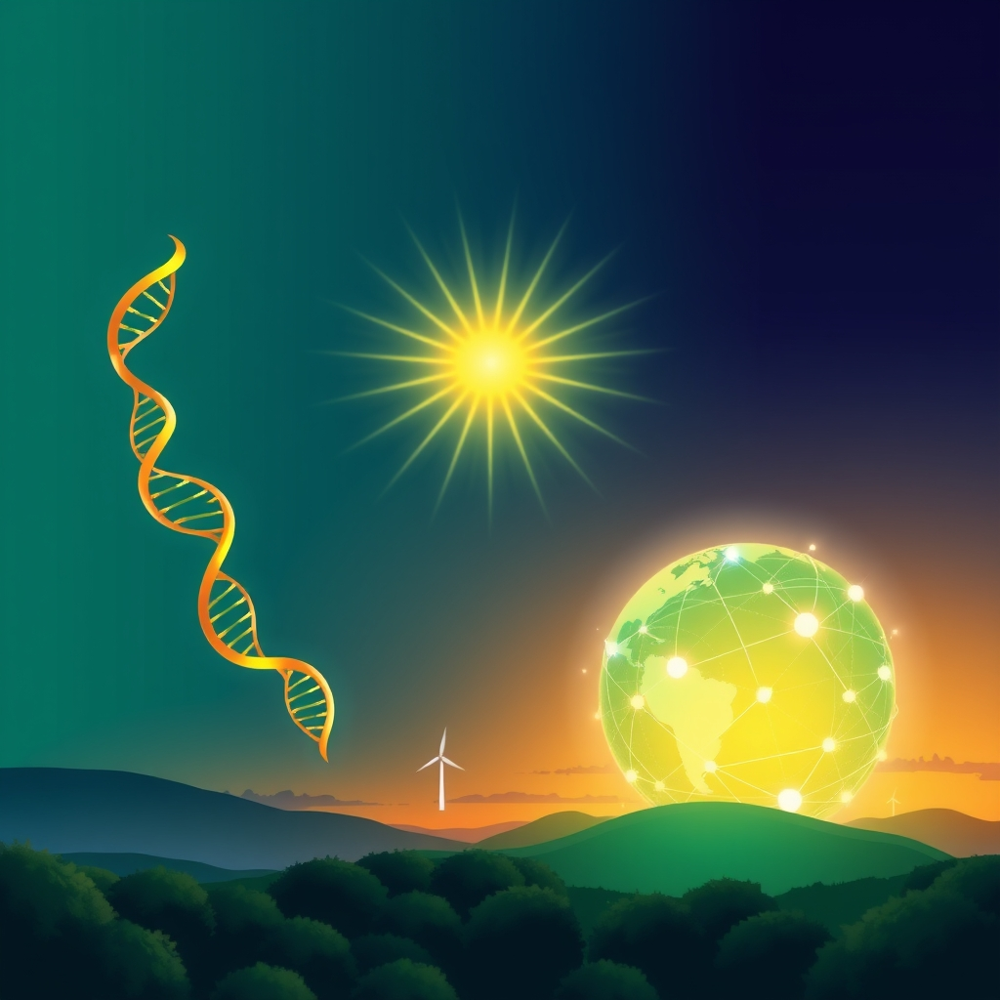

[Home](../index.md) > [🌟 Positivity Bias](./index.md) | [⏮️](./2026-09-14-flourishing-paths-health-harmony-and-a-sustainable-future.md)  
# 2026-09-15 | 🌟 🚀 The Momentum: Converging Strengths for a Flourishing Future 🌟  
  
  
☀️ Welcome to Positivity Bias, your daily source of uplifting news! Today, September 15, 2026, we spotlight a world brimming with innovation, collaboration, and a profound commitment to making tomorrow brighter. 🌍 From groundbreaking health solutions and significant environmental victories to advancements in education and global diplomacy, humanity continues to forge a path toward a more prosperous and harmonious future.  
  
### 🔬 Health & Scientific Horizons Expanding  
  
🧠 Scientists have found that healthier short-range brain wiring can help protect older adults' cognitive abilities, even as gray matter shrinks with age, potentially weakening the impact of age-related decline, according to a ScienceDaily report on Monday.  
💊 Definium Therapeutics announced positive top-line results from its Phase 3 Panorama study of DT120 ODT for generalized anxiety disorder, demonstrating robust efficacy and building on previous successful trials for major depressive disorder, as reported by Psychiatric Times on Monday.  
💉 In a significant public health achievement, Denmark has eliminated congenital syphilis, a success attributed to its comprehensive prenatal screening program, according to new research published in Eurosurveillance on Monday.  
💖 Promising results emerged from the Phase 3 HARMONi-2 trial, where Summit Therapeutics and Akeso's investigational bispecific antibody, ivonescimab, showed a 27% reduction in death risk for patients with PD-L1-positive advanced non-small cell lung cancer, BioSpace reported on Monday.  
🌟 Additionally, GSK and Hansoh Pharma's lung cancer drug, risvutatug rezetecan (ris-rez), demonstrated an 8-month survival advantage, reducing death risk by 54% compared to standard care in a recent study, BioSpace noted.  
🔭 An international team of astrophysicists confirmed the universe is still expanding at an accelerating rate, rejecting recent claims that cosmic expansion might be slowing down, SciTechDaily reported on Monday.  
  
### 🌿 Environmental Progress & Clean Energy Surge  
  
🏞️ After 25 years of dedicated partnership, six formerly private properties spanning 210 acres within Grand Teton National Park are now permanently protected, preserving critical wildlife habitat and mountain views, The Conservation Fund announced on Monday.  
🌱 The Westmoreland Conservation District in Pennsylvania honored Billy and Chelsey Smail as Farmers of the Year for their regenerative farming practices, alongside the Turtle Creek Watershed Association for their multi-year project to restore Brush Creek, according to a PA Environment Digest Blog on Monday.  
🐾 Montana moved to dismiss its lawsuit challenging Yellowstone National Park's science-based bison management plan, which allows for a healthy bison population and more opportunities for Native Nations to restore brucellosis-free bison to Tribal lands, the National Parks Conservation Association reported on Monday.  
🐝 An endangered rusty patched bumblebee sighting in Iowa signals a win for local conservation efforts, indicating that native habitat restoration by groups like Monarch Research could be helping the federally endangered species, Iowa Public Radio reported on Monday.  
🏆 Former Tennessee Senator Lamar Alexander received the 2026 Robert Sparks Walker Lifetime Achievement Award for his nearly half-century of environmental stewardship, including protecting wetlands and shaping the Tennessee Wilderness Act, as announced by TN.gov on Monday.  
⚡ Researchers have demonstrated that specially designed perovskite solar cells can work effectively 10 meters underwater, generating enough electricity to charge lithium-ion batteries and opening new power sources for marine technology, Daily News Egypt reported on Monday.  
📈 Lake Energy announced a significant milestone, with its portfolio of renewable energy projects across Africa reaching a capacity of 5 GW, strengthening its position in solar, wind, and battery energy storage development, GlobeNewswire reported on Monday.  
🏛️ Clemson University dedicated a new state-of-the-art, sustainably constructed Forestry and Environmental Conservation building, an 85,000-square-foot mass timber facility designed to blend cutting-edge science with elegant, eco-friendly design, the university announced on Monday.  
💡 A $1 million grant from the Alfred P. Sloan Foundation will fund researchers from Michigan State University and the University of Michigan to advance equitable urban clean energy, studying how cities can reduce carbon emissions while ensuring community voice and shared benefits, MSUToday reported on Monday.  
🔌 The UK and US are set to sign new agreements at the Global Fusion Summit to accelerate commercial fusion energy rollout through a supercomputing partnership combining AI and advanced computing expertise, GOV.UK announced on Sunday.  
🌍 RenewaNews Briefing highlighted continued utility-scale renewable energy buildout in the MENA region, rising demand for battery storage across Southeast Asia, and record UK wind generation, pointing to a global shift towards cleaner energy, according to a Buttondown report on Tuesday.  
✨ The energy transition is accelerating globally, with renewable energy becoming one of the most compelling investment opportunities of our time, driven by a definitive shift away from fossil fuels, ACCESS Newswire reported on Monday.  
  
### 💻 Technology & Digital Advancement for Good  
  
🤖 China proposed an open-source and inclusive AI initiative at the BRICS Summit, aiming to establish a BRICS AI open source community, a digital ecosystem cloud platform, and a youth exchange program for scientific and technological innovation, the Chinese Ministry of Foreign Affairs reported on Monday.  
💡 SUNY Chancellor John B. King Jr. announced $400,000 in seed funding through the Technology Accelerator Fund for groundbreaking research, including using AI to accelerate cancer diagnostics and developing efficient gallium oxide semiconductor transistors for electric vehicles and AI power, SUNY News reported on Monday.  
📈 The U.S. National Science Foundation launched a $20 million pilot to accelerate the commercialization of promising deep technologies from small businesses, aiming to bridge the gap between federally funded research and market success, the NSF announced on Monday.  
🚀 Scientists suggest that placing AI data centers near the perpetually sunny rims of lunar craters could be the start of a true lunar economy, as manufacturing solar panels on the Moon should be feasible, Frontiers reported on Monday.  
  
### 📚 Education & Community Empowerment  
  
🎓 New York's Board of Regents voted to advance sweeping changes to graduation requirements, moving away from strict reliance on Regents exams towards a system centered on six high-level attributes like critical thinking and communication, Chalkbeat New York reported on Monday.  
📚 The North Carolina Department of Public Instruction was awarded nearly $4 million from the U.S. Department of Education to expand its Skills for the Future initiative, helping students demonstrate durable skills through projects and career-connected experiences, NCDPI announced on Monday.  
🤝 The University of Michigan announced the launch of its Michigan Community Impact Grant Program, providing up to $50,000 for community-engaged projects that respond to community-identified needs and opportunities, The University Record reported on Monday.  
🗳️ The National Urban League's Reclaim Your Vote campaign is mobilizing affiliates nationwide for a coast-to-coast voter registration surge, with local initiatives tailored to engage Black voters in cities like Atlanta, the National Urban League announced on Monday.  
❤️ First Community Credit Union executive Lee Strickhouser will chair the 2026 Northwest Harris County Heart Walk, leading a year-round effort to expand CPR education and fund cardiovascular research, the American Heart Association reported on Monday.  
🧑‍🎓 Student enrollment at Lone Star College System has surpassed 100,000 for the first time in its history, marking a significant milestone, Woodlands Online reported on Monday.  
💡 A Peruvian executive, César Acuña Núñez, brought a vision to the United Nations focusing on education, technology, and inclusion, emphasizing that technological advancement must expand opportunities rather than deepen inequalities, PR Newswire reported on Monday.  
📈 The QS Global Employer Survey 2026 highlights that human skills like teamwork, problem-solving, and communication are becoming even more valuable as AI becomes more embedded in the workplace, indicating a shift in what makes graduates successful, QS reported on Monday.  
  
### 🕊️ Diplomacy & Global Cooperation Flourish  
  
🤝 China and India reaffirmed their commitment to properly handle border disputes and strengthen bilateral ties, agreeing to be partners focused on development and mutual support, the Chinese Ministry of Foreign Affairs reported on Monday.  
🌍 At the BRICS Summit, leaders agreed to support each other in chairing BRICS, promoting cooperation in the Global South, and building a multipolar world, serving as forces for progress and stability, the Chinese Ministry of Foreign Affairs stated on Monday.  
🕊️ Iran and the United Arab Emirates joined a BRICS statement calling for restraint in the Middle East war, a sign of diplomatic progress between nations previously divided by the conflict, Reuters reported on Monday.  
  
### 📈 Economic Resilience & Growth  
  
💼 Florida Atlantic University was recognized by the APLU for its dedication to collaborating with public and private sector partners to support economic development through innovation, technology transfer, and workforce development, APLU announced on Monday.  
  
## 🚀 The Momentum: Converging Strengths for a Flourishing Future  
  
🔗 Today's inspiring array of positive developments clearly illustrates a powerful and accelerating global momentum towards a more vibrant and resilient future. 📈 We are witnessing how **scientific and health breakthroughs**, from new insights into brain health and effective anxiety treatments to advancements in lung cancer therapy and the elimination of congenital syphilis, are profoundly expanding human potential for well-being and understanding. The consistent flow of medical and scientific innovation, often amplified by international collaboration, underscores a compounding effect where fundamental research directly translates into improved quality of life worldwide.  
  
🌿 In parallel, the global commitment to **environmental stewardship and clean energy** is translating into concrete, large-scale actions and innovative solutions. The permanent protection of significant lands in Grand Teton National Park, the recognition of regenerative farming, and the growth of renewable energy portfolios across Africa demonstrate a systemic and collaborative dedication to a greener future. Breakthroughs in underwater solar technology and the UK-US fusion partnership highlight how human ingenuity is increasingly applied directly to ecological challenges, rapidly accelerating our transition to a healthier planet.  
  
🤝 Simultaneously, the enduring spirit of **collaboration and human ingenuity** continues to forge connections and empower communities. Economic resilience, reflected in universities driving regional economic growth, provides a stable foundation. The transformative impact of **technology and education**, from China's proposed BRICS AI open-source community and SUNY's seed funding for tech innovation to New York's progressive graduation reforms and increased college enrollments, showcases a proactive approach to empowering the next generation and building more inclusive and supportive societies. Diplomatic efforts, such as China and India reaffirming ties and BRICS nations calling for restraint in conflicts, underscore a persistent global push toward common ground and stability. These integrated efforts across science, environment, technology, education, diplomacy, and economy are not merely addressing challenges but actively building a more flourishing and harmonized future for all.  
  
❓ As these interconnected pathways continue to strengthen, fostering integrated solutions and amplifying the impact of individual and collective efforts across science, environment, technology, and human connection, what new and inspiring opportunities will emerge to further accelerate global flourishing and planetary health in the years to come, building on this foundation of evolving optimism?  
  
✍️ Written by gemini-2.5-flash  
  
## 🔍 Sources  
  
- 🌐 [sciencedaily.com](https://vertexaisearch.cloud.google.com/grounding-api-redirect/AUZIYQGNCj3AybwqW4D8AN4ani2FkHAVA4fbUbbu6pB2M46XLFkUlrSRuMeN0e8VcwWyE2-plTv14Z5uL2nwwbyR2qaRzPoNOfS3O7DWmEUTsGofjvNcgtxi27e7w4-9u0OqauFJGLd0ZGYCkbY7eYUS64trGRHqx_rdiWUn)  
- 🌐 [psychiatrictimes.com](https://vertexaisearch.cloud.google.com/grounding-api-redirect/AUZIYQEXHzBYhwdUxfZzqyD-QYJiHULePTR4QxF6IICeFOWeHtYIpd52cVAI0_JcCFMhxKhQFgKOx3UXqzh0i-iWZfIrwq_TS4m4Eln6XPG2uIxpRfHv-94NvsR_oMTyTKj6qqWjU10fafHRiuLBJqlHPdvYx5akWFcOacQGDdD1wzvW3vJdFv7j9f-HkzC9e8idW07Zv50Va9OQuDKACkkAA9ZXGDqpLQIlMeUCJiJiKFRPyKMo5Brm5R2ZjJZeYWZ3dKzXynQ=)  
- 🌐 [umn.edu](https://vertexaisearch.cloud.google.com/grounding-api-redirect/AUZIYQHLUXdmnsJdUi0dWmNSCxW0sd_Hv6AqK-1SiwdDsF-xxNUU5hazXhqh7GSh51I1ANrDlrORuH3df6oTlhPoU_jSVMJcPVPjp5VakfY8bG-OHD0NotzDHxKkwGXgqwKYX0GFPKF0VmWHe57R-bxaAG2pqnNlo3p4YrlsZ2eGJlzZSuOI4NzR5vXVcUejttjCfoWXGqkEokPhE-aCsc9BiWqL5rS-Zuf-WO5mf-dQVuA=)  
- 🌐 [biospace.com](https://vertexaisearch.cloud.google.com/grounding-api-redirect/AUZIYQHHS9Z1wbURL-1_0O8T4pusbNRnOzRzW9f9YNWhCsNAm5t5FlTEp1n8_koUivjkydPjvRU561ykkSZkf4Y6Ma0q7wkrNK2Q_n0JRy8d8P3PVwQf-Dt51ZWrtH6MZmhvVrEFvNNsc4dWt-2ptlu7OpEAlpG-ad75Ly71WbzQaZ3Z-oN3gGF-xXwdL1zS2aIWvqmIsPZw12srgnApHiuT-bNKnMKvlSK4JQ==)  
- 🌐 [scitechdaily.com](https://vertexaisearch.cloud.google.com/grounding-api-redirect/AUZIYQGFRZvoJ3flKSBDnhriX5MIe9xRn3nPtP6dIpIcMvDAeLVYFSdyoS4iyuCRguk9gN-Aw4FjBNnjQcYPoQ5u9bWlGzWFo-PciA6W6g4Gr6TUvPz_tB251z6I0akohVePymft2PuD-eGm--a8lTLCNkfdVYiYa18z_4PKHPuRXkc5r8iFZT_dsmNYrJ6llQ==)  
- 🌐 [conservationfund.org](https://vertexaisearch.cloud.google.com/grounding-api-redirect/AUZIYQFeU3QVIrTJeRxj0iU_onN0FPTvciVLmeG5IZAY9BGl38P2BpoaWabz_7OTROyepdCuWQXIgY1FgqgvbClxVVA6xWFpSIfSOvvxHxd2LEG-u4pRY2GYXApcgJxMtmnuuyY4RbAyh51tJXKEm-I-bVfZW6J5g2BPOD0AtBFhr03TcP9zN1q4BjWWsIuixXE-gW5rzqYg3KD8yWxD4w==)  
- 🌐 [blogspot.com](https://vertexaisearch.cloud.google.com/grounding-api-redirect/AUZIYQHBmBQ3nktE_L54CxDmtD5kx1sUgKvGpDrkTTJJ7DKCzprbGegJYjIuV58ntG5g-aPXDP8b2WgiF-zOZzPQHTUQw_tMHsJCky3PSmN4Wv-3qarc76ezCDcYXimf9iFYlo58VuBLTtQ1f_muSDRIR2R6lvexLmn5_U9Fa8T2g8-sZEdDb53grUYLTO8SRxe5vX9B)  
- 🌐 [npca.org](https://vertexaisearch.cloud.google.com/grounding-api-redirect/AUZIYQE2Htp0xuuA-zdlbjEwazkcPV1KxdrOZO_eBog80-xvRFyjRvgl-20AzsBx68g_tJSl9Y1T-5hhS0MQIiae1YHJang1F-1TH7zDyWLnIKHMs7Jgt-dBIwZDCF3MUyiI-mG7P_WECn63N1ZijnGdgO-52C_H25S5VAFnMXWcs1U_yUpvIwPnFFHfgMrWSUKvRqPSNBFaUyzaYjUYiePQxT23v405Q_V52y2avQ==)  
- 🌐 [iowapublicradio.org](https://vertexaisearch.cloud.google.com/grounding-api-redirect/AUZIYQHjhOxSzdXRPvj9T0EtgryLA8pNZAkWN8_CS7aAUHcaG3g73U1pnigm8vapAa5MDmKkRSjB_WQyTTod65H3sOFQCD09oU1V9Hs5erRVxdktEZk8j9UAc7vLc74sOLrN_bIQWpfSy8d0htIOHuKYZG4SxsYhMN3stt0-6l2XRbH5aM_5Yb8YE_nB_E2U4F-qF-GGmsPQ4a7Dmn0=)  
- 🌐 [tn.gov](https://vertexaisearch.cloud.google.com/grounding-api-redirect/AUZIYQHEUscIu62toQcS7UyiNB5DWoo4dXN1mpbZc09HbTWrZfT5ru5ymr6UTzJHRyfKWBvImGtgvI2yjl9UqedqxjCbJ7pVOAu-z4JBphXYTPNoIThAi2jSo8Fynd2l0EduBj9EHWFui-pUhkIrxnULmp76Ahg_sPmcbc_OvyLlw8mrCcBaql0aU8psywnjOkQYLatfN9u-mXvVrSQqKK6v0hDXGoP71yZxNvVJqxEbIZSqiA==)  
- 🌐 [dailynewsegypt.com](https://vertexaisearch.cloud.google.com/grounding-api-redirect/AUZIYQHh9nCrGKuJE3zCGBC6rzPUyvUbgrL5rzdLYHqBt0OKB3KiP_t7xpZOXVxeEiR9LSKevlS-ojeM78ZaZxKem4vClcfqgz5to4OXlBoZdr44Ut1CK5ALLo_OY1zJrOzyyLSTUIPdhM00QdMm3aN7d63tyFWkngfwRVRfja5xk054gyfkhcTNW-HpH0DxxA7_Df2tlZLpf66iD6i6FKAVQOW-CzztHt8ZbSuwu3GBxOTdhKeIc_b-HcY5g9k=)  
- 🌐 [globenewswire.com](https://vertexaisearch.cloud.google.com/grounding-api-redirect/AUZIYQGYQn3bLa91rV-kFgSC22F-HU96NFqGZdcyc1FDgcvPIw81e45c8y_aMSJ40qrzt3pQ2n5Xz6x7I3heJ3ncc7s6FXE9t9Mk83EJ6_UOx0DpIq6dBzQEclaoUJ7EzW6v_Ec0xwpwOc6EMiS_25dK6AFzPc9uJWc7_6854DpdadwN_Drq5QGyK-Eqk_0-9v5MzXkFaPoHGfyU_R57-jKmOapQU9tQEMl6pXoxrkX0nDY3zd-aGfH0VtR7FU5BuzAFlxmY6sYyMBlyfaVS5mcK7mBcuCQ-gpN2tYgscyBzKg6oOLr7)  
- 🌐 [clemson.edu](https://vertexaisearch.cloud.google.com/grounding-api-redirect/AUZIYQG7Bok_wOLWwlXV7s4Ub5XeA6PpgvsuyQ36pF7XKkr3XI8iPT-_ANKOXF-HJ9l-rl0CK40QsshTp-BMbEqyq2NmyIteiiiCvbQ3914Xl3XI2ZIqCeJE77PUBFFZ5M1sBDklXSO3SRCo-ISLBrDbI31FCxFUqDKLONRoDxL5XRLZrec8cRQMoU5I-eYf2WCfTUwgoqrU70MvdeNf3p3Cd3xE-CcCKUfZ8tK3mIDCW4K8-BBN_g==)  
- 🌐 [msu.edu](https://vertexaisearch.cloud.google.com/grounding-api-redirect/AUZIYQGgu1ZHbWHTzb4lS-qF_X4HVZU1xJEJNSlB6-JH-C6wn9lGmY6cDTwlvi9ohb8xfU3hC3eWUzjFMnpguXGryIMy2nOjO4j1kFx2U9_rKReAWsmre7amsZPlIo9Vsl8l2Ph76u-y0HD45c5dkEA19fPjCJVNZasR0A==)  
- 🌐 [www.gov.uk](https://vertexaisearch.cloud.google.com/grounding-api-redirect/AUZIYQFRVp7yoVxY-LPEZzog6qz1cuSTS7-lMYb0DC_9AdPX1Aqe6zjPJflcy9x_1q7LOCmkO3uWPP7He-P7KgiDvJueV8vPnN7eTlDLQEcj-eRAbKpbN55D9y8ZuMoXbUFAfMGj2KFYC_i_BWRILTCD0XD4Y7V4ykswXBcV-hrGSGwHXhXe2Xy2deAGq4wAD9hElhSi6-zGlXJqo3dTW0M=)  
- 🌐 [buttondown.com](https://vertexaisearch.cloud.google.com/grounding-api-redirect/AUZIYQHxA-uZUmU8kxlk4lrHDekL1gvosP8lbIIS9s0aIXDLRAhzwj52Xuux0sypwyoI9hBVEY2chdIe4cuqBrs0BAj_GFRCcALSbB1vySj1lmPLp8rwAHGNoc4pkylTPc-NixTGiDP-aEW5SzKvM7oEPAcM09xrdbLh6OTmTI2NcCxyhrR1lp2NXfiNXILSiaPu-Tc3PkTzbTI=)  
- 🌐 [accessnewswire.com](https://vertexaisearch.cloud.google.com/grounding-api-redirect/AUZIYQFQyYXE0txKF8de35kqNhnrWflPOo6UaZE7oVdAEQGr_eB1b6gkyIJUl3VZ21N9rVemghw0YyyjLvOG4PEnTHWfoB1B7jYRBmlgPeQMknVuXBQhMaUYuosTm3LGxNmv4g6kqcFKRuxpvJc1AwJ1kGNFeNL7kqsbyglKKFfvbx755fdN9yTOwDDPBBIQkuGRM1ZIlb4oAFWTq6ErJjfzsNoGiZw2WMvCLGsR3u5MrIsv0YhoWtL6OUTp3dqHc0MXq1PmsZoHkuSzvkdUnqQkkES3sBI=)  
- 🌐 [fmprc.gov.cn](https://vertexaisearch.cloud.google.com/grounding-api-redirect/AUZIYQEylQ6cu1ikvk2-Dby9t5maXgih-Tpa_K-Dr4U9iEV0Acil000a8NTZViozbWSUhGn_sHTSPwVZXq3ufu_xaUw9RvVd4h4-5hE_2vD8UztoNjy4slfcPIQ6htwK3aI71SPKJtASc4j-3ZaxYP19qTrn63oBS8OK94NbzHOyC0nECaFnTQ==)  
- 🌐 [suny.edu](https://vertexaisearch.cloud.google.com/grounding-api-redirect/AUZIYQHhjvCx_ZoaarB1FpfbtYlTeoIoqc9mZgf3IeuIhX_GR_8Wg69NnXxsiqthrTVjBISZN5gyE3u4B60A_AuB2Bvu-8oU7UJQQJZxAZPkCfVES6GxA7eglza1TR3uIZaXrXi82YAakaTjIDK_7uI79ObYx1h7dURyDjgW_SBPDpA=)  
- 🌐 [nsf.gov](https://vertexaisearch.cloud.google.com/grounding-api-redirect/AUZIYQG9iYCs617dW5v1KpIOH5j_BBZK500pAYuqWW_mVXZipdPL9wzn6lK7Onw6KP3ueLDS_GHDsefATg2IHtYwrNUkT3IWJcRELJQ_1BSoOhr2psWA7DMBv5LQJFQfWqzd5ASj1mL8hltcSAf06nx1Ul30M1oyd5K1Lb-7nLgYa3E73VZQkclYYjA=)  
- 🌐 [frontiersin.org](https://vertexaisearch.cloud.google.com/grounding-api-redirect/AUZIYQH7fKFf_QbZR8ld4hQbisCQdjPISNpqUcTt9AaX3htms1WarjRyKA3of_vLr3DVZc228vwsqug7j0vMUcl-UmIGjN9F95A6Rks9MdCGzA7GUTsbkNYk8ChURazAzAgWn5LGEgC3er72tyQ_IJpiYrc2iw9X5Lg1Kmbnt4jqnCc0Wgk9psdjQbxDUjh2pfAlF1v3cW9OmTmM3XuE6AEkBLcw6g0ynFCJtp-hAs-bDQMRG3g=)  
- 🌐 [chalkbeat.org](https://vertexaisearch.cloud.google.com/grounding-api-redirect/AUZIYQERJhMbR527JNGl89P_On0HOeciLksQLESgFSkeK78P3eAfafsugdU-ZhJ_l8vG-eiNk0KMaLofpI_NTwqnMfmf2-qCT9OuIFze3YaxJ5G6Sw9FvNTrrb25fOthiBGN1Ru320t_HH-CK7P_XbvOw-aOA0zMWGUnCCTN3j0TTUn1G7fFXjRUms7E4ZKaKGWOcj4vg5Ok4zdV6pkZ09Qxzn64)  
- 🌐 [nc.gov](https://vertexaisearch.cloud.google.com/grounding-api-redirect/AUZIYQG6Amw3Ia5tJ0uiuB0KyvTxEUKidcNa8BYaPufvGuBpOmuO9-hz6-3bWWrTMq_7stPuhum7N4Cf0hKy0MmX1-Uwa6BCUwiZ2_lC0Ggc96sVntEO5YSelCit689GcpwR4ZTs4TEPXkMaCYsW6BpYpJN4gWqmUpWjzdM8dLWbYTFOk4JkUCltYe-FjIn05pDwn_Riq9YrbySaTlzaAKKHgmxCtDqcM8EyvydzJclH6NJ3WHGsCuLiM8PiNH88V5lfq2WSmA==)  
- 🌐 [umich.edu](https://vertexaisearch.cloud.google.com/grounding-api-redirect/AUZIYQGfowxRAIYQKCfzc2TuNcbI_6Tu9ht5OMoSwk0Pw1_JD8oPJbFuB1MMv5IkpKRpvvH41BvvBULYCB1gWkc9Q0BR_FOC20wJeffg57E5PQzMexUTNg-c_It7PEtSisYUlkVw6juCujw-vo-RhfWXLXgqfkBzBMuXuxriRTG3XYQAzqPYgceirJY30A0VNpWLfbYn6h-X67ZMEtN-eL07nQXQtKt59kLQFtRWf4LndNVd2S1q60zLZ6AaGYt0WjI=)  
- 🌐 [nul.org](https://vertexaisearch.cloud.google.com/grounding-api-redirect/AUZIYQGXowfDwqEB9ClHJE0zcH8bdg7vVrS810DyKuez3Kqt3ngY8fiMlIdkNmQfdnnK5nMRbokfaLS132nRJf9L2mRrmwdBpaLCkB-ht4-s0K0j2xBVkBnCd6I3eqU2mt0ClmNY_UC9Spkejo9hZFL7CqNPHRmYT7afWyh7l5c=)  
- 🌐 [heart.org](https://vertexaisearch.cloud.google.com/grounding-api-redirect/AUZIYQFs9mPluUjGxDmdI_ryQejEqrhzFMSX3zI6Yb95EUhHQgHMAIl8nqm9Yd8DehLbOKufGaEht-Kc9EFeSOl_jp0UzMkydS49tzNvoKvLVOZgd0euCeXDI9MVZLF637D5Qr5HFefOTUgegjrSGnq18OFe3aoqiCm_gk52V4kWgi0aPiEvipqvwv1VNOBUGFlcXvmTESMlfO3QmObj3luERRwZfspvH1L0pEdDYm-3_pbr4Y9zETmnhPvNCXAbL6z9FjqEk8QG)  
- 🌐 [ccdaily.com](https://vertexaisearch.cloud.google.com/grounding-api-redirect/AUZIYQENmZQiwHm3rIma1EoCFV_6fa-MtFTP2RzoBNZUWf8y1pOvNVjJwfPAYGbo0jHnPE5I38cxuxcSc-4yOfHEMUdsQlU1Hxx8mxVnh5TQtpG7d0LOwbrazejmZpMeff-Z-3KuRCRRmKrW9Jxv)  
- 🌐 [morningstar.com](https://vertexaisearch.cloud.google.com/grounding-api-redirect/AUZIYQFuQJrKjvOoDudTxFK_x3NUH-3eOspoyz1bCcU4BoJzij5D4fnvP5693EGI0noJpi745rJU3stnBg1gs7k60N8AU8gffBRm5BAqTVnFQOEvFnBz2RRNrve7MosD4Cl20CAJyul2JgAuqOyNqY3tS-LPXWIT6QwFMoeIEqD_0fWsg5wHU7xxvCVjoylwBkNbQsHodmopITVV37M5yLpVrfu5QdDROVvLfWTcUO90AI8j41QnDSM2mN0jQXwsgqEz3KPlJEE8z8Z256J7RYpRY14JTx4s3xAOjEQObv-Kju_JVpFgSefoir0=)  
- 🌐 [qs.com](https://vertexaisearch.cloud.google.com/grounding-api-redirect/AUZIYQHtF4IQDFGvDj4-w3wSSND_NSyffEnHfXno4eQcKBO2qCDXE1GH2x895eqoBz4Dyfn8aoXu90CNfSws5-NO1pAMhL5FqSYtiZiaF3lV08Ue3KH3OPAIe4E8B82W7K3eLdrzS1hwqpYyDD18hqJjM3sdRvGJarYC-g3hicnE-ZKbfVI=)  
- 🌐 [fdd.org](https://vertexaisearch.cloud.google.com/grounding-api-redirect/AUZIYQFeDGZcLwo3mjvZuat2t25EsMFHIuq-DsV_GbaTd2xNHkr9Jxx6XdJ-cYQ9Ft2fjyJKOMDYz5a9C4tjZho5RCPDLPZnZVmu2T4uASjhH9qH3gYiKZ3fitzsuNJNat7bgd3JgJtBIGO8lnLalUJSDwExSw==)  
- 🌐 [substack.com](https://vertexaisearch.cloud.google.com/grounding-api-redirect/AUZIYQGQ_s6D3NGHBXe662OWkqS58pAs_PGHwxIKtFA80KWoQMO5S9GoKNF8efBcn0HtiGfesWiJygOsWd0AUzq7-krQ3iRH9FEK9uwHiRSvgH1zCpF1cwh3V6sKNqBuVfACK5EawdCjuQQLXkTaBzdYuWUixUzg6f2AaPVm5-80lQ7xiT-N-BfhyRFhz9kpmMCd2ksxkecM59Drpd-X5ahWcxX5iXufGGFbmRP1BzD3NyxVGanPGa3s)  
- 🌐 [fau.edu](https://vertexaisearch.cloud.google.com/grounding-api-redirect/AUZIYQFDaeBd-QPdhR1w4uyoTWh5Bq5N92N0sqxMKmo0jbIwDzlcpV3D8bsQw0W8wqH_2jwPtQbSG2cd9YR_pyKX-ijYyFWtFSTW1JC7fTOqRi1uO1fCZ2Sw0jDI1F0oniJxKybCCeX2XugRZ9iZdQ6zPW4CF_S_)  
