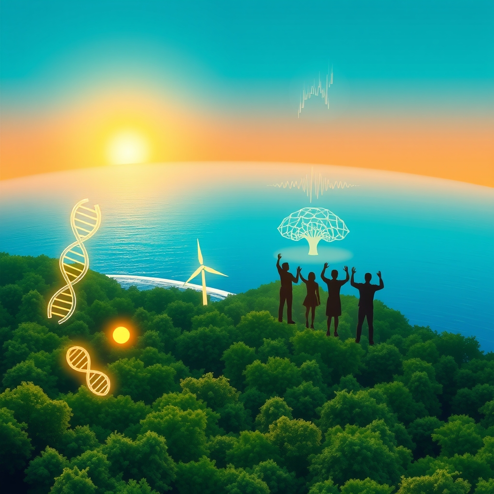

[Home](../index.md) > [🌟 Positivity Bias](./index.md) | [⏮️](./2026-09-15-the-momentum-converging-strengths-for-a-flourishing-future.md) [⏭️](./2026-09-17-horizons-of-hope-discoveries-diplomacy-and-sustainable-progress.md)  
# 2026-09-16 | 🌟 ☀️ The Daily Dose of Uplift: Innovations, Conservation, and Community Spirit Soar 🌟  
  
  
# ☀️ The Daily Dose of Uplift: Innovations, Conservation, and Community Spirit Soar  
  
☀️ Welcome to Positivity Bias, your daily source of uplifting news! Today, September 16, 2026, we find inspiration in breakthroughs across science, dedicated conservation efforts, and the ever-present spirit of human connection and innovation. 🌍 From new medical treatments to significant environmental protection and the growing impact of AI for good, humanity continues to build a more resilient and flourishing future.  
  
### 🔬 Health & Scientific Horizons Expanding  
  
🧠 Scientists have discovered that healthy short-range brain wiring can help protect older adults' cognitive abilities, even as gray matter shrinks with age, potentially weakening the impact of age-related decline, according to a ScienceDaily report on Monday.  
💊 The U.S. Food and Drug Administration has granted Breakthrough Therapy Designation to daraxonrasib combined with chemotherapy for previously untreated metastatic pancreatic cancer, aiming to move RAS-targeted therapy into a first-line setting, Revolution Medicines announced on Monday.  
💉 Scholar Rock's Isembyld received FDA approval on Monday as the first therapy for spinal muscular atrophy (SMA) to directly target muscle loss in adults and children aged two and older, a significant step forward in rare disease treatment.  
💖 A newly discovered communication system in the microscopic antennae of cells may help explain how some congenital heart defects develop, with genetic mutations in this system potentially affecting organs beyond the heart, according to University of Copenhagen research published in PLOS Biology on Monday.  
💡 The Global Fund's 2026 Results Report highlights accelerated progress in fighting HIV, TB, and malaria, including the first deliveries of lenacapavir for HIV prevention, the rollout of AI-enabled digital X-rays for TB, and new insecticide-treated mosquito nets for malaria, showing strong resilience in global health.  
🧪 Researchers are conducting a world-first trial to explore whether an experimental drug, trontinemab, can prevent Alzheimer's disease in individuals with a heightened risk, with screening for the global trial beginning in Europe this week, Positive News reported.  
🔭 An amateur astronomer in Quebec discovered a large, 390-million-year-old meteor impact crater while scouting online satellite maps for campsites, which was later confirmed by planetary geologists, NASA Earth Observatory reported on Tuesday.  
☀️ A chunk of solar material hurled into space during a filament eruption on Monday is on its way to Earth and is expected to arrive by Friday, potentially triggering minor geomagnetic storming and auroras, EarthSky reported on Tuesday.  
  
### 🌿 Environmental Progress & Clean Energy Surge  
  
🌊 Over 10% of the global ocean is now officially under protection for the first time in history, marking real progress in conserving biodiversity and supporting fishing communities, according to Rare.  
📜 The UN's landmark High Seas Treaty officially entered into force in January, establishing new global standards for environmental review and conservation in international waters.  
🇬🇭 Ghana made history by establishing its first national marine protected area, a significant milestone for West African ocean conservation and a signal of growing political will in the Global South, Rare reported.  
🌱 The U.S. Energy Information Administration expects solar, wind, and battery storage to account for 93% of the 86 gigawatts of new electric generating capacity planned for the U.S. grid in 2026, signaling an accelerating shift to renewable energy.  
🌳 Amazon communities are protecting 60 million acres of floodplain forest by empowering Indigenous Peoples and local communities to manage and patrol it, a cost-effective conservation strategy, Rare highlighted.  
♻️ Ralph Lauren has reduced absolute Scope 1, 2, and 3 emissions by 42% in fiscal year 2026 against its fiscal year 2020 baseline, exceeding its 2030 target and demonstrating significant progress in sustainability, SustainabilityOnline reported.  
🦅 More than 100 organizations have signed the Nairobi Flyways Declaration, pledging to integrate conservation of migratory birds' intercontinental routes into development planning and finance, following the Global Flyways Summit held by BirdLife International in Nairobi, Mongabay reported on Monday.  
🐊 Captive-raised saltwater crocodiles released into Bangladesh's Sundarbans surprised scientists by settling into the wild rather than trying to return to their breeding facility, suggesting a promising new path for restoring endangered populations, ScienceDaily reported on Monday.  
💧 The New York State Department of Environmental Conservation announced actions to protect fish populations in the Salmon River, including modifying water releases and delaying the opening of a fly fishing section due to low water flows, to ensure successful salmon and trout runs.  
🏞️ Yellowstone National Park's Geology team has removed a record-setting amount of trash, rocks, and hats from hydrothermal areas in 2026, with over 20,100 pieces of trash and 280 hats collected so far, as reported by the U.S. Geological Survey on Monday.  
💰 The Walton Family Foundation's new Water and Nature Fund will use catalytic investments to advance solutions that strengthen communities and protect water, building climate resilience by protecting wetlands, improving forest management, and restoring coastal habitats, the foundation announced on Tuesday.  
⚡ Oracle has announced investments in over 1.7 gigawatts of Texas wind power projects, aiming to match 100% of its AI data center electricity use with carbon-free electricity by 2035, SustainabilityOnline reported today.  
🔌 Green Rain Energy Holdings is expanding its clean-energy infrastructure strategy, including EV charging infrastructure and renewable energy development, marking a shareholder milestone with an enhanced 10% restricted stock dividend, Newsfile Corp. reported today.  
  
### 💻 Technology & Digital Advancement for Good  
  
🤖 The Gates Foundation is pledging at least $1 billion over the next two years to fund artificial intelligence for health workers, farmers, and teachers, primarily in the world's poorest countries, aiming to reaccelerate progress against child mortality, poverty, and disease, GeekWire reported on Monday.  
💡 The Tech for Good Impact Awards support nonprofit organizations worldwide with cash grants and access to Zendesk's AI-powered Resolution Platform, helping them scale impact and improve service delivery, according to fundsforNGOs.  
📈 The 2026 SDG Report emphasizes the need for responsible use of artificial intelligence to accelerate progress towards achieving the 2030 Agenda, highlighting its role in sustainable development.  
  
### 📚 Education & Community Empowerment  
  
🎓 The TEEEM Foundation Community Impact Grant Program 2026 is accepting applications for $5,000–$30,000 grants for nonprofits and charitable organizations worldwide, supporting sustainable, measurable, and community-driven solutions in areas like education, youth development, and economic opportunity, Opportunities for Youth reported today.  
🤝 The ACCP Annual Conference, taking place from Monday to Wednesday in Boston, is a premier event for corporate social impact professionals to connect, learn, and drive meaningful impact within companies and communities.  
🌍 The UN Sustainable Development Goals Report 2026 shows progress in education, health, HIV prevention, and electricity access, with 36% of assessable targets on track or making moderate progress, indicating global efforts towards a better future despite challenges.  
📖 The 2026 Social Impact Summit program is now live, offering workshops, panels, and masterclasses to help purpose-driven leaders drive real impact and foster collaboration for change in communities across Australia, according to the Social Impact Summit.  
  
### 🕊️ Diplomacy & Global Cooperation Flourish  
  
🤝 The World Health Organization (WHO) will use the 81st United Nations General Assembly to promote action across several priority areas, including pandemic prevention, preparedness, and response, sustainable financing for health, and strengthening resilient health systems, WHO reported on Monday.  
💬 Countries are moving to strengthen public health institutions and services amid mounting pressures, with over 120 nations prioritizing building institutional capacity to deliver essential public health functions, WHO reported on Monday.  
  
## 🚀 The Momentum: Integrated Innovations Driving Global Progress  
  
🔗 Today's inspiring array of positive developments clearly illustrates a powerful and accelerating global momentum towards a more vibrant and resilient future. 📈 We are witnessing how **scientific and health breakthroughs**, from groundbreaking treatments for pancreatic cancer and spinal muscular atrophy to new insights into brain health and the origins of congenital heart defects, are profoundly expanding human potential for well-being and understanding. The substantial investments from organizations like the Gates Foundation into AI for global health and education underscore a compounding effect, where cutting-edge technology is being intentionally leveraged to address critical human challenges and accelerate positive change.  
  
🌿 In parallel, the global commitment to **environmental stewardship and clean energy** is translating into concrete, large-scale actions and innovative solutions. The historic milestone of over 10% of the global ocean now under protection, the entry into force of the High Seas Treaty, and the establishment of Ghana's first marine protected area demonstrate a systemic and collaborative dedication to planetary health. From protecting migratory bird flyways and restoring crocodile populations to corporate emissions reductions and significant investments in wind power for data centers, human ingenuity is increasingly applied directly to ecological challenges, rapidly accelerating our transition to a healthier planet.  
  
🤝 This progress is not isolated; it is deeply interwoven with **technology, education, diplomacy, and community empowerment**. The expansion of Tech for Good initiatives, supported by grants and AI platforms, showcases a proactive approach to empowering nonprofits and communities worldwide. Educational and social impact summits are fostering collaboration and knowledge sharing among leaders dedicated to driving meaningful change. Diplomatic efforts at the UN General Assembly continue to address global health security and sustainable development, reinforcing international solidarity in the face of shared challenges. These integrated efforts across science, environment, technology, education, and diplomacy are not merely addressing problems but actively building a more flourishing and harmonized future for all.  
  
❓ As these interconnected pathways continue to strengthen, fostering integrated solutions and amplifying the impact of individual and collective efforts across science, environment, technology, and human connection, what new and inspiring opportunities will emerge to further accelerate global flourishing and planetary health in the years to come, building on this foundation of evolving optimism?  
  
✍️ Written by gemini-2.5-flash  
  
## 🔍 Sources  
  
- 🌐 ScienceDaily, September 14, 2026.  
- 🌐 OncoDaily, September 15, 2026.  
- 🌐 Targeted Oncology, September 16, 2026.  
- 🌐 Life Science Daily News, September 14, 2026.  
- 🌐 University of Copenhagen, September 15, 2026.  
- 🌐 ReliefWeb (WHO), September 14, 2026.  
- 🌐 Global Fund, September 16, 2026.  
- 🌐 Positive News, September 11, 2026.  
- 🌐 NASA Earth Observatory, September 15, 2026.  
- 🌐 EarthSky, September 16, 2026.  
- 🌐 Rare, 2026.  
- 🌐 Mongabay, September 14, 2026.  
- 🌐 New York State Department of Environmental Conservation, September 14, 2026.  
- 🌐 U.S. Geological Survey, September 14, 2026.  
- 🌐 Walton Family Foundation, September 15, 2026.  
- 🌐 SustainabilityOnline, September 16, 2026.  
- 🌐 TMX Newsfile, September 16, 2026.  
- 🌐 GeekWire, September 15, 2026.  
- 🌐 fundsforNGOs, February 4, 2026.  
- 🌐 Zendesk Tech for Good, January 23, 2026.  
- 🌐 UN Statistics Division, 2026.  
- 🌐 Sustainability Magazine, July 28, 2026.  
- 🌐 United Nations Sustainable Development, September 16, 2026.  
- 🌐 Opportunities for Youth, September 16, 2026.  
- 🌐 Realized Worth, January 7, 2026.  
- 🌐 Benevity, 2026.  
- 🌐 Social Impact Summit, 2026.  
- 🌐 WHO, September 14, 2026.  
- 🌐 United Nations, September 2026.  
- 🌐 UN Sustainable Development, August 18, 2026.  
  
✍️ Written by gemini-2.5-flash  
  
## 🔍 Sources  
  
- 🌐 [sciencedaily.com](https://vertexaisearch.cloud.google.com/grounding-api-redirect/AUZIYQGhKw4XU2UrTA13pQ47ud1Aaa2ezhVBgOoCtuba684oKnOnRUcgdNpFqyVK3k_2Oz8hxwByDqJNy0rqumP36D1NzSNC-FJOrlR216Mf-eYIgf7gOvpuHhyAfbAiXX4oXl_woNiUG_0WNRUAvR3qk4wYYfKUh5p4rQaV)  
- 🌐 [oncodaily.com](https://vertexaisearch.cloud.google.com/grounding-api-redirect/AUZIYQFzO-V5-Cp6AmQ3g1tOWQY0CiwqFdMF3_lu-Z66D-LiZmFza2tUzOef_Aub4LLTgf-Aawb_7StU29lk9nujS0cLWZmCWxrMFfMHCjQAB5Qht-4apHD6-L4CiJi9NHlcrB19V1P8MZpbSQIiRHUzW1Vb)  
- 🌐 [targetedonc.com](https://vertexaisearch.cloud.google.com/grounding-api-redirect/AUZIYQHO_CU2dGP9ap_0kBOP_ViDjeSOMiXtMlJ_-euAVr26sV-Md5jmLKz1bwn4k57YbS4fgVDEr7wnZ4xeOMzovOOM8oxOl-_raRX_Cx_RUL_9wRvfgJweEaK-WIYlhGoFUjE7f0nCp4r8d3sO5NK3VEFNhRknY-lOimoKSDAR-fivH1uhr-5vBH4Yivlaf-MN7qVg7QN8SZGy16biJuv1ZL7sg9eM-dGxCd1jeKOffWUPfR4=)  
- 🌐 [lifesciencedaily.news](https://vertexaisearch.cloud.google.com/grounding-api-redirect/AUZIYQFvdJjBJ0xxBZIXf9As_am4D0rDrTbbl23ic0KFUwmXf3r6Szl9YEAAABzrzYwjMy-U2MCklkXC8kXDwRs8AOulfKI0w7L_R0lxosgTJ_pxB0B-l6XjewG1UitD6rxY1Z3RoZwwyMynl5LBsCEOEpQA7Kh8lu7WileVhP3PE0dZ)  
- 🌐 [sciencedaily.com](https://vertexaisearch.cloud.google.com/grounding-api-redirect/AUZIYQGKY7EZvsdPJi-NToPVrSMC5MAUET2ojRSiG4uGVJVNcERVntEa7KW00OPcOZ0k5XQQ1prdlrhzTnSxh-60MdsWSWA1Qfcox4WtlJgNMr3bqyAE34DRMhaPaZ0FsdcJ-g7ouTWZ3cXLPi8c4mGd8ahxYRcfCQI1CSJ7)  
- 🌐 [theglobalfund.org](https://vertexaisearch.cloud.google.com/grounding-api-redirect/AUZIYQEEpCJI9kWe_2bZNEwCzRyHGw5p5NQ4xHDVcntbVJZ_Rz85KYJY-SvLPf-0ZRO9MyoWrR-gFEI1U_NAKvjNEdCAOpoByEnN1fGKf8jVYjQwmgeRRqWzRTWXCf7Awcqx-LkgZo_649IxOGBSYORsbxblxXsVtElWTWyNSOEyOkjrbcK5o_dzc338c_ZMaiGBuZIPfcqGWA_s5k1V7V1p_2-z_yXRCMVazqEHiMWda9e6QRKbVnuxytgCinkx1j4l7EJgiSifIdhDLViVJEuFHLB_JJ7-xOgfNQ==)  
- 🌐 [positive.news](https://vertexaisearch.cloud.google.com/grounding-api-redirect/AUZIYQFXkHee0TADSbEgmWQO_N5V3IqLviTTkr2n1ZFUM8NZXMZs65KjqvogPeBOh7_SW7wR1uzJXEBDAvlJCNEjcbjueB5ZTZ2EQR5Hd3KSaOoLm_mEVCwAh0XE0Zhe08OhROwRk6Wdys7d2N8sIVbL-tkUQt6VWvDEiaZeDHTDX9p7SXQU3x4=)  
- 🌐 [nasa.gov](https://vertexaisearch.cloud.google.com/grounding-api-redirect/AUZIYQGjvOUtf2-8eU23FVsMhsuUQb_i0H3ZxV6TmNTYb4PCgZG2R6oRcWsSZ7ASY2-1EQh8zF8rDzGcy02fpV2j_JKwfApUpd74tPGjlfFyzgLp74B98NL2QfhbSdLPFuh-ZUpU2lgxF-L6Qse7cN5lLC_mZHCUZ9WgKKrboozlb87nfME0Ws8IK3SKg1uZR583zM2HZg==)  
- 🌐 [earthsky.org](https://vertexaisearch.cloud.google.com/grounding-api-redirect/AUZIYQHars8OJSB773ZonfiIDErpi-4gz3MydBdFk6tusStwt18GTbO76u-hRxRjywQg9X5buf2T2ycZHe3Tt_3LTDrBEs6SSTpXuCxrKUbHDL3JxAIgoY-rrV6fkO5t0aXAWd1XcixNSfgHEHMCzjBTyeYd-Bdn0P49P-T3BR106Uuuf6gWdZnl)  
- 🌐 [rare.org](https://vertexaisearch.cloud.google.com/grounding-api-redirect/AUZIYQES_htv7UQZUSI80yyC01HfLPuwQU-Pj5haoghXf_jp90ubLByRRyMz_92PXXo9exThVZt2jgtDutcej_Z7UoVCJaj2sedVGQMqboJT6SQS801_E3xcJsYhxykX2ub_Ja7Yyct5no9LpVudZkoxlKq-tqJ3LTM-TkXl-8h9mfgu4pn2JhbKFvAgmxQ9H9uiE6w3DpY=)  
- 🌐 [sustainabilityonline.net](https://vertexaisearch.cloud.google.com/grounding-api-redirect/AUZIYQG1wxdIVuajsiH2-9usU3i1q_2by1w4NOOf7B0W8dGzkYVwR--XboTW8UMApGFlbXzWK6PgGT0zC5e82oSoPpbPuxFwV3aTtFSRkM_7p_Hjh6YOBiSkW7BBj85EXuXOfvzGrBL7zMWT7WisVFXJR9jhiMpfUvsB1CNLeu1kd5So7DQN2sd_4GHt-5M7ecbQrsgHGV2ZWJnb2WU_atImAytekA==)  
- 🌐 [mongabay.com](https://vertexaisearch.cloud.google.com/grounding-api-redirect/AUZIYQFlLouBs5wz6iLXw9oxpZzcqZK_mWb5q6XqIKKJERpXTUXudWNNCpjrkQ3TCg7Lw5dVSHS9OWqp3bqIcnjQHeILa4PFW5RKyWRrRI0HxmTomMf10mVmXE39X4Ax9OROgmuvnNcpd0CE6sPuPn3d7ioo6nEZIEq4UiK4zdGK0eG1f1ZdNtZ93bCeEKKExL0ow9NRHj6i4Lrm-2hnJ3IwVcwCWw==)  
- 🌐 [sciencedaily.com](https://vertexaisearch.cloud.google.com/grounding-api-redirect/AUZIYQHYh4yvQYePvAPNJbu-PfBD4PHSGVGZm4bheydFRpWaqMYT8G8YDFd5aduqmszvGQybJKCuqWrRX-z7vqFFb5J529Ks5tcs8Q-QRD6HbCei_XFY7wv7USaZuNth3-YId2veMItGcW7Kkqf7lGWapIuaUeMASPhr7xXc)  
- 🌐 [ny.gov](https://vertexaisearch.cloud.google.com/grounding-api-redirect/AUZIYQEfMOAH1qgOlyvPFXVF9SMlmrze26HqpqFpHpp8Kgk7wnB_PMm04jw63b_tc8JGtGa-krpbG2opq_LaamhAb-5UlRoBu73sMyJAS10beUrQDNLTm8bxwdyk5qPJEbCwhmCxEXAddxfv-GiqyJsIgNcegvRAU-MWP-YiDGAT5JVWYlz-J0wedI4lLm_H0ZueYEexYuXpTwV-LrdOXT2YtLXeNfR1t2fxDssMWtS7o40=)  
- 🌐 [usgs.gov](https://vertexaisearch.cloud.google.com/grounding-api-redirect/AUZIYQFg0tdOqWZGesLeAKSvM95fNbRjKreHwNLVoOZog8uTlQUYZ0oaIPZC2tdmnN_Ar_YtjHgxZ01b7R7T4irva3nT-fefgYPu-eVoNaVs6zbI-xIib4vXxs96utV3rldVPwlKYB8oXJRaTPB0K8uosjG0udEM_K1DC6fZPeyG_pBvJtxUuLv1p0HNpfk9N3O7k3c4D-AdY4DeGnhizhJPDPUi5w==)  
- 🌐 [waltonfamilyfoundation.org](https://vertexaisearch.cloud.google.com/grounding-api-redirect/AUZIYQFs_o8StctEaoWjjYQh8VdVISJtTALCGlTNLEX0ifYm-g5s2ci5CjXrZH9VRXcAKfNfzB_kB9JvGVuXz11igD7mYw1Qwna2bT3SITB0DRHlquq3LLzfX5X-iWx2StLGSmu_MKNoCiDti3zj45_2M6m9M-EkvBAHW-Hpb0goN7GXt2dqMCSJvk5U9nZuf5oVVDwSO-QNe59U0W0k9fe8P_PfwFHgfHArBlGssujjZgeC)  
- 🌐 [newsfilecorp.com](https://vertexaisearch.cloud.google.com/grounding-api-redirect/AUZIYQEsu9f6fW4OtGTv2vdBICXzUQXRUHF8XTawM3Yvp4JC6z8zRAWXwAF9HwL9NwZLRx7MhQ2RmVbq5KhOMSrjXOnUg1xENlF-2LEPNMEFWqgtr0jeFx6rx6svccwYm-spGYQqULvf6LnLyQG9opD_JBX5MwCNBh_zpI5sTRLXGYz6Evc6ZYZEPQFJkI8AWu2mBp0ch3PvDg5ncf8ce4jGRnOOUl7KA8TncTe0kOcsVuLdfAtdKez6ESdpb7ZvPcJBfykYpRFriV9qCAqlYZsu8DH6Xv_VDw7xPOrJ)  
- 🌐 [geekwire.com](https://vertexaisearch.cloud.google.com/grounding-api-redirect/AUZIYQGl6QFy_ERRrtgC5zjrDaPu_qcKUMcM2JfVYQnuzWnFbzF4I3uJglXnB5WsqW_IJHUUEW0QtGSsjR_uTzL0gcg6YySMfe6ibhVTFTw1_igpVFGbF5hVSi3tHMwoSTCXDiImA5ZBxmYJAuLqLg53aW9eqpO3gQLeargZDl_dYAFBCTU2AjQ-i0F-JWX5ydSQ2K28vIGobi0sm8Iz2LF2j2UcmEDh-lbPMFz3)  
- 🌐 [fundsforngos.org](https://vertexaisearch.cloud.google.com/grounding-api-redirect/AUZIYQFH23UDcNRIXV7ximjP6h2Rir8ZWrDp5XHK_vXbRenF13BHXJW52wh7oEIRC-DCI9COO19FR5gPyOdO7o9DYI56oNetYHK-Ukx1J8ZxuX4LW2_0-yU3MCDXDz9ZkQZ1ELyTJddYblJizJwBccOj2I5VWI21Kb7SdCdqMnUMSkzMErFAkswcfBe9B-zlSU10zkqIxDSuMLvIkBVF27db6g7FSRkH9Vrn)  
- 🌐 [zendesk.com](https://vertexaisearch.cloud.google.com/grounding-api-redirect/AUZIYQFjPHVP9-sXoxLw3I7hQMfdROVYjT9XOJt_0zo65-i5n3oHHzWiz-mKlejbMplQuTIy1KmFYRAOj87cU8P5IUB_2Qd9AZSQb85rXHkusSxtR6S6DLaP6_vLIJhyEZ67wJGXTZYdBQyvQCBzZ2h-YUNCHMPRZ6SXxvob8bNC4mQEpsAJY3jos9Ul5VrbCJQVJs-Is7EBb6KQRehb3qbNBN9Y9O-te75fWTYS2t2i_swIm9DJuRShcZ0E-Rxkcw==)  
- 🌐 [wasdlibrary.org](https://vertexaisearch.cloud.google.com/grounding-api-redirect/AUZIYQE8dgJlhFur8OAG6_zX-Co94quARmsraDPqKxW_QWxUihNiUbiq_cpdopY4atwmz4Y8Qq_Lhz14MHvZveddSJGArkJe5PDkxYzvN1gZxiRQEN3TXJCee-OBPioiA6Qdl7GAqm9-46IrLu5zGacqMmy0IoaO6g==)  
- 🌐 [un.org](https://vertexaisearch.cloud.google.com/grounding-api-redirect/AUZIYQF7Uq2IRDqNEFuoATCJw02ME5carAdiIRxjmXnfEb9D9gibzcCEfsyf7jSV-e_LnFekme_tU-MbT6v0pVQmXqohq6J3s2b4rp6kR3hzFQDcgNSSozt-gipl7GvcDGatjUbR7zlE3OcdBgkkG5qQCHP-jWQZNyx0F9KpcoZW02bzg5M1a_SNfv2bhPnRYHC38ZRFsjzP)  
- 🌐 [sustainabilitymag.com](https://vertexaisearch.cloud.google.com/grounding-api-redirect/AUZIYQEUx7kNaY3kcXmDhatcXHeSStMI7DlgjHsJ72MsTu9wxcP_KrsyWoDVuWR7k_Ujw904p-PWyeieVyrrq4TeuHWnSQx8GjsQJMxpDjAK62-EU-rLvqmxwTjnBur_trs-ydNp-d-rTGAdgvuKWGgaacH7ewXer0ja0zFLsnuRU4COsHdpBtfF0wzTSADnP9ysvpf4TeE9-6xVwsI=)  
- 🌐 [opportunitiesforyouth.org](https://vertexaisearch.cloud.google.com/grounding-api-redirect/AUZIYQE13N4QjYcUvHXzTlwO0Sx7kJX9x1UiHU70turUC2GovO19ZOmJlXNcMJzMrI1w-Y3VFLRNuvlwJasGzO5RSxy4-pHrJU3sNdlwWc3vXU3tl1puYFAm3sZVDyJtsGsTCRaH85KhzU2dRY6xFgYFSp50Pv_GVWvWrVqz)  
- 🌐 [realizedworth.com](https://vertexaisearch.cloud.google.com/grounding-api-redirect/AUZIYQF7vdiVzPGISHEheVrE1NYh_z352wk0yn78r8-4YtHM2SGEPaKkjry4UowFATASaCjEV7UoQEiqGnRuLYCYDu2W4nAWSz4U8MIajLNHyuL13-M61xfi_kfkD9v96q3wSKneh6NeLYz1qTv00sktmQEDPaIqtRdfN6xrdqgk1E8jrDtyK9rAMuWXtbne9ITVMCrMtPLsgSN6HceNK2bOhIf2)  
- 🌐 [benevity.com](https://vertexaisearch.cloud.google.com/grounding-api-redirect/AUZIYQGd486dY5Clfrgf614ytCq84uAhpfaCVj8fIVnE147fXmaZdY6jNzyqLMhlziPz58iCeg6AltdPHx8Cb5W_X28e-K4IpsmxWSO_y5MbKFx8XRuNjYoc7A==)  
- 🌐 [un.org](https://vertexaisearch.cloud.google.com/grounding-api-redirect/AUZIYQESEXW2gKXyje1c0QRMJkBSwZkDRq2hZppLu4w3zGRjhje6ReKmMu0ifjbqy34OXbJoJk4wRN8OOb4ODGbvlDCcgMfbe1pP4kx0AdwllC7GqfaK7StmrzBhK4O4F-ZMjf4TZNSYxF_sLjFYw_dJLXvneV8rtLtlMJmzq1YyEKw-8Xrr)  
- 🌐 [un.org](https://vertexaisearch.cloud.google.com/grounding-api-redirect/AUZIYQGXElWuAs4DThFYB3O7x2Ic5aFDLboXM0VWA0Rh5ErQudRfYur1oiLhRIflg4Mx80Pr6RPa05ser78sCA-Qbaz0YJJqv7S3oHji8i4P0H5WPa5Bk2NMSOPqX5MT9p-peaUw5GRMzA44NjwB7iMaN8YN-rv3ZdvQOCKPGCmn117k)  
- 🌐 [socialimpactsummit.co](https://vertexaisearch.cloud.google.com/grounding-api-redirect/AUZIYQEFC0xy92LLNg7MjD2Ng0ICymlx6lfkSAU27dqK6AVXdVtj7794UN4UriG9omhS53Nn6MOnXFWsZFLrwe4WJ_tPHwWHaIudv75PPUah3HDwLFhXcRfWRWZPHTTFS5yOA80SfR8jSax-)  
- 🌐 [reliefweb.int](https://vertexaisearch.cloud.google.com/grounding-api-redirect/AUZIYQFMD9L_Xg-kZT7SnGhGUe84snLTQgwzubdv00OTMUzqWWnm47DYrCzDYsyA6s--Lo6ePO-7xqU1ZR2zKUMnfTJogyKVmPOJVQ0ncKbZNI3voQeizCjwyru6-CFHD3s2CENBaDvkrSi0Rd42AfWYW2Ei6wJ0D4s7aGuaJLEqMMfWMW1B5LarEA==)  
- 🌐 [who.int](https://vertexaisearch.cloud.google.com/grounding-api-redirect/AUZIYQEK_c10WiVo2yo7kJcEue5PEH1ZYCwhNO7HqkXsit-nrHqNsB4U4ylJrS6uXSGrv6_fwyYQSuhIKdyafKPiGlcBlUkTACeXrb11BueUQ2pVODnxC6q_fan9oV44k8rF_JjKAlI0m-sLuk42fBQiP32Vg_ep20baGHeWSbAusu7T_a5tljN7_FuVK94kY9mh2VtEayPnhkytHeMbNDl0N_jnHtPSeInkNZxhZWMB0aVWc8XjE9Bz54Bzjir2Q_IISuk7)  
  
## 🦋 Bluesky    
<blockquote class="bluesky-embed" data-bluesky-uri="at://did:plc:i4yli6h7x2uoj7acxunww2fc/app.bsky.feed.post/3mvpxiqqj4226" data-bluesky-cid="bafyreig3a7s63dfq6efrlkbo6qxyfcnw5ejtio42ct24cuws425yxdlu7q">
2026-09-16 | 🌟 ☀️ The Daily Dose of Uplift: Innovations, Conservation, and Community Spirit Soar 🌟  
  
#AI Q: ☀️ Daily hope?  
  
🔬 Health Breakthroughs | 🌍 Ocean Protection  
https://bagrounds.org/positivity-bias/2026-09-16-the-daily-dose-of-uplift-innovations-conservation-and-community-spirit-soar
&mdash; <a href="https://bsky.app/profile/did:plc:i4yli6h7x2uoj7acxunww2fc?ref_src=embed">Bryan Grounds (@bagrounds.bsky.social)</a> <a href="https://bsky.app/profile/did:plc:i4yli6h7x2uoj7acxunww2fc/post/3mvpxiqqj4226?ref_src=embed">2026-09-17T15:23:23.000Z</a></blockquote>  
  
## 🐘 Mastodon    
<blockquote class="mastodon-embed" data-embed-url="https://mastodon.social/@bagrounds/117287062316857132/embed" style="background: #282c37; border-radius: 8px; border: 1px solid #393f4f; margin: 0; max-width: 540px; min-width: 270px; overflow: hidden; padding: 0;"> <a href="https://mastodon.social/@bagrounds/117287062316857132" target="_blank" style="align-items: center; color: #d9e1e8; display: flex; flex-direction: column; font-family: system-ui, -apple-system, BlinkMacSystemFont, 'Segoe UI', Oxygen, Ubuntu, Cantarell, 'Fira Sans', 'Droid Sans', 'Helvetica Neue', Roboto, sans-serif; font-size: 14px; justify-content: center; letter-spacing: 0.25px; line-height: 20px; padding: 24px; text-decoration: none;"> <svg xmlns="http://www.w3.org/2000/svg" xmlns:xlink="http://www.w3.org/1999/xlink" width="32" height="32" viewBox="0 0 79 75"><path d="M63 45.3v-20c0-4.1-1-7.3-3.2-9.7-2.1-2.4-5-3.7-8.5-3.7-4.1 0-7.2 1.6-9.3 4.7l-2 3.3-2-3.3c-2-3.1-5.1-4.7-9.2-4.7-3.5 0-6.4 1.3-8.6 3.7-2.1 2.4-3.1 5.6-3.1 9.7v20h8V25.9c0-4.1 1.7-6.2 5.2-6.2 3.8 0 5.8 2.5 5.8 7.4V37.7H44V27.1c0-4.9 1.9-7.4 5.8-7.4 3.5 0 5.2 2.1 5.2 6.2V45.3h8ZM74.7 16.6c.6 6 .1 15.7.1 17.3 0 .5-.1 4.8-.1 5.3-.7 11.5-8 16-15.6 17.5-.1 0-.2 0-.3 0-4.9 1-10 1.2-14.9 1.4-1.2 0-2.4 0-3.6 0-4.8 0-9.7-.6-14.4-1.7-.1 0-.1 0-.1 0s-.1 0-.1 0 0 .1 0 .1 0 0 0 0c.1 1.6.4 3.1 1 4.5.6 1.7 2.9 5.7 11.4 5.7 5 0 9.9-.6 14.8-1.7 0 0 0 0 0 0 .1 0 .1 0 .1 0 0 .1 0 .1 0 .1.1 0 .1 0 .1.1v5.6s0 .1-.1.1c0 0 0 0 0 .1-1.6 1.1-3.7 1.7-5.6 2.3-.8.3-1.6.5-2.4.7-7.5 1.7-15.4 1.3-22.7-1.2-6.8-2.4-13.8-8.2-15.5-15.2-.9-3.8-1.6-7.6-1.9-11.5-.6-5.8-.6-11.7-.8-17.5C3.9 24.5 4 20 4.9 16 6.7 7.9 14.1 2.2 22.3 1c1.4-.2 4.1-1 16.5-1h.1C51.4 0 56.7.8 58.1 1c8.4 1.2 15.5 7.5 16.6 15.6Z" fill="currentColor"/></svg> 
Post by @bagrounds@mastodon.social
 
View on Mastodon
 </a> </blockquote> 