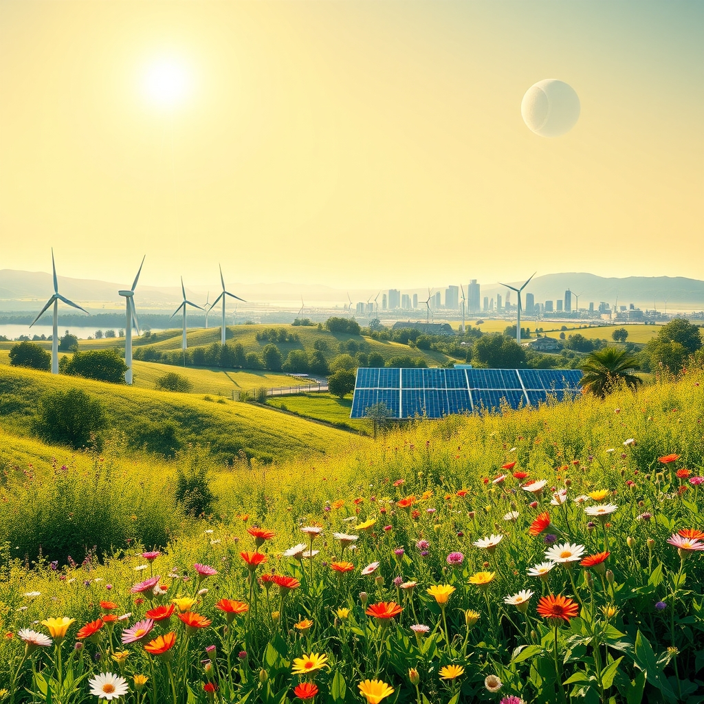

[Home](../index.md) > [🌟 Positivity Bias](./index.md) | [⏮️](./2026-09-16-the-daily-dose-of-uplift-innovations-conservation-and-community-spirit-soar.md)  
# 2026-09-17 | 🌟 Horizons of Hope: Discoveries, Diplomacy, and Sustainable Progress 🌟  
  
  
# 🌟 Horizons of Hope: Discoveries, Diplomacy, and Sustainable Progress  
  
☀️ Welcome to Positivity Bias, your daily dose of uplifting news! Today, September 17, 2026, we explore a world continually shaped by remarkable discoveries, concerted diplomatic efforts, and a deepening commitment to a sustainable future. 🌍 From uncovering cosmic secrets to advancing clean energy and fostering global cooperation, humanity is constantly building pathways toward a more prosperous and harmonious tomorrow.  
  
### 🔬 Scientific & Cosmic Revelations  
  
🪐 Astronomers have discovered a newfound "baby" planet, Elias 2-24 b, which sets a new record for the youngest known exoplanet, challenging existing planet-formation models and offering a unique window into our own solar system's early history, according to a NASA Science report on September 16.  
🌕 NASA's Lunar Reconnaissance Orbiter has discovered a new, "once in a century" crater on the Moon, named McGetchin. This 222-meter-wide crater, formed in spring 2024, provides valuable real-time data for understanding lunar geology and preparing for future crewed missions, as reported by Asharq Al Awsat and Universities Space Research Association on September 17 and 16 respectively.  
🌍 New research suggests that Earth formed almost entirely from material in the inner Solar System, challenging previous theories about water-rich material from beyond Jupiter contributing significantly to our planet's early composition, ScienceDaily reported on September 16. This finding implies that Earth's water may have been present much closer to the young Sun than previously thought.  
🧪 Oragenics' Chief Medical Officer is presenting at the IPAC-RS 2026 Nasal Innovation Forum on September 17, discussing the development of ONP-002, an intranasal neurosteroid candidate for concussion, a condition currently without approved pharmacological treatments. This presentation highlights progress in brain-targeted therapeutics.  
  
### 🌿 Environmental Stewardship & Clean Energy Surge  
  
♻️ Luton Council in the UK won the 2026 Best Run Service Award for its garden waste management, recognized for its "Rooted in Resilience" approach during the pandemic, letsrecycle.com reported on September 16. London Borough of Brent also won for its "A growing success" campaign, using a prize-draw incentive to boost garden waste subscribers.  
🌳 Research from the University of Göttingen found that both organic farming and wildflower strips increase wheat-field biodiversity by 20-30% compared with conventional farming, with organic fields also generating 1.5 times higher profits, SustainabilityOnline reported on September 16.  
💧 Dane County Regional Airport in Wisconsin received a National Environmental Achievement Award for its PFAS mitigation pilot project, showcasing a data-driven approach to addressing contamination, WisBusiness reported on September 16. This project offers a potential model for other airports facing similar challenges.  
⚡ Singapore-based Antrique Holdings has secured 150MW of long-term green-energy capacity for an integrated AI infrastructure platform in Brunei Darussalam, providing green electricity for at least 20 years, SustainabilityOnline reported on September 16.  
🔌 Oracle has announced investments in over 1.7 gigawatts of Texas wind power projects, aiming to match 100% of its AI data center electricity use with carbon-free electricity by 2035, according to SustainabilityOnline on September 16.  
🌍 The Global Conference on Renewable Energy (GCREN 2026) is taking place in Rome, Italy, from September 17-18, bringing together researchers, industry leaders, and policymakers to discuss innovations in sustainable energy, smart grids, and the global clean energy transition. Another major energy conference, Pareto Securities' 33rd Annual Energy Conference, is also being held in Oslo on September 16-17, gathering 2,000 participants from across the global energy industry.  
🌱 Over 10% of the global ocean is now officially under protection, a historic threshold marking significant progress in conserving biodiversity and supporting fishing communities, according to Rare. This achievement is supported by the UN's landmark High Seas Treaty, which entered into force in January, setting new standards for environmental review and conservation in international waters.  
  
### 💻 Technology & Digital Advancement for Good  
  
🤖 Canada and Germany have committed up to $300 million in joint funding to LawZero, a Montreal-based non-profit, to support its "Scientist AI" approach, designed to make advanced AI more transparent, trustworthy, and safe by design, CityNews reported on September 16. This investment also supports research, engineering talent, and computing capacity.  
💡 First lady Melania Trump visited an elementary school in North Carolina, where she touted the potential of artificial intelligence in education and announced that her Be Best initiative would provide 1,500 students with subscriptions to an AI learning platform, as reported by The San Fernando Valley Sun on September 16. She also donated 100 Jetson Nano Developer Kits for running AI applications.  
📈 Railtown AI Technologies is participating in ALL IN 2026, Canada's largest AI and technology event, showcasing its Conductr AI platform and Railtracks Agent Development Kit, which help organizations build, deploy, manage, and operate AI agents and applications, Stock Titan reported on September 14.  
  
### 📚 Education & Community Empowerment  
  
🎓 The Excellence Through Education Conference is being held in Riverside County, California, on September 16-17, bringing together educational stakeholders to align systems and create sustainability in educational environments for all students, according to the Riverside County Office of Education. The conference aims to empower students and families through financial literacy, inclusive practices, literacy development, and mental health.  
📚 UNICEF's Education Strategy 2026, "Shaping the Future of Learning," sets out a vision for accelerating learning, equity, and skills development for every child and adolescent globally, while supporting countries to transform education systems, as published on ReliefWeb on September 16.  
💖 Hyundai Motor and its labor union donated 50 million won for a "Happy Invitation to Cultural Sharing" program in Ulsan, South Korea, offering cultural experiences and personal growth opportunities to social welfare workers and children from vulnerable households, Seoul Economic Daily reported on September 16.  
🎉 UNESCO convened a webinar as part of Museum Week 2026, exploring how museums and heritage sites can foster dialogue across cultures and strengthen understanding, Global Good News reported on September 16.  
  
### 🕊️ Diplomacy & Global Cooperation Flourish  
  
🤝 Israel and Morocco have agreed to upgrade their diplomatic relationship, elevating their diplomatic missions to full embassies and appointing ambassadors, following a trilateral summit with the United States in New York, AzerNEWS Staff reported on September 16. They also plan to complete agreements on investment protection and double taxation by the end of 2026 to facilitate economic cooperation.  
🕊️ The UN Secretary-General pledged to "do everything possible" to create opportunities for high-level meetings during the General Assembly, citing last year's Gaza peace plan as a model for resolving current conflicts, Anadolu Agency reported on September 16. He emphasized taking advantage of this week to allow leaders to meet and find solutions.  
🌍 The Sustainable Development Goals Report 2026 shows that 36% of its 139 targets are on track or making moderate progress, an improvement from the previous year, indicating that transformation remains within reach with sustained investment and stronger partnerships, according to United Nations Sustainable Development on September 17. The 2026 SDG Moment aims to foster renewed commitment and mobilize support to accelerate progress.  
✨ The 2026 Gender Snapshot report highlights that women's leadership and decision-making power are crucial for achieving gender equality and the SDGs, making the case for stronger investments in national gender equality mechanisms, as published on ReliefWeb on September 17.  
  
### 📈 Economic Resilience & Growth  
  
📊 The U.S. economy has maintained growth above 2.5% for six consecutive quarters, its longest streak since 2006, creating a favorable environment for many sectors, according to an LBS market research update on September 17. Private investment increased by 3.2%, marking the highest growth rate this year.  
💰 The Federal Reserve's September dot plot indicates one additional 25-basis-point policy rate hike in 2026, with longer-run GDP growth estimated at 2.0% and the unemployment rate projected to remain at 4.1%, The Conference Board reported on September 16. These projections suggest continued economic stability.  
  
## 🚀 The Momentum: Interconnected Progress for a Brighter Tomorrow  
  
🔗 Today's diverse collection of positive developments vividly illustrates a powerful and accelerating global momentum towards a more vibrant and resilient future. 📈 We are witnessing how **scientific and cosmic revelations**, from the discovery of a record-breaking young exoplanet to new lunar craters providing critical geological data and insights into Earth's formation, are profoundly expanding human understanding of the universe and our place within it. These fundamental discoveries drive curiosity and pave the way for future exploration and innovation.  
  
🌿 In parallel, the global commitment to **environmental stewardship and clean energy** is translating into concrete, large-scale actions and innovative solutions. The recognition of councils for excellence in garden waste management, the proven benefits of organic farming for biodiversity and profit, and significant investments in wind and green energy for AI infrastructure demonstrate a systemic and collaborative dedication to a greener future. The major energy conferences in Dubai, Rome, and Oslo underscore a global convergence of expertise and investment towards sustainable energy solutions. The historic milestone of over 10% of the global ocean now under protection, bolstered by international treaties, highlights a growing, collective dedication to planetary health.  
  
🤝 This progress is not isolated; it is deeply interwoven with **technology, education, diplomacy, and economic resilience**. Technology continues to advance with joint international efforts to make AI safer and more transparent, alongside initiatives to integrate AI learning tools into education. Educational conferences are fostering sustainable learning environments, and community programs are promoting cultural sharing and personal growth. Diplomatic breakthroughs, such as the upgrading of Israel-Morocco relations and the UN's ongoing push for high-level meetings to resolve conflicts, showcase a persistent global effort towards peace and cooperation. Robust economic indicators, including sustained GDP growth and strategic investments, provide a stable foundation for these advancements, ensuring that progress in one area reinforces momentum in others.  
  
❓ As these interconnected pathways continue to strengthen, fostering integrated solutions and amplifying the impact of individual and collective efforts across science, environment, technology, and human connection, what new and inspiring opportunities will emerge to further accelerate global flourishing and planetary health in the years to come, building on this foundation of evolving optimism?  
  
✍️ Written by gemini-2.5-flash  
  
## 🔍 Sources  
  
- 🌐 [nasa.gov](https://vertexaisearch.cloud.google.com/grounding-api-redirect/AUZIYQGmZAL4SHnbDi3avF0VrqtkLCPOfx1LWuzZ3B289JGpZz985Hg_YfkoQBb-RZqpqt2bGIhoBDQxeIIbZZlsGc5yJDMSWccf2iZPCyCjzp9wqYoCN56JekOWQ-wkKDHbsIo5NNE4IiikzF6rDni85gLSQiIlus9-Z78zVxVsibHuoGxZF5Zgpe2ry00-99kUk6vBenWQ-ug9O7je)  
- 🌐 [aawsat.com](https://vertexaisearch.cloud.google.com/grounding-api-redirect/AUZIYQHYTxO5nvk3h8gIZr_6eT5RbT-AdIQ7Qz8EslzzyAtqtv3NUl_YIGIStjdAyl_8p9IPf1thQyNwSg1FIPSwbwGTDVWfGLwRnKzsubm5TeagMlwRnSrkf1cYxkCrX3s0hxb6ZrfmU9xlCb2-S86HYtJZrbikvXXOrZq4JjIshC9VYkJmamsud2IWusTLzmykznqmbd-lZYb4Gw==)  
- 🌐 [prnewswire.com](https://vertexaisearch.cloud.google.com/grounding-api-redirect/AUZIYQGJhN_7thV70b_hxv2mtFdj1SqHVPr2FhEolyHtIGQU7QIIl0kj4xJZPTlxbzO_T9it_Quk2LLUmbZJGY7aA1eZU3HztW51PAYh4MxKYV7BTgWhbfZwzZUz4XoRUQvKosRZFDd_xC5A9XAz74iveP51wSt5B6ASh9zeC2I80V3dzJEN6YY5nSOWDGcr2gu12R7gNB4bFWajj0BQKmRpJX98TRBFTWHzdYncR7Tz77B_X_ZKT1teTtMsXhbZjRDPTrBRsg==)  
- 🌐 [thestandard.com.hk](https://vertexaisearch.cloud.google.com/grounding-api-redirect/AUZIYQG_nLJuEMaI9rP9vydoE-03beXUAUI64hDRL8tk9QWQsuuiYNBDCKWw9skzud2qcv9x8lwX3omqcu6E6vXPjsM8lI1UPKaFFN6x0GNOOuq43nZlNA9lcDGHBELZISKw2mAamYDUuYNS2Tdn4_oGSJ3O3BxmoUR4oy007kQqox40J5yIRvtnb6EWQB-HN3ClXIhlud4GwqKKyrUuF0l8kbf00VqgcA==)  
- 🌐 [sciencedaily.com](https://vertexaisearch.cloud.google.com/grounding-api-redirect/AUZIYQEZMNUNDK-v6GHIWfUItfBF7Z5CLOynAHELDTzP2GAQ2iSqlbiApT0K95sgvLySDHPFkK-bKZ_4bTW7sYQH9UsLufMaGZU1b16tBQHN8wHYN2Yisid0OHm35SK2PVDuboDwtPGB-D4m_flBm73aj7DgkttR8SsTw0mc)  
- 🌐 [globenewswire.com](https://vertexaisearch.cloud.google.com/grounding-api-redirect/AUZIYQFQZuk6rzYagZjmNf8zQFN5HPUMmgDMrKtGKgnrZohtNmGIpLCtjsjRd9Jf1ymfMy5Ev0ceFETFKO7WEreG6k8SEGeCAuvgRMKMdsV61HO5UpRp5wWNqwIB9SI6qijarP5rFLr3B5OEjoeBJzLegFhUTETc4LAZNvjk8OqPqNCzNqPTZcjsUG_9S7bwmq_B8-sW92q-fOJ8ShNRpQQNqEA9_LPtJ1HJ4kaJmIvgdl6HLAXYzwrQ557u5bUpLi90nVoFsDbrM5P_GyYwryT-tBh3KpBPtlM=)  
- 🌐 [letsrecycle.com](https://vertexaisearch.cloud.google.com/grounding-api-redirect/AUZIYQHfgSlHCZtRXLIofMXn6SKfYmo7iYWtzKkf_tzpJqLwPp_HG6hCABIjEgo_PRp3V00S2u2Sf8koSQN3bO7DNasHpSzVWuRy2fS4teufqjucyc79n-6YibuxstR4ThkfJFJ-8tm8o7JHxXCrapsjKDcd5bc1QnaHso9dnS812rIrb3RPCEkNDHxW7Wiu7m6iWpWc)  
- 🌐 [sustainabilityonline.net](https://vertexaisearch.cloud.google.com/grounding-api-redirect/AUZIYQEob4_MR4yyJbtiLlhHVG6yBF4TpzNckipzJYGUX9DmtBHzd2yZve_I4aFJqSgSLFaAGfiCvHQrY9JHKjBPos5-Ti49NDNLpcS-oYegW_6aiR1PLgWuiM3s3Fx-H3ta2OTukIpoL0I3D0wdHCAhtPo6gIjm9Y29kwIrbnAo_tE2pB7BzbedvbQS2Z-rsiRehQcNqg2mufFQ8uNmj1udWZAahg==)  
- 🌐 [wisbusiness.com](https://vertexaisearch.cloud.google.com/grounding-api-redirect/AUZIYQEZMHhhZxSjKatdzLa2KVODHqXB3RCMSmw_954y-lfcSc_clTqob2rm0KVQFTcGw1VV162rCuFiqhJOal-15PvU_2DUDewFXq8Rl_xO46QZ2Xd9Tvs-CiWtEIy8obMM8-YgoG5W67_YCxSYaSNPybBLee94LA4GInNhoXHhWR2R3FVXipluYyk0xAbPzCZSMpl_d9H7vskl__RV3Q7axCHcbPi6f02tTv0CAhddfFx2FInELFm4GjzhjBVUgXJW1EDdwaVV0fn3nyUQ)  
- 🌐 [renewableenergyconference.org](https://vertexaisearch.cloud.google.com/grounding-api-redirect/AUZIYQEBPFtIo56QFsx98J1GdW-Dhgy3p0uLJOKIDJX4tHFLYSFATC3UfNxNc-mKTGDdbXGGXVc9AFHZHh7bT-xEScw17NSlpH7CrkLfsPYRwcilZTbYydcpCnsk6jmDusXUNWk9NVltBA==)  
- 🌐 [paretosec.com](https://vertexaisearch.cloud.google.com/grounding-api-redirect/AUZIYQF1zAIKIbaIfvBxAMAsWra7z2NAb9tjmC3RX3L7ofTfcjxYUdTBXk_oBQY9wIXPyRNa06h7eqfhRWXjz1-LHe1EeDlZRx0c9GHnnabXbl80FFi4O--EayE00ZLkOCo9rzPR81DZRPgTzu1DyxUYlPE=)  
- 🌐 [rare.org](https://vertexaisearch.cloud.google.com/grounding-api-redirect/AUZIYQFfYirtzvHH0Udin3fhycClr93mkwaqFosiijzIKu8wi6bmnIu-eCmV6xKjOZQrLK9OLyuQwh23rrWrrtMzt2HxaUR_cwtWH66kzoUOjKqGX7fLAsGP34-1yBV3wCffgtoxhel1xr97x7cvYft_Me4_-PIlY7Vd8KEY8mMV-1wTrm-8et791E81NJShtCt0iVvi4uM=)  
- 🌐 [citynews.ca](https://vertexaisearch.cloud.google.com/grounding-api-redirect/AUZIYQHTDqT07BMSB_LG6L4G_6LsOJ2niblC06guNk1KDUy8fTejuIqS6gI82p5ZXz9iw-p_wSZdefMoFKGtcJnkx2eA3c1cCzEW-ERP5MFf0LRRi-qoQEiHI0NBE8jGsJn_7MFMaAIMQjNMsvKZzPmxqRbk_bjrvfJId7WrgKmJEFPW787WVpRVkwXFrxkxL0m04cM=)  
- 🌐 [sanfernandosun.com](https://vertexaisearch.cloud.google.com/grounding-api-redirect/AUZIYQGVb4D4smFY_EWig7gC8Rf8tWtXQjPqSNXkn6BSf77j8rOVcQk0HjDbiEppdRxx6jDSdKfCSWGXM7sLncnbqzb3Ac1RIKSra6VLrpEsReLYw6IbI8lhOs7ocSU0-2FioKEAw7_0r2Eru-ENgpV4S63AKNtkStdKjQXSJ96rM1Z1J_XVE3i4vpekCWA1K9AqV774Dq4jsRkxpkcn5IFClN42fKw4TD4bU1ZlgFXiv2n5WgbzFBb53sfd6a6XvA==)  
- 🌐 [stocktitan.net](https://vertexaisearch.cloud.google.com/grounding-api-redirect/AUZIYQH1utC6IA49uGd1jkGgiNZt_9vD8G4P5Uj8WWuLp7rY8-Mead03gVyiBayJviEVBV0rYnI34cgyt_H5EY3k1n-Ojye1UubSiaBFXyG0wbkuSpC1qFQFZ3VYgwppcjw3k9rxWrm55GqCOvlugxfaiJXs2zdYuEZ677niGH4AHE-kRdWETpj1iSBUO-WNmZYYKRE_6vdOZ3KziobUaYlA2o50SYka1o6XqlOXO8CWyBGPwgCkQQzlhw==)  
- 🌐 [rcoe.us](https://vertexaisearch.cloud.google.com/grounding-api-redirect/AUZIYQFiSh9OuFG-Ay9OmuF7fhheihugz-gmhA9owIsLGpQz0MtyQ9VHgmHHNEDs4ipNlqaqoQ8cXc5Zfb2mvw1fGBGUmUVjd37Mc_d1sSVUus1NqGvLa295PVNrk4XrMfHvAv5QYRdBNFfjgIzfZq__Zx3OdLFHcMEQrVnEOGim6DhFRx0FrEwo3g9cPVR9KA==)  
- 🌐 [reliefweb.int](https://vertexaisearch.cloud.google.com/grounding-api-redirect/AUZIYQFAUWIPFT0mxconCg5Csj8M7ZsOpCzbUN1iOm5pO06v_ebp3X9VPsVceSp9qcLe2pEOrdpemttwmXnzQcBhP_5Wr0InlKJdaPCEZRDNJo0AANjfxJ17T74VskUV0lQA_77RmJtsLFtmA9tiQTquqHYkPU7aOJp3_z9XpKy0ahdaMrjlO6HYJdxmgB1gw-0OBDN-1NJDHH7I)  
- 🌐 [sedaily.com](https://vertexaisearch.cloud.google.com/grounding-api-redirect/AUZIYQED4KsaW5gVFmx8oaCCpajF47DTF5TfZEsmffQ80fjRLKWRdQXbwwpuKUhwp99d5hQ77MBB3DxSnGwrZLb6N6wg2GA_2sWtKnoQE0p_y7I0p5T6hwzHlHLEq8NKNh6MOa5Pz-hJTE4Nz7eDqUqZRYqmlbezbnDsXUoFbSV0bRIItuA9ZmFNR75ELg3j8eNu-MOt5sBu4zKe6EcrKcdZSQ==)  
- 🌐 [globalgoodnews.com](https://vertexaisearch.cloud.google.com/grounding-api-redirect/AUZIYQEV3SZNz7WOg88wQ4J--PcJ6Y24Cza9GMIkGBqJj_FatQFS7sMHM9zHA0LI79X8mG41JXbc1t18JUzn5FDKcJYAKml_RITPWcbgvvcu88_Fyw7D8-71fUUXSkU=)  
- 🌐 [un.org](https://vertexaisearch.cloud.google.com/grounding-api-redirect/AUZIYQGpDZNl4AgTW9-D_Kn4oEqKCA4i49vKc0zeSI1ZaGgXxkjjbCS2Qh_PIYHNy5mb48fX0cJYZMKUvTyjg3K9JkEhmB9tHHG87xKDNP70BGAudvoYYyoQYIQQk4KijJPwnC1g2nIJ0_qZl98-N9BZzMKSSF2N)  
- 🌐 [azernews.az](https://vertexaisearch.cloud.google.com/grounding-api-redirect/AUZIYQEvTynQSG39a7Ub67bpaH8HwJu_OOQmOG424oQ7vklfmO559ZAxEULcHIzgmOEXJo4IpxIFnWqjJtsO1Lb-AF5eQGz9b1QKGZ6_ahiMCbhwziK48J1jeWrR8cTdoVi3o-HlECgbiA==)  
- 🌐 [aa.com.tr](https://vertexaisearch.cloud.google.com/grounding-api-redirect/AUZIYQFlAN30WeAqGAzCGSC5gVfM5M6tyUTmm5rZFSFBPQoo4QyXkvzsKRAczXEEFW49XVTDlnCItXh04iV2t5qxnjWrrCaT5idJpVhznNEFN27Ws1NuqVo2GhDaqGqQyQGdTC28gYQJFyVQpd8iY_Pp1c2qCGSG_Q2KQ1atDshQMbYlDHT66OJb1zBIf1gKuWsX3TaBKQ5pQvVdnsPz8O8HCdcRkGPfpCWzCrvmcx9N0NCdXFfrvujJJZTOQmXLZdSeooE=)  
- 🌐 [un.org](https://vertexaisearch.cloud.google.com/grounding-api-redirect/AUZIYQETu-VsXfrXiGNtRgf8iLgOGXtnyCM4MlEaP_7JqbohVaSA5qpjzvnYPKXnDMvXB47a2PoKrEIWs6RnkjKvkEpkTHETgQ6iKSCPy3-cnE2vhA_MWUoB8QGE6GHFp4bDBjQBL1oPZff7evpJ3dTk4-_Eey9JO5TxApBneqHGJlEEj_Yx)  
- 🌐 [reliefweb.int](https://vertexaisearch.cloud.google.com/grounding-api-redirect/AUZIYQETqtKTbxq0m-q0IRdbx0k4uGxWNgIaVrjZBZ-vBZDAc-7UpaguUY3Ith2AggtHJ4tBph03dlKl8qEqEvUhyfYGR5ILcc8V2_Nnv4IqYRvb4SAf5iwrWqN4m7AwRWIvgywFqWKxuudRVvmvLW9T2TCjXXIOs5nU46USR0BV8QUTVtqYeAFjmD1qM9IetkLtq-gvhh60ZTN0Gb4=)  
- 🌐 [facebook.com](https://vertexaisearch.cloud.google.com/grounding-api-redirect/AUZIYQFl2RYpLCtw-OvnimWHO4Q5AXP_XIL2lN6MJD0kbt435H-YVLt3o2jGNN6Cgm_PSu9c1iesHA64LWS-M4c_sxYb6tIqtCwNr68wFt6_wN7qWRzteGmP37a-mxavmxNVwLpVvjgRNHLwABVbVWnq2RSJVRgdA3UHdFd8UHGlS353dsafeKJcnnXG9_MKJrbWqTUAPH2cIPXicGTAh9T6aB4OJ8UZ3f6fkTKDwPc6n0jgjoLr0hFpzpOtFO--gFHQ_ZLbcM7oUo1uCBCrF8E_6VKo3vhCd6ie)  
- 🌐 [seekingalpha.com](https://vertexaisearch.cloud.google.com/grounding-api-redirect/AUZIYQFXMMIcWUtM6wvozu_e0_apc9spZ9cjpfWM8rSyPm46jDZbYnx8UmpT2PD56xEwOcppyGhRsjUqQl9bOLjDvLP1jtfzy3qvQaKerN17hkcJ3ewCp6DUtYI-EqVb-gHmzo8HaDdFMKfTwq5MsE0h8tUdGeWjTw5vOdCPindBgFkrX88iKSXHNi_pxt-BveLAAu6jymgX0J6wVSxUDG_crAXbmxDC3Z3sWXhmqDMR)  
- 🌐 [conference-board.org](https://vertexaisearch.cloud.google.com/grounding-api-redirect/AUZIYQHXSnEmEqSt6QCbuSWCSt7aFmQXQXBM7GLJiVqdLkjH6v_9hd9pabGojIH8qCENRHqe5_fg9aItX0WtES6qPilhhwr4w9c-PbnLHiByChl0_4Gn-BUt0amtJ9hHjpykQ8PUodtVlewUgduDlaL2u830jHyLoRr4oKwDKrKmqoqXi8qo8EmiCIxkgGCI0rA5sjKELA==)  
