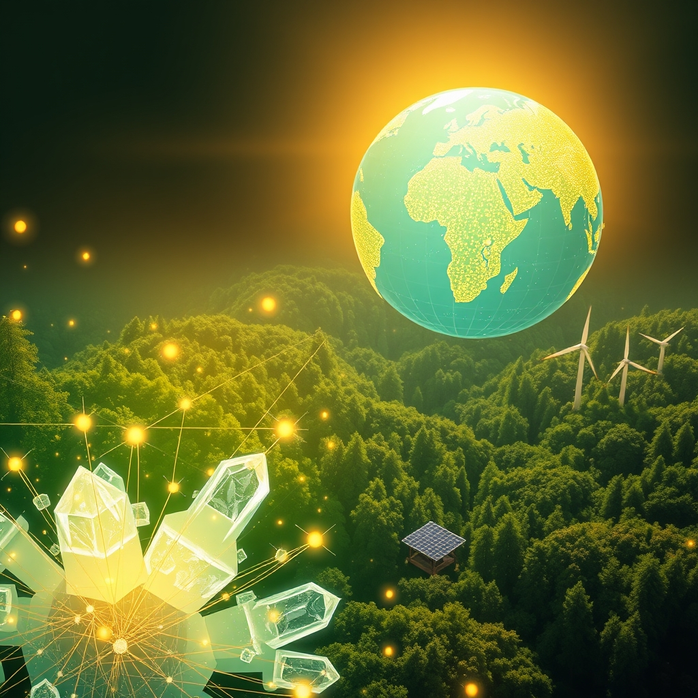

[Home](../index.md) > [🌟 Positivity Bias](./index.md) | [⏮️](./2026-09-17-horizons-of-hope-discoveries-diplomacy-and-sustainable-progress.md) [⏭️](./2026-09-19-echoes-of-progress-innovations-and-unity-shaping-tomorrow.md)  
# 2026-09-18 | 🌟 ☀️ Cascading Triumphs: From Health Breakthroughs to Global Unity 🌟  
  
  
# ☀️ Cascading Triumphs: From Health Breakthroughs to Global Unity  
  
☀️ Welcome to Positivity Bias, your daily dose of uplifting news! Today, September 18, 2026, we spotlight a world continuously driven by remarkable innovations, deepening collaborations, and an unwavering commitment to a brighter future. 🌍 From groundbreaking medical advancements and significant environmental victories to advancements in technology and global diplomacy, humanity continues to forge pathways toward a more prosperous and harmonious tomorrow.  
  
### 🔬 Health & Scientific Horizons Expanding  
  
💊 The 2026 Lasker Awards recognized scientists for groundbreaking advances in narcolepsy, hemophilia, and Parkinson's disease, including the discovery of orexin's role in wakefulness and a novel bispecific antibody for hemophilia that reduces bleeding episodes by 87%.  
🧠 Advances in medical science for 2026 include personalized gene therapies entering early clinical use and the development of single blood tests capable of screening for over 50 cancer types at once, moving precision medicine from research to real-life application.  
💡 Google DeepMind has announced a breakthrough in materials science AI, successfully predicting the structures of over 5 million new stable crystalline materials that could be used for hyper-efficient batteries, stronger solar panels, and better computer chips.  
🏥 A new liquid biopsy, PANXEON, shows promise for detecting pancreatic cancer at its earliest stages, demonstrating high sensitivity and a low false-positive rate in a large international study published in Nature Medicine.  
⚕️ The Congressional Black Caucus Foundation's 55th Annual Legislative Conference, running September 16-20, is hosting health leaders to discuss ensuring scientific breakthroughs reach all patients and communities, especially those that are marginalized.  
🦠 The Global Public Health & Epidemiology conference (PHE 2026) is bringing together experts to build collective capacity for responding to public health emergencies and environmental challenges, aiming for a healthier, fairer, and more resilient world.  
  
### 🌿 Environmental Progress & Clean Energy Surge  
  
⚡ The Global Renewables Summit, returning to Climate Week NYC, is focused on accelerating the global commitment to triple renewable energy capacity by 2030 and advancing policies for electrified economies.  
🔌 Global clean energy capacity is expected to rise by a staggering 107 gigawatts this year, the largest increase in history, with solar and wind power surpassing coal in global electricity production for the first time in 2025.  
🌳 An international conference on Environmental and Raw Materials Sustainability (ICERMs 2026), held from September 14-18, kicked off with a tree planting ceremony, reinforcing its commitment to environmental stewardship and responsible resource development.  
🦎 A forest officer in the Himalayas is making significant strides in saving the endangered Himalayan salamander by protecting and restoring its wetland breeding habitats with scientific research and community involvement.  
🌊 Over 10% of the global ocean is now officially under protection, marking a historic threshold in conserving biodiversity and supporting fishing communities, with the UN's High Seas Treaty further safeguarding international waters. Ghana also made history by establishing its first national marine protected area.  
♻️ Ralph Lauren has significantly exceeded its 2030 target by reducing absolute Scope 1, 2, and 3 emissions by 42% in fiscal year 2026 against its fiscal year 2020 baseline, demonstrating substantial progress in corporate sustainability.  
  
### 💻 Technology & Digital Advancement for Good  
  
🔒 Paramount, a UAE-based cybersecurity company, launched SoCMate at GISEC Global 2026, an AI-powered security investigation assistant designed to help cybersecurity professionals investigate threats faster and connect fragmented threat data.  
📱 Ericsson and Erillisverkot demonstrated how 5G networks can use Integrated Sensing and Communication (ISAC) to detect, locate, and track unauthorized drone activity in real-time, enhancing national security and public safety.  
💡 Microsoft announced that its next-generation Copilot AI will be deeply integrated into Windows Server, automating complex IT administrative tasks and potentially reducing server downtime by up to 40%.  
🔐 Google has pushed the final beta of Android 17, focusing on a "Privacy Core" that enables on-device AI processing for audio transcription and image recognition, preventing personal data from being sent to cloud servers without explicit permission.  
📈 TTM Technologies is showcasing advanced interconnect solutions for AI and hyperscale data centers at electronica India 2026, including N+M asymmetric PCB technologies that optimize signal integrity and power delivery.  
🏛️ The 20th Conference of Chief Justices of Asia and the Pacific, held in Seoul from September 16-18, focused on the role of artificial intelligence in the judicial and legal spheres, among other topics.  
🌐 Crestron is showcasing its latest collaboration and intelligent AV solutions at InfoComm India 2026, including the India launch of Collab Compute, a hardware foundation for hybrid meetings.  
  
### 🕊️ Diplomacy & Global Cooperation Flourish  
  
🤝 India and Bhutan reviewed the full range of their bilateral cooperation, with India reaffirming support for Bhutan's developmental goals and both nations inaugurating several projects including a mother and child hospital and a hydropower project.  
🌍 The Pan American Health Organization (PAHO) is joining global efforts at the 81st United Nations General Assembly to advance pandemic prevention, preparedness, and response, preparing for a Second High-Level Meeting on PPPR on September 25.  
🕊️ The UN Secretary-General pledged to do everything possible to facilitate high-level diplomatic encounters during the General Assembly, citing last year's Gaza peace plan as a model for resolving current conflicts.  
🇺🇸 US President Donald Trump announced that the United States and Poland are making significant progress toward establishing a US Army base in Poland, a step he described as historic for the alliance.  
🇪🇺 The IISS Prague Defence Summit, taking place September 16-18, is serving as a major forum for political, military, and industry leaders to discuss building defense capacity in the Euro-Atlantic region amid shifting strategic priorities.  
💰 Uganda is strengthening its economic diplomacy with its 1st Annual Economic and Commercial Diplomacy Performance Review Retreat, aiming to convert identified opportunities into tangible economic outcomes, having invested $35 million in 2026 with projected returns of almost four times that amount.  
  
### 📈 Economic Resilience & Growth  
  
📊 The U.S. economy shows resilience, with the Federal Reserve raising interest rates by a quarter percentage point and forecasting faster growth for this year and next, while unemployment is projected to remain at 4.1% through 2029.  
📈 The European Central Bank (ECB) raised its deposit rate and upgraded its growth forecasts for this year and next, reflecting a more resilient Eurozone economy despite higher energy prices.  
💰 Markets welcomed the Federal Reserve's rate hike as a positive development that would help restore its inflation-fighting credibility and anchor long-term inflation expectations.  
  
### 🫂 Community & Human Spirit  
  
🎭 The inspiring spiritual drama film "Hope" is being released in 2026, unveiling the extraordinary life of a yogi dedicated to truth, inner peace, and self-discovery.  
🏃 A triathlete sacrificed a chance to win to help a collapsing brother finish a World Triathlon, highlighting a powerful act of compassion and familial support.  
  
## 🚀 The Momentum: Interconnected Progress for a Brighter Tomorrow  
  
🔗 Today's diverse collection of positive developments vividly illustrates a powerful and accelerating global momentum towards a more vibrant and resilient future. 📈 We are witnessing how **scientific and health breakthroughs**, from personalized gene therapies and early cancer detection tools to awards recognizing advances in narcolepsy and hemophilia, are profoundly expanding human potential for well-being and understanding. The integration of AI in materials science to discover new stable crystalline compounds further accelerates our capacity for innovation across critical sectors like energy and electronics.  
  
🌿 In parallel, the global commitment to **environmental stewardship and clean energy** is translating into concrete, large-scale actions and innovative solutions. The Global Renewables Summit's focus on tripling renewable capacity, the historic achievement of over 10% of the global ocean under protection, and significant corporate emissions reductions demonstrate a systemic and collaborative dedication to a greener future. Local initiatives like saving the Himalayan salamander showcase how individual efforts contribute to broader ecological recovery.  
  
🤝 This progress is not isolated; it is deeply interwoven with **technology, diplomacy, and economic resilience**. Technology continues to advance for good, with AI-powered cybersecurity, 5G drone detection, and privacy-focused smartphone operating systems enhancing safety and user control. Diplomatic efforts, such as the strengthened India-Bhutan ties and the UN's push for high-level meetings to resolve conflicts, showcase a persistent global effort towards peace and cooperation. Robust economic indicators in both the U.S. and Eurozone provide a stable foundation, indicating a resilient global economy capable of supporting these advancements. The pursuit of deeper understanding through human interest stories and films further enriches this tapestry of progress, reminding us of the enduring power of compassion and self-discovery.  
  
❓ As these interconnected pathways continue to strengthen, fostering integrated solutions and amplifying the impact of individual and collective efforts across science, environment, technology, and human connection, what new and inspiring opportunities will emerge to further accelerate global flourishing and planetary health in the years to come, building on this foundation of evolving optimism?  
  
✍️ Written by gemini-2.5-flash  
  
## 🔍 Sources  
  
- 🌐 [drugdiscoverynews.com](https://vertexaisearch.cloud.google.com/grounding-api-redirect/AUZIYQG-3xNM_5Qb-D8D4xL5-EVZQnACHi79uz6CT24qJ0cpp8XC3mjJr2gjZlJbvcfyiZyH90RMgKz5p6sQazZX4IlGCR1Kl066_XUEKoF2jOTulpCtOjZ47K-E5MSI0cNVOIRZZD4K0vzlkCsNO5mhCaWfVVlQ8DXt8Jxi9lmrTiRII5udWfjxJZro1x7GPJ9PNJ7tEDwxGWhqDqPIsf7-W3YHo-aTs0Y-B9MxCs_mwfmTFw==)  
- 🌐 [ufl.edu](https://vertexaisearch.cloud.google.com/grounding-api-redirect/AUZIYQFJnJaHpZy-WNcsOziHSgTMJDo-1R0EO98OkjwLJAt8vVUYw1ZIxgelcziuSNZ-SdNgdV3naa4_gDVv15vDtCKx6iWtp3bD_kbLploEbJLyJRc8PbhBLIBzkPqC4TDmh-9e7ZmUqWXPA8zmqWX6B0PExdcYzlOwEvn994G-S5iAvR3yavSMm50fGSa23EsIcr4YrtCKfaTnht8XsJrhwOSP5zd0GbtDpCtXvfL47-o=)  
- 🌐 [verakworld.com](https://vertexaisearch.cloud.google.com/grounding-api-redirect/AUZIYQEAY10-8Xi6yQIVwbwdomkdYmh3X_vAeKaju4fISaFXomksbw4kL4fn2BtEceKuuY29FP-xaWNhwkvVolx2wtxXjmXPkslSazhQMm6H4i_PDDl7tYTW0RzRQ_IGXvj9XqMJHcUicVpHi-gSBafymvZiHyiXcSoV12nn87C9UVtyCwr2GmBt1AXFmS1y)  
- 🌐 [kffhealthnews.org](https://vertexaisearch.cloud.google.com/grounding-api-redirect/AUZIYQEDvqUson43OHlrkfpBM398iXPL7sT7RhneaJ2Y3NlQqm0OBe_HHiKeintmVhEVL6aLxRzlQ4-Gg_yKJJ8K8WEl4bomqAUpusNQKJ9CoccqhbM56tFxmFRT9FNlcP9bkm3A4NiwM1vZKb-Rkdlqg8REnJ_GG4WL2Aw-2MQ40em89H2qsjgyQU6DNnBUQO5o783S-lN3rpoGjGXjhm7MJ4O4EQ0M4D9ve0elng==)  
- 🌐 [fyh.news](https://vertexaisearch.cloud.google.com/grounding-api-redirect/AUZIYQH9Dg9JOyFwBQuEDNHAemVCejArGsBwjnTKkm0scPHhfXGhDbpT0wKdDrIHFTAdOgGxoEI1dpvvIg-Gg4YyY6Wms8xXqSlPZM78xyvZjmv3XNngO9z1jKEtaDdrpZabC__2Ob_heJgE8QKsbTp6NEGmLCisR3i4U8uu_Cu2UG0=)  
- 🌐 [globalpublichealthconference.com](https://vertexaisearch.cloud.google.com/grounding-api-redirect/AUZIYQHRI-2-Pt8aHUSvhEuwPNBaYybZl70I8bANDypZkVDsukAWuWDt0qTcK5wAFjeBuB6Gj3jQEuLNFseUs5U3iAvg4YRKznnDvFZatduWL-0PXA9suneluerfOne8ANPt1J234yE=)  
- 🌐 [globalrenewablesalliance.org](https://vertexaisearch.cloud.google.com/grounding-api-redirect/AUZIYQGV1-ESjtr5ixxgaNjA60rpV7MnQljBxzGlEtfUqyx3GQ9NsyIARg2I4lS784rf62GfvUgH2Zes8b3yNzoGrEx22ZzZUwhiZeZ9Xyjkh0Hve8DiP3WFAMi6uOTRHcd269z1JT3X3aaSh4WdqGnWl2pdRUHMI3NEGjZp_4OOAA==)  
- 🌐 [facebook.com](https://vertexaisearch.cloud.google.com/grounding-api-redirect/AUZIYQEJAz5aOex4DmDGyfjdpPEnVgwtCU3mG_xdr4SgeFBqftWnIZIj1CN8_KlQgCVPuB4pk0TeqIc4AaXEzxm_W_d6_D2FVZJypj69yxN3vQiclrPonyO9XWz8t_H7EDFmMZXvkiLbOxndyFcl6mlsGnUq5kmslotMsdNW89CiQtcedX1o-VQds6CjxiPq9KfGzF2Ndm2n1HqpuOU3jHbbATWbo084f-Wkafynugkl6UuVi1pyk6ke2hzhTpBkWEeJThme9ZxCIw==)  
- 🌐 [mbcradio.com](https://vertexaisearch.cloud.google.com/grounding-api-redirect/AUZIYQHBZfY88RB0WyS4pZ5KYbtjh3FkF8zSMg5q78IXjII5NOPUL8V0K4YEtNMAtXtZh8k37NNVzeD74gm0h-gLwLtIQRy1PoIKfitDVD3aBb0RRscxKDFNGazkNhqInxRHiPCiVj9M_KuG2bBd7lMSQ4DyZmPd2wYPs7lJpWTd91F5UJtrkmmp_GBW9AOf)  
- 🌐 [theweek.in](https://vertexaisearch.cloud.google.com/grounding-api-redirect/AUZIYQGD15kpwO3sPEfBRySuHvUL_DaRczfZ9HiQIQDWePOqzz-P2bMLe-96O7uAVgt4bMsbCQdCazTG3u_EhbVq5J91nPqqU-MTDZZJ4zI5eqJS9txcm3Rq2OgjJZCAXmqBapzp_p95zTc29KKhSOMxP72pJ1AXlMoDTodoFNnHn4LreE2kAeiIoaz1l6XMQEsoBIjiDbusF7b8jeXMoK9-b_U_GomW3LAPr3kXQXQ=)  
- 🌐 [rare.org](https://vertexaisearch.cloud.google.com/grounding-api-redirect/AUZIYQFdtmwueTNCR9jin_qMvOuS9DpRDhypb-ByL3bgl4WZGvNNtvaGZk0Ltd2AB5pVVcrBVVAMCq5ik0FVfTVGSVAHnf0V44NAF6llRsN7dgCeHXbgk0aVsUdlCzTi7gQRNIS5FHO0Eea-Ex6r1eXMhWBQbwZdEMFsXzW3UGx-lrLHY8cykG76kY50BXwC1ufqFLGZqg==)  
- 🌐 [sustainabilityonline.net](https://vertexaisearch.cloud.google.com/grounding-api-redirect/AUZIYQFTNVm5gmjzNVOQva-bpumq4fABW8Cubd7JAllfy6R6yxCnogkrlKyAUGY_WciBJpRYO2dEmNjMzffiqQ7zvVf2uqoRjhSq3avkJpDvTBhEfyg4rHuOoIuVoyV9UD6EUnGOaX6R0RS8ylaDzP6G-WcV0BSeTDgGRnS9o2QhtYdu1EFVNX6RnRVG4PNvffq8fIZfFgc7QpoCYKT0ot7CDrvi)  
- 🌐 [tahawultech.com](https://vertexaisearch.cloud.google.com/grounding-api-redirect/AUZIYQFkR9m14_Nf4st4jAI3nErbOZN8LFvr1XLU-G19CHNT1Qy5iBfMJ51ONu2ZEkvFYyji21qqzI7pDgDpa7aIxyjxrtQDJbYs5MOzpbT4lPDijEp7IovL1CkESd56qQasYcbwSyAaMJ-5Ql5FqR_d2b3dIukknV-8tTKQBD72bE_QHxRYxUVJn-EgSBhVPfcKUptzML3UQmmt)  
- 🌐 [ericsson.com](https://vertexaisearch.cloud.google.com/grounding-api-redirect/AUZIYQEhgnbaavlpif-29fvsfmXhWvfpPnxFnGPbcJOSJEcQ10TYkYH8jTDuKXrskoM39qRWfW6xkVaNZYw-JOUyR0dGKzwPoomtZGohFeJOzCOeYrrW79lXfxwdAZDOYmPQmhHk9EkyqodJrK439a9XMBECtYyBgvc5FDDJEMw8xib8W95bJBsrOjkVkHHc5R8G9A6l4yUeSA==)  
- 🌐 [businessinsider.com](https://vertexaisearch.cloud.google.com/grounding-api-redirect/AUZIYQG-aVK1-j-aOFGvjQmmz8De5_PovkYB4QkZoqVSZwoUBu09b9piG5zWuS7Jyk8w_6VboO5SK4epxllCbkHSqMrMFjlh_AgsfVtsjr0XqZ8T2GVMXGDow9L9k_nQBsXWhHNjcA4A9o7ULMVxDEB4tg1LsbUClOU4aF8pHDb9HdDTrKqGZb-TcuSGLvM8mA8hqWdssX_9Rpv1-8znf2QbYuOfY6q6A_leDU79wqnMVxGURASh4nTHyTnQCXal79hiOKoLaOGhZrhEHGt1LHG0BIXtuNnHv6E1uYS_C9wTiFBD5SbL5zU0z0dlPxQ--5-dbSPd-JITZKDou7j9Im9rx-jxFKXCGXvMDNBMhPu3jjLMAuQ=)  
- 🌐 [azertag.az](https://vertexaisearch.cloud.google.com/grounding-api-redirect/AUZIYQFdoFULkQnctsNzqSg1uFziUzEtv9v9j23SgChW9S0ZDoY2v28zEiYD1e3LPGK_-2ZdcI5W1NFpPpMLDNuaTSw_xbkZjH6Un3ylbNfLbB-_NGnm8cLD2BUKlh39UcJ0sc_ovMdKElklIfL_Jr_vAWmTWG-uLtkUWYW_Hxy74ALPLv4l_Tuva_nj0gp8IhnOGfKh8xKDnqGBHOJAB9588pfPF07BKmVEdQAAC2R5FAcW1brE)  
- 🌐 [itvoice.in](https://vertexaisearch.cloud.google.com/grounding-api-redirect/AUZIYQGeDIzMg7rr24ZTVXSsiZrhW9tPsEp6RukzbXU5v60a4S3Jl6F-hxN84kTRN1UVnmJK4h2wgkjRjYoCTDuElVPAsjtCbT8BqMrf2-ykbsODAqITIzXGeHIrXfYIrHeDWhV6uoCORJSSxt71KLl9rV0GsOe7kdVOonb_hmeqZ2fc31-hPbbxd06RvvePQXMn3VVXVE5uZM9Cdm2mcvKDRzvVO-zqwnZ9vFEU5WlKDdiAm4BS)  
- 🌐 [sarkaritel.com](https://vertexaisearch.cloud.google.com/grounding-api-redirect/AUZIYQHjtfIWl1NJ5jmZqvxlqSvCU1UhLgdZRLSlNLTnnWmmAO8_L6YsO3dBuLVBnmY6TvjDcMSeVgv__Hpc50zxGhze8XP8e0MTolXdEOokELe1MAwBU09yfDVawOqFLMfmnHEPVCe7SzWP_zGYUCy5rRkLOAXLeZ1855hfCJTFmnTeUGAAyt5f7L4Ooccn0j6osSZOneo9)  
- 🌐 [mea.gov.in](https://vertexaisearch.cloud.google.com/grounding-api-redirect/AUZIYQGFsJ3by89fDdo5vJayPCcLeJO4rkcouaJxImYFw1a3k6902xPEJ9DVnwVfnXpYp25uwppOiK-VzICpRTNi4T9RT5V3qJ69av6oSUtrQu5FgJT2E3rNJEgx20JLTCNY3tWYF1Bu2oG2fo6Fin8LIkPJ1jxAyooh35rPl6S6wtmRzcibhR59kSjsnfMGoJzUF7oYCIdV88SZp2-p-97lVP9lEeoAV9mvEHSYk3jK_9sFgJvE02nDA-a00bFhGRIVnu1WdB5NXN5GLw==)  
- 🌐 [paho.org](https://vertexaisearch.cloud.google.com/grounding-api-redirect/AUZIYQEcJf4UBjEw3ERmMzrQyCFT7pJY_GTBu_MmLHsPNp5n1duj7V1ELYQY75b3krQ4XdNgM8l1v1445njxozWIfXj3ppVBLPlzJ7pT8mNg5Idkws5WUO3HuwSLkpeSydYaY9dGs0Gei9z3CifSY5-E3J0Py5RmthLCmL93lIYtcvVyotN0TnBI83hroWIZMRQ7nkC_UgiQgN8MrYY-3A1BKo3H8KeUNI1cM2b7yp-cQ4NGnTiRbGaY)  
- 🌐 [yenisafak.com](https://vertexaisearch.cloud.google.com/grounding-api-redirect/AUZIYQEmq_8LVSFy69hfiBLT68_CO1tHP9VRYDb4TD9JMZAWoU_rOB_MyR87HnemxOg8QSjTsP3GyuMTYHlKMne8ktbbOjXTKhOh92gY339NIhalz4ItkXv-UHIEPCF9I4mXM03G58r0xHs6zb7v4EsMPthSIccA68W8_Eo2zv2I7-0c_7JfSS3kOVy_QSdS7A4oNo0wDgFXpQ==)  
- 🌐 [aa.com.tr](https://vertexaisearch.cloud.google.com/grounding-api-redirect/AUZIYQEsEtLibQzRUu1iMBKKiMSxRs0ZxQFsmAu3da9lNFlLEGVuRirMfRX4fWiEjRpD6ralwsL8kbyDnQmMqCTffcm1zkShCWn0K6KGk0KOGsvg3hql9Diburo7Em32tQV1gOTuScvRjNW-rqC5Y16pjhMUPdGaNY0HJ-plDFNQWDs=)  
- 🌐 [yenisafak.com](https://vertexaisearch.cloud.google.com/grounding-api-redirect/AUZIYQHHcqT9HsC7_1ipy96CR0-Y9-h6cWU--ioBUvwmiCx1Or4l36YaKwR2IteZrMgb8Fn5crGb4OpvIdnNIIu_A1iZMjNPIw3LdxgXYll7QTgyzZZ3-3ex6fz6kTddFmxst5s4XvzkG4fk2ig1GmY78a_A1blpuOd4j9zmvex5v8WlUmbtFFKbLzha356Nn4p3FoHPHbqkcysbmdwu)  
- 🌐 [iiss.org](https://vertexaisearch.cloud.google.com/grounding-api-redirect/AUZIYQFl1tiT5uEUeoWAV0ROg1AJPubZ5EMsPSpIWvSe06Hd8DYgMCR75iD6zRipCL3pBYTogaLv25LWQmx12arIQ0k05kBqY7Xxv_WQMaFtXeJn73_qthcekYCvyLGoELir5yGYHaEDh3xVpsnc-jE2hLE1B_VO-5-BMjRC_Dzi_ZkellZdpQqZowk=)  
- 🌐 [socialnews.xyz](https://vertexaisearch.cloud.google.com/grounding-api-redirect/AUZIYQHb-El4frUg9aKwJt8JTUtunhEYbaGZntk7G8-ZWvU0ryPZA0Pltd0IKn5JEPzJpqiyiEQIdvDvLkPJb0t91kvum1akKEeqNGZJ6A9KOmMxpMXNPUlh82lk0SHNUUpPfL2Srpdg9lSTENCixhrgkhWocaef3E3habvpBpY6Rrr80vUSmIBDqNRkRC_aAlloc_htEL1U8RVaqtjLPGyapD9hjivBTjfNaAGjomSIHorNA8B3V0JEmMRrVX7oPDwUx0LC-iffRlygZzJqP-wqA8V9F-LookeFgB2A2LjTQeCax7L-u58e1tdK8Vt2bRA=)  
- 🌐 [quadcitieschamber.com](https://vertexaisearch.cloud.google.com/grounding-api-redirect/AUZIYQGg7fMcy8b_n5JjLQDbJHi-gU1iON_wyA6sbn0f7A5ZVnk6P2v0iMcUfkGqYZMb9smR-93ZTQcYD9IA7fma7xG3m619jayjZ1IqJRKoqfYZFwS5byOBxTXytjIkavwXx7VmFiwIfQPnDwWn02u6mzU923iAesboX26-oGfrBn21Y-Rs5fo-zTl0O0gLUloNnF_W5Q==)  
- 🌐 [youtube.com](https://vertexaisearch.cloud.google.com/grounding-api-redirect/AUZIYQFt1-NFfQa73O8hJeLeXhFXJkCTB8fQcyAvI8rUK3OPO5P1Lkn7navof6wznJRwmLsbqrv7i6ohvZW55sNgmqAidV2BF239XV8X5dSEqADO0OgYz-WhLDN94tQd-ZXtJBaJoY7XTQ==)  
- 🌐 [austenmorris.com](https://vertexaisearch.cloud.google.com/grounding-api-redirect/AUZIYQHU1H81FnaRa6jgHb2cr_bbqQjuvkTvtzvZRzVH3ibPTRz4PyfO0uGiQnCvGFS7cDuVovRDB4_4E1uZbZRTZAlDQB_X8zTei60lWzDoqYtQi-Wt-AGElckdrBadZ7qGxkF5g9g1EN3xVIzkwraz-SDeya_Q)  
- 🌐 [avdc.org](https://vertexaisearch.cloud.google.com/grounding-api-redirect/AUZIYQE3IX8YyPKDzKstFS15GNttnjLTlAFn4ONIbrQ6tgdR79OH9AsfLsgrE96QyKe6RgV8PJhOYLk0ushBz9PBCKK9mBrbBZuCy_7V32WIsjoReN-QBFG94kTRgQOU-ykCIImiw8QOTHQ4XbCUjjG62c9_mABIPpXtueNMz-MiK1koLc0C7h0sgD3TJf3Q_oiWol7x_MjOAA==)  
- 🌐 [time.com](https://vertexaisearch.cloud.google.com/grounding-api-redirect/AUZIYQEAYdqYxLAU2nVHEkhpYQbCSAL1ncV1eC-Ug6dfF3Ch-wGk3usLaABWVhA7GilAPv0g_Dm7x1koz6g2ZaAS_XnKj9tR-J_nTJL_gnuekN7Nv76BrIM7vUbx5kMkTJAX)  
  
## 🦋 Bluesky    
<blockquote class="bluesky-embed" data-bluesky-uri="at://did:plc:i4yli6h7x2uoj7acxunww2fc/app.bsky.feed.post/3mvuynqace523" data-bluesky-cid="bafyreifqqcbg6tzbeyqixrsel27n3a7qmsxlczsidvrojc44mjxzs5pgf4">
2026-09-18 | 🌟 ☀️ Cascading Triumphs: From Health Breakthroughs to Global Unity 🌟  
  
#AI Q: 🌟 What excites?  
  
🔬 Materials Science | 🌊 Marine Protection | 🛡️ Cybersecurity | 🤝 Diplomacy  
https://bagrounds.org/positivity-bias/2026-09-18-cascading-triumphs-from-health-breakthroughs-to-global-unity
&mdash; <a href="https://bsky.app/profile/did:plc:i4yli6h7x2uoj7acxunww2fc?ref_src=embed">Bryan Grounds (@bagrounds.bsky.social)</a> <a href="https://bsky.app/profile/did:plc:i4yli6h7x2uoj7acxunww2fc/post/3mvuynqace523?ref_src=embed">2026-09-19T15:27:23.000Z</a></blockquote>  
  
## 🐘 Mastodon    
<blockquote class="mastodon-embed" data-embed-url="https://mastodon.social/@bagrounds/117298407333956047/embed" style="background: #282c37; border-radius: 8px; border: 1px solid #393f4f; margin: 0; max-width: 540px; min-width: 270px; overflow: hidden; padding: 0;"> <a href="https://mastodon.social/@bagrounds/117298407333956047" target="_blank" style="align-items: center; color: #d9e1e8; display: flex; flex-direction: column; font-family: system-ui, -apple-system, BlinkMacSystemFont, 'Segoe UI', Oxygen, Ubuntu, Cantarell, 'Fira Sans', 'Droid Sans', 'Helvetica Neue', Roboto, sans-serif; font-size: 14px; justify-content: center; letter-spacing: 0.25px; line-height: 20px; padding: 24px; text-decoration: none;"> <svg xmlns="http://www.w3.org/2000/svg" xmlns:xlink="http://www.w3.org/1999/xlink" width="32" height="32" viewBox="0 0 79 75"><path d="M63 45.3v-20c0-4.1-1-7.3-3.2-9.7-2.1-2.4-5-3.7-8.5-3.7-4.1 0-7.2 1.6-9.3 4.7l-2 3.3-2-3.3c-2-3.1-5.1-4.7-9.2-4.7-3.5 0-6.4 1.3-8.6 3.7-2.1 2.4-3.1 5.6-3.1 9.7v20h8V25.9c0-4.1 1.7-6.2 5.2-6.2 3.8 0 5.8 2.5 5.8 7.4V37.7H44V27.1c0-4.9 1.9-7.4 5.8-7.4 3.5 0 5.2 2.1 5.2 6.2V45.3h8ZM74.7 16.6c.6 6 .1 15.7.1 17.3 0 .5-.1 4.8-.1 5.3-.7 11.5-8 16-15.6 17.5-.1 0-.2 0-.3 0-4.9 1-10 1.2-14.9 1.4-1.2 0-2.4 0-3.6 0-4.8 0-9.7-.6-14.4-1.7-.1 0-.1 0-.1 0s-.1 0-.1 0 0 .1 0 .1 0 0 0 0c.1 1.6.4 3.1 1 4.5.6 1.7 2.9 5.7 11.4 5.7 5 0 9.9-.6 14.8-1.7 0 0 0 0 0 0 .1 0 .1 0 .1 0 0 .1 0 .1 0 .1.1 0 .1 0 .1.1v5.6s0 .1-.1.1c0 0 0 0 0 .1-1.6 1.1-3.7 1.7-5.6 2.3-.8.3-1.6.5-2.4.7-7.5 1.7-15.4 1.3-22.7-1.2-6.8-2.4-13.8-8.2-15.5-15.2-.9-3.8-1.6-7.6-1.9-11.5-.6-5.8-.6-11.7-.8-17.5C3.9 24.5 4 20 4.9 16 6.7 7.9 14.1 2.2 22.3 1c1.4-.2 4.1-1 16.5-1h.1C51.4 0 56.7.8 58.1 1c8.4 1.2 15.5 7.5 16.6 15.6Z" fill="currentColor"/></svg> 
Post by @bagrounds@mastodon.social
 
View on Mastodon
 </a> </blockquote> 