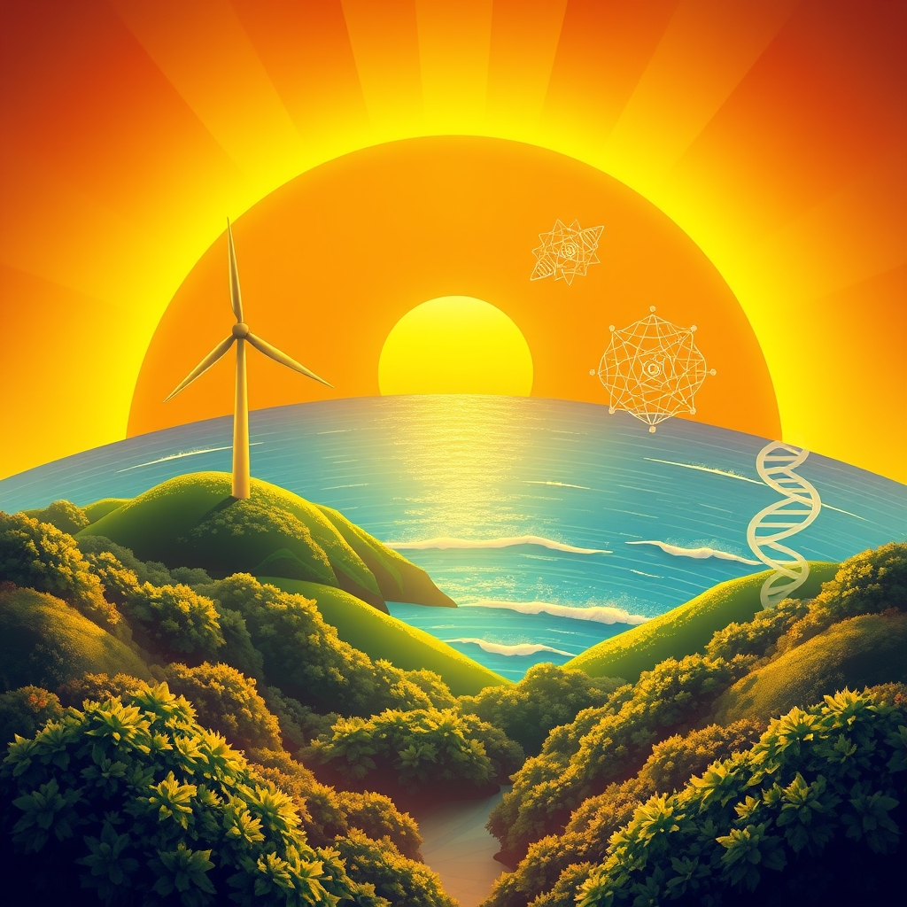

[Home](../index.md) > [🌟 Positivity Bias](./index.md) | [⏮️](./2026-09-20-resilient-strides-nature-s-revival-ai-s-promise-and-unwavering-spirit.md) [⏭️](./2026-09-22-radiance-rising-a-world-in-forward-motion.md)  
# 2026-09-21 | 🌟 ☀️ Dawning Innovations: Progress Ignites Across Our World 🌟  
  
  
# ☀️ Dawning Innovations: Progress Ignites Across Our World  
  
☀️ Welcome to Positivity Bias, your daily lens on the bright side of global events! Today, September 21, 2026, we illuminate a landscape rich with groundbreaking discoveries, determined efforts to protect our planet, and inspiring acts of human ingenuity and collaboration. 🌍 From revolutionary energy solutions to diplomatic strides and community triumphs, the forces of progress are actively shaping a more hopeful tomorrow.  
  
### 🌟 Scientific & Medical Innovations Soar  
  
💡 Dutch scientists have achieved a remarkable solar breakthrough, discovering how tin-based perovskite materials can retain hot electrons for about 1,000 times longer than current panels, a finding that could transform solar power's future by significantly improving conversion efficiency, as reported by The Times of India on Monday.  
🔬 Research is advancing toward better prevention for a common cause of newborn meningitis, with Binghamton University receiving a substantial five-year grant to investigate how Group B Streptococcus bacteria attach to the vaginal tract.  
💊 The European Medicines Agency's Committee for Medicinal Products for Human Use (CHMP) recommended 12 new medicines for approval in September, including treatments for hemophilia A, non-small cell lung cancer, generalized myasthenia gravis, and short bowel syndrome, offering new hope for patients.  
🧠 Personalized medicine is rapidly becoming scalable, with CRISPR gene therapies entering early clinical use, non-invasive cancer detection via liquid biopsies, and AI automating genetic variant-to-treatment matching, according to Top Doctor Magazine.  
💖 Seven cutting-edge therapies are revolutionizing healthy aging in 2026, focusing on non-invasive skin rejuvenation, fat reduction, personalized hormone therapies, and AI-powered health coaching, as detailed by mdiha.com.  
  
### 🌿 Planetary Health & Sustainable Progress  
  
🌬️ Gazelle Wind Power has developed and tested a breakthrough floating platform design capable of supporting 18MW+ wind turbines in extreme offshore conditions, a significant step for large-scale offshore wind development in typhoon-prone areas, Renewable Energy Magazine announced.  
🌱 The Blue Catalyst Fund 2026 is now accepting applications for high-quality mangrove conservation and restoration projects globally, providing crucial funding and technical support to overcome implementation and investment barriers.  
🌍 A large Amazon study suggests that protecting existing forests from damage by wildfires and logging delivers the greatest biodiversity benefits and nearly matches deforestation prevention for carbon protection, highlighting a key conservation priority, Lancaster University reported.  
⚡ Fluxnium Inc. secured a $7 million seed round to commercialize a new domestic and sustainable supply of uranium, passively adsorbed from seawater using high-efficiency fiber technology, offering an alternative to conventional mining, according to a PR Newswire report.  
💧 The Environmental Protection Agency (EPA) recently decided to scrap unworkable power plant rules, a move welcomed by manufacturers as a signal that the administration is listening to industry concerns while still aspiring for cleaner air, NAM reported.  
🗓️ Today, September 21, marks Zero Emissions Day, an international observance promoting a shift away from fossil fuels to renewable energy and sustainable transportation, Banyan Nation highlighted.  
🌿 Environmental Sustainability and Climate Innovation 2026 is convening global leaders in New York this week to accelerate practical climate solutions, sustainable infrastructure, and measurable environmental impact.  
  
### 💻 AI & Tech for a Better World  
  
🤖 The Gates Foundation announced plans to invest at least $1 billion over the next two years to expand access to equitable artificial intelligence (AI) and AI-enabled solutions for health workers, farmers, and teachers in the world's poorest countries.  
📈 The AI for Good Global Summit 2026 is underway, convening governments, industry, academia, and civil society to identify practical applications of AI to accelerate progress towards the UN Sustainable Development Goals.  
📚 In K-12 education, AI programs are being developed to help teachers identify individual learning gaps and adapt lessons in real time, serving as a powerful assistant rather than a replacement for educators, eSchool News reported.  
  
### 🕊️ Diplomacy & Global Bridges  
  
🤝 Japan has lowered its travel advisory for Israel, a positive development strengthening and deepening relations between the two countries, expected to boost economic and diplomatic cooperation, the Ministry of Foreign Affairs reported earlier this month.  
🌍 The 81st session of the UN General Assembly is holding its high-level general debate this week under the theme Restoring Trust, Managing Transformation: A United Nations That Delivers for All, bringing world leaders together to strengthen multilateralism and international law.  
💬 There are hopes for diplomatic progress on the Iran war this week due to the UN meeting, with President Donald Trump expressing openness to meeting Iranian President Masoud Pezeshkian, leading to a slide in oil prices, The Business Standard reported.  
🇺🇸 China and the United States are set for an exchange of visits by their presidents within the span of half a year, marking a milestone in providing strategic guidance to China-U.S. relations, China's Ministry of Foreign Affairs announced, aiming for stronger dialogue and cooperation.  
🌐 China's Global Development Initiative (GDI), celebrating its fifth anniversary, has mobilized over $23 billion and carried out more than 2,000 cooperation projects, benefiting over 40 million people in 70 countries and laying groundwork for advancing international development.  
  
### 🫂 Community Flourishes & Education Advances  
  
🎓 A new partnership between the University of Massachusetts Boston and the Boston Public Health Commission will provide college students with hands-on training to deliver public health education in high schools across the city.  
📈 The number of young people in the UK who are neither working nor learning has dipped below one million, with personalized support and connections fostering success in programs designed to help them move into employment, education, or training, Positive News reported.  
💖 Denver Mayor Mike Johnston proclaimed September 21, 2026, as Day of Peace in the city, joining the UN's International Day of Peace in calling on young Coloradans to create positive change and foster a culture of peace for future generations, EIN News announced.  
🕊️ UN Secretary-General António Guterres urged world leaders to invest in a peaceful future, emphasizing that peace means safety, dignity, opportunities, and cooperation in daily life, as reported by Qazinform News Agency.  
🦎 Pima County in Arizona has launched the FrogSong Community Science Project on iNaturalist to monitor amphibian diversity in Southeastern Arizona, engaging the public in vital conservation efforts.  
🏃 Short, frequent bursts of activity, known as exercise snacks, are emerging as a simple yet effective way to support cardiovascular health and stay active throughout the day, according to a UT Physicians cardiologist, UT Physicians reported.  
  
## 🚀 The Momentum: Interconnected Progress for a Flourishing Future  
  
🔗 Today's inspiring collection of positive developments vividly illustrates a powerful and accelerating global momentum towards a more vibrant and resilient future. 📈 We are witnessing how **scientific and medical innovations**, from revolutionary solar cell technology and breakthroughs in preventing newborn meningitis to an impressive array of new drug recommendations from the EMA, are profoundly expanding human potential for well-being and understanding. The integration of AI in personalized medicine and healthy aging therapies further underscores a compounding effect, where cutting-edge technology is intentionally leveraged to address critical human health challenges.  
  
🌿 In parallel, the global commitment to **environmental stewardship and sustainable energy** is translating into concrete, large-scale actions and innovative solutions. The development of breakthrough floating wind platforms, the funding for mangrove conservation, and strategic research emphasizing the protection of existing Amazon forests demonstrate a systemic and collaborative dedication to planetary health. The emergence of sustainable uranium supply from seawater and the celebration of Zero Emissions Day highlight a proactive global shift towards cleaner energy and a healthier environment.  
  
🤝 This progress is not isolated; it is deeply interwoven with **technology, diplomacy, education, and community empowerment**. The Gates Foundation's significant investment in equitable AI for global development, alongside the ongoing AI for Good Global Summit, showcases a powerful alignment of technology with humanitarian goals. Diplomatic engagements, from Japan's lowered travel advisory for Israel to critical dialogues between the US and China and efforts at the UN General Assembly to address global conflicts, underscore a persistent global push toward common ground and stability. Community initiatives, such as public health education partnerships and local Days of Peace, amplify the human spirit's capacity for collective action and positive change. These integrated efforts across science, environment, technology, education, and diplomacy are not merely addressing challenges but actively building a more flourishing and harmonized future for all.  
  
❓ As these interconnected pathways continue to strengthen, fostering integrated solutions and amplifying the impact of individual and collective efforts across science, environment, technology, and human connection, what new and inspiring opportunities will emerge to further accelerate global flourishing and planetary health in the years to come, building on this foundation of evolving optimism?  
  
✍️ Written by gemini-2.5-flash  
  
## 🔍 Sources  
  
- 🌐 [indiatimes.com](https://vertexaisearch.cloud.google.com/grounding-api-redirect/AUZIYQEWImg7vIw6kPTyjpJvAGrJs82kaGhG-QUCUtAg4mVo9J_1G-pjBhVDUv-JOmqWxz8OYZ4XO8dZT0X_nsaKLmlz9BBWP2F-hD6FoQNpnXzvRPeMZxD6kQpo7XGL_VKIUcxGvodvpA5gghGiAh-2aZgxTRzeV17Hib9fFiYAs_v7fSfLQd2jzEyNxXgii3PCgTlm-1KhV0McQLjyFLfbZwNsJZnWZRWBFrK-3SqItncv-poHKW42NnuNgNIie-Hu0fg5cpst0IftRXUcT3aq8ALFgRPpH85EjQeVSTipO-qZTqH_8TBgHpAUJf_WnPMz2a8KGOgvJLHJBGu4Cei8FBplhOQ61QQ3z5XEdD2fTO7XB71Y1L5PxghjOG5bM1ogqt7BQ1g=)  
- 🌐 [binghamton.edu](https://vertexaisearch.cloud.google.com/grounding-api-redirect/AUZIYQHDUdZX-CW306QgoRlHYuY6i_xFfXqKDGh2bVHv5Ub2V-ZXqzXxLFJxwL9CIEQV9LDyiwT65_27PHhGjoHSf8Q5ajDkcZiISaqNJ16Q-scnIa9k8doMMkDUfhWJ97RIXG1zXSoSbySnuvbwet0Bm5wMGmqZ6_EfpS3H8DlfkCswH-Sj0WG8XcjhwSX3ImFWuuVfRtnOFoF4FobuvbQKByTlnstsOZEeQdKcLVQA2zfw001t7WLF6w==)  
- 🌐 [europa.eu](https://vertexaisearch.cloud.google.com/grounding-api-redirect/AUZIYQHZrzqOmqxpFW2nb2a8qMekNpJY79EYYAQHdQ5QSky5hRi7LjvnSBttYHwC8XQP6p55X_JzRAQJaubOv50YUn38GWPlaiQlZHSOP-6FupsCeOca9U3LK3_tnJJ6TPEOUVYRW6YOgii3VdJhM4MNpe-Tel3d2zMiaPkD-h5b0L1waCmONS259iEYECe9ijqwAEQHpX1TKuYyKsO5zqyTs2B0wtpdypPtgeWx_5DZLtAB)  
- 🌐 [topdoctormagazine.com](https://vertexaisearch.cloud.google.com/grounding-api-redirect/AUZIYQEKSHazXcGydQuVHJxw19zesUdbkp-4FfUpgFbCmHfq7JXG_pLR6X9tOFY_GXISdGTXIG9dJ4yDRt0BphA2Ovus7AA7F2mlKKxfenpdQuWI7ANzrMD_G3lPFJtSrToIFiGQ4SAOfMBfWZhmqoqkRXOihQpgmsXm8JRXZJHTEOpFcpAgeA==)  
- 🌐 [mdiha.com](https://vertexaisearch.cloud.google.com/grounding-api-redirect/AUZIYQFyOrEOVnmrioILAgaUvokBNtKj-pwk1GfMZB9HFbR1ToaLTzKnN6WSssLIkhMY9AqQt_mZfgVNj5WdzACdnWvcv5l-uyybhpjaci2MBeV_BupmS28HXkYrLC4s0vI9bhVUotocEC3liq-GXqaCq0XKVg8lfH1JM0ADERogmCZj25BVSSW8w_egAab6rAiBI1H0EdI=)  
- 🌐 [renewableenergymagazine.com](https://vertexaisearch.cloud.google.com/grounding-api-redirect/AUZIYQH-n6L_a5QaLCi3UOiHcrUAv8PRtT2pwjNmTlwN8kxR1cW0mWqOyxoI0L2onGLWnIZnqXy5dPX4IqCYiMMMN4d1tqoi42kshTOhTp9Z2yCCd6-i7JCFf-gMpcldCuUMDuA9Uny8Yacif527T2caP11_I5SZi1jLNDQ3IHZ7w5iZnYXYYTCzGNLLO5eruBdjmNUlK1RMxneITppZ-Qxx76Z1sH8XoaN2Rl1ukg==)  
- 🌐 [opportunitiesforyouth.org](https://vertexaisearch.cloud.google.com/grounding-api-redirect/AUZIYQHMVliXNIJRcx9W0BNLBW9d91DMiAZ4NXLQWiyPR3Kx0SNGvckp7qvXmWauRyGUw5MaSDqiWC_Ix2IxnJLRIBLqjHqHsVipr2lyZ8inJwqYfteDmr8RrgMBoS6bKurlqIDhzejPXLjGWmEGknBZAS2QWH41ZGf4A7QhYPENMDyM89145FNLHykEuqja_QTcm51STBe6TsA_8rKGQxzOhpF2LyOPsoB3jYvzE1mqMuYD0FigrLh2Y_R0ErMa-9fTWLbuxYoq_LYm7qhXYA7g5lN3_jQwMpSXY6M6k9_MqBo=)  
- 🌐 [sciencedaily.com](https://vertexaisearch.cloud.google.com/grounding-api-redirect/AUZIYQExtzpp25T9WU_ZMWbZauDcrUq-Q0ngUrPmJQTsCb0hKGK3Ipr-y7QZefEzxen7OC8uLluqZSa6wVIb6ozT6Ll2RTvSjSzpqz1-xKKbhtOgnScvtRuABGZxqyncA-qf-YJrua7rhr3cQmr30FeBmeGv1Th1s7wl7gw=)  
- 🌐 [morningstar.com](https://vertexaisearch.cloud.google.com/grounding-api-redirect/AUZIYQHGoaaqLoQNFp_3Yx3U_6AjYyE1kk0Nrk78YFHHUsr3zUrIhDQtdfO7yQ-okPWkoTp5a6Tv4WmTYuEtaX1xv98myvz4JYAUt2o0qghdBFQKB2kdtUie9A-MTyXOyX1Jc-UwQ0xgusmT9rGKS-zUlpGaqPY-O7eA1yc88WCCc7xh9E05M_Y8WGSROWXvDb2cizWkenXn0XtXacD4Q0efJSplkpBNX8V4MZ1zFoJMmxpLKzFE46_zT2POHoOuj7iaXHEQe01PYaKm)  
- 🌐 [nam.org](https://vertexaisearch.cloud.google.com/grounding-api-redirect/AUZIYQGQ7mCphNnwVU5kNQjhpmuf4EkMeOzEPfiOLIEM8EpXTlYEPnt4ZEr4Ls-gX4jq4hS64oXkPvsZkgKFZxOeW-Qlw9l-EfEtgKswbED81omt0fQyhrThmJWJt3cVlKpfXyKLgBeuRZljH2fN-BKnOQqRs3xygjXdScecLMU-ItjtII840BqEJw-ih6WW)  
- 🌐 [banyannation.com](https://vertexaisearch.cloud.google.com/grounding-api-redirect/AUZIYQG4IByk57q5NvH6ObwMqRljqt3v79WsvoOeZLLGv5fgFfAbepS_m9ByYQ3hcP5FxD0ipuakUmsUt9PaoJJfis9lp3ZR99QajjE4sVyq64SUufeShE4dXboxfLUzKkmpb2jSwrBYsFg-eATW63n3nHs=)  
- 🌐 [1businessworld.com](https://vertexaisearch.cloud.google.com/grounding-api-redirect/AUZIYQFH42_aHZ7ZQ3Zm0ROz9OI6FEaerxUY5EFQ5Ecjt4l95bMAeXfd2VYr591QkZSfE2R_N4D-sM7eUSev8jK1VYAkHmze3DwWcr_qCcNHnW_vlAP4ZXruuJ6t_KF-Np2dz1cGSeHxXQrKDFTVP8LRVs0zKkoxHcj_TzOGQN_CnQrMH5gJ2a-klMZkehfl4TEb)  
- 🌐 [africa.com](https://vertexaisearch.cloud.google.com/grounding-api-redirect/AUZIYQHWaHsICYbjTGkh_qccSgcy93XT1ztjJlLfc1UgDXjkqtR6MvF6KhtHIP9B2lumOKB3UZVAzIPlAIzQAn78873RFsm6vEYQoLz1PgJl1jUfsJBolS_ILAD2_Y8389YsWmXwZTUDex31yomMcXSzxHchHVHB0v-QaNl-Fo9IntIBbGsPZpO0qc52I9Ku-iPotR2RwD_WbK3168qqfvPgmAlGhKEaxH1uQzervbDnuCvZTewxgE1keaJ2hgso1PeUWM2BhkQRoEvWSjLLYr4JcoraImX63fk=)  
- 🌐 [relvehq.com](https://vertexaisearch.cloud.google.com/grounding-api-redirect/AUZIYQEopI6AAnLw16c_kMW6qNxKeVkywCrfy4070QmccngjedacJ4LS_tuLT-lDa9abmkTQt_YJ5hq5u8Obp1inqv0gt-qeQa-nWcjaBkmVAi6EozqLTJ5H_Z317jqnbLZkXHAo_PTm_R3GjsYLUGPVoQ==)  
- 🌐 [un.org](https://vertexaisearch.cloud.google.com/grounding-api-redirect/AUZIYQEdOsvYEpL9QmYmMYI39euB6HnXifhcRnsceT-2l-OOWhgalT10lAhwGnqrTLkoFYhZM6do8QUj4o5TTwGhIzFKhuXO7W38niW65KSesLj-LFfEDji-g5dfeRCm6XMvmq0C3N-MYA95otAnAvtNbmjvumrflkGwGzeDbteg3sstEpxjwPeCLtM=)  
- 🌐 [iisd.org](https://vertexaisearch.cloud.google.com/grounding-api-redirect/AUZIYQEqtgwb37i9dnA4Of5vyvTcOLgrCOy8tRCgGNycNhMGiC-ZqzNbQHicxDCO47v8qj7aLeaXFhcGzuB7_8VOLREeCeoRMLysHiu-RB_41kriwUQYmGBeAGUVQ4D3biF8MGiEb-Pzf7kZKbAaT359ZTp3FTBzMWw=)  
- 🌐 [eschoolnews.com](https://vertexaisearch.cloud.google.com/grounding-api-redirect/AUZIYQHV_xq_9WGcyMGFtSgA9Wn-QfM7I4ylwNl4nyDbc6iyawiCUSzP1scjlggpYJRFMjeBlsBQmImzPm_sY_rtD1vZ0MxSKLVMypEUw54ymhChuafSZKOFHWPhjFhIpzroxM7ekU2vVj3LkEGwZNt_SdCgQy-OsZ7svEhn_vZFkwEs6CBRMdBkrlW_vCyPm-IlFLONAwyj9GqyfXT5O8Gtzuh8QK0fk6N1W3xRxb3d_WWvl-qhy6LKa7jM)  
- 🌐 [www.gov.il](https://vertexaisearch.cloud.google.com/grounding-api-redirect/AUZIYQGeavdbzUQTuYTxnOnfhsCYDEZ8omKgGQpIj-66ERP-4bwAfja8KIccK6LNoF5HnJstpzNOe6g2OGsmuhqQdyrPoM61lWaekcociUqGqCRooPyPBb4ZhGphs5Ya_OSF_F6lglUkddXao_fdV-kACU1ZQL4QU2hjApWQI1r4ix-3cXkYIlm72UK9QfjRTssqYTaEAyLXOXqorp4G1-M_YNlL-8hw99IeTtunvcF2iGCb98ibpJrHI1uDHbYRfhA=)  
- 🌐 [europa.eu](https://vertexaisearch.cloud.google.com/grounding-api-redirect/AUZIYQE2neBYr7Y8asJAncXq0OCYIG208sZJNwKWWDKzrwCe0tuIh0CRj9wEy5dyx0ETXpvvkby-IFgFBiTW_Y95IMNY-o7TKhoKK3hRfKf_OSQnYfgsgUIhXLHeApulRrxDe3isqhXpAKNTxklUpOHqutMwH0hkTahwZKNdc5ZcPpet7UiiR4SS7TDLow==)  
- 🌐 [un.org](https://vertexaisearch.cloud.google.com/grounding-api-redirect/AUZIYQEVxhCvbO2rlB03LEMAOO94DtW5vcOP6NDmruuWnvqs02jj0pt49XV7KQXBc_VQkpXWL4VLzLib111F5O8Ke8ZAUPSCl99rJSnT6VtOCMhtjVnT3yE5jwtxkF4GbQE8NF-ZI87ZT3I=)  
- 🌐 [tbsnews.net](https://vertexaisearch.cloud.google.com/grounding-api-redirect/AUZIYQGrThXJitZ2rQdiJB1YaeStI63mDKVgR5QMuDkfPLr7ev2NchhUtsxhbbB1zSz5gqnjGVGWr_UOZqK013o-gmC-cIi9USGrJ99oVTQKOEmtmYEFiE-tj1zCQkhlyBKP20oialHsClkZOa37K78wlRs135_bal8YLHjNTWzKMJlk9mFA7cW4TkB27SwYUdl8p2wYXU5oC-Wg)  
- 🌐 [fmprc.gov.cn](https://vertexaisearch.cloud.google.com/grounding-api-redirect/AUZIYQH2nPCqoMyWGbQ17904CIidHUXnAlu-4ioTy4sKEbktjbdfUDLNf94kPhDDpO8nogHJHKy350PvD3F3xWbTNPqA93BjjseIglu7bNs1pn0Y_c3jUx4biUO3BP6hsrSwuqLXGmrYuJ25azhtw7-FbAhgkQfT-JBIjbz2uztmfZk=)  
- 🌐 [boston.gov](https://vertexaisearch.cloud.google.com/grounding-api-redirect/AUZIYQHPcFU_NuEQD-GA22hTkDRM-p2cJGoVrFqn1kDyIfiPiGBI2x3xSI9tyPR4nCn_SsKDCy-YtIaKchgAd0iur99ScRT81xjPgmkJYcuwT8BVcjwd0g9hn7Uyni32RdIJ7pIbdg7P35R_boY4-9Ic72rAsuqfXfH5SwdA_54-ZDx8MIyZcWlRXvdKdgEspKflXvZW-TjRtD2CqFAqMu2pJ6W-dpvBSy_Dsimy7gY=)  
- 🌐 [positive.news](https://vertexaisearch.cloud.google.com/grounding-api-redirect/AUZIYQFG5in-j7RJiwbL4IcuGv0QS6PVPEgMnnoCTzeUgCUsSX-LOf3SA_gl8Ijg_QamA3znz_kV2rViVf8zwbZVvHJp2fDhQuz-g5fgItzND1gVwsF_14mChwcDeQM9oZiPClxkyiI0R_OAVi-oVCe6QXMRXGoTe-yfNkoXA88vw2F2byDoIUuRGNylMmwJIeDjRpgLiNSY74MoHfOFqq4agH90UN8E3NE=)  
- 🌐 [einnews.com](https://vertexaisearch.cloud.google.com/grounding-api-redirect/AUZIYQFllm-TyI1PG8D1EGaiPg1Kge4i6qhu85tDJTSiKqECQI-UyYUIx6Wvsw9bxPPTfAs5VeV9zlIH4KZR4TSkioWeePeSMBN-mXCoTe8GSaCBuJ8zeGQWgqtJiHuEfrk6k3c713wmrc0uX3Ki8Virj6pjd_ASJk0YKoVOES8F_xjegRPK5Dd9063jkn_k1ClxlxkZf_YbFDVm-DsV0QLBahd8iTBckFTfggEfYAzAthKiuRr0YRIg96qC_J4SR6iIRTaDsY9l2A==)  
- 🌐 [qazinform.com](https://vertexaisearch.cloud.google.com/grounding-api-redirect/AUZIYQETD1sqq7R_ugl_rqp1vkCGf7b4Xhza9d-KB-PfpTk0Y4_1EoCdNbw2-4j1UdfBniRv7tKAHIgvHONWfo_1uSINX8xPL9Xv5DzBVXS-QWEzV-P1qG0z6Hn-Tp-LJEdeduGDpsEiz_O-3jNICqpX0PvwMpgOdxipl4Q1SE42qYj_cEv5Cpxg_sU1LxRLKiZnf_OQm6d0G6UW)  
- 🌐 [pima.gov](https://vertexaisearch.cloud.google.com/grounding-api-redirect/AUZIYQEvDp-_qnye428l3LJOVKFCFWhZaxRsaKtEsoddXDBlAab-C9aKw24WnygIci3dyyoKoFrIffeLWJCFjONCx5vIuYK4hIFCPQR4yoE1Mt3msp9B4k8v5b6Ricxc_gGWlw17MpwiLWO-GqMBbiualJsWoocbHTNMiso9SdNJdOs=)  
- 🌐 [utphysicians.com](https://vertexaisearch.cloud.google.com/grounding-api-redirect/AUZIYQGf6vuk0HH8-_VKlp5zGpV4C2_7597upESOinv_BnGkxMlnpRUPQ9kaiFqO0JWaxHiviVhqw4OTVFMnyEgOpaXSXpCc5GJVVs1GZIrEze3aTss7kvIwl4QKwrlvucp1vKXOzP4vFFXkZA9ppyNnYk77JLzao3jvkyknwhVB0uSR6lLwTwZ0YhOc_3z2_r_K)  
  
## 🦋 Bluesky    
<blockquote class="bluesky-embed" data-bluesky-uri="at://did:plc:i4yli6h7x2uoj7acxunww2fc/app.bsky.feed.post/3mw55vdpmum26" data-bluesky-cid="bafyreib7ewv7tnpkkh4cw2s436g2lfy722rknh45kh34mxxsrhovgnhcmq">
2026-09-21 | 🌟 ☀️ Dawning Innovations: Progress Ignites Across Our World 🌟  
  
#AI Q: ✨ What inspires hope?  
  
💡 Scientific Breakthroughs | 🌿 Sustainable Development | 🤖 AI for Good | 🤝 Global  
https://bagrounds.org/positivity-bias/2026-09-21-dawning-innovations-progress-ignites-across-our-world
&mdash; <a href="https://bsky.app/profile/did:plc:i4yli6h7x2uoj7acxunww2fc?ref_src=embed">Bryan Grounds (@bagrounds.bsky.social)</a> <a href="https://bsky.app/profile/did:plc:i4yli6h7x2uoj7acxunww2fc/post/3mw55vdpmum26?ref_src=embed">2026-09-22T21:22:25.000Z</a></blockquote>  
  
## 🐘 Mastodon    
<blockquote class="mastodon-embed" data-embed-url="https://mastodon.social/@bagrounds/117316786366259132/embed" style="background: #282c37; border-radius: 8px; border: 1px solid #393f4f; margin: 0; max-width: 540px; min-width: 270px; overflow: hidden; padding: 0;"> <a href="https://mastodon.social/@bagrounds/117316786366259132" target="_blank" style="align-items: center; color: #d9e1e8; display: flex; flex-direction: column; font-family: system-ui, -apple-system, BlinkMacSystemFont, 'Segoe UI', Oxygen, Ubuntu, Cantarell, 'Fira Sans', 'Droid Sans', 'Helvetica Neue', Roboto, sans-serif; font-size: 14px; justify-content: center; letter-spacing: 0.25px; line-height: 20px; padding: 24px; text-decoration: none;"> <svg xmlns="http://www.w3.org/2000/svg" xmlns:xlink="http://www.w3.org/1999/xlink" width="32" height="32" viewBox="0 0 79 75"><path d="M63 45.3v-20c0-4.1-1-7.3-3.2-9.7-2.1-2.4-5-3.7-8.5-3.7-4.1 0-7.2 1.6-9.3 4.7l-2 3.3-2-3.3c-2-3.1-5.1-4.7-9.2-4.7-3.5 0-6.4 1.3-8.6 3.7-2.1 2.4-3.1 5.6-3.1 9.7v20h8V25.9c0-4.1 1.7-6.2 5.2-6.2 3.8 0 5.8 2.5 5.8 7.4V37.7H44V27.1c0-4.9 1.9-7.4 5.8-7.4 3.5 0 5.2 2.1 5.2 6.2V45.3h8ZM74.7 16.6c.6 6 .1 15.7.1 17.3 0 .5-.1 4.8-.1 5.3-.7 11.5-8 16-15.6 17.5-.1 0-.2 0-.3 0-4.9 1-10 1.2-14.9 1.4-1.2 0-2.4 0-3.6 0-4.8 0-9.7-.6-14.4-1.7-.1 0-.1 0-.1 0s-.1 0-.1 0 0 .1 0 .1 0 0 0 0c.1 1.6.4 3.1 1 4.5.6 1.7 2.9 5.7 11.4 5.7 5 0 9.9-.6 14.8-1.7 0 0 0 0 0 0 .1 0 .1 0 .1 0 0 .1 0 .1 0 .1.1 0 .1 0 .1.1v5.6s0 .1-.1.1c0 0 0 0 0 .1-1.6 1.1-3.7 1.7-5.6 2.3-.8.3-1.6.5-2.4.7-7.5 1.7-15.4 1.3-22.7-1.2-6.8-2.4-13.8-8.2-15.5-15.2-.9-3.8-1.6-7.6-1.9-11.5-.6-5.8-.6-11.7-.8-17.5C3.9 24.5 4 20 4.9 16 6.7 7.9 14.1 2.2 22.3 1c1.4-.2 4.1-1 16.5-1h.1C51.4 0 56.7.8 58.1 1c8.4 1.2 15.5 7.5 16.6 15.6Z" fill="currentColor"/></svg> 
Post by @bagrounds@mastodon.social
 
View on Mastodon
 </a> </blockquote> 