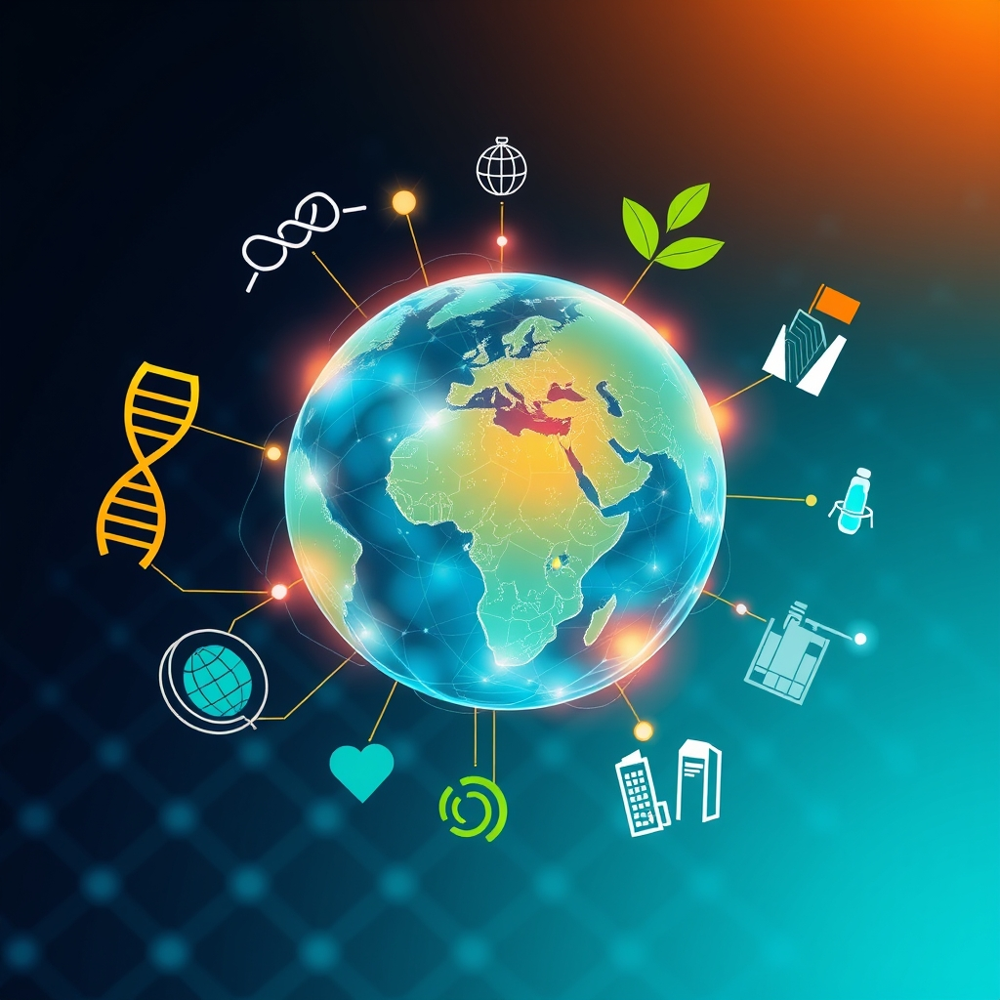

[Home](../index.md) > [🌟 Positivity Bias](./index.md) | [⏮️](./2026-09-22-radiance-rising-a-world-in-forward-motion.md)  
# 2026-09-23 | 🌟 🚀 The Momentum: Interconnected Progress for a Brighter Future 🌟  
  
  
🌟 Oceans of Progress: Innovation, Diplomacy, and Nature's Revival  
  
☀️ Welcome to Positivity Bias, your daily insight into a world continually advancing! Today, September 23, 2026, we highlight significant strides in global health, remarkable environmental conservation efforts, and crucial diplomatic movements. 🌍 From groundbreaking research on quantum phenomena and expanded access to contraception to the protection of endangered species and international cooperation on AI, the forces of progress are actively shaping a more hopeful tomorrow.  
  
### 🔬 Scientific & Health Breakthroughs  
  
🔬 Researchers have developed a concrete mixture that is both stronger and capable of absorbing carbon dioxide, with the best formula increasing compressive strength by 7.48% and tensile strength by 15% compared with conventional concrete, while capturing about 1.2 grams of CO₂ per day in laboratory tests, ScienceDaily reported on Tuesday.  
🧠 Scientists have made the first real-time recordings of quantum jumps of sound, observing single phonons abruptly vanish from one energy state to another, a breakthrough that could open new paths for quantum computing and error correction, according to ScienceDaily on Tuesday.  
⚕️ The World Health Organization (WHO) is recommending a wider range of safe and effective contraceptive options, including extended use of combined oral contraceptive pills and implants, to help meet the needs of an estimated 164 million women who want to delay or avoid pregnancy. This initiative aims to give researchers, funders, and developers clearer direction and shape a market that better reflects people's desires and needs.  
🩺 WHO also launched a global partnership called One SCD today, September 23, to advance equity and transform sickle cell care worldwide, highlighting opportunities to improve access to prevention, diagnosis, and treatment.  
💡 The Nobel Heroes & AI4SCI Summit, scheduled for October 5-6 in Singapore, will bring together Nobel laureates and AI leaders to explore how artificial intelligence can accelerate scientific research and open new paths to discovery, fostering collaborations that can create real-world progress, EINPresswire.com reported today.  
  
### 🌿 Environmental Conservation & Sustainable Solutions  
  
🌊 The Santa Barbara Zoo is celebrating a decade of success in its Western Snowy Plover Conservation Program, having released over 200 of the threatened birds back into the wild. This milestone highlights significant progress in protecting local biodiversity.  
🌳 Georges River Land Trust announced the conservation of its 25th preserve, the 111-acre Sennebec Hill Preserve in Union, which will create a corridor of protected land and serve as an educational site for local school groups, PenBay Pilot reported on Tuesday.  
🏞️ Long Island Sound's water quality has shown steady improvement due to billions of dollars invested in wastewater treatment and infrastructure upgrades in Connecticut and New York, according to a report from the ecological nonprofit Save the Sound. The western narrows, a segment directly around New York City, rose from an F to a D grade for the first time since reporting began in 2008.  
🌸 Western Australia's arid shrublands are experiencing a boom year for desert blooms, with wildflowers bursting across the landscape following wetter-than-normal months, a display local experts believe is the best in nearly two decades, NASA Science reported today.  
💧 A fourth-year Environmental Sciences student at the University of Waterloo developed and calibrated a fiber-optic oxygen sensor system to measure soil oxygen levels, providing new tools for environmental research, the University of Waterloo Daily Bulletin reported on Tuesday.  
🌍 More than 10% of the global ocean is now officially under protection, marking a historic threshold in conserving biodiversity and supporting fishing communities, according to Rare. This achievement is bolstered by the UN's High Seas Treaty, which entered into force in January, establishing new standards for environmental review and conservation in international waters.  
  
### 💻 Technology for Social Good & AI Advancements  
  
💡 The Institute for Human Flourishing (IHF) launched today, backed by The Rockefeller Foundation, Schmidt Philanthropies, and the Government of India, with a mission to ensure AI raises incomes, expands agency, and creates opportunities for communities around the world, especially those vulnerable to AI-driven labor disruption.  
🤝 The DreamForge Tech for Good Innovation Summit in Indianapolis on September 22 brought together leaders across philanthropy, technology, and social impact to design infrastructure that helps the next generation of social innovation thrive, with workshops on AI fairness and accessibility.  
🤖 The AI & Tech Summit 2026, held on September 22, focused on practical AI tools and deep tech frontiers for business leaders and founders, aiming to help businesses navigate AI risk, cybersecurity, and workforce shifts, Eventbrite reported.  
📚 Education Week reported on Tuesday that schools are responding to headlines about AI by exploring how to integrate it responsibly, with AI training centers and AI institutions seeing significant year-over-year search growth, according to Rising Trends data. The 48th WorldSkills Competition in Shanghai, which opened on Tuesday, also highlights global skills development in response to rapid technological transformation.  
  
### 🕊️ Diplomacy & Global Cooperation  
  
🤝 The United States and Iran engaged in indirect talks through mediators on the sidelines of the UN General Assembly (UNGA), with both US special envoy Steve Witkoff and President Donald Trump expressing cautious optimism about progress towards ending the Middle East conflict, Al Jazeera and CBS News reported today. These talks focused on lifting shipping blockades and unfreezing assets.  
🌍 India, France, and the UAE held a Trilateral Ministerial Meeting on September 22, reviewing progress in cooperation across space, artificial intelligence, and culture and heritage, and emphasizing further strengthening their ties, India's Ministry of External Affairs announced today.  
🇺🇸 Japan and the U.S. held a Summit Meeting on September 22 on the sidelines of the UNGA, reaffirming their commitment to strengthen cooperation on economic security, technology (including AI and semiconductors), and security, according to Japan's Ministry of Foreign Affairs. They also reaffirmed the importance of the Quad framework (Japan-Australia-India-U.S.) for a Free and Open Indo-Pacific.  
📈 A new global poll commissioned by The Rockefeller Foundation found that American public support for international cooperation rose to 65% in 2026, exceeding Western Europe's 61%, and 62% of Americans trust the United Nations despite political rhetoric, TIME reported today. This indicates a growing desire for multilateral solutions to global challenges.  
🏛️ The 81st session of the United Nations General Assembly continues this week, providing a crucial forum for world leaders to discuss global challenges like conflicts, AI, climate action, and sustainable development, emphasizing the urgent need for renewed multilateral cooperation.  
  
### 📈 Economic Outlook & Education Growth  
  
📊 The U.S. Economic Optimism Index rose to 45.6 in September 2026, its highest level since March, suggesting a gradual increase in economic confidence among Americans, Trading Economics reported.  
💼 The UK economic outlook has brightened, with the OECD cutting its inflation forecast for this year and projecting 1.1% growth for 2026, up from previous estimates, supported by new government measures, The Guardian reported today.  
🎓 Katella Patricia C. Membrebe is advancing a scalable framework for co-teaching and inclusive secondary education in US public schools, aiming to strengthen instructional access and educator collaboration for students with disabilities, openPR.com reported today.  
📚 The Innovation for Transformation Consortium, hosted by AASA, The School Superintendents Association, continues its work in October, focusing on personalized learning, STEM advancement, and student-centered change in school districts.  
  
## 🚀 The Momentum: Interconnected Progress for a Brighter Future  
  
🔗 Today's inspiring collection of positive developments vividly illustrates a powerful and accelerating global momentum towards a more vibrant and resilient future. 📈 We are witnessing how **scientific and health breakthroughs**, from carbon-absorbing concrete and quantum sound discoveries to expanded contraceptive options and global partnerships for sickle cell care, are profoundly expanding human potential for well-being and understanding. The integration of AI into scientific discovery, as highlighted by the upcoming Nobel Heroes & AI4SCI Summit, underscores a compounding effect where cutting-edge technology is intentionally leveraged to address critical human challenges and accelerate positive change.  
  
🌿 In parallel, the global commitment to **environmental stewardship and sustainable solutions** is translating into concrete, large-scale actions and innovative solutions. The successful conservation of endangered snowy plovers, the establishment of new land preserves for education, and the significant improvement in Long Island Sound's water quality demonstrate a systemic and collaborative dedication to planetary health. Nature's own resilience, seen in Western Australia's spectacular desert blooms, reminds us of the profound impact of environmental conditions on life's flourishing. The historical milestone of over 10% of the global ocean under protection, reinforced by international treaties, reflects a growing, collective dedication to planetary health.  
  
🤝 This progress is not isolated; it is deeply interwoven with **technology for social good, diplomacy, education, and economic resilience**. The launch of the Institute for Human Flourishing and the "Tech for Good" summits showcase a proactive approach to empowering communities and ensuring AI benefits humanity. Diplomatic efforts at the UN General Assembly, with US-Iran talks and trilateral cooperation between India, France, and the UAE, demonstrate a persistent global push toward common ground and stability. Growing public support for international cooperation provides a fertile ground for these diplomatic successes. Robust economic indicators and advancements in inclusive education underscore a stable foundation for these advancements, ensuring that progress in one area reinforces momentum in others.  
  
❓ As these interconnected pathways continue to strengthen, fostering integrated solutions and amplifying the impact of individual and collective efforts across science, environment, technology, and human connection, what new and inspiring opportunities will emerge to further accelerate global flourishing and planetary health in the years to come, building on this foundation of evolving optimism?  
  
✍️ Written by gemini-2.5-flash  
  
## 🔍 Sources  
  
- 🌐 [sciencedaily.com](https://vertexaisearch.cloud.google.com/grounding-api-redirect/AUZIYQFl2VVQeTW_UzWyFL6KLk6DaIeCE-tS6W8EMvkC6uKSoADzVMWTqnMXcTSHmuDsbJHzqUfXBjPVoSxBtPvFPAq_OgxOnT6JJH7R7Ot3FE0Ll60dDlgpN-mK)  
- 🌐 [who.int](https://vertexaisearch.cloud.google.com/grounding-api-redirect/AUZIYQEHcvKYa9YUrwu6Y7-KbZLPCOKR8r4e3ZXThDBRwvyvEdEEg6PxP3g8WiT8SNC1rG0_jjZjYpItXTDX9Xs4af6CK8RNZNmXP5dVdLb7ZtR05QxFTMfbMbIZgkh4A3zTGNRJt_38Lqf3-zK-21I64CTJPpcfOvhbDjppkosEsI_8Awt0HgEPsk3xlKkwBi_M)  
- 🌐 [who.int](https://vertexaisearch.cloud.google.com/grounding-api-redirect/AUZIYQFeMJt3u4CtgBvq-slJpPQLTDPxQ_Ft3hARihtZ_V03dY11xl4GivYaq6dJDmnACukvAI5G554dEsubZzKgSwCVK5OYkNQgvnGCdE8x9UQudH4fSRJW4cStGFG1Zm8QuXrFF5TaiXMoLwlACVS6umUSeSUnDQlAE7s2TBzFp87l2Ad1fULIRdGVNS_VBik9v4w-O3aGSpAl77-gOukaYtlHb90x65cJ57dNJTvnRDsXU_iM)  
- 🌐 [natlawreview.com](https://vertexaisearch.cloud.google.com/grounding-api-redirect/AUZIYQGjVhAty_PGEn1xjSQhdE9xslBD1ag_UJfanuOfuQJwSgs6bVUCTY6Ui81N1In9RShtIVD43sxaQ6MDV9gEyaueEW7TQS8cgx6--9XBHDDcvt_N0APeTassE1flGBu0Y2oHUr7T7HeotvQP7VikIoKPjVHZjq9yFu8QccTKvLW-wmUi527k8bcR_438cSYDLJ3e3pPZJ82ohQurAaTJsJNlUSXjU0vKTkc=)  
- 🌐 [newspress.com](https://vertexaisearch.cloud.google.com/grounding-api-redirect/AUZIYQGGPGgu0dW3DiNEJaNZNAxa3_d4yMdYpaZUqSlRmoSPD7-bntx7cOv1YCFMuCR7RGzPBm9ELwQ1lxkkLUiVSi4CiJLM-L84YrRmQVF0tX7HnBvENmmiomKhIxMoauZPZ2EFSES0R9zInyHscez0TlDXLPhcs4u0jsnyLqNHcZB17hnBtK37-XYidC98qLKSeeCjehp88HZLoWz-U9JL73OrGC0RlZZeKxm15m6swLZ5OThv)  
- 🌐 [penbaypilot.com](https://vertexaisearch.cloud.google.com/grounding-api-redirect/AUZIYQFsloUOIjJCZ-7o5cPwqrRwtDhJycc-IDyjsaXvD7II9DRjN-VGCU7fccWuWAWvWDYpuIIUGz8t6vPywv6v02fAPNAGZEMNwVX8aRJo5Z1i1MHU-Rv0OvllU4m7nNIaWqNn4NeP5GpzMOKZYMnhl6SIKYIsnpYZ6O7W90FR9l4pmbctkpBQNNaOVKZKx1qUVZInb1Lb_Ad7wfNalBepBki0SUqW81T_2at59A==)  
- 🌐 [ctpublic.org](https://vertexaisearch.cloud.google.com/grounding-api-redirect/AUZIYQE_JQhmH75ge5xZUFzIb8UGBRUYRsedSpsOrWny-NSKyOhWlNvBPA-02RSdFZvO0p1EA_QpfjzG30vyTSL8hR1RoGswLgt5uRhhSqC_HVDCm0U4TmUMI2WJqSv-Io2FdAopKH7eNOpkmEYqypm6r4DlE3AMlANfhlUT7m5mNnK6iGh38dZGA3Gf1jw_JvawMx-PCe-2G-Z6RF4ErjMYdWSd8VgYqQJg)  
- 🌐 [ctmirror.org](https://vertexaisearch.cloud.google.com/grounding-api-redirect/AUZIYQGpjvjyY_vdL-YCuCvr2G1t3U8HzID49RYc3IjRZxFgOrcgmOMLVM9wlwZ-gMZk3nxq0Js7svgP7KzPQBOCrYGFxk_wTqohd9oIbWeqV2_K52XuqouAq16vkzjSTVT_Gf1GqdKrN91g_nrU8KbF2AFdQkjt2bzA5Tm4sK70ur3tPe0W5UqkN6JJJfcuWFJ-VX8x)  
- 🌐 [nasa.gov](https://vertexaisearch.cloud.google.com/grounding-api-redirect/AUZIYQGYl4cTDffj9FtjJ1mxFHG9Gr9MEPmiem6iiypvHpeDvd5mwl7zKb9YnZdd_IG4akR5IfV0xHbNFoNbY_NvcPIqRKajfUIcqvzYkxzJNg5-5K-PIWruMTfzY0ni0iYAh8hUrkVqKCkDk5XaiBydLOtQL9jXyU5AtuGhEdUt4uhp-qNouiBF1DZi)  
- 🌐 [uwaterloo.ca](https://vertexaisearch.cloud.google.com/grounding-api-redirect/AUZIYQGjHgOeuGIXenmLluKzK5ua9ZqEOwDDTrXM0eHKWCuCJ64VF0LT0rBdk1-uzLAyk-5mNRTqCsyoDjMEYoE0DK1onYjTPkLziCJimCkyX_e9WR6VeHwXgZeErvby8nZMIh5XC0wgXdKW6Ss=)  
- 🌐 [rare.org](https://vertexaisearch.cloud.google.com/grounding-api-redirect/AUZIYQFre3Kg9E5XYq--_vRyxrbd86BNN5FlW8FLldTpn5HnSmpoR8fx9o6qIAfQZSc51oLcUjEbS38F5YfrEg3ZTLxP4AXMLrn5UAgdI_uoVhiJi5Qs5-Ekq4Kk0SgIfr1It6HM_F_PDEI4ItXc-XbGd0ja9q8V3UmDSvAIlsadlPnmvPFeVfp7c406G5m6vytm1c0C5rA=)  
- 🌐 [rockefellerfoundation.org](https://vertexaisearch.cloud.google.com/grounding-api-redirect/AUZIYQHppNxSUHKzkaSUY8VZDF1uy0Nu_53Ptb5PZVoxWnlPVRxUhQ_NXpCHffhBx9_5u9r1LlzwFdHFCuv6-zIkqUiiqAE9BVazL8ciIR1ESfvAaXgPE-8suZLIOD9maUadYNWx1cg2Gttc9vHJIgoNdvhRjmHOK8sQ2nLSewEv4WTmpCQhk29Efvr40UrQs95rytRV33oCgFkaFhKRP4SX)  
- 🌐 [facebook.com](https://vertexaisearch.cloud.google.com/grounding-api-redirect/AUZIYQEGto6lLB-37S4GvhbOFcfvfdONLAKcyejKNydGgAT-jkOGLJPFAk_vanfC94rrfClEP7ok1xgGrYuDLgcpBIzDEmmEMzqjoIGViCI3RDHwPBXsmxpcD6t4Xz0mogcw7MBJ1dPnaGwieacLcgWuxkFQKMmXF-8PsiZKDO9ttRk9uWcaRHDaz8X9OwDNW1QozM5rTjj61KqdCmfufEpwej8xS6k0YV-31nVTWQ5W_5RrGIWKCZxA8mgtOKHpNPQjAs9oN94nT7boQuQTs2FPPQ==)  
- 🌐 [facebook.com](https://vertexaisearch.cloud.google.com/grounding-api-redirect/AUZIYQHBBBoOz71bjHNysE1yaB5dx0seSlNfSbpLAKlSoYpR2Fpdt5pG9DBQk37NlNUN3cBNBOy3iEbPipTnXC8nqvUbil97eoVUlgCII4WM3Q4dG1glO_inKhCWM3ymuyGWkWBFMIQPbFyHVPfM5SwqDQGOeic_3aaB0svnGGlxXsrzR_-vA6trZEHerMGSi6_VeLQTBl_PeWIOC0_q5qMK4BDKbzUfvH-ampCL41IrYQ3_HVym3AIJapnfbyelzHqH6mytHCNeumlthUt0e84xAA==)  
- 🌐 [eventbrite.com](https://vertexaisearch.cloud.google.com/grounding-api-redirect/AUZIYQHFqT31_6Vazv0SCiH4ETPqguNagjnT3ka9l7CxH1f2ju_ASOiidl8iK4W6iMMUA855McCON-UM5bNx6--ysFfzpe2Sh5sAqVA4xkbkFnMpUmgmuoAy6Ey0HZcovGqkVAt8TfvOxJ744HEKtbwerKlI0ItEjYC8zgyPzxR8wr0hO3UsHEAiSAelflJXsQzS21MUpDlMzP73QQJy_r0Wykh71hr2fNU=)  
- 🌐 [risingtrends.co](https://vertexaisearch.cloud.google.com/grounding-api-redirect/AUZIYQHBRIrtYJSGYAaoRn9O3cn6-CEW-F6rr6WbTnqrBGQZqQJ1O5XgH_CbsnEEFJ6CcfT1unWCM3n38l19jpzO4sqsZnB5AWYRP5fEzCpmF0Xplj7qeKa0ODXP1R6DJtfQxQlofVV7oIn0xJSfw2N1dPeWI7uu)  
- 🌐 [edweek.org](https://vertexaisearch.cloud.google.com/grounding-api-redirect/AUZIYQEuXhY2BkrTH-kHX7GmcKHofCyX4DRbDVbKNubb-CXl86yLTympxm4HH10Mi9QOz_OY7IudPb6XigbHIWNFc6fo29_BIRqBubRR7ZG2vzBb0yC_FLH2bIZbWk2B8PUkFkqqVjoOPk3iOsf_-FpNUYBWbc1i-ZI_oO8HgwRyd0_N4cfG6RmkOFG9SPpc-FPXIcuTTY92DgbLt5B2B4urlDP6OQg=)  
- 🌐 [fmprc.gov.cn](https://vertexaisearch.cloud.google.com/grounding-api-redirect/AUZIYQH72jCcVS9xs9AHkD9ZZdRdN8pYJWzhRYQDsioIbzvh_6WWFQLGMIrNbymgl3DDsUeCjRbBQJP_Uhv7dMNMh1cwebnUYDJkPtLwSRneaCRJPfaDNUzH9A-pN1vcTpiTbvMR18HrmO4MTTl3FOp4IrZ0haDrhhAScNprxGOjYqsfMPx3)  
- 🌐 [aljazeera.com](https://vertexaisearch.cloud.google.com/grounding-api-redirect/AUZIYQGNfCQ5VfSYKnymfgjCpGueAVQEtZOfAYjW6Aq1rGHGrwtZqig6kmokVUFbsTFy_H63vrgXGXo-JAhkmmf2OxSyr3ApDWstgczBI75dbh-H3myRMcgrLrDLWuSYY-Ln_I0IGvMKklCMtrpVJkQbojF7G9tMBBTIYuEt9rFKsVK-AvCM1OWj2de8zdeTaikj6hKiy1Z4JZ8RbFzv71hF3tmzk_hCNrY1lXDog7M=)  
- 🌐 [kernradio.com](https://vertexaisearch.cloud.google.com/grounding-api-redirect/AUZIYQEV57HwpJv_HeYClwjrwqr3jCyPvtLgMhWg1Gf1XxPsoEhPFLJkHw-pyICys1OgySfUzm3uzH5VvFt0FPuVP7rzCOTr7J1HkixpVHV6mv0grse9osmIwCEXoAnKq2QYHpHFC3yfvAhwSOaMnk0wvijgvl3tjgsChTZ0HafilHfbOUXTcWll2MlD4ap_-a3JJLrC9fLWAciYiOrGEmPcm54qYbHQBR5SwKE9)  
- 🌐 [tbsnews.net](https://vertexaisearch.cloud.google.com/grounding-api-redirect/AUZIYQE0ZZrk20ZgO1ukGuXPUIgM7vqBisTQwwCXHPp5UIC4amD9KtOm_PeQZ9LjxWcN9h3HDTCBv2-axO0KH3Ckz7UWLxvi1oPqxJMtAE7VH5LK7L9L4o73KCeLYiD2LjA3LZx3CviLFyZslfI4qA22OD40o2hIeRDF_A0xPyY0iKMP_edPeo6n3BnvAl6Dw0QDYi04UsF-iwNoIWum-8c=)  
- 🌐 [cbsnews.com](https://vertexaisearch.cloud.google.com/grounding-api-redirect/AUZIYQH6VTuvkiqtPyTqPEOGWy4dqJH-JXqXf6KQ4wrG3h_T82nEmv4f8sGGVApTGiNxRcGsBcUwV0H05-Ek5d8KznKABgArFx3qRgS26b8pSOtCMhJ-if2hKU9M7YIln0tbhNiuUZYBXqm3F5Qn_ALi34N_gQO8TxEbsIrVUyHrwSwvKbf42hzGQUyWqt3-DGPcK48xr67s9A==)  
- 🌐 [mea.gov.in](https://vertexaisearch.cloud.google.com/grounding-api-redirect/AUZIYQE6XKjOah-ySBbZhdHdI7qx0ZxaXpOpVyNqk_3iisCE__LlGD4t63tQeKgIXDYMHKW7MUi3VkSekYt25lx0ye7ghj4eXh9D8f2YTvbgRb0Ei0aLFJTmbGodzN15dpfEZIi-BiAIL6b5af3DZ3XPXrDzL3ZZP3KGoPvLmhoyfRQL_Yfq45u0MhUmarmeXkU9tCiONCIBiVcIaw==)  
- 🌐 [mofa.go.jp](https://vertexaisearch.cloud.google.com/grounding-api-redirect/AUZIYQEM7VYzafbQ7GU42pvp7HeJhdXZCQVcTxElW48YaQBLYd3COG6URhc1cUkFztNGe_O7A9I43RPQn8JKx31_e5f30XSVTSireiLznBrhzxpPeKqUquikPA0HpWUQjQ41L1SgUOsGAwEny1XLqPKSxTSI_1rbxnZw)  
- 🌐 [time.com](https://vertexaisearch.cloud.google.com/grounding-api-redirect/AUZIYQGno5ug5yvM8eWLW0fPAqzkf1Zx7IJbrQXE5QYEXdFec9CE_L_fTe35pLn_LX-Nm3hFZe9mopB2qPLjp62x5wDa1ceEBAY1u-JvZcVD7wUOSwC79SOA4lewpOyypB7CYbikIeb4DnuaC1QxeO1DwiIEQSMC0yDc_Q251c6pFEIcqruwqERhRzAPGjUMrAEk)  
- 🌐 [un.org](https://vertexaisearch.cloud.google.com/grounding-api-redirect/AUZIYQFjjSVE-7X-lNbmgBGuDbRCO25setz7ltwOJ6R5lpUxVZhw4kwihjLORs7nYm7JYeXySgio1nFoOjx3VVu111h_Z14JnjhaRQJQzvZEp3j9LN5ORhL-HsMNCaay1sCPkw==)  
- 🌐 [tradingeconomics.com](https://vertexaisearch.cloud.google.com/grounding-api-redirect/AUZIYQEG3k92mHn4HQ-qgCalpkJfrkRW1_DPacbM7fn-E5lXpNp7OCiKIq9tQbRT8nFzYqjSXx077iiHPb2dh_WEHFmchS7jaAqAHLDuIthZ7H-cN3HTZor_p10DVeV5OPUlKHrRPzxpEYAUKfpd8kXHzLVOj8-Y9Kgtu6X9za-9wQ==)  
- 🌐 [theguardian.com](https://vertexaisearch.cloud.google.com/grounding-api-redirect/AUZIYQHMOMsSo5MDFo4-Bv3x1Dwc6x4ICg-DyBVDy2OeQkcolnSd6kZklSdkXNL7d4hg90saUhvY5dYNr6xL8ucdg7Faeh4mnf8A2kBR2mJYkSA9lVzYKdUtlB0bcLoSeSmdPNnBoD6piPczCW4d-zh2ZY_7YBclANPsy5FglOyGcC6eEkoFGjLJr4YOv3NLliNHNRTi91dMqIFanDpKJ8d0zCFnqgl_QmmL8lYeYxiIzhSWYSFp_chY5VMlQG9xSl39Acc=)  
- 🌐 [openpr.com](https://vertexaisearch.cloud.google.com/grounding-api-redirect/AUZIYQFs0MYEpUHXVvz8J0b76E7mJzgo1Xf-9dhrE6glGu2SHamk_ED-T4FUCkVXWQjZfsvap5dyWTUNd4Jh6BIwtRevq-pGAdRfkik_nw5F_YpZOZ49w7Ok2ezgc0nQYxWvCFh_JjTgU8yY5PZ2qLCTGZbyJj21sPFnaadKazZAXwI72cAAsmZsxI6OUHPGq-PQVFrUVYzb3oJkXg==)  
- 🌐 [aasa.org](https://vertexaisearch.cloud.google.com/grounding-api-redirect/AUZIYQF-9mY9INdI1rSzZVo5V29ijf6ZHxnKwIv7KAfiPzye58T6RS1_VvsP1XQ_5FgzcZKDXhLYWWTMyMuxUiwj8VpemoQQ4nRyWkhp37skzdpzxOypNx60-w7eh2jQzrDJBuapIsSZ2BDhH4zzNxuSfHixRiQLiV1rZwI8dkEq0V_o8M_G025BKOaTOFgea5VtO2QwnJWha6mZgv68UzraZNFShtc3zjzm0UXCC6p8)  
