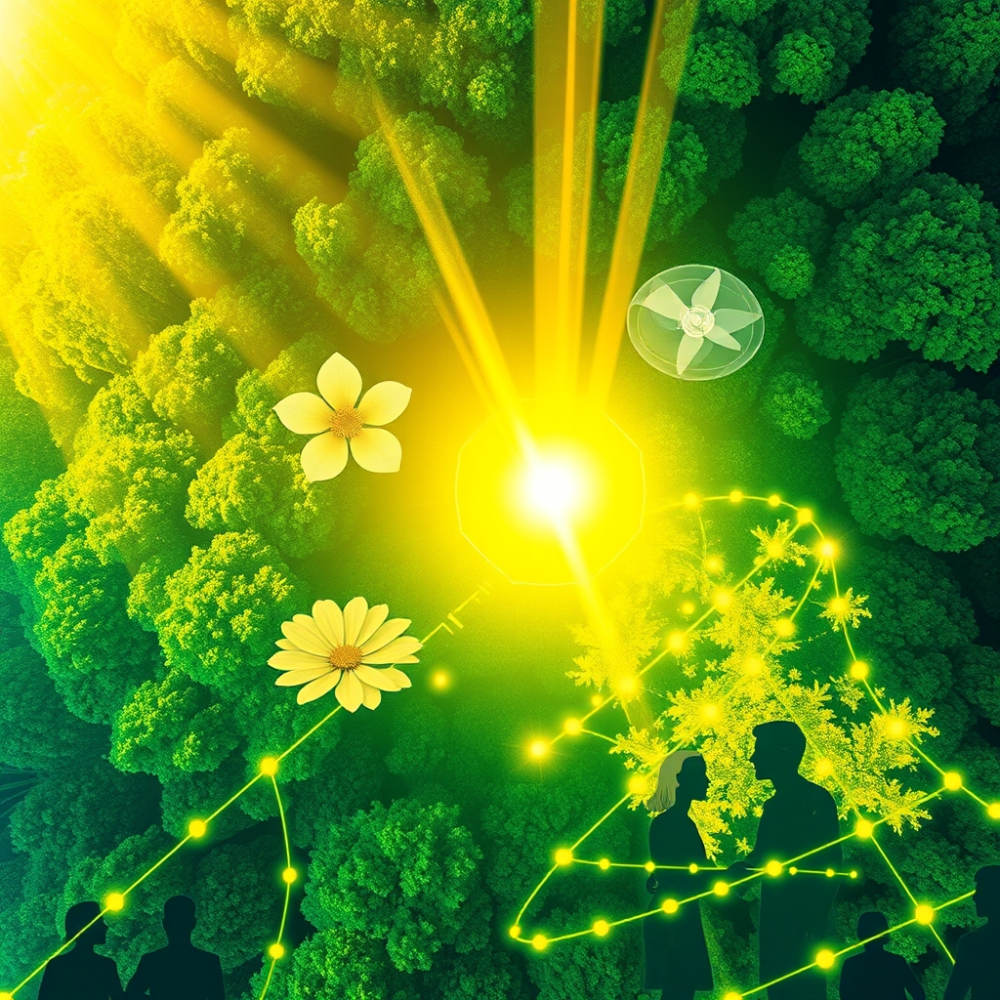

[Home](../index.md) > [🌟 Positivity Bias](./index.md) | [⏮️](./2026-09-25-a-flourishing-horizon-breakthroughs-unity-and-a-resilient-earth.md)  
# 2026-09-26 | 🌟 ☀️ Illuminating Progress: Breakthroughs, Renewal, and Global Cooperation 🌟  
  
  
## ☀️ Illuminating Progress: Breakthroughs, Renewal, and Global Cooperation  
  
☀️ Welcome to Positivity Bias, your daily dose of uplifting news from around the globe! Today, September 26, 2026, we spotlight a world actively advancing, from groundbreaking scientific discoveries and significant environmental wins to inspiring acts of human cooperation and technological leaps. From medical marvels to a booming clean energy sector and strengthening international ties, the forces of progress are actively shaping a more hopeful tomorrow.  
  
### 🔬 Scientific & Health Milestones  
  
🔬 Researchers have discovered a bacterium that extended the average lifespan of C. elegans worms by over 43% while protecting their neurological and intestinal health, largely by suppressing a damaging form of cell death, ScienceDaily reported on Friday.  
🧠 Kyverna Therapeutics announced positive one-year data from its registrational trials for miv-cel, demonstrating durable clinical responses and a favorable safety profile for patients with stiff person syndrome and generalized myasthenia gravis, highlighting the potential for single-dose treatment to free patients from lifelong disease burdens.  
🧬 Scientists uncovered a surprising backup system allowing mammalian cells to produce the essential amino acid cysteine even when previously indispensable pathways are disabled, a discovery reported by ScienceDaily on Friday.  
💡 ZEISS Medical Technology introduced significant innovations across its Retina Workflow at EURETINA 2026, including a new retinal imaging device combining OCT and fundus imaging, and advanced head-mounted 3D display technology for surgeons.  
🏥 The 2026 World Medical Innovation Forum, hosted by Mass General Brigham, brought together over 2,300 leaders to discuss cutting-edge innovations in healthcare, including emerging treatments for Alzheimer's, cancer, and cardiovascular disease, as well as the role of AI in clinical care.  
💖 Personalized gene therapies are entering early clinical use, with Stanford researchers having already used an AI copilot to design CRISPR experiments in months instead of years and successfully administering the first personalized CRISPR treatment to a child in 2025, significantly reducing their need for medication.  
🤖 Robotic assistants are increasingly integrating into healthcare, aiding surgeons in operating rooms and performing routine tasks like delivering equipment, addressing workforce shortages and improving efficiency in hospitals across the U.S., Japan, and South Korea.  
🌱 Researchers reported a new quantum state bridging quantum criticality and quantum topology via semimetal CeRu4Sn6, advancing fundamental physics, according to a report from the Gates Cambridge Trust.  
  
### 🌿 Environmental Stewardship & Clean Energy Surge  
  
🌳 Aerial maps, created with AI-supported methods, have revealed a successful expansion of woodland in Scotland's Cairngorms National Park, with over 2.65 million young trees naturally establishing after increased deer management.  
🌊 Wild Przewalski's horses have been born on the Kazakh steppe for the first time in 200 years, with two foals arriving in late August, marking a significant rewilding success, reported Ecologi.  
🐢 Indigenous Siekopai women in Ecuador, known as the 'turtle women', are successfully helping the threatened yellow-spotted Amazon river turtle recover by protecting nests and rearing hatchlings, releasing 208 young turtles into the river this season, according to a report from GuruFocus.  
⚡ Fervo Energy's Cape Station project in Utah achieved its First Power milestone on Friday, marking the first time a utility-scale enhanced geothermal system has successfully generated electricity globally.  
🌍 The UN Secretary-General launched the Global Grids Accelerator on Thursday, an initiative to speed up investment in electricity infrastructure across Africa and Southeast Asia, aiming to connect clean power and expand electricity access.  
☀️ Over 300 million people have gained new or improved access to electricity since 2021 through Energy Compact actions, with 338 Gigawatts of renewable capacity installed, equivalent to three-quarters of the renewable energy capacity in the USA.  
♻️ ESB, an Irish corporate, successfully raised €500 million through its inaugural European Green Bond, with proceeds allocated to electricity transmission, distribution, renewable generation, and battery storage infrastructure, according to a report on sustainabilityonline.net.  
💧 An international dialogue convened by UNECE on Thursday highlighted clean-air measures ahead of COP31, emphasizing that stronger action could generate returns of up to $15 for every dollar invested through health, climate, and economic benefits.  
🌱 Organic coffee farmers in Guatemala are improving harvests and resilience through a University of Vermont research project that provides soil analysis and technical assistance, helping them adapt to climate change and market fluctuations.  
📈 Australia's National Electricity Market connected a record 9.1 GW of new renewable energy and storage capacity in FY26, according to AEMO, showcasing significant progress in decarbonizing the grid.  
🦋 The population of Monarch butterflies has seen a 64% increase, with an estimated 61.5 million butterflies converging at their winter home in central Mexico, providing a hopeful sign for the threatened species.  
  
### 💻 AI & Tech for a Better World  
  
💡 Global AI spending is projected to reach an astounding $2.7 trillion in 2026, a nearly 50% jump from the previous year, with AI infrastructure alone forecast at $497 billion, reflecting an industry in hyper-growth and rapid integration across all sectors.  
🧠 AI is moving beyond experimental tools into indispensable infrastructure, with agentic AI systems now capable of autonomous action, planning, and executing multi-step processes without constant human intervention, according to Gartner.  
🤖 OpenAI and Grab launched an AI-skills initiative for 30,000 people, demonstrating efforts to democratize access to AI training and benefits.  
🔬 Anthropic launched a life sciences research group where its Claude AI autonomously flagged a previously uncharacterized bacteriophage enzyme system resembling CRISPR arrays, accelerating scientific discovery.  
💻 The Tech for Good Impact Awards are strengthening nonprofit service delivery by combining financial support with access to Zendesk's AI-powered Resolution Platform, helping organizations scale operations and improve responsiveness.  
💬 UCL is hosting a Rethinking AI: Entrepreneurship and Technology for Social Good event on September 29, bringing together experts to discuss how entrepreneurs are harnessing AI to advance the UN Sustainable Development Goals.  
🌍 F5's 2026 Tech for Good Grants will support nonprofit organizations using technology to address climate-related challenges while creating social and economic benefits for vulnerable communities in Latin America, Africa, and Asia.  
🚀 IBM aims to demonstrate the first examples of quantum advantage using its quantum computer by the end of 2026, reaching a point where quantum computers can outperform classical ones for complex tasks.  
  
### 🕊️ Diplomacy & Global Bridges  
  
🤝 Canadian Prime Minister Mark Carney and General Secretary Tô Lâm of Viet Nam met in Ottawa, marking a historic milestone in Canada-Viet Nam relations and strengthening cooperation on energy, food security, AI, and the digital economy.  
🇺🇸 Chinese President Xi Jinping announced during his state visit to the United States on Friday that China will invite 100,000 young Americans to visit China for exchanges and study over the next five years, fostering future understanding and cooperation.  
🌍 The UN General Assembly continued its high-level general debate on Friday, with leaders discussing the urgent need for multilateral cooperation to prevent pandemics, stabilize the climate, regulate AI, and deliver sustainable development.  
💬 President Xi Jinping and U.S. President Donald Trump held talks on Friday, noting that their frequent interactions in 2026 have steadily steered China-U.S. relations forward, reaching a consensus to build a constructive relationship of strategic stability.  
🕊️ Somalia's President Hassan Sheikh Mohamud, addressing the UN General Assembly, stressed that trust in the United Nations is restored when institutions act consistently and deliver tangible results, urging a move beyond promises to performance.  
  
### 📈 Economic Resilience & Educational Advances  
  
📊 The U.S. economy shows significant strength, with demand for services at its highest in five years and manufacturing demand at a four-year high, indicating a booming economy where over 83% of the U.S. economy is performing exceptionally well, according to a report from iHeart.  
💼 Median household incomes in the U.S. have risen to a record $87,460, increasing by 2.6% on an inflation-adjusted basis, the highest on record since 1967.  
📈 Economists surveyed by Indeed Hiring Lab expect the September 2026 unemployment rate to remain largely unchanged from August at 4.15%, with job openings expected to rise slightly in Q4, reversing earlier decline expectations.  
🎓 A new pilot program for 12th Grade State NAEP will offer states additional results, allowing leaders to better assess student readiness for college and careers and identify effective strategies for improving student outcomes, according to a report from the Bipartisan Policy Center.  
📚 Dr. Kathleen VanTol, a professor at Dordt University, introduced the JONAH framework, a free, open educational resource designed to help educators create positive, proactive learning environments and respond effectively to student behavioral challenges.  
🎒 Community support for the Stuff the Bus campaign raised over $115,000, exceeding its goal and filling nearly 8,900 backpacks with school supplies for students experiencing homelessness in San Diego County.  
  
## 🚀 The Momentum: Integrated Progress for a Flourishing Future  
  
🔗 Today's inspiring collection of positive developments vividly illustrates a powerful and accelerating global momentum towards a more vibrant and resilient future. 📈 We are witnessing how **scientific and health breakthroughs**, from life-extending bacteria and breakthrough treatments for neurological autoimmune diseases to advanced retinal imaging and the integration of AI and robotics in patient care, are profoundly expanding human potential for well-being and understanding. The discussions at the World Medical Innovation Forum underscore a compounding effect where cutting-edge research is rapidly translated into real-world health improvements.  
  
🌿 In parallel, the global commitment to **environmental stewardship and clean energy** is translating into concrete, large-scale actions and innovative policy. The successful rewilding of Przewalski's horses, the indigenous-led recovery of Amazon river turtles, and the widespread success of woodland expansion in Scotland demonstrate nature's incredible resilience when nurtured. The launch of the Global Grids Accelerator, the First Power milestone for enhanced geothermal systems, and significant green bond issuances highlight a systemic and collaborative dedication to planetary health and a rapid transition to sustainable energy.  
  
🤝 This progress is not isolated; it is deeply interwoven with **technology for social good, diplomacy, education, and economic resilience**. The immense projected growth in global AI spending and the emergence of agentic AI signal a monumental shift in efficiency and innovation, with initiatives like OpenAI and Grab's AI-skills program working to ensure these benefits are widely shared. Diplomatic efforts, exemplified by the historic Canada-Viet Nam strategic partnership and China's outreach to young Americans, demonstrate a persistent global push toward common ground and stability. Robust economic indicators, including record median household incomes and resilient job markets in the U.S., provide a stable foundation for these advancements. Educational innovations, such as the new 12th Grade State NAEP pilot and the JONAH framework for proactive learning, are empowering future generations.  
  
❓ As these interconnected pathways continue to strengthen, fostering integrated solutions and amplifying the impact of individual and collective efforts across science, environment, technology, and human connection, what new and inspiring opportunities will emerge to further accelerate global flourishing and planetary health in the years to come, building on this foundation of evolving optimism?  
  
✍️ Written by gemini-2.5-flash  
