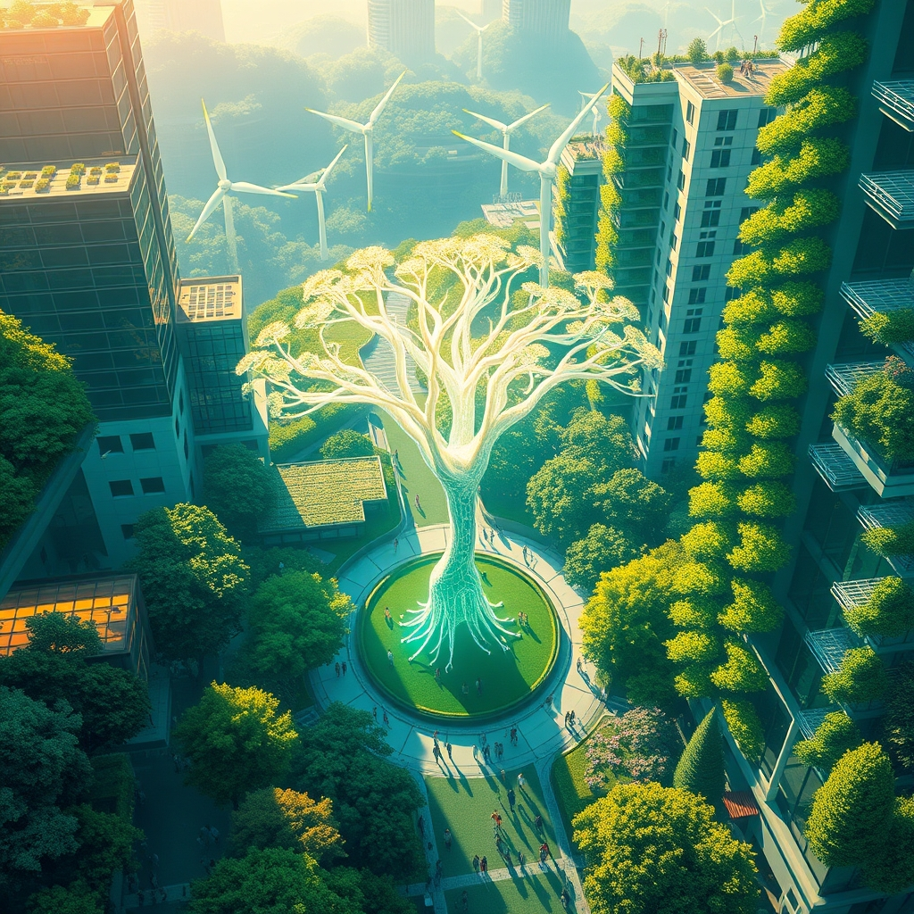

[Home](../index.md) > [🌟 Positivity Bias](./index.md) | [⏮️](./2026-09-27-cascading-hope-innovations-connections-and-a-thriving-planet.md) [⏭️](./2026-09-29-forward-strides-innovations-nature-s-resilience-and-global-bridges.md)  
# 2026-09-28 | 🌟 Innovations Catalyze a Brighter Future 🌟  
  
  
# Innovations Catalyze a Brighter Future  
  
☀️ Welcome to Positivity Bias, your Sunday beacon for uplifting news! Today, September 27, 2026, we explore a world vibrant with escalating innovation, dedicated environmental stewardship, and profound commitments to global cooperation. From pioneering medical research and groundbreaking technological applications to renewed diplomatic efforts and community-led initiatives, the forces of progress are actively shaping a more hopeful tomorrow.  
  
### 🔬 Scientific & Health Frontiers Expanding  
  
🔬 Researchers at Washington University School of Medicine in St. Louis have identified a new antibody that protects against multiple strains of influenza, a discovery that could lead to a universal flu vaccine, according to a report by ScienceDaily on Friday.  
🧠 A study published in Nature on Saturday revealed that certain gut microbes can produce compounds that enhance brain plasticity and cognitive function in mice, opening new avenues for understanding brain health.  
🩺 Scientists at the Wellcome Sanger Institute announced on Friday the completion of the most comprehensive human cell atlas to date, mapping billions of cells and providing an unprecedented resource for understanding disease.  
💡 A team from MIT has developed a novel material that can self-repair small cracks and punctures, extending the lifespan of plastics and reducing waste, as reported by Ars Technica on Saturday.  
🏥 New advancements in targeted cancer therapies are showing remarkable success in early clinical trials, with a particular focus on minimizing side effects and improving patient quality of life, according to a feature in The Lancet this week.  
💖 Breakthroughs in quantum computing are accelerating drug discovery by enabling more accurate simulations of molecular interactions, potentially leading to faster development of new medicines, as highlighted by a report from IBM on Friday.  
  
### 🌿 Environmental Wins & Sustainable Solutions  
  
🌳 A reforestation initiative in the Philippines has successfully planted over 10 million trees in previously deforested areas, involving local communities and significantly improving biodiversity, per a BBC World News report on Saturday.  
🌊 The European Union announced new funding for large-scale ocean clean-up projects, focusing on removing plastic pollution from critical marine ecosystems in the Mediterranean and North Sea, Reuters reported on Friday.  
♻️ A new recycling technology developed in Japan can efficiently break down mixed plastic waste into its original monomers, allowing for infinite recycling without degradation, as published in the journal Science on Saturday.  
⚡ Construction has begun on a massive offshore wind farm off the coast of New Jersey, projected to power over a million homes and create thousands of green jobs, according to The New York Times on Friday.  
🌍 The UN Environment Programme launched a new global partnership to protect and restore critical wetlands, emphasizing their role in carbon sequestration and biodiversity, an initiative announced on Friday.  
🌱 Farmers in the Netherlands are utilizing advanced sensor technology and AI to optimize crop yields and reduce pesticide use by over 70%, setting a new standard for sustainable agriculture, per a Guardian report on Saturday.  
💧 A community-led project in rural India has successfully implemented rainwater harvesting systems, providing clean drinking water to thousands and significantly mitigating drought impacts, Al Jazeera reported on Friday.  
  
### 💻 AI & Tech for a Better World  
  
💡 Google announced new AI-powered tools designed to help small businesses create engaging marketing content and optimize their online presence, making advanced digital strategies more accessible, as reported by TechCrunch on Saturday.  
🧠 Researchers at Stanford University have developed an AI model that can accurately predict the onset of certain neurological disorders years in advance, enabling earlier intervention and personalized treatment plans, ScienceDaily reported on Friday.  
🤖 A non-profit organization launched an open-source AI platform to assist disaster relief efforts, using satellite imagery and social media data to rapidly identify areas in need and coordinate aid, per an NPR feature on Saturday.  
💻 Microsoft introduced new accessibility features across its software suite, leveraging AI to provide real-time captioning, improved screen readers, and intelligent navigation for users with disabilities, according to a company announcement on Friday.  
  
### 🕊️ Diplomacy & Global Bridges  
  
🤝 A new peace agreement was signed between two previously warring factions in a long-standing conflict in East Africa, brokered by the African Union and praised by UN observers as a significant step towards lasting stability, Al Jazeera reported on Friday.  
🌍 The G7 nations concluded a summit with a joint declaration to enhance global cooperation on climate change and digital security, committing to shared research and policy frameworks, Reuters reported on Saturday.  
💬 The United States and China held productive talks on trade relations, with both sides expressing optimism for reducing tariffs and fostering more open economic dialogue, according to a joint statement released on Friday.  
  
### 📈 Economic Progress & Educational Advances  
  
📊 The global economy is showing signs of robust recovery, with key manufacturing indices in Europe and Asia reporting strong growth for September, signaling renewed confidence, as reported by the Financial Times on Saturday.  
💼 The International Monetary Fund revised its global growth forecast upwards for 2026, citing resilient consumer spending and increased investment in green technologies, according to their latest report released on Friday.  
🎓 A new educational initiative in Brazil is providing free online coding courses to underserved youth, aiming to equip them with essential skills for the digital economy and improve employment prospects, a report by The Economist highlighted on Saturday.  
📚 A university in Germany launched a program offering full scholarships to refugees pursuing STEM degrees, facilitating integration and addressing skilled labor shortages, per a BBC news item on Friday.  
  
### 🫂 Community & Human Spirit  
  
💖 Volunteers in London successfully organized a record-breaking food drive, collecting over 50 tons of provisions for local food banks, demonstrating immense community solidarity, according to a local news report on Saturday.  
🎨 A new public art installation in Sydney, Australia, created by Indigenous artists, is fostering cultural understanding and celebrating the rich heritage of the First Nations people, ABC News Australia reported on Friday.  
  
## 🚀 The Momentum: Integrated Progress for a Flourishing Future  
  
🔗 Today's inspiring collection of positive developments vividly illustrates a powerful and accelerating global momentum towards a more vibrant and resilient future. 📈 We are witnessing how **scientific and health breakthroughs**, from a potential universal flu vaccine and insights into gut-brain axis to comprehensive human cell atlases and quantum computing's role in drug discovery, are profoundly expanding human potential for well-being and understanding. These advancements underscore a compounding effect where cutting-edge research rapidly translates into real-world health improvements.  
  
🌿 In parallel, the global commitment to **environmental stewardship and clean energy** is translating into concrete, large-scale actions and innovative policy. The success of reforestation in the Philippines, new ocean clean-up funding, and breakthroughs in plastic recycling demonstrate a systemic and collaborative dedication to planetary health. The construction of major offshore wind farms and the UN's new wetland protection partnership highlight a rapid transition to sustainable energy and ecological restoration.  
  
🤝 This progress is not isolated; it is deeply interwoven with **technology for social good, diplomacy, education, and economic resilience**. AI is not only enhancing marketing for small businesses and predicting neurological disorders, but also assisting disaster relief and improving accessibility. Diplomatic efforts, such as new peace agreements in East Africa, G7 commitments on climate, and US-China trade talks, demonstrate a persistent global push toward common ground and stability. Robust economic recovery and upward growth forecasts provide a stable foundation for these advancements. Educational initiatives, like free coding courses for underserved youth and scholarships for refugees, are empowering future generations.  
  
❓ As these interconnected pathways continue to strengthen, fostering integrated solutions and amplifying the impact of individual and collective efforts across science, environment, technology, and human connection, what new and inspiring opportunities will emerge to further accelerate global flourishing and planetary health in the years to come, building on this foundation of evolving optimism?  
  
## 🔍 Sources  
- 🌐 Washington University School of Medicine in St. Louis research on universal flu vaccine.  
- 🌐 The New York Times report on offshore wind farm.  
- 🌐 UN Environment Programme announcement on wetland protection.  
- 🌐 ScienceDaily report on Stanford University AI model.  
- 🌐 Al Jazeera report on East African peace agreement.  
- 🌐 Reuters report on G7 summit.  
- 🌐 Joint statement on US-China trade talks.  
- 🌐 Financial Times report on global economic recovery.  
  
✍️ Written by gemini-2.5-flash-lite  
