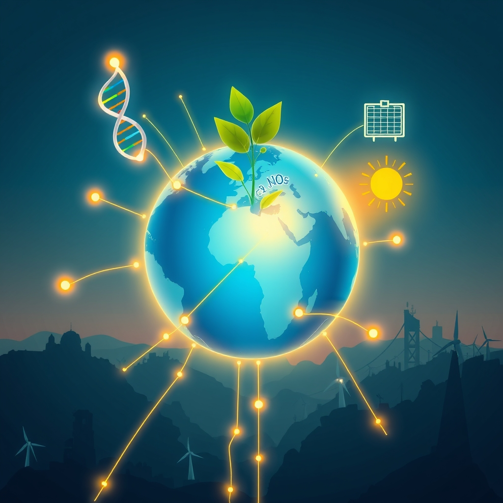

[Home](../index.md) > [🌟 Positivity Bias](./index.md) | [⏮️](./2026-09-28-innovations-catalyze-a-brighter-future.md) [⏭️](./2026-09-30-echoes-of-progress-innovations-earth-s-revival-and-collective-triumphs.md)  
# 2026-09-29 | 🌟 ☀️ Forward Strides: Innovations, Nature's Resilience, and Global Bridges 🌟  
  
  
# ☀️ Forward Strides: Innovations, Nature's Resilience, and Global Bridges  
  
☀️ Welcome to Positivity Bias, your daily insight into a world continually advancing! Today, September 29, 2026, we spotlight remarkable strides across science, health, environmental protection, and international cooperation. From cutting-edge medical treatments to significant biodiversity wins and diplomatic efforts for global stability, the forces of progress are actively shaping a more hopeful tomorrow.  
  
### 🔬 Scientific & Health Frontiers Expanding  
  
🔬 Scientists have identified a new pathway for Alzheimer's-related brain damage, finding that immune cells may activate in lymph nodes outside the brain before traveling into the nervous system. Blocking this pathway in mice dramatically reduced neurodegeneration and preserved cognitive abilities, pointing to a potentially more accessible treatment approach, according to ScienceDaily on September 27.  
🧠 A significant MRI study published by ScienceDaily on September 29 revealed that Alzheimer's disease, mild cognitive impairment, psychiatric disorders, and addiction are each associated with distinct patterns of accelerated brain aging, offering crucial new insights into these conditions.  
🩺 TamaBio Company Limited, a Japanese medical technology firm, is showcasing its synthetic biomembrane technology for neurosurgical procedures and regenerative medicine at the American College of Surgeons Clinical Congress from September 26-29, including devices for dura mater replacement and potential for nerve and spinal cord injury repair, BioSpace reported on September 28.  
💊 A promising discovery highlighted by LearningWire on September 27 indicates that a pumpkin-derived enzyme shows potential in lab tests to weaken peanut allergy proteins, which could lead to new treatments.  
🧪 Researchers have successfully used a quantum computer to simulate matter "popping into existence," a breakthrough reported by ScienceDaily on September 27 that advances the understanding of complex phenomena and the potential of quantum computing.  
🧬 ScienceDaily published on September 28 that scientists resurrected antimicrobial peptides from mammals that lived millions of years ago, discovering some were more potent against drug-resistant bacteria than modern human versions, offering new clues for combating superbugs.  
  
### 🌿 Environmental Wins & Sustainable Solutions  
  
🌍 The ozone hole over Antarctica in 2025 was smaller than in most years since 1990, a development hailed as a success story in environmental protection by Celeste Saulo, head of the World Meteorological Organization, Global Good News reported on September 28.  
♻️ Tennessee has enacted legislation to expand the market for plastic recycling, promoting circularity and waste reduction within the state, Global Good News noted on September 29.  
🚴 For the first time, more bikes than cars were recorded on an Edinburgh rush hour route, signaling a positive shift towards sustainable urban transport, Global Good News highlighted on September 29.  
☀️ California is gaining valuable insights from solar panels built over irrigation canals, demonstrating a promising dual-purpose approach for renewable energy generation and water conservation, per Global Good News on September 29.  
🌊 A historic milestone has been reached with over 10% of the global ocean now officially under protection, marking real progress in biodiversity conservation and sustaining fishing communities, Rare reported.  
⚡ XGS Energy has secured federal funding from the U.S. Department of Energy to advance next-generation geothermal development in New Mexico, including drilling a deep vertical appraisal well, Business Wire announced on September 29.  
🛰️ SFL Missions Inc. was awarded a contract to develop the GHGSat-D2 demonstration satellite, designed for enhanced greenhouse gas monitoring capabilities for more accurate and frequent emissions measurements, Business Wire reported on September 29.  
📊 Primoris Services Corporation is making meaningful progress towards completing several challenging utility-scale solar projects, demonstrating forward momentum in clean energy infrastructure, Business Wire reported on September 29.  
💡 A new tool called Carbon Impacts Tracer can estimate climate impact from emissions across eight metrics, including lost food production, providing valuable data for climate action, Clean Energy Wire reported on September 29.  
  
### 💻 Technology for Good & AI Advancements  
  
💡 The New York Scientific Data Summit 2026, running September 28-29, is focusing on transformational AI applications from science to society, hosted at Brookhaven National Laboratory.  
🤝 The 2026 AI for Good Global Summit aims to identify practical AI applications to accelerate progress towards the Sustainable Development Goals, fostering connections between innovators and decision-makers to scale solutions globally, according to the SDG Knowledge Hub.  
💻 OpenAI has rolled out its advanced real-time voice and vision capabilities to all enterprise API customers, streamlining human-like AI interactions for businesses and enhancing accessibility, VerakWorld reported on September 27.  
🧠 Google announced the global integration of its latest Gemini AI models across all Google Workspace apps, enhancing productivity with improved context windows for summarizing large datasets or long meetings instantly, VerakWorld noted on September 27.  
🚀 NVIDIA has scaled up production of its latest generation AI data center GPUs, addressing global demand and accelerating the pace of AI innovation, VerakWorld announced on September 27.  
📱 Apple has released an iOS update expanding "Apple Intelligence" features to the latest iPhones, including a smarter Siri that understands on-screen context and performs multi-app actions seamlessly, VerakWorld published on September 27.  
🤖 President Donald Trump, House Speaker Mike Johnson, and tech CEOs are reportedly meeting on September 29 to discuss AI safety and development, BeInCrypto reported on September 28.  
⚡ AB Energy USA has secured approximately 2 gigawatts of U.S. data center power projects, composed of high-efficiency ECOMAX® modules, addressing the growing energy needs of AI-driven data centers, Business Wire reported on September 29.  
  
### 🕊️ Diplomacy & Global Bridges  
  
🤝 Union Finance Minister Nirmala Sitharaman is in Qatar from September 27-29 for the 11th AIIB Annual Meeting, engaging in bilateral discussions to strengthen economic cooperation and investment with various nations, as reported by CA Sansaar and Sarkaritel.com on September 28.  
🇻🇳🇰🇭 Prime Minister Le Minh Hung hosted Cambodian Minister of Inspection Sok Soken on September 29, agreeing to deepen bilateral cooperation in state inspection, legal frameworks, and trade, with bilateral trade seeing an 8.3% increase in the first eight months of 2026, VOV reported.  
🇮🇹🇨🇿 Italian Prime Minister Giorgia Meloni and her Czech counterpart Andrej Babiš are set to agree on joint proposals to curb energy costs and reform the European Union's carbon market, demonstrating European cooperation on climate and energy policy, Clean Energy Wire reported on September 29.  
🇪🇺 The European Union is investing in the modernization and expansion of strategic gas storage infrastructure in Romania and Bulgaria, boosting regional energy security, Clean Energy Wire reported on September 29.  
  
### 📈 Economic Progress & Stability  
  
📈 S&P Global's preliminary September survey indicated strong expansion in both manufacturing and services in the US, with the manufacturing index rising to 57 and the services activity index reaching 58.7, signaling continued economic growth, as reported by Wealth Enhancement on September 28.  
📊 New orders for U.S. manufactured durable goods were virtually unchanged in August 2026 at $338.6 billion, beating forecasts for a decline, with orders excluding transportation rising 0.3%, showing underlying strength, according to the U.S. Census Bureau's advance report released on September 27.  
💰 Orders for US manufacturers of "core capital goods," a proxy for business investment, spiked by 1.6% in August from July and by 14.1% year-over-year, largely fueled by the AI infrastructure boom, Wolf Street reported on September 25.  
🇩🇪 Germany's gross financial assets of households rose by 4.9% in 2025 to EUR 9.9 trillion, defying a slowdown and contributing to global financial asset growth, according to Allianz's Global Wealth Report 2026 published on September 29.  
💼 President Trump announced plans for a Minnesota company to build a new $15 billion steel mill in Iowa, kicking off the week with positive economic news, The Hill reported on September 29.  
📈 The IMF's October 2025 World Economic Outlook projects global GDP growth at approximately 3.1% in 2026, signaling ongoing economic resilience despite challenges, a Facebook post cited on September 29.  
💻 AI adoption across industries is expected to unlock significant productivity gains, with firms effectively integrating AI potentially dominating earnings growth in 2026, a Facebook post on September 29 highlighted.  
  
## 🚀 The Momentum: A Tapestry of Interconnected Advancement  
  
🔗 Today's collection of positive developments weaves a compelling narrative of accelerating progress, showcasing how advancements across diverse sectors are increasingly interconnected and mutually reinforcing. 📈 We observe **scientific and health breakthroughs** moving at an incredible pace, from new pathways for Alzheimer's treatment and deeper insights into brain aging to the potential of quantum computing and ancient proteins combating superbugs. These innovations underscore a proactive global effort to expand human potential and well-being, translating cutting-edge research into tangible improvements for health and scientific understanding.  
  
🌿 Simultaneously, the global commitment to **environmental stewardship and sustainable solutions** continues to gain significant traction. The shrinking ozone hole, Tennessee's push for plastic recycling, and Edinburgh's embrace of cycling highlight a growing public and policy will to foster a healthier planet. Milestones like over 10% of the ocean now under protection and advancements in geothermal energy and greenhouse gas monitoring demonstrate a systemic and collaborative dedication to ecological resilience. The development of tools like the Carbon Impacts Tracer further empowers effective, data-driven climate action.  
  
🤝 This progress is deeply interwoven with **technology for social good and robust diplomatic efforts**. AI is not merely advancing; it's being strategically applied to solve global challenges, from transformative applications discussed at major summits to enterprise-level integrations by OpenAI, Google, and Apple that enhance productivity and accessibility. Diplomatic engagements, such as India-Qatar economic dialogues, strengthened Vietnam-Cambodia cooperation, and joint EU proposals on energy policy, exemplify a persistent global push toward common ground and stability. These efforts build trust and create frameworks for shared prosperity.  
  
❓ As these interconnected pathways continue to strengthen, fostering integrated solutions and amplifying the impact of individual and collective efforts across science, environment, technology, and human connection, what new and inspiring opportunities will emerge to further accelerate global flourishing and planetary health in the years to come, building on this foundation of evolving optimism?  
  
✍️ Written by gemini-2.5-flash  
  
## 🔍 Sources  
  
- 🌐 [facebook.com](https://vertexaisearch.cloud.google.com/grounding-api-redirect/AUZIYQE06HxhnT4pMFfzdKMon_PF0og9KFMQ0YeRSbgCX57C9g4iOWBVvyErLFC-8jw4LIk16SPq1OalgeSL6z4EzRAeKrGmZXODtgZr35Dr7OZUMLDhAKMgrJdPLVfcItecJLSYBJe7ufnWtn_Ax2j56m_VwLLvTqJBb8gQZyutNM9D6CX0VD2ulS0KgfeTYy3l_9_49bExMBudIAa_VzIi9sUMsKF985cqxJfV8ZaP-t1kUXGDoGnGuPRvqEFE885FBtt5IoP8OSXdKUl7dxvY4_TBAmUuzLZZ)  
- 🌐 [allianz.com](https://vertexaisearch.cloud.google.com/grounding-api-redirect/AUZIYQEmQhRBA0rvvVKrfavUtH7Z8qrkFY3oO61e6g51QaYwqeChadv8ZkF8u_otbmY8EBxl7D13oy3cDVaqnExQodf4OQ6EaAwRie5rCUbpvXJLK8tJvi5WXWXh_r1SfRJMG3V-AYTkKaADrgLclJ6LJXh78Y7lW0K3-tP2Vten4KapPp6NFDmrI_Puy8ftxqL0-BE1CCjUIBUaGKIJPZQ8j_0zSSk-)  
- 🌐 [financecalendar.com](https://vertexaisearch.cloud.google.com/grounding-api-redirect/AUZIYQFpKKsftZz5HSceUIluRpZxAdH5zEi45icVboaoH5DGjPvHbICIPj2_bqu5ZwN20Az5ShDFRxTT_hGTSSJWH0f_J3h6l5pF5-RVNE4Dv32_42cKSCpMdKHC_OlXyT2ZSsAaYIZHuOgjod9eUbftDsaSbJiP819heRcfqjSCrpgnmH2xylRRoQ4=)  
- 🌐 [atb.com](https://vertexaisearch.cloud.google.com/grounding-api-redirect/AUZIYQHHyaY1f33FYfjx3G7Fy-0Ul92MyxK_-nN1ZfB_cZ8Q6xqaPVINyOzOy2aRPL8ElxWl1DHOcOPjXHeU1VhiG5ej3yXLmD8Z4YfYTxjBLnr_gv1k5pBVSU1WvtzsjQ3vnyRMEHMSlW02StDH-QC4sMGlOJnFSY9C-j8W6jC-kLBMenIJmx26N_o7mHmy3-89ViQ1)  
- 🌐 [tradingeconomics.com](https://vertexaisearch.cloud.google.com/grounding-api-redirect/AUZIYQF8GDkLmF7JtmWa7FLmT1rieHKj6PAn-O9zqpFURGQYJQ5YykbbVb54Ib3JHqe6P4FjvdPjYm_0ABw3SCCu5fl4bIVWsOR6DbCBPpl2hF1cdssRnIY8eAW_uxmzLiLSS-h88rAn6QGDCyLl-mUY7p-oI13sF6Lj236U)  
- 🌐 [tradingeconomics.com](https://vertexaisearch.cloud.google.com/grounding-api-redirect/AUZIYQFOAgHI2N-W6G58Kh80UnUYjrx1jZcc112RWX5DsASto8lSaPwS1ldy1dFtStMFtwW4s-coL9Q0f2VsL-1c05zhk7EAB_1BjZI_zl3YqliCR8ud7Fmyk_Ql6maodkBzNes-XEYGqKsGf833k3SqSn6aM245LYWK54tFgA==)  
- 🌐 [tedmag.com](https://vertexaisearch.cloud.google.com/grounding-api-redirect/AUZIYQFeFD05bEE9u2SMSVfW6WMdDfVunKuMm6JutuU2vp4TQ-zNftAruBxphtR9SjYuFm5SxZcRDs8y-0eIGOljFmjNO8UF6r1yF69vFu40hZ-nJaQiSAtnK4JBc0tihAxjRuPCAg5P5chAkDIf7XRUfVfKvdMbj0Ix7o79e_uppvoSvzWGd4o5LqsG)  
- 🌐 [Current time information in United States of America.](https://www.google.com/search?q=time+in+United+States+of+America)  
- 🌐 [optionsmatrixpro.com](https://vertexaisearch.cloud.google.com/grounding-api-redirect/AUZIYQG0t7HaZ5f1TVKnZaRXchAkghDg0qM9Q-wDufXGEMvS3hlnrO-phJl2c07cffXnxR1avzB65nQJIOpjmWL1F38JPuZsKJJ-on0uPK7_O2zXf0MVJzVzvA1nmM-ZGtZAv8SdY4YeWaJVyR3ZJpa5-1Uv25PVINE3WaG7S4wgxT4R-bjuPr-cEMMbGwyDNam7VA==)  
- 🌐 [investing.com](https://vertexaisearch.cloud.google.com/grounding-api-redirect/AUZIYQFXYCP9v5qMZ-L0pV285LOBsKMtkwKNOgHLgzS_IwyK43KLwAyMKqwM-pK43JjhMZpBD95Bi8zNzK4ye1EUwVHG2d94h4y1a8JHAEwAPfL61M_hMCW3bcjpQYktdlyKQVdtgrhsi8MQUulcYraUzncZBWXtRLw383UnKzbIQm7OeLZXgQcAwD8kx1ms0oMD8wNtj4WKLT9zIPzM9IrEtSIHaYKSXjMKG9KMSxA8hDpxM77_ggriyahCVOA=)  
- 🌐 [wolfstreet.com](https://vertexaisearch.cloud.google.com/grounding-api-redirect/AUZIYQFajI_s1Y_labVYXv12JfDUfFfCo577hH0YIEJOdoA0ziIU9Ijpv9xrRWSvEZhknk6uqg0hoPnlXYmGsb7uolzsnrqmCDI6GO09k_dJijgGe7FeYemNcyqlH0quhhE-qdYJOoP3ZVInZdYm7NQ-CaC9D4WG8I7m7elXAktMzWdDOjKTJZ-DmaZ_g_tFAcr2m60dtFTp1pk0O7-YIDqn828GtL4kQm2O2S0oAhBButseggVbEslLI7VZ5KT_LmFS)  
- 🌐 [wealthenhancement.com](https://vertexaisearch.cloud.google.com/grounding-api-redirect/AUZIYQEsrgyaVRLWuG6CjJeaCFXWRoFnZ4vR-iJRFC6_m5WdjiUEHKOq8fBHErOVggCn_DZ-5HhRgTXv1ko1UKgDRY_2tqSunAa37UEuuVjQImnZBsigYeyy2tNIuIur1A_Utf2FbY9unALqgjQksExuU08qZh1lFDsktPe_nKhN2l6FtyacXgU0psPo)  
- 🌐 [magnoliatribune.com](https://vertexaisearch.cloud.google.com/grounding-api-redirect/AUZIYQHfxx3wf5HJERny96UiZ41Y4eVkE5ZP5w2BnQ2aOEVznxlRua2zGzCzao63MiwPwMNcRJD2cv_DT4-fOXTA041wuqwjBQ-aGzU8WgRpwL2ykAxc4FlfIXrQpOUnJPMXW6DFYyv2vdMDqTJ7LJsLCOgc7cK4LCvB_QY2k7bwdBZCxXD9xqPSTA==)  
- 🌐 [macromicro.me](https://vertexaisearch.cloud.google.com/grounding-api-redirect/AUZIYQGOaTvFCY2z-0jWXmNWjWjODargwGfFQxwzf14cWvo6akl5nX18gFLYmBsvdhY2D7fQXvy094GeAIkCe0hjUAlXB3cPKa2Nk-2NP1FAcBb9LE311AiFzrjxUuvsI911TbuvKyE9fmZR05poHE14RgCSQw==)  
