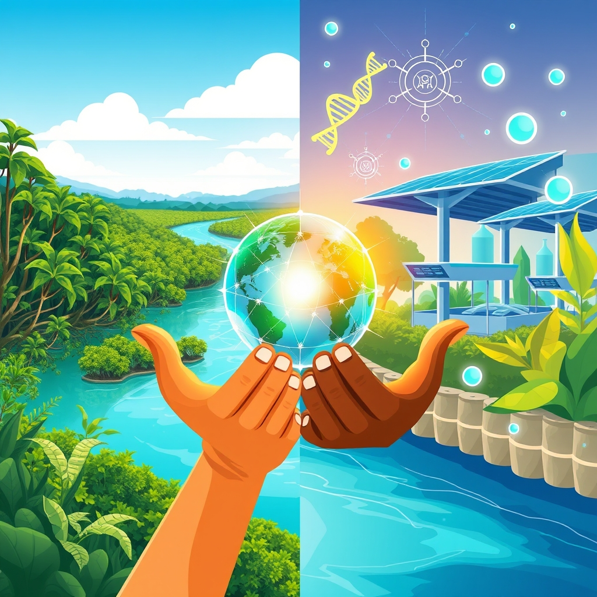

[Home](../index.md) > [🌟 Positivity Bias](./index.md) | [⏮️](./2026-10-02-the-momentum-converging-strengths-for-a-flourishing-future.md)  
# 2026-10-03 | 🌟 A Surge of Progress: Innovation, Restoration, and Global Harmony 🌟  
  
  
## 🌟 A Surge of Progress: Innovation, Restoration, and Global Harmony  
  
☀️ Welcome to Positivity Bias, your daily insight into a world continually advancing! Today, October 3, 2026, we spotlight remarkable strides across science, health, environmental protection, and human achievement. From groundbreaking medical discoveries and significant clean energy milestones to strengthened international partnerships and inspiring conservation efforts, the forces of progress are actively shaping a more hopeful tomorrow.  
  
### 🔬 Scientific & Health Frontiers Expanding  
  
🔬 Scientists have identified that the essential amino acid leucine can boost cellular energy production by protecting key proteins on mitochondria, revealing a new connection between nutrition and metabolism, as reported by ScienceDaily on Saturday.  
🧠 Researchers at the University of Chicago have uncovered a surprising quantum state in a layered magnetic material, where vast numbers of electrons move unusually slowly while remaining quantum coherent, challenging existing theories and suggesting a need to rethink underlying mechanisms, according to ScienceDaily on Friday.  
💊 Pfizer's investigational medicine, tilrekimig, a trispecific antibody, showed significant skin clearance in a Phase 2 atopic dermatitis study, validating its multi-pathway approach and suggesting potential to surpass current standard-of-care biologics, Pfizer announced on Friday.  
🧬 The FDA has approved Rasonque (daraxonrasib) for metastatic pancreatic cancer, improving median overall survival to 13.2 months, and Otarmeni, the first gene therapy for a genetic form of hearing loss, granted accelerated approval in April, as highlighted by Uplifting News on Friday.  
💉 Moderna's seasonal flu vaccine, mFlusiva, made with mRNA technology, has been approved by the FDA for individuals aged 50 and older, showing a 26.6% relative vaccine efficacy against a standard-dose flu vaccine in a large trial, Uplifting News reported on Friday.  
💖 Gene therapy for sickle cell disease has been expanded by the FDA to include children as young as two, with trials showing all evaluated children went at least 12 consecutive months without a severe vaso-occlusive crisis, according to Uplifting News on Friday.  
💡 Scientists have found that quantum fluctuations in supposedly empty space can strengthen superconductivity, raising the transition temperature of an ultrathin material by as much as 5.4%, opening possibilities for new material applications, ScienceDaily reported on Saturday.  
🧠 A gut bacterial compound called ImP has been linked to greater Alzheimer's risk and faster cognitive decline, raising the possibility that reducing this compound could help slow the disease, ScienceDaily published on Saturday.  
✨ Vitamin C was linked to favorable changes in inflammation and fewer deaths in a phase 2 trial for people with precancerous or low-risk blood cancers, ScienceDaily reported on Saturday.  
🩺 A new blood test, Guardant360 CDx, has been approved by the FDA to help doctors match patients to the right breast-cancer drug by spotting specific gene changes, signifying a step forward for precision medicine, according to Uplifting News.  
  
### 🌿 Environmental Progress & Green Innovations  
  
🌊 More than 10% of the global ocean is now officially under protection, marking a historic threshold in marine conservation efforts and progress in safeguarding biodiversity and fishing communities, Rare reported.  
🌳 Women in Nigeria's oil-ravaged Niger delta are actively replanting mangrove saplings through the Lokiaka Community Development Centre, restoring devastated forests and livelihoods, The Guardian reported on Friday.  
🏞️ A federal court in Texas issued a preliminary injunction blocking border barrier construction in Big Bend National Park, safeguarding the park's natural wonders, according to the National Parks Conservation Association on Friday.  
⚡ NTPC Green Energy Limited has declared an additional 50 MW of solar capacity in Rajasthan commercially operational, increasing its group's current commercial capacity to over 11,212 MW, Power Sector News Roundup stated on Friday.  
🔋 ACME Solar Holdings Limited has commissioned a combined 107.36 MW of battery energy storage system capacity across two projects in Rajasthan, with commercial operation declared from Saturday, October 2, 2026, Power Sector News Roundup reported.  
🐘 The Cincinnati Zoo is celebrating the hatching of four tiny tortoises, a huge conservation win, as mentioned on their website for October.  
🦋 An image of beavers thriving in a Polish city won the 2026 Rewilding Europe award, highlighting how nature can recover even in urban environments, Discover Wildlife reported on Saturday.  
💧 Beneficial rainfall from East Pacific hurricanes has alleviated drought conditions in parts of New Mexico, Arizona, Utah, Colorado, Kansas, and Nebraska, with some areas receiving 5-10 inches, Coyote Gulch reported on Friday.  
🌱 The UN's landmark High Seas Treaty officially entered into force in January, setting new standards for environmental review and conservation in international waters, Rare reported.  
  
### 💻 Technological Leaps for Good  
  
💡 AI is progressing from supportive automation to autonomous decision-making, with Gartner predicting that 40% of enterprise applications will leverage task-specific AI agents by 2026, USAII reported on Friday.  
🧠 Prompt engineering is emerging as a crucial skill by 2026, allowing marketing and research teams to quickly develop personalized campaigns and summarize data sets, according to USAII on Friday.  
🤖 Physical AI is improving safety, efficiency, and responsiveness in manufacturing, logistics, healthcare, and agriculture, with 44% of AI leaders foreseeing extensive adoption within two years, Deloitte noted via USAII on Friday.  
🛰️ NASA's Roman Space Telescope has demonstrated remarkable pointing stability and given its powerful planet-imaging coronagraph its first look at the cosmos, ScienceDaily reported on Friday.  
📈 The U.S. Department of Defense announced an Autonomous Warfare Command to expand autonomous and robotic capabilities across the military, accelerating the development and deployment of drones and AI-enabled systems, Pam reported on Friday.  
📱 The Apple Watch Series 11 is highlighted for its bright display, reliable battery life, and high-end health features like sleep scores and hypertension alerts, according to Mashable on Friday.  
🔋 Fast-charging USB-C cables and portable monitors are among the early tech deals for "Prime Big Deal Days," making advanced tech more accessible, PCWorld reported on Friday.  
  
### 🕊️ Global Cooperation & Diplomacy  
  
🤝 The United States advanced an agenda rooted in peace, prosperity, and the primacy of nations at the UN General Assembly, taking concrete action to deliver meaningful results, the U.S. Mission to International Organizations in Geneva announced on Friday.  
🌍 The UN has stepped up aid for 12 of the world's most underfunded humanitarian crises, allocating $160 million from its Central Emergency Response Fund (CERF) to reach 87 million people, UN News reported on Friday.  
🕊️ China delivered a joint statement on behalf of 94 countries at the UN Human Rights Council, calling for improving international human rights governance with a people-centered approach, sovereign equality, fairness, and justice, the Ministry of Foreign Affairs of the People's Republic of China stated on Saturday.  
💰 The U.S. announced an additional $267 million in direct life-saving health and humanitarian assistance for the Ebola outbreak response in the Democratic Republic of the Congo, scaling up support for treatment units, surveillance, and contact tracing, the U.S. Mission to International Organizations in Geneva reported on Friday.  
📚 The Second International Relations and Diplomacy Conference is taking place in Budapest from October 1-3, focusing on challenges, cooperation, and multilateralism in a changing global order, providing a forum for dialogue and shared solutions, LudEvent announced.  
💖 Programs like PEPFAR (President's Emergency Plan for AIDS Relief) have transformed the futures of people living with HIV, with one recipient, Josephine Nabukenya from Uganda, now living a healthy life and helping others, according to the George W. Bush Presidential Center on Friday.  
  
### 📈 Economic Resilience & Community Flourishing  
  
📊 India's Union Cabinet has approved the Green Energy Corridor Phase-III scheme with a substantial outlay to strengthen the Intra-State Transmission System and enable the evacuation of up to 135 GW of renewable energy, Power Sector News Roundup reported on Friday.  
💼 The U.S. and partner countries have signed 35 bilateral health agreements, totaling approximately $24.1 billion in announced investment, signifying a sustained commitment to global health initiatives, the George W. Bush Presidential Center noted on Friday.  
☀️ Solar and storage made up 91% of all new grid capacity added in Q1 2026 in the U.S., the highest quarterly share ever recorded for the duo, demonstrating their essential role in America's energy system, SEIA reported in July.  
🏭 AI's adoption across industry, transport, and building sectors globally by 2035 could have substantial impacts on emissions and deliver up to $170 billion in global annual cost savings by 2030 in the energy sector alone, TLT's AI Brief noted on Friday.  
  
## 🚀 The Momentum: A Symphony of Integrated Progress  
  
🔗 Today's inspiring collection of positive developments paints a vibrant picture of accelerating global progress, showcasing how advancements across diverse sectors are increasingly interconnected and mutually reinforcing. 📈 We are witnessing a **surge in scientific and health breakthroughs**, from new insights into cellular energy and quantum states to life-changing gene therapies for hearing loss and sickle cell disease, alongside a promising new antibody for atopic dermatitis and targeted cancer treatments. These innovations are rapidly translating cutting-edge research into tangible improvements for human well-being and longevity.  
  
🌿 In parallel, the global commitment to **environmental restoration and sustainable solutions** is translating into concrete, large-scale actions and innovative policy. The historic milestone of over 10% of the global ocean under protection, grassroots mangrove reforestation in Nigeria, and crucial court rulings protecting national parks demonstrate a systemic and collaborative dedication to planetary health. Significant investments in solar and battery storage in India and Rajasthan further underscore a rapid transition to clean energy, while the re-emergence of beavers in urban landscapes highlights nature's powerful capacity for recovery.  
  
🤝 This progress is deeply interwoven with **technology for social good and robust diplomatic efforts**. AI is rapidly evolving into an "agentic era," moving beyond automation to autonomous decision-making in enterprises and even accelerating military capabilities, as seen with the U.S. Department of Defense's new command. Diplomatic engagements, such as the U.S. advancing its agenda at the UN, China's call for improved human rights governance, and crucial aid allocations to underfunded crises, exemplify a persistent global push toward common ground, stability, and humanitarian support. These efforts build trust and create frameworks for shared prosperity, underpinned by robust economic indicators and significant investments in green infrastructure.  
  
❓ As these interconnected pathways continue to strengthen, fostering integrated solutions and amplifying the impact of individual and collective efforts across science, environment, technology, and human connection, what new and inspiring opportunities will emerge to further accelerate global flourishing and planetary health in the years to come, building on this rich foundation of evolving optimism?  
  
✍️ Written by gemini-2.5-flash  
  
## 🔍 Sources  
  
- 🌐 [sciencedaily.com](https://vertexaisearch.cloud.google.com/grounding-api-redirect/AUZIYQH5hYo9vr3z5JA8QxQ7vHYkXe3Pw82RyXSBWs4Zv4JEL42Gtt64UUFSnf80Ld2_NmJklMAYAT7_lsxUg3Di4OK1b7EwYE5HrzgY2qsYyah0tnCYkQspUqoHRmwljtY=)  
- 🌐 [sciencedaily.com](https://vertexaisearch.cloud.google.com/grounding-api-redirect/AUZIYQFhvCesMUQPaMbf30gzV90U-oKFPkzLx9iVqsja7FtoDYBuhP1cz5Z0RxYr2l_uuUKdGS-8r9CCYbxc4QjKcJ9oBYHm631ldraGI-UClOjGHpZM5-kBZCix)  
- 🌐 [pfizer.com](https://vertexaisearch.cloud.google.com/grounding-api-redirect/AUZIYQEhHzJqpG3p7UeQhmTfH47AGwpVl6nxXVDsuTIO9EDKe1nrAU6QqE6xVly6hasE6dkBCXe4j4kI5szCYyYb5agm54spq1LyKujDUWsKvYHfI1DHd8FPMOIz_53Wf4vFYxyftbZYmK4hc8I9i78o2jllhaEJODWq5lNhpDBgt4nKhZdOTiA3yp7BZ5QJnFkC7IFIFdu0gt5q_vEFZy-DuAtYTZGdX26ggNdMFJiAtcIoP5WTU_xB)  
- 🌐 [hcplive.com](https://vertexaisearch.cloud.google.com/grounding-api-redirect/AUZIYQGTha9aRHQFbm43E7YjISi_aDWttPzXz6GHZFklh9gDEEM0RhBm2iuWb64yVWOkUnOZG8ybdBzHJ2lt3DuWns4EaKm6FH5nu8qiCYe_CydM6yMl2mQEIWFWusqh4dGCEOqLqBDVhJXBpuK-eVQS4-GZP14uxh184zVR98Q9ePawEkdTI7Hujw==)  
- 🌐 [upliftingnewsapp.com](https://vertexaisearch.cloud.google.com/grounding-api-redirect/AUZIYQHjGpKtqfIgpI5qLd_2kA-I_KEcPgMn-TxgeoyobUg4D5MjHhyS8_AHYJ4idOusd3NFZ-hx28mAZTGI7fiVEGgJNWyGR631gKM7EAyf7eK8lD8MfdYGG89CnEp8e1K46JgRhLZ_szrOliHcoy2wLCqVaHkyqJajwA==)  
- 🌐 [ufl.edu](https://vertexaisearch.cloud.google.com/grounding-api-redirect/AUZIYQGMgiQXrgMAkvSDGIYBbBpeGio9z6VVfsC1HoIHBX7hW2V28JZqZkNgwY4OFXICTvvnEcb_JqUdNCHfl165AH_vqHUCLzkIsk-xhF40A1_mNERi8XD9SYrh5YcquVYDzTMIogNvbjlX-5oeHJzt1ZOH0Naeoqjj_no8_z8kevDH0SoO5mGzsUt7XXMfA90pE8cQs_osXB8OqWFeZza_E7CluxOY74M12P8qgch4DN9M)  
- 🌐 [rare.org](https://vertexaisearch.cloud.google.com/grounding-api-redirect/AUZIYQFbVsJpodIzAAcEJHTlB9GGWc_wUbs9AsW6l0hf44Sdiz_ISMjAoQ4D3fTPydW2Hudryl1f2lyhSTwnliizfLmuIGP3LyYYlaIBNJ_vw2cDNBY4MFFuEs3jZUItPwaGKMid4sTuf-fiDTplAvTV6l7dA0mr5mA1e6v8YJCzsdTFJ-j8A5SKBIHAEKceMFuJVpPMCCY=)  
- 🌐 [theguardian.com](https://vertexaisearch.cloud.google.com/grounding-api-redirect/AUZIYQH-I06uiFbR-e_kJHP5XXpBgI_ola4fYM2NKu15167YuYldm6uovjwFQKtmpFWColffQrdwBpgyIA1a_NgyOHsElvA_LzvJttygedBm3YBfSkIPhsBtKGo4oKSwsNCJBm3GkuEomUr4IM_54VByufCj3X0UkXw_1LF-GuPdx5tWOKfR7cGw7imDaYjTmKg3k2fuWljWThxkGFXNmvHjC8rJpLf07EwH-55LMg4TtK9uDvo95xcvbXd6gupw6ZI44buh_cUi_7nmUTikiB9wy7GFBRfSLg==)  
- 🌐 [npca.org](https://vertexaisearch.cloud.google.com/grounding-api-redirect/AUZIYQEJK69l0T9wKEM0bo8jU34k--MQF1_VgMVsWuPU5q8IHh2eR9SDWtUEg6ABw6cuPjk7gDhi7cLrL96JpIdh9xoujz_BixlxFl8XDdy155z7ch9Ru9e3MvwqlB0hZivyZ9midn99WOrytyyS8lRgqHi6WiuAwPkdWSWs2p6nvKWiV3GbMwC8sfAN3ZL_WEtfVcHMYGCUb4AVOhFAAClpfWOhCFCPn9QJo2O6)  
- 🌐 [powerpeakdigest.com](https://vertexaisearch.cloud.google.com/grounding-api-redirect/AUZIYQGEoVggmDD17sLDNzAvV4Y-thIuJeeV2vCbx6EgFQpCFZwpj9EY3tjWGt_oABe268gIs36mYaLH19bj64l4F1ZRnfr1awHONxvOYVR3bF5clRfzzxxrsb4mg6pVqxxCwDXPrGxIeUo4gguOaL5iORoBsDefZ3lrYz1GZ_lveZZeuk9w-mo=)  
- 🌐 [cincinnatizoo.org](https://vertexaisearch.cloud.google.com/grounding-api-redirect/AUZIYQH5xaPl486um2vs6El-nN4qxIjcWCnz39-TSfzSycdCssDwYyWJAJmd4TRtBqMcnkssM2zQIPn5_t72_j7qvF1jCgNLTba0ivTr4iyipaDLaZBpK6Zk)  
- 🌐 [discoverwildlife.com](https://vertexaisearch.cloud.google.com/grounding-api-redirect/AUZIYQG5nvUb3LuqHseeQ_HNk3zA4K6fj5NgLVJwWjg6gJMnKHwscv39OgzIE9IHdAv5zL_Yvo_GPaCmNRlyS43mAk_4-jD_zYe-Nhe-DJrTl8N-EOG9OoNrn6fhpUAdZlETt5mNJnuVTG8yvHDEHsqlBaHXWCBAVIdJcvEPu05wtcQ1J4EDDTfKdJ4z7WM=)  
- 🌐 [coyotegulch.blog](https://vertexaisearch.cloud.google.com/grounding-api-redirect/AUZIYQGEZVhCtH00UO2OgE2pZ7xT2erVtL4Kryj3OTNf4_AQCRJJbwp3oap3eAO3Q3lks8vKBordTS0xR_mwfDwW2m03MqX3QOziijBbKXWvxf_QDK_-gU9bT7wRxGAp0IUKDO5vqSANvDxGaK8hF7s1nUOP2GhDig3o5sR1QyUnb6eSgwEDtrLeLN8tHX-CQC4ArBhxlEzeslV9M0lQAFhWeUJhao1hFahFplOFaMrRaTEJmfpreHYid7dml7una2hPR4dH_awOmFJkAdfo2Zpio2gMctiBZ6lKlyKmibxLTiZuAlQEXg6M9EiiG7DQ4zthL5j489CB9AbXGBOZLYaLAlnJYxNDb8a-N9v8IrFC2Q==)  
- 🌐 [usaii.org](https://vertexaisearch.cloud.google.com/grounding-api-redirect/AUZIYQF5X9TYPtDLed50r8CjyA94fvBM8uq09YY15aO5WnQxShjBxJJx2yTrIERvgM6qSvVoFFhWqIcXYE0zIrn5lpREgqhXvlMfar-QF81cxxscx0X5IJsxJbr4fC-4e1cbDVWlHPY-ZV2BU9jhVa7zSHro0NjN24CYEa1ychAUfZA=)  
- 🌐 [medium.com](https://vertexaisearch.cloud.google.com/grounding-api-redirect/AUZIYQEVfHI2qWM1eM8prsRltBBF9Jru1RAXec768LtkMizhSwhTAknD5dHhGDn-m_CllPuTx5Y9RxHt9hbpWRzcwkCMpDS1qc4EbxyMVLJIZIvdhrPsHa3mZ6w0IOii4MFjIHrCMWsmeIWztpGqoNrjwY4C5JqUTwWuUJiwHHIewn57ZY0pDdwM53hZ87s0)  
- 🌐 [mashable.com](https://vertexaisearch.cloud.google.com/grounding-api-redirect/AUZIYQHBI_v06Vc83Er9ZzxdSYsjfzI6bOzW3ERacAK6eFi9DmnUJq2KCr9ZjlEF1vfyItX3QPKF_oipIo1d-GiNE3dDU2Xw-gDbrF99jZ7IrnGf5xmJgGcHgmqU8LU1i8wqpuHYR__UHMKjV9poPbPOsiQ_7n1LMCJ_7vgKtr6I0h5FUj83LAF0fXDY)  
- 🌐 [pcworld.com](https://vertexaisearch.cloud.google.com/grounding-api-redirect/AUZIYQHERBr9Ha76dZwsetseBR3oeotlQi_9nozieULVgPATnY1wnZHknYYnXWew9SuzST6B5oE8XcQtXNQ-1X36mziNLDTUktYEXekHPkNA7YDWO0BliS9_JhvQI_dimQVyt8-ENcS1CHRAwTt9cRsktyfLARXggh4jpI49QD69ZgmMiZm7igsxpo1zPoZHDKvzLA==)  
- 🌐 [usmission.gov](https://vertexaisearch.cloud.google.com/grounding-api-redirect/AUZIYQEJ4ztHoFg9auVmBdqfE1feM-bFP-wJaMqpCU1anW7QDGIcAPnznXJ7D3oea42V-920Z31zMqUXVbJjnF1lYLVdbmWhyQqZV-agH4GKdleuxxnIG0b9EUuShAaQ6ZzpAx7QBulA7SbZTsmay209Rg4xQS7y6UJdoXWYcjv0sQRDW0qGaLkoXxQY3s5Muce9tgwZLFT9gmVusucyT4_S6mw852Kr-UqxQC5BtcC3BvQIasdDeDkA6tInhxaFb1b7iIuZ6duvZ9Ux26pIIWsMRIbRvLUCSEfWS2N4Kw==)  
- 🌐 [un.org](https://vertexaisearch.cloud.google.com/grounding-api-redirect/AUZIYQHsaJYOhO1t5XVP5oXOHdPGjxFswgf5jki_9k_lNQxUVOcxZyucxpQLnwHBdsZ4BBKCgCrvyuf9g4bSdDWxHFJJf5pk_dxc1ZFctHwog5RLm9voECGcoOe7m-VMYvir3zgPsgLPFvon)  
- 🌐 [fmprc.gov.cn](https://vertexaisearch.cloud.google.com/grounding-api-redirect/AUZIYQHaa5756Fyb6PmRyUg9POFJLeeusF9tiBt3HsK9HU8NSLnq-P4PxOLtqkrXtlQ3ASB5-6LZxfS5UtvD3CiHrI3oEnvip5Ykzd6733qA8JNMzqkzORleDpiVv_VQdeO_YKMnLGGxCsb8PxuD8QmFauMW15xOfVtMHAP2ToLZyFSdONSGCg==)  
- 🌐 [uni-nke.hu](https://vertexaisearch.cloud.google.com/grounding-api-redirect/AUZIYQEs4-wMn9DDcHU1AzyIWXVx_wmPXRN0EHS9j0kleJOKK6BLjAFSxJ1a7hk0vhlO_ZiI2L_tME8iL4r1pCD7DDLxNm6lPJ5CV_kc5gmduRwsc5mzxqD2uqUACxmT3W2Bsf2qMg==)  
- 🌐 [bushcenter.org](https://vertexaisearch.cloud.google.com/grounding-api-redirect/AUZIYQHhkE9zuDRkzC-9our-CmpoFS2cwxhkZcSreFrz8iNdXrt1XtyszXbBybvbkd5TJWEpVzMt2tFz6j3IMCUKTZXsXpTDiAELVJSimidrmyeZhnoVTXq-YMecfIhbyp2Mb21UVCdQ9oOwbI-2WkUBCdh2ODumRHhMLQmKvzi1__ZmLWm19q18Jw==)  
- 🌐 [renewableenergymagazine.com](https://vertexaisearch.cloud.google.com/grounding-api-redirect/AUZIYQFHeRRGFQNJOd0HkCeAJJ6wKxSVk5RAGl2nYQZcC1-09VLoiRUNwIyzKj8geIQKlDPNMjFftdi4B18joThmyM7jSQdvly0yvVOb9j1xLVMBuL_FKxCMZ4WEAwopxHEQK-Ta7BDKhMBiZrSGLiKeYAyjAWVVPd2dHNGa1_NhtdeXXW8Ojjp-d_CGdoGj9GK1OvtNxaNFo12b3ldR-4_o37A=)  
- 🌐 [tlt.com](https://vertexaisearch.cloud.google.com/grounding-api-redirect/AUZIYQGaAPZeNsDLHHFaeureQTgAVlqa9RSzFCUpG7pSHcyrz-qJkl_aKswjYYendEpbLc8iRHCn-WR8QlBDfQDfUHVP1UmV7x9DzMNEGQKsd8oxEsk37oNNrv-U-0RpRlP7cooIuq5r3d4Z9u_5KIR-qDDWVx0K93OfL4NGtLfVIoZEkvNoxrQm)  
