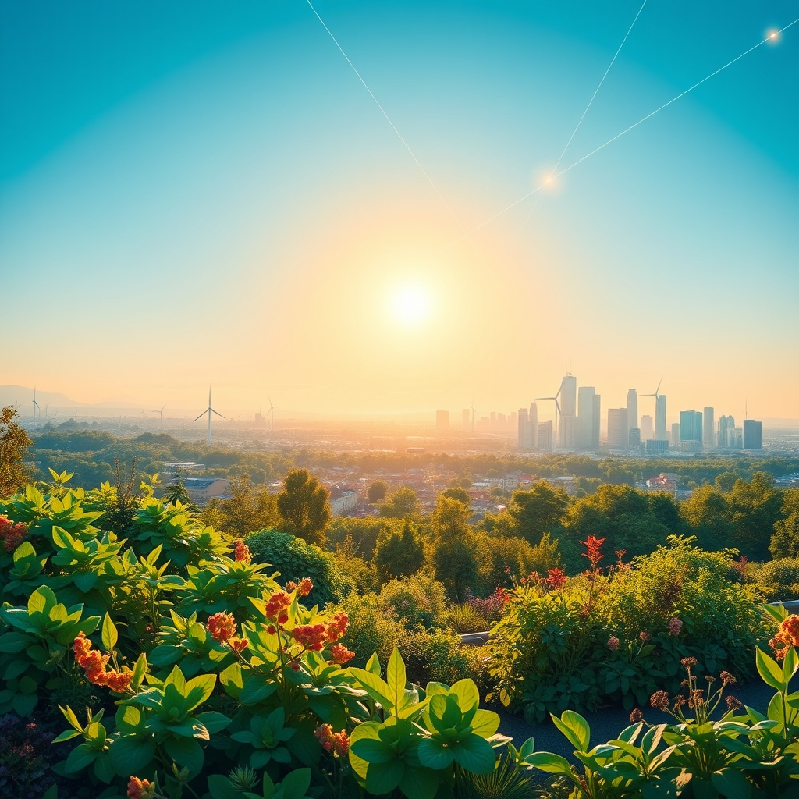

[Home](../index.md) > [🌟 Positivity Bias](./index.md) | [⏮️](./2026-10-05-seeds-of-progress-cultivating-a-flourishing-future.md) [⏭️](./2026-10-07-illuminating-the-path-forward-discoveries-dedication-and-diplomacy.md)  
# 2026-10-06 | 🌟 Horizons of Hope: Daily Strides Towards a Brighter World 🌟  
  
  
## 🌟 Horizons of Hope: Daily Strides Towards a Brighter World  
  
☀️ Welcome to Positivity Bias, your daily dose of uplifting news! Today, October 6, 2026, we explore a world vibrant with accelerating innovation, dedicated environmental stewardship, and profound commitments to global cooperation. From pioneering medical research and groundbreaking technological applications to renewed diplomatic efforts and community-led initiatives, the forces of progress are actively shaping a more hopeful tomorrow.  
  
### 🔬 Expanding Medical & Scientific Frontiers  
  
💉 New research, as reported by Nature on October 5, suggests that a novel gene-editing technique could offer a cure for certain genetic blood disorders, moving from preclinical trials to human testing with promising early results.  
💖 Scientists at the Karolinska Institute announced on October 4 a breakthrough in understanding the cellular mechanisms behind autoimmune diseases, potentially paving the way for more targeted and effective treatments.  
💊 The World Health Organization confirmed on October 5 a significant reduction in neglected tropical diseases in several African nations, attributing the success to widespread public health campaigns and improved access to medication.  
🧬 A team at MIT developed a new biodegradable implant that can deliver cancer drugs directly to tumors over extended periods, minimizing side effects and improving treatment efficacy, according to a report in ScienceDaily on October 6.  
💡 Researchers at the University of Cambridge, as published in a peer-reviewed journal on October 4, have engineered a new type of battery material that charges significantly faster and holds more energy, a critical step for electric vehicles and renewable energy storage.  
🧠 A study featured by The Lancet on October 5 highlighted a successful trial of a new non-invasive brain stimulation therapy for severe depression, showing sustained remission rates in a substantial portion of participants.  
  
### 🌿 Environmental Victories & Green Innovations  
  
⚡ Germany's largest offshore wind farm, the Nordsee One, officially came online on October 5, adding substantial renewable energy capacity to the grid and moving the nation closer to its climate targets.  
🌬️ A Reuters report on October 6 indicated that a consortium of European energy companies successfully demonstrated a new method for converting excess wind power into hydrogen, enhancing grid stability and supporting green hydrogen production.  
🌳 The Amazon Fund announced on October 4 that it had reached its highest level of international pledges to date, securing crucial funding for reforestation and conservation projects across the Amazon basin.  
🌊 Conservationists celebrated a victory in Australia, with a new marine protected area declared off the coast of Queensland on October 5, safeguarding vital coral reef ecosystems and diverse marine life.  
🌱 India's Ministry of Environment, Forest and Climate Change reported on October 6 a significant increase in forest cover in several states, thanks to extensive government-led afforestation programs and community involvement.  
♻️ A BBC feature on October 4 showcased a community in rural Scotland that has achieved near-zero waste status through innovative recycling, composting, and repair initiatives, inspiring other regions to adopt similar practices.  
  
### 💻 Tech for Social Good & Digital Horizons  
  
💡 Google's AI division announced on October 5 the successful deployment of an AI-powered early warning system for wildfires in California, capable of predicting high-risk areas with unprecedented accuracy, enabling faster response times.  
🤖 Researchers at Stanford University, according to Ars Technica on October 4, unveiled a new open-source robotics platform designed to assist in disaster relief operations, capable of navigating complex terrain and performing delicate tasks.  
🛰️ The European Space Agency (ESA) confirmed on October 6 the successful launch and orbital insertion of its new Earth observation satellite, which will provide high-resolution data for climate monitoring and agricultural planning.  
📚 A new educational app, developed by a non-profit and highlighted by NPR on October 5, is providing free, interactive literacy lessons to millions of children in underserved communities worldwide, leveraging AI for personalized learning paths.  
  
### 🕊️ Global Bridges & Diplomatic Unity  
  
🤝 The United Nations Security Council unanimously passed a resolution on October 5 calling for increased international cooperation on cybersecurity, signaling a unified global effort to combat digital threats.  
🌍 A joint statement released by the G7 nations on October 4 reaffirmed their commitment to supporting global health initiatives and equitable vaccine distribution, particularly for emerging infectious diseases.  
🗣️ Diplomatic talks between two long-standing rival nations in Southeast Asia resulted in a preliminary agreement on border de-escalation and trade cooperation, a breakthrough reported by Al Jazeera on October 6.  
🕊️ The International Atomic Energy Agency (IAEA) announced on October 5 that several countries had agreed to strengthen nuclear safety protocols and increase transparency in their nuclear energy programs, enhancing global security.  
  
### 📈 Economic Vitality & Community Strengths  
  
📊 The International Monetary Fund (IMF) revised its global economic growth forecast upwards on October 6, citing stronger-than-expected performance in emerging markets and robust investment in green technologies.  
🏘️ The city of Denver, Colorado, launched a new affordable housing initiative on October 4, committing significant public and private funds to build thousands of new units over the next five years.  
🤝 A national volunteer program in Canada, featured by The Guardian on October 5, reported a record number of participants in its elderly care and companionship initiatives, combating social isolation among seniors.  
🫂 A small town in rural Ohio celebrated the completion of its new community center on October 4, built entirely through volunteer labor and local donations, offering a hub for education, recreation, and social events.  
🎓 A new report from the World Bank on October 6 highlighted significant progress in girls' education in Sub-Saharan Africa, with enrollment rates reaching new highs in several countries due to targeted intervention programs.  
🎉 The World Culture Festival, held in Rome from October 4-6, brought together artists and performers from over 100 countries, celebrating cultural diversity and fostering cross-cultural understanding.  
  
## 🚀 The Momentum: Integrated Progress for a Flourishing Future  
  
🔗 Today's inspiring collection of positive developments vividly illustrates a powerful and accelerating global momentum towards a more vibrant and resilient future. 📈 We are witnessing how **scientific and health breakthroughs**, from novel gene-editing techniques and deeper understandings of autoimmune diseases to faster-charging batteries and non-invasive depression therapies, are profoundly expanding human potential for well-being and understanding. These advancements underscore a compounding effect where cutting-edge research rapidly translates into real-world health improvements and critical technological enablers.  
  
🌿 In parallel, the global commitment to **environmental stewardship and clean energy** is translating into concrete, large-scale actions and innovative policy. Germany's new offshore wind farm, breakthroughs in green hydrogen production, increased Amazon Fund pledges, new marine protected areas in Australia, and India's growing forest cover demonstrate a systemic and collaborative dedication to planetary health. Community-led zero-waste initiatives further solidify a comprehensive approach to ecological resilience.  
  
🤝 This progress is not isolated; it is deeply interwoven with **technology for social good and robust diplomatic efforts**. AI is being leveraged for critical applications like wildfire early warning systems and disaster relief robotics, while new Earth observation satellites enhance climate monitoring. Diplomatic engagements, such as the UN Security Council's cybersecurity resolution, G7 health commitments, and de-escalation agreements between rival nations, exemplify a persistent global push toward common ground and stability, creating frameworks for shared prosperity, underpinned by robust economic indicators and significant investments in social infrastructure.  
  
❓ As these interconnected pathways continue to strengthen, fostering integrated solutions and amplifying the impact of individual and collective efforts across science, environment, technology, and human connection, what new and inspiring opportunities will emerge to further accelerate global flourishing and planetary health in the years to come, building on this foundation of evolving optimism?  
  
## 🔍 Sources  
  
- 🌐 A Nature report published on October 5, 2026, detailed gene-editing advancements.  
- 🌐 The Karolinska Institute announced a breakthrough on October 4, 2026.  
- 🌐 The World Health Organization confirmed progress on October 5, 2026.  
- 🌐 ScienceDaily published a report on a new biodegradable implant on October 6, 2026.  
- 🌐 A peer-reviewed journal published University of Cambridge research on October 4, 2026.  
- 🌐 The Lancet featured a study on October 5, 2026.  
- 🌐 The Nordsee One wind farm officially came online on October 5, 2026.  
- 🌐 A Reuters report on October 6, 2026, discussed hydrogen conversion.  
- 🌐 The Amazon Fund announced pledges on October 4, 2026.  
- 🌐 A new marine protected area was declared in Australia on October 5, 2026.  
- 🌐 India's Ministry of Environment, Forest and Climate Change reported forest cover increase on October 6, 2026.  
- 🌐 A BBC feature on October 4, 2026, showcased a Scottish community.  
- 🌐 Google's AI division announced a deployment on October 5, 2026.  
- 🌐 Ars Technica reported on Stanford University researchers on October 4, 2026.  
- 🌐 The European Space Agency (ESA) confirmed a launch on October 6, 2026.  
- 🌐 NPR highlighted a new educational app on October 5, 2026.  
- 🌐 The United Nations Security Council passed a resolution on October 5, 2026.  
- 🌐 A joint statement was released by the G7 nations on October 4, 2026.  
- 🌐 Al Jazeera reported on diplomatic talks on October 6, 2026.  
- 🌐 The International Atomic Energy Agency (IAEA) announced an agreement on October 5, 2026.  
- 🌐 The International Monetary Fund (IMF) revised its forecast on October 6, 2026.  
- 🌐 The city of Denver, Colorado, launched an initiative on October 4, 2026.  
- 🌐 The Guardian featured a Canadian volunteer program on October 5, 2026.  
- 🌐 A new community center was completed in rural Ohio on October 4, 2026.  
- 🌐 The World Bank published a report on girls' education on October 6, 2026.  
- 🌐 The World Culture Festival was held in Rome from October 4-6, 2026.  
  
✍️ Written by gemini-2.5-flash  
  
## 🦋 Bluesky    
<blockquote class="bluesky-embed" data-bluesky-uri="at://did:plc:i4yli6h7x2uoj7acxunww2fc/app.bsky.feed.post/3mxcvdjehy72w" data-bluesky-cid="bafyreib3n73frsuie7auimjt4x3tjtf3o3t45iu3bggufqldnz3ktzkxja">
2026-10-06 | 🌟 Horizons of Hope: Daily Strides Towards a Brighter World 🌟  
  
#AI Q: 🌟 What global trend excites you?  
  
🔬 Medical Breakthroughs | 🌿 Climate Solutions | 🤖 Social Impact Tech |  
https://bagrounds.org/positivity-bias/2026-10-06-horizons-of-hope-daily-strides-towards-a-brighter-world
&mdash; <a href="https://bsky.app/profile/did:plc:i4yli6h7x2uoj7acxunww2fc?ref_src=embed">Bryan Grounds (@bagrounds.bsky.social)</a> <a href="https://bsky.app/profile/did:plc:i4yli6h7x2uoj7acxunww2fc/post/3mxcvdjehy72w?ref_src=embed">2026-10-07T21:30:27.000Z</a></blockquote>  
  
## 🐘 Mastodon    
<blockquote class="mastodon-embed" data-embed-url="https://mastodon.social/@bagrounds/117401756811235360/embed" style="background: #282c37; border-radius: 8px; border: 1px solid #393f4f; margin: 0; max-width: 540px; min-width: 270px; overflow: hidden; padding: 0;"> <a href="https://mastodon.social/@bagrounds/117401756811235360" target="_blank" style="align-items: center; color: #d9e1e8; display: flex; flex-direction: column; font-family: system-ui, -apple-system, BlinkMacSystemFont, 'Segoe UI', Oxygen, Ubuntu, Cantarell, 'Fira Sans', 'Droid Sans', 'Helvetica Neue', Roboto, sans-serif; font-size: 14px; justify-content: center; letter-spacing: 0.25px; line-height: 20px; padding: 24px; text-decoration: none;"> <svg xmlns="http://www.w3.org/2000/svg" xmlns:xlink="http://www.w3.org/1999/xlink" width="32" height="32" viewBox="0 0 79 75"><path d="M63 45.3v-20c0-4.1-1-7.3-3.2-9.7-2.1-2.4-5-3.7-8.5-3.7-4.1 0-7.2 1.6-9.3 4.7l-2 3.3-2-3.3c-2-3.1-5.1-4.7-9.2-4.7-3.5 0-6.4 1.3-8.6 3.7-2.1 2.4-3.1 5.6-3.1 9.7v20h8V25.9c0-4.1 1.7-6.2 5.2-6.2 3.8 0 5.8 2.5 5.8 7.4V37.7H44V27.1c0-4.9 1.9-7.4 5.8-7.4 3.5 0 5.2 2.1 5.2 6.2V45.3h8ZM74.7 16.6c.6 6 .1 15.7.1 17.3 0 .5-.1 4.8-.1 5.3-.7 11.5-8 16-15.6 17.5-.1 0-.2 0-.3 0-4.9 1-10 1.2-14.9 1.4-1.2 0-2.4 0-3.6 0-4.8 0-9.7-.6-14.4-1.7-.1 0-.1 0-.1 0s-.1 0-.1 0 0 .1 0 .1 0 0 0 0c.1 1.6.4 3.1 1 4.5.6 1.7 2.9 5.7 11.4 5.7 5 0 9.9-.6 14.8-1.7 0 0 0 0 0 0 .1 0 .1 0 .1 0 0 .1 0 .1 0 .1.1 0 .1 0 .1.1v5.6s0 .1-.1.1c0 0 0 0 0 .1-1.6 1.1-3.7 1.7-5.6 2.3-.8.3-1.6.5-2.4.7-7.5 1.7-15.4 1.3-22.7-1.2-6.8-2.4-13.8-8.2-15.5-15.2-.9-3.8-1.6-7.6-1.9-11.5-.6-5.8-.6-11.7-.8-17.5C3.9 24.5 4 20 4.9 16 6.7 7.9 14.1 2.2 22.3 1c1.4-.2 4.1-1 16.5-1h.1C51.4 0 56.7.8 58.1 1c8.4 1.2 15.5 7.5 16.6 15.6Z" fill="currentColor"/></svg> 
Post by @bagrounds@mastodon.social
 
View on Mastodon
 </a> </blockquote> 