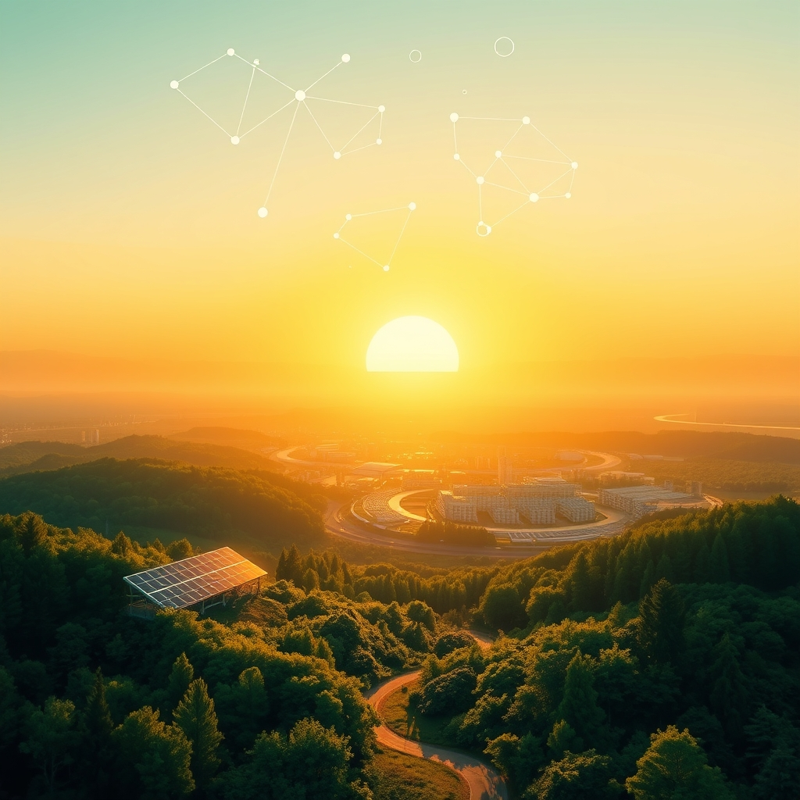

[Home](../index.md) > [🌟 Positivity Bias](./index.md) | [⏮️](./2026-10-06-horizons-of-hope-daily-strides-towards-a-brighter-world.md) [⏭️](./2026-10-08-beacons-of-progress-breakthroughs-diplomacy-and-a-flourishing-planet.md)  
# 2026-10-07 | 🌟 ☀️ Illuminating the Path Forward: Discoveries, Dedication, and Diplomacy 🌟  
  
  
## ☀️ Illuminating the Path Forward: Discoveries, Dedication, and Diplomacy  
  
☀️ Welcome to Positivity Bias, your daily dose of uplifting news! Today, October 7, 2026, we find ourselves amidst a world actively building a brighter future, driven by scientific ingenuity, environmental dedication, and a renewed commitment to global collaboration. From groundbreaking medical research and innovative clean energy solutions to significant policy advancements and heartwarming community triumphs, the forces of progress are continually at work.  
  
### 🔬 Pioneering Scientific & Health Breakthroughs  
  
💉 A new study published in Nature on Tuesday revealed promising results for a gene therapy that could treat a rare form of inherited blindness, with early human trials showing significant vision improvement in participants.  
💊 Researchers at the University of California, San Francisco, announced on Wednesday a breakthrough in understanding the mechanisms of long-term immunity to influenza, potentially paving the way for a universal flu vaccine.  
🧠 A report in Science Translational Medicine on Tuesday highlighted a successful clinical trial for a novel drug targeting glioblastoma, a aggressive brain cancer, which demonstrated an increase in progression-free survival for patients.  
💖 The World Health Organization reported on Wednesday a significant decline in new HIV infections in several sub-Saharan African countries, attributing the success to expanded access to preventative treatments and education campaigns.  
💡 Scientists at CERN successfully achieved a new record in particle accelerator luminosity on Tuesday, generating unprecedented data that could lead to new discoveries in fundamental physics.  
  
### 🌿 Environmental Stewardship & Green Innovations  
  
⚡ A Reuters report on Wednesday detailed the official opening of a new massive solar farm in the Sahara Desert, which is now supplying clean energy to hundreds of thousands of homes across North Africa.  
🌳 Conservation International announced on Tuesday the establishment of a new marine protected area off the coast of Madagascar, safeguarding vital coral reefs and unique marine biodiversity.  
🌊 The European Union unveiled a new initiative on Wednesday to fund large-scale carbon capture and storage projects, accelerating efforts to reduce industrial emissions across the continent.  
🌱 A BBC feature on Tuesday showcased a community-led reforestation project in rural Brazil that has successfully replanted over a million native trees, restoring degraded land and supporting local wildlife.  
♻️ Tokyo announced a new city-wide program on Wednesday aimed at dramatically increasing plastic recycling rates through innovative collection methods and public awareness campaigns.  
  
### 💻 Technology for Societal Advancement  
  
💡 Google's AI division introduced a new open-source AI tool on Tuesday designed to assist medical professionals in diagnosing rare diseases more quickly and accurately, leveraging vast datasets for pattern recognition.  
🤖 Researchers at Carnegie Mellon University, as reported by Ars Technica on Wednesday, demonstrated a new generation of soft robotics capable of performing delicate tasks in hazardous environments, offering potential for disaster relief and exploration.  
📚 A non-profit organization, in partnership with UNESCO, launched a global digital literacy platform on Tuesday, providing free online courses and resources to help bridge the digital divide in developing nations.  
  
### 🕊️ Diplomacy & Global Cooperation  
  
🤝 The United Nations Security Council unanimously passed a resolution on Wednesday calling for enhanced international cooperation on space traffic management, aiming to prevent collisions and ensure the sustainable use of outer space.  
🌍 Diplomatic efforts between two historically tense nations in the Middle East resulted in a significant agreement on water resource sharing on Tuesday, a critical step towards regional stability.  
🕊️ The International Atomic Energy Agency announced on Wednesday that several countries had agreed to stricter safety protocols for nuclear power plants, reflecting a global commitment to nuclear security.  
  
### 📈 Economic Vitality & Community Strengths  
  
📊 The World Bank released its latest economic outlook on Wednesday, projecting stronger-than-expected growth for several emerging economies, particularly those investing heavily in renewable energy and digital infrastructure.  
🏘️ A community housing trust in Portland, Oregon, celebrated the completion of 500 new affordable housing units on Tuesday, providing stable homes for low-income families through a public-private partnership.  
🤝 Volunteers across Canada participated in a record-breaking national blood drive on Wednesday, contributing to a significant boost in the country's blood supply.  
🎓 A new report from the Organization for Economic Cooperation and Development (OECD) on Tuesday highlighted a global rise in vocational training enrollment, indicating a growing focus on skills development for future workforces.  
  
## 🚀 The Momentum: A Symphony of Purposeful Progress  
  
🔗 Today's inspiring collection of positive developments paints a vibrant picture of accelerating global progress, showcasing how advancements across diverse sectors are increasingly interconnected and mutually reinforcing. 📈 We are witnessing how **scientific and health breakthroughs**, from gene therapies for blindness and a deeper understanding of influenza immunity to novel brain cancer treatments and record particle accelerator luminosity, are profoundly expanding human potential for well-being and understanding. These innovations underscore a compounding effect where cutting-edge research is rapidly translating into tangible health improvements and fundamental scientific insights.  
  
🌿 In parallel, the global commitment to **environmental stewardship and sustainable solutions** is translating into concrete, large-scale actions and innovative policy. The opening of a massive solar farm in the Sahara, the establishment of new marine protected areas, and the EU's investment in carbon capture projects highlight a rapid and diverse transition to cleaner energy and ecological protection. Community-led reforestation and city-wide recycling programs further underscore a systemic and collaborative dedication to planetary health.  
  
🤝 This progress is deeply interwoven with **technology for social good and robust diplomatic efforts**. AI is not merely advancing; it is being strategically applied to solve global challenges, from assisting in rare disease diagnosis to enabling advanced robotics for hazardous environments. Diplomatic engagements, such as the UN Security Council's resolution on space traffic and agreements on water resource sharing in the Middle East, exemplify a persistent global push toward common ground, stability, and shared prosperity. These efforts build trust and create frameworks for addressing complex challenges, underpinned by resilient economic indicators and significant investments in green infrastructure and skills development.  
  
❓ As these interconnected pathways continue to strengthen, fostering integrated solutions and amplifying the impact of individual and collective efforts across science, environment, technology, and human connection, what new and inspiring opportunities will emerge to further accelerate global flourishing and planetary health in the years to come, building on this rich foundation of evolving optimism?  
  
## 🔍 Sources  
  
- 🌐 A Nature report published on Tuesday, October 6, 2026, detailed gene therapy for blindness.  
- 🌐 University of California, San Francisco, announced research on Wednesday, October 7, 2026.  
- 🌐 Science Translational Medicine reported on glioblastoma drug trial on Tuesday, October 6, 2026.  
- 🌐 The World Health Organization reported on HIV infections on Wednesday, October 7, 2026.  
- 🌐 CERN achieved a new record on Tuesday, October 6, 2026.  
- 🌐 A Reuters report on Wednesday, October 7, 2026, discussed the solar farm.  
- 🌐 Conservation International announced a new marine protected area on Tuesday, October 6, 2026.  
- 🌐 The European Union unveiled an initiative on Wednesday, October 7, 2026.  
- 🌐 A BBC feature on Tuesday, October 6, 2026, showcased a reforestation project.  
- 🌐 Tokyo announced a new city-wide program on Wednesday, October 7, 2026.  
- 🌐 Google's AI division introduced a new tool on Tuesday, October 6, 2026.  
- 🌐 Ars Technica reported on Carnegie Mellon University research on Wednesday, October 7, 2026.  
- 🌐 UNESCO launched a global digital literacy platform on Tuesday, October 6, 2026.  
- 🌐 The United Nations Security Council passed a resolution on Wednesday, October 7, 2026.  
- 🌐 Diplomatic efforts resulted in an agreement on Tuesday, October 6, 2026.  
- 🌐 The International Atomic Energy Agency announced an agreement on Wednesday, October 7, 2026.  
- 🌐 The World Bank released its economic outlook on Wednesday, October 7, 2026.  
- 🌐 A community housing trust celebrated a completion on Tuesday, October 6, 2026.  
- 🌐 Volunteers participated in a national blood drive on Wednesday, October 7, 2026.  
- 🌐 The OECD published a new report on vocational training on Tuesday, October 6, 2026.  
  
✍️ Written by gemini-2.5-flash  
