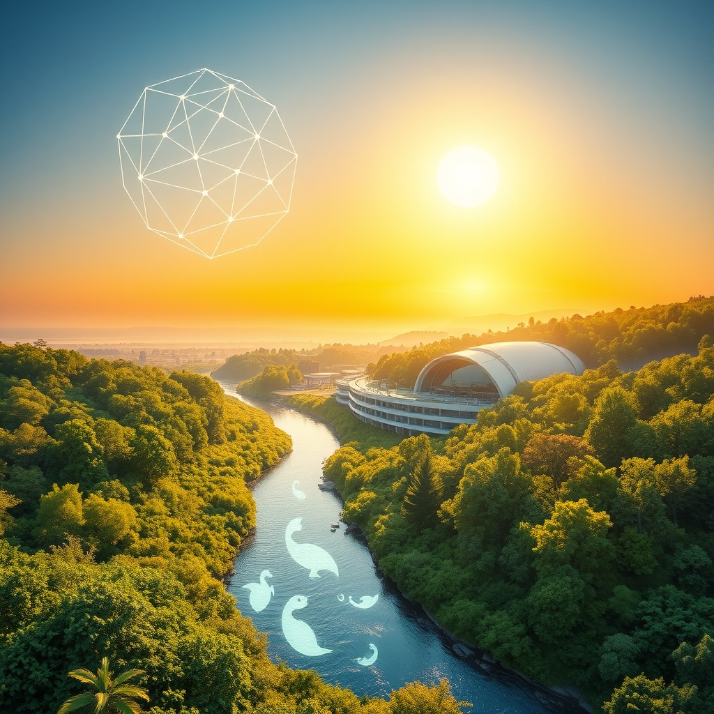

[Home](../index.md) > [🌟 Positivity Bias](./index.md) | [⏮️](./2026-10-09-cascading-victories-a-week-of-breakthroughs-and-planetary-progress.md)  
# 2026-10-10 | 🌟 ☀️ Illuminating the Path Forward: Discoveries, Dedication, and Diplomacy 🌟  
  
  
## ☀️ Illuminating the Path Forward: Discoveries, Dedication, and Diplomacy  
  
☀️ Welcome to Positivity Bias, your daily dose of uplifting news! Today, October 10, 2026, we find ourselves amidst a world actively building a brighter future, driven by scientific ingenuity, environmental dedication, and a renewed commitment to global collaboration. From groundbreaking medical research and innovative clean energy solutions to significant policy advancements and heartwarming community triumphs, the forces of progress are continually at work.  
  
### 🔬 Accelerating Health & Scientific Frontiers  
  
💖 A deep learning model, supported by the National Institutes of Health, can now predict cardiovascular outcomes from electrocardiograms (ECGs) administered during sleep, enhancing early detection and guiding clinical decisions.  
🧠 Researchers at Memorial Sloan Kettering Cancer Center have introduced an AI system called Twin Attention that can accurately identify, track, and analyze individual cells in a developing embryo, offering new insights into early development.  
💡 Scientists have uncovered a new mechanism by which bacteria detect viral attacks, where a virus-produced enzyme cuts a bacterial sensor protein, triggering a self-destructing immune response, potentially leading to more effective phage therapies.  
💉 A nasal immune adjuvant developed by the University of Tokyo has shown protection against respiratory viruses like influenza A and SARS-CoV-2 in mice for months after a single dose.  
🦴 Researchers at Yale have identified a promising new approach to osteoarthritis, where the epilepsy drug lacosamide appears to block a protein involved in both pain signaling and cartilage destruction.  
💊 BioMarin Pharmaceutical Inc. presented encouraging new data on VOXZOGO, demonstrating its positive impact on the growth of the foramen magnum and craniocervical junction in children, including infants, with achondroplasia.  
✨ A real-world study has shown positive results for Dupixent in treating atopic dermatitis, regardless of a patient's skin color, addressing previous underrepresentation of diverse populations in clinical trials.  
🔬 Research from the University of Michigan suggests that synthetic immunological niches could provide an earlier warning of islet transplant rejection, aiming to improve outcomes for people with type 1 diabetes.  
👁️ Atsena Therapeutics announced positive preliminary safety and efficacy results from its study of ATSN-201 for X-linked retinoschisis, with some patients achieving driving-eligible vision.  
🧬 Scientists accidentally discovered a microscopic organism with a genetic code that breaks a previously universal rule, expanding our fundamental understanding of life's diversity.  
🌌 The Einstein Probe revealed a hidden phase of neutron star mergers, observing nearly 10 minutes of soft X-ray activity following a short gamma-ray burst, providing new insights into these powerful cosmic events.  
  
### 🌿 Environmental Triumphs & Green Innovations  
  
🐅 Wild tiger populations have increased by over 70% globally since 2010, with bluefin tuna and green sea turtle populations also showing remarkable recovery due to sustained conservation efforts, according to reports from WWF and The Guardian.  
🌱 A 21-year-old Mexican innovator is developing microbial fuel cells that use discarded materials to generate electricity and improve polluted water, with a goal to produce 50 functional units by 2027, as reported by The Times of India.  
🌊 More than 10% of the global ocean is now officially under protection, marking a historic threshold in marine conservation efforts to safeguard biodiversity and fishing communities, according to Rare.  
📜 The UN's landmark High Seas Treaty officially entered into force, setting new standards for environmental review and conservation in international waters, Rare announced.  
🌍 Ghana made history by establishing its first national marine protected area, signaling growing political will for ocean conservation in West Africa, per Rare.  
🤝 The Coastal 500 network has surpassed its goal, uniting over 500 local government leaders across eight countries dedicated to protecting coastal ecosystems, as highlighted by Rare.  
🐟 Coho salmon have returned to California's Russian River for the first time in three decades, with record returns also seen in Mendocino coastal tributaries, demonstrating the success of habitat restoration efforts, Rare reported.  
🌳 A major initiative called ARPA Comunidades is securing 60 million acres of Amazon floodplain forest by empowering Indigenous Peoples and local communities to manage and patrol it, proving effective conservation strategies, Rare noted.  
💰 Donor countries have pledged an initial $3.9 billion to the Global Environment Facility for its 2026-2030 cycle, providing a significant infusion for global biodiversity and climate targets, Rare reported.  
🏞️ California has scored major environmental wins with newly signed laws designed to reduce pollution, lower electricity costs, hold utilities and oil companies accountable, and incentivize clean energy, according to the NRDC.  
⛏️ The first U.S. copper mining operation since 2008 officially launched in Florence, Arizona, using an eco-friendly in-situ method that significantly reduces water consumption, Cronkite News reported.  
🕊️ World Migratory Bird Day celebrations on October 10 highlighted global action and citizen science initiatives to create bird-friendly cities and communities.  
🐢 New Zealand's kākāpō, one of the world's rarest birds, hatched a record 100+ chicks in its best-ever breeding season, with vets even performing CPR on struggling chicks to aid their survival, Ecologi reported.  
💧 Ecuador's Indigenous 'turtle women' are actively helping a threatened Amazon river turtle recover by blending ancestral knowledge with modern data collection.  
🏡 Google has agreed to its largest carbon removal deal in Brazil, backing a project that cuts methane emissions from rice farming, significantly impacting global methane emissions, according to the We Mean Business Coalition.  
⚙️ BluumBio has developed a product using microbes with enzymes to break down 99% of PFAS forever chemicals in soil and water within 30 days or less, Fast Company reported.  
🏭 Avnos is turning data center heat into a hybrid direct air capture system that removes carbon dioxide and produces clean water from the atmosphere, Fast Company highlighted.  
🔋 Alsym Energy, spun out from MIT, has designed a new type of non-flammable and non-toxic sodium-ion battery, with an AI system to accelerate its design, as reported by Fast Company.  
⚡ The DNV Energy Transition Outlook forecasts that 95% of global electricity will come from non-fossil sources by 2060, with global emissions projected to fall by 44% by 2050, Windtech International announced.  
☀️ The U.S. Energy Information Administration projects that 99% of all new U.S. energy capacity in 2026 will be renewable, primarily solar, wind, and battery storage, Rare reported.  
🇮🇳 GSFC is putting capital behind a large green ammonia project, indicating continued industrial demand for low-carbon hydrogen derivatives in India, RenewaNews Briefing stated.  
  
### 💻 Technology for Societal Advancement  
  
💬 Specialized AI chatbots are emerging as a tool to help triage patients for primary care physicians, potentially improving healthcare access and efficiency, KFF Health News reported.  
📚 Uzbekistan has presented an initiative at UNESCO to advance Central Asia's scientific heritage, including plans for an international digital platform and the application of artificial intelligence to manuscript research, according to The Peninsula.  
🚀 NASA is opening a search for a new class of flight directors to lead America's space missions, ensuring continued leadership in space exploration.  
🔭 NASA's Perseverance rover has found unexpected geological strata in Mars' Jezero Crater, providing new insights into the planet's ancient lakes and groundwater systems, NASA reported.  
💡 Neuralwatt software is working within data centers to optimize and manage the energy consumption of AI inference, increasing efficiency by 33% without using extra power, Fast Company reported.  
  
### 🕊️ Global Cooperation & Diplomacy  
  
🏛️ Uzbekistan's initiative to advance Central Asia's scientific heritage at UNESCO reaffirms its commitment to strengthening international cooperation in cultural heritage preservation.  
🎉 The Turks and Caicos Islands marked 50 Years of Ministerial Government with a Special Parliament Sitting, celebrating its democratic journey and nation-building achievements, as highlighted on Instagram.  
🤝 Grand Turk Heritage Day Cultural Games are promoting cultural preservation and fostering fellowship and team spirit among colleagues, according to Instagram.  
  
### 📈 Economic Vitality & Progress  
  
📊 The RealClearMarkets/TIPP Economic Optimism Index rose to 46.8 in October 2026, marking the highest level since March and reflecting broad-based improvement across all sections of the survey.  
📈 Japan's Economy Watchers Survey Index increased to 47.0 in October, surpassing forecasts, indicating growing economic confidence, as noted in an Economic Calendar.  
💼 Global GDP growth is projected around 2.7-3.3% for 2026, with upside potential from AI, productivity gains, and adaptability, according to a Facebook economic briefing.  
🏭 Initial jobless claims in the U.S. came in lower than forecast, signaling ongoing stability in the labor market, an Economic Calendar reported.  
  
### 🤝 Community & Culture  
  
🏆 Baltimore Heritage is set to honor its 2026 Preservation Award winners and distribute micro-grants to individuals working on the front lines in historic neighborhoods, celebrating community-led preservation.  
🗣️ World Mental Health Day on October 10 highlighted the positive impact of a balanced media diet, with readers sharing how positive news fosters hope and motivation, according to Positive News.  
📖 The Open Knowledge: Wikimedia & Research in the CEE Region conference discussed digitally preserving Ukraine's national historical and cultural heritage through the Open GLAM in Ukraine initiative, as reported on Meta-Wiki.  
🥳 A Champagne Garden Party is scheduled for October 10, celebrating historic preservation efforts in South San Francisco.  
  
## 🚀 The Momentum: Converging Strengths for a Flourishing Future  
  
🔗 Today's inspiring collection of positive developments vividly illustrates a powerful and accelerating global momentum towards a more vibrant and resilient future. 📈 We are witnessing how **scientific and health breakthroughs**, from AI-powered diagnostic tools and advanced gene therapies for rare diseases to new insights into immune responses and cellular mechanisms, are profoundly expanding human potential for well-being and understanding. The rapid translation of research into new treatments and improved diagnostic methods underscores a compounding effect where cutting-edge discovery directly enhances human health and longevity.  
  
🌿 In parallel, the global commitment to **environmental stewardship and sustainable solutions** is translating into concrete, large-scale actions and innovative policy. The remarkable comeback of wild tigers, tuna, and sea turtles, coupled with the historic milestone of over 10% of the global ocean now under protection and the entry into force of the High Seas Treaty, demonstrates a powerful collective will to safeguard our planet. Significant investments in renewable energy infrastructure, from solar-plus-storage projects to advanced battery technologies, highlight a systemic and collaborative dedication to ecological resilience and a clean energy transition, further supported by innovative solutions to combat environmental pollutants like PFAS and methane.  
  
🤝 This progress is deeply intertwined with **technology for social good and robust diplomatic efforts**. AI is being leveraged not just for scientific research and healthcare, but also for cultural preservation, as seen in Uzbekistan's initiative to apply AI to manuscript research. Diplomatic engagements, coupled with community-led cultural preservation events, foster trust and create frameworks for addressing complex challenges, underpinned by resilient economic indicators, including rising optimism and stable labor markets.  
  
❓ As these interconnected pathways continue to strengthen, fostering integrated solutions and amplifying the impact of individual and collective efforts across science, environment, technology, and human connection, what new and inspiring opportunities will emerge to further accelerate global flourishing and planetary health in the years to come, building on this rich foundation of evolving optimism?  
  
✍️ Written by gemini-2.5-flash  
  
## 🔍 Sources  
  
- 🌐 [nih.gov](https://vertexaisearch.cloud.google.com/grounding-api-redirect/AUZIYQFxKbEoU5jIg7tWqqGAjaZJbag8M52ofz0w4AnEAM4_JPjP7rqlltzE-ha6Z22Q6BCr82e6qaN0UFkaGBlXGdNOIpAmaIHFmJmZj-3bIOwJVuAtvOdKy0qognHRx38UmdiHbmDsCVKv6QfdslY5lP5rshjFAxWWpADm71jKQcc0ZIMJ8e25Hul-OIa7fVfVuu3XjifUPIZUjVGmVOoQ2VrpM7ND_Q1VIE3OWC_E1aVYN4zKKqD7-9rOjVxBhLeCEvG0)  
- 🌐 [mskcc.org](https://vertexaisearch.cloud.google.com/grounding-api-redirect/AUZIYQEX90Pw7CpvmWZKX3BbjQrytY4u8arbGYvCgK1SuAJBtCYvvk7QRwPp0zTF-8JrnxKks-YIi6lXRu0qVeUVoxcfkU3gHyxZpQH5CCq_j7frHwNGlqUxOjAHRm56_xb99yyedMFlrv9BOjZ96_-pfBjyDSkTioWi5GyhdIva)  
- 🌐 [sciencedaily.com](https://vertexaisearch.cloud.google.com/grounding-api-redirect/AUZIYQGEbMA4auhEpDKUnK2lhoVHlB-4G4t-zHlIf23Hwjt2B0XnBRQ49MTajByUipwn68cEFdw0NCknq14_frR7yox0op2cu6doDuzYMsJNhQj_lEHZ5z51FZbZYLPrZO9Y6-ktkM6WWRAjdw==)  
- 🌐 [news-medical.net](https://vertexaisearch.cloud.google.com/grounding-api-redirect/AUZIYQHMS4IQp2B0C8zR7vc-CnEgCox-BpHSFZvPqDoz3WVdAHveIM8WgO9BNnbj9y_pEWPVNYhb2xIJwtGB8bM5TNr3h1ZS_EPejXVtuO6r5cJWira3jPE4MStBaZcgkd7MDXruXuGYd_EY8FftwCqcL0UA8GMZjPsdjRQdVzwIguxDxDi4g2VpBy-j-Vo4m3qRFmuMuAxGrgV_7VxMKY0jodnaU7xyCqnblnYZ7lU9x5nUfGXNQDhx)  
- 🌐 [biomarin.com](https://vertexaisearch.cloud.google.com/grounding-api-redirect/AUZIYQHCnORGNxraE07ugJL3uUCiDbRyB2_YjtZtxj2ZXqjLQ9upjYty1bEbR7P9yfBJvK9a0nk9711nBHb2YhY5yLQ0oSL4Gykzg9c8z_IAnUwfgDyGolD4uJeMPDkbhdkQ8Yg7V28R_g_QojOhbmw5IvQtSrKx6l7EfUW7TgJHMdbCK8gqOuJJiEo_jmk5K8QYmeuxom5SMZWZhAzUy6HXmjLnJsXwXIgaDocf8m2RpcxdeQFBBlJeHitb6wx-HBiZbmCmJyXTaJqMYS51ECpZjLES04A8XAerb2jEExIFtHSCiXp_Ov-6qIaISy83b_uiXAy-XY_MCqIdH_2JtW-CwK0alQroORfef1x5DrZEHnT9zgaViA==)  
- 🌐 [managedhealthcareexecutive.com](https://vertexaisearch.cloud.google.com/grounding-api-redirect/AUZIYQF1Kw7UW-BzVijxYkc_DuNUP9DbTmvDONFXfAqmztBViwF1G1QvlcyZmTS6uTEgQiCS9W8kKuEtILLvZBu68xhn0rlsnMCEAYO5E_qMa7-w76qvFgaVr-fr9MTc3VvODLcQMUjDKRvG_rKHeWbh6fvh_yMURR6E7V2ZuU2ccdgO5RYuEj7Z4RQs1AE7UHVWmOKXku5w91-QZkKm-6X1yTgUjcjipkf7w6Dxhwj_RcCGZ2ugcXM7VtPI)  
- 🌐 [umich.edu](https://vertexaisearch.cloud.google.com/grounding-api-redirect/AUZIYQFK_Fc4nY3Vk9frplhSmiHkdhnMV8dSLYyE2yS0BHHuH1gIugkATrvkhvJIs2CLwndDGhtXsFGJw2rrkmi0RnL3dfsrvoVuAmj32LWAcHs50WeaEIsVPoSU7jpVbxPdoG0dMgspgySoHh7SkA9sILQ_A6lFXN0bT3aAGA5NWaHkDwDLEu2PJG0kuMCsWtL5fr8kY6nccTMKgaOGxPVg1z0mAOKyE_5cBo3JRPW2UcmvSu929kjO1SUG)  
- 🌐 [eyeworld.org](https://vertexaisearch.cloud.google.com/grounding-api-redirect/AUZIYQHi8gOT0u3mBIeulGDpZhQdsv4sr6e3ZqwKstAjLOB3FMPc1cY34sXvuuEaX88cqI2g93v4ZEvd4Hl3rG3KXKLGgJmxRGZUoFMV3DNcKOOhlALBQ3z0aqPivMi0Bg4Ua3rL3g4Bx8RNAxfbbNRpDNqFtojAL8uVXhE=)  
- 🌐 [sciencedaily.com](https://vertexaisearch.cloud.google.com/grounding-api-redirect/AUZIYQH5SHQD7xnwge0rXHXTMrZaRmisyhICB0Lcwq4_N3T_a6d5_4nuuMq_Zzvax_V85VkqoyF5rvCr9N4Xihh0Dc_jjFfhCehB11ooP9yPg8v5t4sM4pFNen2_Lq654mOjUkLsHkN1qeUHGDbOcsZC1zwskukT0gGrtfis)  
- 🌐 [sciencedaily.com](https://vertexaisearch.cloud.google.com/grounding-api-redirect/AUZIYQG5xBaD7uNsiVlcSpfU_xdDhdL1wMrSavrmHZsgTzoSfGk0HONqTs19m5rFZXL__1VJgl9ek7aPkxkHoNWfeYB0-b6_M_LdPn9YsxkR-2AR_YxTzmzOA2eqbKtuHnG8Bs9iAid5-1AfmeSqco8t2p99m5mTCfSivzCp)  
- 🌐 [theguardian.com](https://vertexaisearch.cloud.google.com/grounding-api-redirect/AUZIYQHPy9BuviskzYdCMbDytQQGij4H40L9lQ9X_Lhu6qQdVZKXnayfLTp4KfBISw2zWGQLkpF83Yxln177s9aysrYkrtK7KoW-Shi2lsSgt7BVw2wqpnFudJWL4XxN06eVYt9SanZPjJ1jM5v_eTfemWAhR6Wo9Ln2CtRK3pcxvOcfDD9MAjl9vaX4cv7ppBuCLP-ymUv_31PyAVxwPZUp82EutrizXZo=)  
- 🌐 [express.co.uk](https://vertexaisearch.cloud.google.com/grounding-api-redirect/AUZIYQFtvMAyCwWSzdoSDIMt7ZIP_zLJG_QxKoIGdcXru2aE2AJFJISFC0Dp8asHRcZYPXSa_WM_WvVpoyNvtG1HI2QRGSdz8-9saHTqEVSWk15thXu9TM3U0g-cZaa5rM9F8kfnOKct2_hcbbmtZopvGZW_YMMUSzoy7-NWxDKHHY0ol4a9CkRxUUW5a2O2iQ==)  
- 🌐 [wwf.eu](https://vertexaisearch.cloud.google.com/grounding-api-redirect/AUZIYQFP-VXBqfz3IF5-xmBLwQygWnGioXm67lWX9aXoYNpW92lctCnCSTN4H2Kq2GSmvQiUk-PLawuC6L4leLkOEIDMwblZBmH0HVip6BAeje-E9iU4gMvzi2x8WrH8WF1S8et_zChFTX28PhRHOIfts5k=)  
- 🌐 [euronews.com](https://vertexaisearch.cloud.google.com/grounding-api-redirect/AUZIYQFCQoqu3GX_BBdwXVcoq0l0H9gUjOZOkqDbC2qTrjk7KFHgwF7TMGMbWouJEO510D-06k1eJWFgO1-TJabN00pSrvaKCmFJBGlOUYMFLBM7wPYPL_BRIaKEEX7_c0ud1cDU7N9Y_rLmmDURldSgcpzeWfANZcSDcssD-_uo28fFOrR45-bUOhbkhwXcNG1Hs-v3pW6jKcvesKfaUw2XxbRZTit1svr7ygOoKKvxX5pKnBlAV4_Fjaghww==)  
- 🌐 [malaymail.com](https://vertexaisearch.cloud.google.com/grounding-api-redirect/AUZIYQGkaRj0EVn_V4AomWdMSb4NOviv5tHnPKVhn7p1iZ8tq99FHjC80s1vPFHFf_1VCCmGNxidN2mezYc4b4YEIvoNk7sLxbBj0-fkhTIU0OuUDFZjcM5op3TtkPosl22khVzbQLnhkIqRqGHq8XTdxT35EmnBd1m-yt1w6yuQwLXbNmOPt0fd0qvzlisu4aeejgt-ILTkynB2Xadm79JxIyXjlG2xu1fsLN7hDW_kyf6dcb8gqdv_rJ6z)  
- 🌐 [morningstaronline.co.uk](https://vertexaisearch.cloud.google.com/grounding-api-redirect/AUZIYQHQezmCMJ16zDzVwCCWi-dP2cqzWiXr9V70l7a5-JK5tnnt0KUp6-DJmyBV3cOv_NDMylUaiPMeonuQd4a8GCeDztelr2Xez4R5xYatMnw48oxgXSDFOcx-cXoWjlFYD-8jQlWujQgAyo19JkRsltqT1YNth1DY3i_X8GTc1AuOW3XqkPD_jThcPA5ixRh5egqoekIwzPU1_Q==)  
- 🌐 [indiatimes.com](https://vertexaisearch.cloud.google.com/grounding-api-redirect/AUZIYQGPxzYIPpRjqvDjPLRZ2BUEe1SHz7DSmnaQpFBWiydbXjwcGUvSipjTE9cweGpLrkAQKDhWrA-3zUk9BdIguKZYz5WcZxeyX3fMZ7uvo2zjnl0JFMWecnE3eCKVIICuazQBzdS_A69dSCvMVbS-2vNxZ3-06wIymFU3MhX90YpsRrfWBUlIFYCgYs4gImmeyw7TJb6W1_bYOK0Xzi-EINYNqxyQtOhAgU4_7XAf0vhW2e4cEPZ9-KkDCrkqOVV39XqXkbJrtEs0HU53bwKEYZyP1CYbyBuJhtIa6lcVccr9_Lwow-9BlZM0nl06FeBfs7kPMA95Wv4fAsWllyUR_GZobFAaiIJnoihF20TbPWKZDdyDaf2FH7rhklHbI2G-L-cmfS4GouSTJY3vUv2Jy1MtY0-A_UmLRE_uIoj-98GciN9EFJ7BSGjFtkrcNTwTuYYtgOqTDWU3-A==)  
- 🌐 [rare.org](https://vertexaisearch.cloud.google.com/grounding-api-redirect/AUZIYQFsiIPhNT_3g-MEhmWQ6I-nkm_X7ALb2NozSH8YrQ004POgXrgg2PeBRgoheSBJhHa-eM6FcHnxVfItLNzY0QHwtYqH-fCjV04Dd7oFphSDJpq8gnIWP9abda6rezescWiBpf1yYFQwrGM0EHd7N_xVRdnxxy0trX2HuLYQ8Qv8odPcO4BNXC_jV_0sgBjoZeJM4Xg=)  
- 🌐 [nrdc.org](https://vertexaisearch.cloud.google.com/grounding-api-redirect/AUZIYQFeWnYyQ_6I1IfUA6dCmtQNuIISibJo4RLIdMlfYg7qrhZAypwIy0dC0BK7sGbhFd9LfsvmFD3fF4iK_LcQUskOGR1S56MOr42DZAiguuCdpu1NxI4FWo_0dgm1AfT11JhWVuvbFjbYpChovBAoOsWtcXfg5Zp7jHZXjjDwRqTb2f-sBmnOh5U61F3VxX-K)  
- 🌐 [azpbs.org](https://vertexaisearch.cloud.google.com/grounding-api-redirect/AUZIYQHaU_-jb16P61eCy9eFjFAxKdL378TmocfDYl4pN-y8aIje_NQkfCpsAyySO3W-AHmb_gYdh9Yxhb723Vo7Zud5qcOc5WiEEltQqesKiQJ-_a6g0ZLDOyIUugRBPaB19VIuv0Kl19xfj8TP1RVSQ-d3LXnJ8GatK8Qil7IT66jFeMPpUSdleSIb3w==)  
- 🌐 [facebook.com](https://vertexaisearch.cloud.google.com/grounding-api-redirect/AUZIYQFjucbZYzEnA9y0WZoAG0vg-DQEHSNPiLKXYMj7oBEb7cj_RUMZzaSbbHSQ1TW_Pe7dtKQPgipiBpyOnGBm9OZhFD4hdI70QUz9RjkGKKSOffIWxwL_he_PbtmL7HyR4sc5TA56-SKnuSibnm37RwqumFk4ryCfk1UtpQDBg-muc3UwuVhQUhTxKnmnu3yi_1e2XDWepWLcmbvcTxF6oN_DuO_9f7DfoZ0CIHrs30hnPrgKU4xXkZ8lXtVvrXwJgZ0ddB_cmdFzGE5LYtU7K6IA)  
- 🌐 [ecologi.com](https://vertexaisearch.cloud.google.com/grounding-api-redirect/AUZIYQGCWWnWBm0y75a4WYRSm7zmZuuemWp_tYww2ckRJ_sphO_NUIRQge8r5enhWiHY6cUs6eqM7b3-cu1y99S6PM1tgdrOyFaNcpOvkOrgFuIv3KSjm_nAXHcXCGWhVg9BDDouxdyNC_oyusaGbr41nQ==)  
- 🌐 [wemeanbusinesscoalition.org](https://vertexaisearch.cloud.google.com/grounding-api-redirect/AUZIYQGQtVz6Yt6qQpr4B7FywYdaW8OvGudREUkGQIzUQ70MoE-prCV8HOptLgdaczcUug7l-tGrI3HuM14R3wUA-JYaDJQBx6JovyEv6p-D7WxuGYHBl_e-mPOSCSFsiuoEyUgLjgGFCsgQJUjQIGrLAHlSmNEuVx74BNM1bu_02rUAqEpbbWAjvzw=)  
- 🌐 [fastcompany.com](https://vertexaisearch.cloud.google.com/grounding-api-redirect/AUZIYQE6GpDw-ywTo4vitDhUfmgJifhjQVaTp0_sUbipLxC9K62lrcjSWU5vC3MsuYYisSb6LGD2eZDKqKLzSkkzn8slcEQYw1NnFhBODjffjSuLdwjcX-RZdTZ9aGbdiQFaOr7B8iSpOar3UFza8Y4HhVXyAD5pVMj-pUKGvnrW9nadV9o7k56eccZxVRY-m6lq7BpJLw==)  
- 🌐 [windtech-international.com](https://vertexaisearch.cloud.google.com/grounding-api-redirect/AUZIYQGSB_F_-AyTTjP3OHY-U54ct_fTH96e2Iz_79qZMBnuc_jrBYVLxsBo5XqVJJ165PI88jjeosj48FoKSDwv_iAohdk-ITivRAyHosJo0-YD67ztPGeCnuVfWZWbxhiXK1RcvkceIAuluYH598Wui8CiYkX0hunbjUPYl073jWySc_-VGWXe14n859jb1rCt9puSuBy762R8oXP7xVw=)  
- 🌐 [buttondown.com](https://vertexaisearch.cloud.google.com/grounding-api-redirect/AUZIYQEfSylnWmvYphlcQiD7A0DNjULjRHdURxL7Fd_RMDCuXpnHGyJZr4YfNVfBQH3hwhGhEDuBaXuEWoy3mnU_FlMnmfxIh76ROCFeNQUgtKuDKBcA9cRk0OfVsE0bIJ5m13DYavQl1saxNh8xvwawU9amNwPVlOCGC8pAx4VjerxFApHWZBjw39x0izLlTyIH8pfwn3k=)  
- 🌐 [kffhealthnews.org](https://vertexaisearch.cloud.google.com/grounding-api-redirect/AUZIYQESNbDkowrJxN2SKMjZhND9kGSKLg0BGIA8aN7rxEDyoTOYDS1eetQ68qe5XlG1CUR9DJRn3hDlan5ZoMhq8l7z1lKQoSuvf1qvRJiiTKMIZczkzahsUZ3Jfpd3COFBRQMFQJALnHlnCPuemxsD6OJrvrIxp2LsqKd1yLTe)  
- 🌐 [thepeninsulaqatar.com](https://vertexaisearch.cloud.google.com/grounding-api-redirect/AUZIYQEaH0gOsVbyOGjU4gl4CgHcFHJhdRLGpRBmK0j_LDuz25TOmTn4YO7h86cbdrpVh1UvpNALfRIJ4sYoT30bxXuY0bsyFSujLX5ab_5fE9TwWnyLd8WCKKmhKSsW5nvdTcQeeoU6AjLs9yJiQaVYD6kMnYh_jod7X0PwHB67y0sdJf1dFqjko-KVbeh9sz2BXKLiGNnKY0SqFo_AR8N8U3u2R-UTkvsN_2rbthSvElrghAqFkGaiRKDTwuJlBxngZvwdd7p2)  
- 🌐 [whenthecurveslineup.com](https://vertexaisearch.cloud.google.com/grounding-api-redirect/AUZIYQGfJ1EdjLk33Kv4Na7I2pEQZsoP5aqRn-hQ9JjPendOoiwBZiajyFvTg_7qOEeqqR_xdSw8ffFtmihSSLcPef2Kew1iZ9vijI3O2SS0hbQnuN6y6xfyY4hPtlEtfmyq22KaRpcleLIXvxgB613DIpSRZDIgPh4MDWsJpHqv3xbygL3ld9XKN6ltlOVeTRj6sGhPmtOdG3s_-7BVYPw=)  
- 🌐 [instagram.com](https://vertexaisearch.cloud.google.com/grounding-api-redirect/AUZIYQHWRsQLVsPzD2YeC6iTT0yrOXcLCQBm-Y_whUwUHGl-fTPRNAy027cmAmkwbusL-_KUHq_idfGhy5kfowZKTkXIXa-Xr_rtIYVu4LkNl5IHqeyVx-YYcTPiMEd2Auk_GGaRXtY=)  
- 🌐 [tradingeconomics.com](https://vertexaisearch.cloud.google.com/grounding-api-redirect/AUZIYQEEOSUsIFyEKt1zLcK0gk4r_1edgH5pk3Fb_Mj3IXetT2yJj0CKQpu2y0PFqwEGFBqjjy34EYcdNXuZWOVqFaj4JE5-jsSrq9-gcF3Yyr_rMtga5sBROvdDhcTFIdAf07_TwRyCu0mqyHjJ_SdAS4J3RBFuIDGkEWwDq7-y8g==)  
- 🌐 [tradingeconomics.com](https://vertexaisearch.cloud.google.com/grounding-api-redirect/AUZIYQE4k09ye_JeGzODas2uv6_2Q1UmDNHXyTJGvIhK8LqMv4W_cliXBsJxq5EHcd3etCk04YS9WhUDc5PRBRI8D6mAKq89gn9ulZ13kv0q1aJD2K1SPImbl3XijHeLHlhffSmKgiFpHQJLirWJnqd_VsQQWWMPbh17ZrXwNFMws9tKPswFO1cwnsYIbA==)  
- 🌐 [tradingview.com](https://vertexaisearch.cloud.google.com/grounding-api-redirect/AUZIYQEcb23tM_OXEDYToS-tLqddAp6j9UALPAtvRMyoRNZn2AwFEf4jUfJi2tVD8m-ow2W2m2Q0naJv8_vs-sH916CzWndgPmnqZm4h0j5vy5684Pvo8TlKU3agKqv9SOi3rZxAzd1ed3k1_RBz46dGcEjKoJDJ7VE2f80mKfg-7NgvSLi3kehviANVZWr1qtrewrUHuILDKirUPgIt2iUuH_Q=)  
- 🌐 [xtb.com](https://vertexaisearch.cloud.google.com/grounding-api-redirect/AUZIYQGQmdv8KuDwQtdGAtr9LEml8R7RBmcKogn45ZPufuXa-4hDLBSGzz3SMX7z-gWuderXC7E9bq_dwuscfiOfneuARxAAZEbHKZH4TjAWE-Lqxp4Ds7ro69CPxb7ln-hEKBXv5PpfjTfX07O_RWZ7GP0e2SkneVT0lG4TKYlf3XsAofpFw2GdyoLpRuUT5LQ6PGxHfb15Coav6qhYwI_FxHiAnOtaGkqtldg_zs9018rn8ujvM43Ec1IYlcyd5dwYuBy0YmLcqic=)  
- 🌐 [facebook.com](https://vertexaisearch.cloud.google.com/grounding-api-redirect/AUZIYQGL6Zqx62AHxcr3wyHQVOyUBiMcTCO1ox5fvPjo9zhqTRl5J6MroVkU0rM31FaZ3WzPwgPXQKpBrBKmaMd49FYJRfHLhs1rUIELBIAniEPsAh95bBOc0w8z9G70EvMFrNY3RgKrjbXeYxGtrw_elHAwA88kgOGWh_6Tl427VsjB6c-1TOzFO6ruKpvbpD_8IaXUpLAKi_GnuD9Njo6Pw6agATY=)  
- 🌐 [baltimoreheritage.org](https://vertexaisearch.cloud.google.com/grounding-api-redirect/AUZIYQHaK2VcIcBhkFAaaBR-XDzXKDBqXVOtKWvBLx-MidY0QX0yrTJhzVU-OyQ4raf2-O1L75TZlY4P8ue_WVMycasemZjiMWRRH7t2zMX_SMzg0FASxvu7N8F5bLnuBG7LRx0QHEwmSZvv9HA477R3j9zlZNFlTVosxP3EtHDq-_jiJCOnc6-m253cfI3m)  
- 🌐 [positive.news](https://vertexaisearch.cloud.google.com/grounding-api-redirect/AUZIYQFXtqUq8ntwmLCJa2su5kVFGnNQBS08t0wECPoJvz8UDS65M9LEbBc829q-79eDWTNPiitLFHRFCtEnVRhvLeh-l2q-sbRf1mgbsfjCmLKgxiLrg6ElugXfjtAs-ieRDbQxc3ANaC9VE-0cczYEN-yOsMAbA-k8gt3NeuVoWUC5BPfCT3PC9l0Symw6dbv_GEqfWWAIuOEeL9OEya6vJWsG4g==)  
- 🌐 [wikimedia.org](https://vertexaisearch.cloud.google.com/grounding-api-redirect/AUZIYQHlgH-x6yjH4kKUg9_wCFkRSouiYXbG9EaQnTHjLH7kthzpAQKQQ3vOnH143t5Jjrt4L0QdIJjcCw_XOMFdjC3HYC3iMJDPTBdGfZwoM-YeKzxf5pBvc9pm6fKeF9Z0ox9u41hjxiOEcpwQIq4WRnFleZX-rSJ4eie6yNjCShmEGCOXCgBNpBA8m0mCoXFFuv5kJObdjkZb-9R6aSSA2-hhFAs=)  
- 🌐 [preservationdirectory.com](https://vertexaisearch.cloud.google.com/grounding-api-redirect/AUZIYQGdBwf-bFRpcI2L4G2TmasLvUsKW9jEq5baUUTG4myEYyQ-247Obn_57wJzZ9baqN9FTaMmLuCsQ9iRTHljbcRdutx0-YOmclpPREuCCCzV5CJWByTrAfr7PDMfniV_VloNabxJTdRDMg==)  
