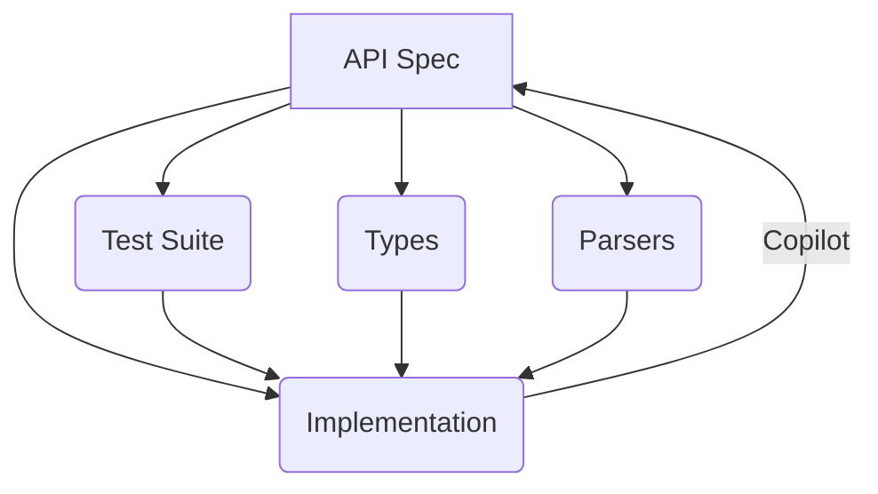

[Home](../index.md) > [🎤 Presentations](./index.md)  
# 🤝 Generating Reliable Systems  
  
---  
  

  
## 🗣️ Intentional Communication  
  
* Clear Intent  
* Specification = Shared Language  
  
---  
  
## ⚡ Rapid Feedback  
  
* Fast Feedback  
* Confidence in Contribution  
  
---  
  
## 📈 Scaling Collaboration  
  
* Team Expansion  
* Reduced Integration Issues  
  
---  
  
## 🔗 Monorepo Multiplier  
  
* Code Proximity  
* Accelerated Development  
  
---  
  
## 👨‍💻 Collaborating with Compilers  
  
* Type Annotations  
* Explicit Intent  
  
---  
  
## 🛠️ Collaborating with Tools  
  
* Automated Testing  
* Instant Error Detection  
  
---  
  
## 🚀 Vision: Collaborative Future  
  
* Shared SDK  
* Collective Innovation  
  
---  
  
## ❓ Q & A  
  
* Open Discussion  
* Collaborative Ideas  
  
