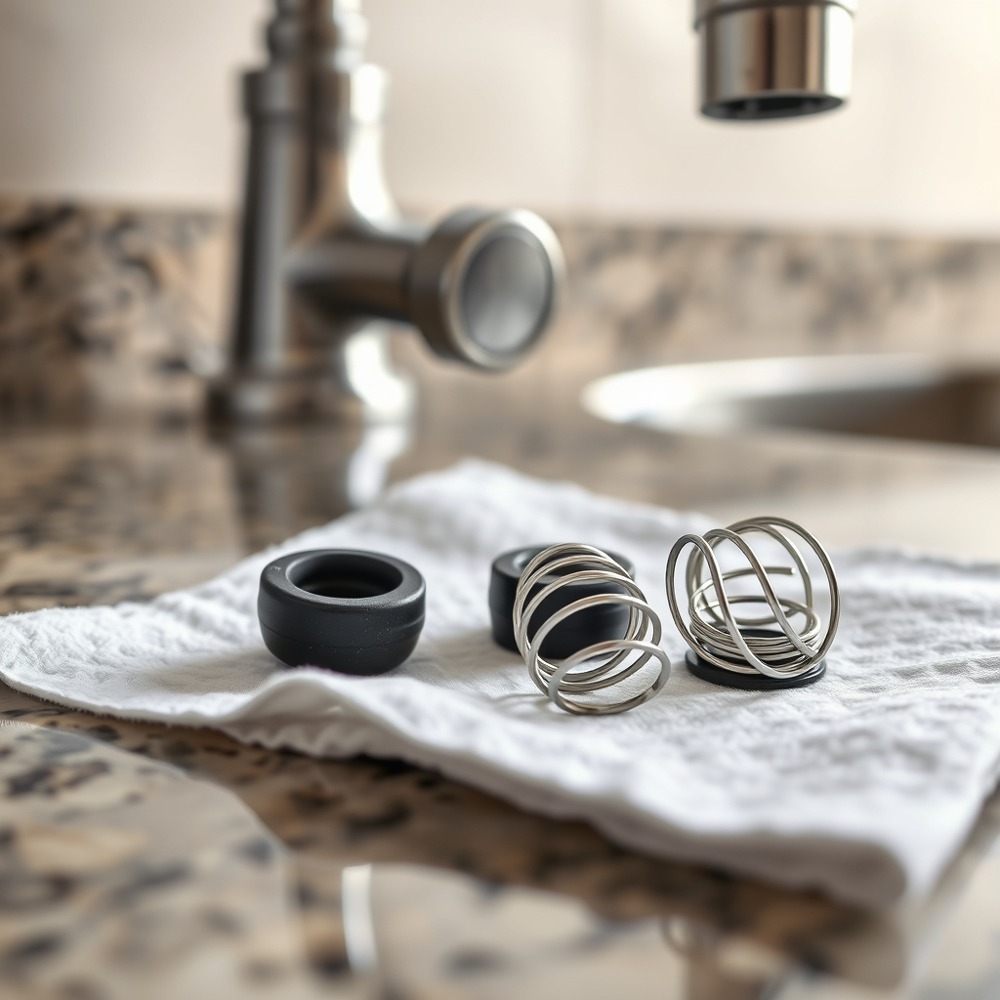

[Home](../index.md) > [Products](./index.md)  
# 🚰💧⚙️🔧 Delta Faucet RP4993 Seats and Springs  
  
[🛒 Delta Faucet RP4993 Seats and Springs. As an Amazon Associate I earn from qualifying purchases.](https://amzn.to/4a4Lrpm)  
  
🛠️ The Delta RP4993 is a foundational 🔧 repair kit designed to resolve 💧 dripping or 🚰 leaking issues in Delta faucets. It serves as an 🏷️ OEM (Original Equipment Manufacturer) replacement for worn internal 🔩 seals.  
  
### 📋 Product Overview  
  
- 📦 **Components:** Each kit contains 2️⃣ two (2) rubber seats and 2️⃣ two (2) metallic springs.  
- 🎯 **Primary Function:** Provides a 🛡️ watertight seal against the faucet’s ⚪ ball valve or 📍 stem, preventing 💧 spout drip.  
- 🏗️ **Materials:** 🖤 High-grade resilient rubber (seats) and ⛓️ corrosion-resistant stainless steel (springs).  
  
### ⚙️ Technical Specifications  
  
- 🔄 **Compatibility:** Designed for Delta 🚰 single-handle and 👐 two-handle faucets featuring 🥈 stainless steel ball valves or Delex models.  
- 📏 **Installation Height:** Approximately 📐 **5/16-inch**.  
- ⚖️ **Weight:** ⚖️ 0.10 lbs.  
- 📜 **Warranty:** 🛡️ Delta Faucet Limited Lifetime Warranty.  
  
### 📈 Performance & User Insights  
  
- ✅ **Reliability:** Rated ⭐ **4.7/5 stars** by consumers; frequently cited as the 🛠️ definitive fix for faucets that 💧 drip unless the handle is perfectly centered.  
- ⏱️ **Ease of Use:** A typical 👷 DIY installation takes ⏳ **15–30 minutes**.  
- 💰 **Cost-Effectiveness:** Retails between 💵 **$6.00 and $10.00**, significantly cheaper than 🔄 replacing a full faucet assembly.  
- ⚠️ **Common Issue:** Users often mistake 🚫 generic aftermarket kits for RP4993; however, 💎 OEM parts are noted for better 📏 fitment and ⏳ longevity.  
  
## 📚 Book Recommendations  
  
### 🔍 Similar: 🛠️ Technical & Practical Guides  
  
- [🏠🛠️ Home Improvement 1-2-3: Expert Advice from the Home Depot](../books/home-improvement-1-2-3-expert-advice-from-the-home-depot.md)  
- 📖 **Ultimate Guide: Plumbing (Creative Homeowner):** Like the RP4993, this is the 🏛️ OEM part of home libraries. It provides 🪜 step-by-step instructions for over 800 projects, including the 🚰 specific faucet repairs where these 🔩 seats and springs are utilized.  
- 🏠 **How Your House Works by Charlie Wing:** A 🖼️ visual breakdown of domestic systems. If the RP4993 is the 🛠️ how, this book is the 💡 why, using 🖋️ detailed illustrations to show how 🌊 water pressure and 🔩 seals interact.  
  
### 🌍 Contrasting: The Macro Perspective  
  
- 🌊 **The Big Thirst by Charles Fishman:** While the RP4993 addresses a 💧 single leak, Fishman explores our 🌐 global relationship with water. It shifts the 🔍 focus from fixing a 🚰 drip in a sink to the 🏗️ massive, often invisible infrastructure that brings water to that sink.  
- 🏜️ **Cadillac Desert by Marc Reisner:** A 🏛️ classic work of environmental history. Instead of the 🔍 micro-mechanics of a kitchen faucet, it examines the 🚜 plumbing of the American West - the 🧱 dams and 🌊 diversions that shaped a continent.  
  
### 🎨 Creative: 🧘 Philosophical & 📖 Literary Flow  
  
- 🎣 **The River Why by David James Duncan:** A 🧒 coming-of-age novel that uses the 🌊 flow of water as a 🕯️ metaphor for the search for meaning. It’s for the 👷 DIYer who finds a sense of 🧘 Zen in the steady, quiet 🎶 rhythm of a perfectly repaired tap.  
- 🚽 **Flushed: How the Plumber Saved Civilization by W. Hodding Carter:** A 😆 witty, 🏛️ historical deep-dive into the evolution of sanitation. It treats the 👨‍🔧 humble plumber (and the 🔩 parts they use, like the RP4993) as the 🦸 unsung heroes of human health and progress.  
  
## 💬 Gemini Prompt (gemini-3.0-flash)  
> Write a markdown-formatted (start headings at level H2) product report for Delta Faucet Delta Faucet RP4993 Seats and Springs. Follow this with similar, contrasting, and creatively related book recommendations. Be thorough in content discussed but concise and economical with your language. Structure the report with section headings and bulleted lists to avoid long blocks of text.