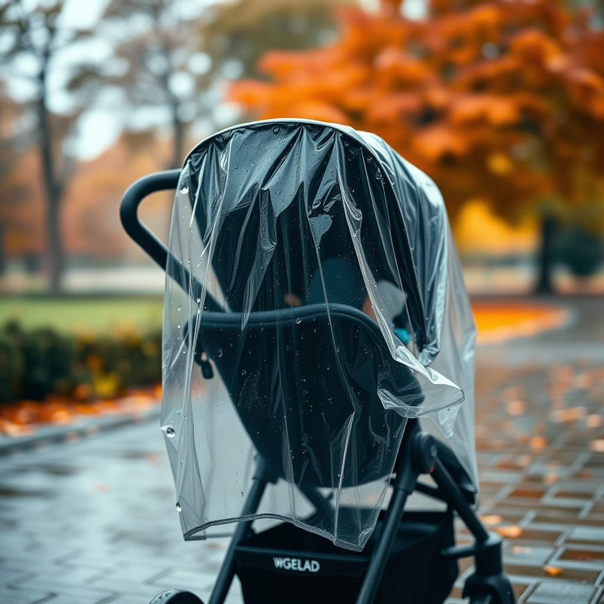

[Home](../index.md) > [Products](./index.md)  
# 👶🌧️💨 Graco Baby Jogging Stroller Universal Rain Cover, Ventilated Weather Shield, Waterproof, Windproof, Versatile Size to Fit Most Jogging Strollers, Vinyl, Clear, Plastic  
  
[🛒 Graco Baby Jogging Stroller Universal Rain Cover, Ventilated Weather Shield, Waterproof, Windproof, Versatile Size to Fit Most Jogging Strollers, Vinyl, Clear, Plastic. As an Amazon Associate I earn from qualifying purchases.](https://amzn.to/4grnWID)  
  
## 📝🐒 Human Notes  
- For my [👶🏃🌆 Thule Urban Glide 3](./thule-urban-glide-3.md)  
- 👍 Fits great; no issues after first run in light rain.  
  
## 🛍️📋 Product Report: Graco Baby Jogging Stroller Universal Rain Cover  
  
### 👶 Product Overview  
🌧️ The Graco Baby Jogging Stroller Universal Rain Cover is a clear vinyl weather shield designed to protect a child from the elements while in a jogging stroller. 🚼 Its universal fit is meant to accommodate most jogging stroller makes and models. 🛡️ The shield is marketed as being waterproof, windproof, and ventilated for comfort.  
  
### ✨ Key Features  
* ⚙️ **Universal Fit:** Designed to fit most single jogging strollers, not specific to a single Graco model.  
* ☔ **Weather Protection:** Offers a full barrier against rain, snow, wind, and cold.  
* 💨 **Ventilation:** Features netting or air holes on both sides to ensure proper airflow and prevent condensation.  
* 👀 **Visibility:** Made from clear, high-transparency vinyl, allowing parents to see the child and the child to see their surroundings.  
* ✅ **Ease of Use:** Simple to install and remove, with no complex setup.  
* 🎒 **Additional Features:** Some versions include a convenient storage pocket for small essentials.  
  
### 📊 Performance & User Experience  
* 👍 **Pros:**  
    * ☔ Effective at keeping the child dry and protected from wind.  
    * 👜 Easy to fold and store, making it convenient for on-the-go use.  
    * 👓 The clear material is a key feature, providing good visibility.  
    * 💰 Generally considered an affordable and practical accessory.  
* 👎 **Cons:**  
    * 💔 Durability can be an issue, with some reviews mentioning the material can be prone to tearing or falling apart with light use over time.  
    * 🌬️ The universal fit may be loose on some strollers, making it less secure in windy conditions.  
    * 🥴 Some users have noted that the cover can feel "rickety" or "cheap."  
    * 🌫️ While it has ventilation, some users mention it can fog up in certain weather.  
  
### 📚 Book Recommendations  
  
#### ➕ Similar  
* **[👨‍🚀🔴✨ The Martian](../books/the-martian.md)** **by Andy Weir:** 🛡️ This book mirrors the rain cover's function by focusing on creating a sealed, protected habitat for survival against a hostile environment.  
* 🛸 **[➡️🌌🚀😡 A Long Way to a Small, Angry Planet](../books/a-long-way-to-a-small-angry-planet.md)** **by Becky Chambers:** A novel about a spaceship crew, the ship itself acts as a weather shield, creating a safe, traveling bubble for its inhabitants against the vacuum of space.  
* 🚂 **The Boxcar Children** **by Gertrude Chandler Warner:** 🏠 This story highlights resourceful children who create their own shelter, a boxcar, to provide a safe, mobile home, much like the Graco cover creates a safe, mobile space.  
  
#### ➖ Contrasting  
* 🏜️ **The Road** **by Cormac McCarthy:** A stark contrast, this book portrays a world with no protection from the elements, emphasizing vulnerability and a complete lack of manufactured safety.  
* 🏞️ **Into the Wild** **by Jon Krakauer:** 🌲 This nonfiction book details a man's quest to abandon modern conveniences and face nature unprotected, directly contrasting the purpose of a protective rain shield.  
* 🏝️ **Robinson Crusoe** **by Daniel Defoe:** Crusoe is initially exposed to the elements, but his journey is about gradually building shelter and a protected life on a deserted island, showing a slow progression from vulnerability to protection.  
  
#### ✨ Creatively Related  
* **[🤴 The Little Prince](../books/the-little-prince.md)** **by Antoine de Saint-Exupéry:** 🔮 The prince places a glass dome over his rose, protecting it from the harshness of his tiny planet - a direct metaphor for the rain cover protecting a precious, fragile being.  
* 🌳 **The Giving Tree** **by Shel Silverstein:** ❤️ This book relates creatively through its theme of a protector (the tree) offering a part of itself (its leaves, trunk) to shelter and support another being (the boy), similar to the cover shielding a child.  
* ☔ **The Umbrella by Stephenie Alexander:** A children's book that personifies a simple umbrella, celebrating its role in providing protection, comfort, and security against the rain - the exact function of the Graco rain cover.  
  
## 💬 Gemini Prompt (gemini-2.5-flash)  
> Write a markdown-formatted (start headings at level H2) product report for Thule Urban Glide 3. Follow this with similar, contrasting, and creatively related book recommendations. Be thorough in content discussed but concise and economical with your language. Structure the report with section headings and bulleted lists to avoid long blocks of text.