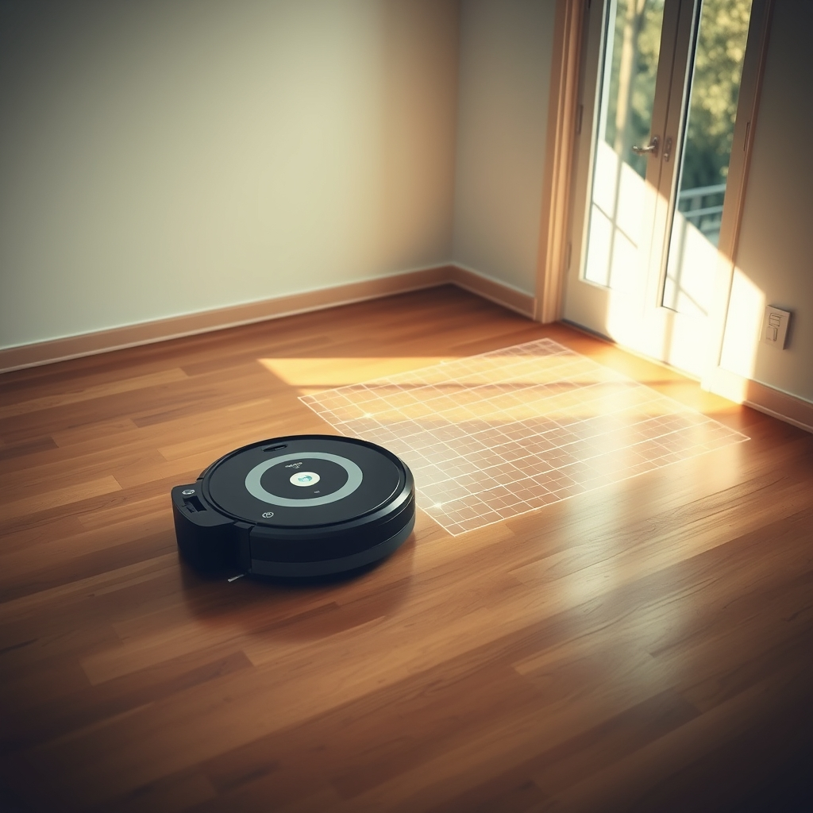

[Home](../index.md) > [Products](./index.md)  
# 🤖🧹🧼🗺️ iRobot Roomba Plus 505 Combo Robot Vacuum & Mop with AutoWash Dock - Extending Spinning Mop Pads, Self-Empties, Pad Wash & Heated Drying, Self-cleaning, Recognizes & Avoids Obstacles, LiDAR Navigation  
  
[🛒 iRobot Roomba Plus 505 Combo Robot Vacuum & Mop with AutoWash Dock - Extending Spinning Mop Pads, Self-Empties, Pad Wash & Heated Drying, Self-cleaning, Recognizes & Avoids Obstacles, LiDAR Navigation. As an Amazon Associate I earn from qualifying purchases.](https://amzn.to/3Km3ywO)  
  
## 🤖 Product Report: iRobot Roomba Plus 505 Combo  
  
### 🧹 Core Cleaning Technology  
  
* ⚙️ **Dual Functionality:** Offers both powerful vacuuming and active mopping. 💨 Cleaning modes include vacuum-only, mop-only, vacuum then mop, or combination simultaneous cleaning.  
* 💪 **Suction Power:** Provides strong, power-lifting suction, reportedly up to 70x stronger than older Roomba 600 series models, which automatically increases on carpeted areas (CarpetBoost). ⬆️  
* 🧽 **Mopping System:** Utilizes DualClean Spinning Mop Pads that extend outward, known as PerfectEdge technology, to reach corners and along walls, improving edge-to-edge coverage by an estimated 18%. 📐  
* ✨ **SmartScrub:** Applies increased downward pressure and scrubbing motion for tackling tougher, dried-on messes.  
* ↔️ **Multi-Surface Cleaning:** Features dual multi-surface rubber brushes for effective debris extraction and an auto pad lift mechanism to raise the mop pads (up to 10mm) when transitioning onto carpeted floors, preventing dampening. ↕️  
  
### 🧭 Navigation and Intelligence  
  
* 🗺️ **LiDAR Mapping (ClearView Pro LiDAR):** Employs LiDAR technology for expert, real-time mapping of the home, allowing for efficient, systematic cleaning in neat rows and comprehensive coverage day or night. 🌃  
* ⚠️ **Obstacle Avoidance (PrecisionVision AI):** Uses artificial intelligence and specialized sensors to immediately recognize and intelligently navigate around common household hazards, including cords, socks, shoes, and pet waste. 💩  
* 🎯 **Dirt Detection:** The robot prioritizes areas that are identified as getting dirty fastest, allowing it to adapt its cleaning settings and intensity for a deeper clean where needed.  
* 📱 **Smart Home Integration:** The system is compatible with Matter smart home capabilities, allowing voice control integration with devices like Alexa, Google Assistant, and Siri. 🗣️  
  
### 🧼 AutoWash Dock Features  
  
The AutoWash Dock is the defining feature, providing a hands-off, closed-loop cleaning cycle for both the robot and the mop pads.  
  
* 🗑️ **Self-Emptying:** Automatically transfers collected dust and debris from the robot's bin into a disposable bag housed in the dock, offering up to 75 days of maintenance-free vacuum emptying.  
* 💧 **Pad Washing and Drying:** The robot returns to the dock to wash its mop pads mid-mission and upon completion. ⛲ The dock contains clean and dirty water tanks, and uses a continuous cycle to refresh and clean the pads.  
* 🔥 **Heated Drying:** After washing, the dock utilizes heated air to thoroughly dry the mop pads, preventing mildew, odors, and bacterial growth.  
* ♻️ **Self-Cleaning:** The dock is designed with self-cleaning cycles to maintain its own wash basin and components.  
  
## 📚 Recommended Reading  
  
### 💡 Similar and Related Themes  
  
These books explore technology, automation, and the nature of the modern home.  
  
* **[🤖📈 The Second Machine Age: Work, Progress, and Prosperity in a Time of Brilliant Technologies](../books/the-second-machine-age-work-progress-and-prosperity-in-a-time-of-brilliant-technologies.md):** Examines how digital technology and automation are fundamentally reshaping the economy and society, mirroring the robot's role as a high-tech domestic worker.  
* 🔒 **The Glass Cage Automation and Us:** A detailed analysis of the subtle ways automation affects human skill, judgment, and engagement, relevant to the hands-off experience of using a fully automated cleaning system.  
* 🚀 **The Diamond Age or a Young Lady's Illustrated Primer:** A science fiction novel that explores nanotechnology, ubiquitous computing, and personalized learning environments, reflecting a hyper-automated future where technology manages domestic and educational needs.  
  
### ⚖️ Contrasting Perspectives  
  
These books offer a counterbalance by focusing on manual labor, simplicity, or the human connection to physical tasks.  
  
* **[🛠️💖 Shop Class as Soulcraft: An Inquiry Into the Value of Work](../books/shop-class-as-soulcraft-an-inquiry-into-the-value-of-work.md):** A philosophical meditation that champions the tangible satisfaction and intellectual rewards of skilled manual labor, contrasting sharply with the automated ease of a robot vacuum.  
* 🏞️ **Walden:** Henry David Thoreau's classic text emphasizing simple living and self-sufficiency in natural surroundings, a direct philosophical opposite to the pursuit of high-tech, convenience-based home management.  
* 👩‍🌾 **The Dirty Life A Memoir of Farming Food and Love:** A non-fiction account of farming and the physical, strenuous work required to produce food, highlighting the human effort inherent in tasks that the Roomba is designed to eliminate.  
  
### 🎬 Creatively Related Fiction  
  
These works of fiction feature robot servants, complex automated systems, or the blurring lines between man and machine.  
  
* 🤖 **I Robot:** A collection of short stories by Isaac Asimov that established the foundation of robotics laws and explored the complicated social and ethical relationship between humans and their robotic assistants, a direct antecedent to modern domestic robots.  
* 🚀 **The Martian Chronicles:** Ray Bradbury’s collection featuring stories of Earth's colonization of Mars, often depicting abandoned, automated houses that continue performing their functions long after their owners are gone, a haunting vision of domestic automation's persistence. 🏚️  
* 🐑 **Do Androids Dream of Electric Sheep:** Philip K Dick's work where the question of what constitutes life and consciousness is central, relating to the advanced AI and decision-making capabilities of complex modern devices. 🤖🧠  
  
## 💬 Gemini Prompt (gemini-2.5-flash)  
> Write a markdown-formatted (start headings at level H2) product report for "iRobot Roomba Plus 505 Combo Robot Vacuum & Mop with AutoWash Dock - Extending Spinning Mop Pads, Self-Empties, Pad Wash & Heated Drying, Self-cleaning, Recognizes & Avoids Obstacles, LiDAR Navigation". Follow this with similar, contrasting, and creatively related book recommendations. Never quote or italicize titles. Be thorough in content discussed but concise and economical with your language. Structure the report with section headings and bulleted lists to avoid long blocks of text. Respond with text only - do not use a canvas!!