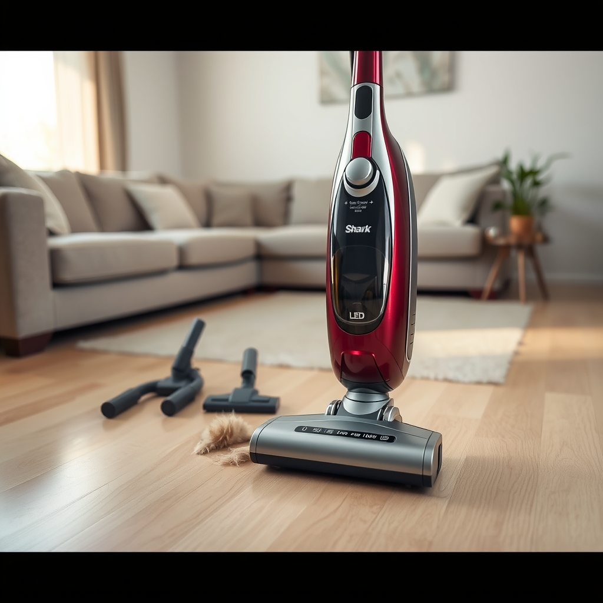

[Home](../index.md) > [Products](./index.md)  
# 🦈🔦🐈✨🧹 Shark HV322 Rocket Pet Plus Corded Stick Vacuum with LED Headlights, XL Dust Cup, Lightweight, Perfect for Pet Hair Pickup, Converts to a Hand Vacuum, with (2) Pet Attachments, Bordeaux, Silver  
  
[🛒 Shark HV322 Rocket Pet Plus Corded Stick Vacuum with LED Headlights, XL Dust Cup, Lightweight, Perfect for Pet Hair Pickup, Converts to a Hand Vacuum, with (2) Pet Attachments, Bordeaux, Silver. As an Amazon Associate I earn from qualifying purchases.](https://amzn.to/3XX4YAV)  
  
## 🤖 AI Summary  
  
🧹 The Shark HV322 Rocket Pet Plus is an ultra-lightweight, versatile corded stick vacuum designed for comprehensive cleaning, particularly effective at managing pet hair 🐾 across multiple surfaces.  
  
### 🌟 Key Features  
  
* ⚖️ **Ultra-Lightweight Design:** Weighs less than 10 lbs, making it easy to maneuver and carry for floor-to-ceiling cleaning.  
* 🔄 **2-in-1 Versatility:** Easily converts from an upright stick vacuum to a powerful handheld vacuum.  
* 🐕 **Pet Hair Focus:** Engineered for powerful pet hair pickup on both deep carpets and bare floors.  
* 🗑️ **XL Dust Cup Capacity:** Features a larger-capacity, easy-to-empty dust cup for extended cleaning without frequent emptying.  
* 💡 **Illumination:** LED Headlights on the nozzle help to reveal hidden dust, debris, and pet hair 🐾 on floors.  
* 🔌 **Corded Power:** Offers continuous, reliable power and consistent suction that does not fade, unlike cordless models.  
* 🤸 **Advanced Swivel Steering:** Provides excellent control for easy maneuvering around furniture and obstacles.  
* 👆 **Fingertip Controls:** Simple switch controls for seamless transition between hard floor and carpet cleaning modes.  
  
### 🛠️ Included Attachments  
  
🧹 The vacuum comes with accessories specifically tailored for pet owners and hard-to-reach areas:  
  
* (1) 🐾 **Pet Multi-Tool:** Designed to remove embedded pet hair and dirt from upholstery and stairs.  
* (1) 🕸️ **Duster Crevice Tool:** Offers extended reach into tight spaces and the ability to clean delicate surfaces.  
  
### 📊 Performance Summary  
  
* ✨ **Surface Cleaning:** Excels on bare floors (hardwood, tile) and low-pile carpet. Some users note it may struggle with very thick, high-pile carpet.  
* 🐕 **Pet Hair Pickup:** Widely praised for its strong suction and effectiveness in capturing stubborn pet hair 🐾 on all primary surfaces.  
* 🤸 **Maneuverability:** Highly rated due to its light weight and advanced swivel steering, allowing it to easily clean under furniture.  
* 🗄️ **Storage:** Does not stand upright on its own; storage options include detaching the hand vac or using the provided wall mount hook.  
  
## 📚 Book Recommendations  
  
### ➡️ Similar Focus: Efficient Cleaning and Organization  
  
* 🪄 The Life-Changing Magic of Tidying Up by Marie Kondō: Presents the KonMari Method for decluttering by category and only keeping items that "spark joy." Focuses on a once-in-a-lifetime tidying event for a perpetually clean space.  
* 🤯 How to Manage Your Home Without Losing Your Mind by Dana K White: Provides a realistic, "messy-friendly" approach to cleaning 🧼 and decluttering, focusing on small, habitual steps and overcoming feelings of overwhelm.  
* 🏠 Home Comforts The Art and Science of Keeping House by Cheryl Mendelson: A comprehensive, traditional guide covering every aspect of housekeeping, treating it as an essential, skilled activity.  
  
### ↔️ Contrasting Theme: The Joy of Mess and the Weight of Possessions  
  
* [🧹🌊😵‍💫 How to Keep House While Drowning: A Gentle Approach to Cleaning and Organizing](../books/how-to-keep-house-while-drowning.md) by KC Davis: Offers a non-judgmental, compassionate perspective on cleaning, emphasizing that a home is a tool to serve you, not the other way around. Rejects shame associated with a messy house.  
* 🧽 The Gentle Art of Swedish Death Cleaning by Margareta Magnusson: A charming, practical guide on "death cleaning," the process of tidying up one's belongings for the benefit of family, contrasting the immediate functional cleanup with a lifelong, mindful decluttering.  
* 🗑️ Goodbye, Things The New Japanese Minimalism by Fumio Sasaki: Explores the philosophy of radical minimalism, arguing that by reducing possessions, you reduce the need for *things* like a powerful vacuum 🧹, thereby gaining true freedom.  
  
### 💡 Creatively Related: Living Harmoniously with Animals  
  
* 🧠 Inside of a Dog What Dogs See, Smell, and Know by Alexandra Horowitz: A fascinating deep dive into a dog's sensory world and cognition, adding context to the source of the pet hair 🐾 a vacuum must tackle.  
* 🐶 All Creatures Great and Small by James Herriot: A classic memoir series about the life of a country veterinarian, offering a humorous and heartwarming look at the messy, joyous reality of caring for animals 🐕.  
* 🐾 Don't Shoot the Dog The New Art of Teaching and Training by Karen Pryor: Discusses positive reinforcement training principles, connecting the concept of maintaining a clean home 🏡 with the disciplined, consistent effort needed to maintain a well-behaved pet 🐕.  
  
## 💬 Gemini Prompt (gemini-3.0-flash)  
> Generate a markdown-formatted (start headings at level H2) product report for "Shark HV322 Rocket Pet Plus Corded Stick Vacuum with LED Headlights, XL Dust Cup, Lightweight, Perfect for Pet Hair Pickup, Converts to a Hand Vacuum, with (2) Pet Attachments, Bordeaux/Silver". Follow this with similar, contrasting, and creatively related book recommendations. Never quote or italicize titles. Be thorough in content discussed but concise and economical with your language. Structure the report with section headings and bulleted lists to avoid long blocks of text.