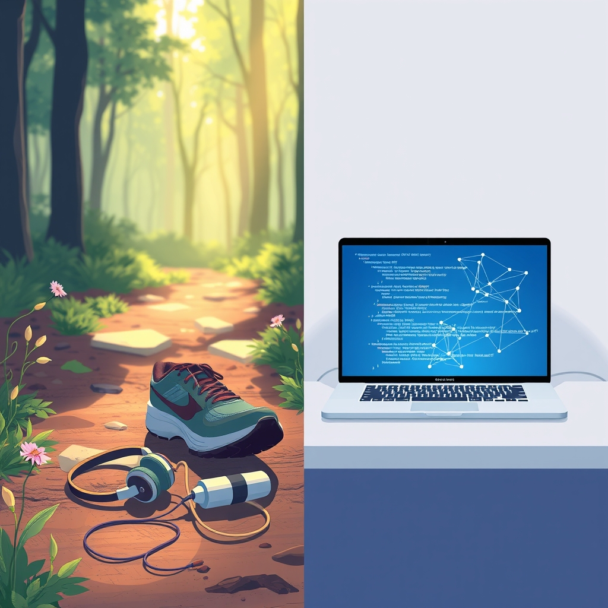

[Home](../index.md) > [Reflections](./index.md) | [⏮️](./2024-05-01.md) [⏭️](./2024-05-08.md)  
# 2024-05-02 | 🏃🏼‍♀️ Running | ⌨️🏋🏼‍♀️ Meta Practice 🪞  
  
## 🏃 Running  
🎉 I went for a run today!  
👟 I recently bought new shoes,  
🎧 new headphones,  
⌚ and a new FitBit...  
🦗 And then weeks passed...  
📱 Yesterday I revived my old Galaxy S4 to listen to audio books while running.  
🥇 Today is the first day I've used them!  
😈 Sure, running often feels like torture...  
🖼 But it was a beautiful day!  
🐇🐿🐦‍⬛🐕 Shared with plenty of wildlife,  
🌳🌹🌻🪻 and beautiful plant life.  
🎯 Next challenge: make it habitual.  
  
## 🏋 Practice  
💻 I've been practicing for upcoming job interviews.  
🔗 A recruiter shared a few useful links with me to help prepare.  
🤖 [Meta AI](https://www.meta.ai) is a chat bot like Chat GPT.  
🎮 [CodinGame](https://www.codingame.com) is... wait for it... a _game_ that teaches _coding_!  
