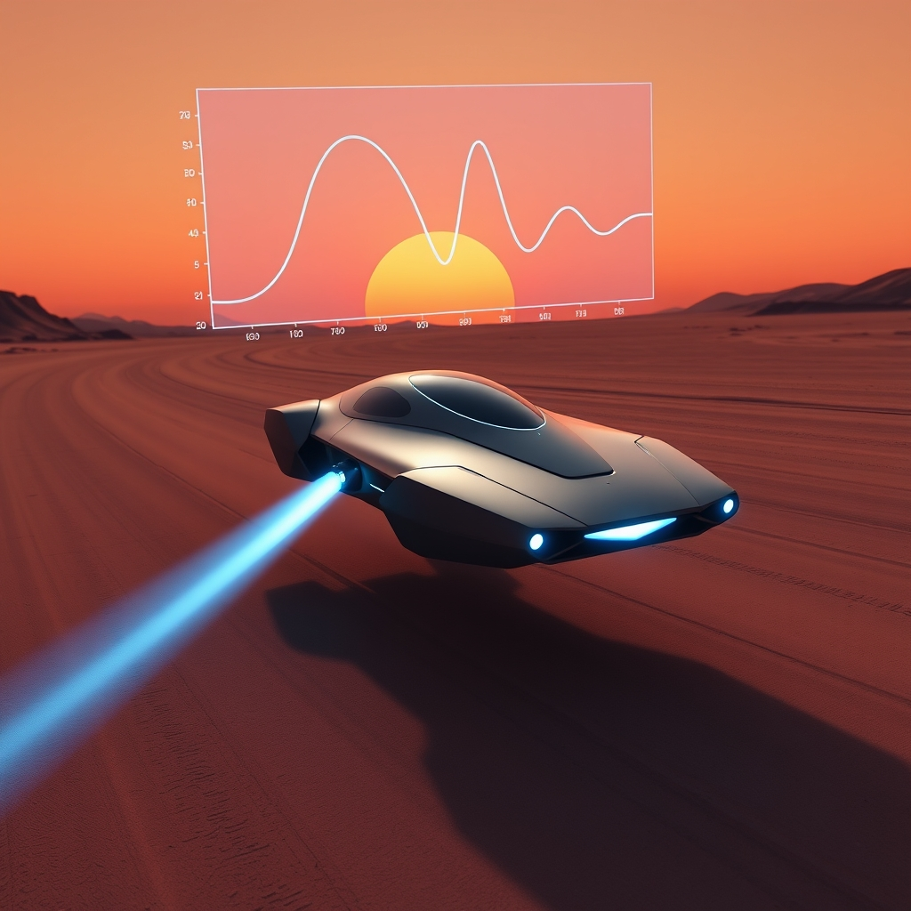

[Home](../index.md) > [Reflections](./index.md) | [⏮️](./2024-05-13.md) [⏭️](./2024-05-19.md)  
# 2024-05-18 | 🕹️ PID 🫛 Pod 🏁 Racer  
  
## ⌨️🕹️ CodinGame: [Mad Pod Racing](https://www.codingame.com/multiplayer/bot-programming/mad-pod-racing)  
- 🎉 Exciting!  
- 💡 I was very interested when I learned about [PID controllers](https://en.m.wikipedia.org/wiki/Proportional-integral-derivative_controller) in college, but I've never gotten around to implementing one.  
- 🚀 I've finally found an application that's literally asking for it!  
- 🤖 I wrote a simple, intuitive control algorithm to drive my bot last night.  
- 👍 I'm impressed with the performance of such a similar algorithm!  
- 🧠 But I'm excited to apply some rigor and see how much juice we can squeeze from theory.  
- 📺 I revisit one of my favorites YouTube channels for a refresher on [PID application](https://youtu.be/XfAt6hNV8XM)  
- ⚙️ PID controllers are nice because they are simple and effective.  
- 📝 We just need to determine a couple of modeling assumptions to get started.  
- 🎯 A PID controller aims to minimize an error signal by manipulating a control variable.  
- 💪 For this application, a good initial choice for the control variable is obvious: thrust!  
- 🤔 Deciding on an error signal to minimize is more nuanced.  
- 📐 In my intuitive control algorithm, I used the angle between my pop's aim and the next checkpoint as a sort of error signal.  
- 📉 I reduce the thrust proportionally to this angle.  
- ➡️ If the angle is zero, we're pointed at the target, so it's full speed ahead!  
- 🐢 If there's a big angle between our pod's aim and the checkpoint, we're not headed in the right direction, so we may want to slow down.  
- 💭 That was my thinking anyway.  
- 🏁 I suspect there may be better choices for error signals, as the point of a race isn't just to point in the right direction.  
- ✅ But I think this will serve as a good enough starting point while we implement our first PID controller!  
- 🔄 We can always iterate and tune when we have the infrastructure in place.  
- ➡️ Also, I suspect that my intuitive algorithm is basically a propotional controller (the P in PID) and it works pretty well already.  
- 🚀 Let's see how much it improves with the addition of integral and derivative signals (I and D, respectively).  
  
🔍 A Google search led me to a nice, simple [reference implementation](https://softinery.com/blog/implementation-of-pid-controller-in-python) to get started.  
```python  
def PID(Kp, Ki, Kd, setpoint, measurement):  
    global time, integral, time_prev, e_prev  
  
    # Value of offset - when the error is equal zero  
    offset = 320  
      
    # PID calculations  
    e = setpoint - measurement  
          
    P = Kp*e  
    integral = integral + Ki*e*(time - time_prev)  
    D = Kd*(e - e_prev)/(time - time_prev)  
  
    # calculate manipulated variable - MV   
    MV = offset + P + integral + D  
      
    # update stored data for next iteration  
    e_prev = e  
    time_prev = time  
    return MV  
```  
  
- 🚀 An easy read at 11 lines of Python!  
- ⏱️ This should only take a few minutes to translate, and maybe a ⏳ a half hour or so to get up and running in our 🏎️ pod racer.