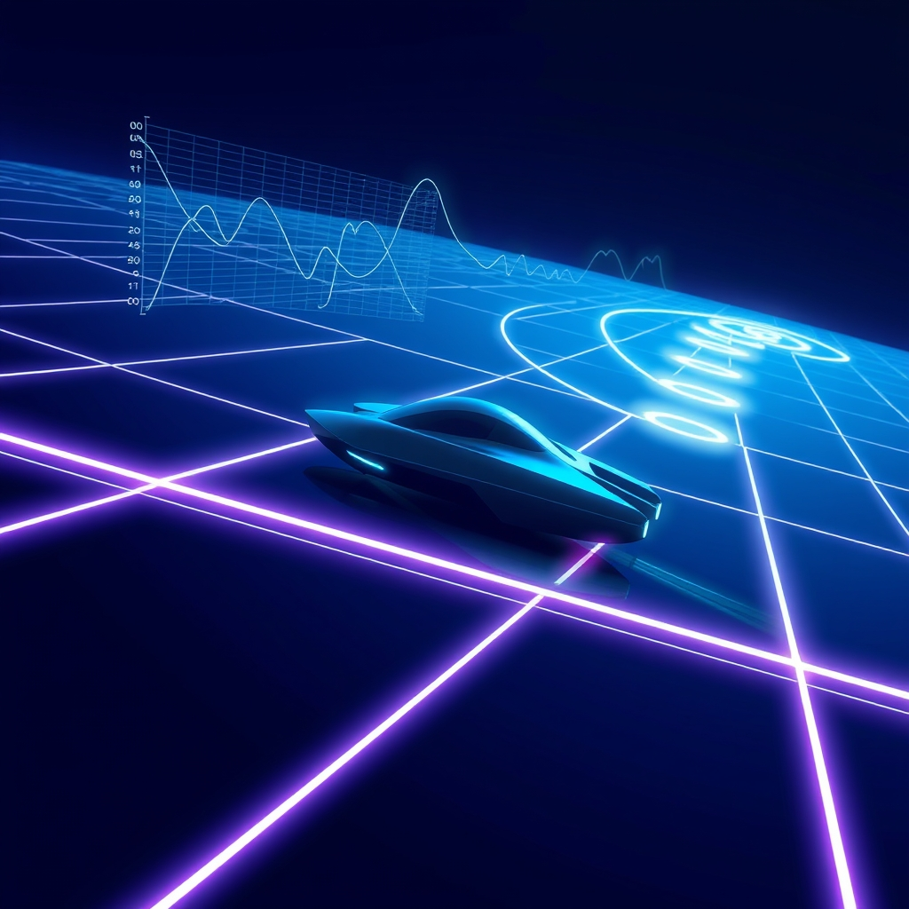

[Home](../index.md) > [Reflections](./index.md) | [⏮️](./2024-05-18.md) [⏭️](./2024-05-20.md)  
# 2024-05-19 | 🕹️ PID 🫛 Pod ➕ Plus 🪞⌨️  
  
## 🏎️ Pod Racing Continued  
- [Yesterday (2024-05-18 | 🕹️ PID 🫛 Pod 🏁 Racer)](./2024-05-18.md) I tried several iterations on my intuitive algorithm.  
- 📉 It seems that every added sophistication reduced overall performance.  
- 🤔 This shouldn't really be surprising.  
- 🧠 Optimization is often unintuitive.  
- 💡 While I can intuit and implement a strategy, it's hard to improve the overall performance without an explicit objective function.  
- ✅ Tractable optimization problems often take the form: minimize (or maximize) a single value under some constraints.  
- ☝️ Having a single optimization variable is important.  
- 🤯 Attempting to optimize multiple values simultaneously is _much_ more difficult.  
- 🚫 It may be fair to say that it's often intractable or even impossible.  
- 🌱 So when we're tempted to optimize multiple values simultaneously, it can be fruitful to pick the objective we care most about and transform the others into constraints.  
- 💰 For example, if we want to simultaneously minimize the duration and cost of a project, we might instead minimize duration under the constraint that cost stays below some threshold.  
- 🏁 In this case, I think our optimization problem is something like: minimize time to complete the race under the constraint that we pass through every way point in the correct order.  
- ❓ This sounds nice. It seems like the most direction expression of our ultimate goal. But how do we solve it?  
- 🔨 A brute force approach could be to  
- 🗺️ generate all possible strategies to complete the race  
- 🗑️ delete every strategy that doesn't pass through all the checkpoints in the correct order  
- 🥇 pick the remaining strategy with the best time  
- 😫 This problem seems computationally intractable.  
- ❓ What even is a strategy to complete the race?  
- 🛣️ Maybe a strategy is a path around the map.  
- 🌌 Not only are there a very large number of possible paths, but we'd need to add a constraint that our pod can actually follow the path given the game's physics engine.  
  
- 💡 One step we could take toward tractability could be to reduce the vast search space with some simplifying assumptions.  
- ✨ Another approach could be to focus on solving a series of local optimization problems rather than a single global optimization problem.  
  
- 🤖 The first intuitive algorithm I implemented is essentially a series of local optimization problems.  
- 🎯 The implicit goals are to get to the next checkpoint as quickly as possible.  
- 🗣️ I say that's the implied goal, rather than an explicit goal, because the explicit strategy is to  
- 🧭 always aim at the next checkpoint  
- 💯 maintain 100% throttle reduced proportionally to the difference between our pod's heading and the next checkpoint  
- ⏱️ So it's not even explicitly optimizing for time to each checkpoint.  
- 📉 Expressed as an optimization problem, it would be more accurate to say we're minimizing error in trajectory to the next checkpoint.  
- 🤷 Honestly, I don't think it's technically even an optimization problem.  
- 👍 We really just have a heuristic: reduce throttle by an arbitrarily chosen factor that's proportional to the error in trajectory to the next checkpoint.  
- 💪 Despite the lack of rigor, this heuristic performed quite well for a while.  
- 🚀 So let's see if we can improve the performance with the use of PID controller.  
  
👨‍💻 Let's start by rewriting our sample Python code into TypeScript.  
  
```typescript  
type PIDParams = {  
  kp: number  
  ki: number  
  kd: number  
  measurement: number  
  setpoint: number  
  time: number  
}  
type PIDState = {  
  control: number  
  error: number  
  integral: number  
  time: number  
}  
const pid = ({ kp, ki, kd, measurement, setpoint, time }: PIDParams, s: PIDState): PIDState => {  
  const error = setpoint - measurement  
  const de = error - s.error  
  const dt = time - s.time  
  const p = kp * error  
  const i = s.integral + ki * error * dt  
  const d = kd * de / dt  
  const control = p + i + d  
  return {  
    control,  
    error,  
    integral,  
    time  
  }  
}  
```  
  
- 🚀 Now let's apply this function in our 🏎️ pod racing game.  
- 📏 Our measurement will be the 📐 angle between our pod's heading and the next 🏁 checkpoint.  
- 🎯 Our setpoint will be 0️⃣ zero, implying that we want our 🏎️ pod pointed at the next 🏁 checkpoint.  
- 🕹️ Our control variable will be the desired reduction in ⛽ throttle.