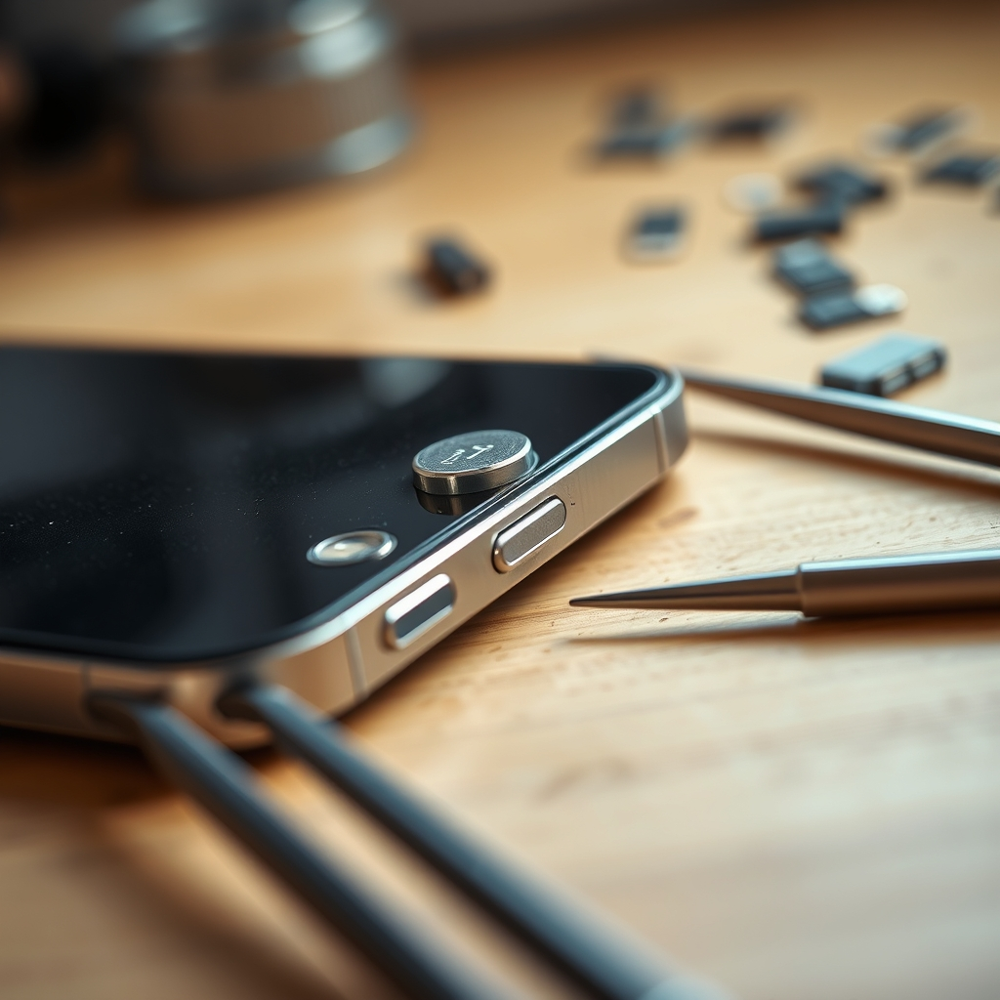

[Home](../index.md) > [Reflections](./index.md) | [⏮️](./2024-05-19.md) [⏭️](./2024-05-28.md)  
# 2024-05-20 | 🔘🔧 Button Fix 🪞  
  
## Fixing the power button on my ancient Galaxy S4  
🤔 Phone turned itself off  
⬛ Couldn't turn it back on.  
🔋 Pulling the battery out and putting it back in, it automatically tried to turn itself back on., but then goes black.  
👉🏻 Doing the same, but holding a volume key, it tries to enter recovery mode.  
❌ Power button was stuck.  
Found a [YouTube video](https://youtu.be/pqBgbN8NLjI)  
🪱 Squeezed the button and wiggled it around a bit.  
🎉 Fixed!  
